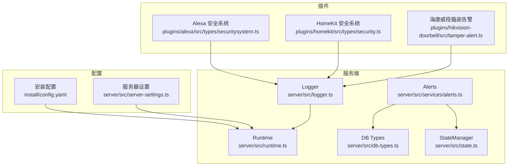
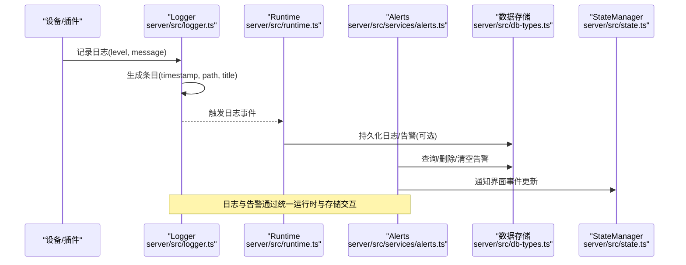
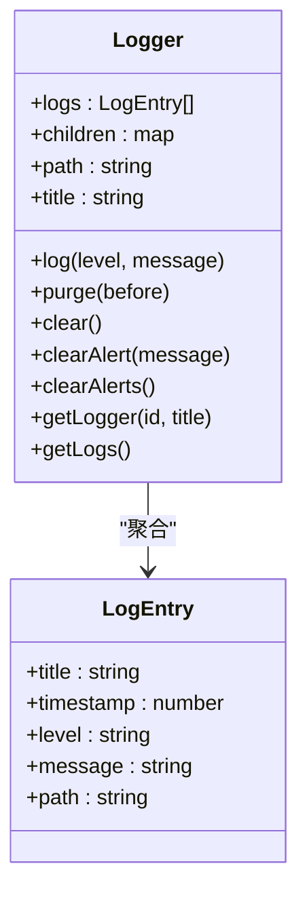
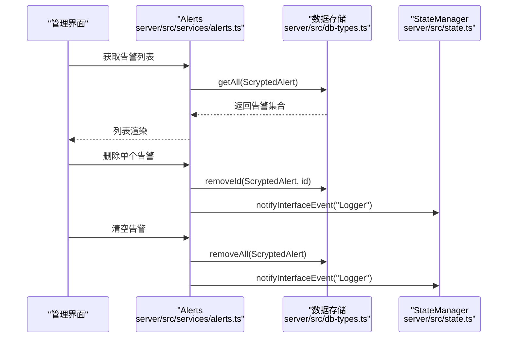
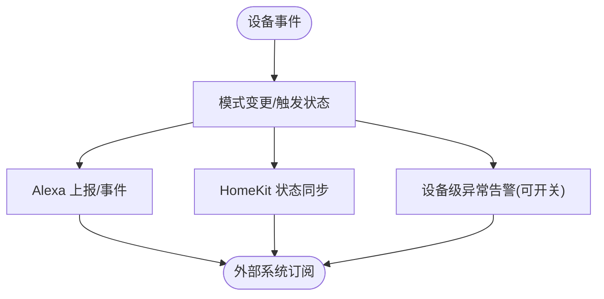
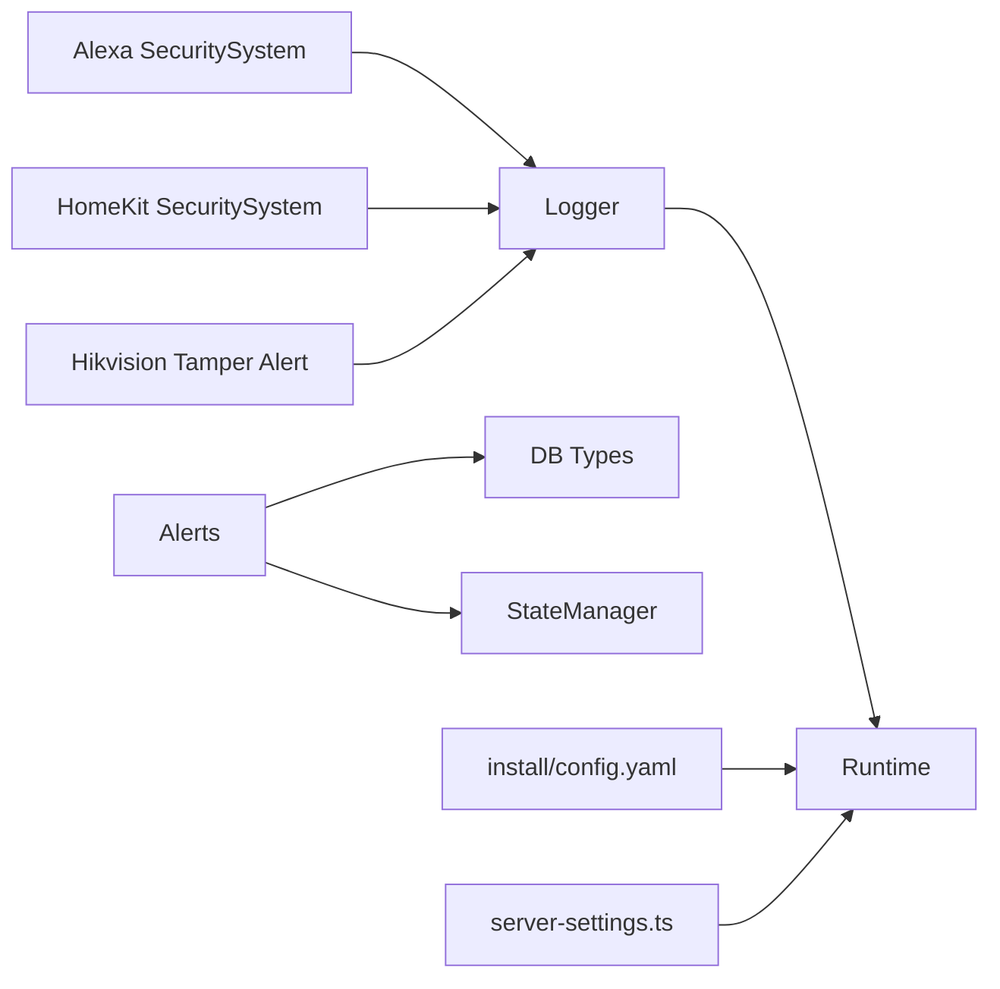

# 安全审计与监控

<cite>
**本文引用的文件**
- [logger.ts](file://server/src/logger.ts)
- [alerts.ts](file://server/src/services/alerts.ts)
- [securitysystem.ts](file://plugins/alexa/src/types/securitysystem.ts)
- [security.ts](file://plugins/homekit/src/types/security.ts)
- [tamper-alert.ts](file://plugins/hikvision-doorbell/src/tamper-alert.ts)
- [db-types.ts](file://server/src/db-types.ts)
- [runtime.ts](file://server/src/runtime.ts)
- [state.ts](file://server/src/state.ts)
- [server-settings.ts](file://server/src/server-settings.ts)
- [config.yaml](file://install/config.yaml)
</cite>

## 目录
1. [简介](#简介)
2. [项目结构](#项目结构)
3. [核心组件](#核心组件)
4. [架构总览](#架构总览)
5. [详细组件分析](#详细组件分析)
6. [依赖关系分析](#依赖关系分析)
7. [性能考量](#性能考量)
8. [故障排除指南](#故障排除指南)
9. [结论](#结论)
10. [附录](#附录)

## 简介
本指南面向 Scrypted 的安全审计与监控体系，聚焦以下目标：
- 日志管理：日志级别、轮转与存储优化
- 安全事件监控：登录与操作审计、异常行为检测
- 实时监控：系统指标、性能与安全威胁检测
- 告警机制：规则、通知渠道与升级策略
- 报表生成：访问统计、安全事件与合规检查
- 工具集成：第三方监控系统对接、自定义指标与可视化仪表板
- 最佳实践与故障排除

Scrypted 在服务端提供了统一的日志与告警基础设施，并通过插件生态支持多种安全设备与平台（如 Alexa、HomeKit），同时内置了针对特定设备（如海康威视）的异常告警能力。本指南将结合源码中的实现，给出可落地的配置建议与流程图示。

## 项目结构
围绕安全审计与监控的关键目录与文件：
- 服务端日志与告警：server/src/logger.ts、server/src/services/alerts.ts、server/src/db-types.ts、server/src/runtime.ts、server/src/state.ts
- 插件侧安全系统与告警：plugins/alexa/src/types/securitysystem.ts、plugins/homekit/src/types/security.ts、plugins/hikvision-doorbell/src/tamper-alert.ts
- 配置入口：install/config.yaml、server/src/server-settings.ts

**图表来源**
- [logger.ts:1-93](file://server/src/logger.ts#L1-L93)
- [alerts.ts:1-24](file://server/src/services/alerts.ts#L1-L24)
- [securitysystem.ts:1-180](file://plugins/alexa/src/types/securitysystem.ts#L1-L180)
- [security.ts:1-104](file://plugins/homekit/src/types/security.ts#L1-L104)
- [tamper-alert.ts:1-39](file://plugins/hikvision-doorbell/src/tamper-alert.ts#L1-L39)
- [db-types.ts](file://server/src/db-types.ts)
- [runtime.ts](file://server/src/runtime.ts)
- [state.ts](file://server/src/state.ts)
- [server-settings.ts](file://server/src/server-settings.ts)
- [config.yaml](file://install/config.yaml)

**章节来源**
- [logger.ts:1-93](file://server/src/logger.ts#L1-L93)
- [alerts.ts:1-24](file://server/src/services/alerts.ts#L1-L24)
- [securitysystem.ts:1-180](file://plugins/alexa/src/types/securitysystem.ts#L1-L180)
- [security.ts:1-104](file://plugins/homekit/src/types/security.ts#L1-L104)
- [tamper-alert.ts:1-39](file://plugins/hikvision-doorbell/src/tamper-alert.ts#L1-L39)
- [db-types.ts](file://server/src/db-types.ts)
- [runtime.ts](file://server/src/runtime.ts)
- [state.ts](file://server/src/state.ts)
- [server-settings.ts](file://server/src/server-settings.ts)
- [config.yaml](file://install/config.yaml)

## 核心组件
- 统一日志系统：提供日志条目结构、级别、路径与标题，支持子日志器聚合与排序，以及按时间清理。
- 告警管理：提供告警查询、删除与清空接口，并在变更时通知状态管理器。
- 设备安全系统：通过 Alexa 与 HomeKit 插件暴露安全面板模式与触发状态，便于外部系统订阅与联动。
- 设备级异常告警：以“撬装告警”为例，展示如何在设备侧启用/禁用告警并持久化状态。

**章节来源**
- [logger.ts:11-92](file://server/src/logger.ts#L11-L92)
- [alerts.ts:4-23](file://server/src/services/alerts.ts#L4-L23)
- [securitysystem.ts:18-179](file://plugins/alexa/src/types/securitysystem.ts#L18-L179)
- [security.ts:7-103](file://plugins/homekit/src/types/security.ts#L7-L103)
- [tamper-alert.ts:7-38](file://plugins/hikvision-doorbell/src/tamper-alert.ts#L7-L38)

## 架构总览
下图展示了从日志产生到告警处理与设备状态联动的整体流程。

**图表来源**
- [logger.ts:33-46](file://server/src/logger.ts#L33-L46)
- [alerts.ts:8-22](file://server/src/services/alerts.ts#L8-L22)
- [db-types.ts](file://server/src/db-types.ts)
- [runtime.ts](file://server/src/runtime.ts)
- [state.ts](file://server/src/state.ts)

## 详细组件分析

### 日志管理系统
- 日志条目结构：包含标题、时间戳、级别、消息与路径，便于分层与检索。
- 子日志器：支持按路径层级创建子日志器，事件向上冒泡，便于模块化管理。
- 清理策略：按时间阈值清理历史日志，避免无限增长。
- 输出与事件：控制台输出与事件发射，便于外部监听器接入。

**图表来源**
- [logger.ts:11-92](file://server/src/logger.ts#L11-L92)

**章节来源**
- [logger.ts:11-92](file://server/src/logger.ts#L11-L92)

### 告警机制
- 告警查询：遍历存储获取所有告警。
- 删除与清空：按单个或路径前缀批量删除。
- 状态同步：删除后通知状态管理器，驱动界面刷新。

**图表来源**
- [alerts.ts:8-22](file://server/src/services/alerts.ts#L8-L22)
- [db-types.ts](file://server/src/db-types.ts)
- [state.ts](file://server/src/state.ts)

**章节来源**
- [alerts.ts:4-23](file://server/src/services/alerts.ts#L4-L23)

### 安全事件监控（设备侧）
- Alexa 安全系统：将设备的安防模式与触发状态映射为 Alexa 属性，支持发现、状态上报与事件推送。
- HomeKit 安全系统：绑定 HomeKit 的当前/目标状态与模式，支持远程控制与联动。
- 撬装告警：设备级异常检测开关，持久化状态并在需要时展示说明文档。

**图表来源**
- [securitysystem.ts:78-178](file://plugins/alexa/src/types/securitysystem.ts#L78-L178)
- [security.ts:72-90](file://plugins/homekit/src/types/security.ts#L72-L90)
- [tamper-alert.ts:7-38](file://plugins/hikvision-doorbell/src/tamper-alert.ts#L7-L38)

**章节来源**
- [securitysystem.ts:18-179](file://plugins/alexa/src/types/securitysystem.ts#L18-L179)
- [security.ts:7-103](file://plugins/homekit/src/types/security.ts#L7-L103)
- [tamper-alert.ts:7-38](file://plugins/hikvision-doorbell/src/tamper-alert.ts#L7-L38)

### 实时监控与性能指标
- 日志事件监听：通过日志事件可构建实时监控面板，聚合不同模块日志。
- 告警事件监听：结合告警接口，实现告警看板与趋势分析。
- 性能指标：可通过日志中时间戳与模块路径进行吞吐与延迟分析；对高并发场景建议限制日志级别与采样率。

（本节为概念性说明，不直接分析具体文件）

### 安全威胁检测
- 异常行为：结合设备级告警（如撬装告警）与安全系统触发状态，建立阈值与规则。
- 登录与操作审计：通过日志记录用户操作与关键事件，配合告警实现异常登录与越权操作检测。

（本节为概念性说明，不直接分析具体文件）

### 告警规则、通知与升级
- 规则配置：基于日志级别、路径前缀与关键词匹配；对安全系统事件可按模式/触发状态触发。
- 通知渠道：通过日志事件与告警接口，对接邮件、Webhook、IM 等外部系统。
- 升级策略：设定重复告警抑制、分级升级与静默窗口。

（本节为概念性说明，不直接分析具体文件）

### 报表生成
- 访问统计：按日志路径与时间聚合访问次数与失败率。
- 安全事件：统计安全系统触发次数、设备异常告警分布。
- 合规检查：基于日志保留策略与告警留存，生成合规性报告。

（本节为概念性说明，不直接分析具体文件）

### 监控工具集成
- 第三方系统：通过日志事件与告警接口，将 Scrypted 数据接入 Prometheus/Grafana、ELK、Zabbix 等。
- 自定义指标：在日志中埋点关键业务指标，结合外部采集器导出。
- 可视化仪表板：使用 Grafana/Prometheus 或其他 BI 工具构建实时看板。

（本节为概念性说明，不直接分析具体文件）

## 依赖关系分析
- Logger 依赖 Runtime 提供的存储与事件通道，支持日志持久化与事件广播。
- Alerts 依赖数据存储类型与状态管理器，负责告警生命周期与界面通知。
- 插件安全系统通过设备接口与日志系统协同，形成跨平台的安全事件可观测性。
- 配置文件与服务器设置影响日志级别、保留策略与告警行为。

**图表来源**
- [logger.ts:26-31](file://server/src/logger.ts#L26-L31)
- [alerts.ts:5-6](file://server/src/services/alerts.ts#L5-L6)
- [db-types.ts](file://server/src/db-types.ts)
- [state.ts](file://server/src/state.ts)
- [securitysystem.ts:18-76](file://plugins/alexa/src/types/securitysystem.ts#L18-L76)
- [security.ts:14-16](file://plugins/homekit/src/types/security.ts#L14-L16)
- [tamper-alert.ts:12-15](file://plugins/hikvision-doorbell/src/tamper-alert.ts#L12-L15)
- [config.yaml](file://install/config.yaml)
- [server-settings.ts](file://server/src/server-settings.ts)

**章节来源**
- [logger.ts:1-93](file://server/src/logger.ts#L1-L93)
- [alerts.ts:1-24](file://server/src/services/alerts.ts#L1-L24)
- [securitysystem.ts:1-180](file://plugins/alexa/src/types/securitysystem.ts#L1-L180)
- [security.ts:1-104](file://plugins/homekit/src/types/security.ts#L1-L104)
- [tamper-alert.ts:1-39](file://plugins/hikvision-doorbell/src/tamper-alert.ts#L1-L39)
- [config.yaml](file://install/config.yaml)
- [server-settings.ts](file://server/src/server-settings.ts)

## 性能考量
- 日志级别控制：生产环境建议使用 INFO 或更高级别，减少 I/O 压力。
- 日志轮转与清理：利用 Logger 的 purge 能力按时间阈值清理，避免内存与存储膨胀。
- 事件监听开销：仅在必要时订阅日志事件，避免高频事件导致 CPU 占用。
- 告警去重：对外部系统推送前进行去重与合并，降低网络与存储压力。
- 存储容量规划：根据设备规模与日志量估算磁盘占用，设置合理的保留周期。

（本节为通用指导，不直接分析具体文件）

## 故障排除指南
- 日志未显示：确认日志级别与路径过滤，检查事件监听是否正确注册。
- 告警无法清除：检查数据存储连接与权限，确保删除接口调用成功并触发状态通知。
- 设备告警无效：核对设备状态持久化与开关逻辑，验证说明文档读取路径。
- 配置不生效：检查安装配置与服务器设置项，确认重启后加载顺序。

**章节来源**
- [logger.ts:48-62](file://server/src/logger.ts#L48-L62)
- [alerts.ts:15-22](file://server/src/services/alerts.ts#L15-L22)
- [tamper-alert.ts:17-21](file://plugins/hikvision-doorbell/src/tamper-alert.ts#L17-L21)
- [config.yaml](file://install/config.yaml)
- [server-settings.ts](file://server/src/server-settings.ts)

## 结论
Scrypted 的安全审计与监控以统一的日志与告警为核心，结合插件生态实现跨平台的安全事件可观测性。通过合理配置日志级别、轮转与存储策略，结合设备级异常告警与安全系统事件，可构建完善的实时监控与告警体系，并进一步对接第三方监控工具与报表系统，满足运维与合规需求。

## 附录
- 关键实现参考路径：
  - 日志条目与事件：[logger.ts:11-46](file://server/src/logger.ts#L11-L46)
  - 日志清理与聚合：[logger.ts:48-92](file://server/src/logger.ts#L48-L92)
  - 告警查询/删除/清空：[alerts.ts:8-22](file://server/src/services/alerts.ts#L8-L22)
  - Alexa 安全系统映射：[securitysystem.ts:78-178](file://plugins/alexa/src/types/securitysystem.ts#L78-L178)
  - HomeKit 安全系统映射：[security.ts:72-90](file://plugins/homekit/src/types/security.ts#L72-L90)
  - 设备级撬装告警：[tamper-alert.ts:7-38](file://plugins/hikvision-doorbell/src/tamper-alert.ts#L7-L38)
  - 安装配置入口：[config.yaml](file://install/config.yaml)
  - 服务器设置入口：[server-settings.ts](file://server/src/server-settings.ts)