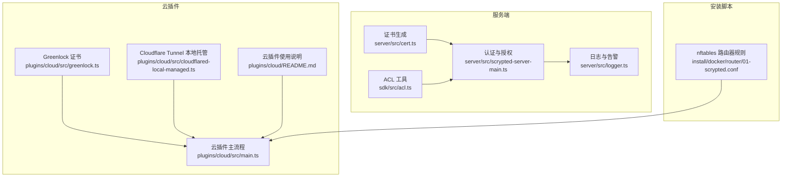
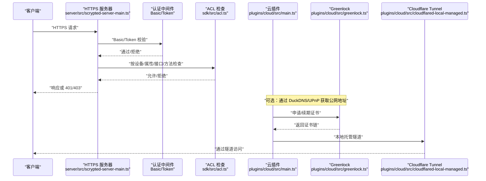
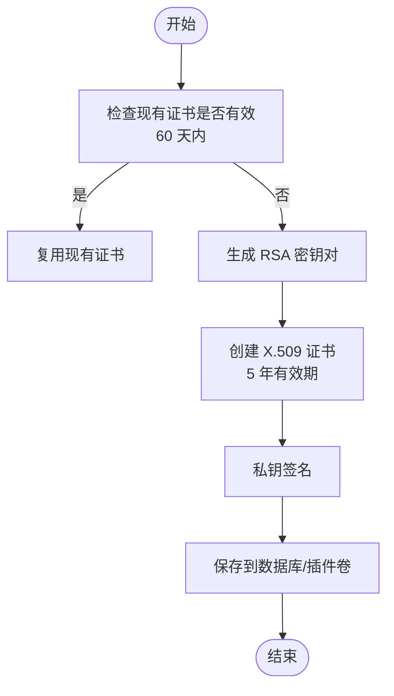
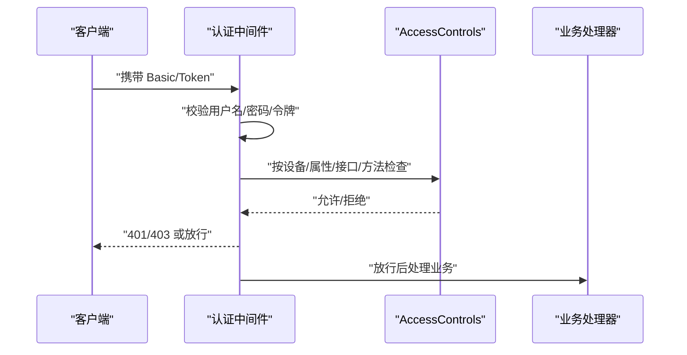
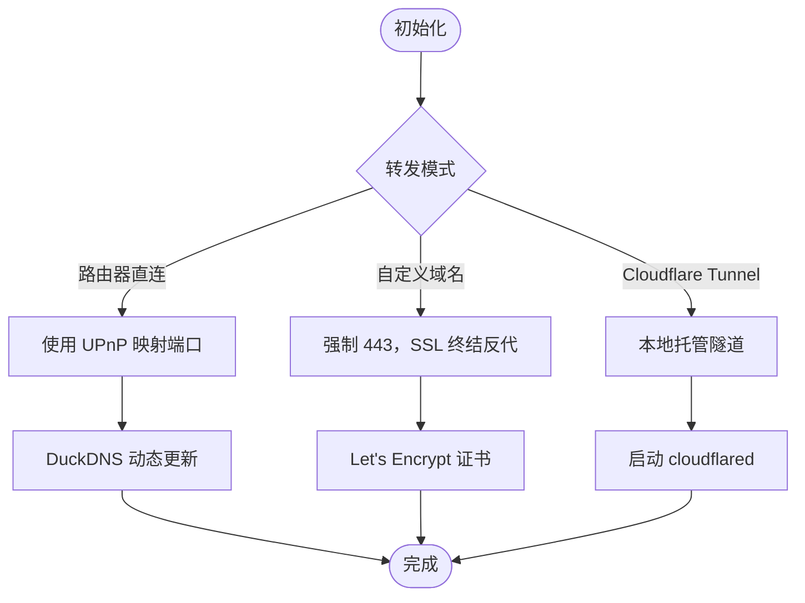
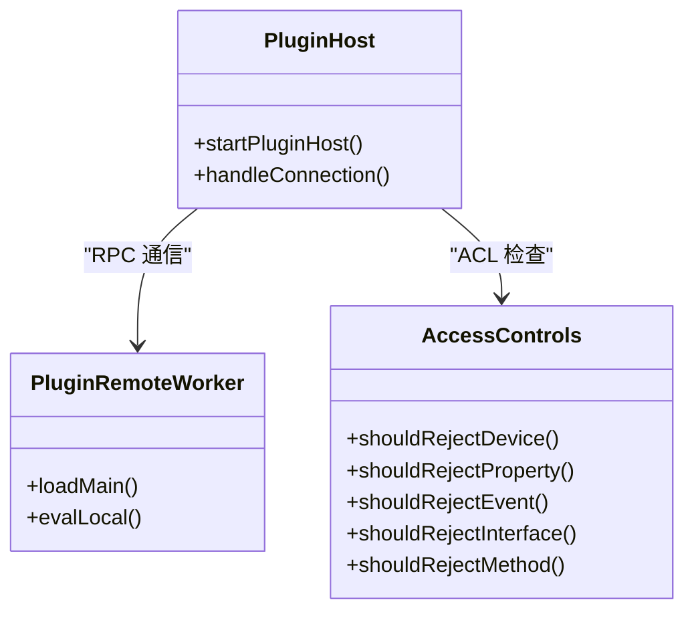
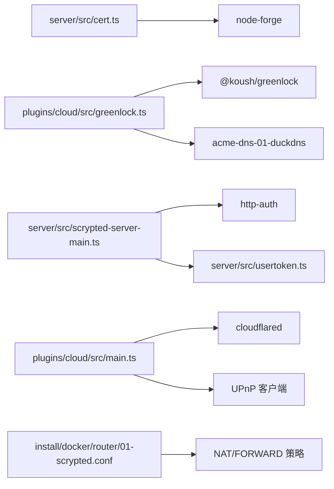

# 安全配置

<cite>
**本文引用的文件**
- [server/src/cert.ts](file://server/src/cert.ts)
- [plugins/self-signed-certificate/package.json](file://packages/self-signed-certificate/package.json)
- [sdk/src/acl.ts](file://sdk/src/acl.ts)
- [server/src/usertoken.ts](file://server/src/usertoken.ts)
- [server/src/scrypted-server-main.ts](file://server/src/scrypted-server-main.ts)
- [plugins/cloud/src/greenlock.ts](file://plugins/cloud/src/greenlock.ts)
- [plugins/cloud/src/main.ts](file://plugins/cloud/src/main.ts)
- [plugins/cloud/README.md](file://plugins/cloud/README.md)
- [plugins/cloud/src/cloudflared-local-managed.ts](file://plugins/cloud/src/cloudflared-local-managed.ts)
- [install/docker/router/01-scrypted.conf](file://install/docker/router/01-scrypted.conf)
- [server/src/ip.ts](file://server/src/ip.ts)
- [server/src/plugin/plugin-host.ts](file://server/src/plugin/plugin-host.ts)
- [server/src/plugin/plugin-remote-worker.ts](file://server/src/plugin/plugin-remote-worker.ts)
- [server/src/logger.ts](file://server/src/logger.ts)
</cite>

## 目录
1. [简介](#简介)
2. [项目结构](#项目结构)
3. [核心组件](#核心组件)
4. [架构总览](#架构总览)
5. [详细组件分析](#详细组件分析)
6. [依赖关系分析](#依赖关系分析)
7. [性能考量](#性能考量)
8. [故障排查指南](#故障排查指南)
9. [结论](#结论)
10. [附录](#附录)

## 简介
本指南面向 Scrypted 的安全配置与运维实践，覆盖以下主题：
- SSL/TLS 证书管理：自签名证书生成、Let’s Encrypt 证书申请与续期策略
- 用户权限系统：角色与权限模型、ACL 控制、访问控制列表
- 网络安全部署：防火墙规则、端口管理、路由器端口映射与 UPnP、VPN/隧道（Cloudflare Tunnel）
- API 安全：认证机制、授权策略、会话令牌有效期
- 远程访问安全：端口转发、NAT、DDNS（含 DuckDNS）、反向代理与自定义域名
- 插件安全隔离：沙箱边界、权限与资源限制
- 安全审计：日志采集、告警与异常检测
- 安全更新策略：自动更新、补丁管理与漏洞扫描建议

## 项目结构
Scrypted 的安全相关能力分布在服务端、SDK、云插件与安装脚本中：
- 服务端负责 TLS 证书生成与管理、HTTP/HTTPS 服务器、用户认证与授权、日志与审计
- SDK 提供 ACL 模型与工具函数，用于设备/属性/接口/方法级细粒度控制
- 云插件支持 Let’s Encrypt（通过 Greenlock）与 DuckDNS 自动续期，以及 Cloudflare Tunnel 本地托管隧道
- 安装脚本提供路由器场景下的 nftables 规则模板，便于在容器路由模式下进行 NAT/FORWARD 策略

图表来源
- [server/src/cert.ts:1-102](file://server/src/cert.ts#L1-L102)
- [server/src/scrypted-server-main.ts:112-794](file://server/src/scrypted-server-main.ts#L112-L794)
- [sdk/src/acl.ts:1-153](file://sdk/src/acl.ts#L1-L153)
- [plugins/cloud/src/greenlock.ts:1-58](file://plugins/cloud/src/greenlock.ts#L1-L58)
- [plugins/cloud/src/cloudflared-local-managed.ts:1-129](file://plugins/cloud/src/cloudflared-local-managed.ts#L1-L129)
- [plugins/cloud/src/main.ts:334-692](file://plugins/cloud/src/main.ts#L334-L692)
- [plugins/cloud/README.md:1-14](file://plugins/cloud/README.md#L1-L14)
- [install/docker/router/01-scrypted.conf:1-56](file://install/docker/router/01-scrypted.conf#L1-L56)

章节来源
- [server/src/cert.ts:1-102](file://server/src/cert.ts#L1-L102)
- [server/src/scrypted-server-main.ts:112-794](file://server/src/scrypted-server-main.ts#L112-L794)
- [sdk/src/acl.ts:1-153](file://sdk/src/acl.ts#L1-L153)
- [plugins/cloud/src/greenlock.ts:1-58](file://plugins/cloud/src/greenlock.ts#L1-L58)
- [plugins/cloud/src/cloudflared-local-managed.ts:1-129](file://plugins/cloud/src/cloudflared-local-managed.ts#L1-L129)
- [plugins/cloud/src/main.ts:334-692](file://plugins/cloud/src/main.ts#L334-L692)
- [plugins/cloud/README.md:1-14](file://plugins/cloud/README.md#L1-L14)
- [install/docker/router/01-scrypted.conf:1-56](file://install/docker/router/01-scrypted.conf#L1-L56)

## 核心组件
- 证书与 TLS
  - 自签名证书生成与版本化存储，支持 5 年有效期与 60 天内复用策略
  - HTTPS 服务器启动时加载证书，支持环境变量覆盖端口
- 认证与授权
  - 基于用户名/密码与一次性令牌的 Basic 认证；会话令牌 UserToken 支持时间戳与有效期校验
  - 中间层对 Safari 等浏览器的 WWW-Authenticate 行为进行适配，避免弹窗干扰
- 权限控制
  - 设备/属性/事件/接口/方法级 ACL 检查，支持合并多条设备访问控制规则
- 远程访问与网络
  - 云插件支持 DuckDNS 更新、UPnP 端口映射、Cloudflare Tunnel 本地托管
  - 容器路由器场景提供 nftables 模板，统一 NAT/FORWARD 策略
- 日志与审计
  - 统一日志聚合与告警清理，便于安全事件追踪

章节来源
- [server/src/cert.ts:17-101](file://server/src/cert.ts#L17-L101)
- [server/src/scrypted-server-main.ts:175-200](file://server/src/scrypted-server-main.ts#L175-L200)
- [server/src/usertoken.ts:8-48](file://server/src/usertoken.ts#L8-L48)
- [sdk/src/acl.ts:25-121](file://sdk/src/acl.ts#L25-L121)
- [plugins/cloud/src/main.ts:475-516](file://plugins/cloud/src/main.ts#L475-L516)
- [install/docker/router/01-scrypted.conf:1-56](file://install/docker/router/01-scrypted.conf#L1-L56)
- [server/src/logger.ts:55-92](file://server/src/logger.ts#L55-L92)

## 架构总览
下图展示从客户端到服务端、再到云插件与外部 CA/隧道的典型安全交互路径。

图表来源
- [server/src/scrypted-server-main.ts:175-200](file://server/src/scrypted-server-main.ts#L175-L200)
- [sdk/src/acl.ts:25-121](file://sdk/src/acl.ts#L25-L121)
- [plugins/cloud/src/main.ts:475-516](file://plugins/cloud/src/main.ts#L475-L516)
- [plugins/cloud/src/greenlock.ts:14-58](file://plugins/cloud/src/greenlock.ts#L14-L58)
- [plugins/cloud/src/cloudflared-local-managed.ts:79-97](file://plugins/cloud/src/cloudflared-local-managed.ts#L79-L97)

## 详细组件分析

### 证书与 TLS 管理
- 自签名证书
  - 使用 RSA 2048 位密钥生成 X.509 证书，有效期 5 年
  - 版本化存储，60 天内复用现有证书，避免频繁签发
  - 扩展包含基本约束、密钥用途、扩展密钥用途、SAN（IP 127.0.0.1）等
- Let’s Encrypt 证书
  - 通过 Greenlock 与 acme-dns-01-duckdns 挑战模块，结合 DuckDNS 域名自动申请/续期
  - 证书存储于插件卷目录，便于持久化与重载
- 证书续期策略
  - 建议结合云插件的 DuckDNS 更新与 UPnP 映射，确保公网可达性
  - 对于自签名证书，建议在受控网络内使用，并定期轮换

图表来源
- [server/src/cert.ts:17-101](file://server/src/cert.ts#L17-L101)
- [plugins/cloud/src/greenlock.ts:14-58](file://plugins/cloud/src/greenlock.ts#L14-L58)

章节来源
- [server/src/cert.ts:17-101](file://server/src/cert.ts#L17-L101)
- [plugins/self-signed-certificate/package.json:1-23](file://packages/self-signed-certificate/package.json#L1-L23)
- [plugins/cloud/src/greenlock.ts:14-58](file://plugins/cloud/src/greenlock.ts#L14-L58)

### 用户权限系统与 ACL
- 用户与令牌
  - 用户凭据存储在数据库中，登录采用 SHA-256 哈希比对
  - UserToken 支持时间戳与有效期校验，最长一年
- 设备/属性/事件/接口/方法级 ACL
  - AccessControls 提供 shouldRejectDevice/Property/Event/Interface/Method
  - 支持合并多条设备访问控制规则，实现细粒度授权
- 授权流程
  - 服务端中间件在请求进入业务逻辑前执行 ACL 检查
  - 可通过环境变量配置管理员直连白名单（基于远端地址后缀）

图表来源
- [server/src/scrypted-server-main.ts:175-200](file://server/src/scrypted-server-main.ts#L175-L200)
- [server/src/usertoken.ts:8-48](file://server/src/usertoken.ts#L8-L48)
- [sdk/src/acl.ts:25-121](file://sdk/src/acl.ts#L25-L121)

章节来源
- [server/src/scrypted-server-main.ts:175-200](file://server/src/scrypted-server-main.ts#L175-L200)
- [server/src/usertoken.ts:8-48](file://server/src/usertoken.ts#L8-L48)
- [sdk/src/acl.ts:25-121](file://sdk/src/acl.ts#L25-L121)

### 网络安全部属与端口管理
- 防火墙与路由
  - 提供 nftables 模板，定义 IPv4/IPv6 的 NAT 与 FORWARD 链，统一策略
- 端口管理
  - 服务端监听安全端口与非安全端口，可通过环境变量覆盖
  - 云插件支持随机端口选择、UPnP 映射、自定义域名（443 强制走 SSL 终结反向代理）
- DDNS 与动态更新
  - DuckDNS 更新通过 Greenlock 挑战模块完成，失败会输出错误日志
- VPN/隧道
  - Cloudflare Tunnel 本地托管，支持登录、创建隧道、路由 DNS 与运行

图表来源
- [plugins/cloud/src/main.ts:475-516](file://plugins/cloud/src/main.ts#L475-L516)
- [plugins/cloud/src/greenlock.ts:14-58](file://plugins/cloud/src/greenlock.ts#L14-L58)
- [plugins/cloud/src/cloudflared-local-managed.ts:79-97](file://plugins/cloud/src/cloudflared-local-managed.ts#L79-L97)
- [install/docker/router/01-scrypted.conf:1-56](file://install/docker/router/01-scrypted.conf#L1-L56)

章节来源
- [plugins/cloud/src/main.ts:475-516](file://plugins/cloud/src/main.ts#L475-L516)
- [plugins/cloud/README.md:8-14](file://plugins/cloud/README.md#L8-L14)
- [plugins/cloud/src/greenlock.ts:14-58](file://plugins/cloud/src/greenlock.ts#L14-L58)
- [plugins/cloud/src/cloudflared-local-managed.ts:79-97](file://plugins/cloud/src/cloudflared-local-managed.ts#L79-L97)
- [install/docker/router/01-scrypted.conf:1-56](file://install/docker/router/01-scrypted.conf#L1-L56)

### 插件安全隔离
- 插件进程与 SDK 边界
  - 插件以独立进程/模块方式加载，具备独立的 zip 解包与 SDK 版本兼容处理
  - Node/Python 插件均通过 RPC 通道与宿主通信，避免直接共享内存
- 权限与资源限制
  - 通过 ACL 对插件暴露的设备/属性/接口/方法进行访问控制
  - 建议在容器环境中限制 CPU/内存/磁盘 IO，结合 nftables 限制外联
- 运行时隔离
  - 插件工作目录与卷隔离，避免相互污染
  - 本地托管隧道仅暴露必要端口，减少攻击面

图表来源
- [server/src/plugin/plugin-host.ts:122-157](file://server/src/plugin/plugin-host.ts#L122-L157)
- [server/src/plugin/plugin-remote-worker.ts:376-401](file://server/src/plugin/plugin-remote-worker.ts#L376-L401)
- [sdk/src/acl.ts:25-121](file://sdk/src/acl.ts#L25-L121)

章节来源
- [server/src/plugin/plugin-host.ts:122-157](file://server/src/plugin/plugin-host.ts#L122-L157)
- [server/src/plugin/plugin-remote-worker.ts:376-401](file://server/src/plugin/plugin-remote-worker.ts#L376-L401)
- [sdk/src/acl.ts:25-121](file://sdk/src/acl.ts#L25-L121)

### 安全审计与日志
- 日志聚合
  - Logger 子树结构化收集日志，支持排序与跨子系统聚合
- 告警清理
  - 提供清理特定告警与全量告警的方法，便于审计闭环
- 建议
  - 将日志输出到集中式日志系统（如 SIEM），开启异常检测规则（如频繁 401/403、异常端口扫描）

章节来源
- [server/src/logger.ts:55-92](file://server/src/logger.ts#L55-L92)

## 依赖关系分析
- 证书与 TLS
  - 服务端依赖 node-forge 生成自签名证书；云插件依赖 @koush/greenlock 与 acme-dns-01-duckdns
- 认证与授权
  - 服务端依赖 http-auth 实现 Basic 认证；UserToken 作为会话令牌载体
- 网络与远程访问
  - 云插件依赖 cloudflared 二进制；UPnP 通过内置客户端进行端口映射
- 安装与部署
  - 容器路由器场景依赖 nftables 模板进行 NAT/FORWARD 策略

图表来源
- [server/src/cert.ts:1-102](file://server/src/cert.ts#L1-L102)
- [plugins/cloud/src/greenlock.ts:14-58](file://plugins/cloud/src/greenlock.ts#L14-L58)
- [server/src/scrypted-server-main.ts:175-200](file://server/src/scrypted-server-main.ts#L175-L200)
- [server/src/usertoken.ts:8-48](file://server/src/usertoken.ts#L8-L48)
- [plugins/cloud/src/main.ts:475-516](file://plugins/cloud/src/main.ts#L475-L516)
- [install/docker/router/01-scrypted.conf:1-56](file://install/docker/router/01-scrypted.conf#L1-L56)

章节来源
- [server/src/cert.ts:1-102](file://server/src/cert.ts#L1-L102)
- [plugins/cloud/src/greenlock.ts:14-58](file://plugins/cloud/src/greenlock.ts#L14-L58)
- [server/src/scrypted-server-main.ts:175-200](file://server/src/scrypted-server-main.ts#L175-L200)
- [server/src/usertoken.ts:8-48](file://server/src/usertoken.ts#L8-L48)
- [plugins/cloud/src/main.ts:475-516](file://plugins/cloud/src/main.ts#L475-L516)
- [install/docker/router/01-scrypted.conf:1-56](file://install/docker/router/01-scrypted.conf#L1-L56)

## 性能考量
- 证书生成与缓存
  - 自签名证书 60 天内复用，减少频繁签发开销
- ACL 检查
  - 使用带缓存的 Promise 去抖机制，降低重复查询成本
- 日志与告警
  - 聚合与排序操作建议在内存中进行，避免频繁磁盘 IO

## 故障排查指南
- 证书问题
  - 自签名证书过期或版本不匹配：触发重新生成并写入数据库
  - Let’s Encrypt 申请失败：检查 DuckDNS Token/域名解析与网络可达性
- 认证失败
  - 401 错误：确认用户名/密码或一次性令牌；检查 Basic 认证头
  - 令牌过期：调整 UserToken 有效期或重新签发
- 远程访问
  - 端口映射失败：检查路由器 UPnP 是否启用、端口冲突与防火墙
  - DDNS 更新失败：查看控制台错误日志，确认 Token 正确
- 插件异常
  - 插件无法加载：检查 zip 解包、SDK 版本与 RPC 通道
- 审计与日志
  - 日志缺失：确认 Logger 初始化与子树挂载；清理告警后重新触发

章节来源
- [server/src/cert.ts:17-101](file://server/src/cert.ts#L17-L101)
- [plugins/cloud/src/greenlock.ts:14-58](file://plugins/cloud/src/greenlock.ts#L14-L58)
- [server/src/scrypted-server-main.ts:175-200](file://server/src/scrypted-server-main.ts#L175-L200)
- [server/src/usertoken.ts:8-48](file://server/src/usertoken.ts#L8-L48)
- [plugins/cloud/src/main.ts:475-516](file://plugins/cloud/src/main.ts#L475-L516)
- [server/src/logger.ts:55-92](file://server/src/logger.ts#L55-L92)

## 结论
Scrypted 在服务端、SDK 与云插件层面提供了完整的安全能力：自签名与 Let’s Encrypt 证书管理、细粒度 ACL、认证与授权、远程访问（UPnP/DDNS/隧道）、日志与审计。结合容器路由器的 nftables 模板，可在多种部署形态下实现最小暴露面与强访问控制。建议在生产环境启用自定义域名与 SSL 终结反向代理、严格限制管理员直连来源、定期轮换证书与令牌，并接入集中式日志与告警系统。

## 附录
- 端口与环境变量
  - 安全端口与非安全端口可通过环境变量覆盖
  - 管理员直连白名单可通过环境变量配置
- 网络地址可用性
  - 服务端提供可用网络地址过滤逻辑，排除私有/环回/临时 IPv6 地址

章节来源
- [server/src/scrypted-server-main.ts:239-255](file://server/src/scrypted-server-main.ts#L239-L255)
- [server/src/ip.ts:54-106](file://server/src/ip.ts#L54-L106)