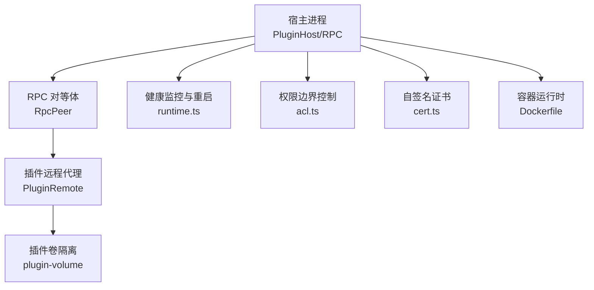
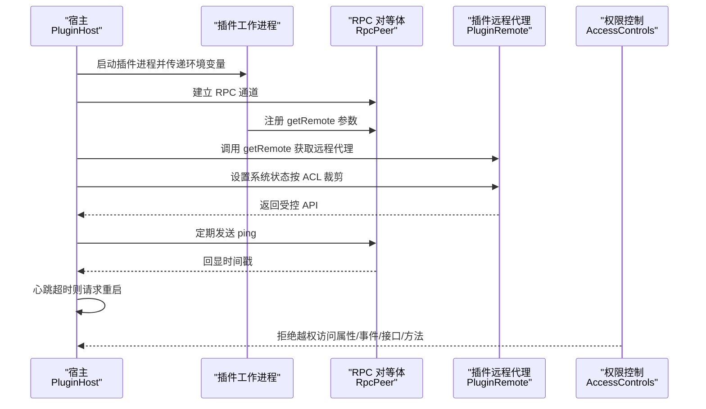
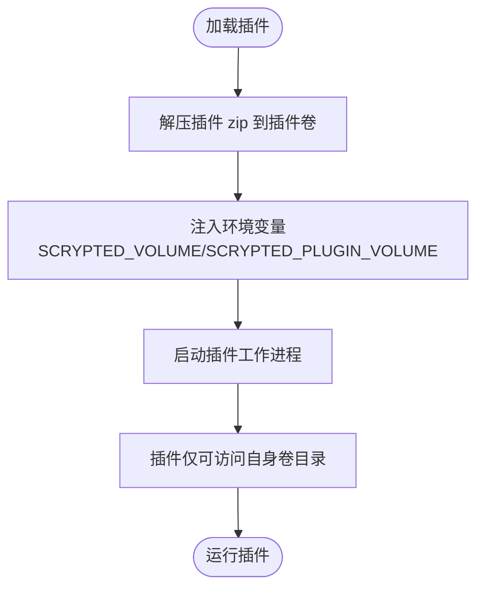
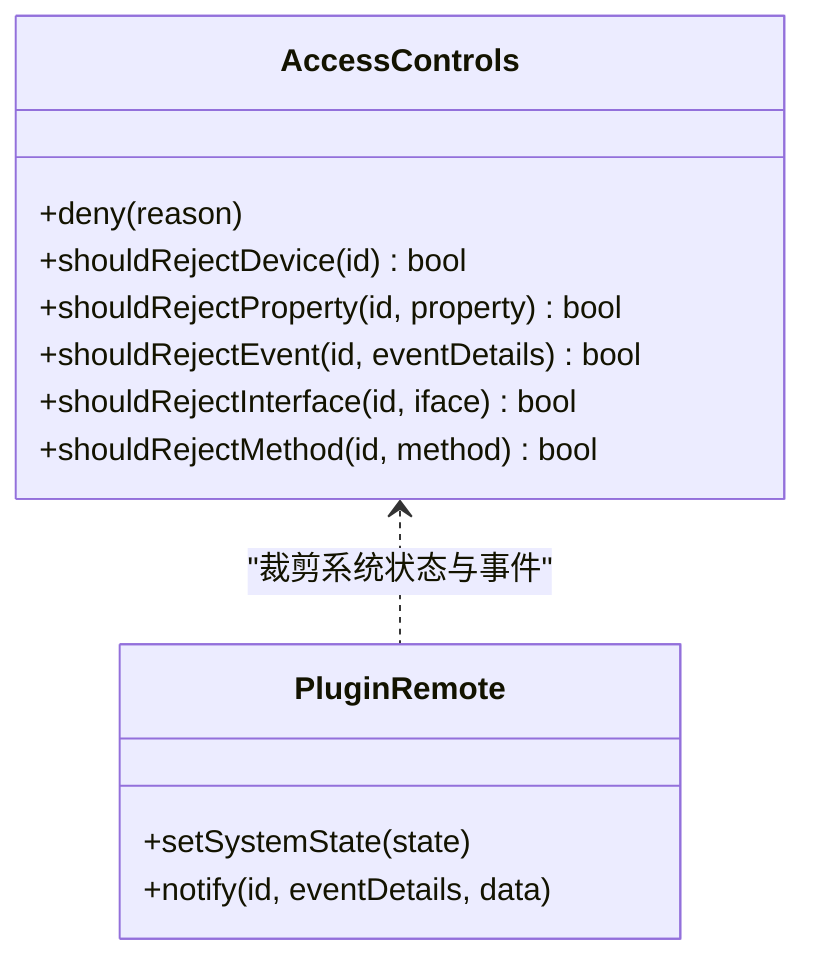
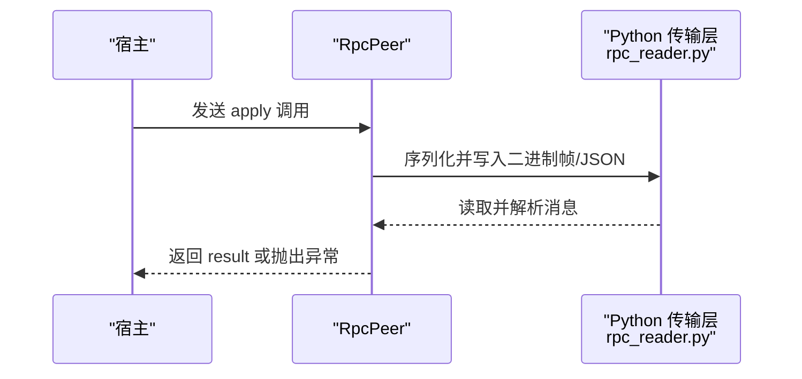
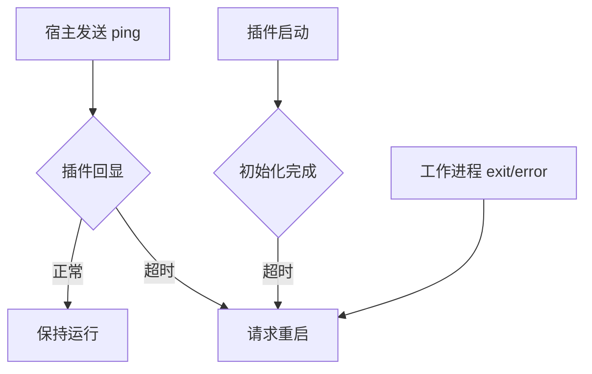
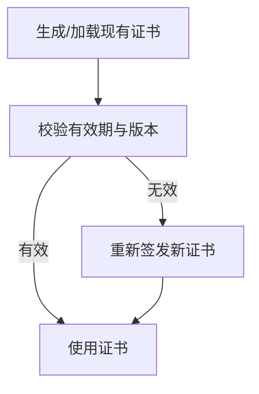
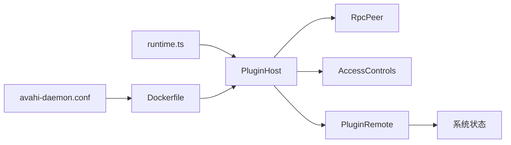

# 插件安全隔离

<cite>
**本文引用的文件**
- [server/src/plugin/plugin-host.ts](file://server/src/plugin/plugin-host.ts)
- [server/src/plugin/plugin-remote.ts](file://server/src/plugin/plugin-remote.ts)
- [server/src/plugin/acl.ts](file://server/src/plugin/acl.ts)
- [server/src/plugin/plugin-volume.ts](file://server/src/plugin/plugin-volume.ts)
- [server/src/rpc.ts](file://server/src/rpc.ts)
- [server/src/runtime.ts](file://server/src/runtime.ts)
- [server/python/rpc_reader.py](file://server/python/rpc_reader.py)
- [server/python/plugin_remote.py](file://server/python/plugin_remote.py)
- [install/docker/Dockerfile](file://install/docker/Dockerfile)
- [install/docker/fs/etc/avahi/avahi-daemon.conf](file://install/docker/fs/etc/avahi/avahi-daemon.conf)
- [plugins/cloud/src/main.ts](file://plugins/cloud/src/main.ts)
- [plugins/zwave/src/main.ts](file://plugins/zwave/src/main.ts)
- [server/src/cert.ts](file://server/src/cert.ts)
</cite>

## 目录
1. [引言](#引言)
2. [项目结构](#项目结构)
3. [核心组件](#核心组件)
4. [架构总览](#架构总览)
5. [详细组件分析](#详细组件分析)
6. [依赖关系分析](#依赖关系分析)
7. [性能与资源限制](#性能与资源限制)
8. [故障排查指南](#故障排查指南)
9. [结论](#结论)
10. [附录](#附录)

## 引言
本文件面向 Scrypted 插件系统的安全隔离机制，聚焦以下方面：进程隔离、内存限制、文件系统隔离；权限边界控制（API 访问限制、系统资源访问控制、网络访问权限）；资源限制配置（CPU、内存、磁盘）；插件通信安全（RPC 加密、消息验证、数据完整性）；插件健康监控（运行状态、异常检测、自动重启）；插件安全审计（行为记录、权限使用跟踪、恶意行为检测）；以及安全最佳实践与更新策略。内容基于仓库源码进行深入分析，并通过图示展示关键流程。

## 项目结构
Scrypted 的插件安全隔离由“宿主侧”与“插件侧”协同实现：
- 宿主侧负责进程生命周期管理、RPC 通道建立、权限裁剪、健康监控与自动重启。
- 插件侧通过远程代理暴露受控 API，并在受限环境中执行业务逻辑。
- 文件系统隔离通过专用卷目录实现，避免插件间互相影响。
- 网络与证书基础设施为安全通信提供基础能力。

**图表来源**
- [server/src/plugin/plugin-host.ts:122-224](file://server/src/plugin/plugin-host.ts#L122-L224)
- [server/src/plugin/plugin-remote.ts:13-92](file://server/src/plugin/plugin-remote.ts#L13-L92)
- [server/src/plugin/plugin-volume.ts:1-33](file://server/src/plugin/plugin-volume.ts#L1-L33)
- [server/src/runtime.ts:647-724](file://server/src/runtime.ts#L647-L724)
- [server/src/plugin/acl.ts:1-104](file://server/src/plugin/acl.ts#L1-L104)
- [server/src/cert.ts:1-102](file://server/src/cert.ts#L1-L102)
- [install/docker/Dockerfile:1-22](file://install/docker/Dockerfile#L1-L22)

**章节来源**
- [server/src/plugin/plugin-host.ts:122-224](file://server/src/plugin/plugin-host.ts#L122-L224)
- [server/src/plugin/plugin-remote.ts:13-92](file://server/src/plugin/plugin-remote.ts#L13-L92)
- [server/src/plugin/plugin-volume.ts:1-33](file://server/src/plugin/plugin-volume.ts#L1-L33)
- [server/src/runtime.ts:647-724](file://server/src/runtime.ts#L647-L724)
- [server/src/plugin/acl.ts:1-104](file://server/src/plugin/acl.ts#L1-L104)
- [server/src/cert.ts:1-102](file://server/src/cert.ts#L1-L102)
- [install/docker/Dockerfile:1-22](file://install/docker/Dockerfile#L1-L22)

## 核心组件
- 进程与生命周期管理：PluginHost 负责启动插件工作进程、建立 RPC 通道、处理连接与日志、健康检查与自动重启。
- 权限边界控制：AccessControls 在 RPC 层对设备、属性、事件接口、方法进行细粒度拒绝判断。
- 文件系统隔离：ensurePluginVolume 为每个插件创建独立卷目录，限制文件访问范围。
- 通信与序列化：RpcPeer 提供 RPC 消息编解码、参数序列化、结果回传与错误传播。
- 健康监控与自动重启：定期心跳检查、超时重启、退出/错误回调统一处理。
- 证书与网络：自签名证书生成与扩展，为安全通信提供信任根。

**章节来源**
- [server/src/plugin/plugin-host.ts:38-84](file://server/src/plugin/plugin-host.ts#L38-L84)
- [server/src/plugin/acl.ts:8-104](file://server/src/plugin/acl.ts#L8-L104)
- [server/src/plugin/plugin-volume.ts:22-32](file://server/src/plugin/plugin-volume.ts#L22-L32)
- [server/src/rpc.ts:29-82](file://server/src/rpc.ts#L29-L82)
- [server/src/runtime.ts:647-724](file://server/src/runtime.ts#L647-L724)
- [server/src/cert.ts:17-101](file://server/src/cert.ts#L17-L101)

## 架构总览
下图展示了插件加载、RPC 通信、权限裁剪与健康监控的关键交互：

**图表来源**
- [server/src/plugin/plugin-host.ts:276-328](file://server/src/plugin/plugin-host.ts#L276-L328)
- [server/src/plugin/plugin-remote.ts:13-92](file://server/src/plugin/plugin-remote.ts#L13-L92)
- [server/src/plugin/acl.ts:12-103](file://server/src/plugin/acl.ts#L12-L103)
- [server/src/rpc.ts:402-416](file://server/src/rpc.ts#L402-L416)

## 详细组件分析

### 进程隔离与文件系统隔离
- 进程隔离：PluginHost 通过不同运行时（如 Node、自定义）创建工作进程，插件 zip 包在宿主侧解压到独立卷目录，插件仅能访问自身卷。
- 文件系统隔离：ensurePluginVolume 为每个插件创建独立目录，避免跨插件文件访问与污染。

**图表来源**
- [server/src/plugin/plugin-host.ts:134-149](file://server/src/plugin/plugin-host.ts#L134-L149)
- [server/src/plugin/plugin-volume.ts:22-32](file://server/src/plugin/plugin-volume.ts#L22-L32)

**章节来源**
- [server/src/plugin/plugin-host.ts:134-149](file://server/src/plugin/plugin-host.ts#L134-L149)
- [server/src/plugin/plugin-volume.ts:22-32](file://server/src/plugin/plugin-volume.ts#L22-L32)

### 权限边界控制（API 访问限制）
- 设备级拒绝：根据用户授权的设备白名单决定是否允许访问特定设备。
- 属性级拒绝：仅允许访问授权的属性，其他属性从系统状态中剔除。
- 接口与方法拒绝：对未授权的接口或方法调用直接拒绝。
- 事件过滤：仅转发被授权的事件，防止越权订阅。

**图表来源**
- [server/src/plugin/acl.ts:8-104](file://server/src/plugin/acl.ts#L8-L104)
- [server/src/plugin/plugin-remote.ts:26-85](file://server/src/plugin/plugin-remote.ts#L26-L85)

**章节来源**
- [server/src/plugin/acl.ts:8-104](file://server/src/plugin/acl.ts#L8-L104)
- [server/src/plugin/plugin-remote.ts:26-85](file://server/src/plugin/plugin-remote.ts#L26-L85)

### RPC 通信与消息验证
- RPC 消息类型：apply（调用）、result（返回）、finalize（析构）、param（参数）。
- 序列化与缓冲：支持 Buffer、WebSocket 等对象的序列化与传输。
- 传输安全判定：RpcPeer 提供 isTransportSafe 与静态判定，确保仅安全类型参与 RPC 传输。
- Python 侧传输：rpc_reader.py 实现二进制帧与 JSON 混合传输，保障跨语言通信一致性。

**图表来源**
- [server/src/rpc.ts:29-82](file://server/src/rpc.ts#L29-L82)
- [server/src/rpc.ts:402-416](file://server/src/rpc.ts#L402-L416)
- [server/python/rpc_reader.py:89-135](file://server/python/rpc_reader.py#L89-L135)

**章节来源**
- [server/src/rpc.ts:29-82](file://server/src/rpc.ts#L29-L82)
- [server/src/rpc.ts:402-416](file://server/src/rpc.ts#L402-L416)
- [server/python/rpc_reader.py:89-135](file://server/python/rpc_reader.py#L89-L135)

### 插件健康监控与自动重启
- 心跳检查：宿主定时向插件发起 ping，插件回显时间戳；若超过阈值未响应，则触发重启。
- 启动超时：插件在限定时间内未能完成初始化，触发重启。
- 退出/错误处理：工作进程 exit/error 事件触发统一重启流程。
- 云服务健康检查：以 cloudflared 为例，周期性健康检查失败达到阈值后自动重启。

**图表来源**
- [server/src/plugin/plugin-host.ts:289-324](file://server/src/plugin/plugin-host.ts#L289-L324)
- [server/src/runtime.ts:647-724](file://server/src/runtime.ts#L647-L724)
- [plugins/cloud/src/main.ts:1154-1191](file://plugins/cloud/src/main.ts#L1154-L1191)

**章节来源**
- [server/src/plugin/plugin-host.ts:289-324](file://server/src/plugin/plugin-host.ts#L289-L324)
- [server/src/runtime.ts:647-724](file://server/src/runtime.ts#L647-L724)
- [plugins/cloud/src/main.ts:1154-1191](file://plugins/cloud/src/main.ts#L1154-L1191)

### 通信安全与证书
- 自签名证书：生成短期有效的自签名证书，设置有效期与扩展，用于本地安全通信场景。
- 证书版本：维护证书版本号，避免过期或不兼容导致的握手失败。

**图表来源**
- [server/src/cert.ts:17-101](file://server/src/cert.ts#L17-L101)

**章节来源**
- [server/src/cert.ts:17-101](file://server/src/cert.ts#L17-L101)

### 网络访问权限与容器限制
- 容器运行：Dockerfile 中设置 NODE_OPTIONS 优先 IPv4，提升网络稳定性；ulimit 关闭 core dump。
- 容器内服务限制：avahi-daemon.conf 限制 rlimit（如 nofile、stack），降低资源滥用风险。

**章节来源**
- [install/docker/Dockerfile:12-21](file://install/docker/Dockerfile#L12-L21)
- [install/docker/fs/etc/avahi/avahi-daemon.conf:12-17](file://install/docker/fs/etc/avahi/avahi-daemon.conf#L12-L17)

## 依赖关系分析
- PluginHost 依赖 RpcPeer 建立通信，依赖 AccessControls 进行权限裁剪，依赖 PluginRemote 暴露受控 API。
- PluginRemote 依赖系统状态获取函数，按 ACL 裁剪后下发给插件侧。
- runtime.ts 统一处理插件退出/错误事件，触发自动重启。
- Dockerfile 与 avahi 配置提供容器与网络层面的约束。

**图表来源**
- [server/src/plugin/plugin-host.ts:276-328](file://server/src/plugin/plugin-host.ts#L276-L328)
- [server/src/plugin/plugin-remote.ts:45-59](file://server/src/plugin/plugin-remote.ts#L45-L59)
- [server/src/runtime.ts:647-724](file://server/src/runtime.ts#L647-L724)
- [install/docker/Dockerfile:1-22](file://install/docker/Dockerfile#L1-L22)
- [install/docker/fs/etc/avahi/avahi-daemon.conf:12-17](file://install/docker/fs/etc/avahi/avahi-daemon.conf#L12-L17)

**章节来源**
- [server/src/plugin/plugin-host.ts:276-328](file://server/src/plugin/plugin-host.ts#L276-L328)
- [server/src/plugin/plugin-remote.ts:45-59](file://server/src/plugin/plugin-remote.ts#L45-L59)
- [server/src/runtime.ts:647-724](file://server/src/runtime.ts#L647-L724)
- [install/docker/Dockerfile:1-22](file://install/docker/Dockerfile#L1-L22)
- [install/docker/fs/etc/avahi/avahi-daemon.conf:12-17](file://install/docker/fs/etc/avahi/avahi-daemon.conf#L12-L17)

## 性能与资源限制
- 内存：RpcPeer 提供周期性垃圾回收触发机制，减少长期运行中的内存占用。
- CPU：通过心跳与健康检查避免插件卡死导致的 CPU 占用持续升高。
- 磁盘：插件卷隔离限制磁盘访问范围，避免跨插件写入造成磁盘膨胀。
- 容器资源：通过 ulimit 与 rlimit 限制核心转储与文件句柄数量，降低资源滥用风险。

**章节来源**
- [server/src/rpc.ts:1-27](file://server/src/rpc.ts#L1-L27)
- [server/src/plugin/plugin-volume.ts:1-33](file://server/src/plugin/plugin-volume.ts#L1-L33)
- [install/docker/Dockerfile:21-21](file://install/docker/Dockerfile#L21-L21)
- [install/docker/fs/etc/avahi/avahi-daemon.conf:12-17](file://install/docker/fs/etc/avahi/avahi-daemon.conf#L12-L17)

## 故障排查指南
- 插件无法启动：检查宿主日志与插件控制台输出，确认 zip 解压与环境变量注入成功。
- 心跳超时：确认插件未阻塞或异常退出；查看宿主健康检查日志。
- 权限拒绝：核对用户授权的设备白名单与属性列表；确认 ACL 是否正确应用。
- 通信异常：检查 RPC 序列化与传输层（Node/Python）是否一致；验证 Buffer 与 WebSocket 序列化注册。
- 云服务不稳定：参考 cloudflared 健康检查失败次数与重试策略。

**章节来源**
- [server/src/plugin/plugin-host.ts:276-328](file://server/src/plugin/plugin-host.ts#L276-L328)
- [server/src/plugin/acl.ts:12-103](file://server/src/plugin/acl.ts#L12-L103)
- [server/src/rpc.ts:402-416](file://server/src/rpc.ts#L402-L416)
- [plugins/cloud/src/main.ts:1154-1191](file://plugins/cloud/src/main.ts#L1154-L1191)

## 结论
Scrypted 的插件安全隔离通过“进程隔离 + 文件系统隔离 + 权限边界控制 + 健康监控 + 通信安全”形成闭环。ACL 在 RPC 层实现细粒度权限裁剪，PluginHost 负责生命周期与健康守护，PluginRemote 将受控 API 下发至插件侧，结合证书与容器配置提供通信与资源约束。建议在生产环境中启用严格的 ACL、定期审查插件行为与权限使用，并配合自动化健康检查与告警体系。

## 附录
- 安全最佳实践
  - 严格最小权限原则：仅授予插件必要的设备、属性、接口与方法。
  - 定期审计：记录插件行为与权限使用，识别异常访问模式。
  - 更新策略：通过版本化证书与容器镜像基线，确保安全补丁及时生效。
  - 监控告警：结合心跳与外部健康检查，快速定位与恢复异常插件。