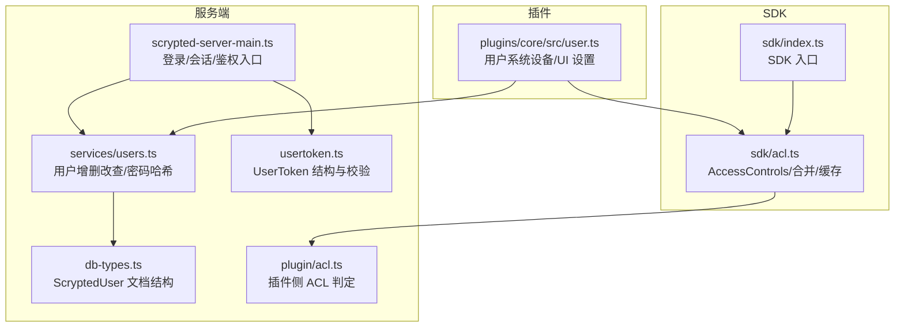
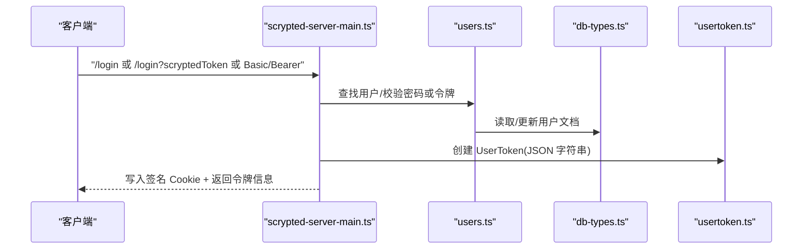
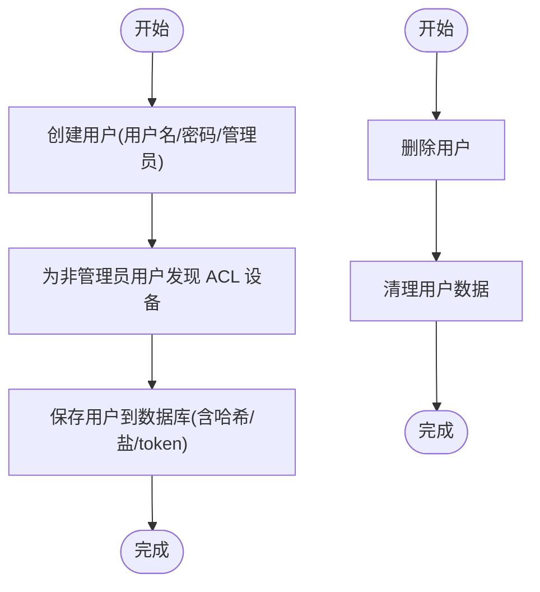
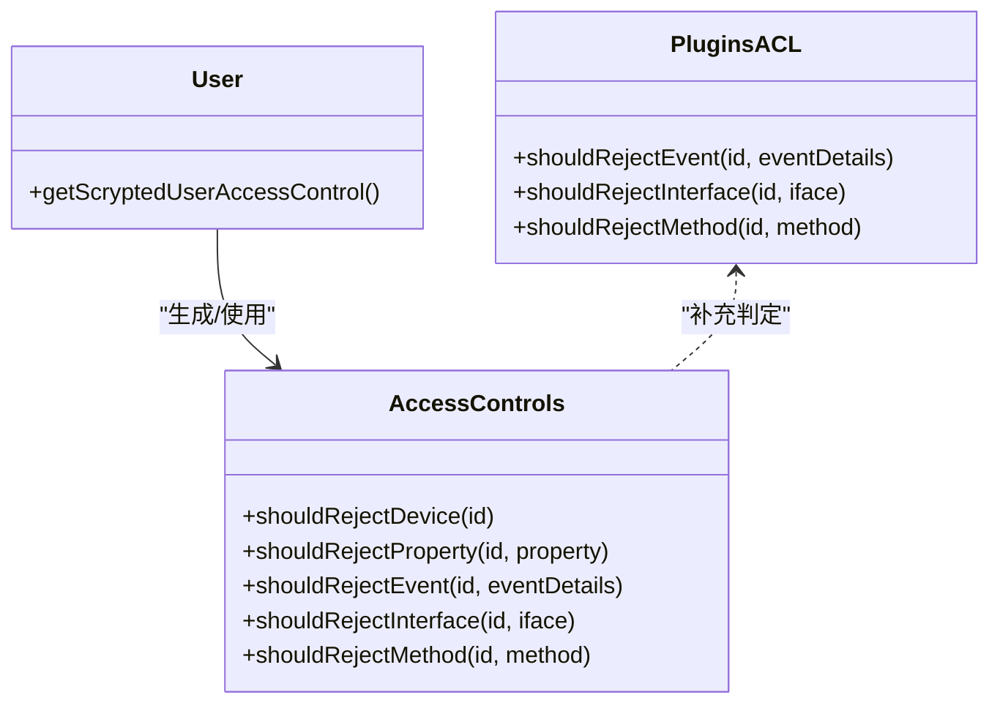
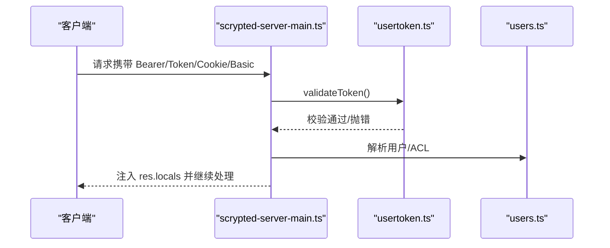
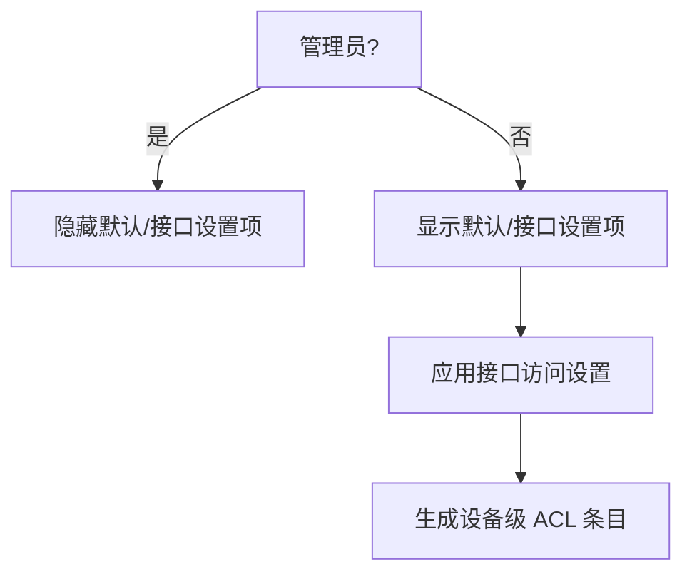
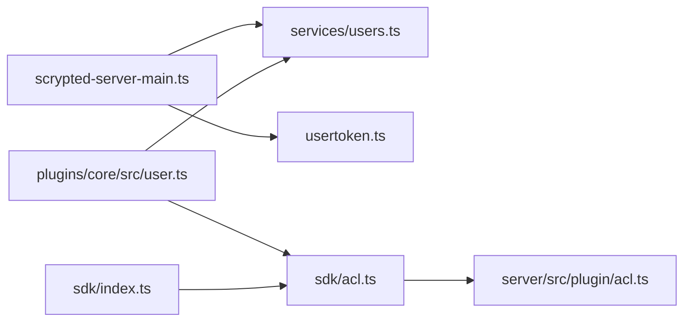

# 用户权限管理

<cite>
**本文引用的文件**
- [server/src/scrypted-server-main.ts](file://server/src/scrypted-server-main.ts)
- [server/src/usertoken.ts](file://server/src/usertoken.ts)
- [server/src/services/users.ts](file://server/src/services/users.ts)
- [plugins/core/src/user.ts](file://plugins/core/src/user.ts)
- [sdk/src/acl.ts](file://sdk/src/acl.ts)
- [server/src/plugin/acl.ts](file://server/src/plugin/acl.ts)
- [server/src/db-types.ts](file://server/src/db-types.ts)
- [sdk/src/index.ts](file://sdk/src/index.ts)
</cite>

## 目录
1. [简介](#简介)
2. [项目结构](#项目结构)
3. [核心组件](#核心组件)
4. [架构总览](#架构总览)
5. [详细组件分析](#详细组件分析)
6. [依赖关系分析](#依赖关系分析)
7. [性能考量](#性能考量)
8. [故障排查指南](#故障排查指南)
9. [结论](#结论)
10. [附录](#附录)

## 简介
本指南面向 Scrypted 的用户权限管理体系，覆盖用户账户管理、权限分配与 ACL 实现、令牌与会话管理、UI 权限控制、审计与监控以及安全配置与最佳实践。文档以仓库中实际实现为依据，结合架构图与流程图帮助读者快速理解并正确配置。

## 项目结构
围绕用户权限的关键模块分布如下：
- 服务端登录与会话：负责认证入口、令牌签发与校验、默认认证回退、Basic/Bearer/Cookie 登录路径
- 用户服务：负责用户增删改查、密码哈希与随机 token 生成
- 用户设备与 UI：提供“用户”系统设备，允许在 UI 中创建/删除用户、设置管理员与接口访问
- ACL 核心：提供设备级访问控制判定（设备、属性、事件、接口、方法）
- 插件 ACL：插件侧对事件/接口/方法进行二次判定
- 数据模型：用户文档结构（密码哈希、盐值、token、ACL 绑定）

**图表来源**
- [server/src/scrypted-server-main.ts:273-347](file://server/src/scrypted-server-main.ts#L273-L347)
- [server/src/services/users.ts:1-87](file://server/src/services/users.ts#L1-L87)
- [server/src/db-types.ts:18-24](file://server/src/db-types.ts#L18-L24)
- [server/src/usertoken.ts:1-49](file://server/src/usertoken.ts#L1-L49)
- [server/src/plugin/acl.ts:48-104](file://server/src/plugin/acl.ts#L48-L104)
- [sdk/src/acl.ts:25-124](file://sdk/src/acl.ts#L25-L124)
- [sdk/src/index.ts:206-297](file://sdk/src/index.ts#L206-L297)
- [plugins/core/src/user.ts:1-225](file://plugins/core/src/user.ts#L1-L225)

**章节来源**
- [server/src/scrypted-server-main.ts:273-347](file://server/src/scrypted-server-main.ts#L273-L347)
- [server/src/services/users.ts:1-87](file://server/src/services/users.ts#L1-L87)
- [server/src/db-types.ts:18-24](file://server/src/db-types.ts#L18-L24)
- [server/src/usertoken.ts:1-49](file://server/src/usertoken.ts#L1-L49)
- [server/src/plugin/acl.ts:48-104](file://server/src/plugin/acl.ts#L48-L104)
- [sdk/src/acl.ts:25-124](file://sdk/src/acl.ts#L25-L124)
- [sdk/src/index.ts:206-297](file://sdk/src/index.ts#L206-L297)
- [plugins/core/src/user.ts:1-225](file://plugins/core/src/user.ts#L1-L225)

## 核心组件
- 用户与令牌
  - 用户凭据存储于数据库文档，包含密码哈希、盐值、随机 token 与 ACL 绑定标识
  - 登录成功后签发 UserToken 并写入签名 Cookie；支持 Basic、Bearer、Cookie 多种认证方式
- 权限模型
  - 每个用户可拥有一个 ACL ID，用于绑定一组设备级访问控制规则
  - SDK 提供 AccessControls 类，按设备/属性/事件/接口/方法进行拒绝判定
  - 插件侧也有独立的 ACL 判定逻辑，作为第二道防线
- UI 与系统设备
  - “用户”系统设备允许在 UI 中创建/删除用户、切换管理员、配置接口访问范围
  - 管理员用户可看到全部界面与默认访问开关

**章节来源**
- [server/src/db-types.ts:18-24](file://server/src/db-types.ts#L18-L24)
- [server/src/services/users.ts:10-18](file://server/src/services/users.ts#L10-L18)
- [server/src/usertoken.ts:4-48](file://server/src/usertoken.ts#L4-L48)
- [server/src/scrypted-server-main.ts:594-750](file://server/src/scrypted-server-main.ts#L594-L750)
- [sdk/src/acl.ts:25-124](file://sdk/src/acl.ts#L25-L124)
- [server/src/plugin/acl.ts:48-104](file://server/src/plugin/acl.ts#L48-L104)
- [plugins/core/src/user.ts:8-77](file://plugins/core/src/user.ts#L8-L77)

## 架构总览
下图展示从客户端到服务端再到 SDK/插件的认证与授权链路。

**图表来源**
- [server/src/scrypted-server-main.ts:594-750](file://server/src/scrypted-server-main.ts#L594-L750)
- [server/src/services/users.ts:10-18](file://server/src/services/users.ts#L10-L18)
- [server/src/db-types.ts:18-24](file://server/src/db-types.ts#L18-L24)
- [server/src/usertoken.ts:4-48](file://server/src/usertoken.ts#L4-L48)

## 详细组件分析

### 用户账户管理
- 用户创建
  - 通过“用户”系统设备的创建入口，输入用户名、密码与是否管理员
  - 若非管理员，将为该用户发现一个带 ACL 的系统设备，后续用于生成 ACL 规则
- 用户删除
  - 通过“用户”系统设备的释放接口，调用用户服务删除对应用户
- 密码策略
  - 服务端使用固定盐长度与 SHA-256 哈希存储密码
  - 支持在登录时更换密码，同时重置随机 token
- 账户锁定机制
  - 当前实现未见内置失败次数计数或临时锁定逻辑；如需锁定可在网关层或反向代理层实现

**图表来源**
- [plugins/core/src/user.ts:174-192](file://plugins/core/src/user.ts#L174-L192)
- [plugins/core/src/user.ts:148-152](file://plugins/core/src/user.ts#L148-L152)
- [server/src/services/users.ts:10-18](file://server/src/services/users.ts#L10-L18)
- [server/src/services/users.ts:50-64](file://server/src/services/users.ts#L50-L64)

**章节来源**
- [plugins/core/src/user.ts:148-192](file://plugins/core/src/user.ts#L148-L192)
- [server/src/services/users.ts:10-18](file://server/src/services/users.ts#L10-L18)
- [server/src/services/users.ts:50-64](file://server/src/services/users.ts#L50-L64)

### 权限分配与 ACL 实现
- 角色与 ACL ID
  - 管理员用户的 ACL ID 为空，表示无设备级限制
  - 非管理员用户拥有 ACL ID，指向其专属的设备访问控制集合
- 访问控制列表（ACL）
  - SDK 提供工具函数将接口映射为设备/属性/方法集合
  - AccessControls 对设备、属性、事件、接口、方法进行拒绝判定
  - 插件侧也有独立 ACL 判定，确保事件/接口/方法层面的安全
- 权限继承与组合
  - 用户的设备访问控制由多个设备级条目组成，形成“组合”
  - 默认访问可通过 UI 开关启用，自动加入核心与 WebRTC 设备的访问
- 动态权限调整
  - 通过修改用户设备的设置（如接口列表），动态更新其 ACL

**图表来源**
- [sdk/src/acl.ts:25-124](file://sdk/src/acl.ts#L25-L124)
- [server/src/plugin/acl.ts:48-104](file://server/src/plugin/acl.ts#L48-L104)
- [plugins/core/src/user.ts:49-77](file://plugins/core/src/user.ts#L49-L77)

**章节来源**
- [sdk/src/acl.ts:4-23](file://sdk/src/acl.ts#L4-L23)
- [sdk/src/acl.ts:25-124](file://sdk/src/acl.ts#L25-L124)
- [server/src/plugin/acl.ts:48-104](file://server/src/plugin/acl.ts#L48-L104)
- [plugins/core/src/user.ts:49-77](file://plugins/core/src/user.ts#L49-L77)

### 令牌与会话管理
- 令牌结构
  - 包含用户名、ACL ID、签发时间戳、有效期
  - 服务端提供解析与校验，包含缺失字段、未来时间、过期等检查
- 会话发放
  - 登录成功后写入签名 Cookie，并返回短期令牌
  - 支持环境变量管理员令牌与用户名回退
- 会话验证
  - 支持 Bearer Token、查询参数 scryptedToken、Basic 认证
  - Cookie 中的登录令牌同样会被校验并注入用户上下文

**图表来源**
- [server/src/scrypted-server-main.ts:273-347](file://server/src/scrypted-server-main.ts#L273-L347)
- [server/src/scrypted-server-main.ts:547-558](file://server/src/scrypted-server-main.ts#L547-L558)
- [server/src/usertoken.ts:8-38](file://server/src/usertoken.ts#L8-L38)
- [server/src/services/users.ts:23-35](file://server/src/services/users.ts#L23-L35)

**章节来源**
- [server/src/usertoken.ts:4-48](file://server/src/usertoken.ts#L4-L48)
- [server/src/scrypted-server-main.ts:594-750](file://server/src/scrypted-server-main.ts#L594-L750)

### 用户界面权限控制
- 管理员可见性
  - 管理员用户在 UI 中隐藏默认访问与接口访问设置项，直接显示管理员专用项
- 接口访问范围
  - 通过“接口”设置项选择允许访问的设备与接口，形成设备级 ACL 条目
- 默认访问
  - 可选开启，自动授予对核心与 WebRTC 设备的访问

**图表来源**
- [plugins/core/src/user.ts:31-47](file://plugins/core/src/user.ts#L31-L47)
- [plugins/core/src/user.ts:69-74](file://plugins/core/src/user.ts#L69-L74)

**章节来源**
- [plugins/core/src/user.ts:8-77](file://plugins/core/src/user.ts#L8-L77)

### 安全配置示例与最佳实践
- 强密码与定期轮换
  - 使用强密码策略，建议定期更换；登录时可更新密码并重置随机 token
- 最小权限原则
  - 非管理员用户尽量仅授予必要设备与接口访问
  - 使用“默认访问”与“接口访问”组合，避免授予全局权限
- 会话安全
  - 优先 HTTPS 环境，确保 Cookie 安全标志生效
  - 合理设置会话有效期，避免长期有效令牌
- 审计与监控
  - 建议在网关层记录登录/登出、错误认证尝试等日志
  - 对异常 IP/频率进行告警与封禁

**章节来源**
- [server/src/services/users.ts:81-86](file://server/src/services/users.ts#L81-L86)
- [server/src/scrypted-server-main.ts:622-641](file://server/src/scrypted-server-main.ts#L622-L641)

## 依赖关系分析
- 组件耦合
  - 服务端登录中间件依赖用户服务与令牌校验
  - 用户设备依赖用户服务与系统设备发现
  - SDK ACL 与插件 ACL 共同构成最终访问决策
- 外部依赖
  - Cookie 签名、Basic 认证头、Bearer Token 查询参数
  - 系统设备与接口描述符（由 SDK 提供）

**图表来源**
- [server/src/scrypted-server-main.ts:273-347](file://server/src/scrypted-server-main.ts#L273-L347)
- [server/src/services/users.ts:1-87](file://server/src/services/users.ts#L1-L87)
- [server/src/usertoken.ts:1-49](file://server/src/usertoken.ts#L1-L49)
- [plugins/core/src/user.ts:1-225](file://plugins/core/src/user.ts#L1-L225)
- [sdk/src/acl.ts:25-124](file://sdk/src/acl.ts#L25-L124)
- [server/src/plugin/acl.ts:48-104](file://server/src/plugin/acl.ts#L48-L104)
- [sdk/src/index.ts:206-297](file://sdk/src/index.ts#L206-L297)

**章节来源**
- [server/src/scrypted-server-main.ts:273-347](file://server/src/scrypted-server-main.ts#L273-L347)
- [server/src/services/users.ts:1-87](file://server/src/services/users.ts#L1-L87)
- [server/src/plugin/acl.ts:48-104](file://server/src/plugin/acl.ts#L48-L104)
- [sdk/src/acl.ts:25-124](file://sdk/src/acl.ts#L25-L124)
- [sdk/src/index.ts:206-297](file://sdk/src/index.ts#L206-L297)
- [plugins/core/src/user.ts:1-225](file://plugins/core/src/user.ts#L1-L225)

## 性能考量
- ACL 缓存
  - SDK 层对用户 ACL 的获取进行了缓存与去抖，降低频繁访问带来的开销
- 令牌校验
  - 令牌解析与校验为轻量操作，建议保持合理有效期以平衡安全与性能
- 用户枚举
  - 登录路径中对用户集合的遍历为 O(n)，建议控制用户规模或引入索引优化

**章节来源**
- [sdk/src/acl.ts:124-124](file://sdk/src/acl.ts#L124-L124)
- [server/src/scrypted-server-main.ts:287-293](file://server/src/scrypted-server-main.ts#L287-L293)

## 故障排查指南
- 登录失败
  - 检查用户名是否存在、密码哈希是否匹配、随机 token 是否一致
  - 确认环境变量管理员令牌与用户名是否正确配置
- 令牌无效
  - 校验令牌 JSON 结构、字段完整性、时间戳与有效期
  - 确认 Cookie 是否被正确写入且签名有效
- 权限不足
  - 检查用户 ACL ID 是否正确、设备级 ACL 条目是否包含目标设备/属性/接口/方法
  - 插件侧 ACL 是否阻断了事件/接口/方法访问
- UI 不显示预期内容
  - 管理员用户会隐藏部分设置项，请确认当前用户角色
  - 检查“默认访问”与“接口访问”设置是否已应用

**章节来源**
- [server/src/scrypted-server-main.ts:594-750](file://server/src/scrypted-server-main.ts#L594-L750)
- [server/src/usertoken.ts:8-38](file://server/src/usertoken.ts#L8-L38)
- [sdk/src/acl.ts:25-124](file://sdk/src/acl.ts#L25-L124)
- [server/src/plugin/acl.ts:48-104](file://server/src/plugin/acl.ts#L48-L104)
- [plugins/core/src/user.ts:31-47](file://plugins/core/src/user.ts#L31-L47)

## 结论
Scrypted 的权限体系以用户为中心，通过数据库存储的凭据与随机 token、基于设备级的 ACL 与插件侧二次判定，以及多样的认证入口（Basic/Bearer/Cookie）构建了灵活而可控的安全模型。配合 UI 的可视化配置与最小权限原则，可满足多数家庭与小型部署场景下的安全需求。对于更复杂的生产环境，建议在网络层增加失败次数限制、IP 白名单与审计日志等增强措施。

## 附录
- 关键实现位置参考
  - 用户创建/删除：[plugins/core/src/user.ts:148-192](file://plugins/core/src/user.ts#L148-L192)
  - 用户密码哈希与 token：[server/src/services/users.ts:10-18](file://server/src/services/users.ts#L10-L18), [server/src/services/users.ts:81-86](file://server/src/services/users.ts#L81-L86)
  - 登录与会话：[server/src/scrypted-server-main.ts:594-750](file://server/src/scrypted-server-main.ts#L594-L750)
  - 令牌结构与校验：[server/src/usertoken.ts:4-48](file://server/src/usertoken.ts#L4-L48)
  - ACL 判定与合并：[sdk/src/acl.ts:25-124](file://sdk/src/acl.ts#L25-L124)
  - 插件 ACL 判定：[server/src/plugin/acl.ts:48-104](file://server/src/plugin/acl.ts#L48-L104)
  - 用户文档结构：[server/src/db-types.ts:18-24](file://server/src/db-types.ts#L18-L24)
  - SDK 入口与类型：[sdk/src/index.ts:206-297](file://sdk/src/index.ts#L206-L297)