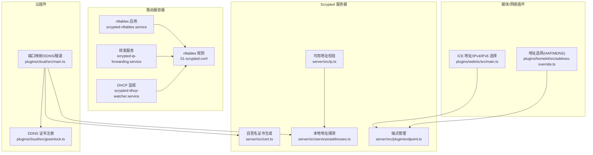
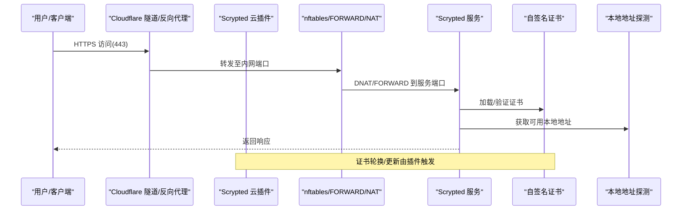
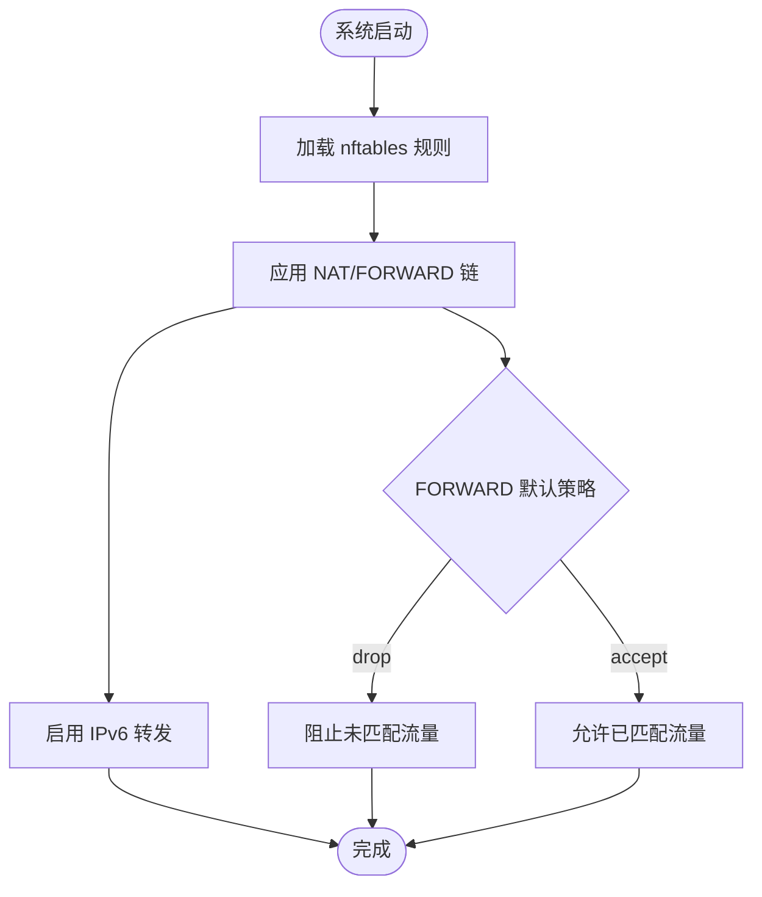
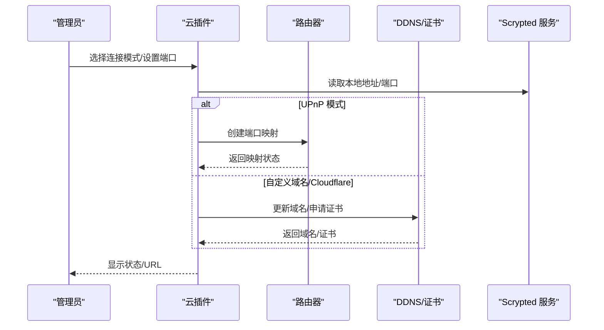
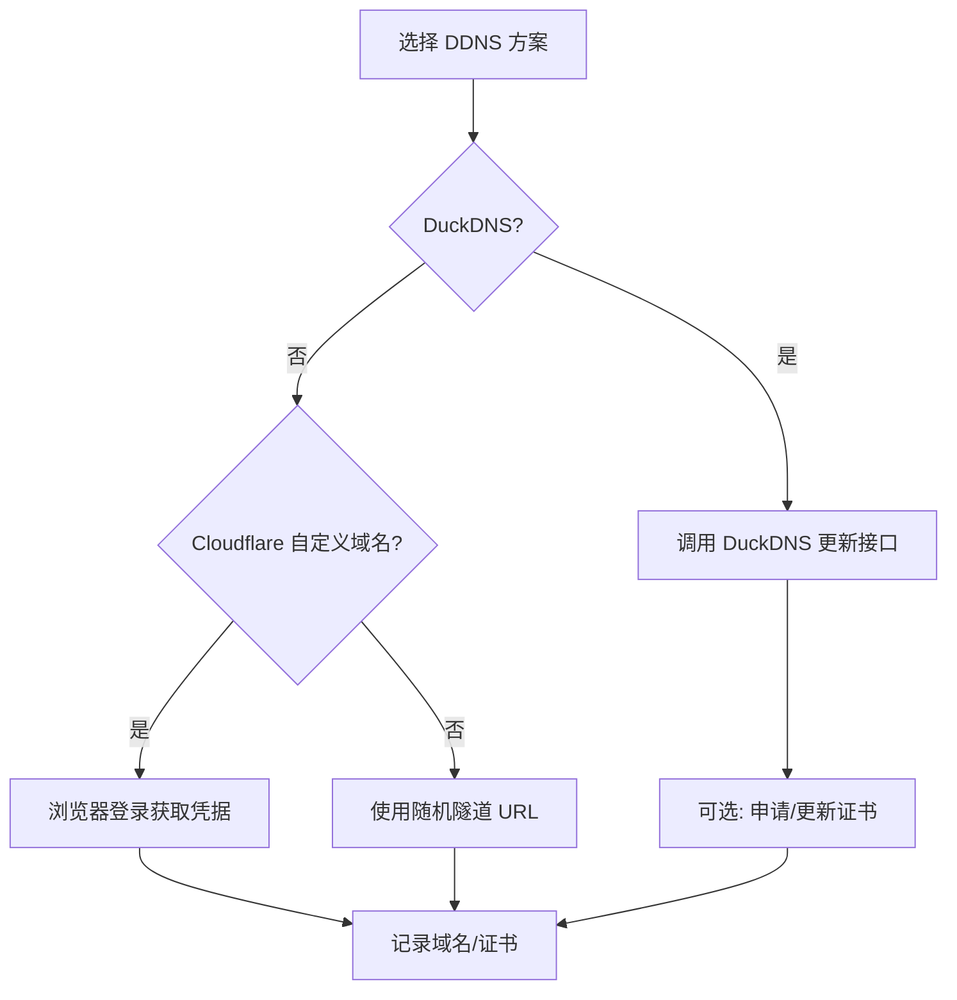
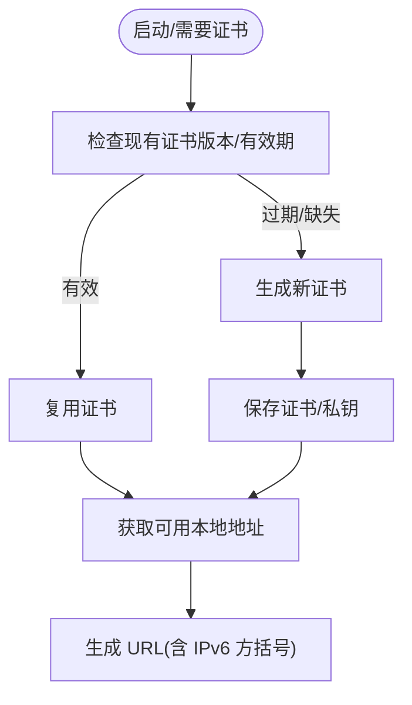
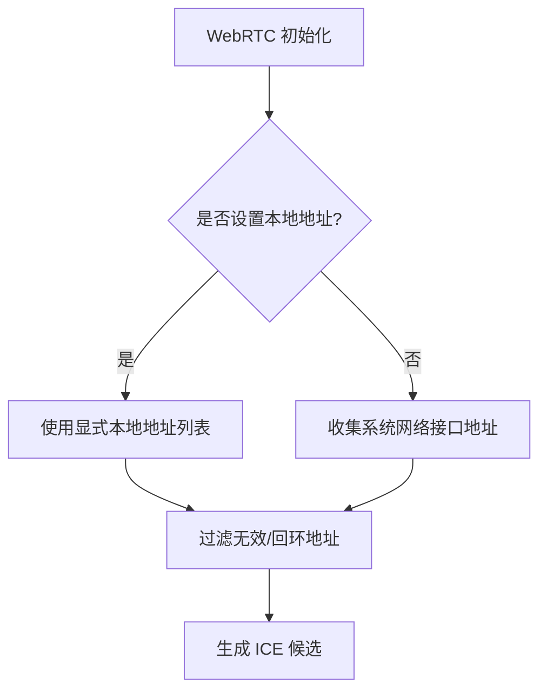
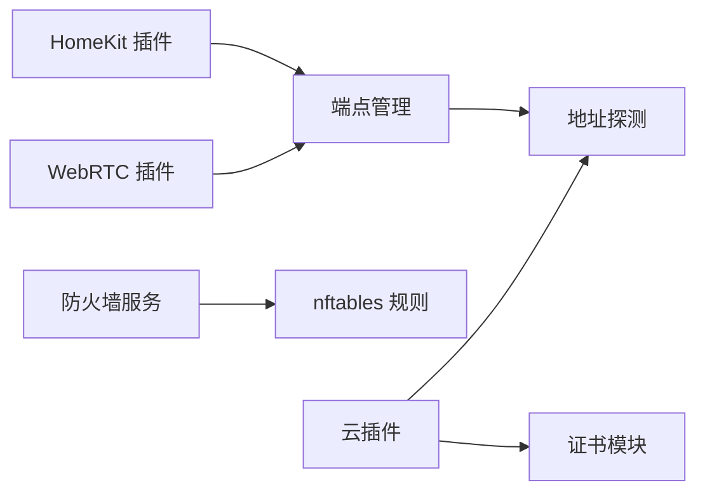

# 网络安全配置

<cite>
**本文引用的文件**   
- [install/docker/router/01-scrypted.conf](file://install/docker/router/01-scrypted.conf)
- [install/docker/router/scrypted-nftables.service](file://install/docker/router/scrypted-nftables.service)
- [install/docker/router/scrypted-ip-forwarding.service](file://install/docker/router/scrypted-ip-forwarding.service)
- [install/docker/router/scrypted-dhcp-watcher.service](file://install/docker/router/scrypted-dhcp-watcher.service)
- [plugins/cloud/src/main.ts](file://plugins/cloud/src/main.ts)
- [plugins/cloud/src/greenlock.ts](file://plugins/cloud/src/greenlock.ts)
- [server/src/cert.ts](file://server/src/cert.ts)
- [server/src/ip.ts](file://server/src/ip.ts)
- [server/src/services/addresses.ts](file://server/src/services/addresses.ts)
- [plugins/webrtc/src/main.ts](file://plugins/webrtc/src/main.ts)
- [plugins/homekit/src/address-override.ts](file://plugins/homekit/src/address-override.ts)
- [server/src/plugin/endpoint.ts](file://server/src/plugin/endpoint.ts)
- [install/docker/Dockerfile.router](file://install/docker/Dockerfile.router)
</cite>

## 目录
1. [简介](#简介)
2. [项目结构](#项目结构)
3. [核心组件](#核心组件)
4. [架构总览](#架构总览)
5. [详细组件分析](#详细组件分析)
6. [依赖关系分析](#依赖关系分析)
7. [性能考量](#性能考量)
8. [故障排查指南](#故障排查指南)
9. [结论](#结论)
10. [附录](#附录)

## 简介
本指南面向在生产环境中部署 Scrypted 的网络安全部署场景，围绕以下主题提供可操作的配置建议与流程：防火墙规则（端口开放策略、IP 白名单、流量过滤）、网络拓扑（内网/外网/DMZ/VLAN）、VPN（OpenVPN/WireGuard 客户端管理）、端口管理（默认端口修改、端口映射、扫描防护）、DDNS（动态域名、DNS 更新、解析优化）、网络监控与入侵检测（流量分析、异常检测、事件响应），并总结最佳实践与常见问题。

## 项目结构
与网络安全直接相关的代码主要集中在安装脚本与云插件中：
- 路由器容器镜像与 nftables 规则：用于在容器中实现内核级防火墙与路由转发。
- 云插件：负责端口映射、DDNS、自签名证书生成与更新、Cloudflare 隧道对接等。
- 服务器侧地址与证书工具：提供本地地址探测、可用地址过滤、自签名证书生成。
- WebRTC/HomeKit 插件：涉及 ICE 地址选择、IPv4/IPv6 优先策略，影响公网可达性与安全边界。

**图示来源**
- [install/docker/router/01-scrypted.conf:1-56](file://install/docker/router/01-scrypted.conf#L1-L56)
- [install/docker/router/scrypted-nftables.service:1-19](file://install/docker/router/scrypted-nftables.service#L1-L19)
- [install/docker/router/scrypted-ip-forwarding.service:1-18](file://install/docker/router/scrypted-ip-forwarding.service#L1-L18)
- [install/docker/router/scrypted-dhcp-watcher.service:1-11](file://install/docker/router/scrypted-dhcp-watcher.service#L1-L11)
- [plugins/cloud/src/main.ts:1-200](file://plugins/cloud/src/main.ts#L1-L200)
- [plugins/cloud/src/greenlock.ts:1-58](file://plugins/cloud/src/greenlock.ts#L1-L58)
- [server/src/cert.ts:1-102](file://server/src/cert.ts#L1-L102)
- [server/src/services/addresses.ts:31-61](file://server/src/services/addresses.ts#L31-L61)
- [server/src/ip.ts:54-106](file://server/src/ip.ts#L54-L106)
- [server/src/plugin/endpoint.ts:22-43](file://server/src/plugin/endpoint.ts#L22-L43)
- [plugins/webrtc/src/main.ts:589-622](file://plugins/webrtc/src/main.ts#L589-L622)
- [plugins/homekit/src/address-override.ts:1-23](file://plugins/homekit/src/address-override.ts#L1-L23)

**章节来源**
- [install/docker/router/01-scrypted.conf:1-56](file://install/docker/router/01-scrypted.conf#L1-L56)
- [install/docker/router/scrypted-nftables.service:1-19](file://install/docker/router/scrypted-nftables.service#L1-L19)
- [install/docker/router/scrypted-ip-forwarding.service:1-18](file://install/docker/router/scrypted-ip-forwarding.service#L1-L18)
- [install/docker/router/scrypted-dhcp-watcher.service:1-11](file://install/docker/router/scrypted-dhcp-watcher.service#L1-L11)
- [plugins/cloud/src/main.ts:369-692](file://plugins/cloud/src/main.ts#L369-L692)
- [plugins/cloud/src/greenlock.ts:1-58](file://plugins/cloud/src/greenlock.ts#L1-L58)
- [server/src/cert.ts:1-102](file://server/src/cert.ts#L1-L102)
- [server/src/services/addresses.ts:31-61](file://server/src/services/addresses.ts#L31-L61)
- [server/src/ip.ts:54-106](file://server/src/ip.ts#L54-L106)
- [server/src/plugin/endpoint.ts:22-43](file://server/src/plugin/endpoint.ts#L22-L43)
- [plugins/webrtc/src/main.ts:589-622](file://plugins/webrtc/src/main.ts#L589-L622)
- [plugins/homekit/src/address-override.ts:1-23](file://plugins/homekit/src/address-override.ts#L1-L23)

## 核心组件
- 防火墙与路由（nftables）
  - 提供 IPv4/IPv6 的 NAT 与 FORWARD 链，支持按表扩展规则集，便于集中维护。
- 云插件（端口映射/DDNS/隧道）
  - 支持 UPnP 映射、路由器端口转发、自定义域名、Cloudflare 隧道、DuckDNS 更新与证书申请。
- 证书与地址
  - 自签名证书生成与有效期管理；本地地址探测与可用性校验，避免回环与链路本地地址。
- 媒体/网络插件（WebRTC/HomeKit）
  - ICE 地址列表与 IPv4/IPv6 选择逻辑，影响公网连通性与安全边界。

**章节来源**
- [install/docker/router/01-scrypted.conf:1-56](file://install/docker/router/01-scrypted.conf#L1-L56)
- [plugins/cloud/src/main.ts:68-200](file://plugins/cloud/src/main.ts#L68-L200)
- [plugins/cloud/src/main.ts:369-692](file://plugins/cloud/src/main.ts#L369-L692)
- [server/src/cert.ts:17-101](file://server/src/cert.ts#L17-L101)
- [server/src/services/addresses.ts:31-61](file://server/src/services/addresses.ts#L31-L61)
- [server/src/ip.ts:54-106](file://server/src/ip.ts#L54-L106)
- [plugins/webrtc/src/main.ts:589-622](file://plugins/webrtc/src/main.ts#L589-L622)
- [plugins/homekit/src/address-override.ts:1-23](file://plugins/homekit/src/address-override.ts#L1-L23)

## 架构总览
下图展示从外部访问到内部服务的关键路径，以及与云插件、防火墙、证书与地址管理的交互。

**图示来源**
- [plugins/cloud/src/main.ts:369-692](file://plugins/cloud/src/main.ts#L369-L692)
- [install/docker/router/01-scrypted.conf:1-56](file://install/docker/router/01-scrypted.conf#L1-L56)
- [server/src/cert.ts:17-101](file://server/src/cert.ts#L17-L101)
- [server/src/services/addresses.ts:31-61](file://server/src/services/addresses.ts#L31-L61)

## 详细组件分析

### 组件一：防火墙与路由（nftables）
- 规则表结构
  - IPv4/IPv6 分别配置 NAT 与 FILTER 表，统一通过 FORWARD 链实施“默认丢弃”策略，提升安全性。
  - NAT 链与 FORWARD 链均预留扩展链，便于集中维护规则。
- 服务化应用
  - 通过 systemd 服务在启动时加载规则，并支持重载。
  - 启用 IPv4/IPv6 转发，确保容器或主机模式下的多协议互通。
- 可扩展性
  - 可在扩展链中添加白名单、黑名单、速率限制、日志记录等规则。

**图示来源**
- [install/docker/router/01-scrypted.conf:1-56](file://install/docker/router/01-scrypted.conf#L1-L56)
- [install/docker/router/scrypted-nftables.service:1-19](file://install/docker/router/scrypted-nftables.service#L1-L19)
- [install/docker/router/scrypted-ip-forwarding.service:1-18](file://install/docker/router/scrypted-ip-forwarding.service#L1-L18)

**章节来源**
- [install/docker/router/01-scrypted.conf:1-56](file://install/docker/router/01-scrypted.conf#L1-L56)
- [install/docker/router/scrypted-nftables.service:1-19](file://install/docker/router/scrypted-nftables.service#L1-L19)
- [install/docker/router/scrypted-ip-forwarding.service:1-18](file://install/docker/router/scrypted-ip-forwarding.service#L1-L18)

### 组件二：端口管理与映射（UPnP/路由器转发/自定义域名）
- 连接模式
  - 支持默认、UPnP、路由器转发、自定义域名、禁用等模式。
  - 自定义域名与 Cloudflare 隧道强制使用 443 端口。
- UPnP 映射
  - 自动获取本地地址，建立端口映射，失败时输出错误并提示启用路由器 UPnP 或手动转发。
- DDNS 与证书
  - DuckDNS 动态更新与证书申请流程；Cloudflare 隧道登录与 URL 获取。
- 端口扫描防护
  - 通过默认 DROP 的 FORWARD 策略与仅暴露必要端口，降低被扫描发现的概率。

**图示来源**
- [plugins/cloud/src/main.ts:68-200](file://plugins/cloud/src/main.ts#L68-L200)
- [plugins/cloud/src/main.ts:369-692](file://plugins/cloud/src/main.ts#L369-L692)
- [plugins/cloud/src/greenlock.ts:1-58](file://plugins/cloud/src/greenlock.ts#L1-L58)

**章节来源**
- [plugins/cloud/src/main.ts:68-200](file://plugins/cloud/src/main.ts#L68-L200)
- [plugins/cloud/src/main.ts:369-692](file://plugins/cloud/src/main.ts#L369-L692)
- [plugins/cloud/src/greenlock.ts:1-58](file://plugins/cloud/src/greenlock.ts#L1-L58)

### 组件三：DDNS 与域名解析（DuckDNS/Cloudflare）
- DuckDNS
  - 通过 API 更新域名记录，支持证书申请流程（当前仓库注释了自动证书写入逻辑）。
- Cloudflare
  - 支持随机隧道 URL 与自定义域名；自定义域名需完成浏览器登录流程以获取凭据。
- 域名解析优化
  - 使用 443 端口与 TLS 终止反向代理，减少明文暴露面；结合自签名证书轮换策略。

**图示来源**
- [plugins/cloud/src/main.ts:369-423](file://plugins/cloud/src/main.ts#L369-L423)
- [plugins/cloud/src/greenlock.ts:1-58](file://plugins/cloud/src/greenlock.ts#L1-L58)

**章节来源**
- [plugins/cloud/src/main.ts:369-423](file://plugins/cloud/src/main.ts#L369-L423)
- [plugins/cloud/src/greenlock.ts:1-58](file://plugins/cloud/src/greenlock.ts#L1-L58)

### 组件四：证书与地址管理
- 自签名证书
  - 生成 2048-bit RSA 证书，有效期 5 年；支持版本化与续期阈值判断。
- 本地地址探测
  - 过滤链路本地、临时 IPv6、无效地址，返回可用地址集合。
- URL 安全处理
  - IPv6 地址在 URL 中需要方括号包裹，避免歧义。

**图示来源**
- [server/src/cert.ts:17-101](file://server/src/cert.ts#L17-L101)
- [server/src/services/addresses.ts:31-61](file://server/src/services/addresses.ts#L31-L61)
- [server/src/plugin/endpoint.ts:22-26](file://server/src/plugin/endpoint.ts#L22-L26)

**章节来源**
- [server/src/cert.ts:17-101](file://server/src/cert.ts#L17-L101)
- [server/src/services/addresses.ts:31-61](file://server/src/services/addresses.ts#L31-L61)
- [server/src/plugin/endpoint.ts:22-26](file://server/src/plugin/endpoint.ts#L22-L26)

### 组件五：媒体与网络插件（WebRTC/HomeKit）
- WebRTC
  - 支持自定义 ICE 地址列表与 IPv4/IPv6 选择；当显式提供本地地址时，禁用默认收集机制，提高可控性。
- HomeKit
  - 根据 UDP 协议族选择 IPv4/IPv6 地址，保证 mDNS/UDP 通信的正确性。

**图示来源**
- [plugins/webrtc/src/main.ts:589-622](file://plugins/webrtc/src/main.ts#L589-L622)
- [plugins/homekit/src/address-override.ts:1-23](file://plugins/homekit/src/address-override.ts#L1-L23)

**章节来源**
- [plugins/webrtc/src/main.ts:589-622](file://plugins/webrtc/src/main.ts#L589-L622)
- [plugins/homekit/src/address-override.ts:1-23](file://plugins/homekit/src/address-override.ts#L1-L23)

## 依赖关系分析
- 云插件依赖本地地址探测与证书模块，以确定对外暴露的端口与域名。
- 防火墙服务在系统启动阶段加载规则，确保网络层安全基线。
- 媒体插件依赖端点管理与地址过滤，保障 ICE 与 mDNS 的正确性。

**图示来源**
- [plugins/cloud/src/main.ts:369-692](file://plugins/cloud/src/main.ts#L369-L692)
- [server/src/services/addresses.ts:31-61](file://server/src/services/addresses.ts#L31-L61)
- [server/src/cert.ts:17-101](file://server/src/cert.ts#L17-L101)
- [install/docker/router/01-scrypted.conf:1-56](file://install/docker/router/01-scrypted.conf#L1-L56)
- [plugins/webrtc/src/main.ts:589-622](file://plugins/webrtc/src/main.ts#L589-L622)
- [plugins/homekit/src/address-override.ts:1-23](file://plugins/homekit/src/address-override.ts#L1-L23)
- [server/src/plugin/endpoint.ts:22-43](file://server/src/plugin/endpoint.ts#L22-L43)

**章节来源**
- [plugins/cloud/src/main.ts:369-692](file://plugins/cloud/src/main.ts#L369-L692)
- [server/src/services/addresses.ts:31-61](file://server/src/services/addresses.ts#L31-L61)
- [server/src/cert.ts:17-101](file://server/src/cert.ts#L17-L101)
- [install/docker/router/01-scrypted.conf:1-56](file://install/docker/router/01-scrypted.conf#L1-L56)
- [plugins/webrtc/src/main.ts:589-622](file://plugins/webrtc/src/main.ts#L589-L622)
- [plugins/homekit/src/address-override.ts:1-23](file://plugins/homekit/src/address-override.ts#L1-L23)
- [server/src/plugin/endpoint.ts:22-43](file://server/src/plugin/endpoint.ts#L22-L43)

## 性能考量
- 防火墙规则尽量集中于扩展链，避免频繁重载导致的短暂中断。
- 证书轮换采用阈值判断，减少不必要的重启。
- WebRTC 显式地址列表可减少地址收集开销，提升 ICE 成功率。
- 仅暴露必要端口，降低 CPU/内存占用与攻击面。

## 故障排查指南
- UPnP 映射失败
  - 检查路由器是否启用 UPnP；查看云插件控制台错误信息；尝试改为路由器转发或禁用端口转发模式。
- DuckDNS 更新失败
  - 确认域名与令牌配置正确；查看控制台错误日志；确认网络可达 DuckDNS 接口。
- Cloudflare 自定义域名不可用
  - 完成浏览器登录流程；确认隧道凭据有效；检查 443 端口是否被占用。
- 证书问题
  - 查看证书版本与有效期；如过期则重新生成；确认私钥与证书匹配。
- 地址探测异常
  - 检查网络接口状态；确认未过滤掉可用地址；IPv6 地址在 URL 中需加方括号。

**章节来源**
- [plugins/cloud/src/main.ts:444-535](file://plugins/cloud/src/main.ts#L444-L535)
- [plugins/cloud/src/main.ts:369-423](file://plugins/cloud/src/main.ts#L369-L423)
- [server/src/cert.ts:17-101](file://server/src/cert.ts#L17-L101)
- [server/src/services/addresses.ts:31-61](file://server/src/services/addresses.ts#L31-L61)
- [server/src/plugin/endpoint.ts:22-26](file://server/src/plugin/endpoint.ts#L22-L26)

## 结论
通过在路由器容器中部署 nftables 规则、结合云插件的端口映射与 DDNS/隧道能力、配合证书与地址管理工具，可以构建一个安全、可控且易于维护的 Scrypted 网络暴露面。建议遵循最小暴露原则、定期轮换证书、使用 443/TLS 终止代理，并在防火墙层面实施严格的默认拒绝策略。

## 附录

### 端口开放策略与默认端口修改
- 仅开放必要端口（如 443、UPnP 端口、内网管理端口）。
- 默认端口可通过云插件设置；自定义域名/隧道模式强制 443。
- 避免使用 443 作为上游转发端口，应由 TLS 终止代理处理。

**章节来源**
- [plugins/cloud/src/main.ts:108-125](file://plugins/cloud/src/main.ts#L108-L125)
- [plugins/cloud/src/main.ts:486-500](file://plugins/cloud/src/main.ts#L486-L500)

### IP 白名单与流量过滤
- 在 nftables 扩展链中添加源 IP 白名单与目标端口过滤。
- 对来自特定网段的访问进行速率限制与日志记录，便于审计。

**章节来源**
- [install/docker/router/01-scrypted.conf:19-27](file://install/docker/router/01-scrypted.conf#L19-L27)

### 网络拓扑设计（内网/外网/DMZ/VLAN）
- 内网：运行 Scrypted 主服务与插件，仅对 DMZ/外网开放必要端口。
- DMZ：放置对外暴露的服务（如反向代理/隧道入口），隔离内网。
- VLAN：通过 VLAN 标记区分管理/业务/存储流量，结合 nftables 实施跨 VLAN 访问控制。

**章节来源**
- [install/docker/router/01-scrypted.conf:1-56](file://install/docker/router/01-scrypted.conf#L1-L56)

### VPN 配置方案（OpenVPN/WireGuard）
- 在 DMZ 部署 OpenVPN/WireGuard 服务，客户端通过 443/TLS 终止代理接入。
- 限制客户端访问范围，仅放行必要的内网服务端口。
- 使用强加密与短生命周期会话，定期轮换密钥。

[本节为概念性内容，不直接对应具体源码文件]

### DDNS 配置（动态域名、DNS 更新、解析优化）
- DuckDNS：通过 API 更新域名记录，结合证书申请流程。
- Cloudflare：自定义域名需完成浏览器登录；随机隧道 URL 适合临时访问。
- 解析优化：使用 443/TLS 终止代理，减少明文暴露；结合 CDN 缓存静态资源。

**章节来源**
- [plugins/cloud/src/main.ts:369-423](file://plugins/cloud/src/main.ts#L369-L423)
- [plugins/cloud/src/greenlock.ts:1-58](file://plugins/cloud/src/greenlock.ts#L1-L58)

### 网络监控与入侵检测
- 在 nftables 中启用日志记录，结合系统日志与 SIEM 进行异常检测。
- 对高频连接、异常端口扫描、异常地理位置进行告警。
- 定期审查防火墙规则与访问日志，清理无效规则。

**章节来源**
- [install/docker/router/01-scrypted.conf:19-27](file://install/docker/router/01-scrypted.conf#L19-L27)