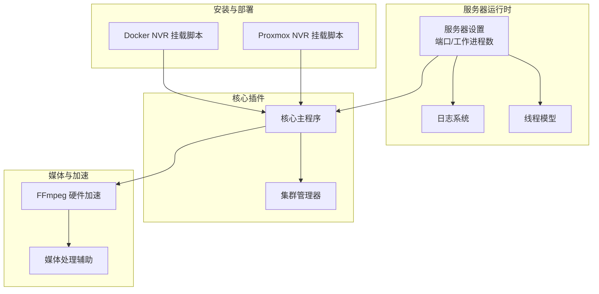
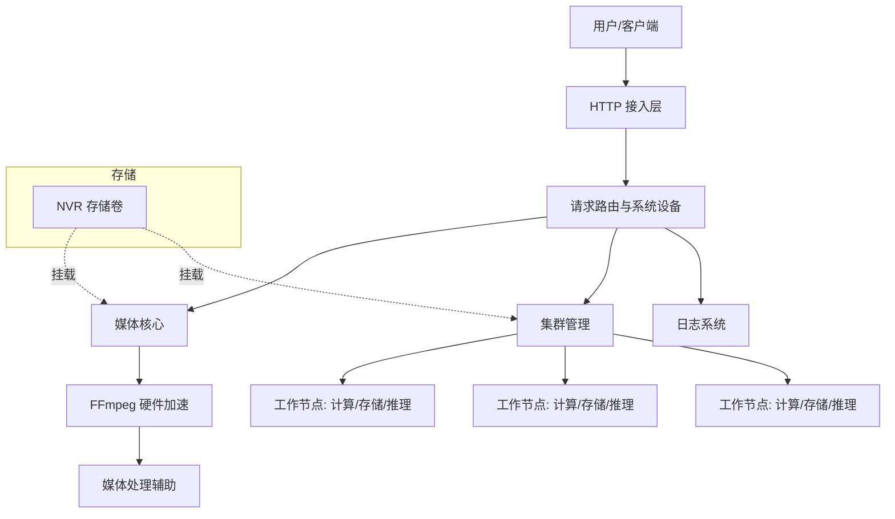
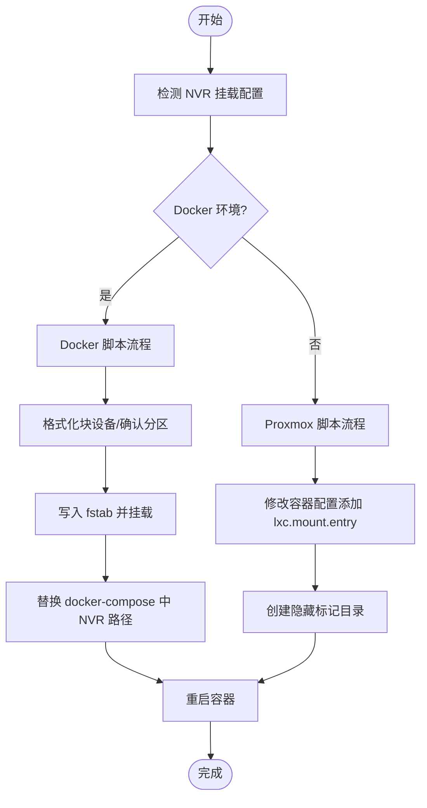
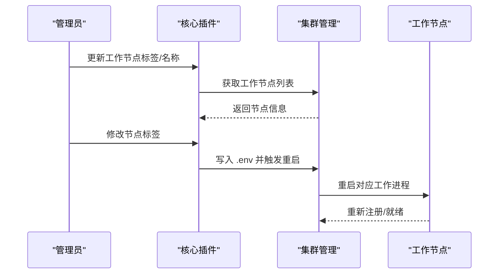
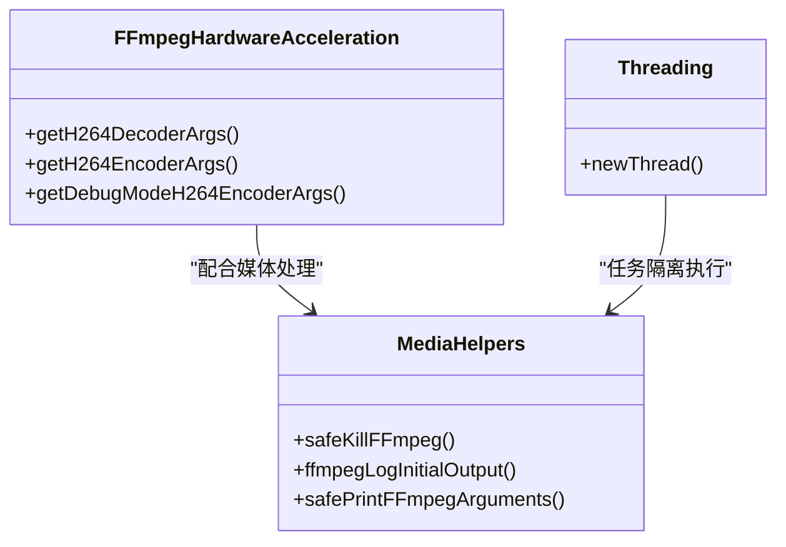
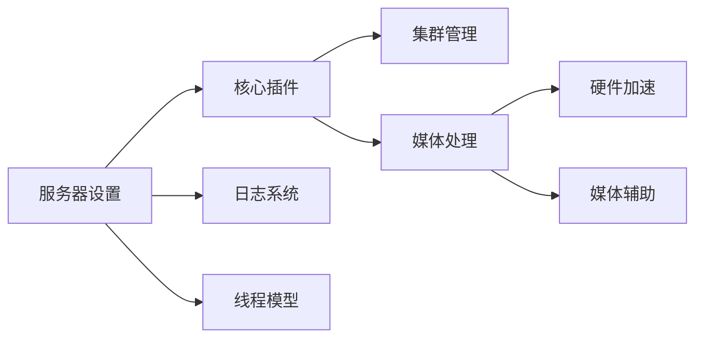

# 容量规划与扩展

<cite>
**本文引用的文件**
- [install/docker/setup-scrypted-nvr-volume.sh](file://install/docker/setup-scrypted-nvr-volume.sh)
- [install/proxmox/setup-scrypted-nvr-volume.sh](file://install/proxmox/setup-scrypted-nvr-volume.sh)
- [server/src/server-settings.ts](file://server/src/server-settings.ts)
- [plugins/core/src/main.ts](file://plugins/core/src/main.ts)
- [plugins/core/src/cluster.ts](file://plugins/core/src/cluster.ts)
- [common/src/ffmpeg-hardware-acceleration.ts](file://common/src/ffmpeg-hardware-acceleration.ts)
- [server/src/media-helpers.ts](file://server/src/media-helpers.ts)
- [server/src/logger.ts](file://server/src/logger.ts)
- [server/src/threading.ts](file://server/src/threading.ts)
</cite>

## 目录
1. [引言](#引言)
2. [项目结构](#项目结构)
3. [核心组件](#核心组件)
4. [架构总览](#架构总览)
5. [详细组件分析](#详细组件分析)
6. [依赖关系分析](#依赖关系分析)
7. [性能考虑](#性能考虑)
8. [故障排查指南](#故障排查指南)
9. [结论](#结论)
10. [附录](#附录)

## 引言
本指南面向 Scrypted 的容量规划与扩展场景，围绕以下目标展开：  
- 媒体文件存储需求、日志空间估算、缓存数据管理、NVR 存储配置  
- 硬件升级策略（CPU、内存、存储、网络）  
- 负载增加方案（水平扩展、垂直扩展、集群部署、分布式架构）  
- 性能扩展方法（硬件加速利用、并发处理优化、资源池管理、弹性伸缩）  
- 容量监控指标（存储使用率、网络带宽、CPU 负载、内存占用）  
- 扩展实施步骤（规划制定、资源准备、配置调整、测试验证）  
- 成本效益分析（硬件投资回报、运维成本控制、性能收益评估）

本指南在不直接展示代码内容的前提下，结合仓库中的实际实现文件，给出可操作的规划建议与实施路径。

## 项目结构
Scrypted 由服务端、核心插件、通用工具与安装脚本组成。与容量规划密切相关的模块包括：
- 服务器设置与集群工作进程参数
- 核心插件（系统设备、媒体核心、集群管理）
- FFmpeg 硬件加速与媒体处理辅助
- 日志与线程模型
- NVR 存储卷挂载与容器/虚拟化环境下的持久化

**图表来源**
- [install/docker/setup-scrypted-nvr-volume.sh:1-160](file://install/docker/setup-scrypted-nvr-volume.sh#L1-L160)
- [install/proxmox/setup-scrypted-nvr-volume.sh:1-75](file://install/proxmox/setup-scrypted-nvr-volume.sh#L1-L75)
- [server/src/server-settings.ts:1-11](file://server/src/server-settings.ts#L1-L11)
- [plugins/core/src/main.ts:1-414](file://plugins/core/src/main.ts#L1-L414)
- [plugins/core/src/cluster.ts:1-163](file://plugins/core/src/cluster.ts#L1-L163)
- [common/src/ffmpeg-hardware-acceleration.ts:1-147](file://common/src/ffmpeg-hardware-acceleration.ts#L1-L147)
- [server/src/media-helpers.ts:1-98](file://server/src/media-helpers.ts#L1-L98)
- [server/src/logger.ts:1-93](file://server/src/logger.ts#L1-L93)
- [server/src/threading.ts:1-100](file://server/src/threading.ts#L1-L100)

**章节来源**
- [server/src/server-settings.ts:1-11](file://server/src/server-settings.ts#L1-L11)
- [plugins/core/src/main.ts:1-414](file://plugins/core/src/main.ts#L1-L414)
- [plugins/core/src/cluster.ts:1-163](file://plugins/core/src/cluster.ts#L1-L163)
- [common/src/ffmpeg-hardware-acceleration.ts:1-147](file://common/src/ffmpeg-hardware-acceleration.ts#L1-L147)
- [server/src/media-helpers.ts:1-98](file://server/src/media-helpers.ts#L1-L98)
- [server/src/logger.ts:1-93](file://server/src/logger.ts#L1-L93)
- [server/src/threading.ts:1-100](file://server/src/threading.ts#L1-L100)
- [install/docker/setup-scrypted-nvr-volume.sh:1-160](file://install/docker/setup-scrypted-nvr-volume.sh#L1-L160)
- [install/proxmox/setup-scrypted-nvr-volume.sh:1-75](file://install/proxmox/setup-scrypted-nvr-volume.sh#L1-L75)

## 核心组件
- 服务器设置与运行参数：定义安全端口、非安全端口、调试端口以及默认集群工作进程数量，影响并发处理能力与资源占用。
- 核心插件：负责系统设备发现、HTTP 请求路由、脚本与自动化、终端与 REPL、集群工作节点管理等。
- 集群管理：通过标签与环境变量对工作节点进行分组与调度，支持按计算/存储等角色分离。
- FFmpeg 硬件加速：根据平台自动选择合适的解码/编码器，降低 CPU 占用并提升吞吐。
- 媒体处理辅助：提供安全退出 FFmpeg 进程、日志过滤与参数脱敏打印等能力。
- 日志系统：集中记录与清理日志，便于容量监控与问题定位。
- 线程模型：基于 Worker Threads 的轻量并发执行框架，用于隔离与复用任务。

**章节来源**
- [server/src/server-settings.ts:1-11](file://server/src/server-settings.ts#L1-L11)
- [plugins/core/src/main.ts:27-394](file://plugins/core/src/main.ts#L27-L394)
- [plugins/core/src/cluster.ts:6-101](file://plugins/core/src/cluster.ts#L6-L101)
- [common/src/ffmpeg-hardware-acceleration.ts:49-131](file://common/src/ffmpeg-hardware-acceleration.ts#L49-L131)
- [server/src/media-helpers.ts:11-97](file://server/src/media-helpers.ts#L11-L97)
- [server/src/logger.ts:19-92](file://server/src/logger.ts#L19-L92)
- [server/src/threading.ts:12-99](file://server/src/threading.ts#L12-L99)

## 架构总览
下图展示了与容量规划相关的关键交互：存储卷挂载、集群工作节点、媒体处理与日志输出。

**图表来源**
- [plugins/core/src/main.ts:27-394](file://plugins/core/src/main.ts#L27-L394)
- [plugins/core/src/cluster.ts:27-101](file://plugins/core/src/cluster.ts#L27-L101)
- [common/src/ffmpeg-hardware-acceleration.ts:49-131](file://common/src/ffmpeg-hardware-acceleration.ts#L49-L131)
- [server/src/media-helpers.ts:40-71](file://server/src/media-helpers.ts#L40-L71)
- [server/src/logger.ts:33-46](file://server/src/logger.ts#L33-L46)
- [install/docker/setup-scrypted-nvr-volume.sh:136-156](file://install/docker/setup-scrypted-nvr-volume.sh#L136-L156)
- [install/proxmox/setup-scrypted-nvr-volume.sh:55-71](file://install/proxmox/setup-scrypted-nvr-volume.sh#L55-L71)

## 详细组件分析

### 存储容量规划与 NVR 配置
- Docker 环境：通过脚本检测 docker-compose 配置中的 NVR 挂载点，支持格式化磁盘分区并写入 fstab 自动挂载，随后替换 compose 文件中的 NVR 路径并重启容器。
- Proxmox 环境：在容器配置中添加 lxc.mount.entry，支持将宿主大容量或高速存储挂载到容器内的 NVR 目录，并通过隐藏标记目录辅助识别。
- 建议：
  - 为高分辨率/高帧率视频流预留充足存储空间，结合录制保留期与压缩算法选择确定每日增长量。
  - 使用独立磁盘或卷承载 NVR，避免与系统盘争用 IO。
  - 在容器/虚拟化环境中确保挂载权限与持久化策略正确，防止重启后丢失。

**图表来源**
- [install/docker/setup-scrypted-nvr-volume.sh:78-156](file://install/docker/setup-scrypted-nvr-volume.sh#L78-L156)
- [install/proxmox/setup-scrypted-nvr-volume.sh:62-71](file://install/proxmox/setup-scrypted-nvr-volume.sh#L62-L71)

**章节来源**
- [install/docker/setup-scrypted-nvr-volume.sh:1-160](file://install/docker/setup-scrypted-nvr-volume.sh#L1-L160)
- [install/proxmox/setup-scrypted-nvr-volume.sh:1-75](file://install/proxmox/setup-scrypted-nvr-volume.sh#L1-L75)

### 日志空间估算与管理
- 日志系统支持按时间窗口清理、子日志器聚合与告警清理，有助于控制日志体积与查询效率。
- 建议：
  - 结合业务峰值流量设定日志保留周期，定期清理过期日志。
  - 对高频错误进行聚合与阈值告警，避免日志膨胀导致磁盘压力。

**章节来源**
- [server/src/logger.ts:19-92](file://server/src/logger.ts#L19-L92)

### 缓存数据管理
- 媒体处理辅助提供安全退出 FFmpeg 进程的能力，避免残留进程占用资源；同时支持日志过滤与参数脱敏打印，减少冗余输出。
- 建议：
  - 在高并发场景下，合理设置超时与退出策略，防止僵尸进程与句柄泄漏。
  - 对媒体转码/转封装任务采用队列化与限速策略，避免瞬时 IO 冲击。

**章节来源**
- [server/src/media-helpers.ts:11-38](file://server/src/media-helpers.ts#L11-L38)
- [server/src/media-helpers.ts:40-97](file://server/src/media-helpers.ts#L40-L97)

### 硬件升级策略
- CPU 升级：提高集群工作进程数与并发处理能力，适合多路高分辨率实时流处理。
- 内存扩容：缓解媒体编解码与 AI 推理过程中的内存压力，提升稳定性。
- 存储扩展：采用更高吞吐的磁盘或 SSD，满足长时间录制与回放需求。
- 网络带宽：在高并发接入场景下，优先保障上行带宽与交换机端口容量。

**章节来源**
- [server/src/server-settings.ts:6-6](file://server/src/server-settings.ts#L6-L6)
- [plugins/core/src/cluster.ts:77-96](file://plugins/core/src/cluster.ts#L77-L96)

### 负载增加方案
- 水平扩展：通过集群管理器新增工作节点，按角色（存储/计算/推理）分配任务。
- 垂直扩展：提升单节点 CPU/内存/IO 能力，配合更优的硬件加速配置。
- 集群部署：利用标签与环境变量对节点进行分类，实现跨主机的任务调度。
- 分布式架构：将存储与计算分离，结合独立 NVR 卷与多节点工作进程，提升整体可用性与吞吐。

**图表来源**
- [plugins/core/src/cluster.ts:103-154](file://plugins/core/src/cluster.ts#L103-L154)

**章节来源**
- [plugins/core/src/cluster.ts:27-101](file://plugins/core/src/cluster.ts#L27-L101)
- [plugins/core/src/cluster.ts:103-154](file://plugins/core/src/cluster.ts#L103-L154)

### 性能扩展方法
- 硬件加速利用：根据平台自动选择最优解码/编码器，显著降低 CPU 占用。
- 并发处理优化：通过工作进程与线程模型实现任务隔离与并行执行。
- 资源池管理：结合集群标签与环境变量，将不同类型的计算/存储任务分配至专用节点。
- 弹性伸缩：在容器/虚拟化环境下动态调整卷大小与节点数量，配合监控指标进行弹性决策。

**图表来源**
- [common/src/ffmpeg-hardware-acceleration.ts:49-131](file://common/src/ffmpeg-hardware-acceleration.ts#L49-L131)
- [server/src/media-helpers.ts:11-97](file://server/src/media-helpers.ts#L11-L97)
- [server/src/threading.ts:12-99](file://server/src/threading.ts#L12-L99)

**章节来源**
- [common/src/ffmpeg-hardware-acceleration.ts:49-131](file://common/src/ffmpeg-hardware-acceleration.ts#L49-L131)
- [server/src/media-helpers.ts:40-97](file://server/src/media-helpers.ts#L40-L97)
- [server/src/threading.ts:12-99](file://server/src/threading.ts#L12-L99)

## 依赖关系分析
- 核心插件依赖服务器设置中的端口与工作进程参数，决定对外服务与并发能力。
- 集群管理依赖系统组件提供的服务控制与环境变量管理，实现节点标签与重启机制。
- 媒体处理依赖 FFmpeg 硬件加速与媒体处理辅助，保证在高负载下的稳定性与性能。
- 日志系统贯穿各模块，提供统一的日志采集与清理能力。

**图表来源**
- [server/src/server-settings.ts:1-11](file://server/src/server-settings.ts#L1-L11)
- [plugins/core/src/main.ts:27-394](file://plugins/core/src/main.ts#L27-L394)
- [plugins/core/src/cluster.ts:27-101](file://plugins/core/src/cluster.ts#L27-L101)
- [common/src/ffmpeg-hardware-acceleration.ts:49-131](file://common/src/ffmpeg-hardware-acceleration.ts#L49-L131)
- [server/src/media-helpers.ts:40-97](file://server/src/media-helpers.ts#L40-L97)
- [server/src/logger.ts:33-46](file://server/src/logger.ts#L33-L46)
- [server/src/threading.ts:12-99](file://server/src/threading.ts#L12-L99)

**章节来源**
- [server/src/server-settings.ts:1-11](file://server/src/server-settings.ts#L1-L11)
- [plugins/core/src/main.ts:27-394](file://plugins/core/src/main.ts#L27-L394)
- [plugins/core/src/cluster.ts:27-101](file://plugins/core/src/cluster.ts#L27-L101)
- [common/src/ffmpeg-hardware-acceleration.ts:49-131](file://common/src/ffmpeg-hardware-acceleration.ts#L49-L131)
- [server/src/media-helpers.ts:40-97](file://server/src/media-helpers.ts#L40-L97)
- [server/src/logger.ts:33-46](file://server/src/logger.ts#L33-L46)
- [server/src/threading.ts:12-99](file://server/src/threading.ts#L12-L99)

## 性能考虑
- 解码/编码器选择：根据平台特性启用 CUDA/CUVID/VAAPI/QuickSync/VideoToolbox 等硬件加速，减少 CPU 占用。
- 日志与输出：仅在必要时输出详细日志，避免频繁 I/O；对敏感参数进行脱敏打印。
- 并发与线程：通过工作进程与线程模型隔离任务，避免阻塞主线程；合理设置超时与退出策略，防止资源泄露。
- 存储 IO：将 NVR 卷与系统卷分离，优先使用 SSD 或高性能磁盘；对高并发写入场景进行队列化与限速。

**章节来源**
- [common/src/ffmpeg-hardware-acceleration.ts:49-131](file://common/src/ffmpeg-hardware-acceleration.ts#L49-L131)
- [server/src/media-helpers.ts:40-97](file://server/src/media-helpers.ts#L40-L97)
- [server/src/threading.ts:12-99](file://server/src/threading.ts#L12-L99)

## 故障排查指南
- FFmpeg 进程异常退出：使用安全退出函数发送停止指令并销毁 stdio，避免残留进程；检查日志过滤与初始输出是否被截断。
- 日志膨胀：定期清理过期日志，设置告警阈值，避免磁盘占满。
- 集群节点标签变更：通过环境变量更新触发节点重启，确保新标签生效。
- NVR 卷挂载失败：核对 docker-compose 配置与 fstab 条目，确认设备 UUID 与挂载路径一致。

**章节来源**
- [server/src/media-helpers.ts:11-38](file://server/src/media-helpers.ts#L11-L38)
- [server/src/logger.ts:48-75](file://server/src/logger.ts#L48-L75)
- [plugins/core/src/cluster.ts:135-153](file://plugins/core/src/cluster.ts#L135-L153)
- [install/docker/setup-scrypted-nvr-volume.sh:127-134](file://install/docker/setup-scrypted-nvr-volume.sh#L127-L134)

## 结论
Scrypted 的容量规划应从“存储、计算、网络、日志”四维入手，结合硬件加速与集群化部署，实现从单机到分布式、从垂直到水平的弹性扩展。通过 NVR 卷的独立挂载、工作节点的角色划分、FFmpeg 硬件加速与日志/线程模型的优化，可在保证稳定性的同时最大化吞吐与性价比。

## 附录

### 容量监控指标清单
- 存储使用率：NVR 卷与系统卷的实时使用率与增长趋势
- 网络带宽：上/下行峰值与平均带宽，连接数与丢包率
- CPU 负载：工作进程数与 CPU 利用率，关键任务的 CPU 占用
- 内存占用：媒体编解码与 AI 推理峰值内存，GC 与碎片情况
- 日志体积：日志条目增长速率与保留周期，磁盘占用占比

### 扩展实施步骤
- 规划制定：评估当前媒体流数量、分辨率、帧率与保留期，计算每日/每月增长量
- 资源准备：采购磁盘/SSD、网卡与交换机端口，准备容器/虚拟化环境
- 配置调整：设置服务器端口与工作进程数，配置集群标签与节点角色
- 存储挂载：执行 NVR 挂载脚本，验证卷权限与持久化
- 测试验证：压测媒体编解码与回放，校验日志与告警策略
- 成本效益评估：对比硬件投入与运维成本，量化性能收益与 ROI