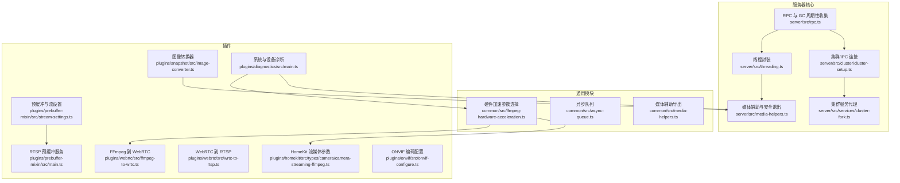
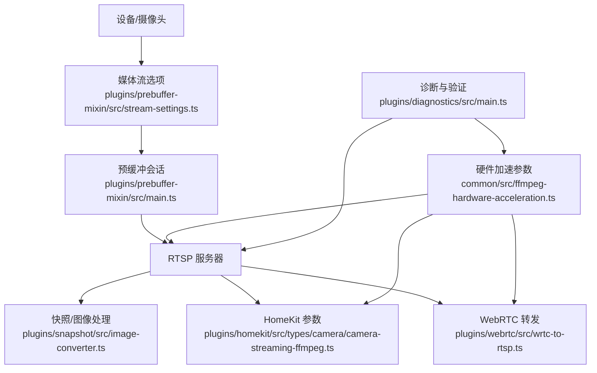
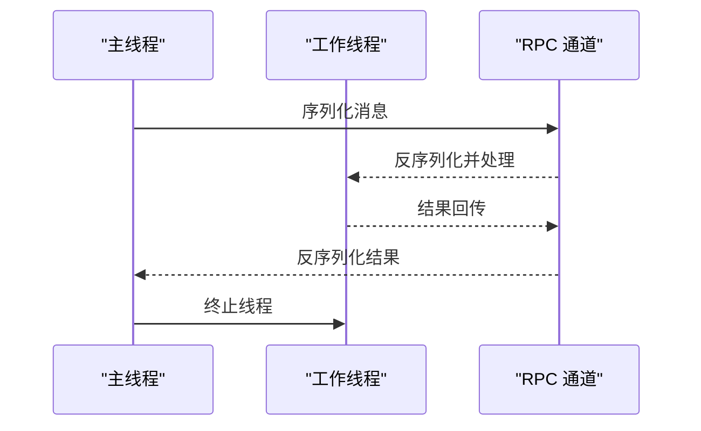
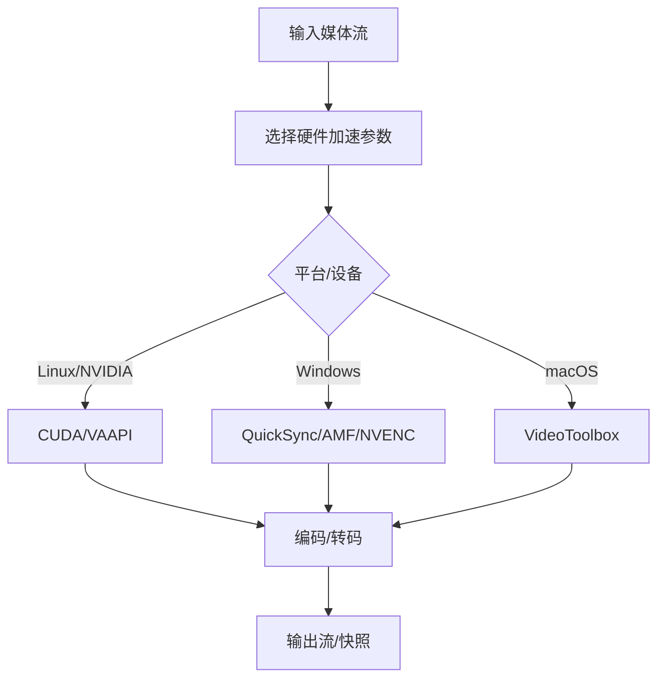
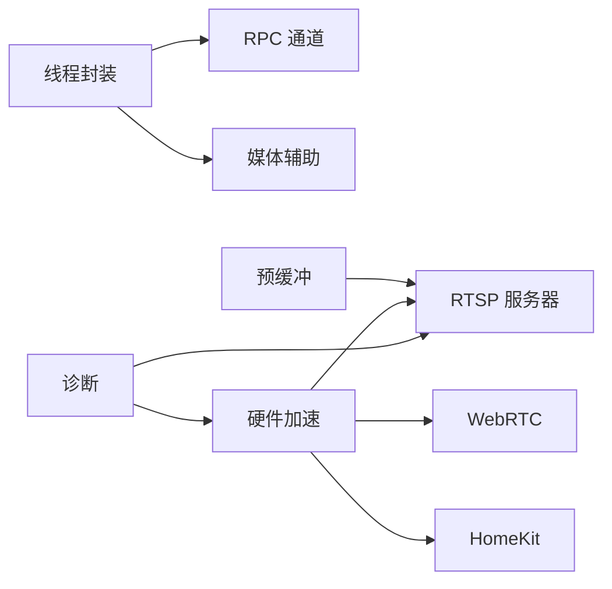

# 性能调优优化

<cite>
**本文引用的文件**
- [server/src/threading.ts](file://server/src/threading.ts)
- [common/src/ffmpeg-hardware-acceleration.ts](file://common/src/ffmpeg-hardware-acceleration.ts)
- [server/src/media-helpers.ts](file://server/src/media-helpers.ts)
- [common/src/media-helpers.ts](file://common/src/media-helpers.ts)
- [plugins/snapshot/src/image-converter.ts](file://plugins/snapshot/src/image-converter.ts)
- [plugins/prebuffer-mixin/src/stream-settings.ts](file://plugins/prebuffer-mixin/src/stream-settings.ts)
- [plugins/prebuffer-mixin/src/main.ts](file://plugins/prebuffer-mixin/src/main.ts)
- [plugins/webrtc/src/ffmpeg-to-wrtc.ts](file://plugins/webrtc/src/ffmpeg-to-wrtc.ts)
- [plugins/webrtc/src/wrtc-to-rtsp.ts](file://plugins/webrtc/src/wrtc-to-rtsp.ts)
- [plugins/homekit/src/types/camera/camera-streaming-ffmpeg.ts](file://plugins/homekit/src/types/camera/camera-streaming-ffmpeg.ts)
- [plugins/onvif/src/onvif-configure.ts](file://plugins/onvif/src/onvif-configure.ts)
- [plugins/onvif/src/onvif-api.ts](file://plugins/onvif/src/onvif-api.ts)
- [plugins/diagnostics/src/main.ts](file://plugins/diagnostics/src/main.ts)
- [server/src/rpc.ts](file://server/src/rpc.ts)
- [common/src/async-queue.ts](file://common/src/async-queue.ts)
- [server/src/cluster/cluster-setup.ts](file://server/src/cluster/cluster-setup.ts)
- [server/src/services/cluster-fork.ts](file://server/src/services/cluster-fork.ts)
- [sdk/polyfill/realfs.js](file://sdk/polyfill/realfs.js)
</cite>

## 目录
1. [简介](#简介)
2. [项目结构](#项目结构)
3. [核心组件](#核心组件)
4. [架构总览](#架构总览)
5. [详细组件分析](#详细组件分析)
6. [依赖关系分析](#依赖关系分析)
7. [性能考量](#性能考量)
8. [故障排查指南](#故障排查指南)
9. [结论](#结论)
10. [附录](#附录)

## 简介
本指南面向 Scrypted 的性能调优与优化，覆盖内存优化（垃圾回收、内存泄漏检测、缓存管理）、CPU 调优（并发线程、任务调度、计算密集型任务处理）、I/O 优化（磁盘与网络、数据库/存储访问）、媒体处理性能（硬件加速、编码参数、流媒体优化）、性能监控与基准测试、以及瓶颈识别方法。文档基于仓库中的实际实现进行分析，并提供可操作的建议与可视化图示。

## 项目结构
Scrypted 采用多插件与服务化的架构，核心运行时位于 server 目录，通用工具与媒体辅助位于 common 目录，各功能插件位于 plugins 目录，SDK 位于 sdk 目录。媒体处理链路贯穿 server、common 与多个插件；线程与集群能力由 server 提供；诊断与验证能力由 diagnostics 插件提供。

**图表来源**
- [server/src/rpc.ts:1-27](file://server/src/rpc.ts#L1-L27)
- [server/src/threading.ts:1-100](file://server/src/threading.ts#L1-L100)
- [server/src/cluster/cluster-setup.ts:137-241](file://server/src/cluster/cluster-setup.ts#L137-L241)
- [server/src/services/cluster-fork.ts:124-155](file://server/src/services/cluster-fork.ts#L124-L155)
- [server/src/media-helpers.ts:1-98](file://server/src/media-helpers.ts#L1-L98)
- [common/src/ffmpeg-hardware-acceleration.ts:1-147](file://common/src/ffmpeg-hardware-acceleration.ts#L1-L147)
- [common/src/async-queue.ts:1-242](file://common/src/async-queue.ts#L1-L242)
- [plugins/prebuffer-mixin/src/stream-settings.ts:1-268](file://plugins/prebuffer-mixin/src/stream-settings.ts#L1-L268)
- [plugins/prebuffer-mixin/src/main.ts:1166-1198](file://plugins/prebuffer-mixin/src/main.ts#L1166-L1198)
- [plugins/snapshot/src/image-converter.ts:1-25](file://plugins/snapshot/src/image-converter.ts#L1-L25)
- [plugins/webrtc/src/ffmpeg-to-wrtc.ts:113-146](file://plugins/webrtc/src/ffmpeg-to-wrtc.ts#L113-L146)
- [plugins/webrtc/src/wrtc-to-rtsp.ts:128-142](file://plugins/webrtc/src/wrtc-to-rtsp.ts#L128-L142)
- [plugins/homekit/src/types/camera/camera-streaming-ffmpeg.ts:138-167](file://plugins/homekit/src/types/camera/camera-streaming-ffmpeg.ts#L138-L167)
- [plugins/onvif/src/onvif-configure.ts:49-202](file://plugins/onvif/src/onvif-configure.ts#L49-L202)
- [plugins/diagnostics/src/main.ts:654-744](file://plugins/diagnostics/src/main.ts#L654-L744)

**章节来源**
- [server/src/rpc.ts:1-27](file://server/src/rpc.ts#L1-L27)
- [server/src/threading.ts:1-100](file://server/src/threading.ts#L1-L100)
- [server/src/cluster/cluster-setup.ts:137-241](file://server/src/cluster/cluster-setup.ts#L137-L241)
- [server/src/services/cluster-fork.ts:124-155](file://server/src/services/cluster-fork.ts#L124-L155)
- [server/src/media-helpers.ts:1-98](file://server/src/media-helpers.ts#L1-L98)
- [common/src/ffmpeg-hardware-acceleration.ts:1-147](file://common/src/ffmpeg-hardware-acceleration.ts#L1-L147)
- [common/src/async-queue.ts:1-242](file://common/src/async-queue.ts#L1-L242)
- [plugins/prebuffer-mixin/src/stream-settings.ts:1-268](file://plugins/prebuffer-mixin/src/stream-settings.ts#L1-L268)
- [plugins/prebuffer-mixin/src/main.ts:1166-1198](file://plugins/prebuffer-mixin/src/main.ts#L1166-L1198)
- [plugins/snapshot/src/image-converter.ts:1-25](file://plugins/snapshot/src/image-converter.ts#L1-L25)
- [plugins/webrtc/src/ffmpeg-to-wrtc.ts:113-146](file://plugins/webrtc/src/ffmpeg-to-wrtc.ts#L113-L146)
- [plugins/webrtc/src/wrtc-to-rtsp.ts:128-142](file://plugins/webrtc/src/wrtc-to-rtsp.ts#L128-L142)
- [plugins/homekit/src/types/camera/camera-streaming-ffmpeg.ts:138-167](file://plugins/homekit/src/types/camera/camera-streaming-ffmpeg.ts#L138-L167)
- [plugins/onvif/src/onvif-configure.ts:49-202](file://plugins/onvif/src/onvif-configure.ts#L49-L202)
- [plugins/diagnostics/src/main.ts:654-744](file://plugins/diagnostics/src/main.ts#L654-L744)

## 核心组件
- 线程与并发：通过 worker_threads 封装新线程执行，避免阻塞主线程，支持序列化传输与 VM 执行。
- 媒体处理：FFmpeg 进程管理、硬件加速参数选择、日志过滤与安全退出。
- 预缓冲与流设置：按场景选择本地/远程/低分辨率/录制等流，控制预缓冲与合成流。
- WebRTC/RTSP 流媒体：在不同协议间转发与参数适配，关注首包延迟与编解码参数。
- ONVIF 编码配置：自动探测与配置摄像头编码参数，确保码率、帧率、关键帧间隔合理。
- 诊断与验证：系统环境、GPU 加速、外部资源可达性、对象检测与相似度校验等。

**章节来源**
- [server/src/threading.ts:1-100](file://server/src/threading.ts#L1-L100)
- [server/src/media-helpers.ts:1-98](file://server/src/media-helpers.ts#L1-L98)
- [common/src/ffmpeg-hardware-acceleration.ts:1-147](file://common/src/ffmpeg-hardware-acceleration.ts#L1-L147)
- [plugins/prebuffer-mixin/src/stream-settings.ts:1-268](file://plugins/prebuffer-mixin/src/stream-settings.ts#L1-L268)
- [plugins/webrtc/src/ffmpeg-to-wrtc.ts:113-146](file://plugins/webrtc/src/ffmpeg-to-wrtc.ts#L113-L146)
- [plugins/webrtc/src/wrtc-to-rtsp.ts:128-142](file://plugins/webrtc/src/wrtc-to-rtsp.ts#L128-L142)
- [plugins/onvif/src/onvif-configure.ts:49-202](file://plugins/onvif/src/onvif-configure.ts#L49-L202)
- [plugins/diagnostics/src/main.ts:654-744](file://plugins/diagnostics/src/main.ts#L654-L744)

## 架构总览
下图展示从设备到流媒体输出的关键路径，包括硬件加速、编码参数、预缓冲与协议转换。

**图表来源**
- [plugins/prebuffer-mixin/src/stream-settings.ts:1-268](file://plugins/prebuffer-mixin/src/stream-settings.ts#L1-L268)
- [plugins/prebuffer-mixin/src/main.ts:1166-1198](file://plugins/prebuffer-mixin/src/main.ts#L1166-L1198)
- [plugins/webrtc/src/wrtc-to-rtsp.ts:128-142](file://plugins/webrtc/src/wrtc-to-rtsp.ts#L128-L142)
- [plugins/homekit/src/types/camera/camera-streaming-ffmpeg.ts:138-167](file://plugins/homekit/src/types/camera/camera-streaming-ffmpeg.ts#L138-L167)
- [plugins/snapshot/src/image-converter.ts:1-25](file://plugins/snapshot/src/image-converter.ts#L1-L25)
- [common/src/ffmpeg-hardware-acceleration.ts:1-147](file://common/src/ffmpeg-hardware-acceleration.ts#L1-L147)
- [plugins/diagnostics/src/main.ts:654-744](file://plugins/diagnostics/src/main.ts#L654-L744)

## 详细组件分析

### 内存优化策略
- 垃圾回收配置与周期性触发
  - 通过 RPC 层提供周期性 GC 触发机制，结合对象创建/回收计数与时间阈值，避免长时间无 GC 导致内存膨胀。
  - 建议在高负载场景下配合 Node.js 启动参数启用全局 GC 暴露，以允许周期性触发。
  
  **章节来源**
  - [server/src/rpc.ts:1-27](file://server/src/rpc.ts#L1-L27)

- 内存泄漏检测
  - 使用安全退出流程终止 FFmpeg 子进程，确保标准流关闭与 SIGKILL 备选，防止资源未释放导致泄漏。
  - 在诊断插件中对 GPU 解码/变换进行超时与结果校验，避免长时间占用内存。
  
  **章节来源**
  - [server/src/media-helpers.ts:11-38](file://server/src/media-helpers.ts#L11-L38)
  - [plugins/diagnostics/src/main.ts:654-744](file://plugins/diagnostics/src/main.ts#L654-L744)

- 缓存管理优化
  - 使用异步队列管理任务提交与消费，支持取消信号与批量清空，降低堆积与重复计算。
  - 对于需要去重的任务，可结合键值缓存与定时清理，避免无限增长。
  
  **章节来源**
  - [common/src/async-queue.ts:1-242](file://common/src/async-queue.ts#L1-L242)

**图表来源**
- [server/src/rpc.ts:1-27](file://server/src/rpc.ts#L1-L27)

### CPU 调优方法
- 并发线程配置
  - 通过线程封装在 worker_threads 中执行独立脚本，主线程仅负责 RPC 通信与序列化，减少主线程阻塞。
  - 可根据任务类型拆分：I/O 密集型（如 FFmpeg）与 CPU 密集型（如图像处理）分别在不同线程执行。
  
  **章节来源**
  - [server/src/threading.ts:1-100](file://server/src/threading.ts#L1-L100)

- 任务调度优化
  - 异步队列支持提交、出队、取消与批量清空，适合事件驱动与批处理场景，降低上下文切换成本。
  
  **章节来源**
  - [common/src/async-queue.ts:1-242](file://common/src/async-queue.ts#L1-L242)

- 计算密集型任务处理
  - 图像转换与编码参数调整应尽量利用硬件加速，减少软件编码开销。
  
  **章节来源**
  - [plugins/snapshot/src/image-converter.ts:1-25](file://plugins/snapshot/src/image-converter.ts#L1-L25)
  - [common/src/ffmpeg-hardware-acceleration.ts:1-147](file://common/src/ffmpeg-hardware-acceleration.ts#L1-L147)

**图表来源**
- [server/src/threading.ts:68-99](file://server/src/threading.ts#L68-L99)

### I/O 优化方案
- 磁盘读写优化
  - 使用真实文件系统 polyfill 与 FS Promise 代理，确保在集群模式下正确路由文件操作。
  - 对大文件/临时文件采用流式处理与最小化中间缓冲。
  
  **章节来源**
  - [sdk/polyfill/realfs.js:1-1](file://sdk/polyfill/realfs.js#L1-L1)
  - [server/src/services/cluster-fork.ts:124-155](file://server/src/services/cluster-fork.ts#L124-L155)

- 网络带宽管理
  - WebRTC 到 RTSP 转发中记录首包时间与 NALU 类型，便于评估网络质量与延迟。
  - HomeKit 流参数严格匹配音频打包时长，避免静音或断续。
  
  **章节来源**
  - [plugins/webrtc/src/wrtc-to-rtsp.ts:128-142](file://plugins/webrtc/src/wrtc-to-rtsp.ts#L128-L142)
  - [plugins/homekit/src/types/camera/camera-streaming-ffmpeg.ts:138-167](file://plugins/homekit/src/types/camera/camera-streaming-ffmpeg.ts#L138-L167)

- 数据库/存储访问
  - 诊断插件验证外部资源可达性与 DNS 解析，避免因网络问题导致的阻塞与重试风暴。
  
  **章节来源**
  - [plugins/diagnostics/src/main.ts:615-652](file://plugins/diagnostics/src/main.ts#L615-L652)

### 媒体处理性能提升
- 硬件加速配置
  - 根据平台与设备自动选择合适的解码/编码器参数，优先使用 GPU/CPU 特定加速后端。
  - 诊断插件验证 VAAPI/CUDA/QuickSync 等硬件加速是否可用，并进行简单变换测试。
  
  **章节来源**
  - [common/src/ffmpeg-hardware-acceleration.ts:1-147](file://common/src/ffmpeg-hardware-acceleration.ts#L1-L147)
  - [plugins/diagnostics/src/main.ts:654-744](file://plugins/diagnostics/src/main.ts#L654-L744)

- 编码参数调整
  - ONVIF 自动配置码率、帧率、关键帧间隔与编码格式，确保与客户端兼容与低延迟。
  - WebRTC 入口根据设备能力选择基线或更高分辨率，避免低端设备过载。
  
  **章节来源**
  - [plugins/onvif/src/onvif-configure.ts:49-202](file://plugins/onvif/src/onvif-configure.ts#L49-L202)
  - [plugins/webrtc/src/ffmpeg-to-wrtc.ts:113-146](file://plugins/webrtc/src/ffmpeg-to-wrtc.ts#L113-L146)

- 流媒体优化
  - 预缓冲策略按场景启用，减少首开延迟；同时避免对云端相机启用预缓冲。
  - 快照/图像转换在专用线程中执行，避免阻塞主媒体链路。
  
  **章节来源**
  - [plugins/prebuffer-mixin/src/stream-settings.ts:1-268](file://plugins/prebuffer-mixin/src/stream-settings.ts#L1-L268)
  - [plugins/prebuffer-mixin/src/main.ts:1166-1198](file://plugins/prebuffer-mixin/src/main.ts#L1166-L1198)
  - [plugins/snapshot/src/image-converter.ts:1-25](file://plugins/snapshot/src/image-converter.ts#L1-L25)

**图表来源**
- [common/src/ffmpeg-hardware-acceleration.ts:49-131](file://common/src/ffmpeg-hardware-acceleration.ts#L49-L131)

### 性能监控与基准测试
- 内置监控指标
  - WebRTC 到 RTSP 路径记录首包时间与 NALU 类型，用于评估网络与编码质量。
  - HomeKit 流参数严格匹配音频打包时长，避免静音或断续。
  
  **章节来源**
  - [plugins/webrtc/src/wrtc-to-rtsp.ts:128-142](file://plugins/webrtc/src/wrtc-to-rtsp.ts#L128-L142)
  - [plugins/homekit/src/types/camera/camera-streaming-ffmpeg.ts:138-167](file://plugins/homekit/src/types/camera/camera-streaming-ffmpeg.ts#L138-L167)

- 第三方监控集成
  - 诊断插件验证外部资源可达性与 DNS 解析，辅助定位网络与 DNS 阻断问题。
  
  **章节来源**
  - [plugins/diagnostics/src/main.ts:615-652](file://plugins/diagnostics/src/main.ts#L615-L652)

- 性能基准测试
  - 诊断插件对对象检测与相似度计算进行基准测试，确保推理性能符合预期。
  
  **章节来源**
  - [plugins/diagnostics/src/main.ts:130-174](file://plugins/diagnostics/src/main.ts#L130-L174)

### 性能瓶颈识别方法
- 资源使用分析
  - 诊断插件检查 CPU 数量、内存容量、GPU 设备透传与可用性，识别硬件瓶颈。
  
  **章节来源**
  - [plugins/diagnostics/src/main.ts:498-526](file://plugins/diagnostics/src/main.ts#L498-L526)

- 延迟测量
  - WebRTC 到 RTSP 路径记录首包时间与 NALU 类型，用于评估网络质量与延迟。
  
  **章节来源**
  - [plugins/webrtc/src/wrtc-to-rtsp.ts:128-142](file://plugins/webrtc/src/wrtc-to-rtsp.ts#L128-L142)

- 吞吐量评估
  - 诊断插件验证云服务端点连通性与短生命周期 URL 有效性，间接反映网络吞吐与稳定性。
  
  **章节来源**
  - [plugins/diagnostics/src/main.ts:534-558](file://plugins/diagnostics/src/main.ts#L534-L558)

## 依赖关系分析
- 组件耦合与内聚
  - 线程封装与 RPC 通道紧密耦合，确保跨线程安全通信；与媒体辅助模块协作完成 FFmpeg 生命周期管理。
  - 预缓冲与流设置模块与 RTSP 服务器耦合，保证不同场景下的流选择与预热。
  - 硬件加速参数与 WebRTC/FFmpeg/HomeKit 等模块存在条件依赖，需按平台动态选择。
- 外部依赖与集成点
  - 诊断插件依赖网络请求与外部资源，用于验证连通性与 DNS 解析。
  - 集群模式下通过 MessageChannel 实现线程间连接，避免直接共享状态。

**图表来源**
- [server/src/threading.ts:1-100](file://server/src/threading.ts#L1-L100)
- [server/src/media-helpers.ts:1-98](file://server/src/media-helpers.ts#L1-L98)
- [plugins/prebuffer-mixin/src/main.ts:1166-1198](file://plugins/prebuffer-mixin/src/main.ts#L1166-L1198)
- [common/src/ffmpeg-hardware-acceleration.ts:1-147](file://common/src/ffmpeg-hardware-acceleration.ts#L1-L147)
- [plugins/diagnostics/src/main.ts:654-744](file://plugins/diagnostics/src/main.ts#L654-L744)

**章节来源**
- [server/src/threading.ts:1-100](file://server/src/threading.ts#L1-L100)
- [server/src/media-helpers.ts:1-98](file://server/src/media-helpers.ts#L1-L98)
- [plugins/prebuffer-mixin/src/main.ts:1166-1198](file://plugins/prebuffer-mixin/src/main.ts#L1166-L1198)
- [common/src/ffmpeg-hardware-acceleration.ts:1-147](file://common/src/ffmpeg-hardware-acceleration.ts#L1-L147)
- [plugins/diagnostics/src/main.ts:654-744](file://plugins/diagnostics/src/main.ts#L654-L744)

## 性能考量
- 内存
  - 启用周期性 GC，结合任务队列与线程隔离，避免主线程阻塞与内存累积。
- CPU
  - 将计算密集型任务放入独立线程，使用异步队列进行限流与取消。
- I/O
  - 文件系统操作通过集群代理路由，网络请求进行超时与重试控制。
- 媒体
  - 优先硬件加速，合理设置编码参数与关键帧间隔，避免不必要的转码。

## 故障排查指南
- FFmpeg 无法正常退出
  - 使用安全退出流程，先尝试优雅退出，再销毁 stdio 并发送 SIGKILL。
  
  **章节来源**
  - [server/src/media-helpers.ts:11-38](file://server/src/media-helpers.ts#L11-L38)

- 硬件加速不可用
  - 通过诊断插件验证硬件设备透传与可用性，检查日志中硬件加速类型与输出格式。
  
  **章节来源**
  - [plugins/diagnostics/src/main.ts:654-744](file://plugins/diagnostics/src/main.ts#L654-L744)

- WebRTC 首包延迟高
  - 记录首包时间与 NALU 类型，结合网络质量与编码参数进行优化。
  
  **章节来源**
  - [plugins/webrtc/src/wrtc-to-rtsp.ts:128-142](file://plugins/webrtc/src/wrtc-to-rtsp.ts#L128-L142)

- ONVIF 编码参数不匹配
  - 使用自动配置流程探测并设置码率、帧率、关键帧间隔，确保与客户端兼容。
  
  **章节来源**
  - [plugins/onvif/src/onvif-configure.ts:49-202](file://plugins/onvif/src/onvif-configure.ts#L49-L202)

## 结论
通过线程隔离、硬件加速、预缓冲与合理的编码参数配置，Scrypted 能够在多设备与复杂流媒体场景下保持稳定与高性能。结合内置诊断与监控手段，可快速定位瓶颈并进行针对性优化。

## 附录
- 关键实现参考路径
  - 线程封装与 RPC 通道：[server/src/threading.ts:1-100](file://server/src/threading.ts#L1-L100)
  - 媒体辅助与安全退出：[server/src/media-helpers.ts:1-98](file://server/src/media-helpers.ts#L1-L98)
  - 硬件加速参数选择：[common/src/ffmpeg-hardware-acceleration.ts:1-147](file://common/src/ffmpeg-hardware-acceleration.ts#L1-L147)
  - 异步队列：[common/src/async-queue.ts:1-242](file://common/src/async-queue.ts#L1-L242)
  - 预缓冲与流设置：[plugins/prebuffer-mixin/src/stream-settings.ts:1-268](file://plugins/prebuffer-mixin/src/stream-settings.ts#L1-L268)
  - WebRTC/RTSP 转发与参数：[plugins/webrtc/src/ffmpeg-to-wrtc.ts:113-146](file://plugins/webrtc/src/ffmpeg-to-wrtc.ts#L113-L146), [plugins/webrtc/src/wrtc-to-rtsp.ts:128-142](file://plugins/webrtc/src/wrtc-to-rtsp.ts#L128-L142)
  - HomeKit 流参数：[plugins/homekit/src/types/camera/camera-streaming-ffmpeg.ts:138-167](file://plugins/homekit/src/types/camera/camera-streaming-ffmpeg.ts#L138-L167)
  - ONVIF 编码配置：[plugins/onvif/src/onvif-configure.ts:49-202](file://plugins/onvif/src/onvif-configure.ts#L49-L202)
  - 诊断与验证：[plugins/diagnostics/src/main.ts:654-744](file://plugins/diagnostics/src/main.ts#L654-L744)
  - 集群 IPC 连接：[server/src/cluster/cluster-setup.ts:137-241](file://server/src/cluster/cluster-setup.ts#L137-L241), [server/src/services/cluster-fork.ts:124-155](file://server/src/services/cluster-fork.ts#L124-L155)
  - 文件系统代理：[sdk/polyfill/realfs.js:1-1](file://sdk/polyfill/realfs.js#L1-L1)