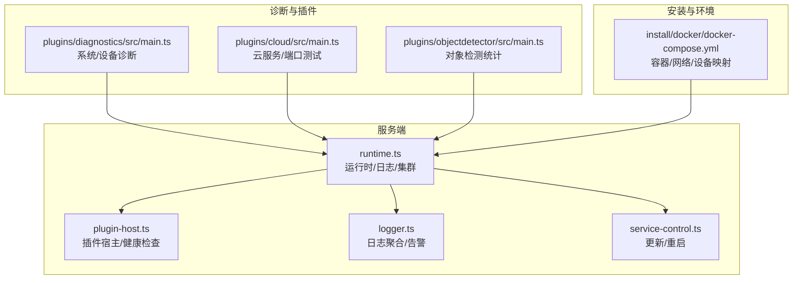
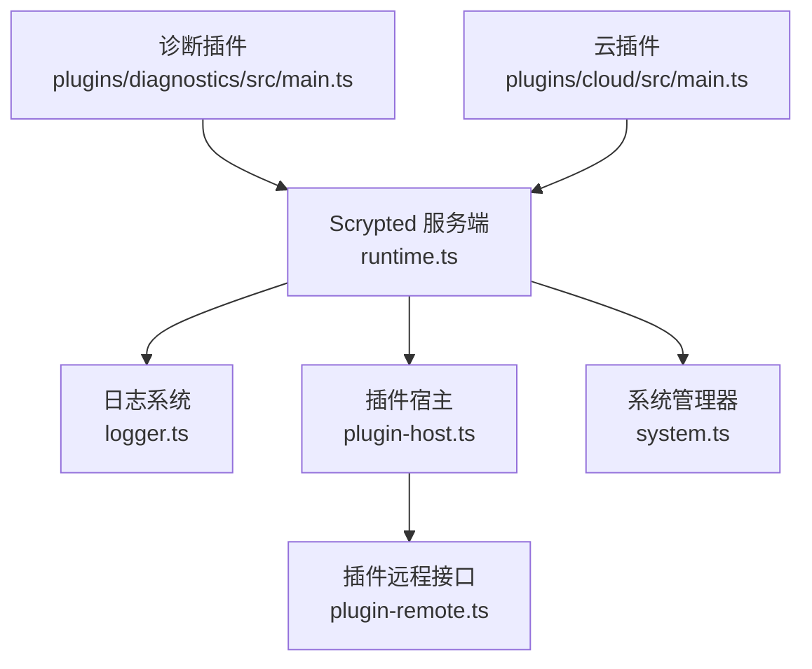
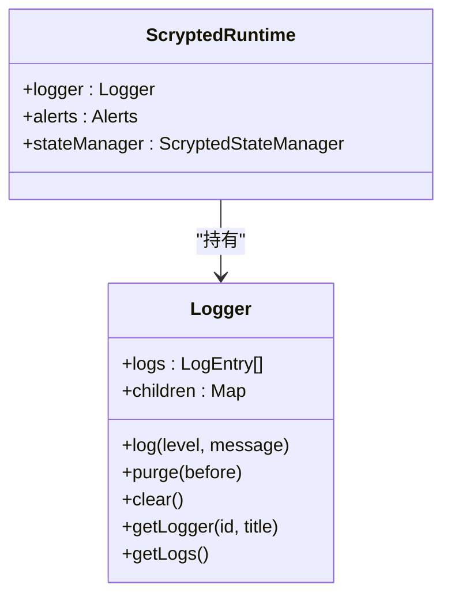
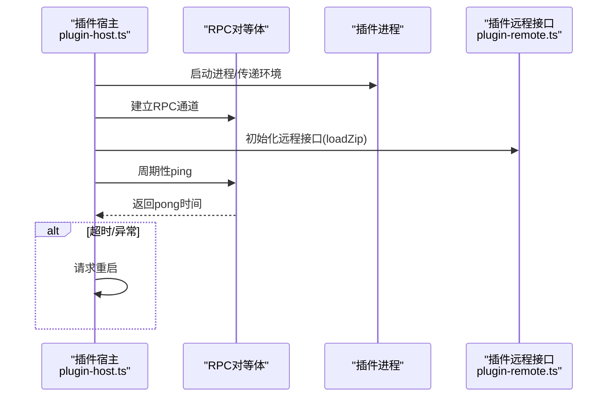
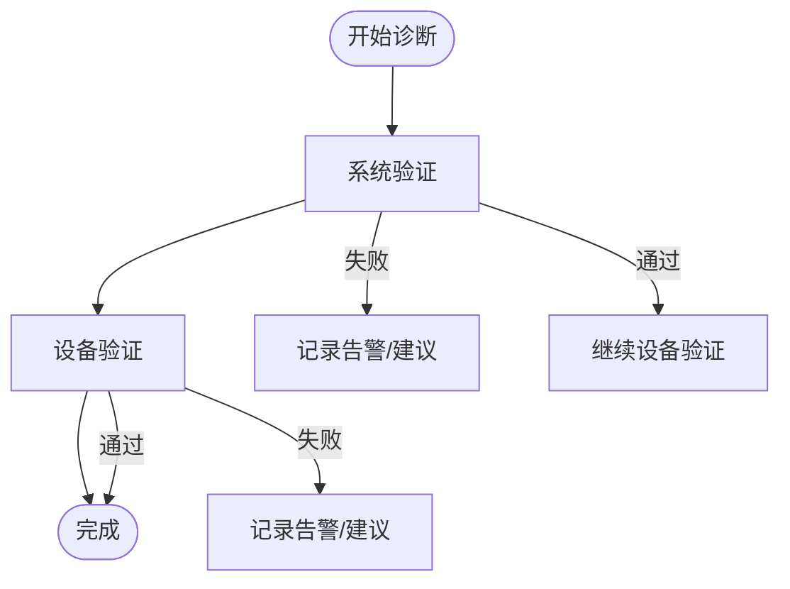
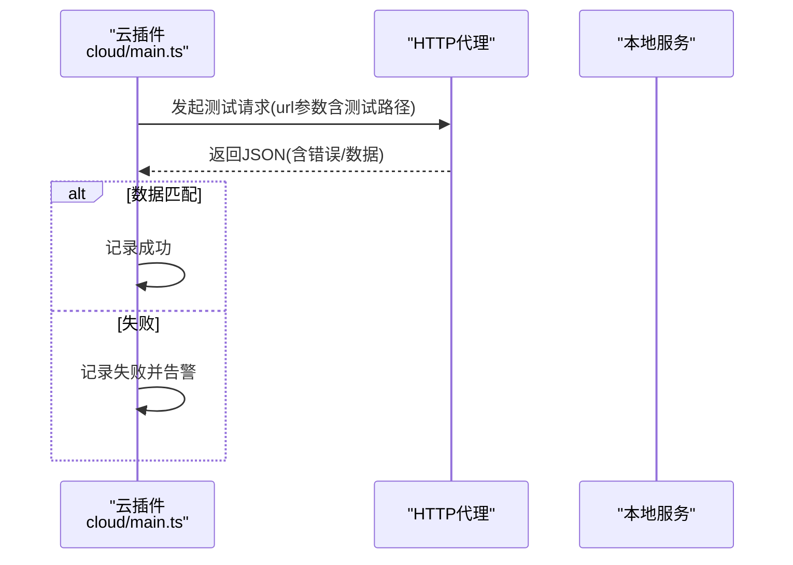
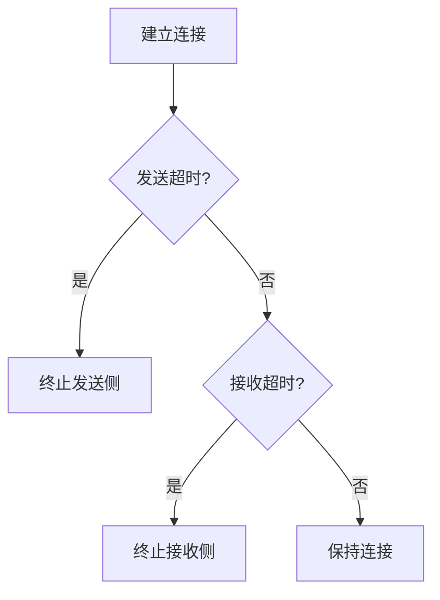
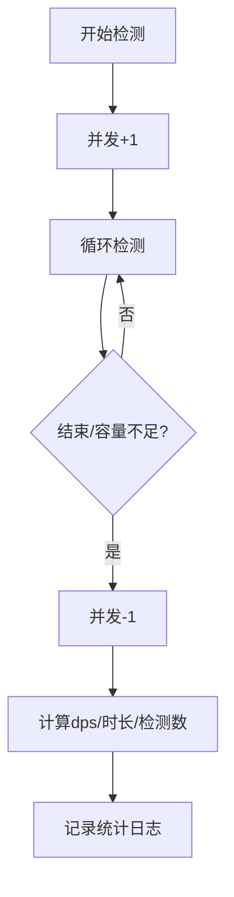
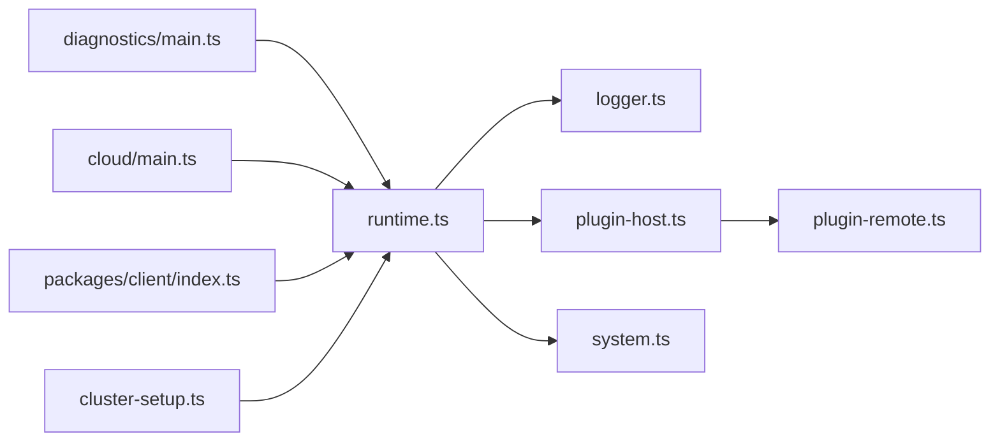

# 故障排查指南

<cite>
**本文引用的文件**   
- [README.md](file://README.md)
- [logger.ts](file://server/src/logger.ts)
- [runtime.ts](file://server/src/runtime.ts)
- [plugin-host.ts](file://server/src/plugin/plugin-host.ts)
- [plugin-error.ts](file://server/src/plugin/plugin-error.ts)
- [plugin-remote.ts](file://server/src/plugin/plugin-remote.ts)
- [system.ts](file://server/src/plugin/system.ts)
- [service-control.ts](file://server/src/services/service-control.ts)
- [docker-compose.yml](file://install/docker/docker-compose.yml)
- [main.ts（诊断插件）](file://plugins/diagnostics/src/main.ts)
- [main.ts（云插件）](file://plugins/cloud/src/main.ts)
- [index.ts（客户端）](file://packages/client/src/index.ts)
- [cluster-setup.ts](file://server/src/cluster/cluster-setup.ts)
- [plugin-console.ts](file://server/src/plugin/plugin-console.ts)
- [debug-console.ts](file://plugins/hikvision-doorbell/src/debug-console.ts)
- [objectdetector/main.ts](file://plugins/objectdetector/src/main.ts)
</cite>

## 目录
1. [简介](#简介)
2. [项目结构](#项目结构)
3. [核心组件](#核心组件)
4. [架构总览](#架构总览)
5. [详细组件分析](#详细组件分析)
6. [依赖关系分析](#依赖关系分析)
7. [性能考量](#性能考量)
8. [故障排查指南](#故障排查指南)
9. [结论](#结论)
10. [附录](#附录)

## 简介
本指南面向 Scrypted 的运维与开发者，提供系统性的故障排查方法，覆盖启动失败、连接超时、功能异常、性能下降、网络问题、插件问题、系统级问题以及故障预防。内容基于仓库中的服务端、插件、诊断工具与安装脚本的实际实现进行提炼，并配合可视化图示帮助快速定位问题。

## 项目结构
Scrypted 采用多包/多插件架构：服务端负责运行时、RPC、日志、集群与设备生命周期；各插件提供设备接入、协议适配、媒体处理、云服务等功能；诊断插件用于系统与设备健康度验证；安装目录提供 Docker/Proxmox 等部署方式。

**图表来源**
- [runtime.ts:64-176](file://server/src/runtime.ts#L64-L176)
- [plugin-host.ts:122-224](file://server/src/plugin/plugin-host.ts#L122-L224)
- [logger.ts:19-91](file://server/src/logger.ts#L19-L91)
- [service-control.ts:4-32](file://server/src/services/service-control.ts#L4-L32)
- [main.ts（诊断插件）:386-771](file://plugins/diagnostics/src/main.ts#L386-L771)
- [main.ts（云插件）:449-473](file://plugins/cloud/src/main.ts#L449-L473)
- [docker-compose.yml:20-169](file://install/docker/docker-compose.yml#L20-L169)

**章节来源**
- [README.md:1-59](file://README.md#L1-L59)
- [runtime.ts:64-176](file://server/src/runtime.ts#L64-L176)
- [plugin-host.ts:122-224](file://server/src/plugin/plugin-host.ts#L122-L224)
- [logger.ts:19-91](file://server/src/logger.ts#L19-L91)
- [service-control.ts:4-32](file://server/src/services/service-control.ts#L4-L32)
- [main.ts（诊断插件）:386-771](file://plugins/diagnostics/src/main.ts#L386-L771)
- [main.ts（云插件）:449-473](file://plugins/cloud/src/main.ts#L449-L473)
- [docker-compose.yml:20-169](file://install/docker/docker-compose.yml#L20-L169)

## 核心组件
- 运行时与日志
  - 运行时负责设备/插件生命周期、RPC、集群、CORS、访问控制等；日志模块提供分层日志、告警持久化与清理策略。
- 插件宿主
  - 负责插件进程/线程管理、RPC 对接、健康心跳、自动重启、控制台输出转发。
- 诊断与云服务
  - 诊断插件执行系统/设备连通性、资源、编解码、GPU 加速等验证；云插件提供端口连通性测试与代理行为校验。
- 安装与环境
  - Docker Compose 提供网络模式、设备映射、DNS 配置、更新钩子等。

**章节来源**
- [runtime.ts:64-176](file://server/src/runtime.ts#L64-L176)
- [logger.ts:19-91](file://server/src/logger.ts#L19-L91)
- [plugin-host.ts:122-224](file://server/src/plugin/plugin-host.ts#L122-L224)
- [main.ts（诊断插件）:386-771](file://plugins/diagnostics/src/main.ts#L386-L771)
- [main.ts（云插件）:449-473](file://plugins/cloud/src/main.ts#L449-L473)
- [docker-compose.yml:20-169](file://install/docker/docker-compose.yml#L20-L169)

## 架构总览
下图展示服务端、插件宿主、日志与诊断插件之间的交互关系，以及健康检查与自动重启机制。

**图表来源**
- [runtime.ts:64-176](file://server/src/runtime.ts#L64-L176)
- [logger.ts:19-91](file://server/src/logger.ts#L19-L91)
- [plugin-host.ts:122-224](file://server/src/plugin/plugin-host.ts#L122-L224)
- [plugin-remote.ts:238-261](file://server/src/plugin/plugin-remote.ts#L238-L261)
- [system.ts:160-175](file://server/src/plugin/system.ts#L160-L175)
- [main.ts（诊断插件）:386-771](file://plugins/diagnostics/src/main.ts#L386-L771)
- [main.ts（云插件）:449-473](file://plugins/cloud/src/main.ts#L449-L473)

## 详细组件分析

### 日志与告警系统
- 分层日志：支持父子路径日志聚合、排序与清理。
- 告警持久化：将级别为“告警”的日志写入数据存储并通知状态变更。
- 清理策略：按时间窗口清理旧日志，避免内存膨胀。

**图表来源**
- [logger.ts:19-91](file://server/src/logger.ts#L19-L91)
- [runtime.ts:64-176](file://server/src/runtime.ts#L64-L176)

**章节来源**
- [logger.ts:19-91](file://server/src/logger.ts#L19-L91)
- [runtime.ts:155-176](file://server/src/runtime.ts#L155-L176)

### 插件宿主与健康检查
- 启动与加载：解析插件包、准备工作目录、启动运行时进程、建立 RPC 通道。
- 引擎 IO：为插件提供 Engine.IO 通道，处理消息缓冲与序列化。
- 健康检查：周期性 ping 插件，超时或异常触发自动重启。
- 控制台：将插件 stdout/stderr 转发到本地控制台服务器，便于调试。

**图表来源**
- [plugin-host.ts:122-224](file://server/src/plugin/plugin-host.ts#L122-L224)
- [plugin-host.ts:276-328](file://server/src/plugin/plugin-host.ts#L276-L328)
- [plugin-remote.ts:238-261](file://server/src/plugin/plugin-remote.ts#L238-L261)

**章节来源**
- [plugin-host.ts:122-224](file://server/src/plugin/plugin-host.ts#L122-L224)
- [plugin-host.ts:276-328](file://server/src/plugin/plugin-host.ts#L276-L328)
- [plugin-host.ts:436-462](file://server/src/plugin/plugin-host.ts#L436-L462)
- [plugin-remote.ts:238-261](file://server/src/plugin/plugin-remote.ts#L238-L261)

### 诊断插件（系统与设备）
- 系统验证：主机环境、公网/内网地址、时间同步、CPU/内存、GPU 设备透传、云服务连通性、外部资源访问、DNS 检查、GPU 解码与推理能力验证。
- 设备验证：运动检测、按钮事件、快照质量、流配置、音频编解码、不同目的地流的可用性与延迟。

**图表来源**
- [main.ts（诊断插件）:386-771](file://plugins/diagnostics/src/main.ts#L386-L771)
- [main.ts（诊断插件）:177-384](file://plugins/diagnostics/src/main.ts#L177-L384)

**章节来源**
- [main.ts（诊断插件）:386-771](file://plugins/diagnostics/src/main.ts#L386-L771)
- [main.ts（诊断插件）:177-384](file://plugins/diagnostics/src/main.ts#L177-L384)

### 云插件（端口连通性与代理）
- 端口连通性测试：向云端发起请求，比对返回数据与随机数，判断 NAT/UPnP/隧道是否正常。
- 代理头注入：在代理响应中添加自定义头部，便于识别直连/云连通性。

**图表来源**
- [main.ts（云插件）:449-473](file://plugins/cloud/src/main.ts#L449-L473)
- [main.ts（云插件）:914-930](file://plugins/cloud/src/main.ts#L914-L930)

**章节来源**
- [main.ts（云插件）:449-473](file://plugins/cloud/src/main.ts#L449-L473)
- [main.ts（云插件）:914-930](file://plugins/cloud/src/main.ts#L914-L930)

### 客户端连接与集群传输
- 专用传输：可配置发送/接收超时，超时后主动断开，避免阻塞。
- 集群连接：校验源地址一致性，确保跨容器/主机通信正确。

**图表来源**
- [index.ts（客户端）:834-865](file://packages/client/src/index.ts#L834-L865)
- [cluster-setup.ts:78-98](file://server/src/cluster/cluster-setup.ts#L78-L98)

**章节来源**
- [index.ts（客户端）:834-865](file://packages/client/src/index.ts#L834-L865)
- [cluster-setup.ts:78-98](file://server/src/cluster/cluster-setup.ts#L78-L98)

### 对象检测统计与容量评估
- 统计并发检测会话、检测速率（dps）、持续时间，用于评估系统负载与性能瓶颈。

**图表来源**
- [objectdetector/main.ts:1175-1218](file://plugins/objectdetector/src/main.ts#L1175-L1218)

**章节来源**
- [objectdetector/main.ts:1175-1218](file://plugins/objectdetector/src/main.ts#L1175-L1218)

## 依赖关系分析
- 服务端依赖日志系统进行统一记录与告警；依赖插件宿主管理插件生命周期；依赖系统管理器维护设备状态与事件。
- 诊断与云插件通过服务端 API 获取系统信息、发起网络请求与媒体转换。
- 客户端与集群组件通过 RPC 对象桥接，实现跨进程/跨容器通信。

**图表来源**
- [runtime.ts:64-176](file://server/src/runtime.ts#L64-L176)
- [logger.ts:19-91](file://server/src/logger.ts#L19-L91)
- [plugin-host.ts:122-224](file://server/src/plugin/plugin-host.ts#L122-L224)
- [plugin-remote.ts:238-261](file://server/src/plugin/plugin-remote.ts#L238-L261)
- [system.ts:160-175](file://server/src/plugin/system.ts#L160-L175)
- [main.ts（诊断插件）:386-771](file://plugins/diagnostics/src/main.ts#L386-L771)
- [main.ts（云插件）:449-473](file://plugins/cloud/src/main.ts#L449-L473)
- [index.ts（客户端）:834-865](file://packages/client/src/index.ts#L834-L865)
- [cluster-setup.ts:78-98](file://server/src/cluster/cluster-setup.ts#L78-L98)

**章节来源**
- [runtime.ts:64-176](file://server/src/runtime.ts#L64-L176)
- [plugin-host.ts:122-224](file://server/src/plugin/plugin-host.ts#L122-L224)
- [logger.ts:19-91](file://server/src/logger.ts#L19-L91)
- [system.ts:160-175](file://server/src/plugin/system.ts#L160-L175)
- [main.ts（诊断插件）:386-771](file://plugins/diagnostics/src/main.ts#L386-L771)
- [main.ts（云插件）:449-473](file://plugins/cloud/src/main.ts#L449-L473)
- [index.ts（客户端）:834-865](file://packages/client/src/index.ts#L834-L865)
- [cluster-setup.ts:78-98](file://server/src/cluster/cluster-setup.ts#L78-L98)

## 性能考量
- 资源使用
  - CPU/内存：诊断插件会检查 CPU 数量与内存大小，NVR 场景建议更高配置。
  - GPU 透传：Linux+NVR 场景需检查 /dev/dri 与 /dev/kfd 是否存在。
- 编解码与流
  - 推荐 H.264 视频与 PCM_MULAW/AAC/Opus 音频；诊断插件会检查流配置与目的地使用情况。
  - GPU 解码/变换：通过 FFmpeg 子进程验证硬件加速与推理结果。
- 并发与容量
  - 对象检测统计记录并发会话与每秒检测数（dps），用于评估系统负载与瓶颈。
- 日志与告警
  - 定期清理旧日志，避免内存占用过高；告警持久化便于事后分析。

**章节来源**
- [main.ts（诊断插件）:498-514](file://plugins/diagnostics/src/main.ts#L498-L514)
- [main.ts（诊断插件）:516-526](file://plugins/diagnostics/src/main.ts#L516-L526)
- [main.ts（诊断插件）:334-346](file://plugins/diagnostics/src/main.ts#L334-L346)
- [main.ts（诊断插件）:654-743](file://plugins/diagnostics/src/main.ts#L654-L743)
- [objectdetector/main.ts:1175-1218](file://plugins/objectdetector/src/main.ts#L1175-L1218)
- [logger.ts:48-53](file://server/src/logger.ts#L48-L53)

## 故障排查指南

### 启动失败
- 检查插件运行时
  - 若插件声明了不支持的 runtime，将抛出“不支持运行时”错误，需更换兼容运行时或修复插件元数据。
  - 参考：[plugin-host.ts:330-345](file://server/src/plugin/plugin-host.ts#L330-L345)
- 查看插件控制台
  - 插件 stdout/stderr 会被转发到本地控制台服务器，优先从控制台查看错误堆栈与关键信息。
  - 参考：[plugin-host.ts:436-462](file://server/src/plugin/plugin-host.ts#L436-L462)，[plugin-console.ts:64-74](file://server/src/plugin/plugin-console.ts#L64-L74)
- 日志与告警
  - 使用日志模块查看最近告警与错误条目，确认是否触发自动清理或持久化。
  - 参考：[logger.ts:19-91](file://server/src/logger.ts#L19-L91)，[runtime.ts:155-176](file://server/src/runtime.ts#L155-L176)

**章节来源**
- [plugin-host.ts:330-345](file://server/src/plugin/plugin-host.ts#L330-L345)
- [plugin-host.ts:436-462](file://server/src/plugin/plugin-host.ts#L436-L462)
- [plugin-console.ts:64-74](file://server/src/plugin/plugin-console.ts#L64-L74)
- [logger.ts:19-91](file://server/src/logger.ts#L19-L91)
- [runtime.ts:155-176](file://server/src/runtime.ts#L155-L176)

### 连接超时
- 客户端超时
  - 客户端可配置发送/接收超时，超时后主动断开，避免长时间阻塞。
  - 参考：[index.ts（客户端）:834-865](file://packages/client/src/index.ts#L834-L865)
- 集群连接
  - 校验源地址一致性，避免跨容器/主机通信异常。
  - 参考：[cluster-setup.ts:78-98](file://server/src/cluster/cluster-setup.ts#L78-L98)
- 云服务连通性
  - 使用云插件进行端口连通性测试，核对代理头与返回数据。
  - 参考：[main.ts（云插件）:449-473](file://plugins/cloud/src/main.ts#L449-L473)，[main.ts（云插件）:914-930](file://plugins/cloud/src/main.ts#L914-L930)

**章节来源**
- [index.ts（客户端）:834-865](file://packages/client/src/index.ts#L834-L865)
- [cluster-setup.ts:78-98](file://server/src/cluster/cluster-setup.ts#L78-L98)
- [main.ts（云插件）:449-473](file://plugins/cloud/src/main.ts#L449-L473)
- [main.ts（云插件）:914-930](file://plugins/cloud/src/main.ts#L914-L930)

### 功能异常
- 设备能力验证
  - 使用诊断插件验证运动检测、按钮事件、快照质量、流配置与音频编解码。
  - 参考：[main.ts（诊断插件）:177-384](file://plugins/diagnostics/src/main.ts#L177-L384)
- 系统能力验证
  - 检查时间同步、公网/内网地址、云服务连通性、外部资源访问与 DNS 解析。
  - 参考：[main.ts（诊断插件）:386-771](file://plugins/diagnostics/src/main.ts#L386-L771)

**章节来源**
- [main.ts（诊断插件）:177-384](file://plugins/diagnostics/src/main.ts#L177-L384)
- [main.ts（诊断插件）:386-771](file://plugins/diagnostics/src/main.ts#L386-L771)

### 性能下降
- 资源瓶颈
  - 检查 CPU/内存是否满足推荐配置；Linux+NVR 场景检查 GPU 设备透传。
  - 参考：[main.ts（诊断插件）:498-526](file://plugins/diagnostics/src/main.ts#L498-L526)
- 流与编解码
  - 确认视频使用 H.264，音频使用 PCM_MULAW/AAC/Opus；诊断插件会给出编解码建议。
  - 参考：[main.ts（诊断插件）:334-346](file://plugins/diagnostics/src/main.ts#L334-L346)，[main.ts（诊断插件）:379-383](file://plugins/diagnostics/src/main.ts#L379-L383)
- GPU 加速与推理
  - 通过 FFmpeg 子进程验证硬件加速与推理结果；对象检测统计可用于评估并发与 dps。
  - 参考：[main.ts（诊断插件）:654-743](file://plugins/diagnostics/src/main.ts#L654-L743)，[objectdetector/main.ts:1175-1218](file://plugins/objectdetector/src/main.ts#L1175-L1218)

**章节来源**
- [main.ts（诊断插件）:498-526](file://plugins/diagnostics/src/main.ts#L498-L526)
- [main.ts（诊断插件）:334-346](file://plugins/diagnostics/src/main.ts#L334-L346)
- [main.ts（诊断插件）:379-383](file://plugins/diagnostics/src/main.ts#L379-L383)
- [main.ts（诊断插件）:654-743](file://plugins/diagnostics/src/main.ts#L654-L743)
- [objectdetector/main.ts:1175-1218](file://plugins/objectdetector/src/main.ts#L1175-L1218)

### 网络问题
- 防火墙与端口
  - 使用云插件进行端口连通性测试，确认 NAT/UPnP/隧道工作正常。
  - 参考：[main.ts（云插件）:449-473](file://plugins/cloud/src/main.ts#L449-L473)
- DNS 解析
  - 诊断插件会检查域名解析与 0.0.0.0 屏蔽，必要时切换全局 DNS。
  - 参考：[main.ts（诊断插件）:638-652](file://plugins/diagnostics/src/main.ts#L638-L652)，[docker-compose.yml:135-139](file://install/docker/docker-compose.yml#L135-L139)
- 代理设置
  - 云插件在代理响应中注入自定义头部，便于区分直连/云连通性。
  - 参考：[main.ts（云插件）:914-930](file://plugins/cloud/src/main.ts#L914-L930)

**章节来源**
- [main.ts（云插件）:449-473](file://plugins/cloud/src/main.ts#L449-L473)
- [main.ts（诊断插件）:638-652](file://plugins/diagnostics/src/main.ts#L638-L652)
- [docker-compose.yml:135-139](file://install/docker/docker-compose.yml#L135-L139)
- [main.ts（云插件）:914-930](file://plugins/cloud/src/main.ts#L914-L930)

### 插件问题诊断
- 插件加载失败
  - 查看“插件加载失败”告警与错误日志；若为“不支持运行时”，需调整插件元数据或运行时。
  - 参考：[plugin-host.ts:268-274](file://server/src/plugin/plugin-host.ts#L268-L274)，[plugin-error.ts:1-3](file://server/src/plugin/plugin-error.ts#L1-L3)
- API 调用异常
  - 通过插件控制台查看 RPC 错误与参数；检查 ACL 与访问控制头。
  - 参考：[plugin-host.ts:465-504](file://server/src/plugin/plugin-host.ts#L465-L504)，[runtime.ts:187-197](file://server/src/runtime.ts#L187-L197)
- 内存泄漏检测
  - 结合诊断插件的系统验证与对象检测统计，观察并发与检测速率变化趋势。
  - 参考：[objectdetector/main.ts:1175-1218](file://plugins/objectdetector/src/main.ts#L1175-L1218)，[main.ts（诊断插件）:386-771](file://plugins/diagnostics/src/main.ts#L386-L771)

**章节来源**
- [plugin-host.ts:268-274](file://server/src/plugin/plugin-host.ts#L268-L274)
- [plugin-error.ts:1-3](file://server/src/plugin/plugin-error.ts#L1-L3)
- [plugin-host.ts:465-504](file://server/src/plugin/plugin-host.ts#L465-L504)
- [runtime.ts:187-197](file://server/src/runtime.ts#L187-L197)
- [objectdetector/main.ts:1175-1218](file://plugins/objectdetector/src/main.ts#L1175-L1218)
- [main.ts（诊断插件）:386-771](file://plugins/diagnostics/src/main.ts#L386-L771)

### 系统级问题排查
- 权限问题
  - Docker/容器场景检查设备映射（如 /dev/dri）与安全选项；必要时启用 host 网络模式。
  - 参考：[docker-compose.yml:96-117](file://install/docker/docker-compose.yml#L96-L117)，[docker-compose.yml](file://install/docker/docker-compose.yml#L121)
- 文件系统错误
  - 检查 NVR 存储卷挂载与权限；诊断插件会提示可移除的废弃插件。
  - 参考：[docker-compose.yml:58-91](file://install/docker/docker-compose.yml#L58-L91)，[main.ts（诊断插件）:746-766](file://plugins/diagnostics/src/main.ts#L746-L766)
- 进程状态检查
  - 使用服务控制进行更新与重启；检查 .exit/.update 文件触发更新流程。
  - 参考：[service-control.ts:4-32](file://server/src/services/service-control.ts#L4-L32)

**章节来源**
- [docker-compose.yml:58-91](file://install/docker/docker-compose.yml#L58-L91)
- [docker-compose.yml:96-117](file://install/docker/docker-compose.yml#L96-L117)
- [docker-compose.yml](file://install/docker/docker-compose.yml#L121)
- [main.ts（诊断插件）:746-766](file://plugins/diagnostics/src/main.ts#L746-L766)
- [service-control.ts:4-32](file://server/src/services/service-control.ts#L4-L32)

### 故障预防措施
- 监控配置
  - 使用诊断插件定期验证系统与设备健康度；关注日志与告警。
  - 参考：[main.ts（诊断插件）:386-771](file://plugins/diagnostics/src/main.ts#L386-L771)，[logger.ts:19-91](file://server/src/logger.ts#L19-L91)
- 预警设置
  - 利用日志系统持久化告警，结合状态管理器推送界面事件。
  - 参考：[runtime.ts:155-176](file://server/src/runtime.ts#L155-L176)
- 定期检查清单
  - 系统：CPU/内存/GPU 透传/时间同步/公网地址/云服务连通性。
  - 设备：运动/按钮/快照/流配置/音频编解码。
  - 网络：DNS 解析/代理头/端口连通性。
  - 插件：运行时兼容性/控制台输出/健康心跳。
  - 参考：[main.ts（诊断插件）:386-771](file://plugins/diagnostics/src/main.ts#L386-L771)，[plugin-host.ts:276-328](file://server/src/plugin/plugin-host.ts#L276-L328)

**章节来源**
- [main.ts（诊断插件）:386-771](file://plugins/diagnostics/src/main.ts#L386-L771)
- [logger.ts:19-91](file://server/src/logger.ts#L19-L91)
- [runtime.ts:155-176](file://server/src/runtime.ts#L155-L176)
- [plugin-host.ts:276-328](file://server/src/plugin/plugin-host.ts#L276-L328)

## 结论
通过日志与告警、插件健康检查、诊断插件验证与网络连通性测试，可以系统性地定位 Scrypted 的启动、连接、功能与性能问题。结合 Docker/容器环境的设备映射与 DNS 配置，可有效解决系统级问题。建议将诊断插件纳入日常巡检，并利用日志与告警机制建立完善的监控与预警体系。

## 附录
- 快速参考
  - 启动失败：检查“不支持运行时”错误与插件控制台输出。
  - 连接超时：检查客户端超时配置与集群源地址一致性。
  - 功能异常：使用诊断插件验证设备与系统能力。
  - 性能下降：关注编解码、GPU 加速与对象检测统计。
  - 网络问题：使用云插件测试端口连通性，检查 DNS 与代理头。
  - 插件问题：查看加载失败告警与 RPC 错误，确认 ACL 设置。
  - 系统问题：检查容器设备映射、NVR 存储与服务控制更新流程。