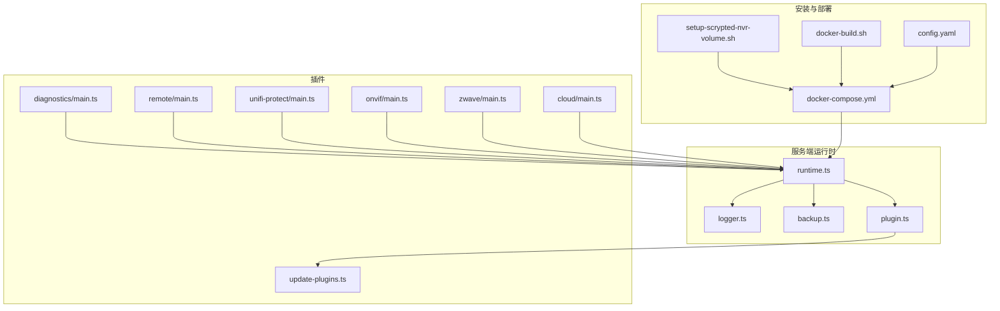
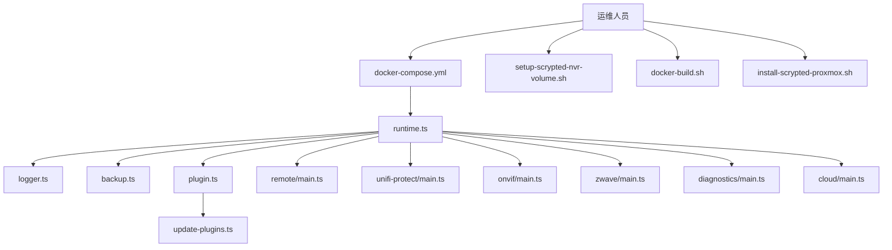
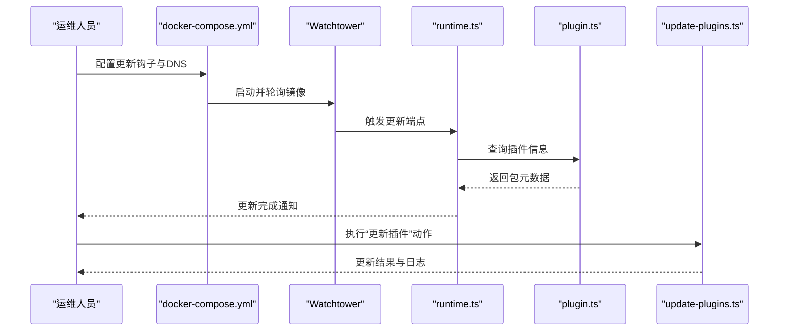
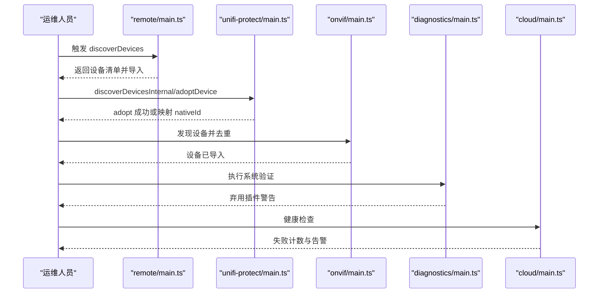
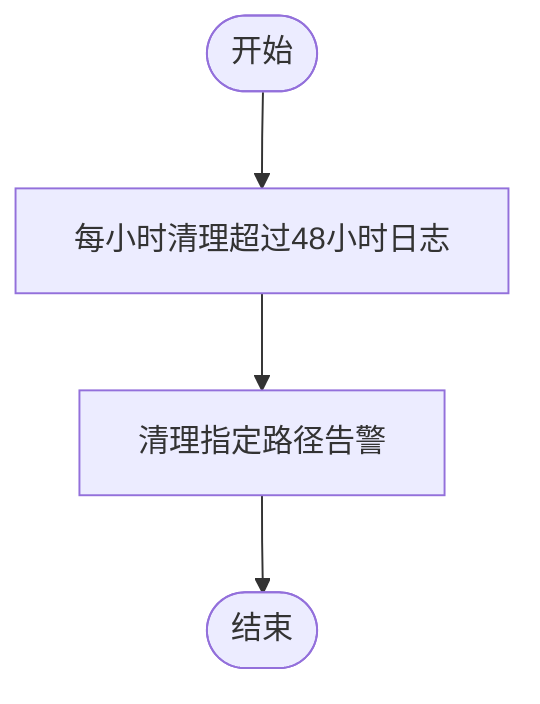
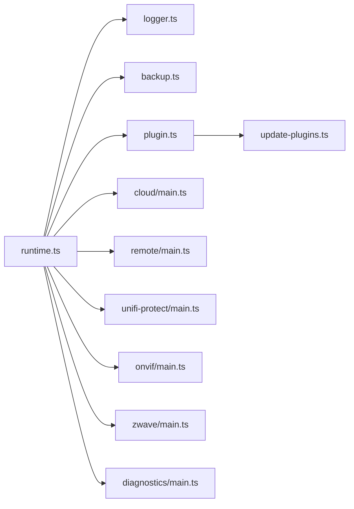

# 日常运维

<cite>
**本文引用的文件**
- [README.md](file://README.md)
- [config.yaml](file://install/config.yaml)
- [docker-compose.yml](file://install/docker/docker-compose.yml)
- [docker-build.sh](file://install/docker/docker-build.sh)
- [setup-scrypted-nvr-volume.sh](file://install/docker/setup-scrypted-nvr-volume.sh)
- [runtime.ts](file://server/src/runtime.ts)
- [logger.ts](file://server/src/logger.ts)
- [plugin.ts](file://server/src/services/plugin.ts)
- [backup.ts](file://server/src/services/backup.ts)
- [update-plugins.ts](file://plugins/core/src/update-plugins.ts)
- [main.ts（云插件）](file://plugins/cloud/src/main.ts)
- [main.ts（诊断插件）](file://plugins/diagnostics/src/main.ts)
- [main.ts（远程插件）](file://plugins/remote/src/main.ts)
- [main.ts（Unifi Protect 插件）](file://plugins/unifi-protect/src/main.ts)
- [main.ts（ONVIF 插件）](file://plugins/onvif/src/main.ts)
- [main.ts（Z-Wave 插件）](file://plugins/zwave/src/main.ts)
- [install-scrypted-proxmox.sh](file://install/proxmox/install-scrypted-proxmox.sh)
</cite>

## 目录
1. [简介](#简介)
2. [项目结构](#项目结构)
3. [核心组件](#核心组件)
4. [架构总览](#架构总览)
5. [详细组件分析](#详细组件分析)
6. [依赖关系分析](#依赖关系分析)
7. [性能考虑](#性能考虑)
8. [故障排查指南](#故障排查指南)
9. [容量规划与扩展](#容量规划与扩展)
10. [运维自动化脚本](#运维自动化脚本)
11. [运维最佳实践](#运维最佳实践)
12. [结论](#结论)

## 简介
本指南面向 Scrypted 平台的日常运维操作，覆盖系统更新（核心系统升级、插件更新、依赖项升级）、性能调优（内存、CPU、I/O、网络）、设备维护（重新发现、配置重置、固件更新、连接诊断）、日志清理与管理（轮转、存储清理、历史归档）、故障排查（常见问题、错误日志分析、性能瓶颈定位）、容量规划与扩展（存储扩容、硬件升级、负载增加）、运维自动化脚本（批量操作、定期维护、监控脚本），以及运维最佳实践（操作规范、变更管理、应急预案、知识库建设）。内容基于仓库中的安装配置、运行时代码与插件实现进行梳理，确保可执行性与可追溯性。

## 项目结构
Scrypted 采用多模块组织方式：服务端运行时位于 server/，插件位于 plugins/*/，安装与部署脚本位于 install/，SDK 与工具位于 sdk/。运维相关的关键位置包括：
- 安装与容器化：install/docker/docker-compose.yml、install/docker/setup-scrypted-nvr-volume.sh、install/docker/docker-build.sh
- 运行时与日志：server/src/runtime.ts、server/src/logger.ts
- 插件管理：server/src/services/plugin.ts、plugins/core/src/update-plugins.ts
- 备份与恢复：server/src/services/backup.ts
- 设备发现与诊断：plugins/remote、plugins/unifi-protect、plugins/onvif、plugins/zwave、plugins/diagnostics
- 云服务健康检查：plugins/cloud/src/main.ts
- Proxmox 部署与恢复：install/proxmox/install-scrypted-proxmox.sh

**图表来源**
- [docker-compose.yml:1-169](file://install/docker/docker-compose.yml#L1-L169)
- [setup-scrypted-nvr-volume.sh:1-160](file://install/docker/setup-scrypted-nvr-volume.sh#L1-L160)
- [docker-build.sh:1-19](file://install/docker/docker-build.sh#L1-L19)
- [config.yaml:1-49](file://install/config.yaml#L1-L49)
- [runtime.ts:1-200](file://server/src/runtime.ts#L1-L200)
- [logger.ts:1-93](file://server/src/logger.ts#L1-L93)
- [backup.ts:1-76](file://server/src/services/backup.ts#L1-L76)
- [plugin.ts:1-45](file://server/src/services/plugin.ts#L1-L45)
- [update-plugins.ts:1-49](file://plugins/core/src/update-plugins.ts#L1-L49)
- [main.ts（远程插件）:256-286](file://plugins/remote/src/main.ts#L256-L286)
- [main.ts（Unifi Protect 插件）:286-539](file://plugins/unifi-protect/src/main.ts#L286-L539)
- [main.ts（ONVIF 插件）:390-405](file://plugins/onvif/src/main.ts#L390-L405)
- [main.ts（Z-Wave 插件）:409-440](file://plugins/zwave/src/main.ts#L409-L440)
- [main.ts（诊断插件）:755-774](file://plugins/diagnostics/src/main.ts#L755-L774)
- [main.ts（云插件）:1165-1191](file://plugins/cloud/src/main.ts#L1165-L1191)

**章节来源**
- [README.md:1-59](file://README.md#L1-L59)
- [docker-compose.yml:1-169](file://install/docker/docker-compose.yml#L1-L169)
- [setup-scrypted-nvr-volume.sh:1-160](file://install/docker/setup-scrypted-nvr-volume.sh#L1-L160)
- [docker-build.sh:1-19](file://install/docker/docker-build.sh#L1-L19)
- [config.yaml:1-49](file://install/config.yaml#L1-L49)

## 核心组件
- 运行时与日志：运行时负责插件生命周期、设备状态管理、日志聚合与告警持久化；日志器支持按路径分层、轮转与清理。
- 插件管理：提供插件安装、重启、重命名、存储读取等能力，并通过 npm 信息查询实现版本与依赖管理基础。
- 备份与恢复：对数据库进行快照压缩打包，支持恢复时重建环境。
- 更新机制：核心插件内置定时触发器，用于周期性执行“更新插件”动作。
- 设备发现与诊断：远程、Unifi Protect、ONVIF、Z-Wave 等插件提供设备发现、adopt、刷新与健康检查能力。
- 云服务健康检查：Cloud 插件对 Cloudflare Tunnel 健康检查失败进行告警与重试统计。
- 容器化与存储：Compose 文件定义镜像、卷、DNS、更新钩子；NVR 存储脚本负责挂载与分区格式化；Proxmox 脚本支持 VM 恢复与卷迁移。

**章节来源**
- [runtime.ts:155-176](file://server/src/runtime.ts#L155-L176)
- [logger.ts:19-92](file://server/src/logger.ts#L19-L92)
- [plugin.ts:11-45](file://server/src/services/plugin.ts#L11-L45)
- [backup.ts:12-76](file://server/src/services/backup.ts#L12-L76)
- [update-plugins.ts:1-49](file://plugins/core/src/update-plugins.ts#L1-L49)
- [main.ts（云插件）:1165-1191](file://plugins/cloud/src/main.ts#L1165-L1191)

## 架构总览
下图展示运维相关组件在系统中的交互关系：容器编排驱动运行时，运行时通过日志器与备份服务支撑运维可观测性与可恢复性；插件体系承载设备发现与更新；云插件提供外网可达性健康检查；Proxmox 脚本支撑虚拟化平台的部署与恢复。

**图表来源**
- [docker-compose.yml:1-169](file://install/docker/docker-compose.yml#L1-L169)
- [runtime.ts:1-200](file://server/src/runtime.ts#L1-L200)
- [logger.ts:1-93](file://server/src/logger.ts#L1-L93)
- [backup.ts:1-76](file://server/src/services/backup.ts#L1-L76)
- [plugin.ts:1-45](file://server/src/services/plugin.ts#L1-L45)
- [update-plugins.ts:1-49](file://plugins/core/src/update-plugins.ts#L1-L49)
- [main.ts（远程插件）:256-286](file://plugins/remote/src/main.ts#L256-L286)
- [main.ts（Unifi Protect 插件）:286-539](file://plugins/unifi-protect/src/main.ts#L286-L539)
- [main.ts（ONVIF 插件）:390-405](file://plugins/onvif/src/main.ts#L390-L405)
- [main.ts（Z-Wave 插件）:409-440](file://plugins/zwave/src/main.ts#L409-L440)
- [main.ts（诊断插件）:755-774](file://plugins/diagnostics/src/main.ts#L755-L774)
- [main.ts（云插件）:1165-1191](file://plugins/cloud/src/main.ts#L1165-L1191)
- [setup-scrypted-nvr-volume.sh:1-160](file://install/docker/setup-scrypted-nvr-volume.sh#L1-L160)
- [docker-build.sh:1-19](file://install/docker/docker-build.sh#L1-L19)
- [install-scrypted-proxmox.sh:109-274](file://install/proxmox/install-scrypted-proxmox.sh#L109-L274)

## 详细组件分析

### 系统更新流程
- 核心系统升级：通过 Watchtower 自动检测镜像更新并通过 HTTP API 触发更新端点，实现无侵入升级。
- 插件更新：核心插件内置定时触发器，每天固定时间执行“更新插件”动作，自动拉取最新版本。
- 依赖项升级：运行时通过 npm 信息查询接口获取包元数据，为后续依赖管理与升级策略提供基础。

**图表来源**
- [docker-compose.yml:35-36](file://install/docker/docker-compose.yml#L35-L36)
- [docker-compose.yml:142-160](file://install/docker/docker-compose.yml#L142-L160)
- [runtime.ts:178-185](file://server/src/runtime.ts#L178-L185)
- [plugin.ts:11-19](file://server/src/services/plugin.ts#L11-L19)
- [update-plugins.ts:1-49](file://plugins/core/src/update-plugins.ts#L1-L49)

**章节来源**
- [docker-compose.yml:35-36](file://install/docker/docker-compose.yml#L35-L36)
- [docker-compose.yml:142-160](file://install/docker/docker-compose.yml#L142-L160)
- [runtime.ts:178-185](file://server/src/runtime.ts#L178-L185)
- [plugin.ts:11-19](file://server/src/services/plugin.ts#L11-L19)
- [update-plugins.ts:1-49](file://plugins/core/src/update-plugins.ts#L1-L49)

### 性能调优指南
- 内存优化：运行时内置日志轮转（保留最近 48 小时），避免长期驻留内存导致膨胀；建议结合容器资源限制与宿主机内存压力监控。
- CPU 调整：容器 DNS 使用全局服务器，减少解析失败导致的重试开销；插件进程通过 RPC 通信，避免阻塞主线程。
- I/O 优化：NVR 存储建议使用高性能磁盘与合适的文件系统（ext4），并合理设置挂载选项；日志驱动默认关闭以降低闪存磨损。
- 网络配置：Host 网络模式减少网络栈开销；Cloud 插件对 Cloudflare Tunnel 健康检查失败进行告警与重试，保障外网连通性。

**章节来源**
- [runtime.ts:172-175](file://server/src/runtime.ts#L172-L175)
- [docker-compose.yml:123-131](file://install/docker/docker-compose.yml#L123-L131)
- [docker-compose.yml:121](file://install/docker/docker-compose.yml#L121)
- [main.ts（云插件）:1165-1191](file://plugins/cloud/src/main.ts#L1165-L1191)

### 设备维护操作
- 设备重新发现：远程插件从远端系统拉取设备列表并过滤后导入；ONVIF 插件根据设备上报的地址与 URN 去重后发现；Unifi Protect 插件支持 discoverDevices 与 adoptDevice 流程。
- 配置重置：通过插件存储读取与重命名能力，结合运行时设备状态重置实现。
- 固件更新：由具体设备厂商插件处理，如 Hikvision Doorbell 的报警流监听与事件处理。
- 连接诊断：诊断插件扫描已弃用插件并输出警告；Cloud 插件对隧道健康检查失败进行告警与计数。

**图表来源**
- [main.ts（远程插件）:256-286](file://plugins/remote/src/main.ts#L256-L286)
- [main.ts（Unifi Protect 插件）:286-539](file://plugins/unifi-protect/src/main.ts#L286-L539)
- [main.ts（ONVIF 插件）:390-405](file://plugins/onvif/src/main.ts#L390-L405)
- [main.ts（诊断插件）:755-774](file://plugins/diagnostics/src/main.ts#L755-L774)
- [main.ts（云插件）:1165-1191](file://plugins/cloud/src/main.ts#L1165-L1191)

**章节来源**
- [main.ts（远程插件）:256-286](file://plugins/remote/src/main.ts#L256-L286)
- [main.ts（Unifi Protect 插件）:286-539](file://plugins/unifi-protect/src/main.ts#L286-L539)
- [main.ts（ONVIF 插件）:390-405](file://plugins/onvif/src/main.ts#L390-L405)
- [main.ts（Z-Wave 插件）:409-440](file://plugins/zwave/src/main.ts#L409-L440)
- [main.ts（诊断插件）:755-774](file://plugins/diagnostics/src/main.ts#L755-L774)
- [main.ts（云插件）:1165-1191](file://plugins/cloud/src/main.ts#L1165-L1191)

### 日志清理与管理
- 日志轮转：运行时每小时清理超过 48 小时的日志条目，防止内存占用增长。
- 存储清理：日志器支持按路径清理与告警清理，便于定向清理。
- 历史日志归档：建议结合外部日志收集系统（如 ELK/Fluentd）与容器日志驱动配置，实现集中化归档。

**图表来源**
- [runtime.ts:172-175](file://server/src/runtime.ts#L172-L175)
- [logger.ts:48-75](file://server/src/logger.ts#L48-L75)

**章节来源**
- [runtime.ts:172-175](file://server/src/runtime.ts#L172-L175)
- [logger.ts:48-75](file://server/src/logger.ts#L48-L75)

### 故障排查流程
- 常见问题诊断：使用诊断插件扫描弃用插件并输出警告；检查 Cloud 插件健康检查失败次数与告警。
- 错误日志分析：通过运行时日志器聚合与排序，定位异常级别日志；结合告警持久化快速定位根因。
- 性能瓶颈定位：观察日志轮转频率与容器 DNS 设置；确认 Host 网络模式与设备发现流程是否正常。

**章节来源**
- [main.ts（诊断插件）:755-774](file://plugins/diagnostics/src/main.ts#L755-L774)
- [main.ts（云插件）:1165-1191](file://plugins/cloud/src/main.ts#L1165-L1191)
- [runtime.ts:155-170](file://server/src/runtime.ts#L155-L170)
- [logger.ts:87-91](file://server/src/logger.ts#L87-L91)

### 容量规划与扩展
- 存储扩容：使用 NVR 存储脚本为容器挂载块设备或目录，支持分区格式化与 fstab 管理；Compose 文件中可配置网络卷与主机挂载。
- 硬件升级：根据设备类型选择合适镜像（如 nvidia/intel/lite），并调整容器设备映射与权限。
- 负载增加：通过 Watchtower 轮询与自动更新，结合日志轮转与 DNS 全局服务器提升稳定性。

**章节来源**
- [setup-scrypted-nvr-volume.sh:78-156](file://install/docker/setup-scrypted-nvr-volume.sh#L78-L156)
- [docker-compose.yml:56-89](file://install/docker/docker-compose.yml#L56-L89)
- [docker-compose.yml:137-139](file://install/docker/docker-compose.yml#L137-L139)
- [docker-build.sh:14-18](file://install/docker/docker-build.sh#L14-L18)

### 运维自动化脚本
- 批量操作：通过 Watchtower HTTP API 触发更新端点，统一管理多个服务的升级。
- 定期维护：核心插件内置定时触发器，每日固定时间执行“更新插件”动作。
- 监控脚本：结合日志轮转与健康检查，形成自动化巡检闭环。

**章节来源**
- [docker-compose.yml:35-36](file://install/docker/docker-compose.yml#L35-L36)
- [docker-compose.yml:142-160](file://install/docker/docker-compose.yml#L142-L160)
- [update-plugins.ts:1-49](file://plugins/core/src/update-plugins.ts#L1-L49)
- [main.ts（云插件）:1165-1191](file://plugins/cloud/src/main.ts#L1165-L1191)

### 运维最佳实践
- 操作规范：所有变更前先备份数据库与配置；使用 Watchtower 与自动更新钩子统一升级路径。
- 变更管理：通过定时触发器与日志轮转记录变更轨迹；对关键插件（如 Cloud、Unifi Protect）设置健康检查与告警阈值。
- 应急预案：利用备份服务一键恢复；Proxmox 脚本支持 VM 快速恢复与卷迁移。
- 知识库建设：将常见问题与处理步骤沉淀到文档，结合日志与告警模板化输出。

**章节来源**
- [backup.ts:12-76](file://server/src/services/backup.ts#L12-L76)
- [install-scrypted-proxmox.sh:109-274](file://install/proxmox/install-scrypted-proxmox.sh#L109-L274)

## 依赖关系分析
- 组件耦合：运行时与日志器强耦合（日志事件驱动告警持久化）；插件服务依赖运行时状态与存储；更新机制依赖核心插件触发器。
- 外部依赖：npm 包注册表用于查询插件元数据；Cloudflare Tunnel 提供外网可达性；容器 DNS 使用全局服务器提升解析稳定性。

**图表来源**
- [runtime.ts:1-200](file://server/src/runtime.ts#L1-L200)
- [logger.ts:1-93](file://server/src/logger.ts#L1-L93)
- [backup.ts:1-76](file://server/src/services/backup.ts#L1-L76)
- [plugin.ts:1-45](file://server/src/services/plugin.ts#L1-L45)
- [update-plugins.ts:1-49](file://plugins/core/src/update-plugins.ts#L1-L49)
- [main.ts（云插件）:1165-1191](file://plugins/cloud/src/main.ts#L1165-L1191)
- [main.ts（远程插件）:256-286](file://plugins/remote/src/main.ts#L256-L286)
- [main.ts（Unifi Protect 插件）:286-539](file://plugins/unifi-protect/src/main.ts#L286-L539)
- [main.ts（ONVIF 插件）:390-405](file://plugins/onvif/src/main.ts#L390-L405)
- [main.ts（Z-Wave 插件）:409-440](file://plugins/zwave/src/main.ts#L409-L440)
- [main.ts（诊断插件）:755-774](file://plugins/diagnostics/src/main.ts#L755-L774)

**章节来源**
- [runtime.ts:1-200](file://server/src/runtime.ts#L1-L200)
- [logger.ts:1-93](file://server/src/logger.ts#L1-L93)
- [plugin.ts:1-45](file://server/src/services/plugin.ts#L1-L45)
- [backup.ts:1-76](file://server/src/services/backup.ts#L1-L76)
- [update-plugins.ts:1-49](file://plugins/core/src/update-plugins.ts#L1-L49)
- [main.ts（云插件）:1165-1191](file://plugins/cloud/src/main.ts#L1165-L1191)
- [main.ts（远程插件）:256-286](file://plugins/remote/src/main.ts#L256-L286)
- [main.ts（Unifi Protect 插件）:286-539](file://plugins/unifi-protect/src/main.ts#L286-L539)
- [main.ts（ONVIF 插件）:390-405](file://plugins/onvif/src/main.ts#L390-L405)
- [main.ts（Z-Wave 插件）:409-440](file://plugins/zwave/src/main.ts#L409-L440)
- [main.ts（诊断插件）:755-774](file://plugins/diagnostics/src/main.ts#L755-L774)

## 性能考虑
- 内存：日志轮转与告警清理降低内存峰值；建议结合容器内存限制与 OOM 监控。
- CPU：Host 网络与全局 DNS 减少额外开销；插件 RPC 通信避免主线程阻塞。
- I/O：NVR 存储使用高性能磁盘与合适文件系统；日志驱动默认关闭以减少闪存磨损。
- 网络：Cloud 插件健康检查失败告警与重试，保障外网连通性。

[本节为通用指导，无需特定文件来源]

## 故障排查指南
- 弃用插件：使用诊断插件扫描并输出警告，及时替换或移除。
- 隧道健康：Cloud 插件对健康检查失败进行计数与告警，必要时重启服务。
- 日志与告警：通过运行时日志器聚合与排序，定位异常级别日志并持久化告警。

**章节来源**
- [main.ts（诊断插件）:755-774](file://plugins/diagnostics/src/main.ts#L755-L774)
- [main.ts（云插件）:1165-1191](file://plugins/cloud/src/main.ts#L1165-L1191)
- [runtime.ts:155-170](file://server/src/runtime.ts#L155-L170)
- [logger.ts:87-91](file://server/src/logger.ts#L87-L91)

## 容量规划与扩展
- 存储：使用 NVR 存储脚本为容器挂载块设备或目录，支持分区格式化与 fstab 管理。
- 镜像：根据设备类型选择合适镜像（nvidia/intel/lite），并调整设备映射与权限。
- 升级：通过 Watchtower 轮询与自动更新，结合日志轮转与 DNS 全局服务器提升稳定性。

**章节来源**
- [setup-scrypted-nvr-volume.sh:78-156](file://install/docker/setup-scrypted-nvr-volume.sh#L78-L156)
- [docker-compose.yml:56-89](file://install/docker/docker-compose.yml#L56-L89)
- [docker-compose.yml:137-139](file://install/docker/docker-compose.yml#L137-L139)
- [docker-build.sh:14-18](file://install/docker/docker-build.sh#L14-L18)

## 运维自动化脚本
- 更新：通过 Watchtower HTTP API 触发更新端点，统一管理升级。
- 维护：核心插件定时触发器每日执行“更新插件”动作。
- 监控：结合日志轮转与健康检查，形成自动化巡检闭环。

**章节来源**
- [docker-compose.yml:35-36](file://install/docker/docker-compose.yml#L35-L36)
- [docker-compose.yml:142-160](file://install/docker/docker-compose.yml#L142-L160)
- [update-plugins.ts:1-49](file://plugins/core/src/update-plugins.ts#L1-L49)
- [main.ts（云插件）:1165-1191](file://plugins/cloud/src/main.ts#L1165-L1191)

## 运维最佳实践
- 操作规范：变更前备份数据库与配置；使用自动更新钩子统一升级路径。
- 变更管理：通过定时触发器与日志轮转记录变更轨迹；对关键插件设置健康检查与告警阈值。
- 应急预案：利用备份服务一键恢复；Proxmox 脚本支持 VM 快速恢复与卷迁移。
- 知识库：将常见问题与处理步骤沉淀到文档，结合日志与告警模板化输出。

**章节来源**
- [backup.ts:12-76](file://server/src/services/backup.ts#L12-L76)
- [install-scrypted-proxmox.sh:109-274](file://install/proxmox/install-scrypted-proxmox.sh#L109-L274)

## 结论
本指南基于仓库中的安装配置、运行时代码与插件实现，构建了覆盖系统更新、性能调优、设备维护、日志管理、故障排查、容量规划、自动化脚本与最佳实践的运维体系。建议在生产环境中结合 Watchtower、日志轮转、健康检查与备份恢复机制，形成稳定可靠的自动化运维闭环。