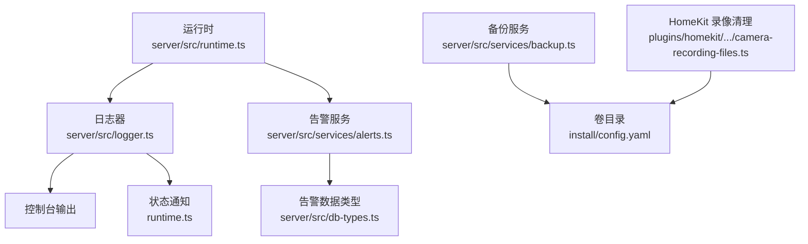
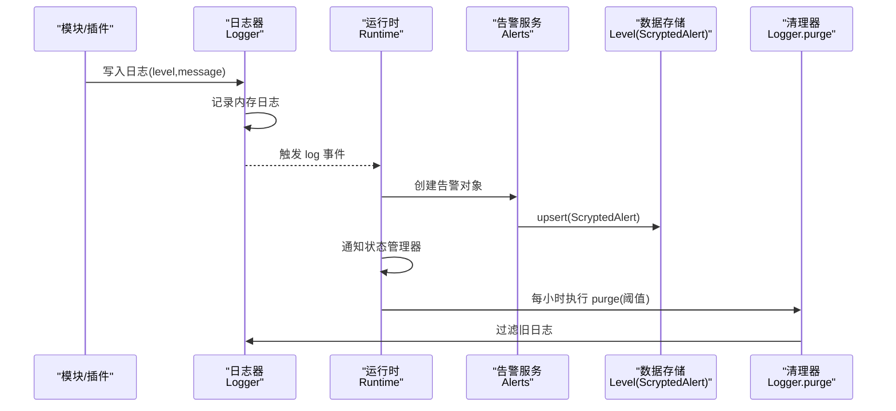
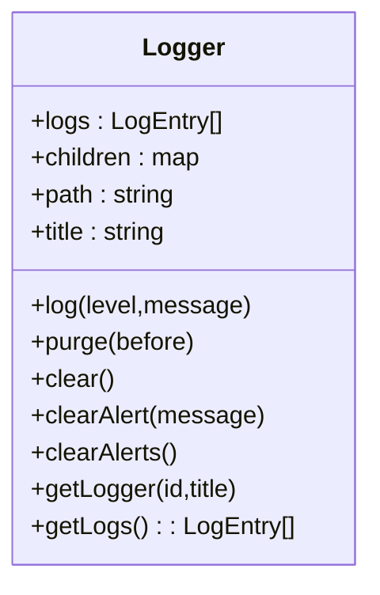
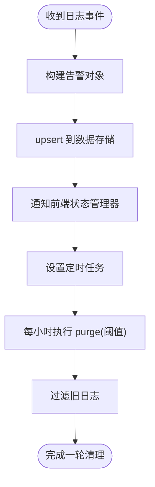
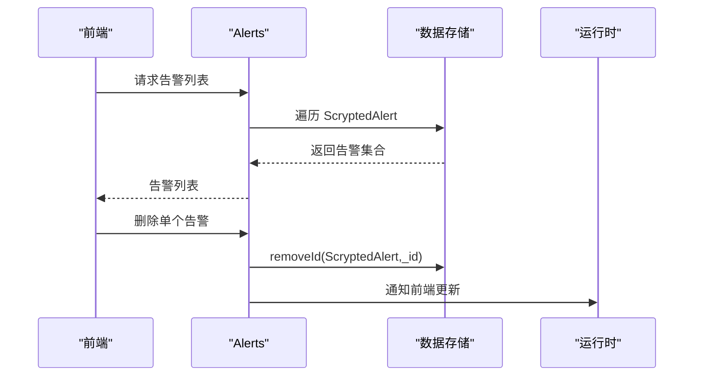
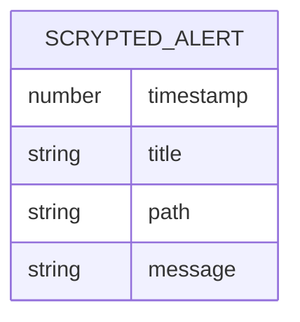
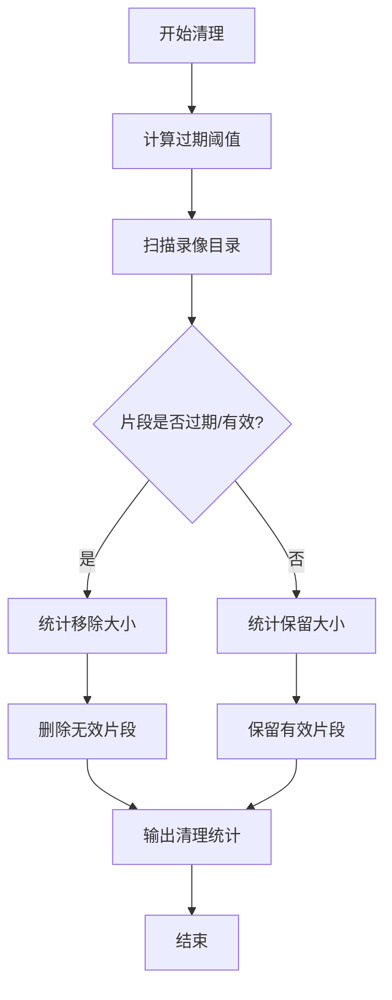
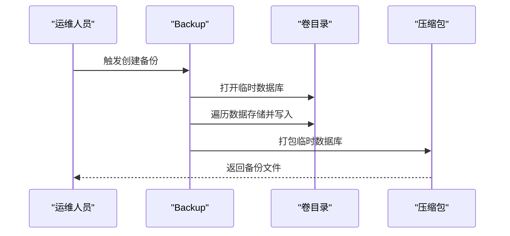
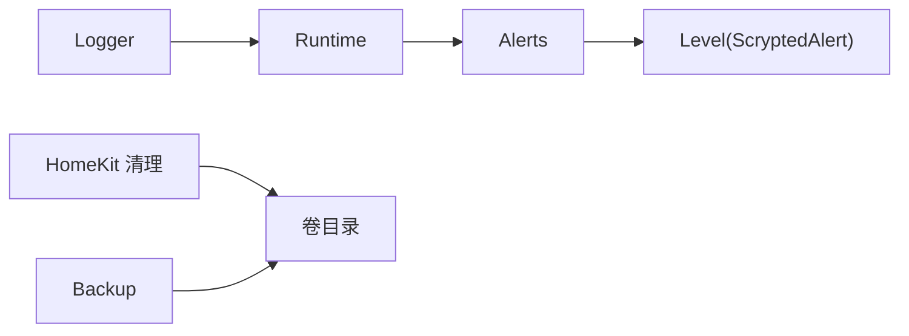

# 日志管理维护

<cite>
**本文引用的文件**
- [server/src/logger.ts](file://server/src/logger.ts)
- [server/src/runtime.ts](file://server/src/runtime.ts)
- [server/src/db-types.ts](file://server/src/db-types.ts)
- [server/src/services/alerts.ts](file://server/src/services/alerts.ts)
- [server/src/services/backup.ts](file://server/src/services/backup.ts)
- [plugins/homekit/src/types/camera/camera-recording-files.ts](file://plugins/homekit/src/types/camera/camera-recording-files.ts)
- [install/config.yaml](file://install/config.yaml)
</cite>

## 目录
1. [简介](#简介)
2. [项目结构](#项目结构)
3. [核心组件](#核心组件)
4. [架构总览](#架构总览)
5. [详细组件分析](#详细组件分析)
6. [依赖关系分析](#依赖关系分析)
7. [性能考量](#性能考量)
8. [故障排查指南](#故障排查指南)
9. [结论](#结论)
10. [附录](#附录)

## 简介
本指南面向 Scrypted 的运维与平台维护人员，系统化阐述日志管理与维护的最佳实践，覆盖以下方面：
- 日志轮转与保留策略：基于内存日志与数据存储的自动清理机制
- 日志清理与归档：过期日志删除、存储空间管理、历史日志归档
- 日志分析与统计：日志聚合、错误统计、性能指标提取
- 日志级别与过滤：调试信息、警告级别、错误过滤
- 日志监控与告警：异常检测、实时通知、趋势分析
- 日志备份与合规：重要日志保存、审计记录、合规性要求
- 日志格式与结构：字段含义、解析方法、导出格式

## 项目结构
Scrypted 的日志子系统由运行时（runtime）负责统一接入，日志对象（Logger）负责采集与分发，告警服务（Alerts）负责持久化告警，数据库类型（db-types）定义了告警文档结构，部分插件（如 HomeKit 录像）实现独立的过期清理逻辑。

**图示来源**
- [server/src/runtime.ts:160-176](file://server/src/runtime.ts#L160-L176)
- [server/src/logger.ts:19-92](file://server/src/logger.ts#L19-L92)
- [server/src/services/alerts.ts:1-24](file://server/src/services/alerts.ts#L1-L24)
- [server/src/db-types.ts:26-31](file://server/src/db-types.ts#L26-L31)
- [server/src/services/backup.ts:1-76](file://server/src/services/backup.ts#L1-L76)
- [plugins/homekit/src/types/camera/camera-recording-files.ts:19-63](file://plugins/homekit/src/types/camera/camera-recording-files.ts#L19-L63)
- [install/config.yaml:25-26](file://install/config.yaml#L25-L26)

**章节来源**
- [server/src/runtime.ts:160-176](file://server/src/runtime.ts#L160-L176)
- [server/src/logger.ts:19-92](file://server/src/logger.ts#L19-L92)
- [server/src/services/alerts.ts:1-24](file://server/src/services/alerts.ts#L1-L24)
- [server/src/db-types.ts:26-31](file://server/src/db-types.ts#L26-L31)
- [server/src/services/backup.ts:1-76](file://server/src/services/backup.ts#L1-L76)
- [plugins/homekit/src/types/camera/camera-recording-files.ts:19-63](file://plugins/homekit/src/types/camera/camera-recording-files.ts#L19-L63)
- [install/config.yaml:25-26](file://install/config.yaml#L25-L26)

## 核心组件
- 运行时（Runtime）
  - 负责接收日志事件并持久化为告警，同时周期性触发日志清理
  - 清理策略：每小时清理超过一定时间阈值的日志
- 日志器（Logger）
  - 提供日志写入、子日志器创建、日志获取、按时间戳清理等能力
  - 支持嵌套路径组织，便于按模块/设备维度管理
- 告警服务（Alerts）
  - 提供告警查询、删除与清空接口，并在变更时通知前端
- 数据类型（db-types）
  - 定义告警文档结构，包含时间戳、标题、路径、消息体等字段
- 备份服务（Backup）
  - 将数据存储内容打包为压缩包，用于日志与配置的备份恢复
- HomeKit 录像清理（camera-recording-files）
  - 针对视频片段的过期清理与统计，体现独立的存储空间管理策略

**章节来源**
- [server/src/runtime.ts:160-176](file://server/src/runtime.ts#L160-L176)
- [server/src/logger.ts:19-92](file://server/src/logger.ts#L19-L92)
- [server/src/services/alerts.ts:1-24](file://server/src/services/alerts.ts#L1-L24)
- [server/src/db-types.ts:26-31](file://server/src/db-types.ts#L26-L31)
- [server/src/services/backup.ts:1-76](file://server/src/services/backup.ts#L1-L76)
- [plugins/homekit/src/types/camera/camera-recording-files.ts:19-63](file://plugins/homekit/src/types/camera/camera-recording-files.ts#L19-L63)

## 架构总览
下图展示了日志从产生到持久化、清理与备份的整体流程。

**图示来源**
- [server/src/logger.ts:33-46](file://server/src/logger.ts#L33-L46)
- [server/src/runtime.ts:160-170](file://server/src/runtime.ts#L160-L170)
- [server/src/services/alerts.ts:8-14](file://server/src/services/alerts.ts#L8-L14)
- [server/src/db-types.ts:26-31](file://server/src/db-types.ts#L26-L31)
- [server/src/logger.ts:48-53](file://server/src/logger.ts#L48-L53)

## 详细组件分析

### 日志器（Logger）与日志轮转
- 日志写入
  - 接收级别与消息，生成带时间戳的条目并写入内存队列
  - 同步输出到控制台，便于实时观察
- 子日志器
  - 支持按路径层级创建子日志器，便于模块化管理
- 获取与排序
  - 提供合并子日志器与自身日志的能力，并按时间戳升序返回
- 清理策略
  - 提供按时间戳过滤的清理方法，运行时定时调用以移除过期日志

**图示来源**
- [server/src/logger.ts:19-92](file://server/src/logger.ts#L19-L92)

**章节来源**
- [server/src/logger.ts:33-46](file://server/src/logger.ts#L33-L46)
- [server/src/logger.ts:77-91](file://server/src/logger.ts#L77-L91)
- [server/src/logger.ts:48-53](file://server/src/logger.ts#L48-L53)

### 运行时（Runtime）与日志持久化
- 日志事件处理
  - 接收日志事件后，构造告警对象并写入数据存储
  - 通过状态管理器向前端广播日志事件，支持实时查看
- 自动清理
  - 每小时触发一次清理，移除超过固定阈值（例如 48 小时前）的日志

**图示来源**
- [server/src/runtime.ts:160-170](file://server/src/runtime.ts#L160-L170)
- [server/src/runtime.ts:172-175](file://server/src/runtime.ts#L172-L175)

**章节来源**
- [server/src/runtime.ts:160-176](file://server/src/runtime.ts#L160-L176)

### 告警服务（Alerts）与日志保留
- 查询告警
  - 遍历数据存储中的所有告警，返回列表
- 删除与清空
  - 支持按告警 ID 删除或清空全部告警
  - 删除后通知前端状态变化

**图示来源**
- [server/src/services/alerts.ts:8-14](file://server/src/services/alerts.ts#L8-L14)
- [server/src/services/alerts.ts:15-22](file://server/src/services/alerts.ts#L15-L22)
- [server/src/db-types.ts:26-31](file://server/src/db-types.ts#L26-L31)

**章节来源**
- [server/src/services/alerts.ts:1-24](file://server/src/services/alerts.ts#L1-L24)
- [server/src/db-types.ts:26-31](file://server/src/db-types.ts#L26-L31)

### 日志格式与结构
- 日志条目（LogEntry）
  - 字段：标题、时间戳、级别、消息、路径
- 告警条目（ScryptedAlert）
  - 字段：时间戳、标题、路径、消息体
- 解析与导出
  - 可通过告警服务遍历数据存储获取告警列表
  - 可通过日志器获取合并后的日志列表并进行二次处理

**图示来源**
- [server/src/db-types.ts:26-31](file://server/src/db-types.ts#L26-L31)

**章节来源**
- [server/src/logger.ts:11-17](file://server/src/logger.ts#L11-L17)
- [server/src/db-types.ts:26-31](file://server/src/db-types.ts#L26-L31)

### 日志清理策略与存储空间管理
- 运行时清理
  - 每小时清理超过固定阈值（例如 48 小时）的日志
- 插件级清理（HomeKit 录像）
  - 按设定的过期时长清理旧片段，统计保留与移除数量与字节数
  - 对异常片段进行移除并记录日志

**图示来源**
- [plugins/homekit/src/types/camera/camera-recording-files.ts:19-63](file://plugins/homekit/src/types/camera/camera-recording-files.ts#L19-L63)

**章节来源**
- [server/src/runtime.ts:172-175](file://server/src/runtime.ts#L172-L175)
- [plugins/homekit/src/types/camera/camera-recording-files.ts:19-63](file://plugins/homekit/src/types/camera/camera-recording-files.ts#L19-L63)

### 日志备份方案与合规
- 备份范围
  - 备份服务会将数据存储内容复制到临时数据库并打包为压缩文件
  - 可用于恢复系统状态与日志相关的配置
- 卷挂载与排除
  - 容器配置中定义了数据卷路径，可结合外部备份策略进行归档
  - 可根据需要调整排除项以满足合规性要求

**图示来源**
- [server/src/services/backup.ts:12-46](file://server/src/services/backup.ts#L12-L46)
- [install/config.yaml:25-26](file://install/config.yaml#L25-L26)

**章节来源**
- [server/src/services/backup.ts:1-76](file://server/src/services/backup.ts#L1-L76)
- [install/config.yaml:25-26](file://install/config.yaml#L25-L26)

## 依赖关系分析
- 组件耦合
  - Logger 与 Runtime 强关联：Logger 通过事件驱动 Runtime 更新状态与持久化告警
  - Alerts 依赖数据存储与 Runtime 的状态通知
  - HomeKit 录像清理独立于主日志系统，但同样关注存储空间
- 外部依赖
  - 数据存储使用 Level 数据库（通过 ScryptedAlert 文档类型）
  - 备份使用压缩库进行打包

**图示来源**
- [server/src/logger.ts:19-92](file://server/src/logger.ts#L19-L92)
- [server/src/runtime.ts:160-170](file://server/src/runtime.ts#L160-L170)
- [server/src/services/alerts.ts:1-24](file://server/src/services/alerts.ts#L1-L24)
- [server/src/db-types.ts:26-31](file://server/src/db-types.ts#L26-L31)
- [plugins/homekit/src/types/camera/camera-recording-files.ts:19-63](file://plugins/homekit/src/types/camera/camera-recording-files.ts#L19-L63)
- [server/src/services/backup.ts:1-76](file://server/src/services/backup.ts#L1-L76)

**章节来源**
- [server/src/logger.ts:19-92](file://server/src/logger.ts#L19-L92)
- [server/src/runtime.ts:160-170](file://server/src/runtime.ts#L160-L170)
- [server/src/services/alerts.ts:1-24](file://server/src/services/alerts.ts#L1-L24)
- [server/src/db-types.ts:26-31](file://server/src/db-types.ts#L26-L31)
- [plugins/homekit/src/types/camera/camera-recording-files.ts:19-63](file://plugins/homekit/src/types/camera/camera-recording-files.ts#L19-L63)
- [server/src/services/backup.ts:1-76](file://server/src/services/backup.ts#L1-L76)

## 性能考量
- 内存占用
  - 日志器在内存中维护日志队列，建议合理设置清理周期与阈值，避免长时间运行导致内存增长
- 清理频率
  - 运行时每小时清理一次，可根据日志量与磁盘压力调整频率
- I/O 开销
  - 告警写入与遍历读取存在 I/O，建议在高并发场景下评估数据存储性能

[本节为通用指导，不直接分析具体文件]

## 故障排查指南
- 日志未显示
  - 检查日志器是否正确创建子日志器并触发事件
  - 确认运行时是否收到日志事件并通知前端
- 告警缺失
  - 使用告警服务查询是否存在对应告警
  - 检查清理任务是否提前移除了日志
- 存储空间不足
  - 查看 HomeKit 录像清理统计，确认是否已清理过期片段
  - 结合备份策略定期归档重要日志

**章节来源**
- [server/src/logger.ts:77-91](file://server/src/logger.ts#L77-L91)
- [server/src/runtime.ts:160-170](file://server/src/runtime.ts#L160-L170)
- [server/src/services/alerts.ts:8-14](file://server/src/services/alerts.ts#L8-L14)
- [plugins/homekit/src/types/camera/camera-recording-files.ts:61-62](file://plugins/homekit/src/types/camera/camera-recording-files.ts#L61-L62)

## 结论
Scrypted 的日志管理以运行时为核心，结合日志器、告警服务与数据存储，实现了从日志写入、持久化到自动清理的闭环。配合插件级的存储空间管理与备份服务，可满足日常运维、监控告警与合规归档的需求。建议在生产环境中根据业务负载与合规要求，合理配置清理阈值、清理频率与备份策略。

[本节为总结性内容，不直接分析具体文件]

## 附录

### 日志级别与过滤建议
- 调试信息：用于开发与问题定位，建议在生产环境关闭或限制输出
- 警告级别：用于潜在问题，建议结合告警服务进行集中管理
- 错误过滤：通过日志器的过滤与清理策略减少噪声，保留关键信息

[本节为通用指导，不直接分析具体文件]

### 日志分析与统计
- 日志聚合：通过日志器的合并与排序能力，统一输出
- 错误统计：结合告警服务与清理统计，识别高频错误与异常模式
- 性能指标：可基于日志时间戳与消息内容，提取吞吐与延迟等指标

[本节为通用指导，不直接分析具体文件]

### 日志监控与告警
- 实时通知：运行时在持久化告警后通知前端，便于实时查看
- 异常检测：结合清理策略与告警服务，识别异常峰值与过期日志
- 趋势分析：通过定期备份与导出，形成历史趋势报告

[本节为通用指导，不直接分析具体文件]