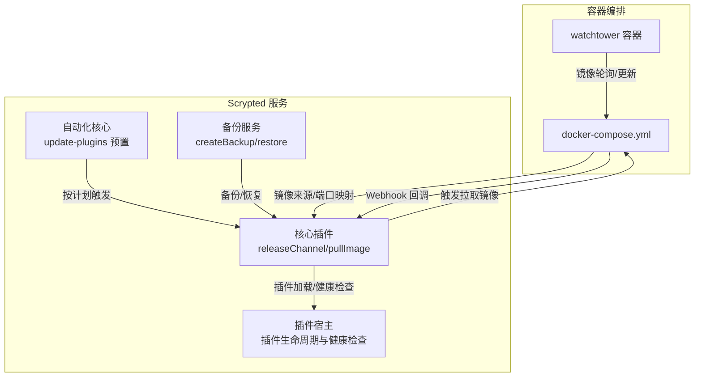
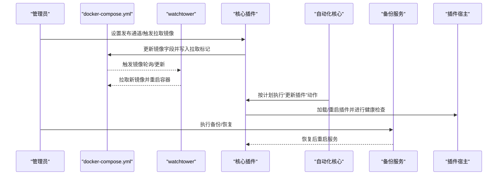
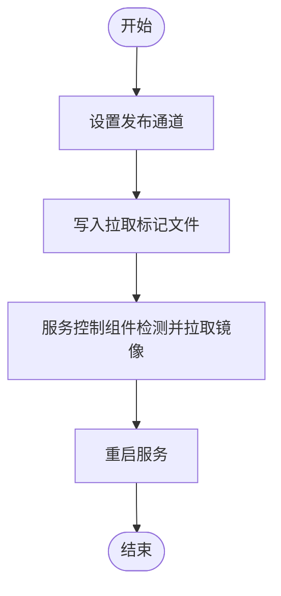
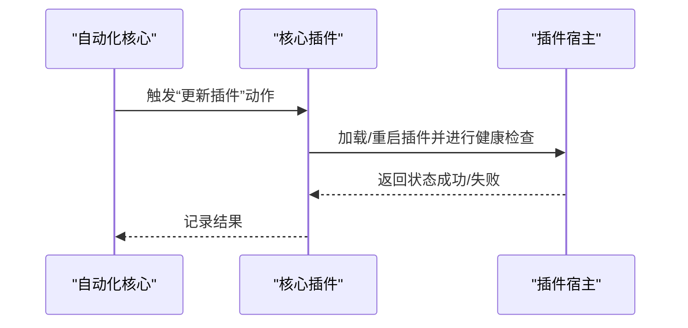
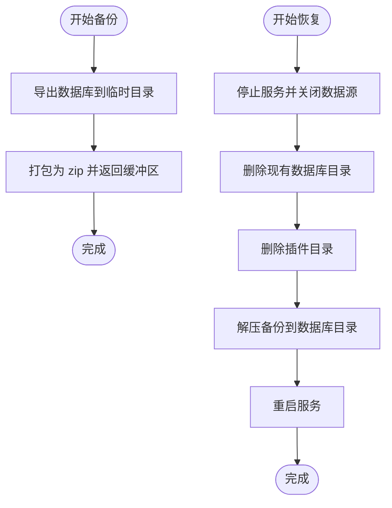
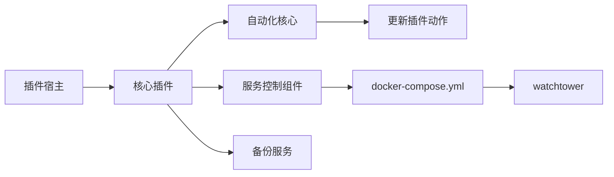

# 系统更新管理

<cite>
**本文引用的文件**
- [plugins/core/src/update-plugins.ts](file://plugins/core/src/update-plugins.ts)
- [plugins/core/src/main.ts](file://plugins/core/src/main.ts)
- [plugins/core/src/automations-core.ts](file://plugins/core/src/automations-core.ts)
- [server/src/services/backup.ts](file://server/src/services/backup.ts)
- [install/docker/docker-compose.yml](file://install/docker/docker-compose.yml)
- [install/docker/install-scrypted-docker-compose.sh](file://install/docker/install-scrypted-docker-compose.sh)
- [install/docker/setup-scrypted-nvr-volume.sh](file://install/docker/setup-scrypted-nvr-volume.sh)
- [server/src/plugin/plugin-host.ts](file://server/src/plugin/plugin-host.ts)
</cite>

## 目录
1. [简介](#简介)
2. [项目结构](#项目结构)
3. [核心组件](#核心组件)
4. [架构总览](#架构总览)
5. [详细组件分析](#详细组件分析)
6. [依赖关系分析](#依赖关系分析)
7. [性能考量](#性能考量)
8. [故障排查指南](#故障排查指南)
9. [结论](#结论)
10. [附录](#附录)

## 简介
本指南面向 Scrypted 系统管理员与运维工程师，提供系统级与插件级更新管理的完整操作手册。内容覆盖：
- 核心系统升级流程：Docker 镜像更新、npm 包升级、手动更新触发机制
- 插件更新策略：自动更新配置、手动更新流程、版本兼容性检查
- 更新前备份方案：配置备份、数据备份、回滚准备
- 更新注意事项：停机时间、服务中断、依赖冲突处理
- 更新验证步骤：功能测试、性能验证、兼容性检查
- 更新失败应急处理：回滚操作、故障恢复、问题诊断

## 项目结构
Scrypted 的更新管理由“核心插件（Core）+ Docker 编排 + 自动化引擎 + 备份服务”协同实现。核心要点：
- Docker Compose 配置通过环境变量与外部 Webhook 协同，启用自动更新轮询与触发
- 核心插件提供“服务器发布通道”设置与“拉取镜像”触发器
- 自动化核心内置“自动更新插件”的预置自动化，按计划执行
- 备份服务提供数据库与插件目录的打包/恢复能力

图表来源
- [install/docker/docker-compose.yml:35-36](file://install/docker/docker-compose.yml#L35-L36)
- [install/docker/docker-compose.yml:141-169](file://install/docker/docker-compose.yml#L141-L169)
- [plugins/core/src/main.ts:58-95](file://plugins/core/src/main.ts#L58-L95)
- [plugins/core/src/automations-core.ts:28-38](file://plugins/core/src/automations-core.ts#L28-L38)
- [server/src/services/backup.ts:9-46](file://server/src/services/backup.ts#L9-L46)
- [server/src/plugin/plugin-host.ts:330-463](file://server/src/plugin/plugin-host.ts#L330-L463)

章节来源
- [install/docker/docker-compose.yml:1-169](file://install/docker/docker-compose.yml#L1-L169)
- [plugins/core/src/main.ts:1-414](file://plugins/core/src/main.ts#L1-L414)
- [plugins/core/src/automations-core.ts:1-83](file://plugins/core/src/automations-core.ts#L1-L83)
- [server/src/services/backup.ts:1-76](file://server/src/services/backup.ts#L1-L76)
- [server/src/plugin/plugin-host.ts:1-506](file://server/src/plugin/plugin-host.ts#L1-L506)

## 核心组件
- Docker 自动更新（Watchtower）
  - 通过 HTTP API 轮询与触发更新；监听指定 scope 的镜像变更
  - 提供 Webhook 端点用于外部触发更新
- 核心插件（Core）
  - 服务器发布通道设置：支持选择镜像标签（如 latest/beta/intel/amd/nvidia 等）
  - 拉取镜像触发器：写入标记文件以触发服务控制组件拉取新镜像并重启
- 自动化核心（Automations Core）
  - 内置“自动更新插件”的预置自动化，按周日到周六每天固定时间（例如 03:15 AM）执行
- 备份服务（Backup）
  - 创建数据库与配置的压缩备份
  - 支持从备份恢复并重启服务，同时清理插件目录以便首次启动重新安装

章节来源
- [install/docker/docker-compose.yml:141-169](file://install/docker/docker-compose.yml#L141-L169)
- [plugins/core/src/main.ts:58-95](file://plugins/core/src/main.ts#L58-L95)
- [plugins/core/src/automations-core.ts:28-38](file://plugins/core/src/automations-core.ts#L28-L38)
- [server/src/services/backup.ts:9-76](file://server/src/services/backup.ts#L9-L76)

## 架构总览
下图展示更新流程的关键交互：Docker Compose 与 Watchtower、核心插件、自动化核心、备份服务与插件宿主之间的关系。

图表来源
- [install/docker/docker-compose.yml:35-36](file://install/docker/docker-compose.yml#L35-L36)
- [install/docker/docker-compose.yml:141-169](file://install/docker/docker-compose.yml#L141-L169)
- [plugins/core/src/main.ts:73-95](file://plugins/core/src/main.ts#L73-L95)
- [plugins/core/src/automations-core.ts:28-38](file://plugins/core/src/automations-core.ts#L28-L38)
- [server/src/services/backup.ts:48-76](file://server/src/services/backup.ts#L48-L76)
- [server/src/plugin/plugin-host.ts:330-463](file://server/src/plugin/plugin-host.ts#L330-L463)

## 详细组件分析

### Docker 镜像更新与自动更新触发
- Webhook 与轮询
  - 通过环境变量配置 Webhook 授权与回调地址，使外部系统可触发更新
  - Watchtower 容器按间隔轮询镜像变更，并在匹配 scope 时执行更新
- 发布通道与镜像标签
  - 核心插件提供“服务器发布通道”设置，支持多种标签（如 latest/beta/intel/amd/nvidia）
  - 设置后会修改 docker-compose.yml 中的镜像字段，并触发拉取镜像流程
- 手动触发拉取镜像
  - 通过写入特定标记文件，由服务控制组件检测并拉取新镜像，随后重启服务

图表来源
- [plugins/core/src/main.ts:73-95](file://plugins/core/src/main.ts#L73-L95)
- [plugins/core/src/main.ts:377-391](file://plugins/core/src/main.ts#L377-L391)
- [install/docker/docker-compose.yml:35-36](file://install/docker/docker-compose.yml#L35-L36)
- [install/docker/docker-compose.yml:141-169](file://install/docker/docker-compose.yml#L141-L169)

章节来源
- [install/docker/docker-compose.yml:35-36](file://install/docker/docker-compose.yml#L35-L36)
- [install/docker/docker-compose.yml:141-169](file://install/docker/docker-compose.yml#L141-L169)
- [plugins/core/src/main.ts:58-95](file://plugins/core/src/main.ts#L58-L95)
- [plugins/core/src/main.ts:377-391](file://plugins/core/src/main.ts#L377-L391)

### 插件更新策略
- 自动更新配置
  - 自动化核心内置“自动更新插件”的预置自动化，按每周固定时间（如 03:15 AM）执行
  - 预置数据定义了触发器（调度器）与动作（更新插件），覆盖所有七天
- 手动更新流程
  - 可在自动化界面中直接启用或禁用该自动化
  - 也可通过核心插件提供的“拉取镜像”设置触发服务控制组件拉取最新镜像
- 版本兼容性检查
  - 插件宿主负责插件的加载、健康检查与异常重启
  - 若插件未按时响应心跳或启动超时，系统会记录错误并请求重启，避免长时间不可用

图表来源
- [plugins/core/src/automations-core.ts:28-38](file://plugins/core/src/automations-core.ts#L28-L38)
- [plugins/core/src/update-plugins.ts:1-49](file://plugins/core/src/update-plugins.ts#L1-L49)
- [server/src/plugin/plugin-host.ts:289-325](file://server/src/plugin/plugin-host.ts#L289-L325)

章节来源
- [plugins/core/src/automations-core.ts:1-83](file://plugins/core/src/automations-core.ts#L1-L83)
- [plugins/core/src/update-plugins.ts:1-49](file://plugins/core/src/update-plugins.ts#L1-L49)
- [server/src/plugin/plugin-host.ts:289-325](file://server/src/plugin/plugin-host.ts#L289-L325)

### 更新前备份方案
- 数据备份
  - 备份服务将运行时数据库导出为临时副本，再打包为 zip 文件返回
  - 备份包含系统配置与设备状态等关键数据
- 插件备份与回滚准备
  - 恢复流程会删除现有数据库与插件目录，确保首次启动时重新安装插件
  - 建议在更新前手动下载备份 zip，以便快速回滚
- NVR 存储卷配置脚本
  - 提供 NVR 存储卷的挂载与格式化脚本，更新前建议确认存储路径与权限

图表来源
- [server/src/services/backup.ts:12-46](file://server/src/services/backup.ts#L12-L46)
- [server/src/services/backup.ts:48-76](file://server/src/services/backup.ts#L48-L76)

章节来源
- [server/src/services/backup.ts:1-76](file://server/src/services/backup.ts#L1-L76)
- [install/docker/setup-scrypted-nvr-volume.sh:1-160](file://install/docker/setup-scrypted-nvr-volume.sh#L1-L160)

### 更新过程中的注意事项
- 停机时间与服务中断
  - 拉取镜像与重启服务会导致短暂中断，建议在维护窗口内执行
  - Watchtower 的轮询间隔可配置，默认每小时一次
- 依赖项冲突处理
  - NVIDIA/AMD 等硬件加速镜像需满足驱动与容器工具链要求
  - 若存在设备直通需求（如 /dev/dri、/dev/kfd），请在 docker-compose.yml 中取消注释对应项
- DNS 与网络
  - 建议使用全局 DNS 服务器以避免 npm 等注册表访问问题

章节来源
- [install/docker/docker-compose.yml:135-139](file://install/docker/docker-compose.yml#L135-L139)
- [install/docker/docker-compose.yml:96-117](file://install/docker/docker-compose.yml#L96-L117)
- [install/docker/install-scrypted-docker-compose.sh:101-117](file://install/docker/install-scrypted-docker-compose.sh#L101-L117)

### 更新验证步骤
- 功能测试
  - 核心插件提供设备与服务的可用性检查（如云服务连通性、通知发送等）
  - 建议在更新后运行诊断命令，确认摄像头、通知器等关键设备功能正常
- 性能验证
  - 观察插件加载与心跳响应是否稳定，避免频繁重启
- 兼容性检查
  - 确认插件版本与服务器版本兼容，必要时回滚至稳定版本

章节来源
- [plugins/diagnostics/src/main.ts:190-484](file://plugins/diagnostics/src/main.ts#L190-L484)
- [server/src/plugin/plugin-host.ts:289-325](file://server/src/plugin/plugin-host.ts#L289-L325)

### 更新失败的应急处理
- 回滚操作
  - 使用备份服务提供的恢复流程，删除现有数据库与插件目录后解压备份
  - 重启服务后验证功能
- 故障恢复
  - 若插件未按时响应心跳或启动超时，系统会自动请求重启
  - 检查插件宿主日志，定位加载失败原因
- 问题诊断
  - 查看 Watchtower 日志与 docker-compose 日志
  - 确认 Webhook 授权与回调地址正确

章节来源
- [server/src/services/backup.ts:48-76](file://server/src/services/backup.ts#L48-L76)
- [server/src/plugin/plugin-host.ts:307-325](file://server/src/plugin/plugin-host.ts#L307-L325)
- [install/docker/docker-compose.yml:141-169](file://install/docker/docker-compose.yml#L141-L169)

## 依赖关系分析
- 组件耦合
  - 核心插件与服务控制组件紧密耦合，负责镜像更新与重启
  - 自动化核心依赖预置自动化数据，实现定时更新
  - 备份服务与运行时数据源强耦合，确保数据一致性
- 外部依赖
  - Docker 与 Watchtower 提供镜像轮询与更新能力
  - 环境变量与 docker-compose.yml 控制镜像标签与设备直通

图表来源
- [plugins/core/src/main.ts:73-95](file://plugins/core/src/main.ts#L73-L95)
- [plugins/core/src/automations-core.ts:28-38](file://plugins/core/src/automations-core.ts#L28-L38)
- [plugins/core/src/update-plugins.ts:1-49](file://plugins/core/src/update-plugins.ts#L1-L49)
- [server/src/services/backup.ts:9-46](file://server/src/services/backup.ts#L9-L46)
- [install/docker/docker-compose.yml:141-169](file://install/docker/docker-compose.yml#L141-L169)
- [server/src/plugin/plugin-host.ts:330-463](file://server/src/plugin/plugin-host.ts#L330-L463)

章节来源
- [plugins/core/src/main.ts:1-414](file://plugins/core/src/main.ts#L1-L414)
- [plugins/core/src/automations-core.ts:1-83](file://plugins/core/src/automations-core.ts#L1-L83)
- [plugins/core/src/update-plugins.ts:1-49](file://plugins/core/src/update-plugins.ts#L1-L49)
- [server/src/services/backup.ts:1-76](file://server/src/services/backup.ts#L1-L76)
- [install/docker/docker-compose.yml:1-169](file://install/docker/docker-compose.yml#L1-L169)
- [server/src/plugin/plugin-host.ts:1-506](file://server/src/plugin/plugin-host.ts#L1-L506)

## 性能考量
- 更新频率与资源占用
  - Watchtower 轮询间隔影响 CPU/网络开销，建议根据环境调整
- 插件加载与心跳
  - 插件宿主的心跳检查与重启逻辑避免长时间无响应，但频繁重启会影响稳定性
- 备份与恢复
  - 备份与恢复涉及磁盘 IO，建议在低负载时段执行

## 故障排查指南
- 更新未生效
  - 检查 docker-compose.yml 中镜像标签与 Webhook 配置
  - 确认服务控制组件已写入拉取标记并执行重启
- 插件加载失败
  - 查看插件宿主日志，关注加载错误与心跳超时信息
  - 必要时回滚至稳定版本并重装插件
- 备份/恢复异常
  - 确认备份 zip 校验通过，恢复前确保服务已停止且数据源关闭

章节来源
- [plugins/core/src/main.ts:73-95](file://plugins/core/src/main.ts#L73-L95)
- [server/src/plugin/plugin-host.ts:307-325](file://server/src/plugin/plugin-host.ts#L307-L325)
- [server/src/services/backup.ts:48-76](file://server/src/services/backup.ts#L48-L76)

## 结论
通过 Docker Compose 与 Watchtower 的自动更新机制、核心插件的发布通道与拉取镜像触发器、自动化核心的定时更新动作以及备份服务的可靠恢复能力，Scrypted 实现了从系统到插件的全链路更新管理。建议在维护窗口内执行更新，提前做好备份，并在更新后进行功能与兼容性验证，以确保系统稳定运行。

## 附录
- 安装与初始化
  - 使用安装脚本一键部署 Docker、生成令牌、拉取镜像并启动服务
  - 可选安装 NVIDIA 驱动与容器工具链以启用 GPU 加速
- NVR 存储卷
  - 提供格式化与挂载脚本，支持块设备或现有目录作为 NVR 存储

章节来源
- [install/docker/install-scrypted-docker-compose.sh:1-190](file://install/docker/install-scrypted-docker-compose.sh#L1-L190)
- [install/docker/setup-scrypted-nvr-volume.sh:1-160](file://install/docker/setup-scrypted-nvr-volume.sh#L1-L160)