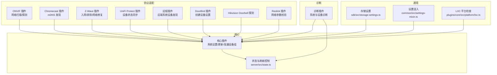
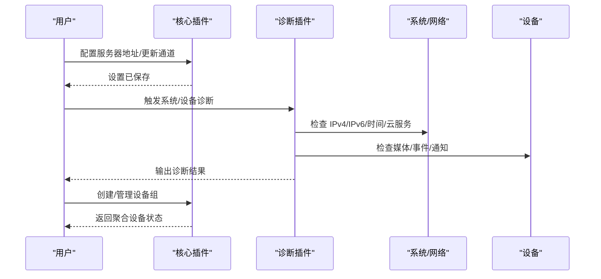
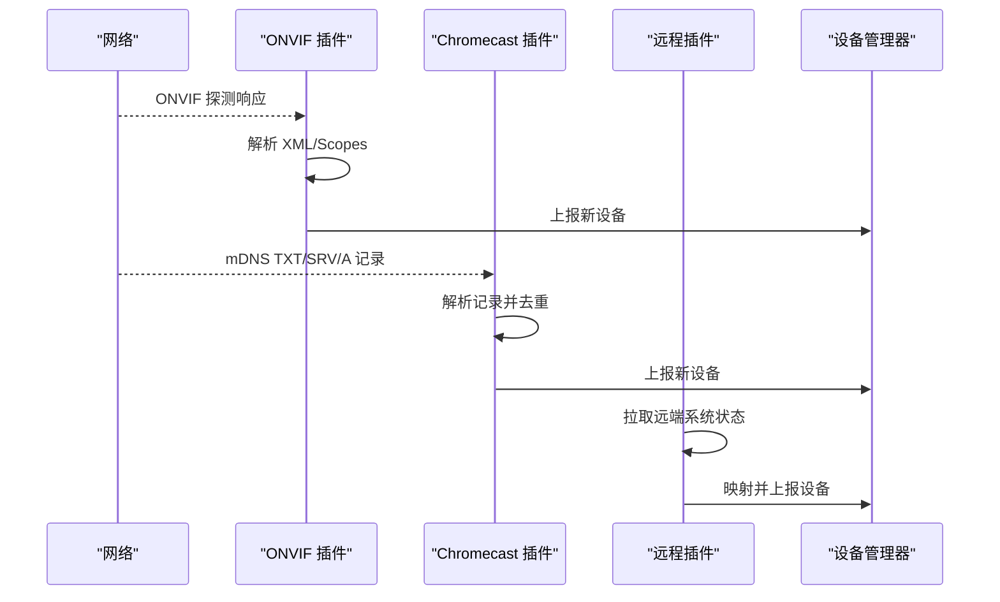
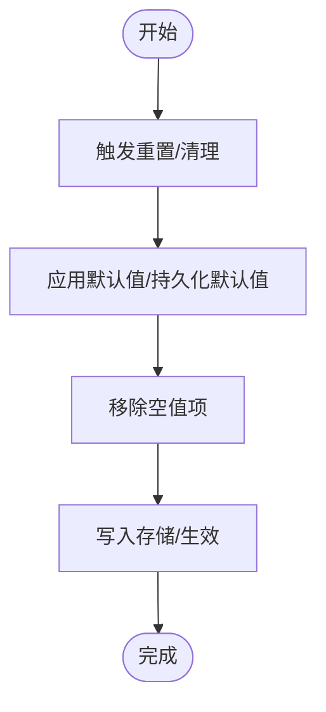
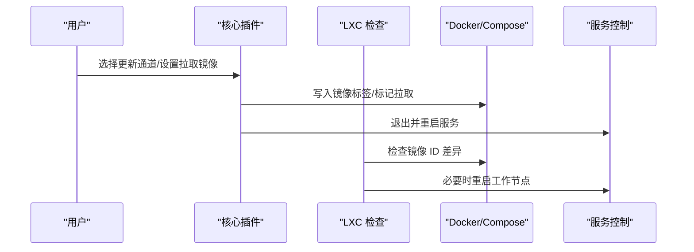
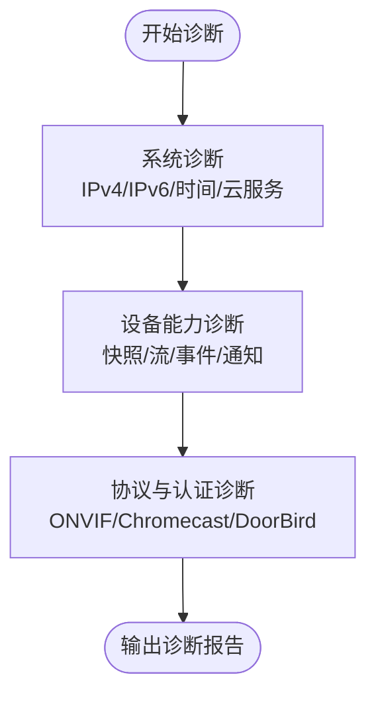
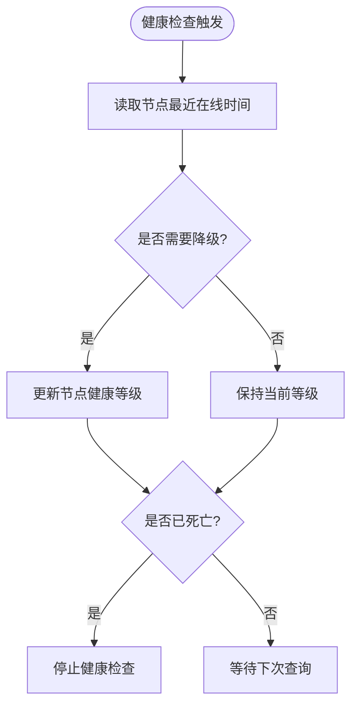
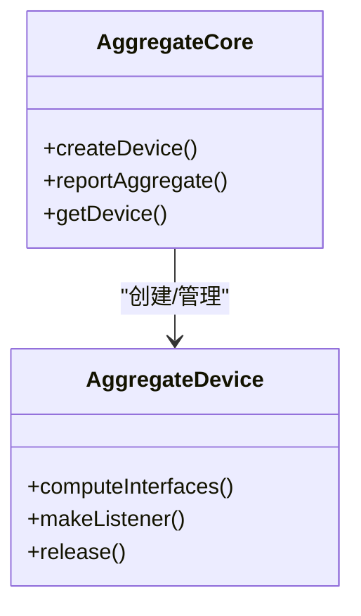
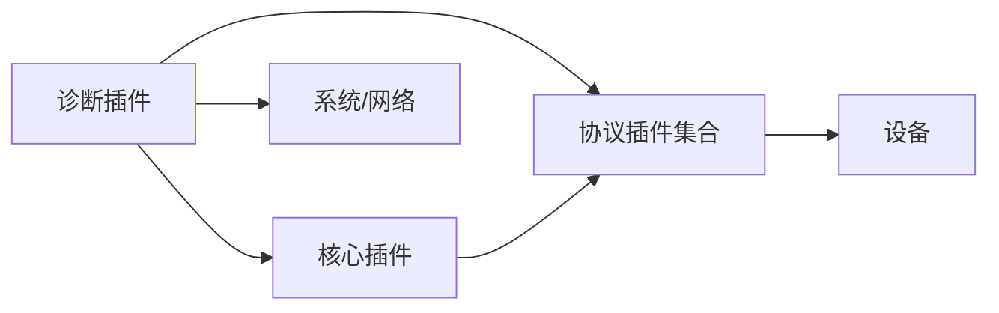

# 设备维护管理

<cite>
**本文引用的文件**
- [plugins/diagnostics/src/main.ts](file://plugins/diagnostics/src/main.ts)
- [plugins/core/src/main.ts](file://plugins/core/src/main.ts)
- [plugins/core/src/aggregate-core.ts](file://plugins/core/src/aggregate-core.ts)
- [plugins/core/src/aggregate.ts](file://plugins/core/src/aggregate.ts)
- [plugins/onvif/src/main.ts](file://plugins/onvif/src/main.ts)
- [plugins/chromecast/src/main.ts](file://plugins/chromecast/src/main.ts)
- [plugins/zwave/src/main.ts](file://plugins/zwave/src/main.ts)
- [plugins/zwave/src/CommandClasses/SettingsToConfiguration.ts](file://plugins/zwave/src/CommandClasses/SettingsToConfiguration.ts)
- [plugins/unifi-protect/src/main.ts](file://plugins/unifi-protect/src/main.ts)
- [plugins/remote/src/main.ts](file://plugins/remote/src/main.ts)
- [plugins/doorbird/src/main.ts](file://plugins/doorbird/src/main.ts)
- [plugins/hikvision-doorbell/src/probe.ts](file://plugins/hikvision-doorbell/src/probe.ts)
- [plugins/reolink/src/main.ts](file://plugins/reolink/src/main.ts)
- [plugins/reolink/src/nvr/api.ts](file://plugins/reolink/src/nvr/api.ts)
- [server/src/state.ts](file://server/src/state.ts)
- [server/src/state.ts](file://server/src/state.ts)
- [common/src/settings-mixin.ts](file://common/src/settings-mixin.ts)
- [sdk/src/storage-settings.ts](file://sdk/src/storage-settings.ts)
- [plugins/core/src/platform/lxc.ts](file://plugins/core/src/platform/lxc.ts)
</cite>

## 目录
1. [简介](#简介)
2. [项目结构](#项目结构)
3. [核心组件](#核心组件)
4. [架构总览](#架构总览)
5. [详细组件分析](#详细组件分析)
6. [依赖关系分析](#依赖关系分析)
7. [性能考量](#性能考量)
8. [故障排查指南](#故障排查指南)
9. [结论](#结论)
10. [附录](#附录)

## 简介
本指南面向 Scrypted 用户与运维人员，提供一套可操作的设备维护管理实践，覆盖以下主题：
- 设备重新发现：网络扫描、设备探测、配置重载
- 设备配置重置：出厂设置恢复、配置文件清理、网络参数重置
- 固件更新管理：版本检查、在线更新、离线更新
- 连接诊断：网络连通性测试、协议兼容性检查、认证状态验证
- 健康监控：状态检查、异常检测、自动修复机制
- 批量维护：设备组管理、批量配置更新、统一维护策略

## 项目结构
Scrypted 的设备维护能力由“核心插件”“诊断插件”“协议适配插件”以及“服务层”协同实现。核心插件负责系统级维护（如服务器地址、更新通道、批量设备组），诊断插件提供系统与设备的连通性、资源访问、媒体流等诊断能力，协议插件负责具体设备的发现与交互。

图示来源
- [plugins/core/src/main.ts](file://plugins/core/src/main.ts)
- [plugins/diagnostics/src/main.ts](file://plugins/diagnostics/src/main.ts)
- [plugins/onvif/src/main.ts](file://plugins/onvif/src/main.ts)
- [plugins/chromecast/src/main.ts](file://plugins/chromecast/src/main.ts)
- [plugins/zwave/src/main.ts](file://plugins/zwave/src/main.ts)
- [plugins/unifi-protect/src/main.ts](file://plugins/unifi-protect/src/main.ts)
- [plugins/remote/src/main.ts](file://plugins/remote/src/main.ts)
- [plugins/doorbird/src/main.ts](file://plugins/doorbird/src/main.ts)
- [plugins/hikvision-doorbell/src/probe.ts](file://plugins/hikvision-doorbell/src/probe.ts)
- [plugins/reolink/src/main.ts](file://plugins/reolink/src/main.ts)
- [server/src/state.ts](file://server/src/state.ts)
- [sdk/src/storage-settings.ts](file://sdk/src/storage-settings.ts)
- [common/src/settings-mixin.ts](file://common/src/settings-mixin.ts)
- [plugins/core/src/platform/lxc.ts](file://plugins/core/src/platform/lxc.ts)

章节来源
- [plugins/core/src/main.ts](file://plugins/core/src/main.ts)
- [plugins/diagnostics/src/main.ts](file://plugins/diagnostics/src/main.ts)

## 核心组件
- 核心插件（Scrypted Core）
  - 提供系统设置界面、服务器地址配置、更新通道选择、批量设备组管理等能力。
  - 关键职责：系统维护入口、批量设备聚合、更新通道切换、LXC 环境检查与更新。
- 诊断插件（Diagnostics）
  - 提供系统与设备的诊断流程，包括网络连通性、云服务可达性、媒体能力、对象检测插件可用性、GPU 加速等。
- 协议适配插件
  - ONVIF/Chromecast/Z-Wave/UniFi Protect/远程/DoorBird/Hikvision/Reolink 等，负责设备发现、配置与状态同步。
- 存储与设置
  - StorageSettings 提供持久化设置读写；Settings Mixin 将扩展设置合并到主设备设置中。

章节来源
- [plugins/core/src/main.ts](file://plugins/core/src/main.ts)
- [plugins/core/src/aggregate-core.ts](file://plugins/core/src/aggregate-core.ts)
- [plugins/core/src/aggregate.ts](file://plugins/core/src/aggregate.ts)
- [plugins/diagnostics/src/main.ts](file://plugins/diagnostics/src/main.ts)
- [sdk/src/storage-settings.ts](file://sdk/src/storage-settings.ts)
- [common/src/settings-mixin.ts](file://common/src/settings-mixin.ts)

## 架构总览
下图展示设备维护相关的关键交互路径：诊断插件调用系统与设备接口进行连通性与能力验证；核心插件提供系统设置与批量设备组；协议插件负责设备发现与状态同步。

图示来源
- [plugins/core/src/main.ts](file://plugins/core/src/main.ts)
- [plugins/diagnostics/src/main.ts](file://plugins/diagnostics/src/main.ts)

## 详细组件分析

### 设备重新发现与网络扫描
- ONVIF 设备发现
  - 使用 XML 解析与设备范围（scopes）解析，从探测响应中提取设备名称、地址、XAddr 等信息，并避免重复发现。
- Chromecast mDNS 发现
  - 解析 TXT/SRV/A/AAAA 记录，构建设备主机与端口信息并触发发现回调。
- 远程系统设备发现
  - 从远程客户端系统状态拉取设备列表，过滤后映射为本地设备并上报。

图示来源
- [plugins/onvif/src/main.ts](file://plugins/onvif/src/main.ts)
- [plugins/chromecast/src/main.ts](file://plugins/chromecast/src/main.ts)
- [plugins/remote/src/main.ts](file://plugins/remote/src/main.ts)

章节来源
- [plugins/onvif/src/main.ts](file://plugins/onvif/src/main.ts)
- [plugins/chromecast/src/main.ts](file://plugins/chromecast/src/main.ts)
- [plugins/remote/src/main.ts](file://plugins/remote/src/main.ts)

### 设备配置重置与网络参数重置
- 出厂设置恢复
  - 通过 StorageSettings 的默认值与持久化默认值机制，将设备或扩展设置回退到默认状态。
- 配置文件清理
  - StorageSettings 在 putSetting 时对空值进行移除，避免存储中残留无效项。
- 网络参数重置
  - 核心插件允许设置“Scrypted Server 地址”，用于强制使用有线地址，避免无线地址干扰；同时支持更新通道选择与镜像拉取标记。

图示来源
- [sdk/src/storage-settings.ts](file://sdk/src/storage-settings.ts)
- [plugins/core/src/main.ts](file://plugins/core/src/main.ts)

章节来源
- [sdk/src/storage-settings.ts](file://sdk/src/storage-settings.ts)
- [plugins/core/src/main.ts](file://plugins/core/src/main.ts)

### 固件更新管理
- 版本检查与在线更新
  - 更新通道设置支持多种标签（latest/beta/intel/amd/nvidia 等），写入 docker-compose 并触发服务重启以应用新镜像。
  - LXC 环境下检查运行镜像与最新镜像 ID，必要时重启工作节点以升级。
- 离线更新
  - 通过设置“拉取镜像”标记，配合外部容器编排工具在离线环境执行镜像拉取与重启。

图示来源
- [plugins/core/src/main.ts](file://plugins/core/src/main.ts)
- [plugins/core/src/platform/lxc.ts](file://plugins/core/src/platform/lxc.ts)

章节来源
- [plugins/core/src/main.ts](file://plugins/core/src/main.ts)
- [plugins/core/src/platform/lxc.ts](file://plugins/core/src/platform/lxc.ts)

### 连接诊断工具
- 系统连通性与资源访问
  - 诊断插件检查 IPv4/IPv6 可达性、系统时间偏差、云服务端点、媒体短链访问、外部资源 DNS 与直连可达性。
- 设备能力验证
  - 对摄像头进行快照、多路流、音频编解码、运动事件、门铃按键事件等验证；对通知器进行推送测试。
- 协议兼容性与认证状态
  - ONVIF/Chromecast/DoorBird 等插件在创建或发现阶段进行网络参数校验与认证状态检查。

图示来源
- [plugins/diagnostics/src/main.ts](file://plugins/diagnostics/src/main.ts)
- [plugins/onvif/src/main.ts](file://plugins/onvif/src/main.ts)
- [plugins/chromecast/src/main.ts](file://plugins/chromecast/src/main.ts)
- [plugins/doorbird/src/main.ts](file://plugins/doorbird/src/main.ts)

章节来源
- [plugins/diagnostics/src/main.ts](file://plugins/diagnostics/src/main.ts)
- [plugins/doorbird/src/main.ts](file://plugins/doorbird/src/main.ts)

### 设备健康监控与自动修复
- 在线状态与健康检查
  - Z-Wave 节点健康状态分级与降级逻辑，超过阈值后停止进一步健康检查，等待节点恢复。
- 刷新节流与状态一致性
  - 通过状态刷新节流避免频繁刷新，确保状态更新的稳定性与一致性。
- 自动修复建议
  - 诊断插件对 GPU/模型加载/CPU 执行等场景给出警告，提示用户调整执行设备或启用更高性能路径。

图示来源
- [plugins/zwave/src/main.ts](file://plugins/zwave/src/main.ts)
- [server/src/state.ts](file://server/src/state.ts)

章节来源
- [plugins/zwave/src/main.ts](file://plugins/zwave/src/main.ts)
- [server/src/state.ts](file://server/src/state.ts)

### 批量维护操作
- 设备组管理
  - 通过“设备组”将多个设备聚合为一个虚拟设备，命令下发至组内所有成员；支持选择聚合的接口类型与属性聚合策略。
- 批量配置更新
  - 通过聚合设备统一下发命令，结合 StorageSettings 的批量设置能力，实现统一维护策略。
- 统一维护策略
  - 结合诊断插件与核心插件的系统设置，对多设备执行一致的网络参数、更新通道与日志级别策略。

图示来源
- [plugins/core/src/aggregate-core.ts](file://plugins/core/src/aggregate-core.ts)
- [plugins/core/src/aggregate.ts](file://plugins/core/src/aggregate.ts)

章节来源
- [plugins/core/src/aggregate-core.ts](file://plugins/core/src/aggregate-core.ts)
- [plugins/core/src/aggregate.ts](file://plugins/core/src/aggregate.ts)

## 依赖关系分析
- 组件耦合
  - 诊断插件依赖系统接口与设备接口进行连通性与能力验证；核心插件作为系统设置与批量设备组的中枢；协议插件负责设备发现与状态同步。
- 外部依赖
  - Docker/Compose/LXC 环境下的镜像拉取与重启；DNS/HTTP 请求用于外部资源可达性检查；FFmpeg 用于媒体能力验证。
- 循环依赖
  - 当前模块间通过接口与事件进行松耦合，未见明显循环依赖。

图示来源
- [plugins/diagnostics/src/main.ts](file://plugins/diagnostics/src/main.ts)
- [plugins/core/src/main.ts](file://plugins/core/src/main.ts)
- [plugins/onvif/src/main.ts](file://plugins/onvif/src/main.ts)
- [plugins/chromecast/src/main.ts](file://plugins/chromecast/src/main.ts)
- [plugins/zwave/src/main.ts](file://plugins/zwave/src/main.ts)

章节来源
- [plugins/diagnostics/src/main.ts](file://plugins/diagnostics/src/main.ts)
- [plugins/core/src/main.ts](file://plugins/core/src/main.ts)

## 性能考量
- 刷新节流与批处理
  - 使用状态刷新节流减少频繁刷新带来的开销，提升系统稳定性。
- 媒体与 GPU 加速
  - 诊断插件对 GPU 解码与变换进行验证，建议在具备硬件加速的环境中部署以降低 CPU 压力。
- 网络与资源访问
  - 优先使用 IPv4/IPv6 双栈与稳定的外部资源访问路径，避免 DNS 劫持与阻断导致的性能下降。

## 故障排查指南
- 系统与网络
  - 使用诊断插件的系统诊断功能，检查 IPv4/IPv6、系统时间、云服务端点与外部资源可达性。
- 设备能力
  - 对摄像头进行快照、多路流、音频编解码与事件测试；对通知器进行推送测试。
- 协议与认证
  - ONVIF/Chromecast/DoorBird 等在创建或发现阶段进行网络参数与认证状态检查，若失败请核对用户名、密码与端口。
- Z-Wave 健康
  - 若节点健康状态降级，请等待其恢复或执行网络修复；避免频繁健康检查造成网络拥塞。

章节来源
- [plugins/diagnostics/src/main.ts](file://plugins/diagnostics/src/main.ts)
- [plugins/doorbird/src/main.ts](file://plugins/doorbird/src/main.ts)
- [plugins/zwave/src/main.ts](file://plugins/zwave/src/main.ts)

## 结论
通过核心插件提供的系统设置与批量设备组能力、诊断插件的全面连通性与能力验证、以及协议插件的设备发现与状态同步，Scrypted 形成了完整的设备维护管理体系。结合本文的操作指南，用户可以高效地完成设备重新发现、配置重置、固件更新、连接诊断、健康监控与批量维护任务。

## 附录
- 常用维护清单
  - 重新发现：触发 ONVIF/Chromecast/远程发现流程，确认设备列表更新。
  - 配置重置：清理空值项，应用默认值，重置网络参数。
  - 固件更新：选择更新通道，拉取镜像并重启服务；在 LXC 环境下检查镜像差异并重启工作节点。
  - 连接诊断：执行系统与设备诊断，关注 IPv4/IPv6、时间、云服务与媒体能力。
  - 健康监控：关注节点健康状态变化，必要时执行网络修复。
  - 批量维护：创建设备组，统一下发命令与策略，定期执行批量配置更新。