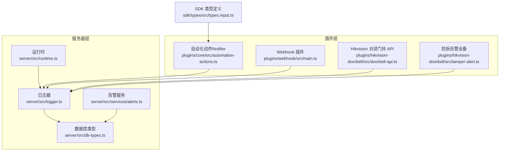
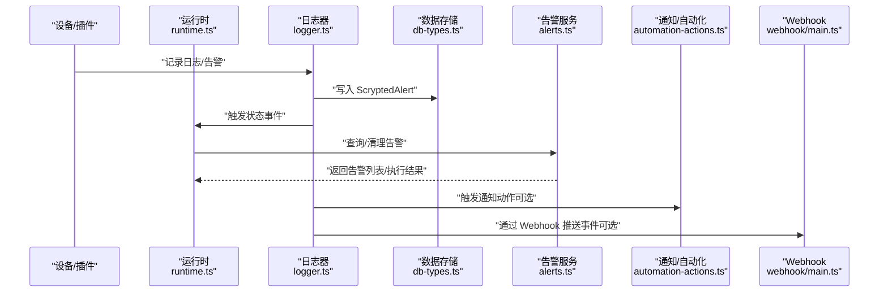
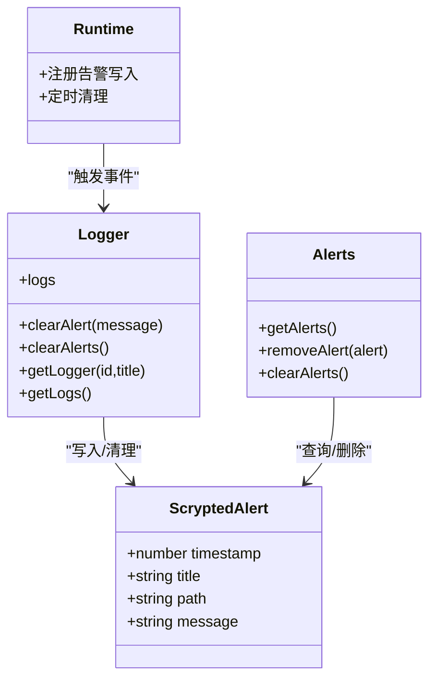
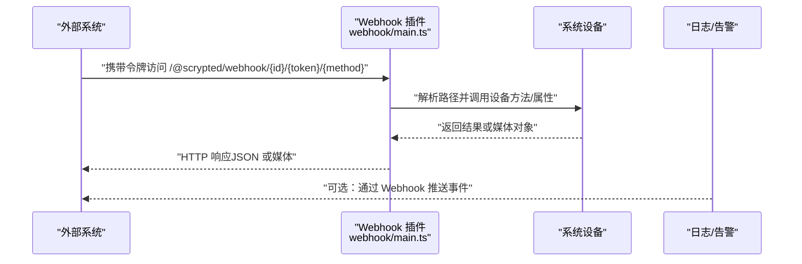
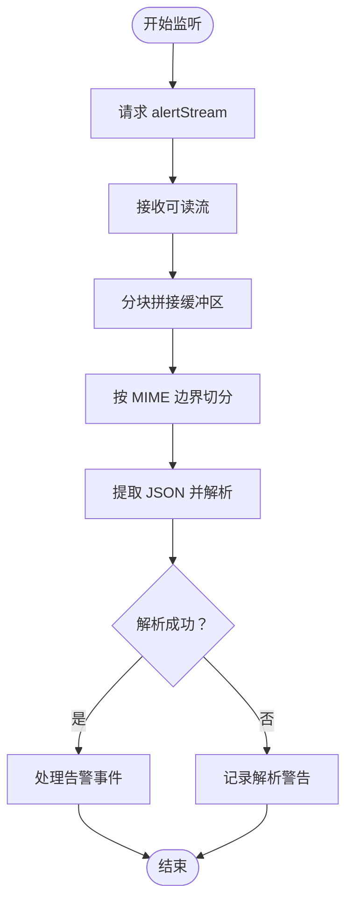
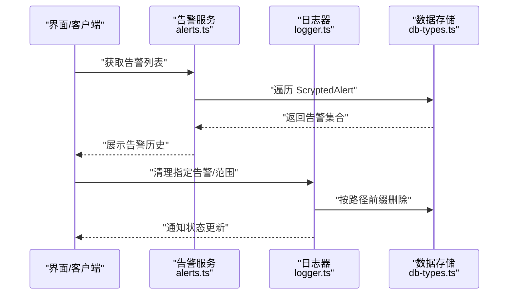
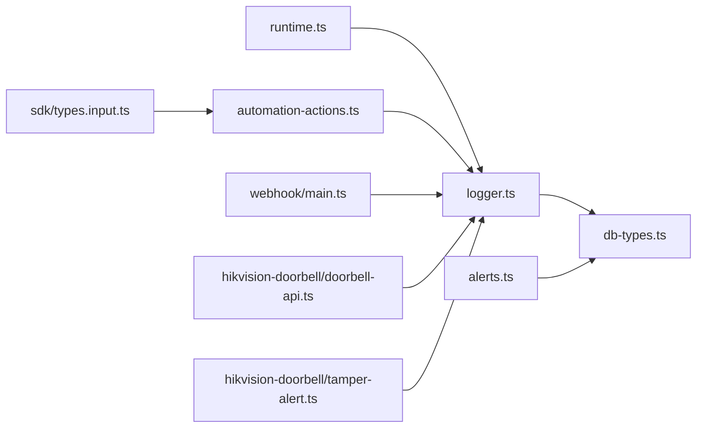

# 告警配置

<cite>
**本文引用的文件**
- [server/src/services/alerts.ts](file://server/src/services/alerts.ts)
- [server/src/logger.ts](file://server/src/logger.ts)
- [server/src/db-types.ts](file://server/src/db-types.ts)
- [server/src/runtime.ts](file://server/src/runtime.ts)
- [plugins/webhook/src/main.ts](file://plugins/webhook/src/main.ts)
- [plugins/core/src/automation-actions.ts](file://plugins/core/src/automation-actions.ts)
- [plugins/hikvision-doorbell/src/doorbell-api.ts](file://plugins/hikvision-doorbell/src/doorbell-api.ts)
- [plugins/hikvision-doorbell/src/tamper-alert.ts](file://plugins/hikvision-doorbell/src/tamper-alert.ts)
- [sdk/types/src/types.input.ts](file://sdk/types/src/types.input.ts)
</cite>

## 目录
1. [简介](#简介)
2. [项目结构](#项目结构)
3. [核心组件](#核心组件)
4. [架构总览](#架构总览)
5. [详细组件分析](#详细组件分析)
6. [依赖关系分析](#依赖关系分析)
7. [性能考量](#性能考量)
8. [故障排查指南](#故障排查指南)
9. [结论](#结论)
10. [附录](#附录)

## 简介
本指南面向 Scrypted 的告警系统配置与管理，聚焦以下主题：
- 告警类型与优先级：系统告警、设备告警、性能告警、安全告警的分类与优先级设定建议
- 规则配置：触发条件、阈值、去重与抑制机制的配置思路
- 通知渠道：邮件、短信、Webhook、即时通讯等通知方式的接入与配置
- 历史管理：告警记录存储、历史查询、关闭确认与重复告警处理
- 模板定制：消息格式、变量替换、多语言支持
- 分级处理：紧急、一般、信息类告警的处理流程与响应时间
- 系统集成：外部监控系统对接、告警聚合与统一告警中心
- 优化策略：降噪、准确性与响应效率提升

Scrypted 的告警能力由日志子系统与数据存储共同支撑，同时通过自动化动作与 Webhook 扩展实现通知与集成。

## 项目结构
围绕告警系统的关键文件分布如下：
- 日志与告警持久化：server/src/logger.ts、server/src/db-types.ts
- 告警服务接口：server/src/services/alerts.ts
- 运行时注册与清理：server/src/runtime.ts
- 通知与自动化：plugins/core/src/automation-actions.ts
- Webhook 通道：plugins/webhook/src/main.ts
- 设备事件与告警流：plugins/hikvision-doorbell/src/doorbell-api.ts、plugins/hikvision-doorbell/src/tamper-alert.ts
- 通知选项类型：sdk/types/src/types.input.ts



图表来源
- [server/src/runtime.ts:167-197](file://server/src/runtime.ts#L167-L197)
- [server/src/logger.ts:19-92](file://server/src/logger.ts#L19-L92)
- [server/src/db-types.ts:26-31](file://server/src/db-types.ts#L26-L31)
- [server/src/services/alerts.ts:4-23](file://server/src/services/alerts.ts#L4-L23)
- [plugins/webhook/src/main.ts:95-253](file://plugins/webhook/src/main.ts#L95-L253)
- [plugins/core/src/automation-actions.ts:70-104](file://plugins/core/src/automation-actions.ts#L70-L104)
- [plugins/hikvision-doorbell/src/doorbell-api.ts:1092-1161](file://plugins/hikvision-doorbell/src/doorbell-api.ts#L1092-L1161)
- [plugins/hikvision-doorbell/src/tamper-alert.ts:7-39](file://plugins/hikvision-doorbell/src/tamper-alert.ts#L7-L39)
- [sdk/types/src/types.input.ts:253-285](file://sdk/types/src/types.input.ts#L253-L285)

章节来源
- [server/src/services/alerts.ts:4-23](file://server/src/services/alerts.ts#L4-L23)
- [server/src/logger.ts:19-92](file://server/src/logger.ts#L19-L92)
- [server/src/db-types.ts:26-31](file://server/src/db-types.ts#L26-L31)
- [server/src/runtime.ts:167-197](file://server/src/runtime.ts#L167-L197)
- [plugins/webhook/src/main.ts:95-253](file://plugins/webhook/src/main.ts#L95-L253)
- [plugins/core/src/automation-actions.ts:70-104](file://plugins/core/src/automation-actions.ts#L70-L104)
- [plugins/hikvision-doorbell/src/doorbell-api.ts:1092-1161](file://plugins/hikvision-doorbell/src/doorbell-api.ts#L1092-L1161)
- [plugins/hikvision-doorbell/src/tamper-alert.ts:7-39](file://plugins/hikvision-doorbell/src/tamper-alert.ts#L7-L39)
- [sdk/types/src/types.input.ts:253-285](file://sdk/types/src/types.input.ts#L253-L285)

## 核心组件
- 告警数据模型：ScryptedAlert，包含时间戳、标题、路径与消息体，用于持久化告警记录。
- 日志器 Logger：负责生成日志条目并可清除特定或范围内的告警；提供告警 ID 计算以支持去重。
- 告警服务 Alerts：提供获取、移除与清空告警的能力，配合状态通知刷新界面。
- 运行时注册：在运行时中注册告警写入与定时清理逻辑，确保历史告警不会无限增长。
- 通知与自动化：通过 Notifier 动作发送通知，支持标题、正文、媒体与平台特定选项。
- Webhook 通道：提供设备事件的 Webhook 能力，便于外部系统接收告警事件。
- 设备事件与告警流：Hikvision 对讲门铃支持监听 ISAPI 告警流，解析并处理事件。

章节来源
- [server/src/db-types.ts:26-31](file://server/src/db-types.ts#L26-L31)
- [server/src/logger.ts:7-9](file://server/src/logger.ts#L7-L9)
- [server/src/logger.ts:64-75](file://server/src/logger.ts#L64-L75)
- [server/src/services/alerts.ts:8-22](file://server/src/services/alerts.ts#L8-L22)
- [server/src/runtime.ts:167-175](file://server/src/runtime.ts#L167-L175)
- [plugins/core/src/automation-actions.ts:70-104](file://plugins/core/src/automation-actions.ts#L70-L104)
- [plugins/webhook/src/main.ts:95-253](file://plugins/webhook/src/main.ts#L95-L253)
- [plugins/hikvision-doorbell/src/doorbell-api.ts:1092-1161](file://plugins/hikvision-doorbell/src/doorbell-api.ts#L1092-L1161)

## 架构总览
下图展示告警从产生到持久化、查询与通知的整体流程。



图表来源
- [server/src/runtime.ts:167-175](file://server/src/runtime.ts#L167-L175)
- [server/src/logger.ts:33-46](file://server/src/logger.ts#L33-L46)
- [server/src/db-types.ts:26-31](file://server/src/db-types.ts#L26-L31)
- [server/src/services/alerts.ts:8-22](file://server/src/services/alerts.ts#L8-L22)
- [plugins/core/src/automation-actions.ts:70-104](file://plugins/core/src/automation-actions.ts#L70-L104)
- [plugins/webhook/src/main.ts:175-208](file://plugins/webhook/src/main.ts#L175-L208)

## 详细组件分析

### 组件一：告警数据模型与持久化
- 数据模型：ScryptedAlert 包含时间戳、标题、路径与消息体，作为告警记录的最小单元。
- 写入时机：运行时在日志写入时同步 upsert 告警记录，并发出状态事件以刷新界面。
- 清理策略：按时间窗口定期清理旧日志与告警，避免无限增长。



图表来源
- [server/src/db-types.ts:26-31](file://server/src/db-types.ts#L26-L31)
- [server/src/logger.ts:64-75](file://server/src/logger.ts#L64-L75)
- [server/src/services/alerts.ts:8-22](file://server/src/services/alerts.ts#L8-L22)
- [server/src/runtime.ts:167-175](file://server/src/runtime.ts#L167-L175)

章节来源
- [server/src/db-types.ts:26-31](file://server/src/db-types.ts#L26-L31)
- [server/src/logger.ts:64-75](file://server/src/logger.ts#L64-L75)
- [server/src/services/alerts.ts:8-22](file://server/src/services/alerts.ts#L8-L22)
- [server/src/runtime.ts:167-175](file://server/src/runtime.ts#L167-L175)

### 组件二：通知与自动化动作（Notifier）
- 动作定义：通过 addAction 注册 Notifier 动作，支持标题、正文、媒体（图片/视频流）与平台特定选项。
- 选项类型：NotifierOptions 定义了通知的副标题、徽章、行为、标签、时间戳、震动模式、录音事件等字段，便于跨平台适配。
- 使用场景：在自动化中调用 Notifier 发送通知，实现邮件、短信、推送与即时通讯集成的基础能力。

```mermaid
sequenceDiagram
participant AU as "自动化动作<br/>automation-actions.ts"
participant DEV as "目标设备Notifier"
participant OPT as "通知选项<br/>NotifierOptions"
AU->>OPT : "构造通知参数标题/正文/媒体/平台选项"
AU->>DEV : "sendNotification(title, options, media)"
DEV-->>AU : "返回发送结果"
```

图表来源
- [plugins/core/src/automation-actions.ts:70-104](file://plugins/core/src/automation-actions.ts#L70-L104)
- [sdk/types/src/types.input.ts:253-285](file://sdk/types/src/types.input.ts#L253-L285)

章节来源
- [plugins/core/src/automation-actions.ts:70-104](file://plugins/core/src/automation-actions.ts#L70-L104)
- [sdk/types/src/types.input.ts:253-285](file://sdk/types/src/types.input.ts#L253-L285)

### 组件三：Webhook 通知通道
- 能力概述：Webhook 插件为设备提供基于令牌的 HTTP 入口，支持 GET/POST 方法与属性查询，便于外部系统接收告警事件。
- 配置要点：启用 mixin 后可在控制台查看本地与不安全本地的 Webhook 基础 URL，以及可用的状态与方法清单。
- 使用建议：结合自动化动作触发 Webhook 请求，或在外部系统中订阅 Webhook 端点进行告警推送。



图表来源
- [plugins/webhook/src/main.ts:95-253](file://plugins/webhook/src/main.ts#L95-L253)
- [plugins/webhook/src/main.ts:175-208](file://plugins/webhook/src/main.ts#L175-L208)

章节来源
- [plugins/webhook/src/main.ts:95-253](file://plugins/webhook/src/main.ts#L95-L253)
- [plugins/webhook/src/main.ts:175-208](file://plugins/webhook/src/main.ts#L175-L208)

### 组件四：设备事件与告警流（Hikvision 对讲门铃）
- 告警流监听：通过 ISAPI Event notification alertStream 接收设备告警，解析 multipart JSON 并处理事件。
- 防拆告警设备：提供 OnOff 与 Readme 接口，支持开启/关闭防拆告警功能，并展示说明文档。
- 应用建议：将设备告警映射到系统日志与告警，再通过自动化与 Webhook 实现通知与上报。



图表来源
- [plugins/hikvision-doorbell/src/doorbell-api.ts:1092-1161](file://plugins/hikvision-doorbell/src/doorbell-api.ts#L1092-L1161)

章节来源
- [plugins/hikvision-doorbell/src/doorbell-api.ts:1092-1161](file://plugins/hikvision-doorbell/src/doorbell-api.ts#L1092-L1161)
- [plugins/hikvision-doorbell/src/tamper-alert.ts:7-39](file://plugins/hikvision-doorbell/src/tamper-alert.ts#L7-L39)

### 组件五：告警历史管理与查询
- 查询：通过 Alerts.getAlerts 获取所有告警；通过 Logger.clearAlerts 清理指定路径前缀的告警。
- 删除与清空：支持按单个告警删除与批量清空；删除后会通知状态变更以刷新界面。
- 清理策略：运行时定时清理旧日志与告警，避免存储膨胀。



图表来源
- [server/src/services/alerts.ts:8-22](file://server/src/services/alerts.ts#L8-L22)
- [server/src/logger.ts:64-75](file://server/src/logger.ts#L64-L75)
- [server/src/runtime.ts:173-175](file://server/src/runtime.ts#L173-L175)

章节来源
- [server/src/services/alerts.ts:8-22](file://server/src/services/alerts.ts#L8-L22)
- [server/src/logger.ts:64-75](file://server/src/logger.ts#L64-L75)
- [server/src/runtime.ts:173-175](file://server/src/runtime.ts#L173-L175)

## 依赖关系分析
- 日志器依赖数据库类型定义以写入告警；告警服务依赖数据存储进行查询与删除；运行时在日志写入时触发告警 upsert 与状态事件。
- 自动化动作与 Webhook 插件通过系统设备接口与通知选项类型实现跨平台通知能力。
- 设备事件（如 Hikvision 告警流）经由日志器进入告警体系，再由自动化与 Webhook 推送至外部系统。



图表来源
- [server/src/logger.ts:33-46](file://server/src/logger.ts#L33-L46)
- [server/src/db-types.ts:26-31](file://server/src/db-types.ts#L26-L31)
- [server/src/services/alerts.ts:8-22](file://server/src/services/alerts.ts#L8-L22)
- [server/src/runtime.ts:167-175](file://server/src/runtime.ts#L167-L175)
- [plugins/core/src/automation-actions.ts:70-104](file://plugins/core/src/automation-actions.ts#L70-L104)
- [plugins/webhook/src/main.ts:95-253](file://plugins/webhook/src/main.ts#L95-L253)
- [plugins/hikvision-doorbell/src/doorbell-api.ts:1092-1161](file://plugins/hikvision-doorbell/src/doorbell-api.ts#L1092-L1161)
- [plugins/hikvision-doorbell/src/tamper-alert.ts:7-39](file://plugins/hikvision-doorbell/src/tamper-alert.ts#L7-L39)
- [sdk/types/src/types.input.ts:253-285](file://sdk/types/src/types.input.ts#L253-L285)

章节来源
- [server/src/logger.ts:33-46](file://server/src/logger.ts#L33-L46)
- [server/src/db-types.ts:26-31](file://server/src/db-types.ts#L26-L31)
- [server/src/services/alerts.ts:8-22](file://server/src/services/alerts.ts#L8-L22)
- [server/src/runtime.ts:167-175](file://server/src/runtime.ts#L167-L175)
- [plugins/core/src/automation-actions.ts:70-104](file://plugins/core/src/automation-actions.ts#L70-L104)
- [plugins/webhook/src/main.ts:95-253](file://plugins/webhook/src/main.ts#L95-L253)
- [plugins/hikvision-doorbell/src/doorbell-api.ts:1092-1161](file://plugins/hikvision-doorbell/src/doorbell-api.ts#L1092-L1161)
- [plugins/hikvision-doorbell/src/tamper-alert.ts:7-39](file://plugins/hikvision-doorbell/src/tamper-alert.ts#L7-L39)
- [sdk/types/src/types.input.ts:253-285](file://sdk/types/src/types.input.ts#L253-L285)

## 性能考量
- 存储与清理：运行时定时清理旧日志与告警，建议根据环境规模调整清理周期与保留时长，避免频繁 IO。
- 告警风暴防护：通过去重（基于路径+消息计算 ID）与抑制（在自动化中设置冷却期）降低重复告警对系统与用户的影响。
- 通知吞吐：Webhook 与通知动作应考虑并发与超时，必要时引入队列或限流策略，防止外部系统过载。

## 故障排查指南
- 告警未显示：检查运行时是否正确 upsert 告警并触发状态事件；确认告警服务是否能查询到记录。
- 无法清除告警：确认使用正确的路径前缀匹配；验证告警 ID 计算逻辑是否一致。
- Webhook 无响应：核对令牌、路径段与设备 mixin 是否启用；检查外部系统端点可达性与超时设置。
- 设备告警流异常：关注 alertStream 的错误与关闭事件回调，检查网络连通性与设备端 ISAPI 配置。

章节来源
- [server/src/runtime.ts:167-175](file://server/src/runtime.ts#L167-L175)
- [server/src/logger.ts:64-75](file://server/src/logger.ts#L64-L75)
- [plugins/webhook/src/main.ts:175-208](file://plugins/webhook/src/main.ts#L175-L208)
- [plugins/hikvision-doorbell/src/doorbell-api.ts:1141-1155](file://plugins/hikvision-doorbell/src/doorbell-api.ts#L1141-L1155)

## 结论
Scrypted 的告警体系以日志器为核心，结合数据模型与运行时清理机制，形成完整的告警生命周期管理。通过自动化动作与 Webhook，系统可灵活对接邮件、短信、推送与即时通讯等通知渠道，并支持设备事件的实时告警流接入。建议在生产环境中合理配置去重、抑制与清理策略，以平衡告警的及时性与系统稳定性。

## 附录
- 告警类型与优先级建议
  - 系统告警：影响核心服务可用性的事件（如认证失败、证书问题），建议高优先级并立即通知。
  - 设备告警：设备离线、连接异常、传感器异常，建议按设备重要性分级。
  - 性能告警：CPU/内存/磁盘/网络使用率阈值告警，建议设置分级阈值与冷却期。
  - 安全告警：登录尝试、权限变更、设备篡改（如防拆告警），建议最高优先级并触发抑制。
- 规则配置要点
  - 触发条件：基于日志级别、路径前缀、关键词匹配或设备事件。
  - 阈值设置：使用滑动窗口统计与持续时间判定，避免瞬时波动误报。
  - 去重规则：基于路径+消息体计算唯一 ID，相同 ID 在冷却期内抑制重复。
  - 抑制机制：同一设备/区域在短时间内仅允许一次告警，或合并同类事件。
- 通知模板与多语言
  - 模板变量：时间戳、设备名、事件类型、严重等级、路径等。
  - 多语言：通过 NotifierOptions 的语言字段与本地化资源实现。
- 分级处理流程
  - 紧急：自动通知+静默抑制+工单创建，响应时间≤5 分钟。
  - 一般：通知+记录，响应时间≤30 分钟。
  - 信息：记录存档，无需通知。
- 外部系统集成
  - 统一告警中心：通过 Webhook 将 Scrypted 告警推送到第三方平台，实现集中展示与处置。
  - 告警聚合：在外部系统中按设备、区域、类型聚合，设置合并规则与抑制策略。
- 优化策略
  - 降噪：引入更细粒度的去重与抑制，减少重复与无效告警。
  - 准确性：结合上下文与历史趋势，提高阈值与触发条件的准确性。
  - 响应效率：自动化动作链路优化、异步处理与重试机制，缩短响应时间。