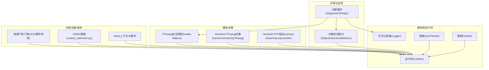
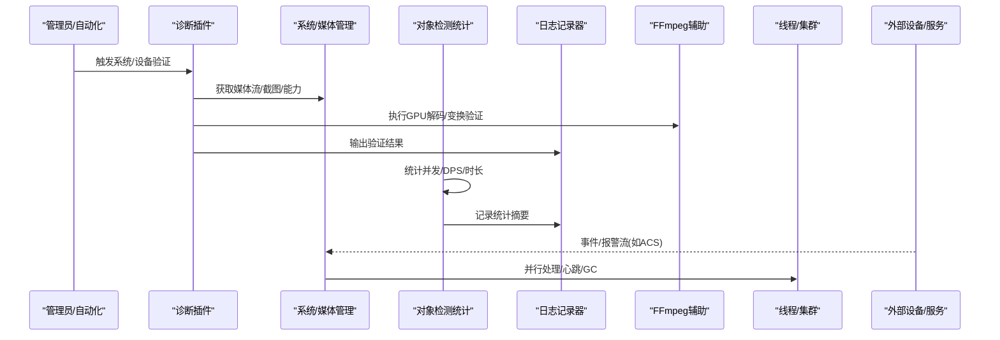
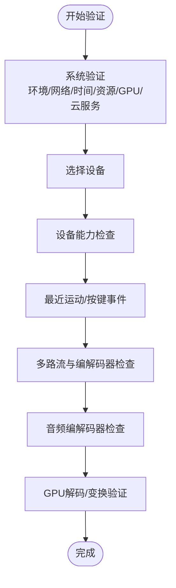
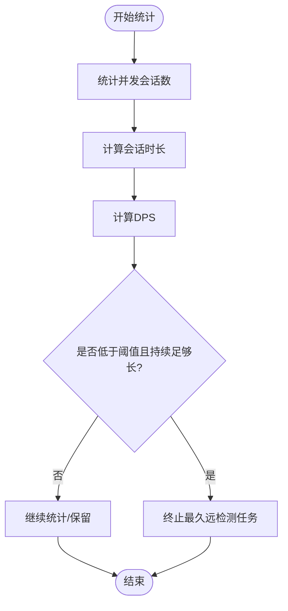
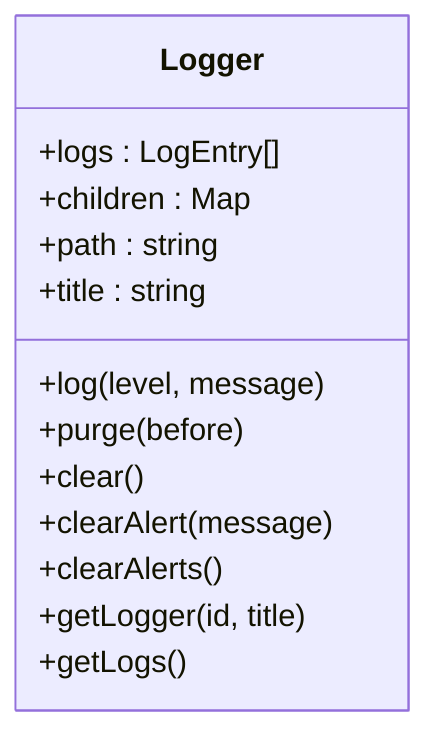
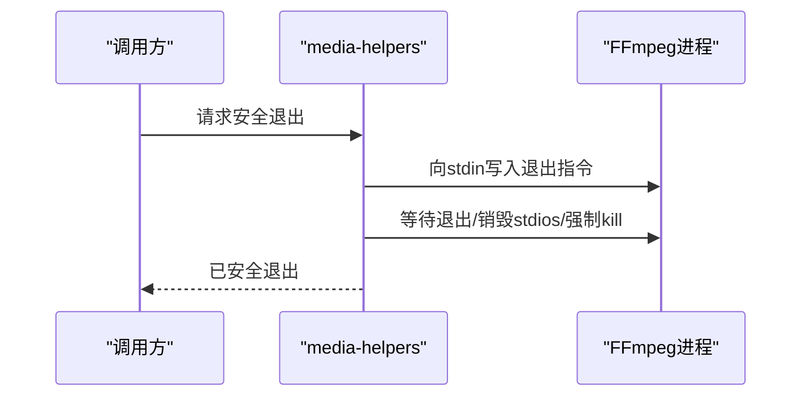
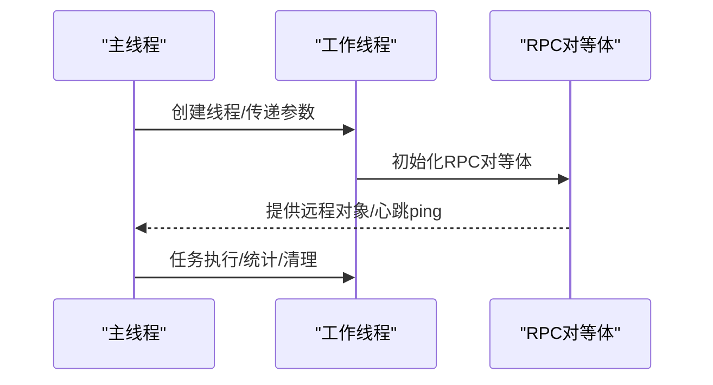
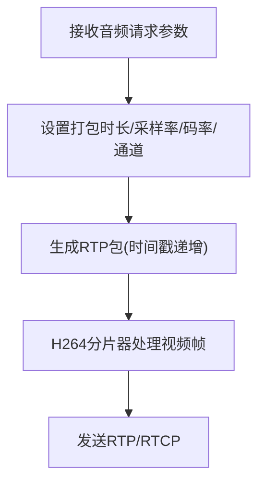
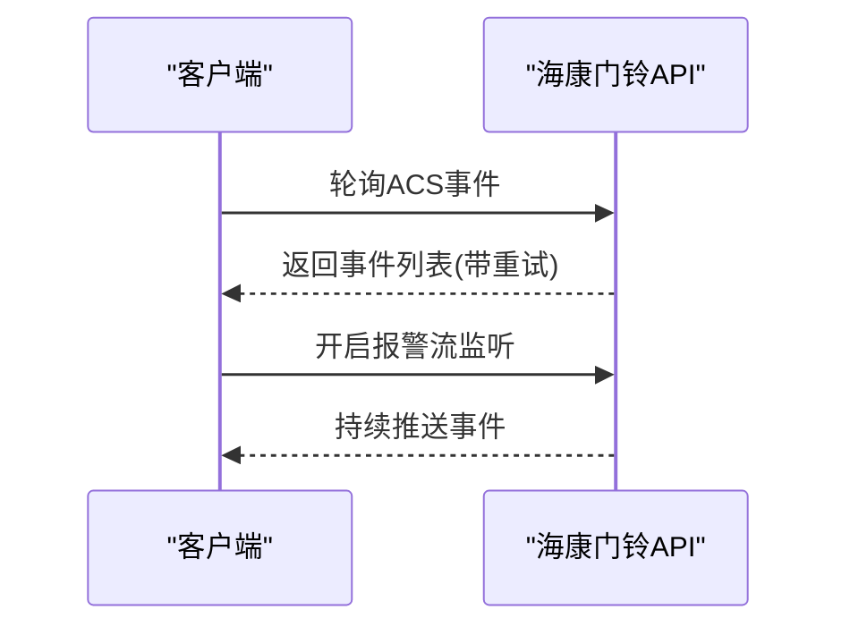
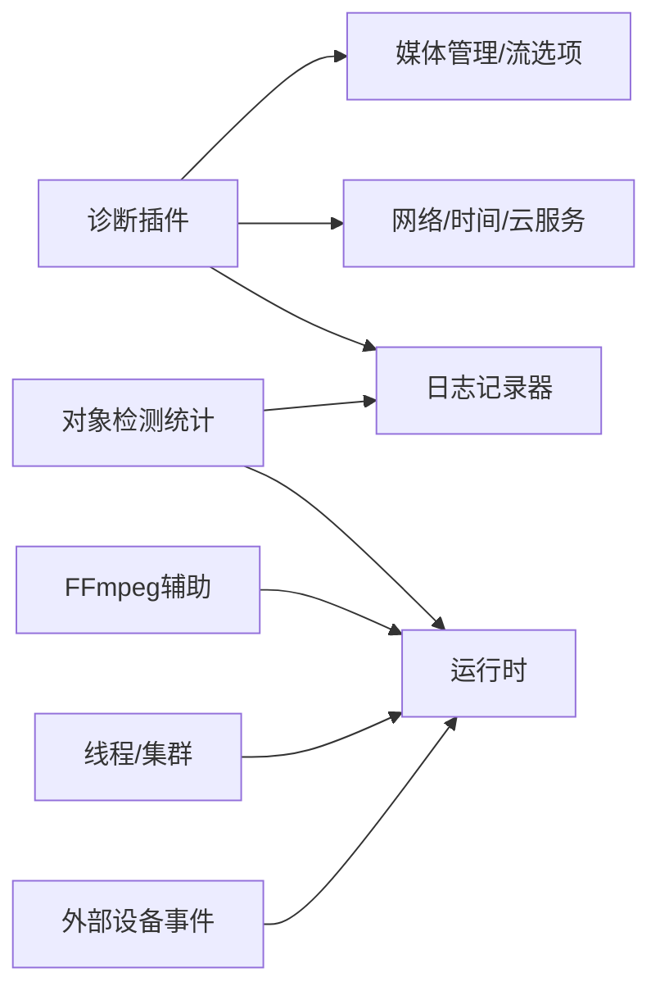

# 性能监控

<cite>
**本文引用的文件**
- [plugins/diagnostics/src/main.ts](file://plugins/diagnostics/src/main.ts)
- [plugins/objectdetector/src/main.ts](file://plugins/objectdetector/src/main.ts)
- [server/src/logger.ts](file://server/src/logger.ts)
- [server/src/media-helpers.ts](file://server/src/media-helpers.ts)
- [server/src/threading.ts](file://server/src/threading.ts)
- [server/src/cluster/cluster-setup.ts](file://server/src/cluster/cluster-setup.ts)
- [server/src/scrypted-cluster-main.ts](file://server/src/scrypted-cluster-main.ts)
- [server/python/plugin_remote.py](file://server/python/plugin_remote.py)
- [plugins/homekit/src/types/camera/camera-streaming-ffmpeg.ts](file://plugins/homekit/src/types/camera/camera-streaming-ffmpeg.ts)
- [plugins/homekit/src/types/camera/camera-streaming-srtp-sender.ts](file://plugins/homekit/src/types/camera/camera-streaming-srtp-sender.ts)
- [plugins/hikvision-doorbell/src/doorbell-api.ts](file://plugins/hikvision-doorbell/src/doorbell-api.ts)
- [plugins/onnx/src/ort/custom_detection.py](file://plugins/onnx/src/ort/custom_detection.py)
- [plugins/alexa/src/alexa.ts](file://plugins/alexa/src/alexa.ts)
- [server/test/threading-test.ts](file://server/test/threading-test.ts)
</cite>

## 目录
1. [简介](#简介)
2. [项目结构](#项目结构)
3. [核心组件](#核心组件)
4. [架构总览](#架构总览)
5. [详细组件分析](#详细组件分析)
6. [依赖关系分析](#依赖关系分析)
7. [性能考量](#性能考量)
8. [故障排查指南](#故障排查指南)
9. [结论](#结论)
10. [附录](#附录)

## 简介
本指南面向 Scrypted 的性能监控与优化，围绕媒体流性能（视频编码延迟、音频同步、带宽使用、丢帧率）、设备性能指标（响应时间、命令执行耗时、状态更新延迟）、系统性能基准（吞吐量、并发、资源利用率）、诊断工具（性能分析器、内存泄漏检测、阻塞检测）、性能数据采集（采样频率、统计计算、趋势分析）、性能告警（阈值、异常检测、自动告警）以及优化建议与最佳实践展开。文档以仓库中现有实现为依据，结合可扩展点给出可操作的配置与分析方法。

## 项目结构
Scrypted 的性能相关能力分布在服务端运行时、插件诊断与对象检测、媒体处理辅助工具、集群与线程模型等模块中。下图展示与性能监控直接相关的子系统与交互关系。

**图表来源**
- [server/src/logger.ts:19-92](file://server/src/logger.ts#L19-L92)
- [server/src/threading.ts:8-27](file://server/src/threading.ts#L8-L27)
- [server/src/cluster/cluster-setup.ts:171-267](file://server/src/cluster/cluster-setup.ts#L171-L267)
- [plugins/diagnostics/src/main.ts:103-175](file://plugins/diagnostics/src/main.ts#L103-L175)
- [plugins/objectdetector/src/main.ts:1154-1218](file://plugins/objectdetector/src/main.ts#L1154-L1218)
- [server/src/media-helpers.ts:11-38](file://server/src/media-helpers.ts#L11-L38)
- [plugins/homekit/src/types/camera/camera-streaming-ffmpeg.ts:138-167](file://plugins/homekit/src/types/camera/camera-streaming-ffmpeg.ts#L138-L167)
- [plugins/homekit/src/types/camera/camera-streaming-srtp-sender.ts:138-179](file://plugins/homekit/src/types/camera/camera-streaming-srtp-sender.ts#L138-L179)
- [plugins/hikvision-doorbell/src/doorbell-api.ts:909-1116](file://plugins/hikvision-doorbell/src/doorbell-api.ts#L909-L1116)
- [plugins/onnx/src/ort/custom_detection.py:45-72](file://plugins/onnx/src/ort/custom_detection.py#L45-L72)
- [plugins/alexa/src/alexa.ts:101-165](file://plugins/alexa/src/alexa.ts#L101-L165)

**章节来源**
- [plugins/diagnostics/src/main.ts:103-175](file://plugins/diagnostics/src/main.ts#L103-L175)
- [plugins/objectdetector/src/main.ts:1154-1218](file://plugins/objectdetector/src/main.ts#L1154-L1218)
- [server/src/logger.ts:19-92](file://server/src/logger.ts#L19-L92)
- [server/src/media-helpers.ts:11-38](file://server/src/media-helpers.ts#L11-L38)
- [server/src/threading.ts:8-27](file://server/src/threading.ts#L8-L27)
- [server/src/cluster/cluster-setup.ts:171-267](file://server/src/cluster/cluster-setup.ts#L171-L267)
- [plugins/homekit/src/types/camera/camera-streaming-ffmpeg.ts:138-167](file://plugins/homekit/src/types/camera/camera-streaming-ffmpeg.ts#L138-L167)
- [plugins/homekit/src/types/camera/camera-streaming-srtp-sender.ts:138-179](file://plugins/homekit/src/types/camera/camera-streaming-srtp-sender.ts#L138-L179)
- [plugins/hikvision-doorbell/src/doorbell-api.ts:909-1116](file://plugins/hikvision-doorbell/src/doorbell-api.ts#L909-L1116)
- [plugins/onnx/src/ort/custom_detection.py:45-72](file://plugins/onnx/src/ort/custom_detection.py#L45-L72)
- [plugins/alexa/src/alexa.ts:101-165](file://plugins/alexa/src/alexa.ts#L101-L165)

## 核心组件
- 诊断插件：提供系统与设备验证、媒体流质量检查、GPU解码/变换验证、外部资源可达性等，覆盖网络、时间、资源、模型执行设备等关键性能维度。
- 对象检测统计：在对象检测插件中维护并发会话数、检测每秒（DPS）等统计，并在容量阈值下进行降载或终止策略。
- 日志记录器：统一的日志入口，支持告警清理、路径化日志聚合，便于性能问题定位与趋势分析。
- 媒体处理辅助：提供 FFmpeg 安全退出、初始输出过滤、参数打印（含敏感信息脱敏）等，降低媒体链路的资源浪费与噪声干扰。
- 线程与集群：通过 worker_threads 与 IPC 连接，实现多线程与跨进程的并发处理；插件侧具备周期性 GC 与心跳 ping 能力，有助于稳定性与性能观测。
- 媒体流参数：HomeKit 流媒体对音频打包时长、RTP 时间戳与 H264 分片有严格要求，直接影响音频同步与编码延迟。

**章节来源**
- [plugins/diagnostics/src/main.ts:103-175](file://plugins/diagnostics/src/main.ts#L103-L175)
- [plugins/objectdetector/src/main.ts:1154-1218](file://plugins/objectdetector/src/main.ts#L1154-L1218)
- [server/src/logger.ts:19-92](file://server/src/logger.ts#L19-L92)
- [server/src/media-helpers.ts:11-38](file://server/src/media-helpers.ts#L11-L38)
- [server/src/threading.ts:8-27](file://server/src/threading.ts#L8-L27)
- [server/src/cluster/cluster-setup.ts:171-267](file://server/src/cluster/cluster-setup.ts#L171-L267)
- [server/python/plugin_remote.py:1151-1189](file://server/python/plugin_remote.py#L1151-L1189)
- [plugins/homekit/src/types/camera/camera-streaming-ffmpeg.ts:138-167](file://plugins/homekit/src/types/camera/camera-streaming-ffmpeg.ts#L138-L167)
- [plugins/homekit/src/types/camera/camera-streaming-srtp-sender.ts:138-179](file://plugins/homekit/src/types/camera/camera-streaming-srtp-sender.ts#L138-L179)

## 架构总览
下图展示从诊断到媒体处理、再到集群与线程的性能相关路径，以及外部设备/服务的事件输入。

**图表来源**
- [plugins/diagnostics/src/main.ts:103-175](file://plugins/diagnostics/src/main.ts#L103-L175)
- [plugins/objectdetector/src/main.ts:1154-1218](file://plugins/objectdetector/src/main.ts#L1154-L1218)
- [server/src/logger.ts:33-46](file://server/src/logger.ts#L33-L46)
- [server/src/media-helpers.ts:11-38](file://server/src/media-helpers.ts#L11-L38)
- [server/src/threading.ts:8-27](file://server/src/threading.ts#L8-L27)
- [server/src/cluster/cluster-setup.ts:171-267](file://server/src/cluster/cluster-setup.ts#L171-L267)
- [plugins/hikvision-doorbell/src/doorbell-api.ts:1092-1116](file://plugins/hikvision-doorbell/src/doorbell-api.ts#L1092-L1116)

## 详细组件分析

### 诊断插件：系统与设备性能验证
- 系统验证：安装环境、主机 OS、公网/内网地址、系统时间偏差、云服务连通性、CPU/内存、GPU 设备透传、外部资源访问与 DNS、NVR/GPU 解码/变换、弃用插件检测等。
- 设备验证：能力检查、最近运动/按键事件、快照与多路流验证、编解码器一致性、音频编解码器推荐、IDR 间隔检查等。
- 关键性能观测点：
  - 网络连通性与时间同步影响远程访问与事件时序。
  - GPU 透传与解码/变换验证决定硬件加速可用性与吞吐。
  - 多路流与编解码器一致性影响客户端体验与服务器负载。
  - 音频编解码器与打包时长影响 HomeKit 等严格设备的音频质量。

**图表来源**
- [plugins/diagnostics/src/main.ts:103-175](file://plugins/diagnostics/src/main.ts#L103-L175)
- [plugins/diagnostics/src/main.ts:177-384](file://plugins/diagnostics/src/main.ts#L177-L384)
- [plugins/diagnostics/src/main.ts:386-771](file://plugins/diagnostics/src/main.ts#L386-L771)

**章节来源**
- [plugins/diagnostics/src/main.ts:103-175](file://plugins/diagnostics/src/main.ts#L103-L175)
- [plugins/diagnostics/src/main.ts:177-384](file://plugins/diagnostics/src/main.ts#L177-L384)
- [plugins/diagnostics/src/main.ts:386-771](file://plugins/diagnostics/src/main.ts#L386-L771)

### 对象检测统计：并发与降载策略
- 统计维度：并发摄像头数、样本时间、检测每秒（DPS）。
- 降载逻辑：当“低水位”摄像头数量超过阈值且持续时间足够时，终止最久远的检测任务以保障新活动处理。
- 适用场景：高并发对象检测场景下的系统容量保护与公平调度。

**图表来源**
- [plugins/objectdetector/src/main.ts:1154-1218](file://plugins/objectdetector/src/main.ts#L1154-L1218)

**章节来源**
- [plugins/objectdetector/src/main.ts:1154-1218](file://plugins/objectdetector/src/main.ts#L1154-L1218)

### 日志记录器：性能数据采集与告警
- 日志结构：包含标题、时间戳、级别、消息、路径，支持按路径聚合与清理。
- 告警清理：基于路径生成唯一 ID，支持按消息清除特定告警。
- 应用：用于性能趋势分析、异常告警、问题复盘。

**图表来源**
- [server/src/logger.ts:19-92](file://server/src/logger.ts#L19-L92)

**章节来源**
- [server/src/logger.ts:19-92](file://server/src/logger.ts#L19-L92)

### 媒体处理辅助：FFmpeg 安全与噪声控制
- 安全退出：向 stdin 写入退出指令，等待退出后销毁 stdio 并强制 SIGKILL，避免资源泄露。
- 初始输出过滤：仅打印关键帧/尺寸等必要信息，减少噪声干扰。
- 参数打印：对 URL 中的敏感信息进行脱敏显示，便于调试。

**图表来源**
- [server/src/media-helpers.ts:11-38](file://server/src/media-helpers.ts#L11-L38)

**章节来源**
- [server/src/media-helpers.ts:11-38](file://server/src/media-helpers.ts#L11-L38)

### 线程与集群：并发与稳定性
- 线程模型：newThread 支持参数化与模块注入，适合将重任务迁移至 worker_threads。
- 集群连接：主/子线程间通过 MessagePort 注册与连接，支持 RPC 对象跨线程代理。
- 插件侧：Python 插件进程具备周期性 GC 与 ping 心跳，有助于稳定性和性能观测。

**图表来源**
- [server/src/threading.ts:8-27](file://server/src/threading.ts#L8-L27)
- [server/src/cluster/cluster-setup.ts:171-267](file://server/src/cluster/cluster-setup.ts#L171-L267)
- [server/src/scrypted-cluster-main.ts:159-193](file://server/src/scrypted-cluster-main.ts#L159-L193)
- [server/python/plugin_remote.py:1151-1189](file://server/python/plugin_remote.py#L1151-L1189)

**章节来源**
- [server/src/threading.ts:8-27](file://server/src/threading.ts#L8-L27)
- [server/src/cluster/cluster-setup.ts:171-267](file://server/src/cluster/cluster-setup.ts#L171-L267)
- [server/src/scrypted-cluster-main.ts:159-193](file://server/src/scrypted-cluster-main.ts#L159-L193)
- [server/python/plugin_remote.py:1151-1189](file://server/python/plugin_remote.py#L1151-L1189)

### 媒体流参数：音频同步与时延控制
- HomeKit FFmpeg 参数：严格控制音频打包时长、采样率、码率、通道，确保 RTP 时间戳与打包时长一致，避免音频静音或断续。
- RTP 发送：根据请求的打包时长计算时间戳步进，配合 H264 分片器保证视频帧类型与时间戳一致性。

**图表来源**
- [plugins/homekit/src/types/camera/camera-streaming-ffmpeg.ts:138-167](file://plugins/homekit/src/types/camera/camera-streaming-ffmpeg.ts#L138-L167)
- [plugins/homekit/src/types/camera/camera-streaming-srtp-sender.ts:138-179](file://plugins/homekit/src/types/camera/camera-streaming-srtp-sender.ts#L138-L179)

**章节来源**
- [plugins/homekit/src/types/camera/camera-streaming-ffmpeg.ts:138-167](file://plugins/homekit/src/types/camera/camera-streaming-ffmpeg.ts#L138-L167)
- [plugins/homekit/src/types/camera/camera-streaming-srtp-sender.ts:138-179](file://plugins/homekit/src/types/camera/camera-streaming-srtp-sender.ts#L138-L179)

### 外部设备事件：轮询与流式事件
- 海康门铃：支持轮询门禁事件与持续监听报警流，轮询超时与重试机制避免阻塞。
- 适用场景：在弱网络或设备不支持长连接时，采用轮询兜底；在支持时切换为流式以降低开销。

**图表来源**
- [plugins/hikvision-doorbell/src/doorbell-api.ts:909-1116](file://plugins/hikvision-doorbell/src/doorbell-api.ts#L909-L1116)

**章节来源**
- [plugins/hikvision-doorbell/src/doorbell-api.ts:909-1116](file://plugins/hikvision-doorbell/src/doorbell-api.ts#L909-L1116)

### 推理执行：线程池与初始化
- ONNX 推理：为每个工作线程预编译模型实例，使用线程池执行推理，避免重复初始化带来的抖动。
- 适用场景：高并发推理任务的线程隔离与资源占用控制。

**章节来源**
- [plugins/onnx/src/ort/custom_detection.py:45-72](file://plugins/onnx/src/ort/custom_detection.py#L45-L72)

### 事件与上下文：性能相关字段
- Alexa 上下文与事件结构包含不确定性、时间戳、图像 URI 等，可用于评估检测/事件上报的端到端时延与可靠性。

**章节来源**
- [plugins/alexa/src/alexa.ts:101-165](file://plugins/alexa/src/alexa.ts#L101-L165)

## 依赖关系分析
- 诊断插件依赖系统/媒体管理接口与外部网络连通性，输出日志供后续分析。
- 对象检测统计依赖运行时统计与日志记录器，形成闭环的性能反馈。
- 媒体处理辅助贯穿媒体链路，保障 FFmpeg 生命周期可控。
- 线程与集群为高并发场景提供基础能力，插件侧的 GC 与 ping 保障稳定性。
- 外部设备事件作为输入源，其轮询/流式特性直接影响系统吞吐与延迟。

**图表来源**
- [plugins/diagnostics/src/main.ts:103-175](file://plugins/diagnostics/src/main.ts#L103-L175)
- [plugins/objectdetector/src/main.ts:1154-1218](file://plugins/objectdetector/src/main.ts#L1154-L1218)
- [server/src/logger.ts:19-92](file://server/src/logger.ts#L19-L92)
- [server/src/media-helpers.ts:11-38](file://server/src/media-helpers.ts#L11-L38)
- [server/src/threading.ts:8-27](file://server/src/threading.ts#L8-L27)
- [server/src/cluster/cluster-setup.ts:171-267](file://server/src/cluster/cluster-setup.ts#L171-L267)
- [plugins/hikvision-doorbell/src/doorbell-api.ts:909-1116](file://plugins/hikvision-doorbell/src/doorbell-api.ts#L909-L1116)

**章节来源**
- [plugins/diagnostics/src/main.ts:103-175](file://plugins/diagnostics/src/main.ts#L103-L175)
- [plugins/objectdetector/src/main.ts:1154-1218](file://plugins/objectdetector/src/main.ts#L1154-L1218)
- [server/src/logger.ts:19-92](file://server/src/logger.ts#L19-L92)
- [server/src/media-helpers.ts:11-38](file://server/src/media-helpers.ts#L11-L38)
- [server/src/threading.ts:8-27](file://server/src/threading.ts#L8-L27)
- [server/src/cluster/cluster-setup.ts:171-267](file://server/src/cluster/cluster-setup.ts#L171-L267)
- [plugins/hikvision-doorbell/src/doorbell-api.ts:909-1116](file://plugins/hikvision-doorbell/src/doorbell-api.ts#L909-L1116)

## 性能考量
- 媒体流性能
  - 编码延迟：通过 HomeKit 参数严格控制音频打包时长与 RTP 时间戳，避免额外缓冲；同时检查视频 IDR 间隔，避免与客户端缓存策略冲突。
  - 音频同步：确保打包时长与采样率匹配，避免客户端端到端抖动。
  - 带宽使用：合理设置音频/视频码率与分辨率，结合多路流策略平衡清晰度与带宽。
  - 丢帧率：关注 FFmpeg 初始输出过滤与安全退出，减少异常导致的丢帧与资源浪费。
- 设备性能指标
  - 响应时间：通过日志记录器的时间戳与路径聚合，统计设备接口调用耗时。
  - 命令执行耗时：在命令执行路径上埋点，结合日志与统计计算平均/分位耗时。
  - 状态更新延迟：利用事件监听与最近事件时间差，评估状态传播时延。
- 系统性能基准
  - 吞吐量测试：在诊断插件中执行多路流拉取与截图转换，评估媒体处理吞吐。
  - 并发处理能力：通过对象检测统计与线程/集群模型，评估并发摄像头与推理任务的承载能力。
  - 资源利用率：结合系统验证中的 CPU/内存/GPU 检测，评估硬件资源瓶颈。
- 诊断工具
  - 性能分析器：结合线程模型与日志聚合，定位热点函数与阻塞点。
  - 内存泄漏检测：利用插件侧周期性 GC 与日志记录器的告警清理，观察内存曲线。
  - 阻塞检测：通过 ping 心跳与超时策略，识别长时间无响应的任务。
- 数据采集
  - 采样频率：建议按秒级或分钟级采集关键指标（DPS、并发、CPU/内存），并记录异常峰值。
  - 统计计算：均值、P95/P99、最大/最小值、变化率。
  - 趋势分析：按天/周/月对比，识别容量增长与异常波动。
- 告警配置
  - 阈值设置：DPS 下降、并发超限、CPU/内存/磁盘使用率过高、日志错误激增。
  - 异常检测：基于历史基线的异常检测与自适应阈值。
  - 自动告警：结合日志记录器的告警清理与唯一 ID，实现精准告警与去重。

[本节为通用性能讨论，无需列出具体文件来源]

## 故障排查指南
- 媒体流问题
  - 使用媒体处理辅助的安全退出与噪声过滤，确认 FFmpeg 参数与日志输出。
  - 检查 HomeKit 音频打包时长与 RTP 时间戳生成逻辑，确保与请求一致。
- 设备事件问题
  - 若设备不支持长连接，启用轮询并调整超时与重试策略。
- 对象检测降载
  - 当系统接近容量上限时，优先终止最久远的检测任务，保障新活动及时处理。
- 日志与告警
  - 使用日志记录器聚合与清理功能，定位异常并建立告警基线。

**章节来源**
- [server/src/media-helpers.ts:11-38](file://server/src/media-helpers.ts#L11-L38)
- [plugins/homekit/src/types/camera/camera-streaming-ffmpeg.ts:138-167](file://plugins/homekit/src/types/camera/camera-streaming-ffmpeg.ts#L138-L167)
- [plugins/homekit/src/types/camera/camera-streaming-srtp-sender.ts:138-179](file://plugins/homekit/src/types/camera/camera-streaming-srtp-sender.ts#L138-L179)
- [plugins/hikvision-doorbell/src/doorbell-api.ts:909-1116](file://plugins/hikvision-doorbell/src/doorbell-api.ts#L909-L1116)
- [plugins/objectdetector/src/main.ts:1154-1218](file://plugins/objectdetector/src/main.ts#L1154-L1218)
- [server/src/logger.ts:33-46](file://server/src/logger.ts#L33-L46)

## 结论
Scrypted 在诊断、日志、媒体处理、线程与集群等方面提供了完善的性能监控与优化基础。通过系统验证与设备验证，可快速定位网络、时间、资源与编解码器问题；通过对象检测统计与降载策略，可在高并发场景下保持系统稳定；借助日志记录器与告警机制，可实现持续的趋势分析与异常告警。建议结合本文的采样频率、统计计算与告警配置建议，建立完整的性能基线与容量规划体系。

[本节为总结性内容，无需列出具体文件来源]

## 附录
- 测试参考：线程模型测试示例展示了 newThread 的基本用法与主线程回调。
  
**章节来源**
- [server/test/threading-test.ts:1-29](file://server/test/threading-test.ts#L1-L29)