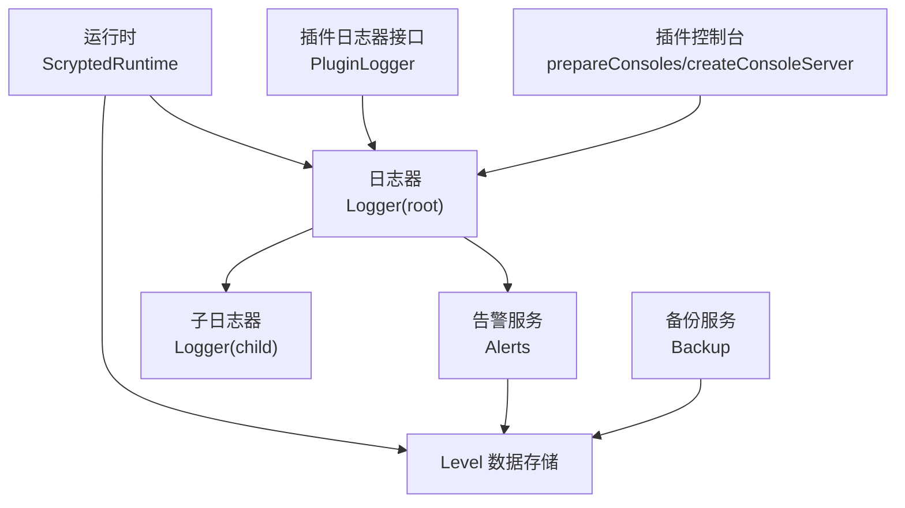
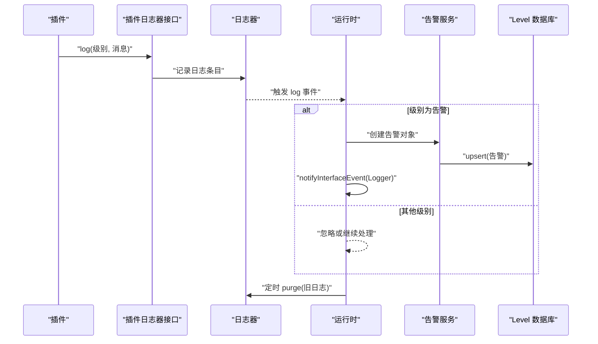
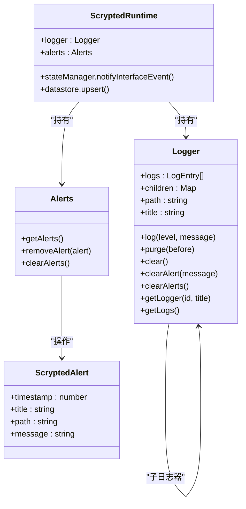
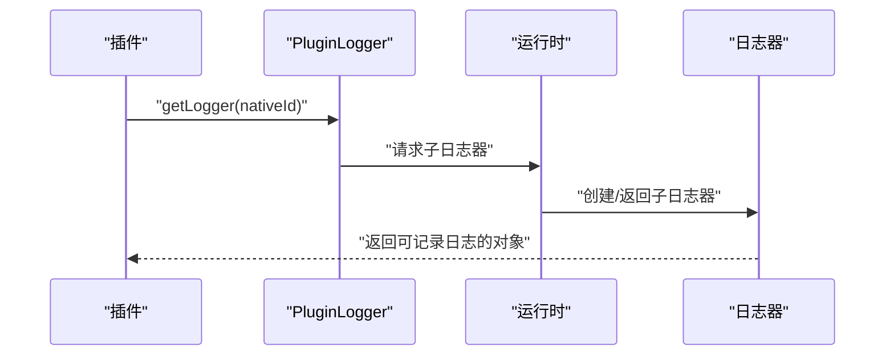
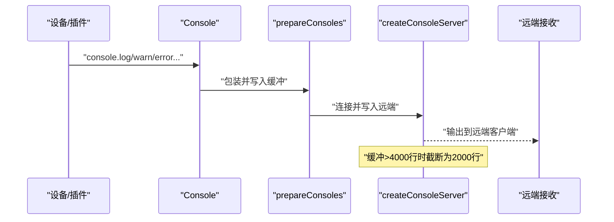
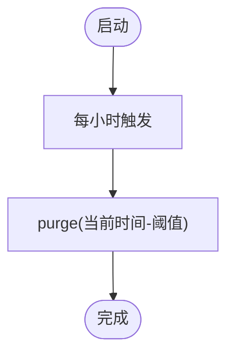
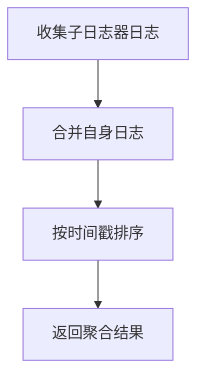
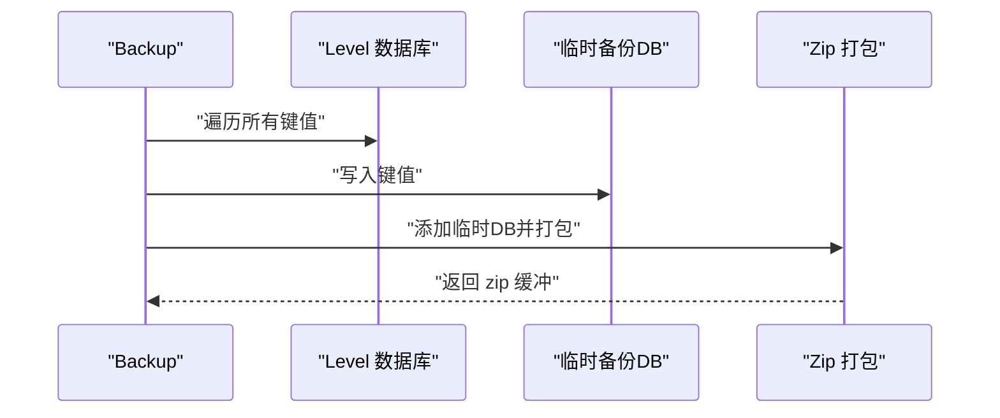
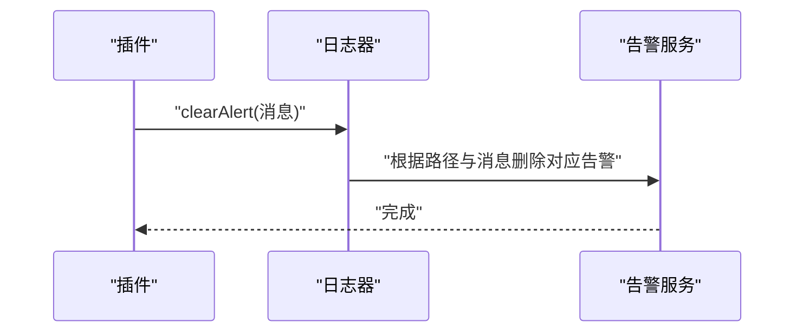
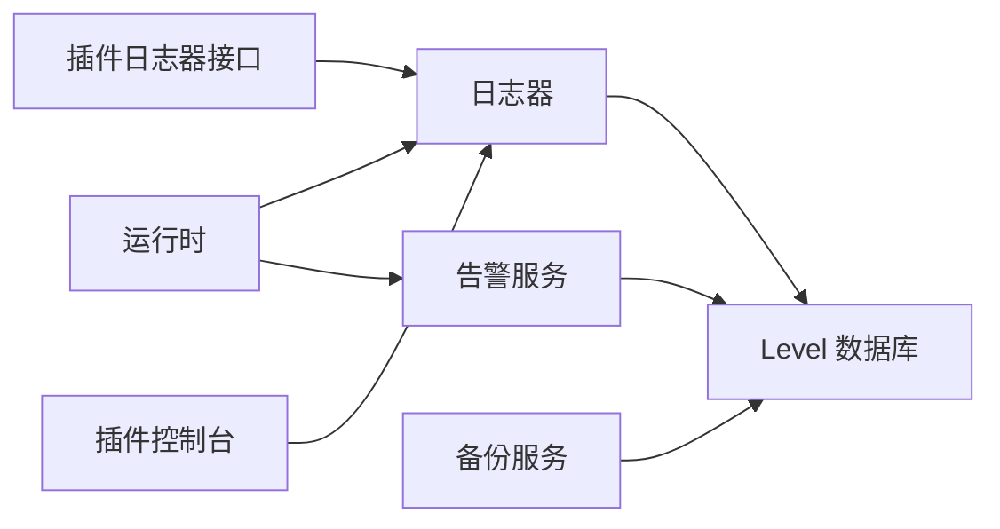

# 日志管理

<cite>
**本文引用的文件**
- [server/src/logger.ts](file://server/src/logger.ts)
- [server/src/runtime.ts](file://server/src/runtime.ts)
- [server/src/db-types.ts](file://server/src/db-types.ts)
- [server/src/services/alerts.ts](file://server/src/services/alerts.ts)
- [server/src/plugin/plugin-api.ts](file://server/src/plugin/plugin-api.ts)
- [server/src/plugin/plugin-console.ts](file://server/src/plugin/plugin-console.ts)
- [server/src/services/backup.ts](file://server/src/services/backup.ts)
- [server/src/level.ts](file://server/src/level.ts)
- [plugins/hikvision-doorbell/src/debug-console.ts](file://plugins/hikvision-doorbell/src/debug-console.ts)
- [plugins/cloud/src/main.ts](file://plugins/cloud/src/main.ts)
</cite>

## 目录
1. [简介](#简介)
2. [项目结构](#项目结构)
3. [核心组件](#核心组件)
4. [架构总览](#架构总览)
5. [详细组件分析](#详细组件分析)
6. [依赖关系分析](#依赖关系分析)
7. [性能考量](#性能考量)
8. [故障排查指南](#故障排查指南)
9. [结论](#结论)
10. [附录](#附录)

## 简介
本指南面向 Scrypted 的日志管理与使用，覆盖以下主题：
- 日志级别与过滤：当前实现以字符串级别标识进行记录与事件分发，未在运行时对级别做严格过滤。
- 输出配置：控制台输出、插件控制台远端写入、本地内存缓冲与行数截断。
- 轮转与清理：基于时间阈值的自动清理（定期清理过期日志）。
- 插件日志：插件日志器接口、子日志器创建、设备与 mixin 控制台隔离与继承。
- 聚合与搜索：日志聚合与排序、告警持久化与查询。
- 导出与备份：数据库级备份与打包。
- 性能优化：异步队列、背压与缓冲策略。
- 最佳实践：日志策略、敏感信息处理与合规建议。

## 项目结构
围绕日志管理的关键模块如下：
- 运行时与日志器：运行时持有根日志器，负责告警事件与定时清理。
- 日志器类：提供日志记录、子日志器创建、聚合与清理。
- 告警服务：提供告警列表、删除与清空。
- 插件 API：暴露日志器接口给插件使用。
- 插件控制台：设备与 mixin 的控制台隔离、远端写入、缓冲与截断。
- 备份服务：数据库备份与打包，便于日志数据导出。

**图表来源**
- [server/src/runtime.ts:64-176](file://server/src/runtime.ts#L64-L176)
- [server/src/logger.ts:19-92](file://server/src/logger.ts#L19-L92)
- [server/src/services/alerts.ts:4-23](file://server/src/services/alerts.ts#L4-L23)
- [server/src/db-types.ts:26-31](file://server/src/db-types.ts#L26-L31)
- [server/src/plugin/plugin-api.ts:4-9](file://server/src/plugin/plugin-api.ts#L4-L9)
- [server/src/plugin/plugin-console.ts:64-179](file://server/src/plugin/plugin-console.ts#L64-L179)
- [server/src/services/backup.ts:9-46](file://server/src/services/backup.ts#L9-L46)

**章节来源**
- [server/src/runtime.ts:64-176](file://server/src/runtime.ts#L64-L176)
- [server/src/logger.ts:19-92](file://server/src/logger.ts#L19-L92)
- [server/src/services/alerts.ts:4-23](file://server/src/services/alerts.ts#L4-L23)
- [server/src/db-types.ts:26-31](file://server/src/db-types.ts#L26-L31)
- [server/src/plugin/plugin-api.ts:4-9](file://server/src/plugin/plugin-api.ts#L4-L9)
- [server/src/plugin/plugin-console.ts:64-179](file://server/src/plugin/plugin-console.ts#L64-L179)
- [server/src/services/backup.ts:9-46](file://server/src/services/backup.ts#L9-L46)

## 核心组件
- 日志器 Logger
  - 记录日志条目（级别、消息、路径、标题、时间戳），并触发事件。
  - 提供子日志器创建、聚合、清理与告警清理。
- 运行时 ScryptedRuntime
  - 持有根日志器与设备日志器；监听日志事件，生成告警并持久化；定时清理旧日志。
- 告警服务 Alerts
  - 查询、删除与清空告警；通知状态变更。
- 插件日志器接口 PluginLogger
  - 插件侧通过该接口记录日志、清理告警。
- 插件控制台 prepareConsoles / createConsoleServer
  - 设备与 mixin 控制台隔离；远端写入；缓冲与行数截断。
- 备份 Backup
  - 将 Level 数据库复制到临时目录并打包为 zip，用于日志数据导出。

**章节来源**
- [server/src/logger.ts:19-92](file://server/src/logger.ts#L19-L92)
- [server/src/runtime.ts:64-176](file://server/src/runtime.ts#L64-L176)
- [server/src/services/alerts.ts:4-23](file://server/src/services/alerts.ts#L4-L23)
- [server/src/plugin/plugin-api.ts:4-9](file://server/src/plugin/plugin-api.ts#L4-L9)
- [server/src/plugin/plugin-console.ts:64-179](file://server/src/plugin/plugin-console.ts#L64-L179)
- [server/src/services/backup.ts:9-46](file://server/src/services/backup.ts#L9-L46)

## 架构总览
下图展示日志从产生到持久化与导出的流程：

**图表来源**
- [server/src/runtime.ts:155-175](file://server/src/runtime.ts#L155-L175)
- [server/src/logger.ts:33-46](file://server/src/logger.ts#L33-L46)
- [server/src/services/alerts.ts:8-22](file://server/src/services/alerts.ts#L8-L22)
- [server/src/db-types.ts:26-31](file://server/src/db-types.ts#L26-L31)

## 详细组件分析

### 日志器与告警
- 日志条目结构包含级别、消息、路径、标题与时间戳。
- 子日志器按路径层级创建，事件透传至父日志器。
- 告警由运行时监听日志事件并在满足条件时持久化，同时通知状态变更。
- 定时任务每小时清理超过一定时间阈值的日志。

**图表来源**
- [server/src/logger.ts:19-92](file://server/src/logger.ts#L19-L92)
- [server/src/runtime.ts:64-176](file://server/src/runtime.ts#L64-L176)
- [server/src/services/alerts.ts:4-23](file://server/src/services/alerts.ts#L4-L23)
- [server/src/db-types.ts:26-31](file://server/src/db-types.ts#L26-L31)

**章节来源**
- [server/src/logger.ts:19-92](file://server/src/logger.ts#L19-L92)
- [server/src/runtime.ts:155-175](file://server/src/runtime.ts#L155-L175)
- [server/src/services/alerts.ts:8-22](file://server/src/services/alerts.ts#L8-L22)
- [server/src/db-types.ts:26-31](file://server/src/db-types.ts#L26-L31)

### 插件日志器接口与子日志器
- 插件通过接口记录日志，并可清理特定告警或全部告警。
- 运行时提供子日志器创建能力，便于按设备或功能域隔离日志。

**图表来源**
- [server/src/plugin/plugin-api.ts:30-30](file://server/src/plugin/plugin-api.ts#L30-L30)
- [server/src/logger.ts:77-85](file://server/src/logger.ts#L77-L85)

**章节来源**
- [server/src/plugin/plugin-api.ts:4-9](file://server/src/plugin/plugin-api.ts#L4-L9)
- [server/src/logger.ts:77-85](file://server/src/logger.ts#L77-L85)

### 插件控制台与日志输出
- 设备与 mixin 控制台隔离，支持远端写入与本地缓冲。
- 缓冲达到一定行数后会截断保留最近内容，避免无限增长。
- 可选择性地在本地打印并转发到远端。

**图表来源**
- [server/src/plugin/plugin-console.ts:22-62](file://server/src/plugin/plugin-console.ts#L22-L62)
- [server/src/plugin/plugin-console.ts:175-179](file://server/src/plugin/plugin-console.ts#L175-L179)
- [server/src/plugin/plugin-console.ts:181-331](file://server/src/plugin/plugin-console.ts#L181-L331)

**章节来源**
- [server/src/plugin/plugin-console.ts:64-179](file://server/src/plugin/plugin-console.ts#L64-L179)
- [server/src/plugin/plugin-console.ts:181-331](file://server/src/plugin/plugin-console.ts#L181-L331)

### 日志轮转与清理
- 当前实现未提供基于大小或时间的轮转策略，而是通过定时清理过期日志的方式控制内存占用。
- 清理周期为每小时一次，阈值为较长时间之前的日志。

**图表来源**
- [server/src/runtime.ts:172-175](file://server/src/runtime.ts#L172-L175)
- [server/src/logger.ts:48-53](file://server/src/logger.ts#L48-L53)

**章节来源**
- [server/src/runtime.ts:172-175](file://server/src/runtime.ts#L172-L175)
- [server/src/logger.ts:48-53](file://server/src/logger.ts#L48-L53)

### 日志聚合与搜索
- 日志器提供聚合方法，将子日志器与自身日志合并并按时间排序。
- 告警持久化到 Level 数据库，可通过告警服务查询与清理。

**图表来源**
- [server/src/logger.ts:87-91](file://server/src/logger.ts#L87-L91)
- [server/src/services/alerts.ts:8-22](file://server/src/services/alerts.ts#L8-L22)
- [server/src/db-types.ts:26-31](file://server/src/db-types.ts#L26-L31)

**章节来源**
- [server/src/logger.ts:87-91](file://server/src/logger.ts#L87-L91)
- [server/src/services/alerts.ts:8-22](file://server/src/services/alerts.ts#L8-L22)
- [server/src/db-types.ts:26-31](file://server/src/db-types.ts#L26-L31)

### 日志导出与备份
- 备份服务将 Level 数据库复制到临时目录并打包为 zip，可用于日志数据导出。
- 备份过程遍历数据库键值对写入临时数据库，再打包为 zip 返回。

**图表来源**
- [server/src/services/backup.ts:12-46](file://server/src/services/backup.ts#L12-L46)
- [server/src/level.ts:89-113](file://server/src/level.ts#L89-L113)

**章节来源**
- [server/src/services/backup.ts:9-46](file://server/src/services/backup.ts#L9-L46)
- [server/src/level.ts:89-113](file://server/src/level.ts#L89-L113)

### 插件日志管理示例
- 插件可调用日志器清理特定告警，例如健康检查成功后清除告警。
- 插件可使用调试控制台在开发环境下有条件地输出调试信息。

**图表来源**
- [plugins/cloud/src/main.ts:1181-1181](file://plugins/cloud/src/main.ts#L1181-L1181)
- [server/src/logger.ts:64-67](file://server/src/logger.ts#L64-L67)
- [server/src/services/alerts.ts:15-17](file://server/src/services/alerts.ts#L15-L17)

**章节来源**
- [plugins/cloud/src/main.ts:1165-1191](file://plugins/cloud/src/main.ts#L1165-L1191)
- [server/src/logger.ts:64-67](file://server/src/logger.ts#L64-L67)
- [server/src/services/alerts.ts:15-17](file://server/src/services/alerts.ts#L15-L17)

## 依赖关系分析
- 运行时依赖日志器与告警服务；日志器依赖 Level 数据库存储告警；插件通过日志器接口记录日志；备份服务依赖 Level 数据库与压缩库。
- 插件控制台依赖网络与流，实现远端写入与缓冲。

**图表来源**
- [server/src/runtime.ts:64-176](file://server/src/runtime.ts#L64-L176)
- [server/src/logger.ts:19-92](file://server/src/logger.ts#L19-L92)
- [server/src/services/alerts.ts:4-23](file://server/src/services/alerts.ts#L4-L23)
- [server/src/db-types.ts:26-31](file://server/src/db-types.ts#L26-L31)
- [server/src/plugin/plugin-api.ts:4-9](file://server/src/plugin/plugin-api.ts#L4-L9)
- [server/src/plugin/plugin-console.ts:64-179](file://server/src/plugin/plugin-console.ts#L64-L179)
- [server/src/services/backup.ts:9-46](file://server/src/services/backup.ts#L9-L46)

**章节来源**
- [server/src/runtime.ts:64-176](file://server/src/runtime.ts#L64-L176)
- [server/src/logger.ts:19-92](file://server/src/logger.ts#L19-L92)
- [server/src/services/alerts.ts:4-23](file://server/src/services/alerts.ts#L4-L23)
- [server/src/db-types.ts:26-31](file://server/src/db-types.ts#L26-L31)
- [server/src/plugin/plugin-api.ts:4-9](file://server/src/plugin/plugin-api.ts#L4-L9)
- [server/src/plugin/plugin-console.ts:64-179](file://server/src/plugin/plugin-console.ts#L64-L179)
- [server/src/services/backup.ts:9-46](file://server/src/services/backup.ts#L9-L46)

## 性能考量
- 异步队列与背压：插件套接字服务中使用异步队列与背压，防止高吞吐导致内存膨胀。
- 缓冲与截断：插件控制台对缓冲行数进行截断，避免无限增长。
- 定时清理：运行时定时清理旧日志，降低内存压力。
- I/O 合并：备份服务批量写入临时数据库，减少多次 I/O。

**章节来源**
- [plugins/core/src/plugin-socket-service.ts:29-73](file://plugins/core/src/plugin-socket-service.ts#L29-L73)
- [server/src/plugin/plugin-console.ts:220-224](file://server/src/plugin/plugin-console.ts#L220-L224)
- [server/src/runtime.ts:172-175](file://server/src/runtime.ts#L172-L175)
- [server/src/services/backup.ts:23-26](file://server/src/services/backup.ts#L23-L26)

## 故障排查指南
- 告警未出现
  - 检查日志事件是否被正确触发与级别判断。
  - 确认告警持久化与状态通知是否执行。
- 日志过多导致内存占用高
  - 观察定时清理是否生效；必要时缩短清理周期或减少日志量。
- 插件控制台无输出
  - 检查远端连接是否建立；确认缓冲截断逻辑是否影响显示。
- 告警清理无效
  - 确认路径与消息匹配；检查数据库键前缀匹配逻辑。

**章节来源**
- [server/src/runtime.ts:155-175](file://server/src/runtime.ts#L155-L175)
- [server/src/logger.ts:48-53](file://server/src/logger.ts#L48-L53)
- [server/src/services/alerts.ts:15-22](file://server/src/services/alerts.ts#L15-L22)
- [server/src/plugin/plugin-console.ts:76-98](file://server/src/plugin/plugin-console.ts#L76-L98)

## 结论
Scrypted 的日志管理以内存中的日志器为核心，结合运行时的告警持久化与定时清理，形成完整的日志生命周期。插件通过统一的日志器接口与控制台隔离机制，实现灵活的日志输出与管理。当前未内置基于大小或时间的轮转策略，但提供了备份导出能力以满足数据留存需求。建议在生产环境中配合合理的日志策略与定期清理，确保性能与合规性。

## 附录

### 日志级别与过滤
- 当前实现使用字符串级别的标识进行记录与事件分发，未在运行时对级别做严格过滤。
- 若需实现 DEBUG/INFO/WARN/ERROR 级别过滤，可在运行时监听日志事件时增加过滤逻辑。

**章节来源**
- [server/src/logger.ts:33-46](file://server/src/logger.ts#L33-L46)
- [server/src/runtime.ts:155-170](file://server/src/runtime.ts#L155-L170)

### 日志输出配置
- 控制台输出：日志器在记录时会同步输出到控制台。
- 插件控制台输出：通过 prepareConsoles 与 createConsoleServer 实现设备与 mixin 的远端写入与本地缓冲。
- 文件输出与远程日志服务器：当前仓库未提供内置实现，可扩展为将日志事件转发至外部系统或文件。

**章节来源**
- [server/src/logger.ts:44-44](file://server/src/logger.ts#L44-L44)
- [server/src/plugin/plugin-console.ts:64-179](file://server/src/plugin/plugin-console.ts#L64-L179)
- [server/src/plugin/plugin-console.ts:181-331](file://server/src/plugin/plugin-console.ts#L181-L331)

### 日志轮转机制
- 当前未提供基于大小或时间的轮转策略。
- 建议在运行时增加轮转策略：如按大小轮转、按时间轮转与压缩归档。

**章节来源**
- [server/src/runtime.ts:172-175](file://server/src/runtime.ts#L172-L175)

### 插件日志管理
- 插件日志隔离：通过子日志器与路径区分不同设备或功能域。
- 日志继承：子日志器事件透传至父日志器。
- 子日志器创建：运行时提供 getLogger 接口。

**章节来源**
- [server/src/logger.ts:77-85](file://server/src/logger.ts#L77-L85)
- [server/src/plugin/plugin-api.ts:30-30](file://server/src/plugin/plugin-api.ts#L30-L30)

### 日志聚合与搜索
- 聚合：getLogs 方法合并子日志器与自身日志并排序。
- 搜索：可通过告警服务查询告警列表，或在应用层对日志数组进行过滤与排序。

**章节来源**
- [server/src/logger.ts:87-91](file://server/src/logger.ts#L87-L91)
- [server/src/services/alerts.ts:8-14](file://server/src/services/alerts.ts#L8-L14)

### 日志导出功能
- 备份：备份服务将数据库复制并打包为 zip，便于外部系统集成与归档。

**章节来源**
- [server/src/services/backup.ts:12-46](file://server/src/services/backup.ts#L12-L46)

### 日志性能优化
- 异步队列与背压：在插件套接字服务中使用队列与背压控制内存。
- 缓冲与截断：插件控制台对缓冲行数进行截断。
- 定时清理：运行时定时清理旧日志。

**章节来源**
- [plugins/core/src/plugin-socket-service.ts:29-73](file://plugins/core/src/plugin-socket-service.ts#L29-L73)
- [server/src/plugin/plugin-console.ts:220-224](file://server/src/plugin/plugin-console.ts#L220-L224)
- [server/src/runtime.ts:172-175](file://server/src/runtime.ts#L172-L175)

### 最佳实践
- 制定日志策略：明确级别划分与保留周期。
- 敏感信息过滤：在记录前对敏感字段进行脱敏。
- 合规性：遵循数据最小化原则，避免长期保存敏感日志；定期清理与备份。

[本节为通用指导，不直接分析具体文件]