# 监控与告警

<cite>
**本文引用的文件**
- [server/src/runtime.ts](file://server/src/runtime.ts)
- [server/src/logger.ts](file://server/src/logger.ts)
- [server/src/services/alerts.ts](file://server/src/services/alerts.ts)
- [server/src/services/service-control.ts](file://server/src/services/service-control.ts)
- [plugins/cloud/src/main.ts](file://plugins/cloud/src/main.ts)
- [plugins/smtp/src/main.ts](file://plugins/smtp/src/main.ts)
- [plugins/webhook/src/main.ts](file://plugins/webhook/src/main.ts)
- [plugins/objectdetector/src/main.ts](file://plugins/objectdetector/src/main.ts)
- [plugins/diagnostics/src/main.ts](file://plugins/diagnostics/src/main.ts)
- [plugins/zwave/src/main.ts](file://plugins/zwave/src/main.ts)
- [plugins/hikvision-doorbell/src/doorbell-api.ts](file://plugins/hikvision-doorbell/src/doorbell-api.ts)
</cite>

## 目录
1. [简介](#简介)
2. [项目结构](#项目结构)
3. [核心组件](#核心组件)
4. [架构总览](#架构总览)
5. [详细组件分析](#详细组件分析)
6. [依赖关系分析](#依赖关系分析)
7. [性能考量](#性能考量)
8. [故障排查指南](#故障排查指南)
9. [结论](#结论)
10. [附录](#附录)

## 简介
本指南面向 Scrypted 的监控与告警体系，围绕系统运行指标、日志管理、性能监控、告警机制、自定义指标、可视化与历史分析、故障检测与自动恢复等方面，提供可操作的配置说明与最佳实践。内容基于仓库中实际实现的运行时、日志器、告警服务、服务控制、云健康检查、SMTP 邮件告警、Webhook 推送、对象检测统计、诊断信息等模块进行整理。

## 项目结构
Scrypted 的监控与告警能力由“运行时”“日志器”“告警服务”“服务控制”等核心模块协同实现，并通过插件扩展邮件、Webhook、云健康检查、诊断与设备事件等能力。

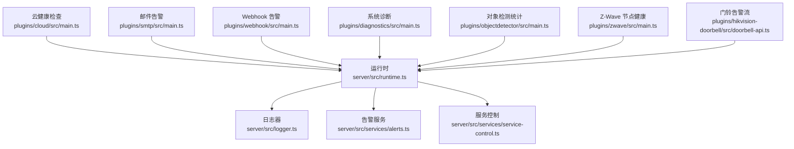

图示来源
- [server/src/runtime.ts:1-176](file://server/src/runtime.ts#L1-L176)
- [server/src/logger.ts:1-93](file://server/src/logger.ts#L1-L93)
- [server/src/services/alerts.ts:1-24](file://server/src/services/alerts.ts#L1-L24)
- [server/src/services/service-control.ts:1-33](file://server/src/services/service-control.ts#L1-L33)
- [plugins/cloud/src/main.ts:1133-1205](file://plugins/cloud/src/main.ts#L1133-L1205)
- [plugins/smtp/src/main.ts:1-197](file://plugins/smtp/src/main.ts#L1-L197)
- [plugins/webhook/src/main.ts:1-253](file://plugins/webhook/src/main.ts#L1-L253)
- [plugins/objectdetector/src/main.ts:1183-1218](file://plugins/objectdetector/src/main.ts#L1183-L1218)
- [plugins/diagnostics/src/main.ts:483-514](file://plugins/diagnostics/src/main.ts#L483-L514)
- [plugins/zwave/src/main.ts:478-509](file://plugins/zwave/src/main.ts#L478-L509)
- [plugins/hikvision-doorbell/src/doorbell-api.ts:1092-1116](file://plugins/hikvision-doorbell/src/doorbell-api.ts#L1092-L1116)

章节来源
- [server/src/runtime.ts:1-176](file://server/src/runtime.ts#L1-L176)

## 核心组件
- 运行时（ScryptedRuntime）
  - 负责日志与告警的统一入口：接收日志器发出的“告警级别日志”，持久化为告警条目，并通过状态管理广播事件。
  - 提供组件访问接口（如 logger、alerts、service-control），便于外部模块使用。
- 日志器（Logger）
  - 维护日志列表、子日志器树、清理过期日志；支持按路径清理告警。
- 告警服务（Alerts）
  - 提供获取、删除、清空告警的能力，并在变更时通知状态管理。
- 服务控制（ServiceControl）
  - 提供重启与更新触发能力，支持通过环境变量配置的 Webhook 更新。
- 云健康检查（Cloud）
  - 定期对隧道健康进行检查，失败达到阈值后执行进程重启并记录告警。
- 邮件告警（SMTP）
  - 作为混入提供者，解析邮件内容并根据配置触发设备开关或启停。
- Webhook 告警（Webhook）
  - 为设备生成受令牌保护的 Webhook，支持方法调用与属性查询，用于外部系统集成。
- 对象检测统计（ObjectDetector）
  - 统计并发视频分析会话、检测速率等性能指标，便于评估媒体处理负载。
- 系统诊断（Diagnostics）
  - 检查 CPU 数量、内存容量、本地地址可达性等基础运行条件。
- Z-Wave 节点健康（Z-Wave）
  - 维护节点在线状态与降级逻辑，记录健康检查日志。
- 设备告警流（Hikvision 门铃）
  - 订阅设备的告警流事件，持续监听并处理。

章节来源
- [server/src/runtime.ts:155-176](file://server/src/runtime.ts#L155-L176)
- [server/src/logger.ts:19-91](file://server/src/logger.ts#L19-L91)
- [server/src/services/alerts.ts:4-23](file://server/src/services/alerts.ts#L4-L23)
- [server/src/services/service-control.ts:4-32](file://server/src/services/service-control.ts#L4-L32)
- [plugins/cloud/src/main.ts:1154-1205](file://plugins/cloud/src/main.ts#L1154-L1205)
- [plugins/smtp/src/main.ts:74-197](file://plugins/smtp/src/main.ts#L74-L197)
- [plugins/webhook/src/main.ts:95-253](file://plugins/webhook/src/main.ts#L95-L253)
- [plugins/objectdetector/src/main.ts:1183-1218](file://plugins/objectdetector/src/main.ts#L1183-L1218)
- [plugins/diagnostics/src/main.ts:483-514](file://plugins/diagnostics/src/main.ts#L483-L514)
- [plugins/zwave/src/main.ts:478-509](file://plugins/zwave/src/main.ts#L478-L509)
- [plugins/hikvision-doorbell/src/doorbell-api.ts:1092-1116](file://plugins/hikvision-doorbell/src/doorbell-api.ts#L1092-L1116)

## 架构总览
下图展示了监控与告警的关键交互：日志器产生日志，运行时捕获“告警级别日志”并持久化为告警；服务控制负责系统级动作；云健康检查、SMTP、Webhook 插件分别承担健康检查、邮件告警与 Webhook 告警；对象检测与诊断插件提供性能与系统健康指标。

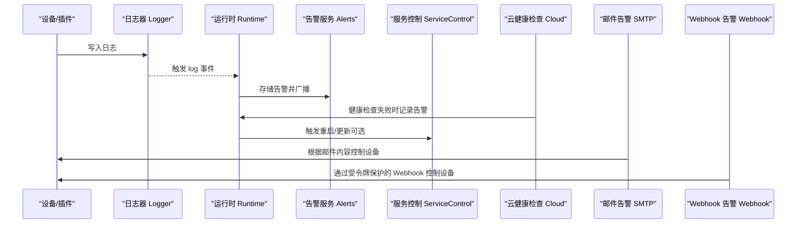

图示来源
- [server/src/runtime.ts:155-176](file://server/src/runtime.ts#L155-L176)
- [server/src/services/alerts.ts:8-22](file://server/src/services/alerts.ts#L8-L22)
- [server/src/services/service-control.ts:5-31](file://server/src/services/service-control.ts#L5-L31)
- [plugins/cloud/src/main.ts:1154-1205](file://plugins/cloud/src/main.ts#L1154-L1205)
- [plugins/smtp/src/main.ts:147-160](file://plugins/smtp/src/main.ts#L147-L160)
- [plugins/webhook/src/main.ts:175-208](file://plugins/webhook/src/main.ts#L175-L208)

## 详细组件分析

### 日志与告警（运行时、日志器、告警服务）
- 日志器
  - 支持按路径分层组织日志，提供清理过期日志与按路径清除告警的能力。
  - 可通过子日志器扩展到设备级命名空间。
- 运行时
  - 监听日志器的“告警级别日志”，将其转换为告警实体并写入数据存储，同时通知状态管理。
  - 后台定时清理超过时限的日志，避免无限增长。
- 告警服务
  - 提供获取、删除、清空告警的接口，并在变更时通知状态管理，便于前端或外部系统订阅。

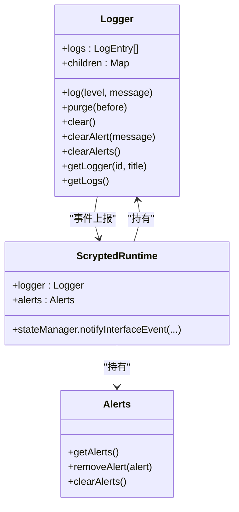

图示来源
- [server/src/logger.ts:19-91](file://server/src/logger.ts#L19-L91)
- [server/src/services/alerts.ts:4-23](file://server/src/services/alerts.ts#L4-L23)
- [server/src/runtime.ts:73-90](file://server/src/runtime.ts#L73-L90)

章节来源
- [server/src/logger.ts:19-91](file://server/src/logger.ts#L19-L91)
- [server/src/runtime.ts:155-176](file://server/src/runtime.ts#L155-L176)
- [server/src/services/alerts.ts:8-22](file://server/src/services/alerts.ts#L8-L22)

### 服务控制与自动重启
- 服务控制
  - 提供重启与更新触发能力；若配置了 Webhook 更新地址，则通过 HTTP 请求触发更新；否则写入更新标记文件并重启进程。
- 运行时插件自动重启
  - 当插件异常退出或错误时，运行时会在一定延迟后自动尝试重启，避免长时间离线。

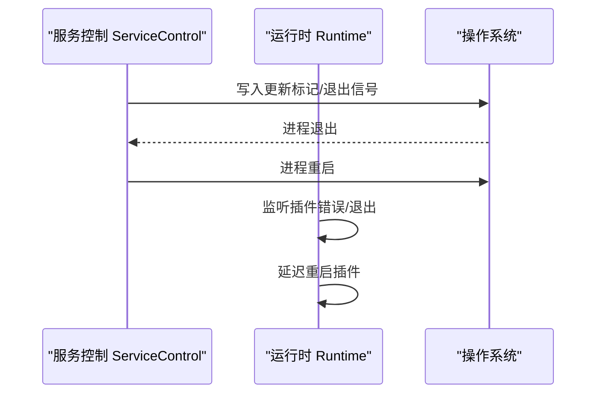

图示来源
- [server/src/services/service-control.ts:4-32](file://server/src/services/service-control.ts#L4-L32)
- [server/src/runtime.ts:644-689](file://server/src/runtime.ts#L644-L689)

章节来源
- [server/src/services/service-control.ts:4-32](file://server/src/services/service-control.ts#L4-L32)
- [server/src/runtime.ts:644-689](file://server/src/runtime.ts#L644-L689)

### 云健康检查与自动恢复
- 云健康检查
  - 启动后定期向隧道健康端点发起请求，成功则清除历史告警；失败累计达到阈值后，记录告警并终止当前进程以触发自动重启。
  - 健康检查间隔与超时可配置，失败计数在每次成功后清零。

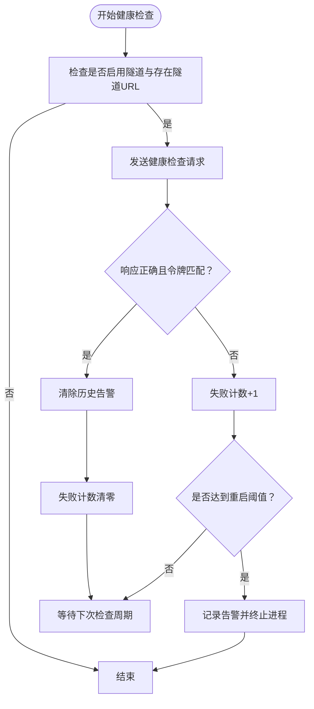

图示来源
- [plugins/cloud/src/main.ts:1154-1205](file://plugins/cloud/src/main.ts#L1154-L1205)

章节来源
- [plugins/cloud/src/main.ts:1154-1205](file://plugins/cloud/src/main.ts#L1154-L1205)

### 邮件告警（SMTP）
- 功能概述
  - 作为混入提供者，接收邮件并解析内容；根据配置的关键词决定是否对目标设备执行“开启/启动”或“关闭/停止”操作。
  - 支持端口与 TLS 开关配置，便于在不同网络环境下部署。
- 配置要点
  - 设置邮箱地址、开启/启动关键词、关闭/停止关键词。
  - 选择 SMTP 端口与是否禁用 TLS。
  - 将该插件作为目标设备的混入，使邮件指令生效。

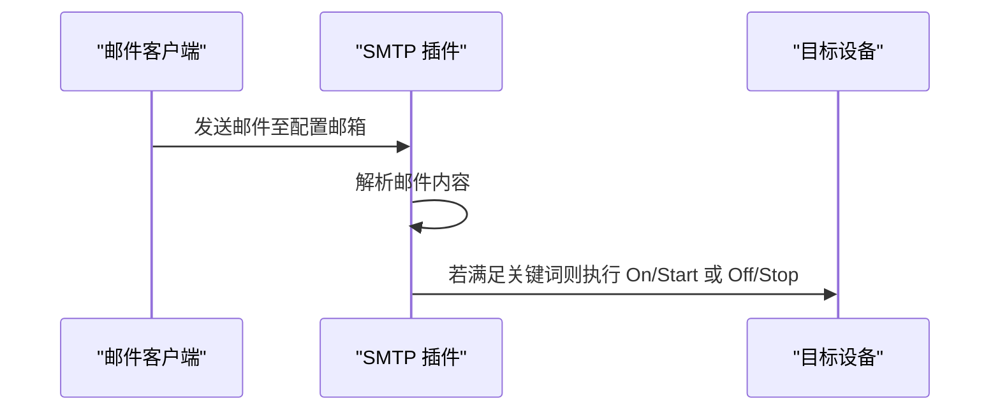

图示来源
- [plugins/smtp/src/main.ts:147-160](file://plugins/smtp/src/main.ts#L147-L160)
- [plugins/smtp/src/main.ts:74-197](file://plugins/smtp/src/main.ts#L74-L197)

章节来源
- [plugins/smtp/src/main.ts:74-197](file://plugins/smtp/src/main.ts#L74-L197)

### Webhook 告警
- 功能概述
  - 为设备生成受随机令牌保护的 Webhook，支持通过 HTTP GET/POST 调用设备接口方法或读取属性。
  - 可返回 JSON 或媒体对象（如图片）。
- 配置要点
  - 在设备上启用 Webhook 混入，查看生成的本地与不安全本地 URL。
  - 使用生成的令牌访问对应路径，调用方法时可通过参数查询字符串传参。

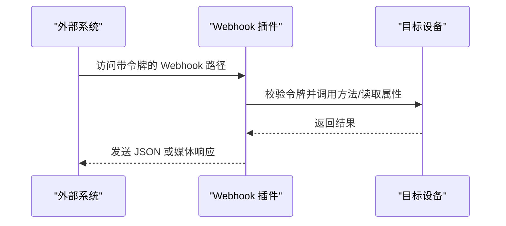

图示来源
- [plugins/webhook/src/main.ts:175-208](file://plugins/webhook/src/main.ts#L175-L208)
- [plugins/webhook/src/main.ts:95-253](file://plugins/webhook/src/main.ts#L95-L253)

章节来源
- [plugins/webhook/src/main.ts:95-253](file://plugins/webhook/src/main.ts#L95-L253)

### 性能监控（对象检测与媒体流）
- 对象检测统计
  - 统计并发视频分析会话数量、单次会话检测次数与持续时间，计算每秒检测数（DPS），并输出日志。
  - 适用于评估媒体分析负载与资源占用。
- 媒体流质量相关
  - SDK 类型定义中包含媒体流请求参数（如自适应码率、预缓冲、目标类型等），可用于指导流媒体质量与稳定性配置。

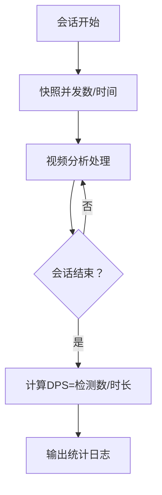

图示来源
- [plugins/objectdetector/src/main.ts:1183-1218](file://plugins/objectdetector/src/main.ts#L1183-L1218)
- [sdk/types/src/types.input.ts:624-798](file://sdk/types/src/types.input.ts#L624-L798)

章节来源
- [plugins/objectdetector/src/main.ts:1183-1218](file://plugins/objectdetector/src/main.ts#L1183-L1218)
- [sdk/types/src/types.input.ts:624-798](file://sdk/types/src/types.input.ts#L624-L798)

### 系统与设备健康检查（诊断与 Z-Wave）
- 系统诊断
  - 检查本地地址可达性（IPv4/IPv6）、CPU 数量、内存容量等基础条件，给出建议与警告。
- Z-Wave 节点健康
  - 维护节点在线状态与降级等级，当最近活跃时间过期或多次健康检查失败时，降级节点健康状态并记录日志。

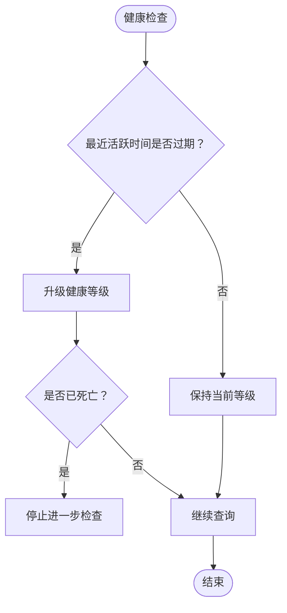

图示来源
- [plugins/zwave/src/main.ts:478-509](file://plugins/zwave/src/main.ts#L478-L509)
- [plugins/diagnostics/src/main.ts:483-514](file://plugins/diagnostics/src/main.ts#L483-L514)

章节来源
- [plugins/zwave/src/main.ts:478-509](file://plugins/zwave/src/main.ts#L478-L509)
- [plugins/diagnostics/src/main.ts:483-514](file://plugins/diagnostics/src/main.ts#L483-L514)

### 设备告警流（Hikvision 门铃）
- 功能概述
  - 订阅设备的告警流事件，持续监听并处理设备推送的告警消息，便于快速响应外部事件。

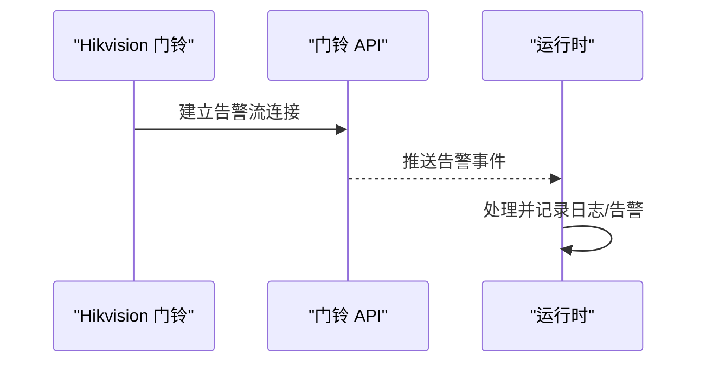

图示来源
- [plugins/hikvision-doorbell/src/doorbell-api.ts:1092-1116](file://plugins/hikvision-doorbell/src/doorbell-api.ts#L1092-L1116)

章节来源
- [plugins/hikvision-doorbell/src/doorbell-api.ts:1092-1116](file://plugins/hikvision-doorbell/src/doorbell-api.ts#L1092-L1116)

## 依赖关系分析
- 运行时依赖日志器与告警服务，形成“日志—告警”的闭环。
- 服务控制与运行时耦合，用于系统级重启与更新。
- 云健康检查、SMTP、Webhook 插件通过运行时提供的组件接口与状态管理进行协作。
- 对象检测与诊断插件提供性能与系统健康指标，辅助监控策略制定。

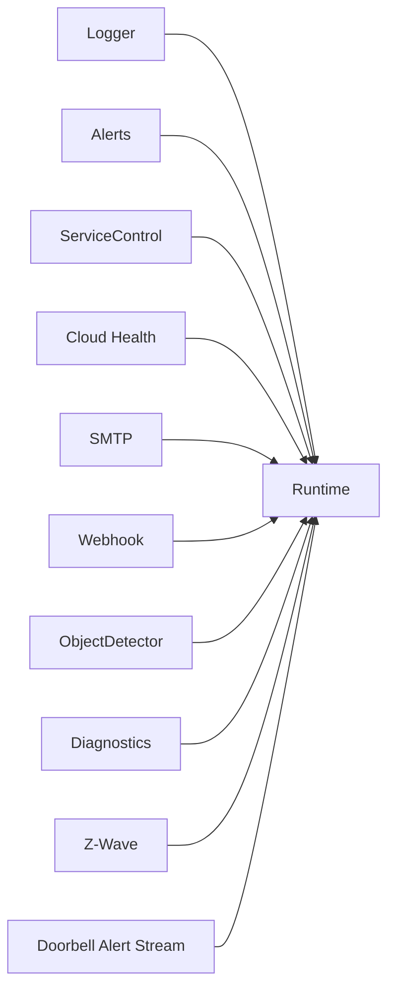

图示来源
- [server/src/runtime.ts:73-90](file://server/src/runtime.ts#L73-L90)
- [server/src/logger.ts:19-91](file://server/src/logger.ts#L19-L91)
- [server/src/services/alerts.ts:4-23](file://server/src/services/alerts.ts#L4-L23)
- [server/src/services/service-control.ts:4-32](file://server/src/services/service-control.ts#L4-L32)
- [plugins/cloud/src/main.ts:1154-1205](file://plugins/cloud/src/main.ts#L1154-L1205)
- [plugins/smtp/src/main.ts:74-197](file://plugins/smtp/src/main.ts#L74-L197)
- [plugins/webhook/src/main.ts:95-253](file://plugins/webhook/src/main.ts#L95-L253)
- [plugins/objectdetector/src/main.ts:1183-1218](file://plugins/objectdetector/src/main.ts#L1183-L1218)
- [plugins/diagnostics/src/main.ts:483-514](file://plugins/diagnostics/src/main.ts#L483-L514)
- [plugins/zwave/src/main.ts:478-509](file://plugins/zwave/src/main.ts#L478-L509)
- [plugins/hikvision-doorbell/src/doorbell-api.ts:1092-1116](file://plugins/hikvision-doorbell/src/doorbell-api.ts#L1092-L1116)

章节来源
- [server/src/runtime.ts:73-90](file://server/src/runtime.ts#L73-L90)

## 性能考量
- 媒体分析负载
  - 利用对象检测统计的 DPS 指标评估并发分析会话对 CPU/内存的影响，结合媒体流请求参数（自适应码率、预缓冲、目标类型）优化质量与稳定性。
- 系统资源
  - 依据诊断插件的建议，确保 CPU 数量与内存容量满足预期负载；在高负载场景下考虑降低并发分析会话数或调整分辨率/帧率。
- 日志与告警
  - 运行时定时清理旧日志，避免存储压力；合理设置告警阈值，减少噪声告警影响。

章节来源
- [plugins/objectdetector/src/main.ts:1183-1218](file://plugins/objectdetector/src/main.ts#L1183-L1218)
- [plugins/diagnostics/src/main.ts:483-514](file://plugins/diagnostics/src/main.ts#L483-L514)
- [server/src/runtime.ts:172-175](file://server/src/runtime.ts#L172-L175)

## 故障排查指南
- 健康检查失败与自动重启
  - 若云健康检查连续失败达到阈值，系统会记录告警并终止进程以触发自动重启。检查隧道可用性、网络连通性与健康检查端点。
- 插件异常退出
  - 运行时会延迟重启插件，若频繁重启，检查插件日志与依赖安装情况。
- 告警未出现
  - 确认日志器是否以“告警级别”写入；运行时是否监听到日志事件并持久化为告警；告警服务是否正常工作。
- Webhook 无法访问
  - 确认令牌正确、设备已启用 Webhook 混入、路径与方法/属性名称匹配。
- 邮件未触发设备动作
  - 检查邮箱配置、关键词设置、目标设备是否具备 OnOff/StartStop 接口。

章节来源
- [plugins/cloud/src/main.ts:1154-1205](file://plugins/cloud/src/main.ts#L1154-L1205)
- [server/src/runtime.ts:644-689](file://server/src/runtime.ts#L644-L689)
- [server/src/runtime.ts:155-176](file://server/src/runtime.ts#L155-L176)
- [plugins/webhook/src/main.ts:175-208](file://plugins/webhook/src/main.ts#L175-L208)
- [plugins/smtp/src/main.ts:147-160](file://plugins/smtp/src/main.ts#L147-L160)

## 结论
Scrypted 的监控与告警体系以运行时为核心，结合日志器、告警服务与服务控制，形成从日志采集、告警持久化到系统级自动恢复的完整链路。通过云健康检查、SMTP 与 Webhook 插件，系统实现了多维度的告警与自动化控制。配合对象检测统计与系统诊断，用户可以建立完善的监控策略与告警优化方案，保障系统稳定运行。

## 附录
- 自定义监控指标建议
  - 设备状态监控：利用日志器记录关键事件，按设备路径分层，便于聚合与查询。
  - 业务指标跟踪：在插件中记录业务指标（如请求成功率、处理耗时），通过运行时状态管理对外暴露。
  - 阈值设置：结合云健康检查与对象检测统计，设定合理的失败阈值与日志保留周期。
- 可视化与历史分析
  - 建议在前端或外部系统中订阅运行时的状态管理事件，结合告警服务的历史告警列表进行可视化展示与趋势分析。
- 最佳实践
  - 制定监控策略：明确关键指标与阈值，区分严重与一般告警。
  - 告警优化：减少误报与噪声，结合日志清理策略控制存储成本。
  - 性能调优：根据诊断与对象检测统计结果，动态调整并发与质量参数。