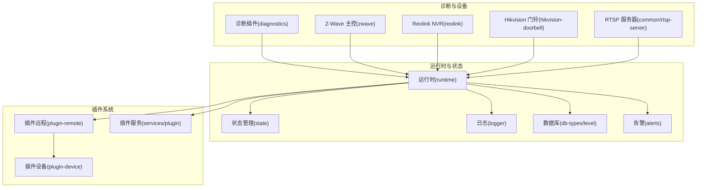
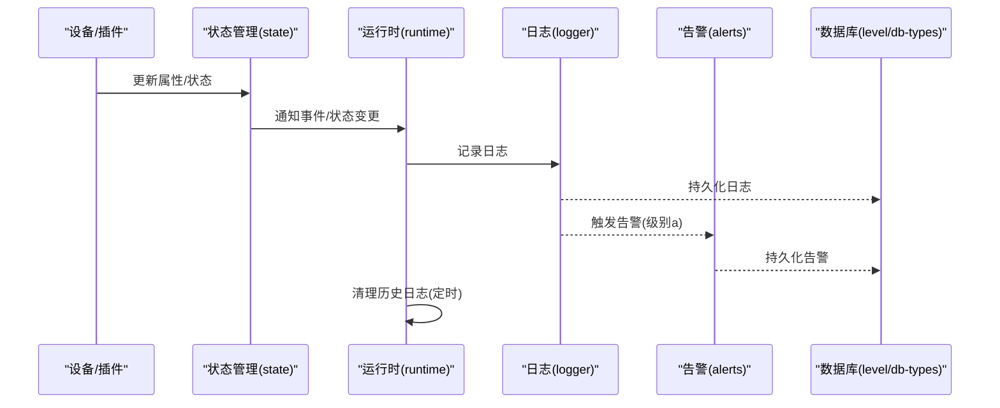
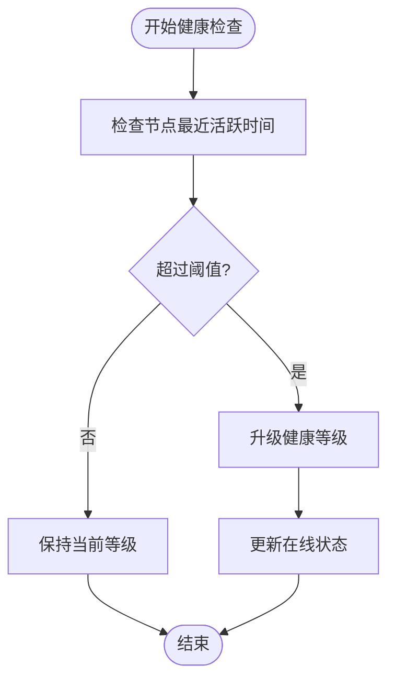
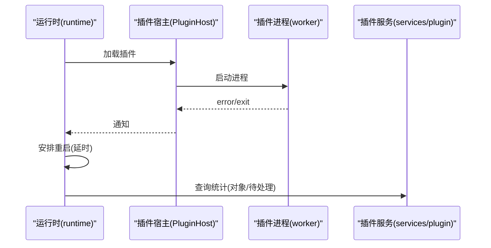
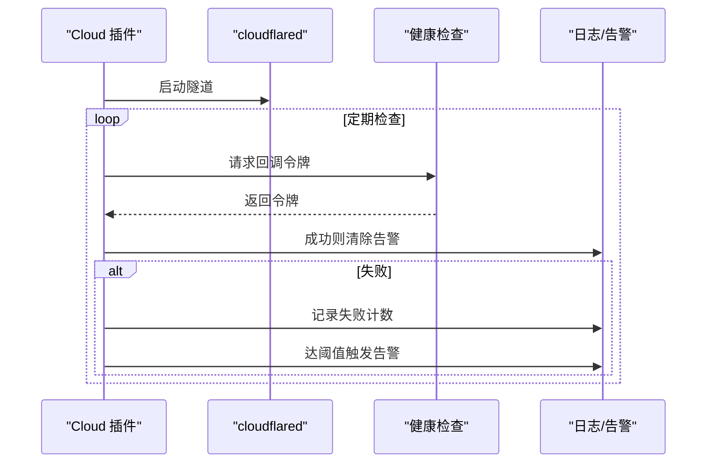
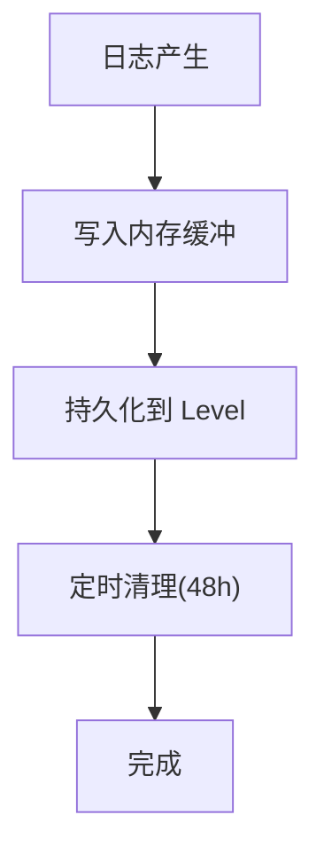
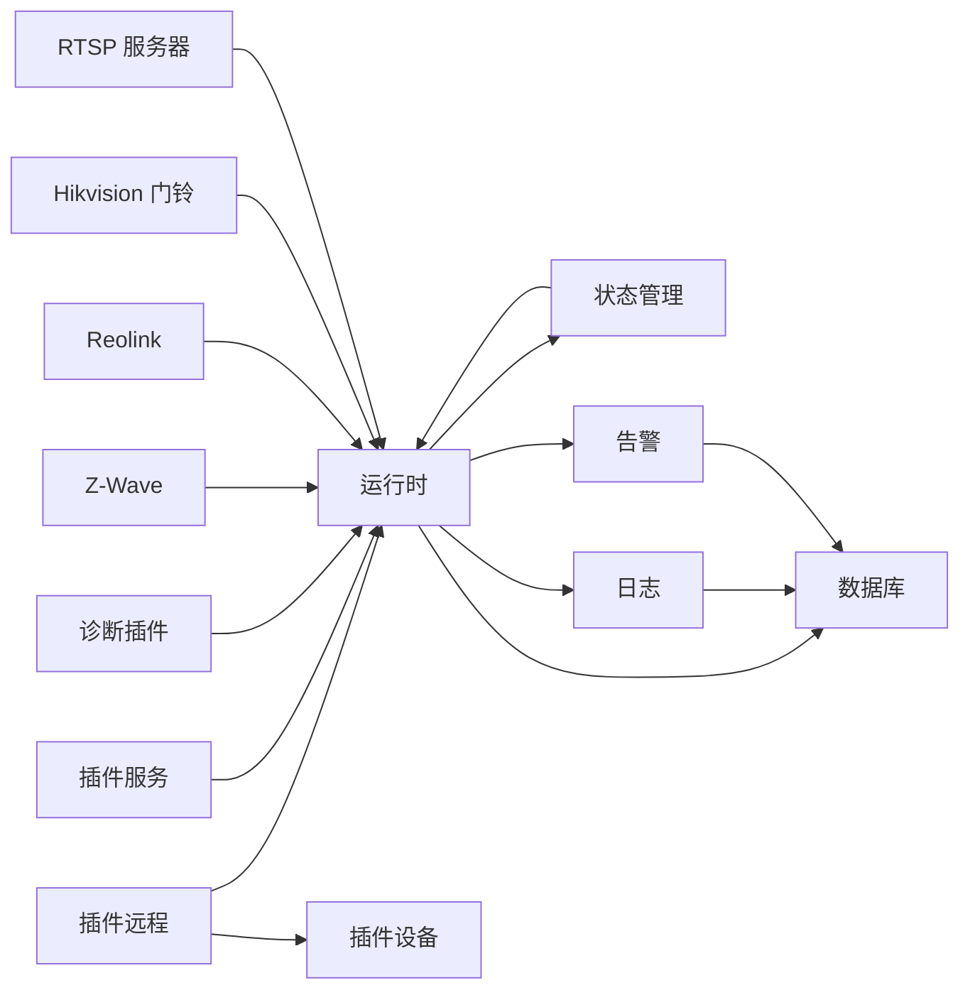

# 系统监控

<cite>
**本文引用的文件**   
- [server/src/state.ts](file://server/src/state.ts)
- [server/src/logger.ts](file://server/src/logger.ts)
- [server/src/db-types.ts](file://server/src/db-types.ts)
- [server/src/runtime.ts](file://server/src/runtime.ts)
- [plugins/diagnostics/src/main.ts](file://plugins/diagnostics/src/main.ts)
- [plugins/cloud/src/main.ts](file://plugins/cloud/src/main.ts)
- [plugins/zwave/src/main.ts](file://plugins/zwave/src/main.ts)
- [plugins/reolink/src/nvr/api.ts](file://plugins/reolink/src/nvr/api.ts)
- [plugins/hikvision-doorbell/src/doorbell-api.ts](file://plugins/hikvision-doorbell/src/doorbell-api.ts)
- [server/src/plugin/plugin-remote.ts](file://server/src/plugin/plugin-remote.ts)
- [server/src/plugin/device.ts](file://server/src/plugin/device.ts)
- [server/src/services/plugin.ts](file://server/src/services/plugin.ts)
- [sdk/src/storage-settings.ts](file://sdk/src/storage-settings.ts)
- [common/src/rtsp-server.ts](file://common/src/rtsp-server.ts)
- [server/src/level.ts](file://server/src/level.ts)
- [server/src/services/alerts.ts](file://server/src/services/alerts.ts)
</cite>

## 目录
1. [简介](#简介)
2. [项目结构](#项目结构)
3. [核心组件](#核心组件)
4. [架构总览](#架构总览)
5. [详细组件分析](#详细组件分析)
6. [依赖关系分析](#依赖关系分析)
7. [性能考量](#性能考量)
8. [故障排查指南](#故障排查指南)
9. [结论](#结论)
10. [附录](#附录)

## 简介
本指南面向 Scrypted 系统的监控与可观测性，围绕以下目标展开：系统资源监控（CPU、内存、磁盘、网络）、设备状态监控（在线/离线、连接质量、响应时间）、插件性能监控（启动、内存、CPU）、系统健康检查（服务可用性、依赖、异常检测）、监控数据采集机制（频率、存储、历史保留）、告警阈值与触发策略，以及最佳实践（策略制定、性能基线、容量规划）。文档以仓库中现有实现为依据，结合可操作的配置与使用路径，帮助用户建立完善的监控体系。

## 项目结构
Scrypted 的监控能力由运行时、状态管理、日志与告警、插件系统、诊断工具等模块协同实现。下图展示与监控相关的关键模块及其交互：

**图表来源**
- [server/src/runtime.ts:64-176](file://server/src/runtime.ts#L64-L176)
- [server/src/state.ts:10-120](file://server/src/state.ts#L10-L120)
- [server/src/logger.ts:19-92](file://server/src/logger.ts#L19-L92)
- [server/src/db-types.ts:26-43](file://server/src/db-types.ts#L26-L43)
- [server/src/level.ts:18-87](file://server/src/level.ts#L18-L87)
- [server/src/services/alerts.ts:1-23](file://server/src/services/alerts.ts#L1-L23)
- [server/src/plugin/plugin-remote.ts:238-273](file://server/src/plugin/plugin-remote.ts#L238-L273)
- [server/src/plugin/device.ts:23-54](file://server/src/plugin/device.ts#L23-L54)
- [server/src/services/plugin.ts:102-123](file://server/src/services/plugin.ts#L102-L123)
- [plugins/diagnostics/src/main.ts:25-84](file://plugins/diagnostics/src/main.ts#L25-L84)
- [plugins/zwave/src/main.ts:478-509](file://plugins/zwave/src/main.ts#L478-L509)
- [plugins/reolink/src/nvr/api.ts:829-1126](file://plugins/reolink/src/nvr/api.ts#L829-L1126)
- [plugins/hikvision-doorbell/src/doorbell-api.ts:1092-1150](file://plugins/hikvision-doorbell/src/doorbell-api.ts#L1092-L1150)
- [common/src/rtsp-server.ts:1148-1177](file://common/src/rtsp-server.ts#L1148-L1177)

**章节来源**
- [server/src/runtime.ts:64-176](file://server/src/runtime.ts#L64-L176)
- [server/src/state.ts:10-120](file://server/src/state.ts#L10-L120)
- [server/src/logger.ts:19-92](file://server/src/logger.ts#L19-L92)
- [server/src/db-types.ts:26-43](file://server/src/db-types.ts#L26-L43)
- [server/src/level.ts:18-87](file://server/src/level.ts#L18-L87)
- [server/src/services/alerts.ts:1-23](file://server/src/services/alerts.ts#L1-L23)

## 核心组件
- 运行时与事件总线：负责设备状态变更通知、事件分发、日志与告警持久化。
- 状态管理：统一维护系统设备状态，支持刷新节流与去抖，保障事件风暴下的稳定性。
- 日志与告警：集中记录日志并转换为告警条目，支持按路径清理与历史清理。
- 插件系统：提供插件生命周期、远程通信、设备代理与 RPC 对象统计。
- 诊断工具：内置系统与设备验证流程，覆盖网络连通性、媒体能力、云服务可达性等。
- 设备健康检查：部分设备/协议插件内置健康检查逻辑（如云隧道、Z-Wave 节点健康度）。

**章节来源**
- [server/src/runtime.ts:64-176](file://server/src/runtime.ts#L64-L176)
- [server/src/state.ts:193-255](file://server/src/state.ts#L193-L255)
- [server/src/logger.ts:33-91](file://server/src/logger.ts#L33-L91)
- [server/src/services/alerts.ts:8-22](file://server/src/services/alerts.ts#L8-L22)
- [server/src/plugin/plugin-remote.ts:238-273](file://server/src/plugin/plugin-remote.ts#L238-L273)
- [server/src/plugin/device.ts:23-54](file://server/src/plugin/device.ts#L23-L54)
- [plugins/diagnostics/src/main.ts:386-771](file://plugins/diagnostics/src/main.ts#L386-L771)
- [plugins/zwave/src/main.ts:478-509](file://plugins/zwave/src/main.ts#L478-L509)

## 架构总览
下图展示监控相关的关键流程：状态更新、事件通知、日志与告警持久化、插件健康检查与诊断验证。

**图表来源**
- [server/src/state.ts:102-119](file://server/src/state.ts#L102-L119)
- [server/src/runtime.ts:155-170](file://server/src/runtime.ts#L155-L170)
- [server/src/logger.ts:33-46](file://server/src/logger.ts#L33-L46)
- [server/src/services/alerts.ts:8-22](file://server/src/services/alerts.ts#L8-L22)
- [server/src/level.ts:76-87](file://server/src/level.ts#L76-L87)
- [server/src/db-types.ts:26-31](file://server/src/db-types.ts#L26-L31)

## 详细组件分析

### 系统资源监控
- CPU/内存/磁盘：通过诊断插件进行主机环境与资源验证，包括 CPU 数量、内存容量、GPU 设备透传、外部资源访问等。这些检查可作为系统健康基线的一部分。
- 网络：诊断插件验证 IPv4/IPv6 可达性、云服务端点可用性、DNS 解析与阻断检测；同时对系统地址与云地址进行校验。
- 实际采集：仓库未提供内置的周期性资源采集器。建议结合外部监控系统（如 Prometheus/Grafana、系统自带的进程监控）进行补充。

**章节来源**
- [plugins/diagnostics/src/main.ts:397-514](file://plugins/diagnostics/src/main.ts#L397-L514)
- [plugins/diagnostics/src/main.ts:414-461](file://plugins/diagnostics/src/main.ts#L414-L461)
- [plugins/diagnostics/src/main.ts:462-484](file://plugins/diagnostics/src/main.ts#L462-L484)
- [plugins/diagnostics/src/main.ts:561-593](file://plugins/diagnostics/src/main.ts#L561-L593)
- [plugins/diagnostics/src/main.ts:615-652](file://plugins/diagnostics/src/main.ts#L615-L652)

### 设备状态监控
- 在线状态与连接质量：Z-Wave 插件根据节点最近活跃时间动态降级健康等级，离线后停止健康检查；Reolink 插件查询设备本地链路与 Wi-Fi 信号强度；Hikvision 门铃插件解析设备时区信息并处理事件流。
- 响应时间：状态管理对设备刷新进行节流与去抖，避免频繁轮询造成压力；设备可通过 Refresh 接口控制刷新频率。
- 属性变更：状态管理在属性变化时发出事件通知，日志记录变更详情。

**图表来源**
- [plugins/zwave/src/main.ts:478-509](file://plugins/zwave/src/main.ts#L478-L509)

**章节来源**
- [plugins/zwave/src/main.ts:478-509](file://plugins/zwave/src/main.ts#L478-L509)
- [plugins/reolink/src/nvr/api.ts:1101-1125](file://plugins/reolink/src/nvr/api.ts#L1101-L1125)
- [plugins/hikvision-doorbell/src/doorbell-api.ts:1092-1150](file://plugins/hikvision-doorbell/src/doorbell-api.ts#L1092-L1150)
- [server/src/state.ts:193-255](file://server/src/state.ts#L193-L255)
- [server/src/state.ts:102-119](file://server/src/state.ts#L102-L119)

### 插件性能监控
- 启动与重启：运行时对插件加载失败或退出进行自动重启调度，记录错误日志并延时重试。
- 内存与对象：插件服务接口返回 RPC 对象数量、待处理结果数等统计，便于评估插件负载。
- 日志与告警：插件日志可被转换为告警并持久化，支持按路径清理。

**图表来源**
- [server/src/runtime.ts:644-689](file://server/src/runtime.ts#L644-L689)
- [server/src/services/plugin.ts:102-123](file://server/src/services/plugin.ts#L102-L123)

**章节来源**
- [server/src/runtime.ts:644-689](file://server/src/runtime.ts#L644-L689)
- [server/src/services/plugin.ts:102-123](file://server/src/services/plugin.ts#L102-L123)
- [server/src/logger.ts:33-46](file://server/src/logger.ts#L33-L46)

### 系统健康检查
- 云隧道健康：Cloud 插件定期向隧道回调地址发起健康检查，失败累计到阈值后记录告警并尝试重启隧道进程。
- 诊断验证：Diagnostics 插件执行系统与设备的全面验证，包括云服务可达性、系统时间准确性、媒体能力测试、GPU 加速与解码验证等。

**图表来源**
- [plugins/cloud/src/main.ts:1154-1191](file://plugins/cloud/src/main.ts#L1154-L1191)

**章节来源**
- [plugins/cloud/src/main.ts:1154-1191](file://plugins/cloud/src/main.ts#L1154-L1191)
- [plugins/diagnostics/src/main.ts:386-771](file://plugins/diagnostics/src/main.ts#L386-L771)

### 监控数据收集机制
- 事件与状态：状态管理在属性变更时发出事件，日志记录变更详情；日志按小时清理旧数据，避免无限增长。
- 存储：日志与告警通过 Level 数据库持久化，键空间按文档类型前缀组织。
- 历史保留：运行时定时清理 48 小时前的日志，避免磁盘膨胀。

**图表来源**
- [server/src/logger.ts:33-53](file://server/src/logger.ts#L33-L53)
- [server/src/level.ts:76-87](file://server/src/level.ts#L76-L87)
- [server/src/runtime.ts:172-175](file://server/src/runtime.ts#L172-L175)

**章节来源**
- [server/src/logger.ts:33-53](file://server/src/logger.ts#L33-L53)
- [server/src/level.ts:45-56](file://server/src/level.ts#L45-L56)
- [server/src/runtime.ts:172-175](file://server/src/runtime.ts#L172-L175)

### 监控告警阈值与触发
- 告警生成：日志级别为“告警”时，运行时将其转换为告警条目并持久化，同时通知状态管理。
- 告警清理：支持按消息内容计算唯一 ID 并删除特定告警，也支持批量清理。
- 云隧道告警：连续失败达到阈值后触发告警并尝试重启。

**章节来源**
- [server/src/runtime.ts:155-170](file://server/src/runtime.ts#L155-L170)
- [server/src/logger.ts:64-75](file://server/src/logger.ts#L64-L75)
- [server/src/services/alerts.ts:8-22](file://server/src/services/alerts.ts#L8-L22)
- [plugins/cloud/src/main.ts:1160-1191](file://plugins/cloud/src/main.ts#L1160-L1191)

### 插件性能监控配置
- 统计项：插件服务接口返回进程 PID、客户端数量、RPC 对象数、待处理结果数及方法分布，用于评估插件负载。
- 配置入口：通过 SDK 的 StorageSettings 提供设置项的读取与写入，插件可据此暴露性能相关参数。

**章节来源**
- [server/src/services/plugin.ts:102-123](file://server/src/services/plugin.ts#L102-L123)
- [sdk/src/storage-settings.ts:129-160](file://sdk/src/storage-settings.ts#L129-L160)

### 设备状态监控配置
- 在线与健康：Z-Wave 节点健康度基于最近活跃时间与等级状态机动态调整；Reolink 设备支持查询本地链路与 Wi-Fi 信号；Hikvision 门铃支持事件流监听。
- 属性变更：通过状态管理的属性变更通知，结合日志记录，形成设备状态变更轨迹。

**章节来源**
- [plugins/zwave/src/main.ts:478-509](file://plugins/zwave/src/main.ts#L478-L509)
- [plugins/reolink/src/nvr/api.ts:1101-1125](file://plugins/reolink/src/nvr/api.ts#L1101-L1125)
- [plugins/hikvision-doorbell/src/doorbell-api.ts:1092-1150](file://plugins/hikvision-doorbell/src/doorbell-api.ts#L1092-L1150)
- [server/src/state.ts:102-119](file://server/src/state.ts#L102-L119)

### 系统健康检查配置
- 云隧道：启用后自动启动健康检查，失败计数清零与告警清除需在成功检查后触发。
- 诊断：通过 Diagnostics 插件的按钮触发系统与设备验证，输出详细检查结果与建议。

**章节来源**
- [plugins/cloud/src/main.ts:1154-1191](file://plugins/cloud/src/main.ts#L1154-L1191)
- [plugins/diagnostics/src/main.ts:26-53](file://plugins/diagnostics/src/main.ts#L26-L53)

### 监控数据采集频率与保留策略
- 刷新频率：设备刷新由 Refresh 接口控制，状态管理会读取刷新频率并进行节流；未显式设置时采用默认超时。
- 日志清理：每小时清理 48 小时前的日志，避免无限增长。
- 事件风暴防护：状态管理对重复事件进行去抖，减少无效通知。

**章节来源**
- [server/src/state.ts:214-227](file://server/src/state.ts#L214-L227)
- [server/src/state.ts:177-181](file://server/src/state.ts#L177-L181)
- [server/src/runtime.ts:172-175](file://server/src/runtime.ts#L172-L175)

## 依赖关系分析
- 运行时依赖状态管理、日志、告警与数据库层；状态管理依赖事件注册与设备刷新接口；日志与告警依赖数据库持久化。
- 插件系统通过远程通信与设备代理与运行时交互；插件服务提供运行时统计信息。
- 诊断与设备插件通过系统管理器获取设备实例并执行验证或健康检查。

**图表来源**
- [server/src/runtime.ts:64-176](file://server/src/runtime.ts#L64-L176)
- [server/src/state.ts:10-120](file://server/src/state.ts#L10-L120)
- [server/src/logger.ts:19-92](file://server/src/logger.ts#L19-L92)
- [server/src/services/alerts.ts:1-23](file://server/src/services/alerts.ts#L1-L23)
- [server/src/level.ts:18-87](file://server/src/level.ts#L18-L87)
- [server/src/plugin/plugin-remote.ts:238-273](file://server/src/plugin/plugin-remote.ts#L238-L273)
- [server/src/plugin/device.ts:23-54](file://server/src/plugin/device.ts#L23-L54)
- [server/src/services/plugin.ts:102-123](file://server/src/services/plugin.ts#L102-L123)
- [plugins/diagnostics/src/main.ts:25-84](file://plugins/diagnostics/src/main.ts#L25-L84)

**章节来源**
- [server/src/runtime.ts:64-176](file://server/src/runtime.ts#L64-L176)
- [server/src/state.ts:10-120](file://server/src/state.ts#L10-L120)
- [server/src/logger.ts:19-92](file://server/src/logger.ts#L19-L92)
- [server/src/services/alerts.ts:1-23](file://server/src/services/alerts.ts#L1-L23)
- [server/src/level.ts:18-87](file://server/src/level.ts#L18-L87)
- [server/src/plugin/plugin-remote.ts:238-273](file://server/src/plugin/plugin-remote.ts#L238-L273)
- [server/src/plugin/device.ts:23-54](file://server/src/plugin/device.ts#L23-L54)
- [server/src/services/plugin.ts:102-123](file://server/src/services/plugin.ts#L102-L123)
- [plugins/diagnostics/src/main.ts:25-84](file://plugins/diagnostics/src/main.ts#L25-L84)

## 性能考量
- 刷新节流：状态管理对设备刷新进行节流与尾部刷新合并，降低轮询压力。
- 去抖：对重复事件进行去抖，避免事件风暴导致的性能问题。
- 日志清理：定时清理旧日志，防止磁盘占用持续增长。
- 插件统计：通过 RPC 对象与待处理结果统计评估插件负载，指导扩容与优化。

**章节来源**
- [server/src/state.ts:193-255](file://server/src/state.ts#L193-L255)
- [server/src/state.ts:177-181](file://server/src/state.ts#L177-L181)
- [server/src/runtime.ts:172-175](file://server/src/runtime.ts#L172-L175)
- [server/src/services/plugin.ts:102-123](file://server/src/services/plugin.ts#L102-L123)

## 故障排查指南
- 查看日志：通过日志模块查看设备与系统日志，定位异常。
- 清理告警：按路径或消息内容清理特定告警，或批量清理。
- 诊断验证：使用 Diagnostics 插件执行系统与设备验证，快速发现网络、媒体、云服务等问题。
- 云隧道健康：若云隧道不稳定，关注连续失败计数与告警提示，必要时重启隧道进程。

**章节来源**
- [server/src/logger.ts:64-75](file://server/src/logger.ts#L64-L75)
- [server/src/services/alerts.ts:8-22](file://server/src/services/alerts.ts#L8-L22)
- [plugins/diagnostics/src/main.ts:26-53](file://plugins/diagnostics/src/main.ts#L26-L53)
- [plugins/cloud/src/main.ts:1154-1191](file://plugins/cloud/src/main.ts#L1154-L1191)

## 结论
Scrypted 的监控体系以运行时为核心，结合状态管理、日志与告警、插件系统与诊断工具，形成了从设备状态到系统健康的一体化可观测性框架。对于资源监控与网络监控，建议配合外部监控系统实现更细粒度的采集与可视化；对于设备与插件性能，可通过内置统计与诊断工具进行评估与优化。通过合理的刷新频率、日志清理与告警策略，可有效提升系统的稳定性与可维护性。

## 附录
- 关键实现位置参考：
  - 状态管理与刷新节流：[server/src/state.ts:193-255](file://server/src/state.ts#L193-L255)
  - 日志与告警持久化：[server/src/logger.ts:33-91](file://server/src/logger.ts#L33-L91)，[server/src/services/alerts.ts:8-22](file://server/src/services/alerts.ts#L8-L22)
  - 数据库存储：[server/src/level.ts:45-56](file://server/src/level.ts#L45-L56)，[server/src/db-types.ts:26-43](file://server/src/db-types.ts#L26-L43)
  - 插件统计：[server/src/services/plugin.ts:102-123](file://server/src/services/plugin.ts#L102-L123)
  - 诊断验证：[plugins/diagnostics/src/main.ts:386-771](file://plugins/diagnostics/src/main.ts#L386-L771)
  - 云隧道健康检查：[plugins/cloud/src/main.ts:1154-1191](file://plugins/cloud/src/main.ts#L1154-L1191)
  - 设备健康检查示例：Z-Wave 节点健康度、Reolink 本地链路与 Wi-Fi 信号、Hikvision 事件流监听
  - RTSP 请求处理：[common/src/rtsp-server.ts:1148-1177](file://common/src/rtsp-server.ts#L1148-L1177)