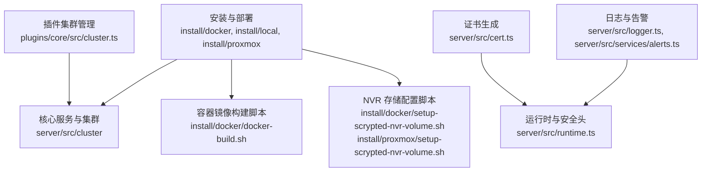
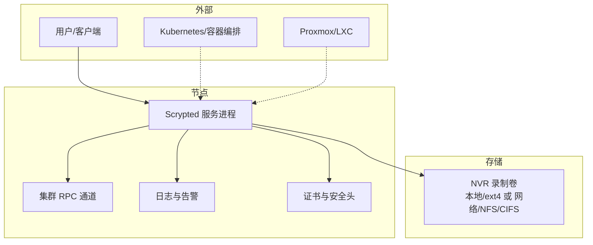
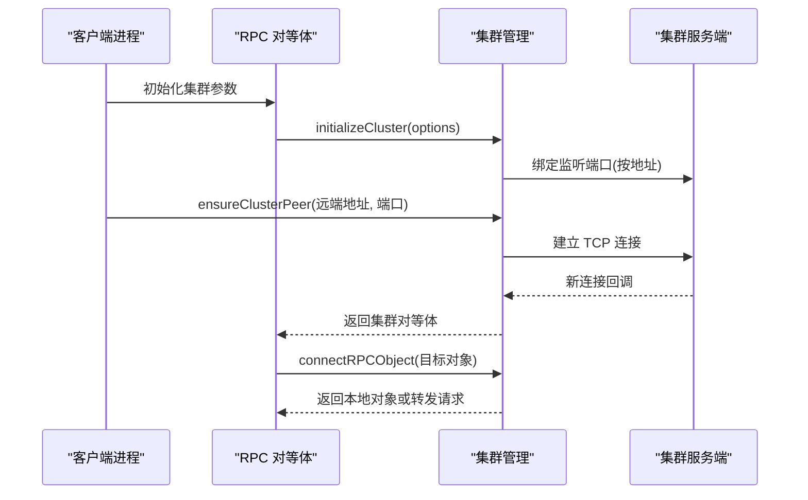
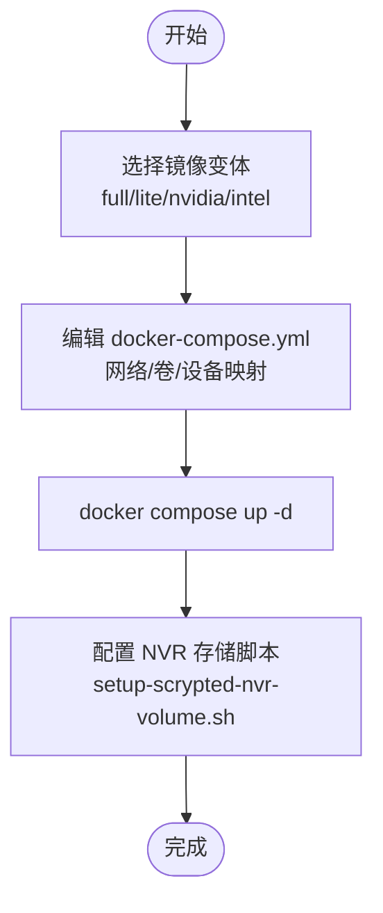
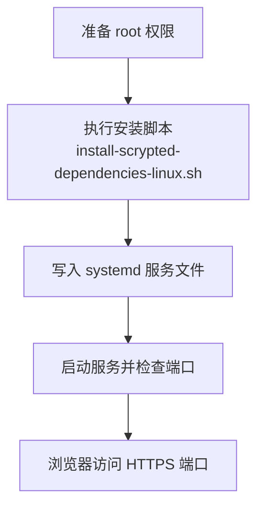
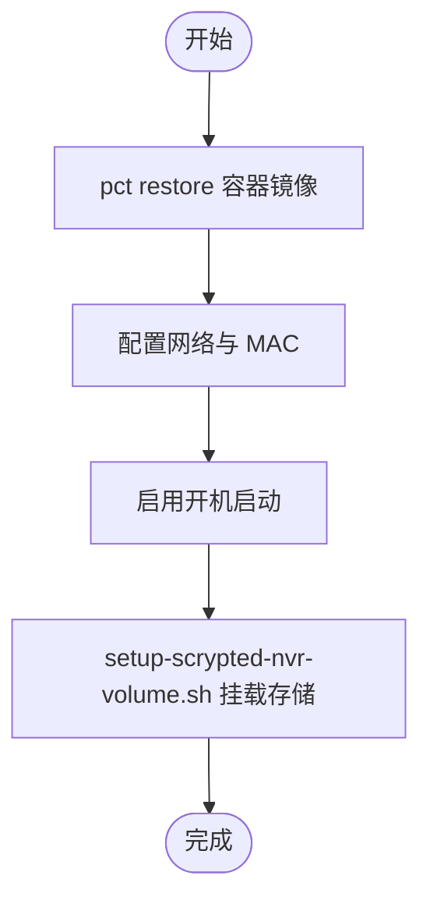
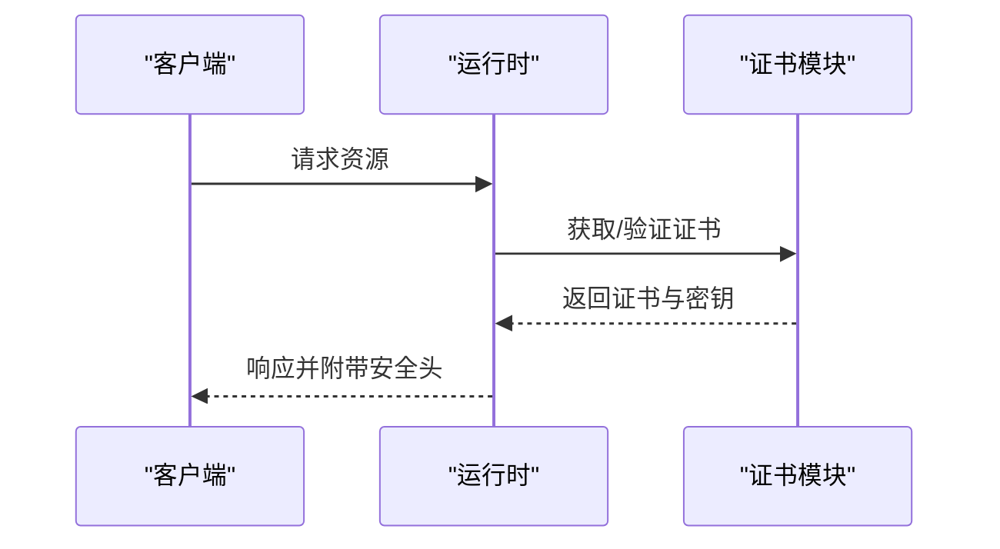
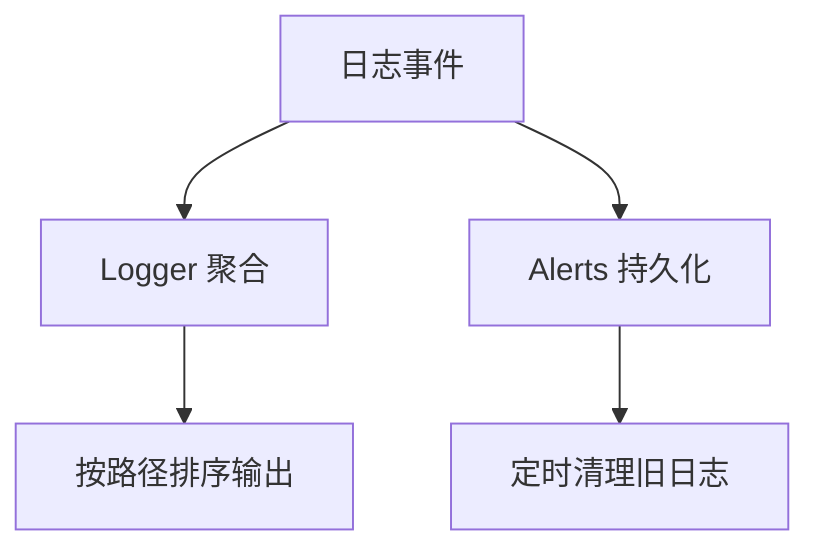
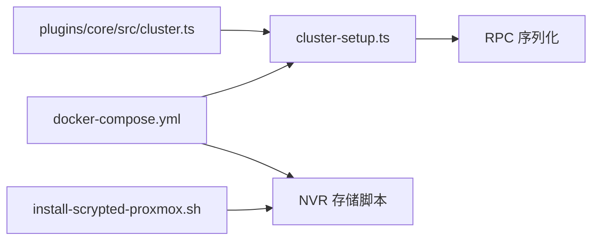

# 部署与运维

<cite>
**本文引用的文件**
- [README.md](file://README.md)
- [install/config.yaml](file://install/config.yaml)
- [install/docker/docker-compose.yml](file://install/docker/docker-compose.yml)
- [install/docker/Dockerfile](file://install/docker/Dockerfile)
- [install/docker/docker-build.sh](file://install/docker/docker-build.sh)
- [install/docker/setup-scrypted-nvr-volume.sh](file://install/docker/setup-scrypted-nvr-volume.sh)
- [install/local/install-scrypted-dependencies-linux.sh](file://install/local/install-scrypted-dependencies-linux.sh)
- [install/proxmox/install-scrypted-proxmox.sh](file://install/proxmox/install-scrypted-proxmox.sh)
- [install/proxmox/setup-scrypted-nvr-volume.sh](file://install/proxmox/setup-scrypted-nvr-volume.sh)
- [server/src/cluster/cluster-setup.ts](file://server/src/cluster/cluster-setup.ts)
- [plugins/core/src/cluster.ts](file://plugins/core/src/cluster.ts)
- [server/src/cert.ts](file://server/src/cert.ts)
- [server/src/runtime.ts](file://server/src/runtime.ts)
- [server/src/logger.ts](file://server/src/logger.ts)
- [server/src/services/alerts.ts](file://server/src/services/alerts.ts)
</cite>

## 目录
1. [简介](#简介)
2. [项目结构](#项目结构)
3. [核心组件](#核心组件)
4. [架构总览](#架构总览)
5. [详细组件分析](#详细组件分析)
6. [依赖关系分析](#依赖关系分析)
7. [性能考虑](#性能考虑)
8. [故障排查指南](#故障排查指南)
9. [结论](#结论)
10. [附录](#附录)

## 简介
本指南面向在生产环境中部署与运维 Scrypted 的工程团队与个人用户，覆盖系统要求、硬件推荐、网络与存储规划、多部署方式（容器化、Kubernetes、裸机、Proxmox）、集群配置与高可用、安全配置（证书、防火墙、权限）、监控与告警、备份与恢复、日常运维与优化等全生命周期内容。文档中的所有技术细节均以仓库内脚本与源码为依据，并通过图示与分层讲解帮助不同背景读者快速上手。

## 项目结构
Scrypted 采用模块化组织，安装与部署相关的关键目录与文件如下：
- 安装与部署模板：install/docker、install/local、install/proxmox
- 核心服务与集群：server/src/cluster、server/src/scrypted-main.ts
- 插件与集群管理：plugins/core/src/cluster.ts
- 证书与运行时：server/src/cert.ts、server/src/runtime.ts
- 日志与告警：server/src/logger.ts、server/src/services/alerts.ts

**图表来源**
- [install/docker/docker-compose.yml:1-169](file://install/docker/docker-compose.yml#L1-L169)
- [install/docker/docker-build.sh:1-19](file://install/docker/docker-build.sh#L1-L19)
- [install/docker/setup-scrypted-nvr-volume.sh:1-160](file://install/docker/setup-scrypted-nvr-volume.sh#L1-L160)
- [install/proxmox/setup-scrypted-nvr-volume.sh:1-75](file://install/proxmox/setup-scrypted-nvr-volume.sh#L1-L75)
- [server/src/cluster/cluster-setup.ts:1-498](file://server/src/cluster/cluster-setup.ts#L1-L498)
- [plugins/core/src/cluster.ts:1-163](file://plugins/core/src/cluster.ts#L1-L163)
- [server/src/cert.ts:44-101](file://server/src/cert.ts#L44-L101)
- [server/src/runtime.ts:167-197](file://server/src/runtime.ts#L167-L197)
- [server/src/logger.ts:55-92](file://server/src/logger.ts#L55-L92)
- [server/src/services/alerts.ts:1-23](file://server/src/services/alerts.ts#L1-L23)

**章节来源**
- [README.md:1-59](file://README.md#L1-L59)
- [install/docker/docker-compose.yml:1-169](file://install/docker/docker-compose.yml#L1-L169)
- [install/docker/docker-build.sh:1-19](file://install/docker/docker-build.sh#L1-L19)
- [server/src/cluster/cluster-setup.ts:1-498](file://server/src/cluster/cluster-setup.ts#L1-L498)
- [plugins/core/src/cluster.ts:1-163](file://plugins/core/src/cluster.ts#L1-L163)
- [server/src/cert.ts:44-101](file://server/src/cert.ts#L44-L101)
- [server/src/runtime.ts:167-197](file://server/src/runtime.ts#L167-L197)
- [server/src/logger.ts:55-92](file://server/src/logger.ts#L55-L92)
- [server/src/services/alerts.ts:1-23](file://server/src/services/alerts.ts#L1-L23)

## 核心组件
- 集群与节点管理：通过环境变量驱动的集群初始化与节点发现，支持主从模式与跨线程/进程对象代理。
- 容器化与镜像：提供多基础镜像变体（full、lite、nvidia、intel）与 Supervisor 启动封装。
- NVR 存储：提供主机与 Proxmox 场景下的磁盘/挂载配置脚本，确保容器可访问录制存储。
- 本地安装与系统服务：Linux 本地安装脚本集成 systemd 服务与依赖安装。
- 证书与安全头：自签证书生成与跨域安全响应头注入。
- 日志与告警：集中式日志聚合与告警持久化清理。

**章节来源**
- [server/src/cluster/cluster-setup.ts:336-462](file://server/src/cluster/cluster-setup.ts#L336-L462)
- [plugins/core/src/cluster.ts:27-101](file://plugins/core/src/cluster.ts#L27-L101)
- [install/docker/docker-compose.yml:20-169](file://install/docker/docker-compose.yml#L20-L169)
- [install/docker/Dockerfile:1-22](file://install/docker/Dockerfile#L1-L22)
- [install/docker/docker-build.sh:1-19](file://install/docker/docker-build.sh#L1-L19)
- [install/docker/setup-scrypted-nvr-volume.sh:1-160](file://install/docker/setup-scrypted-nvr-volume.sh#L1-L160)
- [install/proxmox/setup-scrypted-nvr-volume.sh:1-75](file://install/proxmox/setup-scrypted-nvr-volume.sh#L1-L75)
- [install/local/install-scrypted-dependencies-linux.sh:102-127](file://install/local/install-scrypted-dependencies-linux.sh#L102-L127)
- [server/src/cert.ts:44-101](file://server/src/cert.ts#L44-L101)
- [server/src/runtime.ts:187-197](file://server/src/runtime.ts#L187-L197)
- [server/src/logger.ts:55-92](file://server/src/logger.ts#L55-L92)
- [server/src/services/alerts.ts:1-23](file://server/src/services/alerts.ts#L1-L23)

## 架构总览
下图展示生产部署中常见的拓扑：单机或集群节点通过容器运行 Scrypted，使用专用 NVR 卷或网络共享；集群模式下节点间通过 RPC 通道互联；系统服务负责证书、日志与安全头注入。

**图表来源**
- [server/src/cluster/cluster-setup.ts:336-462](file://server/src/cluster/cluster-setup.ts#L336-L462)
- [server/src/cert.ts:44-101](file://server/src/cert.ts#L44-L101)
- [server/src/runtime.ts:187-197](file://server/src/runtime.ts#L187-L197)
- [server/src/logger.ts:55-92](file://server/src/logger.ts#L55-L92)
- [server/src/services/alerts.ts:1-23](file://server/src/services/alerts.ts#L1-L23)
- [install/docker/docker-compose.yml:58-91](file://install/docker/docker-compose.yml#L58-L91)
- [install/docker/setup-scrypted-nvr-volume.sh:149-160](file://install/docker/setup-scrypted-nvr-volume.sh#L149-L160)
- [install/proxmox/setup-scrypted-nvr-volume.sh:55-75](file://install/proxmox/setup-scrypted-nvr-volume.sh#L55-L75)

## 详细组件分析

### 集群与节点管理
- 环境变量驱动：通过 SCRYPTED_CLUSTER_MODE、SCRYPTED_CLUSTER_SECRET、SCRYPTED_CLUSTER_SERVER/ADDRESS 控制节点角色与监听地址。
- 节点发现与连接：根据地址与端口建立 RPC 连接，支持同主机 IPC（线程/进程）与跨主机 TCP。
- 对象代理与哈希：对跨节点对象序列化携带稳定 proxyId 与哈希校验，避免环回与误连。
- 主从模式：server 模式绑定指定地址与端口，client 模式连接 server 并自动推断本地地址。

**图表来源**
- [server/src/cluster/cluster-setup.ts:336-462](file://server/src/cluster/cluster-setup.ts#L336-L462)
- [server/src/cluster/cluster-setup.ts:349-399](file://server/src/cluster/cluster-setup.ts#L349-L399)

**章节来源**
- [server/src/cluster/cluster-setup.ts:336-462](file://server/src/cluster/cluster-setup.ts#L336-L462)
- [plugins/core/src/cluster.ts:27-101](file://plugins/core/src/cluster.ts#L27-L101)

### 容器化部署（Docker）
- 多变体镜像：full、lite、nvidia、intel 等，分别适配通用、轻量、GPU 加速与特定厂商加速场景。
- Compose 编排：默认使用 host 网络、可选 Avahi 守护进程、设备直通（USB、GPU）、DNS 全局解析。
- 更新机制：内置 Watchtower 自动更新，通过 webhook 触发更新端口。
- NVR 存储：支持本地挂载或网络卷（CIFS/NFS），需同步修改 docker-compose 与环境变量。

**图表来源**
- [install/docker/docker-compose.yml:20-169](file://install/docker/docker-compose.yml#L20-L169)
- [install/docker/Dockerfile:1-22](file://install/docker/Dockerfile#L1-L22)
- [install/docker/setup-scrypted-nvr-volume.sh:1-160](file://install/docker/setup-scrypted-nvr-volume.sh#L1-L160)

**章节来源**
- [install/docker/docker-compose.yml:20-169](file://install/docker/docker-compose.yml#L20-L169)
- [install/docker/Dockerfile:1-22](file://install/docker/Dockerfile#L1-L22)
- [install/docker/docker-build.sh:1-19](file://install/docker/docker-build.sh#L1-L19)
- [install/docker/setup-scrypted-nvr-volume.sh:1-160](file://install/docker/setup-scrypted-nvr-volume.sh#L1-L160)

### Kubernetes 集群部署
- 部署建议：使用 Deployment/StatefulSet 承载 Scrypted 主服务，使用 HostNetwork 或 Service 暴露端口；为 GPU/USB 设备配置 DevicePlugins 与特权模式。
- 存储：使用 PVC/StorageClass 提供持久化卷，或通过 CSI/NFS/Windows 共享挂载到 Pod。
- 更新：滚动更新策略与健康检查结合，配合镜像标签与版本管理。
- 可观测性：结合 DaemonSet/Job 收集日志与指标，接入集中式日志与监控系统。

[本节为概念性部署指导，不直接分析具体文件，故无“章节来源”]

### 裸机安装（Linux）
- 依赖与服务：脚本自动安装必要依赖，设置 systemd 服务，以非 root 用户运行（可交互确认）。
- 端口与证书：默认 HTTPS 端口，首次访问会提示证书信任。
- 更新：通过包管理器或 npx 方式安装/升级。

**图表来源**
- [install/local/install-scrypted-dependencies-linux.sh:102-127](file://install/local/install-scrypted-dependencies-linux.sh#L102-L127)

**章节来源**
- [install/local/install-scrypted-dependencies-linux.sh:1-145](file://install/local/install-scrypted-dependencies-linux.sh#L1-L145)

### Proxmox VE（LXC）安装
- 预置容器：下载官方 LXC 备份并恢复到 VM，自动配置网络与开机启动。
- 存储：通过 lxc.mount.entry 将宿主存储挂载至容器 mnt/nvr 下，支持大容量/高速磁盘分类。
- 硬件直通：可选添加 udev 规则以提升硬件加速设备权限。
- 恢复：支持保留数据的重置安装与多实例 VMID 管理。

**图表来源**
- [install/proxmox/install-scrypted-proxmox.sh:129-184](file://install/proxmox/install-scrypted-proxmox.sh#L129-L184)
- [install/proxmox/setup-scrypted-nvr-volume.sh:55-75](file://install/proxmox/setup-scrypted-nvr-volume.sh#L55-L75)

**章节来源**
- [install/proxmox/install-scrypted-proxmox.sh:1-311](file://install/proxmox/install-scrypted-proxmox.sh#L1-L311)
- [install/proxmox/setup-scrypted-nvr-volume.sh:1-75](file://install/proxmox/setup-scrypted-nvr-volume.sh#L1-L75)

### 安全配置
- 证书管理：自签证书生成，有效期与扩展字段标准化，便于本地开发与测试。
- 防火墙与端口：HTTPS/HTTP 端口开放，host 网络模式下注意容器与主机策略一致性。
- 权限控制：系统服务与插件通过 RPC 与对象代理实现隔离；集群模式下通过密钥与哈希校验防止越权。
- CORS 与安全头：运行时统一注入跨域与私有网络访问头，减少前端兼容性问题。

**图表来源**
- [server/src/cert.ts:44-101](file://server/src/cert.ts#L44-L101)
- [server/src/runtime.ts:187-197](file://server/src/runtime.ts#L187-L197)

**章节来源**
- [server/src/cert.ts:44-101](file://server/src/cert.ts#L44-L101)
- [server/src/runtime.ts:187-197](file://server/src/runtime.ts#L187-L197)

### 监控与告警
- 日志聚合：子日志器按路径聚合，支持排序与清理。
- 告警持久化：告警存入数据存储，支持按路径清理与批量清除。
- 清理策略：定期清理旧日志，降低存储压力。

**图表来源**
- [server/src/logger.ts:55-92](file://server/src/logger.ts#L55-L92)
- [server/src/services/alerts.ts:1-23](file://server/src/services/alerts.ts#L1-L23)
- [server/src/runtime.ts:172-176](file://server/src/runtime.ts#L172-L176)

**章节来源**
- [server/src/logger.ts:55-92](file://server/src/logger.ts#L55-L92)
- [server/src/services/alerts.ts:1-23](file://server/src/services/alerts.ts#L1-L23)
- [server/src/runtime.ts:172-176](file://server/src/runtime.ts#L172-L176)

### 备份与恢复
- 数据备份：容器场景下优先备份 volume 目录；裸机场景备份用户家目录下的 .scrypted。
- 配置备份：docker-compose.yml 与 .env 文件需纳入备份；Proxmox 场景注意 lxc.mount.entry 配置。
- 灾难恢复：Proxmox 支持保留数据的重置安装；NVR 存储需重新挂载。

**章节来源**
- [install/docker/docker-compose.yml:58-91](file://install/docker/docker-compose.yml#L58-L91)
- [install/docker/setup-scrypted-nvr-volume.sh:149-160](file://install/docker/setup-scrypted-nvr-volume.sh#L149-L160)
- [install/proxmox/install-scrypted-proxmox.sh:186-271](file://install/proxmox/install-scrypted-proxmox.sh#L186-L271)

### 日常运维
- 更新升级：容器场景使用 Watchtower；裸机场景通过脚本或包管理器升级。
- 性能调优：合理分配 CPU/内存/GPU；NVR 存储使用 SSD 或高性能磁盘；避免日志驱动写入闪存。
- 故障排查：查看日志与告警、检查集群连接、核对证书与安全头、验证存储挂载。

**章节来源**
- [install/docker/docker-compose.yml:142-169](file://install/docker/docker-compose.yml#L142-L169)
- [server/src/runtime.ts:187-197](file://server/src/runtime.ts#L187-L197)
- [server/src/logger.ts:55-92](file://server/src/logger.ts#L55-L92)

## 依赖关系分析
- 组件耦合：集群模块与 RPC 序列化强耦合，确保跨节点对象代理一致；插件侧通过 Settings/Readme 接口暴露集群工作器配置。
- 外部依赖：容器运行依赖 Docker/Compose 与宿主设备直通；Proxmox 依赖 LXC 与存储后端；Kubernetes 依赖设备插件与存储类。

**图表来源**
- [server/src/cluster/cluster-setup.ts:336-462](file://server/src/cluster/cluster-setup.ts#L336-L462)
- [plugins/core/src/cluster.ts:27-101](file://plugins/core/src/cluster.ts#L27-L101)
- [install/docker/docker-compose.yml:20-169](file://install/docker/docker-compose.yml#L20-L169)
- [install/docker/setup-scrypted-nvr-volume.sh:1-160](file://install/docker/setup-scrypted-nvr-volume.sh#L1-L160)
- [install/proxmox/install-scrypted-proxmox.sh:1-311](file://install/proxmox/install-scrypted-proxmox.sh#L1-L311)

**章节来源**
- [server/src/cluster/cluster-setup.ts:336-462](file://server/src/cluster/cluster-setup.ts#L336-L462)
- [plugins/core/src/cluster.ts:27-101](file://plugins/core/src/cluster.ts#L27-L101)
- [install/docker/docker-compose.yml:20-169](file://install/docker/docker-compose.yml#L20-L169)
- [install/docker/setup-scrypted-nvr-volume.sh:1-160](file://install/docker/setup-scrypted-nvr-volume.sh#L1-L160)
- [install/proxmox/install-scrypted-proxmox.sh:1-311](file://install/proxmox/install-scrypted-proxmox.sh#L1-L311)

## 性能考虑
- 硬件加速：GPU/TPU/USB 设备直通与驱动安装脚本（NVIDIA、Intel、AMD）可显著提升推理性能。
- 存储 I/O：NVR 录制优先使用高性能磁盘；容器场景建议使用 SSD 或网络高性能卷。
- 网络：host 网络模式降低转发开销；DNS 使用全局解析避免 npm 注册表解析失败。
- 日志：容器日志驱动建议关闭或限制大小，避免写放大影响系统寿命。

[本节为通用性能建议，不直接分析具体文件，故无“章节来源”]

## 故障排查指南
- 证书与安全头：若出现证书不受信或跨域错误，检查证书生成与运行时安全头注入逻辑。
- 集群连接：确认 SCRYPTED_CLUSTER_* 环境变量正确，端口未被占用，地址解析一致。
- 日志与告警：查看集中日志与告警列表，按路径清理过期条目。
- 存储：确认 docker-compose 卷映射与 fstab 条目一致，Proxmox 挂载路径位于 /mnt 内。

**章节来源**
- [server/src/cert.ts:44-101](file://server/src/cert.ts#L44-L101)
- [server/src/runtime.ts:187-197](file://server/src/runtime.ts#L187-L197)
- [server/src/cluster/cluster-setup.ts:403-462](file://server/src/cluster/cluster-setup.ts#L403-L462)
- [server/src/logger.ts:55-92](file://server/src/logger.ts#L55-L92)
- [server/src/services/alerts.ts:1-23](file://server/src/services/alerts.ts#L1-L23)
- [install/docker/docker-compose.yml:58-91](file://install/docker/docker-compose.yml#L58-L91)
- [install/proxmox/setup-scrypted-nvr-volume.sh:55-75](file://install/proxmox/setup-scrypted-nvr-volume.sh#L55-L75)

## 结论
通过容器化、集群与存储脚本的组合，Scrypted 可在多种生产环境中稳定运行。建议在上线前完成硬件加速与存储规划，明确集群模式与安全策略，并建立完善的监控、日志与备份体系，以保障系统可靠性与可维护性。

## 附录
- 快速参考
  - 容器镜像变体：full/lite/nvidia/intel
  - 集群模式：server/client，需配置密钥与地址
  - NVR 存储：本地 ext4 或网络卷，确保路径可见
  - 更新：Watchtower 或手动升级
  - 证书：自签证书用于开发测试，生产建议使用受信 CA

[本节为总结性内容，不直接分析具体文件，故无“章节来源”]