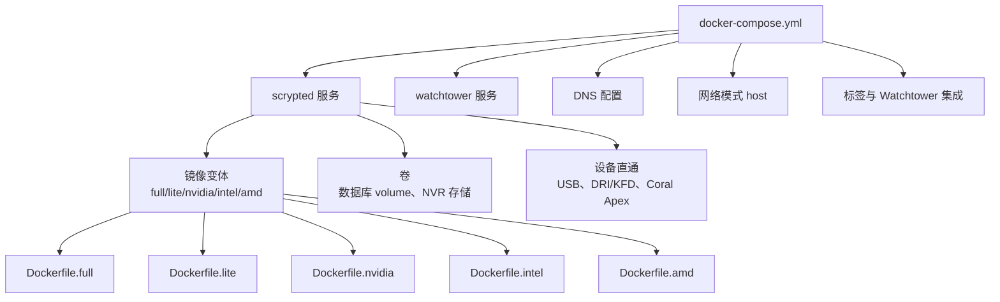
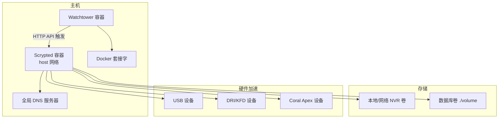
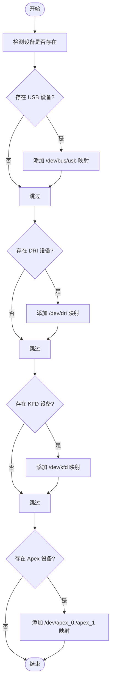
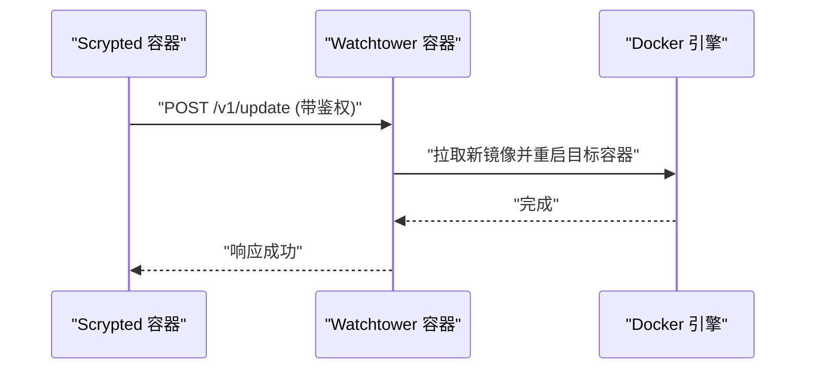
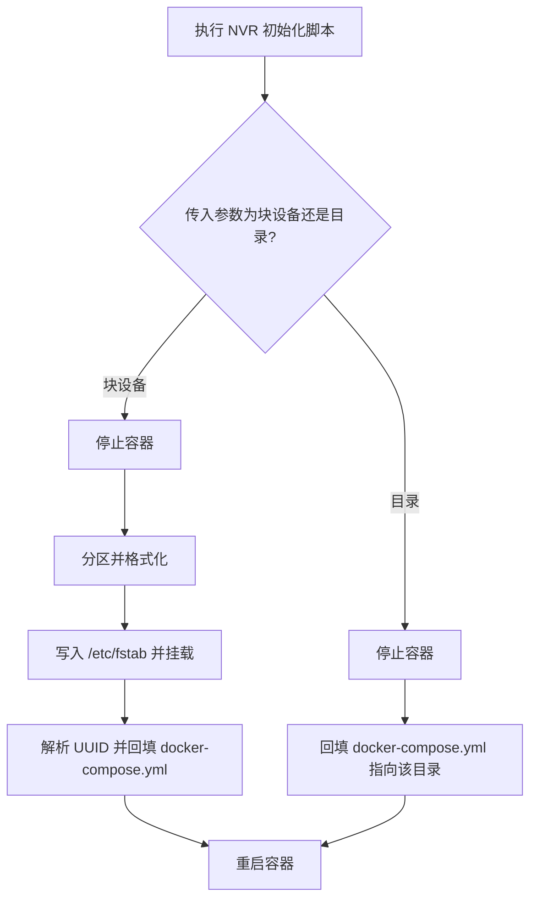
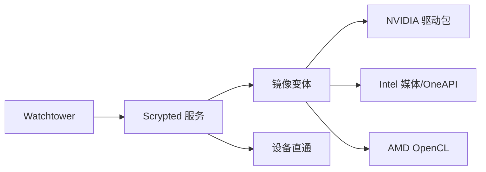

# Docker 容器化部署

<cite>
**本文引用的文件**
- [docker-compose.yml](file://install/docker/docker-compose.yml)
- [Dockerfile.full](file://install/docker/Dockerfile.full)
- [Dockerfile.lite](file://install/docker/Dockerfile.lite)
- [Dockerfile.nvidia](file://install/docker/Dockerfile.nvidia)
- [Dockerfile.intel](file://install/docker/Dockerfile.intel)
- [Dockerfile.amd](file://install/docker/Dockerfile.amd)
- [docker-compose-setup.py](file://install/docker/docker-compose-setup.py)
- [docker-compose-setup.sh](file://install/docker/docker-compose-setup.sh)
- [setup-scrypted-nvr-volume.sh](file://install/docker/setup-scrypted-nvr-volume.sh)
- [install-nvidia-graphics.sh](file://install/docker/install-nvidia-graphics.sh)
- [install-intel-graphics.sh](file://install/docker/install-intel-graphics.sh)
- [install-amd-graphics.sh](file://install/docker/install-amd-graphics.sh)
- [install-intel-npu.sh](file://install/docker/install-intel-npu.sh)
- [install-intel-oneapi.sh](file://install/docker/install-intel-oneapi.sh)
- [docker-build.sh](file://install/docker/docker-build.sh)
- [docker-buildx.sh](file://install/docker/docker-buildx.sh)
- [docker-build-nvidia.sh](file://install/docker/docker-build-nvidia.sh)
- [docker-build-local.sh](file://install/docker/docker-build-local.sh)
</cite>

## 目录
1. [简介](#简介)
2. [项目结构](#项目结构)
3. [核心组件](#核心组件)
4. [架构总览](#架构总览)
5. [详细组件分析](#详细组件分析)
6. [依赖关系分析](#依赖关系分析)
7. [性能考虑](#性能考虑)
8. [故障排除指南](#故障排除指南)
9. [结论](#结论)
10. [附录](#附录)

## 简介
本指南面向在 Docker 中部署 Scrypted 的用户，系统性讲解 docker-compose.yml 的完整配置项，涵盖环境变量、卷挂载、设备直通与硬件加速、镜像变体选择、Watchtower 自动更新、网络模式与 DNS 最佳实践，以及常见问题排查与性能优化建议。内容基于仓库中的安装脚本与 Dockerfile，确保可落地、可复现。

## 项目结构
与 Docker 部署直接相关的目录与文件集中在 install/docker 下，主要由以下部分组成：
- docker-compose.yml：服务定义、环境变量、卷、设备直通、网络模式、DNS、标签与 Watchtower 更新服务
- Dockerfile.*：多变体镜像构建（full、lite、nvidia、intel、amd）
- 安装与配置脚本：自动检测设备直通、NVR 存储初始化、硬件驱动安装脚本
- 构建脚本：本地与跨平台镜像打包流程

图表来源
- [docker-compose.yml:20-169](file://install/docker/docker-compose.yml#L20-L169)
- [Dockerfile.full:1-102](file://install/docker/Dockerfile.full#L1-L102)
- [Dockerfile.lite:1-31](file://install/docker/Dockerfile.lite#L1-L31)
- [Dockerfile.nvidia:1-12](file://install/docker/Dockerfile.nvidia#L1-L12)
- [Dockerfile.intel:1-17](file://install/docker/Dockerfile.intel#L1-L17)
- [Dockerfile.amd:1-8](file://install/docker/Dockerfile.amd#L1-L8)

章节来源
- [docker-compose.yml:1-169](file://install/docker/docker-compose.yml#L1-L169)

## 核心组件
- scrypted 服务：运行 Scrypted 主进程，支持多种镜像变体与设备直通
- watchtower 服务：负责自动检查与触发 Scrypted 的更新（通过 Webhook）
- 卷管理：默认数据库卷与可选的 NVR 录制卷（本地或网络存储）
- 设备直通：USB、DRI/KFD、Coral Apex 等硬件加速设备
- 网络与 DNS：host 模式与全局 DNS 服务器配置
- 环境变量：Webhook 更新授权、NVR 存储路径、Avahi 控制等

章节来源
- [docker-compose.yml:20-169](file://install/docker/docker-compose.yml#L20-L169)

## 架构总览
下图展示容器化部署的整体交互：Scrypted 在 host 网络中运行，通过卷持久化数据，按需直通硬件设备；Watchtower 作为独立容器监听 Docker 套接字并通过 HTTP API 触发更新。

图表来源
- [docker-compose.yml:20-169](file://install/docker/docker-compose.yml#L20-L169)

## 详细组件分析

### docker-compose.yml 配置详解
- 服务与镜像
  - 默认镜像：ghcr.io/koush/scrypted
  - 可切换镜像变体：nvidia、intel、lite
- 环境变量
  - SCRYPTED_WEBHOOK_UPDATE_AUTHORIZATION：用于 Watchtower HTTP API 的鉴权令牌
  - SCRYPTED_WEBHOOK_UPDATE：更新回调地址（与 watchtower 端口映射一致）
  - SCRYPTED_NVR_VOLUME：启用 NVR 插件的录制存储路径（需配合卷挂载）
  - 其他可选：Avahi 控制、LXC 环境标记等
- 卷挂载
  - 数据库卷：默认 ./volume:/server/volume
  - NVR 存储：本地路径或网络卷（CIFS/NFS 示例已内嵌注释）
- 设备直通
  - USB：/dev/bus/usb
  - 硬件解码/OpenCL：/dev/dri
  - AMD GPU：/dev/kfd
  - Coral PCIe：/dev/apex_0、/dev/apex_1
  - 可通过脚本自动检测并写入
- 网络与 DNS
  - network_mode: host
  - dns: 支持自定义全局 DNS（默认 1.1.1.1、8.8.8.8）
- 日志与标签
  - 默认禁用容器日志驱动以减少闪存磨损
  - 为 watchtower 设置 scope 标签以便统一管理

章节来源
- [docker-compose.yml:20-169](file://install/docker/docker-compose.yml#L20-L169)

### 镜像变体与适用场景
- full
  - 特点：包含 Python3.9、Vulkan、Intel OpenCL、Intel NPU、Coral Edge TPU 运行时
  - 适用：需要丰富 AI/视频处理能力的场景
- lite
  - 特点：最小化依赖（仅 Python3、NodeJS）
  - 适用：资源受限或仅需基础功能的场景
- nvidia
  - 特点：基于 nvidia 基础镜像，设置 NVIDIA_VISIBLE_DEVICES=all、NVIDIA_DRIVER_CAPABILITIES=all，并安装 CUDA/CUDNN/CUBLAS
  - 适用：NVIDIA GPU 加速推理与编解码
- intel
  - 特点：集成 Intel OneAPI 库并设置 LD_LIBRARY_PATH
  - 适用：Intel 平台的 OpenVINO、SYCL、MKL 等加速
- amd
  - 特点：安装 AMD OpenCL 运行时
  - 适用：AMD GPU 加速推理

章节来源
- [Dockerfile.full:48-102](file://install/docker/Dockerfile.full#L48-L102)
- [Dockerfile.lite:1-31](file://install/docker/Dockerfile.lite#L1-L31)
- [Dockerfile.nvidia:1-12](file://install/docker/Dockerfile.nvidia#L1-L12)
- [Dockerfile.intel:1-17](file://install/docker/Dockerfile.intel#L1-L17)
- [Dockerfile.amd:1-8](file://install/docker/Dockerfile.amd#L1-L8)

### 设备直通与硬件加速配置
- 自动检测与注入
  - 使用 Python 脚本扫描常见设备路径，自动在 docker-compose.yml 中追加 devices 映射
  - 执行方式：以特权模式运行临时容器，调用脚本进行原地修改
- NVIDIA
  - 变体镜像已设置可见与能力参数
  - 容器内安装 CUDA、CUDNN、CUBLAS；OpenCL ICD 文件在容器外由运行时挂载
- Intel
  - 安装 Intel 媒体驱动与 OpenCL 运行时，手动配置 OneAPI 库路径
- AMD
  - 安装 OpenCL 运行时
- Coral TPU
  - PCIe 设备直通：/dev/apex_0、/dev/apex_1
  - USB 设备直通：/dev/bus/usb

图表来源
- [docker-compose-setup.py:4-45](file://install/docker/docker-compose-setup.py#L4-L45)

章节来源
- [docker-compose-setup.py:1-46](file://install/docker/docker-compose-setup.py#L1-L46)
- [docker-compose-setup.sh:1-10](file://install/docker/docker-compose-setup.sh#L1-L10)
- [install-nvidia-graphics.sh:1-55](file://install/docker/install-nvidia-graphics.sh#L1-L55)
- [install-intel-graphics.sh:1-121](file://install/docker/install-intel-graphics.sh#L1-L121)
- [install-amd-graphics.sh:1-56](file://install/docker/install-amd-graphics.sh#L1-L56)
- [install-intel-npu.sh:1-83](file://install/docker/install-intel-npu.sh#L1-L83)

### Watchtower 自动更新机制
- 触发方式
  - scrypted 服务通过 Webhook 向 Watchtower 的 HTTP API 发起更新请求
  - 需要设置 SCRYPTED_WEBHOOK_UPDATE_AUTHORIZATION 与 SCRYPTED_WEBHOOK_UPDATE
- Watchtower 配置
  - 监听 Docker 套接字
  - 通过 WATCHTOWER_HTTP_API_TOKEN 开启 HTTP API
  - 限定作用域 scope=scrypted，仅管理该应用
  - 端口映射 10444:8080，轮询间隔可配置
- 最佳实践
  - 保持令牌安全，避免泄露
  - 仅在需要时开启 HTTP API，生产环境谨慎暴露端口

图表来源
- [docker-compose.yml:35-36](file://install/docker/docker-compose.yml#L35-L36)
- [docker-compose.yml:142-160](file://install/docker/docker-compose.yml#L142-L160)

章节来源
- [docker-compose.yml:35-36](file://install/docker/docker-compose.yml#L35-L36)
- [docker-compose.yml:142-169](file://install/docker/docker-compose.yml#L142-L169)

### 卷与 NVR 存储配置
- 数据库卷
  - 默认挂载 ./volume 到容器 /server/volume
- NVR 存储
  - 本地：宿主路径映射到 /nvr
  - 网络：CIFS/NFS 示例已内嵌注释
  - 初始化脚本可自动停止容器、格式化磁盘分区、写入 fstab 并回填 docker-compose.yml
- 注意事项
  - NVR 存储需同时设置 SCRYPTED_NVR_VOLUME=/nvr
  - 网络卷需确保权限与可写性

图表来源
- [setup-scrypted-nvr-volume.sh:78-159](file://install/docker/setup-scrypted-nvr-volume.sh#L78-L159)

章节来源
- [docker-compose.yml:58-83](file://install/docker/docker-compose.yml#L58-L83)
- [setup-scrypted-nvr-volume.sh:1-160](file://install/docker/setup-scrypted-nvr-volume.sh#L1-L160)

### 网络模式与 DNS 配置
- 网络模式
  - 推荐 host 模式，便于发现与直通硬件
- DNS
  - 默认使用 1.1.1.1、8.8.8.8，可通过环境变量覆盖
  - 适用于 npm 注册表等网络访问

章节来源
- [docker-compose.yml:121-139](file://install/docker/docker-compose.yml#L121-L139)

### 构建与发布（镜像变体）
- 通用构建
  - 生成 Dockerfile 后分别构建 common 与主镜像
- 多平台构建
  - 使用 buildx 构建多架构镜像（amd64/arm64/armhf）
- NVIDIA 变体
  - 在通用构建基础上追加 nvidia 变体镜像

章节来源
- [docker-build.sh:1-19](file://install/docker/docker-build.sh#L1-L19)
- [docker-buildx.sh:1-8](file://install/docker/docker-buildx.sh#L1-L8)
- [docker-build-nvidia.sh:1-3](file://install/docker/docker-build-nvidia.sh#L1-L3)
- [docker-build-local.sh:1-5](file://install/docker/docker-build-local.sh#L1-L5)

## 依赖关系分析
- 组件耦合
  - scrypted 服务依赖镜像变体提供的运行时与驱动
  - 设备直通依赖宿主机驱动与权限
  - Watchtower 依赖 Docker 套接字与 HTTP API
- 外部依赖
  - NVIDIA：容器运行时与驱动包
  - Intel：媒体驱动、OpenCL、OneAPI
  - AMD：OpenCL 运行时
- 潜在循环依赖
  - 无直接循环，但设备直通与镜像变体需匹配宿主机硬件

图表来源
- [docker-compose.yml:20-169](file://install/docker/docker-compose.yml#L20-L169)
- [Dockerfile.nvidia:1-12](file://install/docker/Dockerfile.nvidia#L1-L12)
- [Dockerfile.intel:1-17](file://install/docker/Dockerfile.intel#L1-L17)
- [Dockerfile.amd:1-8](file://install/docker/Dockerfile.amd#L1-L8)

## 性能考虑
- 日志策略
  - 默认禁用容器日志驱动，避免频繁写入影响寿命；建议使用 Scrypted 内部内存日志
- 网络与 DNS
  - host 模式降低网络开销；全局 DNS 提升外部依赖解析稳定性
- 硬件直通
  - 仅直通必要设备，避免不必要的权限与干扰
- 镜像选择
  - 仅在需要时启用 full 或 nvidia 变体，以减少镜像体积与启动时间

## 故障排除指南
- 设备未被识别
  - 使用自动检测脚本在特权模式下运行，确认 devices 已写入 docker-compose.yml
- NVIDIA 驱动异常
  - 确认宿主机已安装 nvidia-container-toolkit；容器内安装 CUDA/CUDNN/CUBLAS
  - OpenCL ICD 文件由运行时挂载，无需在镜像中强制存在
- Intel 媒体/OneAPI 问题
  - 检查媒体驱动与 OpenCL 是否正确安装；确认 LD_LIBRARY_PATH 已设置
- AMD OpenCL 问题
  - 确认 OpenCL 运行时安装成功
- Watchtower 无法更新
  - 检查 HTTP API 端口映射与令牌；确认 scope 标签一致
- DNS 解析失败
  - 更换为 1.1.1.1/8.8.8.8 或自定义 DNS；确认容器网络模式

章节来源
- [docker-compose-setup.sh:1-10](file://install/docker/docker-compose-setup.sh#L1-L10)
- [docker-compose-setup.py:1-46](file://install/docker/docker-compose-setup.py#L1-L46)
- [install-nvidia-graphics.sh:1-55](file://install/docker/install-nvidia-graphics.sh#L1-L55)
- [install-intel-graphics.sh:1-121](file://install/docker/install-intel-graphics.sh#L1-L121)
- [install-amd-graphics.sh:1-56](file://install/docker/install-amd-graphics.sh#L1-L56)
- [install-intel-oneapi.sh:1-19](file://install/docker/install-intel-oneapi.sh#L1-L19)
- [docker-compose.yml:142-169](file://install/docker/docker-compose.yml#L142-L169)

## 结论
通过 docker-compose.yml 的合理配置与镜像变体选择，Scrypted 可在不同硬件平台上实现稳定、高效的容器化部署。结合 Watchtower 的自动更新、host 网络与全局 DNS 的最佳实践，以及设备直通与驱动安装脚本，可快速搭建生产级监控与自动化平台。

## 附录
- 快速对照清单
  - 选择镜像变体：full/lite/nvidia/intel/amd
  - 设置 Webhook 更新：SCRYPTED_WEBHOOK_UPDATE_AUTHORIZATION、SCRYPTED_WEBHOOK_UPDATE
  - 配置 NVR：SCRYPTED_NVR_VOLUME 与卷挂载
  - 设备直通：USB、DRI/KFD、Coral Apex
  - 网络：network_mode: host；DNS：SCRYPTED_DNS_SERVER_0/1
  - 自动更新：watchtower 端口映射 10444:8080，scope=scrypted