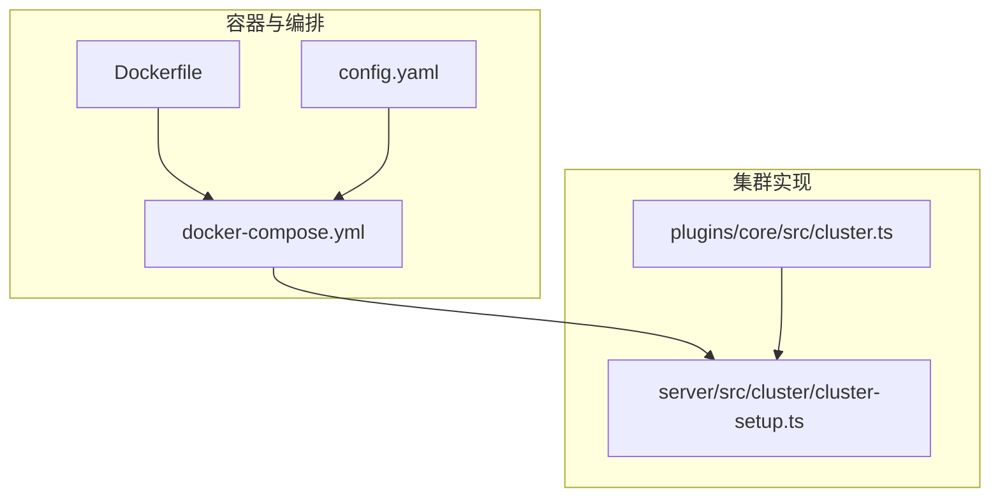
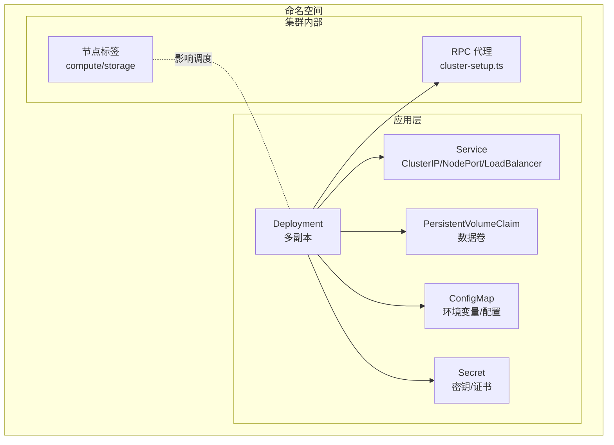
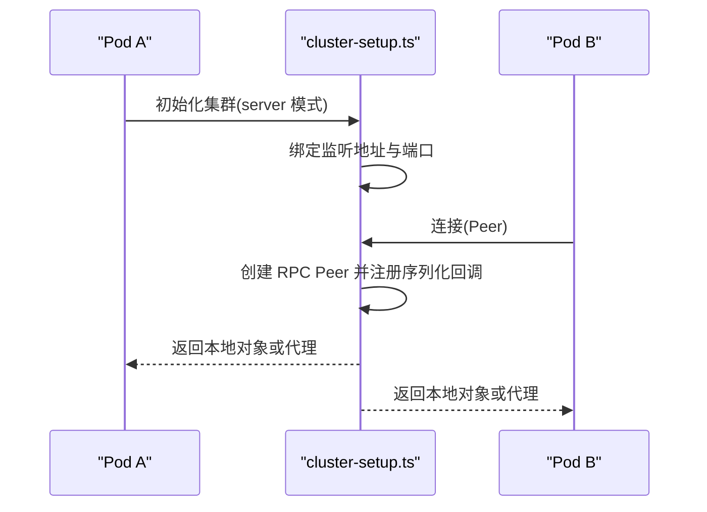
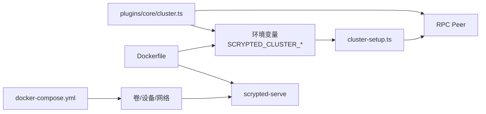

# Kubernetes 集群部署

<cite>
**本文引用的文件**
- [install/docker/docker-compose.yml](file://install/docker/docker-compose.yml)
- [install/docker/Dockerfile](file://install/docker/Dockerfile)
- [plugins/core/src/cluster.ts](file://plugins/core/src/cluster.ts)
- [server/src/cluster/cluster-setup.ts](file://server/src/cluster/cluster-setup.ts)
- [install/config.yaml](file://install/config.yaml)
- [repository.yaml](file://repository.yaml)
</cite>

## 目录
1. [简介](#简介)
2. [项目结构](#项目结构)
3. [核心组件](#核心组件)
4. [架构总览](#架构总览)
5. [详细组件分析](#详细组件分析)
6. [依赖关系分析](#依赖关系分析)
7. [性能考量](#性能考量)
8. [故障排除指南](#故障排除指南)
9. [结论](#结论)
10. [附录](#附录)

## 简介
本指南面向在 Kubernetes 集群中部署 Scrypted 的用户，提供从资源清单到高可用、网络与存储配置、集群发现与节点管理、滚动更新与版本管理、监控与日志集成，以及运维最佳实践的完整说明。文档以仓库内现有配置与集群实现为依据，结合 Kubernetes 常见实践，帮助您在生产环境中稳定运行 Scrypted。

## 项目结构
Scrypted 在本仓库中提供了容器化与集群能力的关键参考：
- 容器化与编排：Dockerfile 与 docker-compose.yml 展示了镜像构建、启动命令、环境变量与卷挂载方式，可直接映射到 Kubernetes Deployment/StatefulSet 的配置。
- 集群模式：server 与 plugins 提供了集群初始化、对象代理、标签与工作节点管理等能力，可作为 Kubernetes 多副本调度与亲和性的设计基础。

图表来源
- [install/docker/Dockerfile:1-22](file://install/docker/Dockerfile#L1-L22)
- [install/docker/docker-compose.yml:1-169](file://install/docker/docker-compose.yml#L1-L169)
- [plugins/core/src/cluster.ts:1-163](file://plugins/core/src/cluster.ts#L1-L163)
- [server/src/cluster/cluster-setup.ts:1-498](file://server/src/cluster/cluster-setup.ts#L1-L498)

章节来源
- [install/docker/Dockerfile:1-22](file://install/docker/Dockerfile#L1-L22)
- [install/docker/docker-compose.yml:1-169](file://install/docker/docker-compose.yml#L1-L169)
- [plugins/core/src/cluster.ts:1-163](file://plugins/core/src/cluster.ts#L1-L163)
- [server/src/cluster/cluster-setup.ts:1-498](file://server/src/cluster/cluster-setup.ts#L1-L498)

## 核心组件
- 集群模式与工作节点管理：通过插件提供的 ClusterCore 设备，可以为每个工作节点设置标签（如 storage、compute、compute.preferred 及推理框架标签），并支持重启生效。
- 集群初始化与 RPC 对象代理：server 实现了集群监听、连接建立、对象序列化与跨节点代理，确保多副本间的服务可达与一致性。
- 容器镜像与启动参数：Dockerfile 指定基础镜像、安装流程与启动命令；docker-compose.yml 提供环境变量、卷、设备与网络模式等关键配置。

章节来源
- [plugins/core/src/cluster.ts:27-101](file://plugins/core/src/cluster.ts#L27-L101)
- [server/src/cluster/cluster-setup.ts:336-399](file://server/src/cluster/cluster-setup.ts#L336-L399)
- [install/docker/Dockerfile:1-22](file://install/docker/Dockerfile#L1-L22)
- [install/docker/docker-compose.yml:20-169](file://install/docker/docker-compose.yml#L20-L169)

## 架构总览
下图展示了 Scrypted 在 Kubernetes 中的典型部署形态：Deployment 管理多副本，Service 暴露服务，ConfigMap/Secret 注入配置，PVC 提供持久化存储。集群模式下，Pod 内部通过随机端口进行 RPC 通信，实现跨 Pod 的对象代理与负载分担。

图表来源
- [server/src/cluster/cluster-setup.ts:336-399](file://server/src/cluster/cluster-setup.ts#L336-L399)
- [plugins/core/src/cluster.ts:77-96](file://plugins/core/src/cluster.ts#L77-L96)
- [install/docker/docker-compose.yml:20-169](file://install/docker/docker-compose.yml#L20-L169)

## 详细组件分析

### 集群模式与高可用
- 工作节点标签与调度
  - 通过 ClusterCore 设置标签（如 storage、compute、compute.preferred、@scrypted/coreml 等），影响调度与任务分配。
  - 建议在 Kubernetes 中使用节点选择器或亲和性（nodeAffinity/podAntiAffinity）将不同角色的工作节点隔离，避免资源争用。
- 集群初始化与 RPC 对象代理
  - server 在启动时根据环境变量决定集群模式（server/client），并在指定地址与端口监听，建立双向 RPC 连接。
  - 对象序列化时生成稳定的 proxyId，并在同节点内优先使用 IPC 快路径，跨节点则通过 TCP 连接转发。
- 多副本部署建议
  - 使用 Deployment 管理副本数，结合 podAntiAffinity 将同一角色的 Pod 分散到不同节点。
  - 为计算密集型与存储型工作负载分别打上标签并配置亲和/反亲和，确保资源隔离。

图表来源
- [server/src/cluster/cluster-setup.ts:336-399](file://server/src/cluster/cluster-setup.ts#L336-L399)
- [server/src/cluster/cluster-setup.ts:259-300](file://server/src/cluster/cluster-setup.ts#L259-L300)

章节来源
- [plugins/core/src/cluster.ts:77-96](file://plugins/core/src/cluster.ts#L77-L96)
- [server/src/cluster/cluster-setup.ts:403-462](file://server/src/cluster/cluster-setup.ts#L403-L462)

### 网络配置
- Service 类型选择
  - ClusterIP：默认，仅集群内部访问。
  - NodePort：便于外部直连调试与小规模部署。
  - LoadBalancer：对接云厂商负载均衡，适合生产高可用。
- Ingress 配置
  - 结合 Ingress 控制器暴露 Web 界面与 API，建议启用 TLS 与限流。
- 端口与协议
  - Web 界面端口可参考 docker-compose 中的暴露端口约定；RTSP/媒体流端口需单独规划并放通防火墙。
- 网络策略
  - 使用 NetworkPolicy 限制 Pod 间通信，仅开放必要端口，降低攻击面。

章节来源
- [install/docker/docker-compose.yml:120-169](file://install/docker/docker-compose.yml#L120-L169)

### 存储配置
- 存储类与动态供应
  - 使用 StorageClass 动态创建 PV，建议为日志与数据库选择高可靠存储（如 SSD、同步复制）。
- 卷挂载与容量规划
  - 数据目录与 NVR 录像目录应分离，分别设置容量与快照策略。
  - 参考 docker-compose 的卷挂载方式，映射到 PVC，确保权限与路径一致。
- 备份与迁移
  - 利用快照与备份工具定期备份关键数据卷，验证恢复流程。

章节来源
- [install/docker/docker-compose.yml:58-91](file://install/docker/docker-compose.yml#L58-L91)

### 集群发现与节点管理
- 标签体系
  - 使用 compute/storage/compute.preferred 等标签区分角色；推理框架标签用于调度特定硬件加速插件。
- 发现机制
  - 在 Kubernetes 中可通过 Service DNS 或 Headless Service 实现服务发现；Pod 内部通过 RPC 对象代理完成跨节点调用。
- 节点亲和性
  - 为不同标签的 Pod 配置 nodeAffinity，避免跨节点访问造成延迟。

章节来源
- [plugins/core/src/cluster.ts:77-96](file://plugins/core/src/cluster.ts#L77-L96)
- [server/src/cluster/cluster-setup.ts:403-462](file://server/src/cluster/cluster-setup.ts#L403-L462)

### 滚动更新与版本管理
- 更新策略
  - 使用 RollingUpdate，设置最大不可用与最大同时升级数，保证业务连续性。
- 版本通道
  - 参考 docker-compose 中的镜像标签策略，结合 CI/CD 自动化发布。
- 回滚与灰度
  - 支持回滚到上一个稳定版本；灰度发布可先在少量节点上验证。

章节来源
- [install/docker/docker-compose.yml:50-56](file://install/docker/docker-compose.yml#L50-L56)
- [plugins/core/src/main.ts:58-96](file://plugins/core/src/main.ts#L58-L96)

### 监控与日志
- 指标采集
  - 部署 Prometheus Operator 与 Grafana，抓取容器指标与应用指标。
- 日志聚合
  - 使用 Fluent Bit/Fluentd 收集容器 stdout/stderr，输出至集中式日志系统（如 Elasticsearch/OpenSearch）。
- 健康检查
  - 配置 readiness/liveness 探针，确保 Pod 在就绪后才接收流量。

章节来源
- [install/docker/docker-compose.yml:123-131](file://install/docker/docker-compose.yml#L123-L131)

## 依赖关系分析
- 集群实现依赖
  - server 的 cluster-setup.ts 依赖环境变量（如 SCRYPTED_CLUSTER_MODE、SCRYPTED_CLUSTER_SECRET、SCRYPTED_CLUSTER_ADDRESS）来决定监听地址与端口。
  - plugins/core 的 cluster.ts 通过系统组件获取 cluster-fork，读写 .env 并重启工作节点，实现标签变更的生效。
- 容器化依赖
  - Dockerfile 基于官方基础镜像，通过 npx 安装并启动服务；docker-compose.yml 提供环境变量、卷与设备映射。

图表来源
- [server/src/cluster/cluster-setup.ts:403-462](file://server/src/cluster/cluster-setup.ts#L403-L462)
- [plugins/core/src/cluster.ts:103-154](file://plugins/core/src/cluster.ts#L103-L154)
- [install/docker/Dockerfile:1-22](file://install/docker/Dockerfile#L1-L22)
- [install/docker/docker-compose.yml:20-169](file://install/docker/docker-compose.yml#L20-L169)

章节来源
- [server/src/cluster/cluster-setup.ts:403-462](file://server/src/cluster/cluster-setup.ts#L403-L462)
- [plugins/core/src/cluster.ts:103-154](file://plugins/core/src/cluster.ts#L103-L154)
- [install/docker/Dockerfile:1-22](file://install/docker/Dockerfile#L1-L22)
- [install/docker/docker-compose.yml:20-169](file://install/docker/docker-compose.yml#L20-L169)

## 性能考量
- 资源配额与限制
  - 为 CPU/内存设置 requests/limits，避免资源抢占；媒体转码与 AI 推理对 GPU/TPU 有额外要求时，启用设备直通与资源配额。
- 网络与存储
  - 使用高性能存储与低延迟网络；媒体流尽量走专用网络或开启 QoS。
- 调度优化
  - 合理使用亲和性与反亲和性，避免热点集中；为高优先级任务预留资源池。

## 故障排除指南
- 集群模式无法连接
  - 检查 SCRYPTED_CLUSTER_MODE、SCRYPTED_CLUSTER_SECRET 是否正确设置；确认监听地址与端口未被占用。
- 对象代理失败
  - 查看 RPC Peer 的连接状态与超时日志；确认对象序列化后的 proxyId 与哈希一致。
- 卷挂载异常
  - 检查 StorageClass、PVC 绑定状态与权限；核对路径与只读/读写属性。
- 网络连通性问题
  - 使用 NetworkPolicy 放行必要端口；确认 Service/Ingress 配置与防火墙规则。
- 日志噪声与存储压力
  - 关闭容器日志驱动或调整大小限制；使用应用内日志轮转策略。

章节来源
- [server/src/cluster/cluster-setup.ts:403-462](file://server/src/cluster/cluster-setup.ts#L403-L462)
- [install/docker/docker-compose.yml:123-131](file://install/docker/docker-compose.yml#L123-L131)

## 结论
通过将 Scrypted 的容器化配置与集群实现映射到 Kubernetes，可以在不牺牲功能的前提下实现高可用、可扩展与可观测的部署。建议结合本文的资源清单模板、调度策略与运维规范，在生产环境中逐步落地并持续优化。

## 附录
- 参考配置文件
  - [Dockerfile:1-22](file://install/docker/Dockerfile#L1-L22)
  - [docker-compose.yml:1-169](file://install/docker/docker-compose.yml#L1-L169)
  - [config.yaml:1-49](file://install/config.yaml#L1-L49)
  - [repository.yaml:1-4](file://repository.yaml#L1-L4)