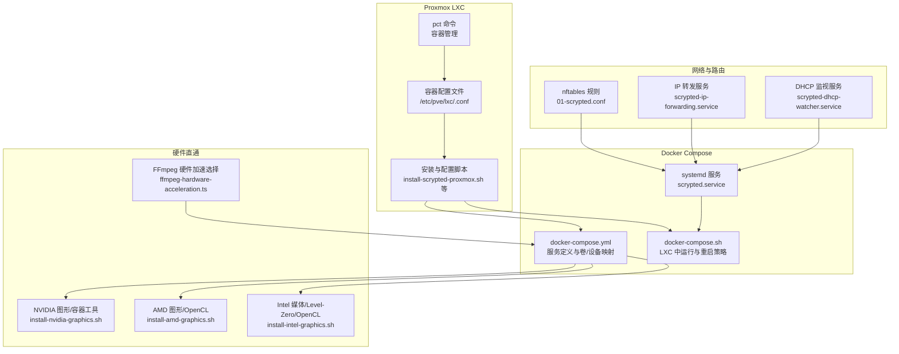
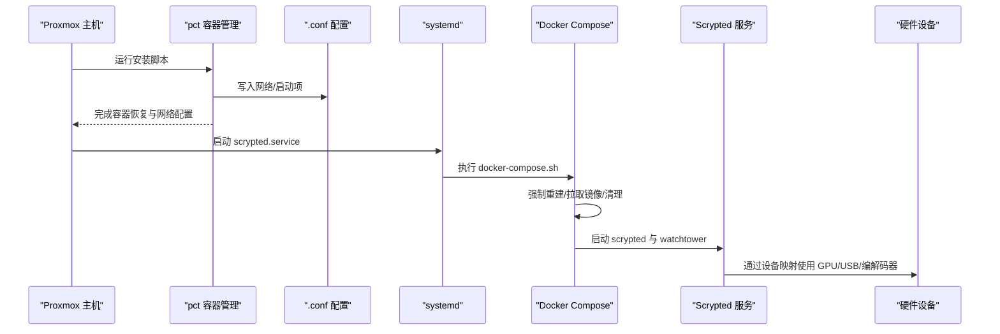
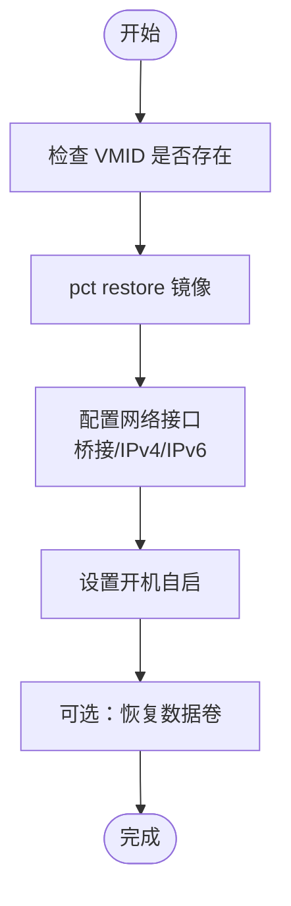
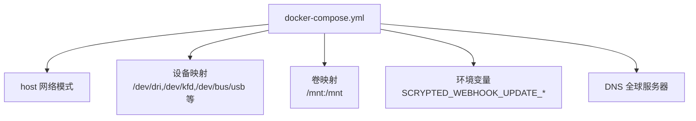
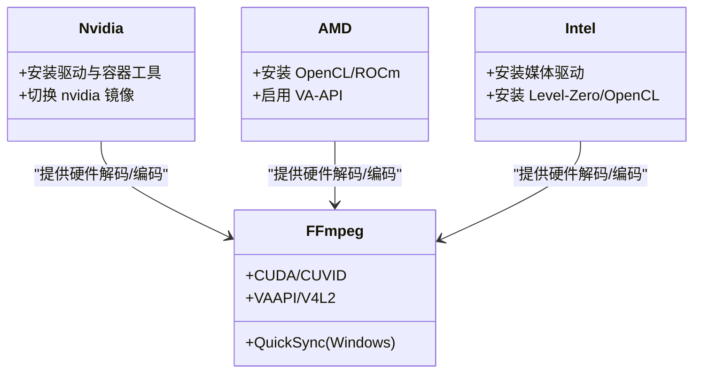
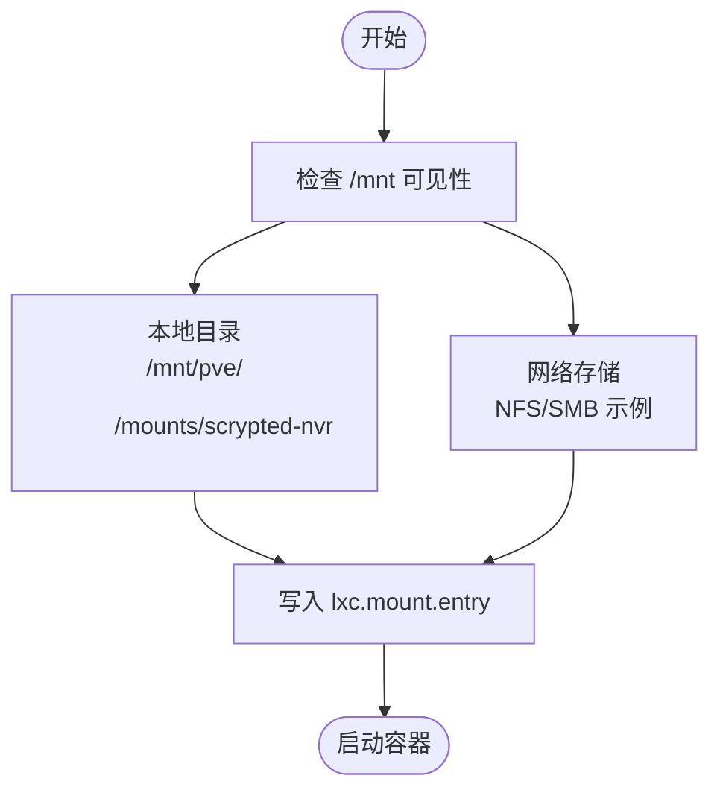
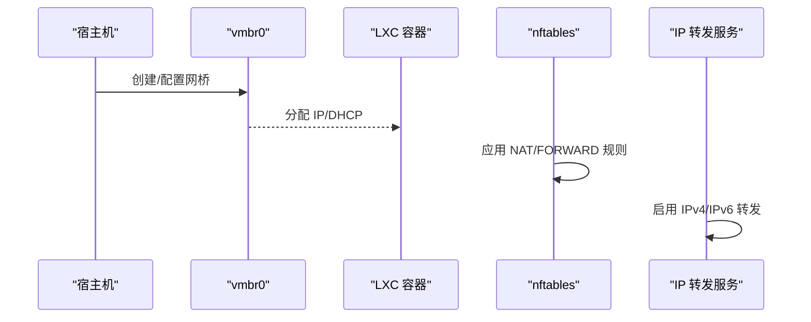
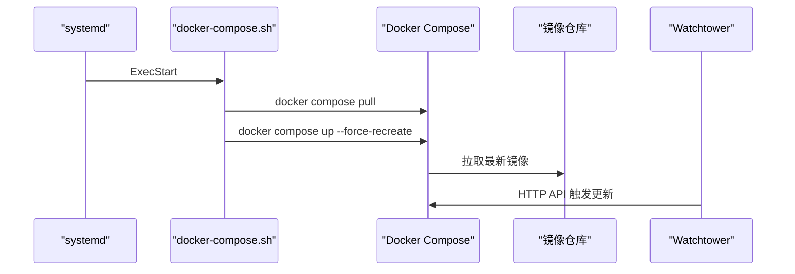
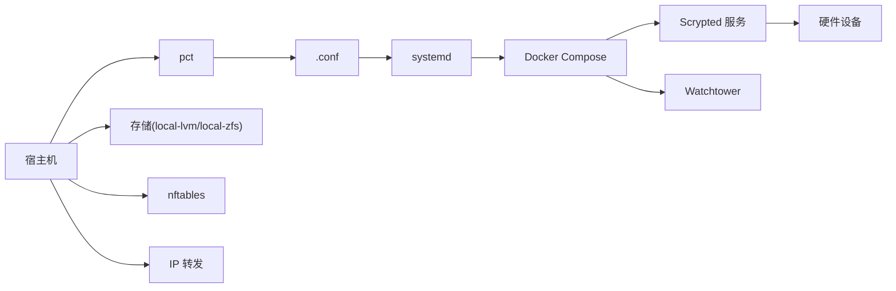

# Proxmox 虚拟化部署

<cite>
**本文引用的文件**
- [install/proxmox/install-scrypted-proxmox.sh](file://install/proxmox/install-scrypted-proxmox.sh)
- [install/proxmox/docker-compose.sh](file://install/proxmox/docker-compose.sh)
- [install/proxmox/setup-scrypted-nvr-volume.sh](file://install/proxmox/setup-scrypted-nvr-volume.sh)
- [install/docker/docker-compose.yml](file://install/docker/docker-compose.yml)
- [install/docker/install-scrypted-docker-compose.sh](file://install/docker/install-scrypted-docker-compose.sh)
- [install/docker/setup-scrypted-nvr-volume.sh](file://install/docker/setup-scrypted-nvr-volume.sh)
- [install/docker/install-nvidia-graphics.sh](file://install/docker/install-nvidia-graphics.sh)
- [install/docker/install-amd-graphics.sh](file://install/docker/install-amd-graphics.sh)
- [install/docker/install-intel-graphics.sh](file://install/docker/install-intel-graphics.sh)
- [common/src/ffmpeg-hardware-acceleration.ts](file://common/src/ffmpeg-hardware-acceleration.ts)
- [install/docker/router/scrypted.service](file://install/docker/router/scrypted.service)
- [install/docker/router/01-scrypted.conf](file://install/docker/router/01-scrypted.conf)
- [install/docker/router/scrypted-dhcp-watcher.service](file://install/docker/router/scrypted-dhcp-watcher.service)
- [install/docker/router/scrypted-ip-forwarding.service](file://install/docker/router/scrypted-ip-forwarding.service)
</cite>

## 目录
1. [简介](#简介)
2. [项目结构](#项目结构)
3. [核心组件](#核心组件)
4. [架构总览](#架构总览)
5. [详细组件分析](#详细组件分析)
6. [依赖关系分析](#依赖关系分析)
7. [性能考虑](#性能考虑)
8. [故障排除指南](#故障排除指南)
9. [结论](#结论)
10. [附录](#附录)

## 简介
本指南面向在 Proxmox VE 上部署 Scrypted 的用户，覆盖 LXC 容器创建与配置、特权模式、CPU/内存/存储分配、硬件直通（GPU、USB、硬件编解码器）、网络配置（桥接、MACVTAP、硬件虚拟化）、Docker Compose 在 LXC 中的特殊要求与限制、存储最佳实践（本地、NFS、SMB）以及性能优化与监控建议，并提供常见问题排查。

## 项目结构
围绕 Proxmox 部署的关键脚本与配置位于 install/proxmox 与 install/docker 目录中：
- install/proxmox：包含 LXC 安装、容器恢复、NVR 存储挂载等脚本
- install/docker：包含 Docker Compose 模板、自动安装脚本、硬件直通安装脚本、路由器相关 systemd/nftables 配置

图表来源
- [install/proxmox/install-scrypted-proxmox.sh:1-311](file://install/proxmox/install-scrypted-proxmox.sh#L1-L311)
- [install/docker/docker-compose.yml:1-169](file://install/docker/docker-compose.yml#L1-L169)
- [install/proxmox/docker-compose.sh:1-41](file://install/proxmox/docker-compose.sh#L1-L41)
- [install/docker/install-scrypted-docker-compose.sh:1-190](file://install/docker/install-scrypted-docker-compose.sh#L1-L190)
- [install/docker/install-nvidia-graphics.sh:1-55](file://install/docker/install-nvidia-graphics.sh#L1-L55)
- [install/docker/install-amd-graphics.sh:1-56](file://install/docker/install-amd-graphics.sh#L1-L56)
- [install/docker/install-intel-graphics.sh:1-121](file://install/docker/install-intel-graphics.sh#L1-L121)
- [common/src/ffmpeg-hardware-acceleration.ts:1-147](file://common/src/ffmpeg-hardware-acceleration.ts#L1-L147)
- [install/docker/router/01-scrypted.conf:1-56](file://install/docker/router/01-scrypted.conf#L1-L56)
- [install/docker/router/scrypted-ip-forwarding.service:1-18](file://install/docker/router/scrypted-ip-forwarding.service#L1-L18)
- [install/docker/router/scrypted-dhcp-watcher.service:1-12](file://install/docker/router/scrypted-dhcp-watcher.service#L1-L12)
- [install/docker/router/scrypted.service:1-25](file://install/docker/router/scrypted.service#L1-L25)

章节来源
- [install/proxmox/install-scrypted-proxmox.sh:1-311](file://install/proxmox/install-scrypted-proxmox.sh#L1-L311)
- [install/docker/docker-compose.yml:1-169](file://install/docker/docker-compose.yml#L1-L169)

## 核心组件
- LXC 容器安装与网络初始化：通过 pct 恢复镜像、设置网络、开机自启、可选恢复数据卷
- Docker Compose 在 LXC 中的运行：systemd 管理、强制重建、清理策略、更新通道
- 硬件直通与编解码器：NVIDIA/AMD/Intel 图形与 OpenCL/Level-Zero 支持，FFmpeg 硬件加速参数选择
- 存储配置：本地目录或网络存储（NFS/SMB），容器内挂载点与权限
- 网络与路由：host 网络模式、nftables 规则、IP 转发、DHCP 监视

章节来源
- [install/proxmox/install-scrypted-proxmox.sh:157-184](file://install/proxmox/install-scrypted-proxmox.sh#L157-L184)
- [install/proxmox/docker-compose.sh:13-41](file://install/proxmox/docker-compose.sh#L13-L41)
- [install/docker/docker-compose.yml:20-169](file://install/docker/docker-compose.yml#L20-L169)
- [install/docker/install-scrypted-docker-compose.sh:81-177](file://install/docker/install-scrypted-docker-compose.sh#L81-L177)
- [install/proxmox/setup-scrypted-nvr-volume.sh:1-75](file://install/proxmox/setup-scrypted-nvr-volume.sh#L1-L75)

## 架构总览
下图展示从宿主到容器、再到服务与硬件直通的整体流程：

图表来源
- [install/proxmox/install-scrypted-proxmox.sh:129-184](file://install/proxmox/install-scrypted-proxmox.sh#L129-L184)
- [install/proxmox/docker-compose.sh:26-36](file://install/proxmox/docker-compose.sh#L26-L36)
- [install/docker/router/scrypted.service:1-25](file://install/docker/router/scrypted.service#L1-L25)

## 详细组件分析

### LXC 容器创建与配置
- 使用官方备份镜像通过 pct 恢复，自动设置网络接口、开机自启
- 可选恢复：保留数据卷，移动额外卷至临时备份容器，再迁移回目标容器
- 存储选择：优先 local-lvm 或 local-zfs；若无可用存储需手动指定

图表来源
- [install/proxmox/install-scrypted-proxmox.sh:114-184](file://install/proxmox/install-scrypted-proxmox.sh#L114-L184)

章节来源
- [install/proxmox/install-scrypted-proxmox.sh:114-184](file://install/proxmox/install-scrypted-proxmox.sh#L114-L184)

### Docker Compose 在 LXC 的特殊配置与限制
- host 网络模式：便于直通设备与端口转发
- 设备映射：/dev/dri、/dev/kfd、/dev/apex*、/dev/bus/usb 等按需启用
- 卷映射：/mnt 映射到容器内 /mnt，确保 NVR 录制目录可见
- LXC 特性：注释掉 restart: unless-stopped，由 systemd 管理重启
- 更新机制：watchtower 通过 HTTP API 触发，配合 webhook 环境变量

图表来源
- [install/docker/docker-compose.yml:20-169](file://install/docker/docker-compose.yml#L20-L169)

章节来源
- [install/docker/docker-compose.yml:20-169](file://install/docker/docker-compose.yml#L20-L169)
- [install/docker/install-scrypted-docker-compose.sh:81-177](file://install/docker/install-scrypted-docker-compose.sh#L81-L177)

### 硬件直通与编解码器配置
- NVIDIA：安装 nvidia-container-toolkit 与驱动，镜像切换为 nvidia 版本
- AMD：安装 OpenCL/ROCm 组件，启用 VA-API
- Intel：安装媒体驱动与 Level-Zero/OpenCL，兼容较新内核
- FFmpeg 参数：根据平台自动选择 CUDA/CUVID/VAAPI/V4L2 等硬件加速方案

图表来源
- [install/docker/install-nvidia-graphics.sh:1-55](file://install/docker/install-nvidia-graphics.sh#L1-L55)
- [install/docker/install-amd-graphics.sh:1-56](file://install/docker/install-amd-graphics.sh#L1-L56)
- [install/docker/install-intel-graphics.sh:1-121](file://install/docker/install-intel-graphics.sh#L1-L121)
- [common/src/ffmpeg-hardware-acceleration.ts:49-84](file://common/src/ffmpeg-hardware-acceleration.ts#L49-L84)

章节来源
- [install/docker/install-nvidia-graphics.sh:1-55](file://install/docker/install-nvidia-graphics.sh#L1-L55)
- [install/docker/install-amd-graphics.sh:1-56](file://install/docker/install-amd-graphics.sh#L1-L56)
- [install/docker/install-intel-graphics.sh:1-121](file://install/docker/install-intel-graphics.sh#L1-L121)
- [common/src/ffmpeg-hardware-acceleration.ts:49-84](file://common/src/ffmpeg-hardware-acceleration.ts#L49-L84)

### 存储配置最佳实践
- 本地存储：使用 /mnt 下的子目录作为 NVR 存储，确保容器内可见
- 网络存储：NFS/SMB 示例在 docker-compose.yml 中提供，注意权限与持久化
- 挂载点可见性：容器内 /mnt 必须映射，否则录制目录不可见
- 恢复流程：安装脚本会尝试迁移现有卷，但额外卷可能需要重新添加

图表来源
- [install/proxmox/setup-scrypted-nvr-volume.sh:55-75](file://install/proxmox/setup-scrypted-nvr-volume.sh#L55-L75)
- [install/docker/docker-compose.yml:58-83](file://install/docker/docker-compose.yml#L58-L83)

章节来源
- [install/proxmox/setup-scrypted-nvr-volume.sh:1-75](file://install/proxmox/setup-scrypted-nvr-volume.sh#L1-L75)
- [install/docker/docker-compose.yml:58-83](file://install/docker/docker-compose.yml#L58-L83)

### 网络配置选项
- 桥接网络：默认桥接到 vmbr0，支持 DHCP 与 IPv6 自动配置
- MACVTAP：可在宿主层面创建 MACVTAP 接口后在 LXC 中绑定
- 硬件虚拟化：启用 host 网络模式以获得最佳性能与直通能力
- 路由与防火墙：nftables 表用于 NAT 与 FORWARD 控制，IP 转发服务确保 IPv4/IPv6 转发

图表来源
- [install/proxmox/install-scrypted-proxmox.sh:157-164](file://install/proxmox/install-scrypted-proxmox.sh#L157-L164)
- [install/docker/router/01-scrypted.conf:1-56](file://install/docker/router/01-scrypted.conf#L1-L56)
- [install/docker/router/scrypted-ip-forwarding.service:1-18](file://install/docker/router/scrypted-ip-forwarding.service#L1-L18)

章节来源
- [install/proxmox/install-scrypted-proxmox.sh:157-164](file://install/proxmox/install-scrypted-proxmox.sh#L157-L164)
- [install/docker/router/01-scrypted.conf:1-56](file://install/docker/router/01-scrypted.conf#L1-L56)
- [install/docker/router/scrypted-ip-forwarding.service:1-18](file://install/docker/router/scrypted-ip-forwarding.service#L1-L18)

### Docker Compose 在 LXC 的运行与维护
- systemd 管理：scrypted.service 执行 docker-compose.sh
- 强制重建：每次启动都会强制重建，确保配置一致性
- 清理策略：运行时清理容器与镜像，避免磁盘膨胀
- 更新通道：watchtower 通过 HTTP API 触发更新，配合 webhook 环境变量

图表来源
- [install/docker/router/scrypted.service:1-25](file://install/docker/router/scrypted.service#L1-L25)
- [install/proxmox/docker-compose.sh:26-36](file://install/proxmox/docker-compose.sh#L26-L36)
- [install/docker/docker-compose.yml:141-169](file://install/docker/docker-compose.yml#L141-L169)

章节来源
- [install/docker/router/scrypted.service:1-25](file://install/docker/router/scrypted.service#L1-L25)
- [install/proxmox/docker-compose.sh:13-41](file://install/proxmox/docker-compose.sh#L13-L41)
- [install/docker/docker-compose.yml:141-169](file://install/docker/docker-compose.yml#L141-L169)

## 依赖关系分析
- 宿主依赖：pct、lxc.conf、存储后端（local-lvm/local-zfs）
- 容器依赖：Docker、Docker Compose、必要设备与驱动
- 服务依赖：systemd、watchtower、nftables、IP 转发

图表来源
- [install/proxmox/install-scrypted-proxmox.sh:114-184](file://install/proxmox/install-scrypted-proxmox.sh#L114-L184)
- [install/docker/router/01-scrypted.conf:1-56](file://install/docker/router/01-scrypted.conf#L1-L56)
- [install/docker/router/scrypted-ip-forwarding.service:1-18](file://install/docker/router/scrypted-ip-forwarding.service#L1-L18)

章节来源
- [install/proxmox/install-scrypted-proxmox.sh:114-184](file://install/proxmox/install-scrypted-proxmox.sh#L114-L184)
- [install/docker/router/01-scrypted.conf:1-56](file://install/docker/router/01-scrypted.conf#L1-L56)
- [install/docker/router/scrypted-ip-forwarding.service:1-18](file://install/docker/router/scrypted-ip-forwarding.service#L1-L18)

## 性能考虑
- 硬件直通：优先 host 网络模式与设备映射，减少虚拟化开销
- 编解码器：根据 GPU/平台选择最优硬件加速路径（CUDA/CUVID/VAAPI/V4L2）
- 存储：本地 SSD/LVM 性能更佳；网络存储建议使用低延迟局域网与合适挂载选项
- 日志：禁用容器日志驱动，改用 Scrypted 内部日志，降低闪存磨损
- 更新：watchtower 自动更新，结合强制重建保证状态一致

章节来源
- [common/src/ffmpeg-hardware-acceleration.ts:49-84](file://common/src/ffmpeg-hardware-acceleration.ts#L49-L84)
- [install/docker/docker-compose.yml:123-131](file://install/docker/docker-compose.yml#L123-L131)
- [install/docker/docker-compose.yml:141-169](file://install/docker/docker-compose.yml#L141-L169)

## 故障排除指南
- pct 命令未找到：确认在宿主机执行安装脚本
- 存储设备无效：尝试 local-lvm 或 local-zfs；或手动指定 --storage
- 网络配置失败：检查 vmbr0 与接口状态；确认 pct set 成功
- 数据卷不可见：确保挂载点位于 /mnt 下，否则容器内不可见
- NVIDIA 驱动/容器工具：先安装 nvidia-container-toolkit，再切换镜像
- Intel/AMD 驱动：按脚本安装对应组件，必要时手动修复依赖
- watchtower 不工作：脚本中已禁用自动轮询，可通过 webhook 触发

章节来源
- [install/proxmox/install-scrypted-proxmox.sh:2-7](file://install/proxmox/install-scrypted-proxmox.sh#L2-L7)
- [install/proxmox/install-scrypted-proxmox.sh:132-155](file://install/proxmox/install-scrypted-proxmox.sh#L132-L155)
- [install/proxmox/install-scrypted-proxmox.sh:235-247](file://install/proxmox/install-scrypted-proxmox.sh#L235-L247)
- [install/docker/install-scrypted-docker-compose.sh:101-117](file://install/docker/install-scrypted-docker-compose.sh#L101-L117)
- [install/docker/install-intel-graphics.sh:29-61](file://install/docker/install-intel-graphics.sh#L29-L61)
- [install/docker/install-amd-graphics.sh:30-52](file://install/docker/install-amd-graphics.sh#L30-L52)

## 结论
通过上述脚本与配置，可在 Proxmox LXC 中高效部署 Scrypted，实现硬件直通、灵活存储与稳定网络。建议优先采用 host 网络模式与设备映射，合理规划存储与日志策略，并利用 systemd 与 watchtower 实现自动化运维。

## 附录
- 安装脚本与模板位置参考：install/proxmox 与 install/docker 目录
- Docker Compose 模板与示例：docker-compose.yml
- 系统服务与 nftables 配置：scrypted.service、01-scrypted.conf、scrypted-ip-forwarding.service、scrypted-dhcp-watcher.service