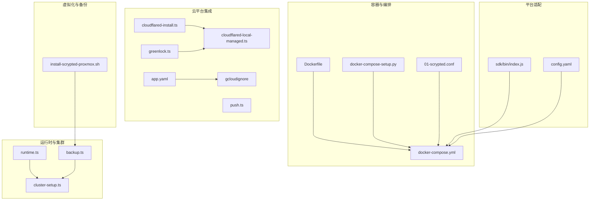
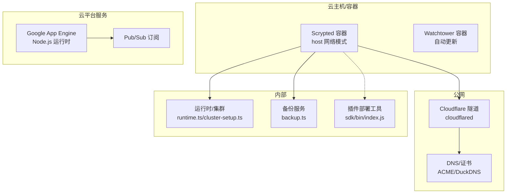
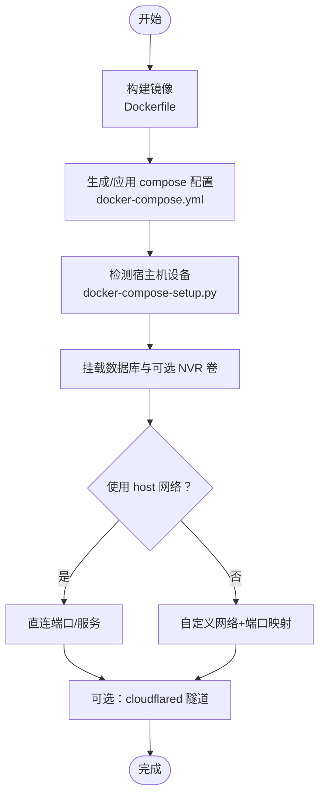
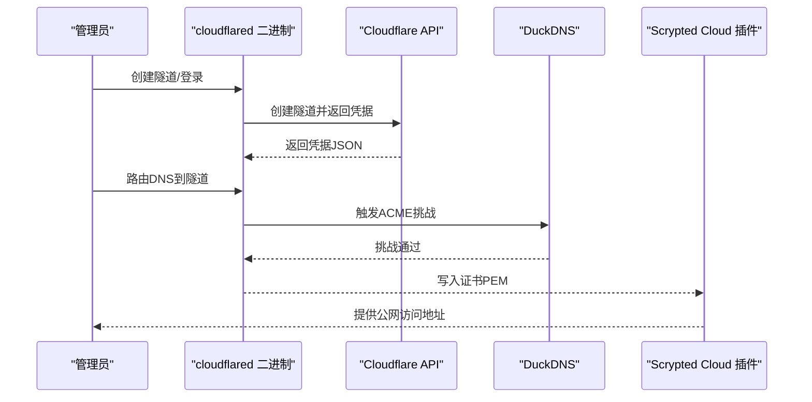
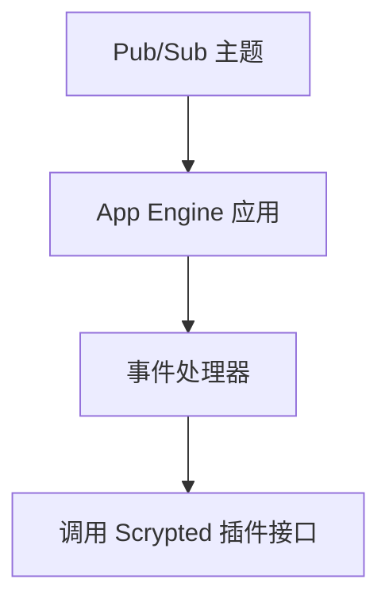
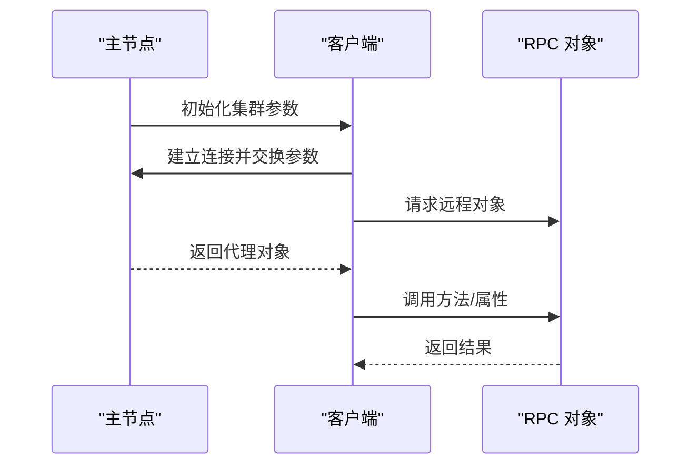
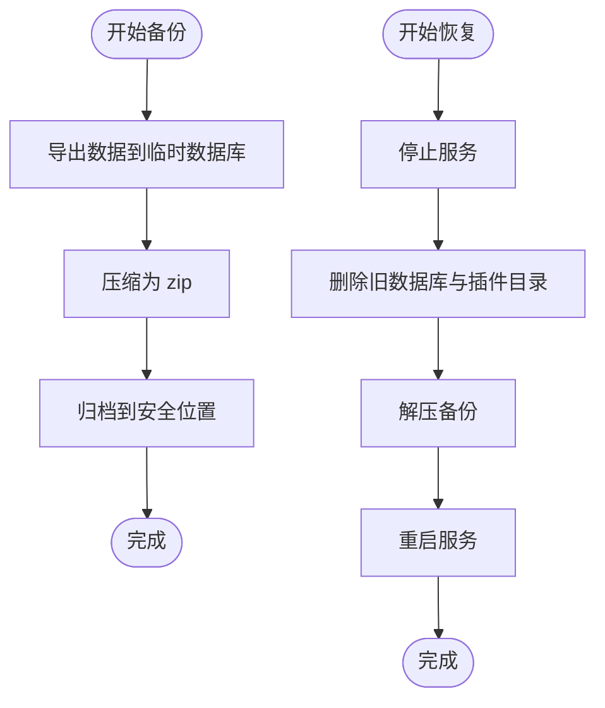
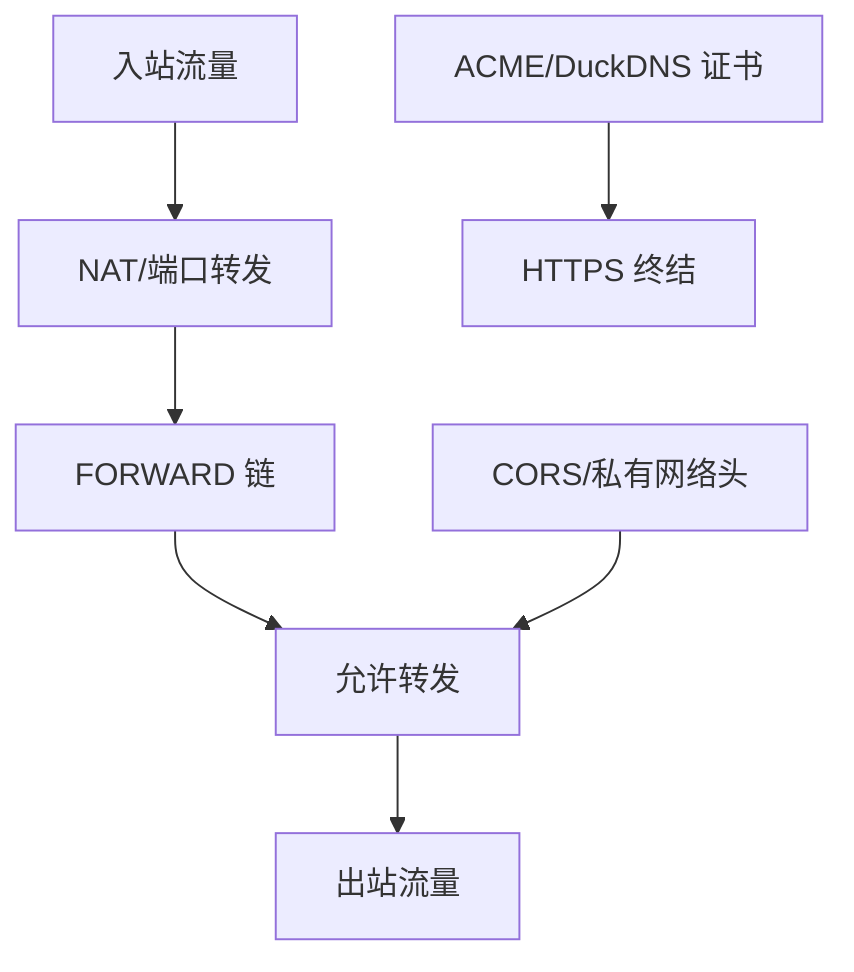
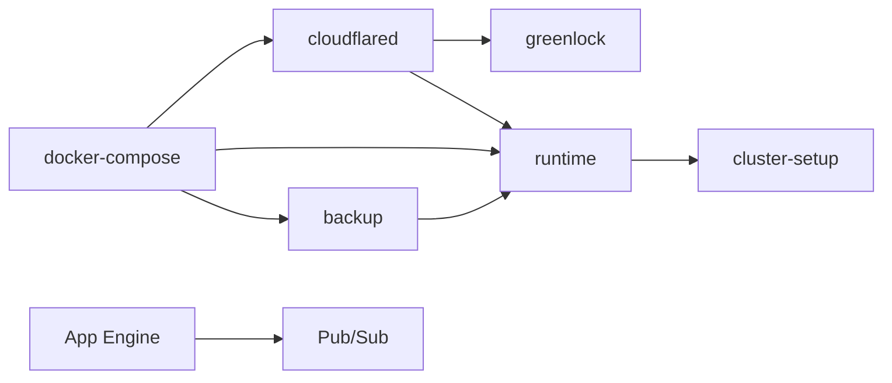

# 云平台部署

<cite>
**本文引用的文件**
- [docker-compose.yml](file://install/docker/docker-compose.yml)
- [Dockerfile](file://install/docker/Dockerfile)
- [docker-compose-setup.py](file://install/docker/docker-compose-setup.py)
- [config.yaml](file://install/config.yaml)
- [cloudflared-install.ts](file://plugins/cloud/src/cloudflared-install.ts)
- [cloudflared-local-managed.ts](file://plugins/cloud/src/cloudflared-local-managed.ts)
- [greenlock.ts](file://plugins/cloud/src/greenlock.ts)
- [push.ts](file://plugins/cloud/src/push.ts)
- [app.yaml](file://plugins/google-device-access/pubsub-server/app.yaml)
- [.gcloudignore](file://plugins/google-device-access/pubsub-server/.gcloudignore)
- [index.js](file://sdk/bin/index.js)
- [runtime.ts](file://server/src/runtime.ts)
- [cluster-setup.ts](file://server/src/cluster/cluster-setup.ts)
- [backup.ts](file://server/src/services/backup.ts)
- [01-scrypted.conf](file://install/docker/router/01-scrypted.conf)
- [install-scrypted-proxmox.sh](file://install/proxmox/install-scrypted-proxmox.sh)
- [README.md](file://README.md)
</cite>

## 目录
1. [简介](#简介)
2. [项目结构](#项目结构)
3. [核心组件](#核心组件)
4. [架构总览](#架构总览)
5. [详细组件分析](#详细组件分析)
6. [依赖关系分析](#依赖关系分析)
7. [性能与可扩展性](#性能与可扩展性)
8. [故障排查指南](#故障排查指南)
9. [结论](#结论)
10. [附录](#附录)

## 简介
本指南面向在主流云平台上部署 Scrypted 的工程团队与运维人员，覆盖 AWS、Azure、Google Cloud 的容器化与云原生部署策略，并结合仓库中已有的容器编排、隧道与证书管理能力，给出可落地的配置要点、架构建议、安全与监控、成本优化与灾备实践，以及跨平台迁移与互操作性参考。文档严格基于仓库内现有实现进行说明，避免臆测。

## 项目结构
围绕云平台部署的关键目录与文件如下：
- 容器与编排：install/docker 下的 Dockerfile、docker-compose.yml、router 防火规则与设备映射脚本
- 平台适配：install/config.yaml（Home Assistant Addon 风格配置）
- 云原生与隧道：plugins/cloud 中的 cloudflared 本地托管、证书管理与推送
- Google Cloud 集成：google-device-access 插件的 Pub/Sub 应用配置
- SDK 与部署工具：sdk/bin/index.js（插件部署脚手架）
- 运行时与集群：server/src 下的 runtime、cluster、backup 等模块
- 虚拟化与备份：install/proxmox 的 Proxmox 安装脚本与备份流程

图表来源
- [Dockerfile:1-22](file://install/docker/Dockerfile#L1-L22)
- [docker-compose.yml:1-169](file://install/docker/docker-compose.yml#L1-L169)
- [docker-compose-setup.py:1-46](file://install/docker/docker-compose-setup.py#L1-L46)
- [01-scrypted.conf:1-55](file://install/docker/router/01-scrypted.conf#L1-L55)
- [cloudflared-install.ts:1-28](file://plugins/cloud/src/cloudflared-install.ts#L1-L28)
- [cloudflared-local-managed.ts:47-128](file://plugins/cloud/src/cloudflared-local-managed.ts#L47-L128)
- [greenlock.ts:1-58](file://plugins/cloud/src/greenlock.ts#L1-L58)
- [push.ts:1-76](file://plugins/cloud/src/push.ts#L1-L76)
- [app.yaml:1-19](file://plugins/google-device-access/pubsub-server/app.yaml#L1-L19)
- [.gcloudignore:1-17](file://plugins/google-device-access/pubsub-server/.gcloudignore#L1-L17)
- [runtime.ts:167-197](file://server/src/runtime.ts#L167-L197)
- [cluster-setup.ts:1-498](file://server/src/cluster/cluster-setup.ts#L1-L498)
- [backup.ts:1-76](file://server/src/services/backup.ts#L1-L76)
- [config.yaml:1-49](file://install/config.yaml#L1-L49)
- [sdk/bin/index.js:92-133](file://sdk/bin/index.js#L92-L133)
- [install-scrypted-proxmox.sh:109-274](file://install/proxmox/install-scrypted-proxmox.sh#L109-L274)

章节来源
- [README.md:1-59](file://README.md#L1-L59)
- [docker-compose.yml:1-169](file://install/docker/docker-compose.yml#L1-L169)
- [Dockerfile:1-22](file://install/docker/Dockerfile#L1-L22)
- [config.yaml:1-49](file://install/config.yaml#L1-L49)

## 核心组件
- 容器镜像与启动
  - 基于统一基础镜像构建，安装并启动服务进程，设置 DNS 优先级以规避 IPv6 网络问题。
- 容器编排与设备映射
  - 使用 docker-compose 管理服务、卷与网络；自动检测宿主机硬件设备并注入到容器。
- 云隧道与证书
  - 支持本地托管 cloudflared 隧道与 DuckDNS ACME 挑战的证书签发。
- Google Cloud 集成
  - 提供 GAE Node.js 运行时与最小化实例配置示例，配合 Pub/Sub 订阅。
- 运行时与集群
  - 提供跨进程/线程的 RPC 对象连接、集群初始化与端口监听、访问控制头等能力。
- 备份与恢复
  - 数据库存储与插件目录的打包/解包，支持恢复后重启服务。

章节来源
- [Dockerfile:1-22](file://install/docker/Dockerfile#L1-L22)
- [docker-compose.yml:20-169](file://install/docker/docker-compose.yml#L20-L169)
- [docker-compose-setup.py:1-46](file://install/docker/docker-compose-setup.py#L1-L46)
- [cloudflared-install.ts:1-28](file://plugins/cloud/src/cloudflared-install.ts#L1-L28)
- [cloudflared-local-managed.ts:47-128](file://plugins/cloud/src/cloudflared-local-managed.ts#L47-L128)
- [greenlock.ts:1-58](file://plugins/cloud/src/greenlock.ts#L1-L58)
- [app.yaml:1-19](file://plugins/google-device-access/pubsub-server/app.yaml#L1-L19)
- [runtime.ts:167-197](file://server/src/runtime.ts#L167-L197)
- [cluster-setup.ts:336-498](file://server/src/cluster/cluster-setup.ts#L336-L498)
- [backup.ts:1-76](file://server/src/services/backup.ts#L1-L76)

## 架构总览
下图展示了容器化部署在云环境中的关键交互：容器通过 host 网络暴露服务，cloudflared 提供公网可达隧道，证书由 ACME 管理，SDK 工具用于插件部署，运行时负责集群与访问控制，备份服务保障数据持久化。

图表来源
- [docker-compose.yml:20-169](file://install/docker/docker-compose.yml#L20-L169)
- [cloudflared-local-managed.ts:47-128](file://plugins/cloud/src/cloudflared-local-managed.ts#L47-L128)
- [greenlock.ts:1-58](file://plugins/cloud/src/greenlock.ts#L1-L58)
- [app.yaml:1-19](file://plugins/google-device-access/pubsub-server/app.yaml#L1-L19)
- [runtime.ts:167-197](file://server/src/runtime.ts#L167-L197)
- [cluster-setup.ts:336-498](file://server/src/cluster/cluster-setup.ts#L336-L498)
- [backup.ts:1-76](file://server/src/services/backup.ts#L1-L76)
- [sdk/bin/index.js:92-133](file://sdk/bin/index.js#L92-L133)

## 详细组件分析

### 容器化与编排（AWS/Azure/GCP）
- 镜像构建
  - 使用统一基础镜像，安装最新版本服务并设置启动命令；显式设置 DNS 解析顺序以规避部分网络环境的 IPv6 问题。
- 编排与卷
  - 通过 docker-compose 管理主服务与 Watchtower 自动更新；支持挂载数据库卷与可选的 NVR 存储卷；可启用 Avahi 宿主机或容器内运行模式。
- 设备映射
  - 启动脚本会扫描常见硬件设备路径并在 docker-compose 中追加映射，便于加速视频处理与 USB 设备接入。
- 网络模式
  - 默认使用 host 网络，便于直连摄像头与低延迟通信；如需隔离可切换至自定义网络并开放必要端口。

图表来源
- [Dockerfile:1-22](file://install/docker/Dockerfile#L1-L22)
- [docker-compose.yml:20-169](file://install/docker/docker-compose.yml#L20-L169)
- [docker-compose-setup.py:1-46](file://install/docker/docker-compose-setup.py#L1-L46)

章节来源
- [Dockerfile:1-22](file://install/docker/Dockerfile#L1-L22)
- [docker-compose.yml:20-169](file://install/docker/docker-compose.yml#L20-L169)
- [docker-compose-setup.py:1-46](file://install/docker/docker-compose-setup.py#L1-L46)

### 云隧道与证书（Cloudflare Tunnel + DuckDNS）
- 本地托管隧道
  - 自动登录、创建隧道、写入配置并运行；支持从 JSON 凭据文件加载并路由 DNS。
- 证书签发
  - 基于 DuckDNS 的 ACME dns-01 挑战，将证书材料保存在插件卷目录，便于后续挂载或备份。
- 部署与回调
  - 提供 OAuth 回调处理与登录入口，便于云端注册与授权。

图表来源
- [cloudflared-local-managed.ts:47-128](file://plugins/cloud/src/cloudflared-local-managed.ts#L47-L128)
- [greenlock.ts:1-58](file://plugins/cloud/src/greenlock.ts#L1-L58)

章节来源
- [cloudflared-install.ts:1-28](file://plugins/cloud/src/cloudflared-install.ts#L1-L28)
- [cloudflared-local-managed.ts:47-128](file://plugins/cloud/src/cloudflared-local-managed.ts#L47-L128)
- [greenlock.ts:1-58](file://plugins/cloud/src/greenlock.ts#L1-L58)

### Google Cloud 集成（App Engine + Pub/Sub）
- 运行时与扩缩容
  - 使用 Node.js 14 运行时，basic_scaling 最大实例数为 1；适合轻量订阅场景。
- 忽略规则
  - 使用 .gcloudignore 排除 node_modules 等无需上传的文件。
- 与 Scrypted 的关系
  - 该应用作为外部服务接收 Pub/Sub 事件，与 Scrypted 主服务通过插件机制协同工作。

图表来源
- [app.yaml:1-19](file://plugins/google-device-access/pubsub-server/app.yaml#L1-L19)
- [.gcloudignore:1-17](file://plugins/google-device-access/pubsub-server/.gcloudignore#L1-L17)

章节来源
- [app.yaml:1-19](file://plugins/google-device-access/pubsub-server/app.yaml#L1-L19)
- [.gcloudignore:1-17](file://plugins/google-device-access/pubsub-server/.gcloudignore#L1-L17)

### 运行时与集群（高可用与跨节点通信）
- 集群初始化
  - 支持 server/client 模式，按环境变量解析地址与端口；服务端绑定指定地址并同时监听 127.0.0.1 以确保回环可达。
- 对象代理与 RPC
  - 通过计算哈希与密钥校验，建立跨进程/线程/节点的对象代理连接，支持 IPC 通道与远端 RPC。
- 访问控制
  - 统一设置 CORS 与私有网络访问头，便于前端与多源访问。

图表来源
- [cluster-setup.ts:336-498](file://server/src/cluster/cluster-setup.ts#L336-L498)
- [runtime.ts:187-197](file://server/src/runtime.ts#L187-L197)

章节来源
- [cluster-setup.ts:1-498](file://server/src/cluster/cluster-setup.ts#L1-L498)
- [runtime.ts:167-197](file://server/src/runtime.ts#L167-L197)

### 备份与恢复（灾备与迁移）
- 备份
  - 将运行时数据存放到临时数据库并压缩为 zip，便于离线归档。
- 恢复
  - 停止服务、删除旧数据库与插件目录，解压并重启服务，实现完整恢复。
- Proxmox 迁移
  - 提供 VM 恢复与卷迁移脚本，支持自动选择存储类型并重置/移动多个卷。

图表来源
- [backup.ts:1-76](file://server/src/services/backup.ts#L1-L76)
- [install-scrypted-proxmox.sh:109-274](file://install/proxmox/install-scrypted-proxmox.sh#L109-L274)

章节来源
- [backup.ts:1-76](file://server/src/services/backup.ts#L1-L76)
- [install-scrypted-proxmox.sh:109-274](file://install/proxmox/install-scrypted-proxmox.sh#L109-L274)

### 网络与安全（防火墙、ACL、TLS）
- 防火墙规则
  - 提供 nftables 配置模板，定义 NAT 与 FORWARD 链，便于在路由器或网关侧做端口转发与流量控制。
- 访问控制
  - 运行时统一设置 CORS 与私有网络访问头，减少跨域与权限问题。
- TLS 证书
  - 支持 DuckDNS ACME 挑战自动签发与存储，便于在公网暴露服务。

图表来源
- [01-scrypted.conf:1-55](file://install/docker/router/01-scrypted.conf#L1-L55)
- [runtime.ts:187-197](file://server/src/runtime.ts#L187-L197)
- [greenlock.ts:1-58](file://plugins/cloud/src/greenlock.ts#L1-L58)

章节来源
- [01-scrypted.conf:1-55](file://install/docker/router/01-scrypted.conf#L1-L55)
- [runtime.ts:187-197](file://server/src/runtime.ts#L187-L197)
- [greenlock.ts:1-58](file://plugins/cloud/src/greenlock.ts#L1-L58)

### 监控与日志（云平台可观测性）
- 日志驱动
  - compose 默认禁用容器日志驱动，建议在需要时开启文件驱动并限制大小，避免对宿主机磁盘造成压力。
- 运行时日志清理
  - 运行时定时清理过期日志条目，降低内存占用。
- 建议
  - 结合云平台日志服务（如 AWS CloudWatch、Azure Monitor、GCP Cloud Logging）集中采集与告警。

章节来源
- [docker-compose.yml:123-131](file://install/docker/docker-compose.yml#L123-L131)
- [runtime.ts:172-175](file://server/src/runtime.ts#L172-L175)

### 成本优化与资源使用最佳实践
- 镜像与依赖
  - 使用精简基础镜像与一次性缓存绕过策略，减少层体积与安装时间。
- 端口与网络
  - host 网络降低转发开销，但会暴露更多端口；如需隔离，使用自定义网络并仅映射必要端口。
- 存储
  - 将数据库与 NVR 分离卷，便于独立扩容与备份；优先使用云平台提供的高性能块存储。
- 自动化
  - 利用 Watchtower 实现安全补丁与版本升级自动化，减少人工干预。

章节来源
- [Dockerfile:1-22](file://install/docker/Dockerfile#L1-L22)
- [docker-compose.yml:20-169](file://install/docker/docker-compose.yml#L20-L169)

### 跨平台迁移与互操作性
- 插件部署
  - 使用 SDK 的部署脚本将插件打包并推送到目标 Scrypted 实例，适用于不同云平台的同构迁移。
- 隧道与证书
  - cloudflared 与证书管理可在不同平台复用，保持域名与访问一致性。
- 配置与卷
  - 将配置与数据卷迁移到新平台，确保服务快速恢复。

章节来源
- [sdk/bin/index.js:92-133](file://sdk/bin/index.js#L92-L133)
- [cloudflared-local-managed.ts:47-128](file://plugins/cloud/src/cloudflared-local-managed.ts#L47-L128)
- [greenlock.ts:1-58](file://plugins/cloud/src/greenlock.ts#L1-L58)

## 依赖关系分析
- 组件耦合
  - cloudflared 与证书模块相互协作，前者负责隧道与认证，后者负责证书签发与存储。
  - 运行时与集群模块共同支撑跨节点通信与对象代理。
  - 备份模块与存储卷紧密耦合，确保数据可移植性。
- 外部依赖
  - Google App Engine 运行时与 Pub/Sub 服务；DuckDNS ACME 挑战；Docker Compose 与 Watchtower。

图表来源
- [cloudflared-local-managed.ts:47-128](file://plugins/cloud/src/cloudflared-local-managed.ts#L47-L128)
- [greenlock.ts:1-58](file://plugins/cloud/src/greenlock.ts#L1-L58)
- [runtime.ts:167-197](file://server/src/runtime.ts#L167-L197)
- [cluster-setup.ts:336-498](file://server/src/cluster/cluster-setup.ts#L336-L498)
- [backup.ts:1-76](file://server/src/services/backup.ts#L1-L76)
- [app.yaml:1-19](file://plugins/google-device-access/pubsub-server/app.yaml#L1-L19)
- [docker-compose.yml:20-169](file://install/docker/docker-compose.yml#L20-L169)

章节来源
- [cloudflared-local-managed.ts:47-128](file://plugins/cloud/src/cloudflared-local-managed.ts#L47-L128)
- [greenlock.ts:1-58](file://plugins/cloud/src/greenlock.ts#L1-L58)
- [runtime.ts:167-197](file://server/src/runtime.ts#L167-L197)
- [cluster-setup.ts:336-498](file://server/src/cluster/cluster-setup.ts#L336-L498)
- [backup.ts:1-76](file://server/src/services/backup.ts#L1-L76)
- [app.yaml:1-19](file://plugins/google-device-access/pubsub-server/app.yaml#L1-L19)
- [docker-compose.yml:20-169](file://install/docker/docker-compose.yml#L20-L169)

## 性能与可扩展性
- 容器网络
  - host 网络降低转发延迟，适合视频流密集场景；若需多租户隔离，使用自定义网络并限制带宽。
- 集群模式
  - 通过集群初始化与对象代理，实现多节点横向扩展与负载分担。
- 存储与 I/O
  - 将数据库与 NVR 卷分离并使用高性能块存储，避免 I/O 抖动影响其他服务。
- 自动化与弹性
  - 结合云平台的自动扩缩容与健康检查，按 CPU/内存/网络使用率动态调整实例数量。

## 故障排查指南
- 容器日志
  - 若默认禁用日志驱动导致定位困难，可临时启用文件驱动并设置大小限制。
- 端口与网络
  - 检查 host 网络是否正确暴露所需端口；如使用自定义网络，确认端口映射与防火墙放行。
- 隧道与证书
  - 确认 cloudflared 登录成功、隧道创建与 DNS 路由完成；检查 DuckDNS ACME 挑战是否通过。
- 集群连接
  - 核对集群地址与端口、密钥一致性；检查跨节点网络连通性与端口监听状态。
- 备份恢复
  - 恢复前确保服务完全停止，删除旧数据库与插件目录后再解压并重启。

章节来源
- [docker-compose.yml:123-131](file://install/docker/docker-compose.yml#L123-L131)
- [cloudflared-local-managed.ts:47-128](file://plugins/cloud/src/cloudflared-local-managed.ts#L47-L128)
- [greenlock.ts:1-58](file://plugins/cloud/src/greenlock.ts#L1-L58)
- [cluster-setup.ts:403-462](file://server/src/cluster/cluster-setup.ts#L403-L462)
- [backup.ts:48-76](file://server/src/services/backup.ts#L48-L76)

## 结论
通过容器化与 cloudflared 隧道，Scrypted 可在 AWS/Azure/GCP 等云平台实现快速部署与公网可达；结合集群、备份与证书管理能力，可满足高可用与安全要求。建议在生产环境中采用 host 网络与高性能块存储，配合 Watchtower 与云平台自动扩缩容，实现稳定、可观测且成本可控的云原生部署。

## 附录
- Home Assistant Addon 风格配置
  - 提供 ingress、USB、GPIO、视频设备等映射，便于在 HA 环境中运行。
- 插件部署工具
  - 使用 SDK 脚本将插件打包并推送到目标实例，简化跨平台部署流程。

章节来源
- [config.yaml:1-49](file://install/config.yaml#L1-L49)
- [sdk/bin/index.js:92-133](file://sdk/bin/index.js#L92-L133)