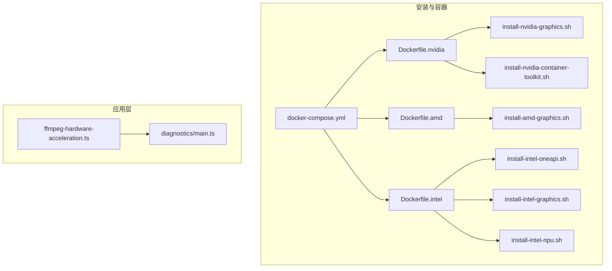
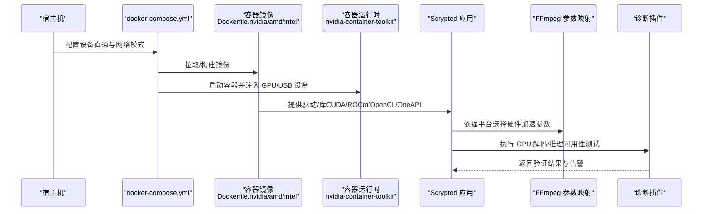
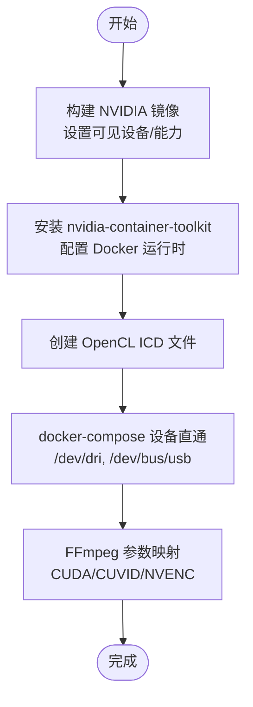
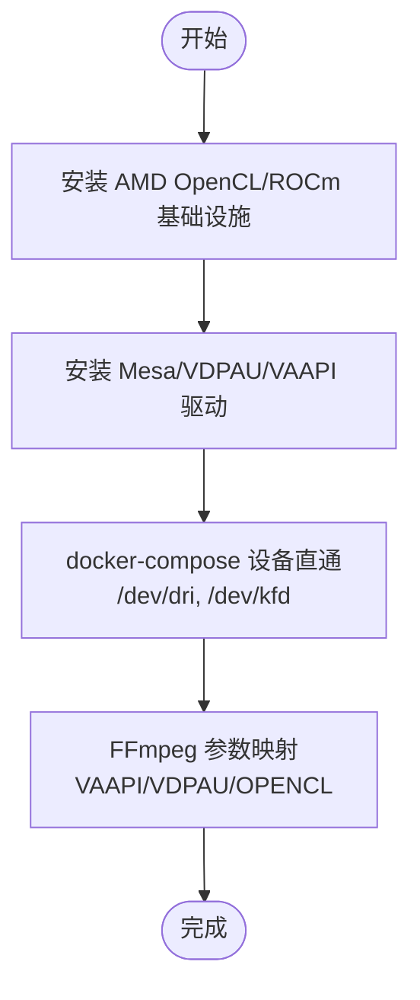
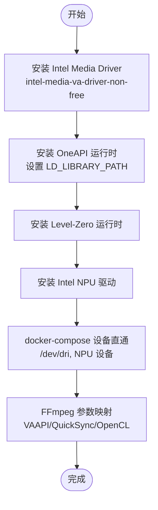
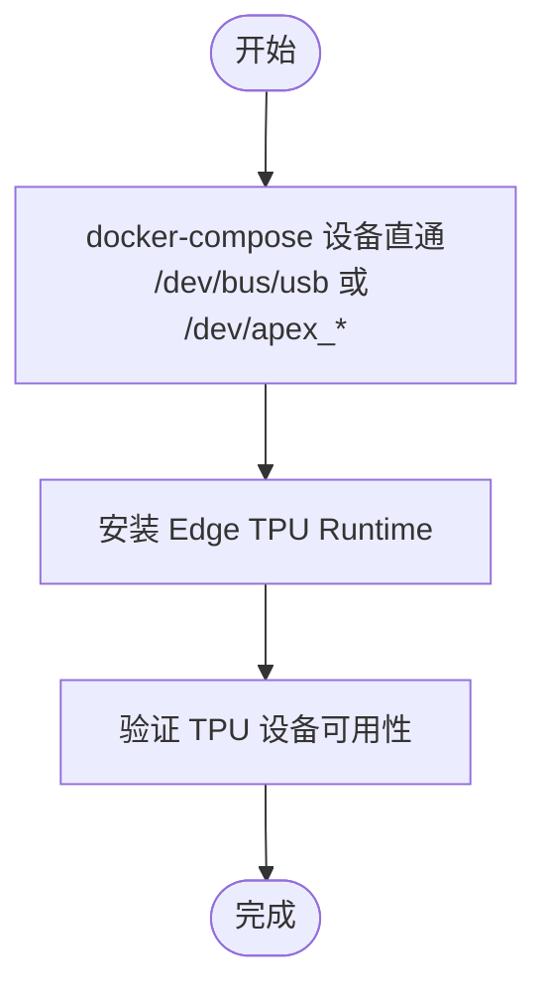
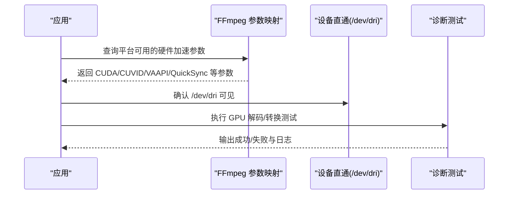
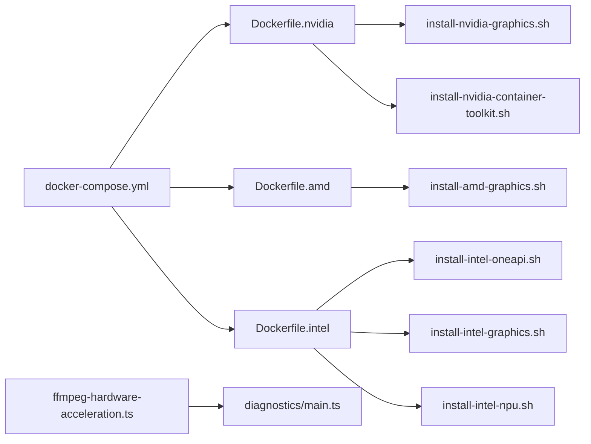
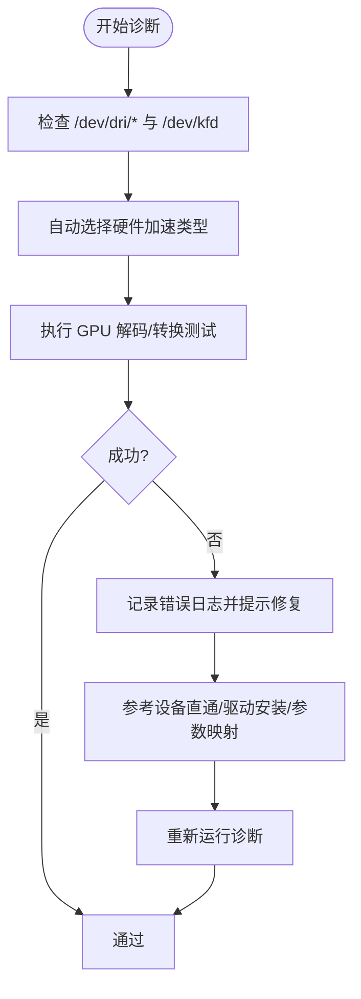

# 硬件加速配置

<cite>
**本文引用的文件**
- [install/docker/install-nvidia-graphics.sh](file://install/docker/install-nvidia-graphics.sh)
- [install/docker/install-nvidia-container-toolkit.sh](file://install/docker/install-nvidia-container-toolkit.sh)
- [install/docker/install-amd-graphics.sh](file://install/docker/install-amd-graphics.sh)
- [install/docker/install-intel-graphics.sh](file://install/docker/install-intel-graphics.sh)
- [install/docker/install-intel-npu.sh](file://install/docker/install-intel-npu.sh)
- [install/docker/install-intel-oneapi.sh](file://install/docker/install-intel-oneapi.sh)
- [common/src/ffmpeg-hardware-acceleration.ts](file://common/src/ffmpeg-hardware-acceleration.ts)
- [plugins/diagnostics/src/main.ts](file://plugins/diagnostics/src/main.ts)
- [install/docker/docker-compose.yml](file://install/docker/docker-compose.yml)
- [install/docker/Dockerfile.nvidia](file://install/docker/Dockerfile.nvidia)
- [install/docker/Dockerfile.amd](file://install/docker/Dockerfile.amd)
- [install/docker/Dockerfile.intel](file://install/docker/Dockerfile.intel)
- [install/docker/setup-scrypted-nvr-volume.sh](file://install/docker/setup-scrypted-nvr-volume.sh)
</cite>

## 目录
1. [简介](#简介)
2. [项目结构](#项目结构)
3. [核心组件](#核心组件)
4. [架构总览](#架构总览)
5. [详细组件分析](#详细组件分析)
6. [依赖关系分析](#依赖关系分析)
7. [性能考量与选型建议](#性能考量与选型建议)
8. [监控与故障排除](#监控与故障排除)
9. [结论](#结论)
10. [附录](#附录)

## 简介
本指南面向在容器化环境中部署 Scrypted 的用户，系统性讲解如何为不同硬件平台启用并验证硬件加速能力，覆盖以下主题：
- NVIDIA GPU：CUDA 驱动与容器运行时、OpenCL 支持、设备直通与编解码器参数
- AMD GPU：Mesa 驱动、ROCm/OPENCL 平台、VAAPI/VDPAU/OPENCL 设置
- Intel GPU 与 NPU：Intel Media Driver、OneAPI 工具链、Level-Zero 运行时、Xeon Phi 支持
- Coral TPU：USB 设备直通与 Edge TPU Runtime
- 硬件编解码器：VAAPI、VDPAU、DXVA2 等在不同平台下的可用性与参数映射
- 性能对比与选型建议
- 监控与故障排除（含诊断插件）
- 兼容性检查与驱动更新流程

## 项目结构
本仓库中与硬件加速配置直接相关的关键位置如下：
- 安装脚本与 Docker 配置位于 install/docker 下，包含各厂商驱动安装脚本、容器镜像构建文件与 docker-compose 示例
- FFmpeg 硬件加速参数映射位于 common/src/ffmpeg-hardware-acceleration.ts
- 系统诊断与硬件加速验证逻辑位于 plugins/diagnostics/src/main.ts
- docker-compose.yml 提供设备直通与网络模式等关键示例

**图表来源**
- [install/docker/docker-compose.yml:20-169](file://install/docker/docker-compose.yml#L20-L169)
- [install/docker/Dockerfile.nvidia:1-12](file://install/docker/Dockerfile.nvidia#L1-L12)
- [install/docker/Dockerfile.amd:1-8](file://install/docker/Dockerfile.amd#L1-L8)
- [install/docker/Dockerfile.intel:1-17](file://install/docker/Dockerfile.intel#L1-L17)
- [install/docker/install-nvidia-graphics.sh:1-55](file://install/docker/install-nvidia-graphics.sh#L1-L55)
- [install/docker/install-nvidia-container-toolkit.sh:1-64](file://install/docker/install-nvidia-container-toolkit.sh#L1-L64)
- [install/docker/install-amd-graphics.sh:1-56](file://install/docker/install-amd-graphics.sh#L1-L56)
- [install/docker/install-intel-graphics.sh:1-121](file://install/docker/install-intel-graphics.sh#L1-L121)
- [install/docker/install-intel-npu.sh:1-83](file://install/docker/install-intel-npu.sh#L1-L83)
- [install/docker/install-intel-oneapi.sh:1-19](file://install/docker/install-intel-oneapi.sh#L1-L19)
- [common/src/ffmpeg-hardware-acceleration.ts:1-147](file://common/src/ffmpeg-hardware-acceleration.ts#L1-L147)
- [plugins/diagnostics/src/main.ts:390-775](file://plugins/diagnostics/src/main.ts#L390-L775)

**章节来源**
- [install/docker/docker-compose.yml:20-169](file://install/docker/docker-compose.yml#L20-L169)
- [install/docker/Dockerfile.nvidia:1-12](file://install/docker/Dockerfile.nvidia#L1-L12)
- [install/docker/Dockerfile.amd:1-8](file://install/docker/Dockerfile.amd#L1-L8)
- [install/docker/Dockerfile.intel:1-17](file://install/docker/Dockerfile.intel#L1-L17)

## 核心组件
- NVIDIA 驱动与容器运行时：通过安装脚本与容器镜像构建文件实现 CUDA/CUDNN/驱动与 nvidia-container-toolkit 的集成
- AMD 驱动与 OpenCL：通过 amdgpu-install 安装 OpenCL 基础设施，并在容器内启用 VAAPI/VDPAU/OPENCL
- Intel GPU 与 NPU：安装 Intel Media Driver、OneAPI 运行时与 Level-Zero，支持 OpenCL/Level-Zero/NPU
- FFmpeg 硬件加速参数：根据平台自动选择合适的解码/编码器参数
- 诊断与验证：通过诊断插件检测 GPU 设备直通、OpenCL/VAAPI 可用性与推理设备状态

**章节来源**
- [install/docker/install-nvidia-graphics.sh:1-55](file://install/docker/install-nvidia-graphics.sh#L1-L55)
- [install/docker/install-nvidia-container-toolkit.sh:1-64](file://install/docker/install-nvidia-container-toolkit.sh#L1-L64)
- [install/docker/install-amd-graphics.sh:1-56](file://install/docker/install-amd-graphics.sh#L1-L56)
- [install/docker/install-intel-graphics.sh:1-121](file://install/docker/install-intel-graphics.sh#L1-L121)
- [install/docker/install-intel-npu.sh:1-83](file://install/docker/install-intel-npu.sh#L1-L83)
- [install/docker/install-intel-oneapi.sh:1-19](file://install/docker/install-intel-oneapi.sh#L1-L19)
- [common/src/ffmpeg-hardware-acceleration.ts:49-131](file://common/src/ffmpeg-hardware-acceleration.ts#L49-L131)
- [plugins/diagnostics/src/main.ts:390-775](file://plugins/diagnostics/src/main.ts#L390-L775)

## 架构总览
下图展示了 Scrypted 在容器中启用多厂商硬件加速的整体流程：宿主机安装驱动 → 容器镜像包含对应运行时/库 → docker-compose 将设备直通到容器 → 应用侧通过 FFmpeg 参数与诊断插件进行验证。

**图表来源**
- [install/docker/docker-compose.yml:20-169](file://install/docker/docker-compose.yml#L20-L169)
- [install/docker/Dockerfile.nvidia:1-12](file://install/docker/Dockerfile.nvidia#L1-L12)
- [install/docker/Dockerfile.amd:1-8](file://install/docker/Dockerfile.amd#L1-L8)
- [install/docker/Dockerfile.intel:1-17](file://install/docker/Dockerfile.intel#L1-L17)
- [common/src/ffmpeg-hardware-acceleration.ts:49-131](file://common/src/ffmpeg-hardware-acceleration.ts#L49-L131)
- [plugins/diagnostics/src/main.ts:515-775](file://plugins/diagnostics/src/main.ts#L515-L775)

## 详细组件分析

### NVIDIA GPU 加速配置
- 容器镜像与环境变量
  - 使用 NVIDIA 基础镜像并设置可见设备与能力环境变量，确保容器可访问 GPU 资源
  - 在镜像构建阶段调用 NVIDIA 图形安装脚本以预装 CUDA/CUDNN/库
- 容器运行时与驱动
  - 安装 nvidia-container-toolkit 并配置 Docker 使用 NVIDIA 运行时
  - 在 Proxmox 环境下处理内核头文件差异
- OpenCL 支持
  - 在容器内手动创建 OpenCL ICD 文件，解决容器运行时未挂载该文件的问题
- FFmpeg 参数
  - 自动提供 CUDA/CUVID 解码与 NVENC 编码参数；Linux 下还提供 V4L2 参数
- docker-compose 设备直通
  - 可选将 /dev/dri 与 USB 设备直通至容器，便于硬件编解码与 USB 设备使用

**图表来源**
- [install/docker/Dockerfile.nvidia:1-12](file://install/docker/Dockerfile.nvidia#L1-L12)
- [install/docker/install-nvidia-container-toolkit.sh:1-64](file://install/docker/install-nvidia-container-toolkit.sh#L1-L64)
- [install/docker/install-nvidia-graphics.sh:1-55](file://install/docker/install-nvidia-graphics.sh#L1-L55)
- [common/src/ffmpeg-hardware-acceleration.ts:49-84](file://common/src/ffmpeg-hardware-acceleration.ts#L49-L84)
- [install/docker/docker-compose.yml:96-117](file://install/docker/docker-compose.yml#L96-L117)

**章节来源**
- [install/docker/Dockerfile.nvidia:1-12](file://install/docker/Dockerfile.nvidia#L1-L12)
- [install/docker/install-nvidia-container-toolkit.sh:1-64](file://install/docker/install-nvidia-container-toolkit.sh#L1-L64)
- [install/docker/install-nvidia-graphics.sh:1-55](file://install/docker/install-nvidia-graphics.sh#L1-L55)
- [common/src/ffmpeg-hardware-acceleration.ts:49-84](file://common/src/ffmpeg-hardware-acceleration.ts#L49-L84)
- [install/docker/docker-compose.yml:96-117](file://install/docker/docker-compose.yml#L96-L117)

### AMD GPU 加速配置
- 驱动与 OpenCL
  - 通过 amdgpu-install 安装 OpenCL 基础设施，支持 ROCm/OPENCL 平台
  - 在容器内启用 VAAPI/VDPAU/OPENCL，满足不同场景需求
- docker-compose 设备直通
  - 可选将 /dev/kfd 与 /dev/dri 直通至容器，确保 AMD GPU 可见
- FFmpeg 参数
  - Linux 平台提供 VAAPI/VDPAU/OPENCL 等参数映射，便于自动选择

**图表来源**
- [install/docker/install-amd-graphics.sh:1-56](file://install/docker/install-amd-graphics.sh#L1-L56)
- [install/docker/docker-compose.yml:106-107](file://install/docker/docker-compose.yml#L106-L107)
- [common/src/ffmpeg-hardware-acceleration.ts:107-112](file://common/src/ffmpeg-hardware-acceleration.ts#L107-L112)

**章节来源**
- [install/docker/install-amd-graphics.sh:1-56](file://install/docker/install-amd-graphics.sh#L1-L56)
- [install/docker/docker-compose.yml:106-107](file://install/docker/docker-compose.yml#L106-L107)
- [common/src/ffmpeg-hardware-acceleration.ts:107-112](file://common/src/ffmpeg-hardware-acceleration.ts#L107-L112)

### Intel GPU 与 NPU 加速配置
- Intel Media Driver
  - 安装 intel-media-va-driver-non-free 与相关 OpenCL 运行时，支持 VAAPI/QuickSync
- OneAPI 工具包
  - 安装 MKL/SYCL/BLCAS 等运行时，并设置 LD_LIBRARY_PATH 以便应用加载
- Level-Zero 与 NPU
  - 安装 Level-Zero 运行时与 Intel NPU 驱动，支持 NPU 推理
- docker-compose 设备直通
  - 可选将 /dev/dri 与 NPU 设备直通至容器

**图表来源**
- [install/docker/install-intel-graphics.sh:1-121](file://install/docker/install-intel-graphics.sh#L1-L121)
- [install/docker/install-intel-oneapi.sh:1-19](file://install/docker/install-intel-oneapi.sh#L1-L19)
- [install/docker/install-intel-npu.sh:1-83](file://install/docker/install-intel-npu.sh#L1-L83)
- [install/docker/docker-compose.yml:104-117](file://install/docker/docker-compose.yml#L104-L117)
- [common/src/ffmpeg-hardware-acceleration.ts:76-112](file://common/src/ffmpeg-hardware-acceleration.ts#L76-L112)

**章节来源**
- [install/docker/install-intel-graphics.sh:1-121](file://install/docker/install-intel-graphics.sh#L1-L121)
- [install/docker/install-intel-oneapi.sh:1-19](file://install/docker/install-intel-oneapi.sh#L1-L19)
- [install/docker/install-intel-npu.sh:1-83](file://install/docker/install-intel-npu.sh#L1-L83)
- [install/docker/docker-compose.yml:104-117](file://install/docker/docker-compose.yml#L104-L117)
- [common/src/ffmpeg-hardware-acceleration.ts:76-112](file://common/src/ffmpeg-hardware-acceleration.ts#L76-L112)

### Coral TPU 加速器配置
- USB 设备直通
  - 在 docker-compose 中取消注释 /dev/bus/usb 或特定 Apex 设备路径，使容器可访问 USB TPU
- Edge TPU Runtime
  - 在容器内安装 Edge TPU Runtime 以启用 USB TPU 推理

**图表来源**
- [install/docker/docker-compose.yml:100-117](file://install/docker/docker-compose.yml#L100-L117)

**章节来源**
- [install/docker/docker-compose.yml:100-117](file://install/docker/docker-compose.yml#L100-L117)

### 硬件编解码器配置（VAAPI、VDPAU、DXVA2 等）
- 参数映射
  - FFmpeg 硬件加速参数根据平台自动选择：Linux 下提供 VAAPI、V4L2、NVENC；Windows 下提供 QuickSync、AMF、NVENC；macOS 提供 VideoToolbox
- 设备直通
  - 通过 docker-compose 将 /dev/dri 直通到容器，确保 VAAPI/VDPAU 可用
- 诊断验证
  - 诊断插件会尝试自动选择硬件加速类型并进行解码/转换测试，失败时输出详细日志

**图表来源**
- [common/src/ffmpeg-hardware-acceleration.ts:49-131](file://common/src/ffmpeg-hardware-acceleration.ts#L49-L131)
- [install/docker/docker-compose.yml:104-105](file://install/docker/docker-compose.yml#L104-L105)
- [plugins/diagnostics/src/main.ts:654-743](file://plugins/diagnostics/src/main.ts#L654-L743)

**章节来源**
- [common/src/ffmpeg-hardware-acceleration.ts:49-131](file://common/src/ffmpeg-hardware-acceleration.ts#L49-L131)
- [install/docker/docker-compose.yml:104-105](file://install/docker/docker-compose.yml#L104-L105)
- [plugins/diagnostics/src/main.ts:654-743](file://plugins/diagnostics/src/main.ts#L654-L743)

## 依赖关系分析
- 容器镜像与安装脚本
  - NVIDIA 镜像构建依赖安装脚本安装 CUDA/CUDNN/驱动与 nvidia-container-toolkit
  - AMD/Intel 镜像分别依赖对应的安装脚本安装 OpenCL/ROCm、Media Driver、OneAPI、NPU 驱动
- docker-compose 与设备直通
  - 通过 devices 字段将 GPU/USB/NPU 设备直通到容器
- 应用层依赖
  - FFmpeg 参数映射依赖平台信息与容器内驱动可用性
  - 诊断插件依赖设备直通与驱动可用性进行端到端验证

**图表来源**
- [install/docker/Dockerfile.nvidia:1-12](file://install/docker/Dockerfile.nvidia#L1-L12)
- [install/docker/Dockerfile.amd:1-8](file://install/docker/Dockerfile.amd#L1-L8)
- [install/docker/Dockerfile.intel:1-17](file://install/docker/Dockerfile.intel#L1-L17)
- [install/docker/docker-compose.yml:20-169](file://install/docker/docker-compose.yml#L20-L169)
- [common/src/ffmpeg-hardware-acceleration.ts:49-131](file://common/src/ffmpeg-hardware-acceleration.ts#L49-L131)
- [plugins/diagnostics/src/main.ts:390-775](file://plugins/diagnostics/src/main.ts#L390-L775)

**章节来源**
- [install/docker/docker-compose.yml:20-169](file://install/docker/docker-compose.yml#L20-L169)
- [common/src/ffmpeg-hardware-acceleration.ts:49-131](file://common/src/ffmpeg-hardware-acceleration.ts#L49-L131)
- [plugins/diagnostics/src/main.ts:390-775](file://plugins/diagnostics/src/main.ts#L390-L775)

## 性能考量与选型建议
- NVIDIA
  - CUDA/CUVID 解码与 NVENC 编码在现代 GPU 上通常具备最佳吞吐与延迟表现
  - 适合高分辨率实时转码与 AI 推理场景
- AMD
  - VAAPI/VDPAU 在开源生态下兼容性良好，适合 Linux 环境下的通用编解码
  - OPENCL 适合推理任务，但需注意驱动版本与内核支持
- Intel
  - QuickSync 在较老的 Intel GPU 上仍具备一定性价比
  - OneAPI/Level-Zero/NPU 适合需要异构计算与 NPU 推理的场景
- Coral TPU
  - USB TPU 适合轻量边缘推理，功耗低但算力有限
- 选型建议
  - 高性能与高成本：优先 NVIDIA
  - 开源与兼容：AMD VAAPI/VDPAU
  - 低功耗与边缘：Intel QuickSync/NPU 或 Coral TPU
  - 统一生态：Intel OneAPI（结合 GPU/NPU）

[本节为通用指导，不直接分析具体文件]

## 监控与故障排除
- GPU 设备直通检测
  - 诊断插件会在 Linux+NVR 场景下检查 /dev/dri/renderD128/129 是否存在；AMD CPU 场景检查 /dev/kfd
- OpenCL/VAAPI 可用性
  - 诊断插件会尝试自动选择硬件加速类型并执行解码/转换测试，超时或失败会输出详细日志
- ONNX/OpenVINO 推理设备
  - 若未检测到 CUDA 或非 Windows 平台，诊断插件会检查推理设备是否为 GPU
- NVR 存储配置
  - 提供脚本用于挂载外部存储并更新 docker-compose 映射，便于录制与回放

**图表来源**
- [plugins/diagnostics/src/main.ts:515-775](file://plugins/diagnostics/src/main.ts#L515-L775)
- [plugins/diagnostics/src/main.ts:654-743](file://plugins/diagnostics/src/main.ts#L654-L743)

**章节来源**
- [plugins/diagnostics/src/main.ts:515-775](file://plugins/diagnostics/src/main.ts#L515-L775)
- [plugins/diagnostics/src/main.ts:654-743](file://plugins/diagnostics/src/main.ts#L654-L743)

## 结论
通过本仓库提供的安装脚本、容器镜像与 docker-compose 配置，可在多种硬件平台上快速启用并验证硬件加速能力。结合 FFmpeg 参数映射与诊断插件，用户可以按需选择最优方案，并在出现问题时快速定位与修复。

[本节为总结，不直接分析具体文件]

## 附录

### 兼容性检查与驱动更新指南
- Ubuntu 版本检测
  - 各安装脚本均对 Ubuntu 22.04/24.04 进行检测，不匹配时会提示无法安装
- Proxmox 兼容性
  - NVIDIA 容器工具包安装脚本对 Proxmox 环境进行特殊处理（安装内核头文件）
- 驱动更新
  - NVIDIA：通过安装脚本更新 CUDA/CUDNN/驱动
  - AMD：通过 amdgpu-install 更新 OpenCL/ROCm
  - Intel：更新 Media Driver、OneAPI、NPU 驱动后重启生效

**章节来源**
- [install/docker/install-nvidia-graphics.sh:1-55](file://install/docker/install-nvidia-graphics.sh#L1-L55)
- [install/docker/install-nvidia-container-toolkit.sh:14-22](file://install/docker/install-nvidia-container-toolkit.sh#L14-L22)
- [install/docker/install-amd-graphics.sh:1-56](file://install/docker/install-amd-graphics.sh#L1-L56)
- [install/docker/install-intel-graphics.sh:1-121](file://install/docker/install-intel-graphics.sh#L1-L121)
- [install/docker/install-intel-npu.sh:1-83](file://install/docker/install-intel-npu.sh#L1-L83)

### NVR 存储配置（可选）
- 使用提供的脚本为 NVR 录制配置持久化存储，支持磁盘分区格式化与 fstab 配置
- 更新 docker-compose 中的卷映射以指向实际存储路径

**章节来源**
- [install/docker/setup-scrypted-nvr-volume.sh:1-160](file://install/docker/setup-scrypted-nvr-volume.sh#L1-L160)