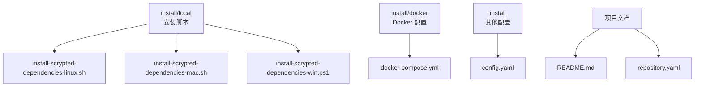
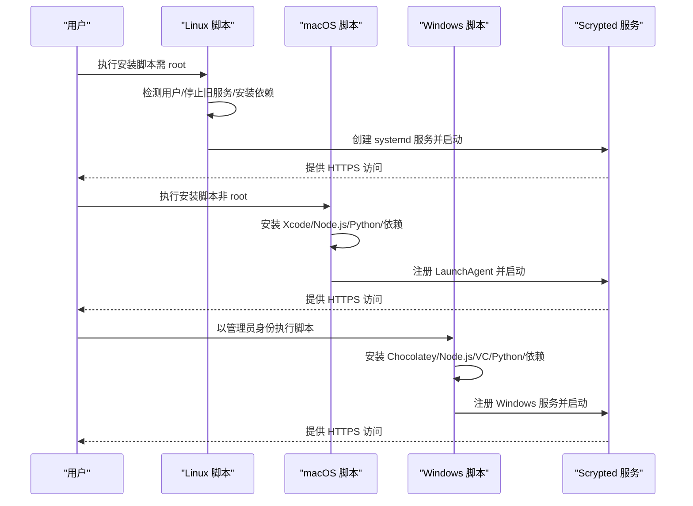
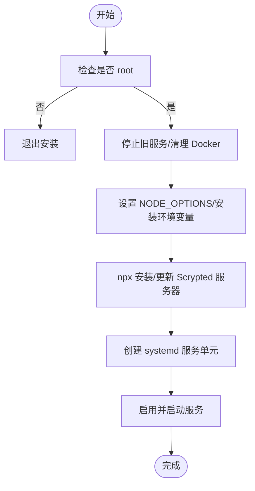
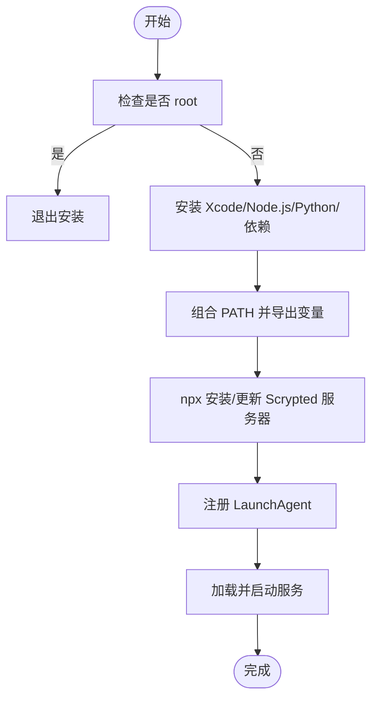
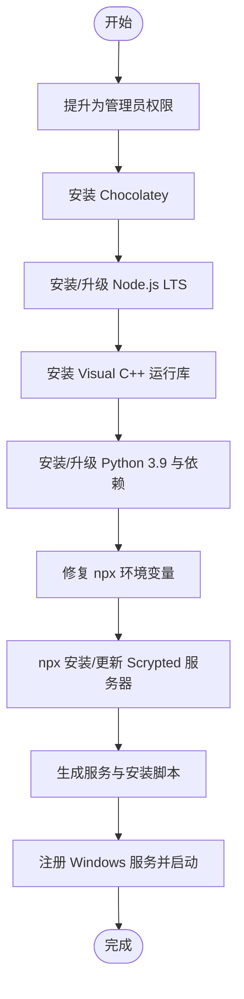
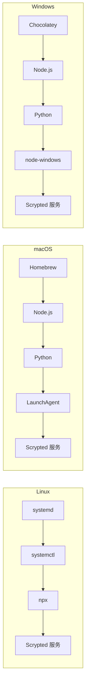

# 裸机直接安装

<cite>
**本文引用的文件**
- [install-scrypted-dependencies-linux.sh](file://install/local/install-scrypted-dependencies-linux.sh)
- [install-scrypted-dependencies-mac.sh](file://install/local/install-scrypted-dependencies-mac.sh)
- [install-scrypted-dependencies-win.ps1](file://install/local/install-scrypted-dependencies-win.ps1)
- [docker-compose.yml](file://install/docker/docker-compose.yml)
- [config.yaml](file://install/config.yaml)
- [README.md](file://README.md)
- [repository.yaml](file://repository.yaml)
</cite>

## 目录
1. [简介](#简介)
2. [项目结构](#项目结构)
3. [核心组件](#核心组件)
4. [架构总览](#架构总览)
5. [详细组件分析](#详细组件分析)
6. [依赖关系分析](#依赖关系分析)
7. [性能考虑](#性能考虑)
8. [故障排查指南](#故障排查指南)
9. [结论](#结论)
10. [附录](#附录)

## 简介
本指南面向在裸机上直接安装 Scrypted 的用户，覆盖 Linux、macOS、Windows 三大平台的系统要求、前置依赖安装、权限与用户环境设置、安装脚本使用方法与参数、服务配置与启动方式、硬件要求评估、性能调优与监控建议，以及常见安装问题的排查与解决。文档内容严格基于仓库中的安装脚本与配置文件整理，确保可操作性与准确性。

## 项目结构
围绕裸机直接安装，仓库中与之最相关的目录与文件如下：
- install/local：包含针对 Linux、macOS、Windows 的安装脚本，负责依赖安装、服务注册与启动。
- install/docker：包含 Docker Compose 配置与示例，用于理解容器化场景下的卷、设备映射、DNS 等配置，便于对照裸机安装时的系统级配置。
- install/config.yaml：Home Assistant Add-on 的配置示例，展示环境变量、卷挂载、设备映射等，有助于理解硬件加速与外部设备访问需求。
- README.md 与 repository.yaml：提供项目背景与社区入口，便于进一步查阅官方文档与维护者信息。

**图表来源**
- [install-scrypted-dependencies-linux.sh](file://install/local/install-scrypted-dependencies-linux.sh)
- [install-scrypted-dependencies-mac.sh](file://install/local/install-scrypted-dependencies-mac.sh)
- [install-scrypted-dependencies-win.ps1](file://install/local/install-scrypted-dependencies-win.ps1)
- [docker-compose.yml](file://install/docker/docker-compose.yml)
- [config.yaml](file://install/config.yaml)
- [README.md](file://README.md)
- [repository.yaml](file://repository.yaml)

**章节来源**
- [README.md:1-59](file://README.md#L1-L59)
- [repository.yaml:1-4](file://repository.yaml#L1-L4)

## 核心组件
- Linux 安装脚本：负责以 root 权限执行，检测用户、停止旧服务、安装依赖、创建 systemd 服务并启动；支持通过环境变量控制安装版本与运行环境。
- macOS 安装脚本：负责以普通用户权限执行，安装 Xcode 命令行工具、Node.js、Python 及其依赖，并通过 LaunchAgent 注册服务。
- Windows 安装脚本：负责以管理员权限执行，安装 Chocolatey、Node.js、VC 运行库、Python，安装 Python 依赖，使用 node-windows 将服务注册为 Windows 服务并启动。
- Docker Compose 配置：展示卷挂载、设备映射、网络模式、DNS 设置、日志策略等，便于对照裸机安装时的系统级配置。
- Home Assistant Add-on 配置：展示环境变量、卷映射、设备映射、USB/GPIO/UART/V4L2 等硬件访问需求，帮助评估裸机硬件兼容性。

**章节来源**
- [install-scrypted-dependencies-linux.sh:1-145](file://install/local/install-scrypted-dependencies-linux.sh#L1-L145)
- [install-scrypted-dependencies-mac.sh:1-181](file://install/local/install-scrypted-dependencies-mac.sh#L1-L181)
- [install-scrypted-dependencies-win.ps1:1-139](file://install/local/install-scrypted-dependencies-win.ps1#L1-L139)
- [docker-compose.yml:1-169](file://install/docker/docker-compose.yml#L1-L169)
- [config.yaml:1-49](file://install/config.yaml#L1-L49)

## 架构总览
下图展示了三种平台的安装流程与服务启动路径，体现从依赖安装到服务注册与启动的关键步骤。

**图表来源**
- [install-scrypted-dependencies-linux.sh:35-127](file://install/local/install-scrypted-dependencies-linux.sh#L35-L127)
- [install-scrypted-dependencies-mac.sh:35-164](file://install/local/install-scrypted-dependencies-mac.sh#L35-L164)
- [install-scrypted-dependencies-win.ps1:14-134](file://install/local/install-scrypted-dependencies-win.ps1#L14-L134)

## 详细组件分析

### Linux 安装脚本分析
- 权限与用户
  - 必须以 root 或 sudo 执行，否则直接退出。
  - 支持通过环境变量指定服务用户；若服务用户为 root 且未显式允许，会进行二次确认。
- 依赖与环境
  - 停止现有 systemd 服务与可能存在的 Docker 实例。
  - 通过 npx 安装指定版本的 Scrypted 服务器。
  - 设置 NODE_OPTIONS 以优先 IPv4 解析，避免某些网络环境下 IPv6 导致的连接问题。
- 服务配置
  - 创建 systemd 单元文件，设置 User/Group、ExecStart、Restart 策略、环境变量等。
  - 启用开机自启并重启服务。
- 输出与访问
  - 成功后提示通过 systemctl 控制服务，并指出默认访问地址为 https://localhost:10443/。

**图表来源**
- [install-scrypted-dependencies-linux.sh:9-127](file://install/local/install-scrypted-dependencies-linux.sh#L9-L127)

**章节来源**
- [install-scrypted-dependencies-linux.sh:9-145](file://install/local/install-scrypted-dependencies-linux.sh#L9-L145)

### macOS 安装脚本分析
- 权限与用户
  - 不应以 root 执行，否则直接退出。
- 依赖与环境
  - 安装 Xcode 命令行工具与 Homebrew。
  - 手动下载并安装指定版本的 Node.js（避免系统签名限制导致的本地网络访问问题）。
  - 根据架构选择 Python 版本，安装 Python 与常用依赖（pip、debugpy、typing_extensions、opencv-python）。
  - 组合 PATH，确保 npx 可用。
- 服务配置
  - 通过 LaunchAgent 注册服务，设置 ProgramArguments、WorkingDirectory、环境变量（含 PATH、HOME、SCRYPTED_PYTHON_PATH）。
  - 加载并保持常驻运行。
- 输出与访问
  - 成功后提示通过 launchctl 控制服务，并指出默认访问地址为 https://localhost:10443/。

**图表来源**
- [install-scrypted-dependencies-mac.sh:9-164](file://install/local/install-scrypted-dependencies-mac.sh#L9-L164)

**章节来源**
- [install-scrypted-dependencies-mac.sh:9-181](file://install/local/install-scrypted-dependencies-mac.sh#L9-L181)

### Windows 安装脚本分析
- 权限与用户
  - 自动检测并以管理员权限重新执行脚本。
- 依赖与环境
  - 安装 Chocolatey，升级 Node.js LTS 到指定版本。
  - 安装 Visual C++ 运行库（便携 Python 所需）。
  - 使用 choco 安装 Python 3.9，并通过 py.exe 指定版本安装 pip 与依赖。
  - 刷新环境变量，修复 npx 在新版本 npm 下的路径问题。
- 服务配置
  - 在用户配置目录创建服务脚本与安装脚本，使用 node-windows 注册为 Windows 服务。
  - 通过环境变量传递用户主目录与 Python 版本。
  - 安装完成后等待一段时间再启动服务，避免安装未完全完成导致的启动失败。
- 输出与访问
  - 成功后提示默认访问地址为 https://localhost:10443/。

**图表来源**
- [install-scrypted-dependencies-win.ps1:1-134](file://install/local/install-scrypted-dependencies-win.ps1#L1-L134)

**章节来源**
- [install-scrypted-dependencies-win.ps1:1-139](file://install/local/install-scrypted-dependencies-win.ps1#L1-L139)

### Docker Compose 配置分析
- 卷与存储
  - 默认挂载相对路径 volume 至容器内数据库目录；可按需扩展为网络存储（CIFS/NFS）或主机目录。
  - 可选挂载 NVR 录像目录至容器内 /nvr，便于外部存储管理。
- 设备映射
  - 提供 USB、GPU（Intel/AMD/NVIDIA）、V4L2 设备映射示例，便于硬件加速与外部设备直连。
- 网络与发现
  - 默认使用 host 网络模式；可选在容器内运行 Avahi 或使用宿主机 Avahi（需映射相应套接字）。
- DNS 与日志
  - 支持通过环境变量配置全局 DNS 服务器，减少 npm 等上游解析问题。
  - 默认禁用容器日志驱动，避免对闪存的不必要磨损；可通过注释启用。
- 更新与监控
  - 提供 watchtower 服务，监听更新端口并自动拉取镜像；可配置周期轮询与令牌。

**章节来源**
- [docker-compose.yml:1-169](file://install/docker/docker-compose.yml#L1-L169)

### Home Assistant Add-on 配置分析
- 环境变量
  - 包含安装插件、数据卷、NVR 卷、管理员地址与凭据、安装环境标识等。
- 存储与备份
  - 明确排除部分目录用于备份，避免重复或敏感数据被备份。
- 设备与外设
  - 明确列出 GPIO、USB、UART、视频设备等映射，体现硬件直连与加速需求。
- 网络与接口
  - 开放 ingress 流与端口，支持主机网络模式，便于摄像头直连与低延迟传输。

**章节来源**
- [config.yaml:1-49](file://install/config.yaml#L1-L49)

## 依赖关系分析
- 平台差异
  - Linux：依赖 systemd、systemctl、npx、Docker（可选）。
  - macOS：依赖 Homebrew、Xcode 命令行工具、Node.js、Python、LaunchAgent。
  - Windows：依赖 Chocolatey、Node.js、Visual C++ 运行库、Python、node-windows。
- 共同依赖
  - Node.js 与 npm（npx 用于安装服务器）。
  - Python 与常用依赖（pip、debugpy、typing_extensions、opencv-python）。
  - FFmpeg（由 Scrypted 插件或系统集成提供，具体取决于部署方式）。
- 硬件与系统库
  - GPU/硬件加速：Intel/AMD/NVIDIA 设备映射示例。
  - V4L2/USB/UART/GPIO：设备映射示例，满足摄像头、传感器与外设接入。

**图表来源**
- [install-scrypted-dependencies-linux.sh:35-127](file://install/local/install-scrypted-dependencies-linux.sh#L35-L127)
- [install-scrypted-dependencies-mac.sh:35-164](file://install/local/install-scrypted-dependencies-mac.sh#L35-L164)
- [install-scrypted-dependencies-win.ps1:14-134](file://install/local/install-scrypted-dependencies-win.ps1#L14-L134)

**章节来源**
- [install-scrypted-dependencies-linux.sh:35-127](file://install/local/install-scrypted-dependencies-linux.sh#L35-L127)
- [install-scrypted-dependencies-mac.sh:35-164](file://install/local/install-scrypted-dependencies-mac.sh#L35-L164)
- [install-scrypted-dependencies-win.ps1:14-134](file://install/local/install-scrypted-dependencies-win.ps1#L14-L134)

## 性能考虑
- 网络与 DNS
  - Docker Compose 中提供了全局 DNS 服务器配置，可减少 npm 等上游解析问题，间接提升安装与更新稳定性。
- 日志与存储
  - Docker Compose 默认禁用容器日志驱动，避免对闪存的不必要磨损；生产环境可根据需要开启并设置轮转策略。
- 硬件加速与设备直连
  - Docker Compose 提供了 GPU（Intel/AMD/NVIDIA）、V4L2、USB 等设备映射示例，裸机安装时可参考这些映射以启用硬件加速与外设直连。
- 端口与网络模式
  - Docker Compose 默认使用 host 网络模式，有利于摄像头直连与低延迟传输；裸机安装时可结合防火墙与端口转发策略保障访问与安全。

**章节来源**
- [docker-compose.yml:123-131](file://install/docker/docker-compose.yml#L123-L131)
- [docker-compose.yml:135-139](file://install/docker/docker-compose.yml#L135-L139)
- [docker-compose.yml:120-121](file://install/docker/docker-compose.yml#L120-L121)

## 故障排查指南
- Linux
  - 权限不足：必须以 root 或 sudo 执行；否则脚本会直接退出。
  - 服务无法启动：检查 systemd 单元文件是否存在、权限是否正确、环境变量是否设置。
  - IPv6 解析问题：脚本已设置 NODE_OPTIONS 优先 IPv4；若仍异常，检查系统 DNS 配置。
- macOS
  - 以 root 执行：脚本禁止以 root 运行；请使用普通用户账户执行。
  - Node.js 签名限制：脚本手动安装指定版本 Node.js，避免系统签名导致的本地网络访问问题。
  - Python 版本与依赖：根据架构选择合适版本，确保 pip 与依赖安装成功。
- Windows
  - 权限不足：脚本会自动以管理员权限重新执行；若失败，请手动右键以管理员身份运行。
  - npx 路径问题：脚本刷新环境变量并修复 npm 相关问题；若仍失败，检查 npm 是否正常安装。
  - 服务安装失败：node-windows 注册服务后会等待一段时间再启动；若失败，查看服务日志与错误输出。
- 通用
  - 访问证书：首次访问会被浏览器标记为不受信任，需手动接受忽略。
  - 端口占用：默认访问地址为 https://localhost:10443/；若端口被占用，需调整服务端口或释放端口。

**章节来源**
- [install-scrypted-dependencies-linux.sh:9-13](file://install/local/install-scrypted-dependencies-linux.sh#L9-L13)
- [install-scrypted-dependencies-linux.sh:112-118](file://install/local/install-scrypted-dependencies-linux.sh#L112-L118)
- [install-scrypted-dependencies-mac.sh:9-13](file://install/local/install-scrypted-dependencies-mac.sh#L9-L13)
- [install-scrypted-dependencies-mac.sh:43-46](file://install/local/install-scrypted-dependencies-mac.sh#L43-L46)
- [install-scrypted-dependencies-win.ps1:5-10](file://install/local/install-scrypted-dependencies-win.ps1#L5-L10)
- [install-scrypted-dependencies-win.ps1:36-39](file://install/local/install-scrypted-dependencies-win.ps1#L36-L39)
- [install-scrypted-dependencies-win.ps1:113-121](file://install/local/install-scrypted-dependencies-win.ps1#L113-L121)

## 结论
通过仓库中的安装脚本与配置文件，Scrypted 在 Linux、macOS、Windows 三大平台上提供了清晰的裸机直接安装路径。脚本统一处理了依赖安装、服务注册与启动，并针对各平台的特性（如 macOS 的签名限制、Windows 的管理员权限）进行了专门处理。配合 Docker Compose 与 Home Assistant Add-on 的配置，用户可以快速评估硬件兼容性、启用硬件加速与外设直连，并在生产环境中优化网络、日志与存储策略。

## 附录

### 系统要求与前置依赖清单
- Linux
  - 权限：root 或 sudo。
  - 依赖：systemd、systemctl、npx（随 Node.js/npm 提供）。
  - 可选：Docker（用于容器化场景，脚本中也支持清理与停止容器实例）。
- macOS
  - 权限：非 root 用户。
  - 依赖：Xcode 命令行工具、Homebrew、Node.js、Python、pip、debugpy、typing_extensions、opencv-python。
- Windows
  - 权限：管理员。
  - 依赖：Chocolatey、Node.js、Visual C++ 运行库、Python、pip、debugpy、typing_extensions、opencv-python。
- 共同依赖
  - Node.js 与 npm（npx 用于安装服务器）。
  - Python 与常用依赖（pip、debugpy、typing_extensions、opencv-python）。
  - FFmpeg（由 Scrypted 插件或系统集成提供，具体取决于部署方式）。

**章节来源**
- [install-scrypted-dependencies-linux.sh:35-127](file://install/local/install-scrypted-dependencies-linux.sh#L35-L127)
- [install-scrypted-dependencies-mac.sh:35-164](file://install/local/install-scrypted-dependencies-mac.sh#L35-L164)
- [install-scrypted-dependencies-win.ps1:14-134](file://install/local/install-scrypted-dependencies-win.ps1#L14-L134)

### 权限配置与用户环境设置
- Linux
  - 服务用户：通过环境变量指定；若为 root 且未显式允许，脚本会进行二次确认。
  - 文件权限：脚本会为用户家目录下的 .scrypted 目录设置正确的所有者。
- macOS
  - 用户：非 root 用户；脚本会注册 LaunchAgent 并设置 WorkingDirectory。
  - 环境变量：PATH、HOME、SCRYPTED_PYTHON_PATH 等。
- Windows
  - 用户：以当前用户配置服务；通过环境变量传递用户主目录与 Python 版本。
  - 服务：使用 node-windows 注册为系统服务并自动启动。

**章节来源**
- [install-scrypted-dependencies-linux.sh:26-90](file://install/local/install-scrypted-dependencies-linux.sh#L26-L90)
- [install-scrypted-dependencies-mac.sh:123-161](file://install/local/install-scrypted-dependencies-mac.sh#L123-L161)
- [install-scrypted-dependencies-win.ps1:87-129](file://install/local/install-scrypted-dependencies-win.ps1#L87-L129)

### 安装脚本使用方法与参数
- Linux
  - 执行方式：以 root 或 sudo 运行脚本。
  - 关键参数：SERVICE_USER（服务用户）、SCRYPTED_INSTALL_VERSION（安装版本）、SCRYPTED_INSTALL_ENVIRONMENT（安装环境）。
  - 服务控制：通过 systemctl start/stop/restart/enable/disable 控制服务。
- macOS
  - 执行方式：以普通用户运行脚本。
  - 关键参数：无强制必需参数；脚本内部会安装 Node.js 与 Python 并注册 LaunchAgent。
  - 服务控制：通过 launchctl load/unload/enable/disable 控制服务。
- Windows
  - 执行方式：以管理员权限运行脚本。
  - 关键参数：SCRYPTED_INSTALL_VERSION（安装版本，可选）。
  - 服务控制：通过 node-windows 注册的服务进行控制。

**章节来源**
- [install-scrypted-dependencies-linux.sh:81-127](file://install/local/install-scrypted-dependencies-linux.sh#L81-L127)
- [install-scrypted-dependencies-mac.sh:120-164](file://install/local/install-scrypted-dependencies-mac.sh#L120-L164)
- [install-scrypted-dependencies-win.ps1:47-53](file://install/local/install-scrypted-dependencies-win.ps1#L47-L53)

### 服务配置与启动选项
- Linux：systemd 单元文件包含 User/Group、ExecStart、Restart、环境变量等配置。
- macOS：LaunchAgent plist 包含 ProgramArguments、WorkingDirectory、环境变量（PATH、HOME、SCRYPTED_PYTHON_PATH）。
- Windows：node-windows 服务包含名称、描述、脚本路径与环境变量（USERPROFILE、SCRYPTED_WINDOWS_PYTHON_VERSION）。

**章节来源**
- [install-scrypted-dependencies-linux.sh:102-123](file://install/local/install-scrypted-dependencies-linux.sh#L102-L123)
- [install-scrypted-dependencies-mac.sh:123-161](file://install/local/install-scrypted-dependencies-mac.sh#L123-L161)
- [install-scrypted-dependencies-win.ps1:87-129](file://install/local/install-scrypted-dependencies-win.ps1#L87-L129)

### 硬件要求评估
- GPU/硬件加速
  - Intel/AMD/NVIDIA 设备映射示例，适合启用硬件解码与推理加速。
- 视频与外设
  - V4L2、USB、UART、GPIO 等设备映射示例，满足摄像头、传感器与外设接入需求。
- 存储与网络
  - 可选网络存储（CIFS/NFS）与主机目录挂载，结合 NVR 功能实现集中存储与管理。

**章节来源**
- [docker-compose.yml:96-117](file://install/docker/docker-compose.yml#L96-L117)
- [config.yaml:38-48](file://install/config.yaml#L38-L48)

### 性能调优与监控配置
- DNS 优化：通过环境变量配置全局 DNS 服务器，减少上游解析问题。
- 日志策略：默认禁用容器日志驱动，避免对闪存的不必要磨损；可按需启用并设置轮转。
- 网络模式：host 网络模式有利于摄像头直连与低延迟传输；结合防火墙策略保障访问与安全。
- 更新与监控：watchtower 服务可配置周期轮询与令牌，实现自动化更新与健康监控。

**章节来源**
- [docker-compose.yml:135-139](file://install/docker/docker-compose.yml#L135-L139)
- [docker-compose.yml:120-121](file://install/docker/docker-compose.yml#L120-L121)
- [docker-compose.yml:142-160](file://install/docker/docker-compose.yml#L142-L160)