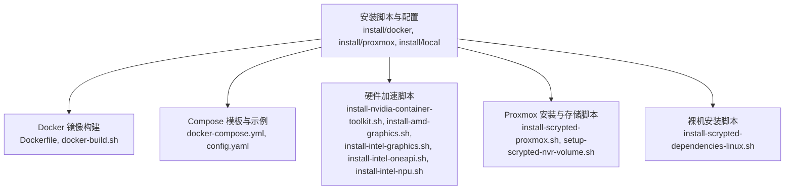
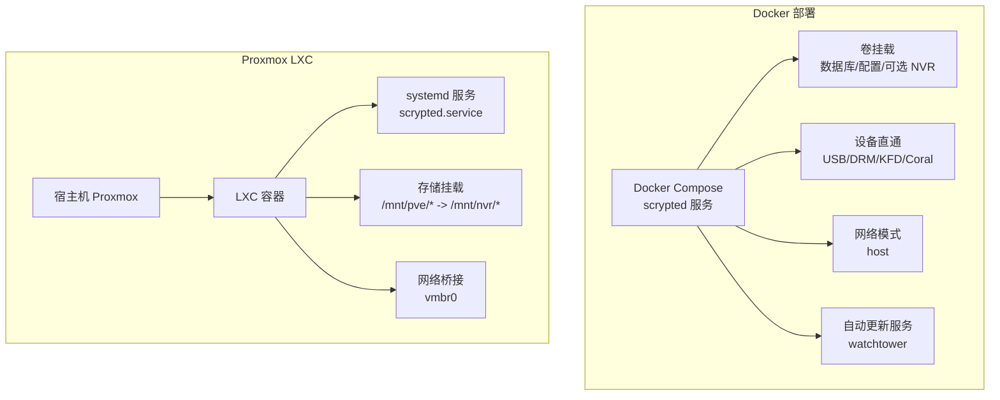
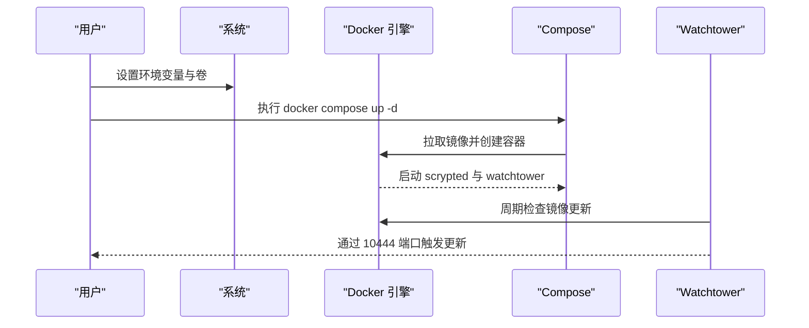
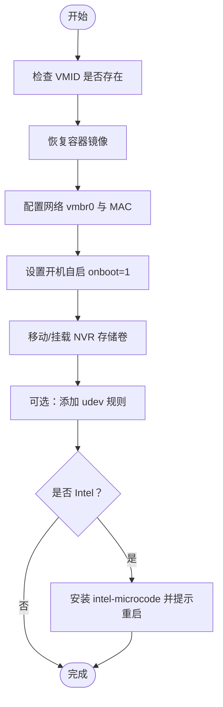
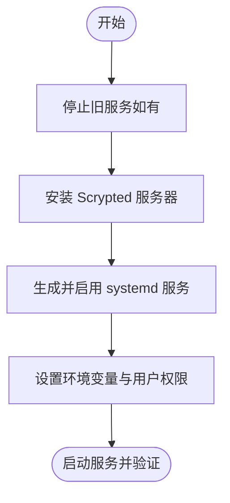
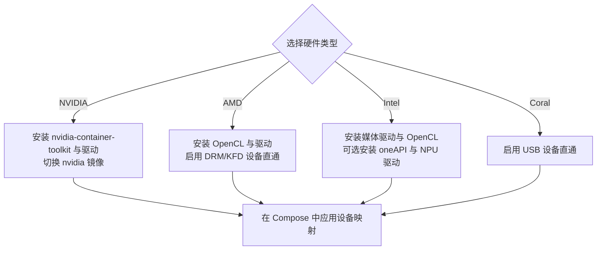
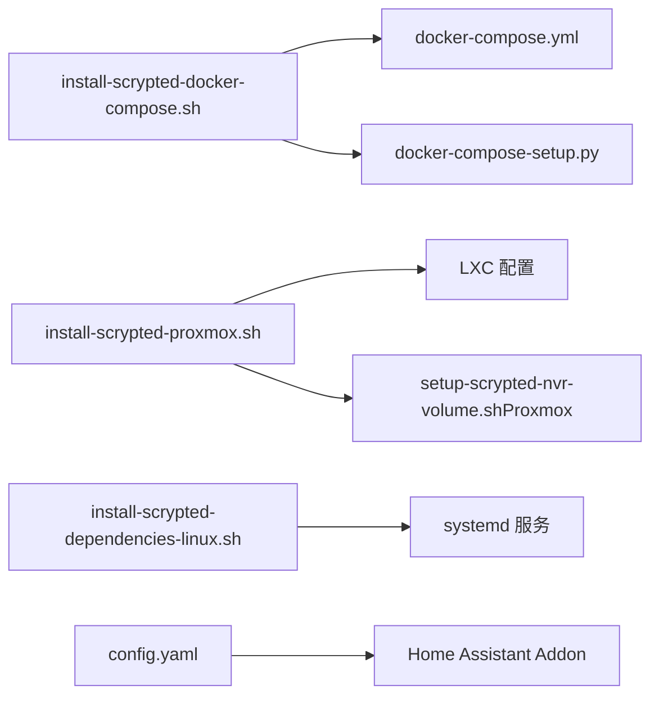

# 部署方式

<cite>
**本文引用的文件**
- [docker-compose.yml](file://install/docker/docker-compose.yml)
- [Dockerfile](file://install/docker/Dockerfile)
- [install-scrypted-docker-compose.sh](file://install/docker/install-scrypted-docker-compose.sh)
- [docker-compose-setup.py](file://install/docker/docker-compose-setup.py)
- [setup-scrypted-nvr-volume.sh](file://install/docker/setup-scrypted-nvr-volume.sh)
- [install-nvidia-container-toolkit.sh](file://install/docker/install-nvidia-container-toolkit.sh)
- [install-amd-graphics.sh](file://install/docker/install-amd-graphics.sh)
- [install-intel-graphics.sh](file://install/docker/install-intel-graphics.sh)
- [install-intel-oneapi.sh](file://install/docker/install-intel-oneapi.sh)
- [install-intel-npu.sh](file://install/docker/install-intel-npu.sh)
- [docker-build.sh](file://install/docker/docker-build.sh)
- [install-scrypted-proxmox.sh](file://install/proxmox/install-scrypted-proxmox.sh)
- [setup-scrypted-nvr-volume.sh（Proxmox）](file://install/proxmox/setup-scrypted-nvr-volume.sh)
- [install-scrypted-dependencies-linux.sh](file://install/local/install-scrypted-dependencies-linux.sh)
- [config.yaml（Home Assistant Addon）](file://install/config.yaml)
- [README.md](file://README.md)
</cite>

## 目录
1. [简介](#简介)
2. [项目结构](#项目结构)
3. [核心组件](#核心组件)
4. [架构总览](#架构总览)
5. [详细组件分析](#详细组件分析)
6. [依赖关系分析](#依赖关系分析)
7. [性能考虑](#性能考虑)
8. [故障排查指南](#故障排查指南)
9. [结论](#结论)
10. [附录](#附录)

## 简介
本指南面向不同技术背景与运维需求的用户，系统梳理 Scrypted 在多种环境下的部署方式与最佳实践，覆盖以下主题：
- Docker 容器化部署：从 docker-compose.yml 配置、环境变量、卷挂载、网络模式到自动更新与硬件加速直通。
- Proxmox 虚拟化平台：LXC 容器安装、存储挂载、硬件直通与引导配置。
- 裸机安装：Linux 发行版兼容性、依赖安装、权限与服务管理。
- 云平台部署：AWS/Azure/Google Cloud 的通用策略与注意事项。
- Kubernetes 集群部署：Deployment、Service、ConfigMap 的 YAML 参考与适配建议。
- 硬件加速：NVIDIA GPU、Intel NPU、Coral TPU 的设备直通与驱动安装脚本。

## 项目结构
围绕部署与安装的关键目录与文件如下：
- 安装脚本与配置：install/docker、install/proxmox、install/local
- Docker 构建与镜像：install/docker/Dockerfile、install/docker/docker-build.sh
- 配置模板与示例：install/docker/docker-compose.yml、install/config.yaml
- 硬件加速脚本：install/docker/install-*.sh 系列
- Proxmox 安装脚本：install/proxmox/install-scrypted-proxmox.sh、install/proxmox/setup-scrypted-nvr-volume.sh

**图表来源**
- [Dockerfile:1-22](file://install/docker/Dockerfile#L1-L22)
- [docker-compose.yml:1-169](file://install/docker/docker-compose.yml#L1-L169)
- [install-scrypted-docker-compose.sh:1-190](file://install/docker/install-scrypted-docker-compose.sh#L1-L190)
- [install-scrypted-proxmox.sh:1-311](file://install/proxmox/install-scrypted-proxmox.sh#L1-L311)
- [install-scrypted-dependencies-linux.sh:1-145](file://install/local/install-scrypted-dependencies-linux.sh#L1-L145)

**章节来源**
- [README.md:1-59](file://README.md#L1-L59)

## 核心组件
- Docker Compose 编排：定义服务、环境变量、卷、设备直通、网络模式与日志策略，并集成自动更新服务。
- 容器镜像：基于 Node 基础镜像，通过 npx 安装并启动 Scrypted 服务器。
- 硬件加速脚本：按需安装 NVIDIA/AMD/Intel 图形与 NPU 驱动，以及容器运行时工具。
- Proxmox 安装脚本：自动化恢复/重装 LXC 容器、网络与开机配置、udev 规则与 CPU 微代码更新。
- 裸机安装脚本：以 systemd 服务方式运行 Scrypted，支持非 root 用户与权限管理。
- Home Assistant Addon 配置：示例映射设备、环境变量与存储路径。

**章节来源**
- [docker-compose.yml:20-169](file://install/docker/docker-compose.yml#L20-L169)
- [Dockerfile:1-22](file://install/docker/Dockerfile#L1-L22)
- [install-scrypted-docker-compose.sh:1-190](file://install/docker/install-scrypted-docker-compose.sh#L1-L190)
- [install-scrypted-proxmox.sh:1-311](file://install/proxmox/install-scrypted-proxmox.sh#L1-L311)
- [install-scrypted-dependencies-linux.sh:1-145](file://install/local/install-scrypted-dependencies-linux.sh#L1-L145)
- [config.yaml:1-49](file://install/config.yaml#L1-L49)

## 架构总览
下图展示 Docker 与 Proxmox 两种部署形态的核心交互：容器内运行 Scrypted 服务，通过卷挂载实现数据持久化与 NVR 存储，通过设备直通启用硬件加速；Proxmox 场景中由宿主管理存储与网络，容器内仅暴露必要设备。

**图表来源**
- [docker-compose.yml:20-169](file://install/docker/docker-compose.yml#L20-L169)
- [install-scrypted-docker-compose.sh:144-177](file://install/docker/install-scrypted-docker-compose.sh#L144-L177)
- [install-scrypted-proxmox.sh:157-184](file://install/proxmox/install-scrypted-proxmox.sh#L157-L184)

## 详细组件分析

### Docker 容器化部署
- Compose 服务与网络
  - 服务名：scrypted
  - 网络模式：host，便于设备直通与端口发现
  - 日志策略：默认禁用容器日志驱动，避免对存储写入压力
- 环境变量
  - 自动更新：SCRYPTED_WEBHOOK_UPDATE、SCRYPTED_WEBHOOK_UPDATE_AUTHORIZATION
  - DNS：SCRYPTED_DNS_SERVER_0/1
  - Avahi（可选）：SCRYPTED_DOCKER_AVAHI
  - NVR 存储（可选）：SCRYPTED_NVR_VOLUME
- 卷挂载
  - 数据库/配置：相对路径 volume -> /server/volume
  - NVR 存储（可选）：本地路径或网络卷（CIFS/NFS 示例在注释中）
- 设备直通
  - USB/Coral/AMD GPU/Intel DRM/KFD 等设备映射示例位于 devices 列表
  - 提供 Python 脚本自动检测并追加已存在设备
- 自动更新
  - watchtower 服务监听 10444 端口，使用 HTTP API 进行周期检查与更新
- 镜像与构建
  - 基于 ghcr.io/koush/scrypted-common:*，通过 npx 安装并启动服务
  - 支持多变体镜像（nvidia/intel/lite/full 等）

**图表来源**
- [docker-compose.yml:20-169](file://install/docker/docker-compose.yml#L20-L169)
- [install-scrypted-docker-compose.sh:141-177](file://install/docker/install-scrypted-docker-compose.sh#L141-L177)

**章节来源**
- [docker-compose.yml:20-169](file://install/docker/docker-compose.yml#L20-L169)
- [Dockerfile:1-22](file://install/docker/Dockerfile#L1-L22)
- [docker-compose-setup.py:1-46](file://install/docker/docker-compose-setup.py#L1-L46)
- [install-scrypted-docker-compose.sh:1-190](file://install/docker/install-scrypted-docker-compose.sh#L1-L190)

### Proxmox 虚拟化平台部署
- 安装与恢复
  - 使用官方备份镜像恢复 LXC 容器，自动配置网络（vmbr0）、开机启动与主机名
  - 支持“保留配置”与“强制重装”两种模式，注意 NVR 额外卷会被清理
- 存储挂载
  - 将宿主存储目录挂载至容器内的 /mnt/nvr/<type>/<name>，并以隐藏标记目录确保可见性
  - 支持 fast/large 类型区分
- 硬件直通与微代码
  - 可选添加 udev 规则以放宽设备权限（Coral/DRM/KFD/USB）
  - Intel 平台可安装 microcode 包并建议重启
- 网络与引导
  - 默认桥接到 vmbr0，支持 DHCP/IPv6 自动配置
  - 开机自启 onboot=1

**图表来源**
- [install-scrypted-proxmox.sh:1-311](file://install/proxmox/install-scrypted-proxmox.sh#L1-L311)
- [setup-scrypted-nvr-volume.sh（Proxmox）:1-75](file://install/proxmox/setup-scrypted-nvr-volume.sh#L1-L75)

**章节来源**
- [install-scrypted-proxmox.sh:1-311](file://install/proxmox/install-scrypted-proxmox.sh#L1-L311)
- [setup-scrypted-nvr-volume.sh（Proxmox）:1-75](file://install/proxmox/setup-scrypted-nvr-volume.sh#L1-L75)

### 裸机安装（Linux）
- 用户与权限
  - 推荐非 root 用户运行，若使用 root，脚本会进行确认提示
  - 自动设置 .scrypted 目录属主与权限
- 服务管理
  - 通过 systemd 安装 scrypted.service，ExecStart 直接调用 npx scrypted serve
  - 支持 enable/disable/start/stop 控制
- 依赖与环境
  - 导出 NODE_OPTIONS 以优先 IPv4 解析，规避部分网络环境问题
  - 支持 LXC 环境变量注入

**图表来源**
- [install-scrypted-dependencies-linux.sh:1-145](file://install/local/install-scrypted-dependencies-linux.sh#L1-L145)

**章节来源**
- [install-scrypted-dependencies-linux.sh:1-145](file://install/local/install-scrypted-dependencies-linux.sh#L1-L145)

### 云平台部署（AWS/Azure/Google Cloud）
- 通用策略
  - 优先使用 Linux 实例，满足 Docker 或裸机安装条件
  - 使用安全组/防火墙开放必要端口（HTTPS 10443、自动更新 10444、SSH 等）
  - 使用持久化存储（EBS/EFS/磁盘卷）挂载至容器或服务数据目录
  - 通过 DNS/反向代理或证书管理服务保障 HTTPS 与域名解析
- 注意事项
  - 不同云厂商的内核版本与驱动仓库可能差异较大，建议参考对应硬件加速脚本中的发行版判断逻辑
  - 对 GPU 加速场景，确保实例规格支持 vGPU 或直通，并提前安装相应驱动与容器运行时

[本节为通用指导，不直接分析具体文件，故无“章节来源”]

### Kubernetes 集群部署
- 建议结构
  - Deployment：运行 scrypted 主服务与 watchtower 更新服务
  - Service：ClusterIP/LoadBalancer 暴露 HTTPS 与自动更新端口
  - ConfigMap：存放环境变量（如 DNS、Webhook 更新参数）
  - PersistentVolume/PersistentVolumeClaim：挂载数据库与 NVR 存储
  - DevicePlugins/SecurityContext：根据需要启用设备直通（GPU/USB/NPU）
- 关键点
  - 网络模式：建议使用 HostNetwork 以便设备直通与端口发现
  - 权限：为容器授予必要的设备访问权限与 AppArmor/SELinux 策略
  - 自动更新：watchtower 作为独立 Pod 运行，通过 HTTP API 触发更新

[本节为概念性说明，未直接映射到具体源码文件，故无“章节来源”]

### 硬件加速配置
- NVIDIA GPU
  - 通过脚本安装 nvidia-container-toolkit 与驱动，配置 Docker 运行时
  - 在 Compose 中切换到 nvidia 变体镜像并启用设备直通
- AMD GPU
  - 安装 OpenCL 与驱动，启用 DRM/KFD 设备直通
- Intel
  - 安装媒体驱动与 OpenCL 运行时，必要时安装 oneAPI 组件
  - Intel NPU：下载并安装 Level Zero 与 NPU 驱动，按需安装固件并重启
- Coral TPU
  - 通过 USB 设备直通启用 PCIe/USB Coral

**图表来源**
- [install-nvidia-container-toolkit.sh:1-64](file://install/docker/install-nvidia-container-toolkit.sh#L1-L64)
- [install-amd-graphics.sh:1-56](file://install/docker/install-amd-graphics.sh#L1-L56)
- [install-intel-graphics.sh:1-121](file://install/docker/install-intel-graphics.sh#L1-L121)
- [install-intel-oneapi.sh:1-19](file://install/docker/install-intel-oneapi.sh#L1-L19)
- [install-intel-npu.sh:1-83](file://install/docker/install-intel-npu.sh#L1-L83)
- [docker-compose.yml:96-117](file://install/docker/docker-compose.yml#L96-L117)

**章节来源**
- [install-nvidia-container-toolkit.sh:1-64](file://install/docker/install-nvidia-container-toolkit.sh#L1-L64)
- [install-amd-graphics.sh:1-56](file://install/docker/install-amd-graphics.sh#L1-L56)
- [install-intel-graphics.sh:1-121](file://install/docker/install-intel-graphics.sh#L1-L121)
- [install-intel-oneapi.sh:1-19](file://install/docker/install-intel-oneapi.sh#L1-L19)
- [install-intel-npu.sh:1-83](file://install/docker/install-intel-npu.sh#L1-L83)
- [docker-compose.yml:96-117](file://install/docker/docker-compose.yml#L96-L117)

## 依赖关系分析
- Compose 与脚本
  - install-scrypted-docker-compose.sh 会拉取 docker-compose.yml 模板并根据硬件与环境自动启用 Avahi、NVIDIA 镜像与设备直通
  - docker-compose-setup.py 用于自动检测宿主设备并在 Compose 中追加 devices 映射
- Proxmox 与存储
  - install-scrypted-proxmox.sh 负责恢复容器、网络与开机配置
  - setup-scrypted-nvr-volume.sh（Proxmox）负责在 LXC 配置中添加存储挂载条目
- 裸机与服务
  - install-scrypted-dependencies-linux.sh 生成 systemd 服务并启动 scrypted
- Home Assistant Addon
  - config.yaml 提供设备映射、环境变量与存储路径示例

**图表来源**
- [install-scrypted-docker-compose.sh:1-190](file://install/docker/install-scrypted-docker-compose.sh#L1-L190)
- [docker-compose.yml:1-169](file://install/docker/docker-compose.yml#L1-L169)
- [docker-compose-setup.py:1-46](file://install/docker/docker-compose-setup.py#L1-L46)
- [install-scrypted-proxmox.sh:1-311](file://install/proxmox/install-scrypted-proxmox.sh#L1-L311)
- [setup-scrypted-nvr-volume.sh（Proxmox）:1-75](file://install/proxmox/setup-scrypted-nvr-volume.sh#L1-L75)
- [install-scrypted-dependencies-linux.sh:1-145](file://install/local/install-scrypted-dependencies-linux.sh#L1-L145)
- [config.yaml:1-49](file://install/config.yaml#L1-L49)

**章节来源**
- [install-scrypted-docker-compose.sh:1-190](file://install/docker/install-scrypted-docker-compose.sh#L1-L190)
- [docker-compose-setup.py:1-46](file://install/docker/docker-compose-setup.py#L1-L46)
- [install-scrypted-proxmox.sh:1-311](file://install/proxmox/install-scrypted-proxmox.sh#L1-L311)
- [setup-scrypted-nvr-volume.sh（Proxmox）:1-75](file://install/proxmox/setup-scrypted-nvr-volume.sh#L1-L75)
- [install-scrypted-dependencies-linux.sh:1-145](file://install/local/install-scrypted-dependencies-linux.sh#L1-L145)
- [config.yaml:1-49](file://install/config.yaml#L1-L49)

## 性能考虑
- 日志策略：默认禁用容器日志驱动，降低对存储的写入压力
- DNS：使用全局 DNS 服务器（如 1.1.1.1/8.8.8.8），提升 npm 等外部资源解析稳定性
- 网络模式：host 模式有利于设备直通与端口发现，但需注意安全边界
- 自动更新：watchtower 通过 HTTP API 周期轮询，建议合理设置轮询间隔与令牌

**章节来源**
- [docker-compose.yml:123-139](file://install/docker/docker-compose.yml#L123-L139)
- [install-scrypted-docker-compose.sh:141-177](file://install/docker/install-scrypted-docker-compose.sh#L141-L177)

## 故障排查指南
- Docker Compose
  - 若设备直通无效，检查 devices 列表与宿主设备是否存在；可使用 docker-compose-setup.py 自动追加
  - 若 Avahi 冲突，确认是否同时启用宿主与容器内 Avahi，按注释调整 security_opt
  - 若 DNS 解析异常，检查 SCRYPTED_DNS_SERVER_* 环境变量
- Proxmox
  - 存储挂载不可见：确认挂载路径位于 /mnt 下并已在 LXC 配置中添加 lxc.mount.entry
  - 重启后规则失效：确认 udev 规则已 reload/trigger
- 裸机安装
  - 权限问题：确保 .scrypted 目录属主正确，必要时切换非 root 用户
  - 服务无法启动：查看 systemd 日志与环境变量 NODE_OPTIONS
- 硬件加速
  - NVIDIA：确认已安装 nvidia-container-toolkit 并启用 nvidia 镜像；容器内 nvidia-smi 可验证
  - Intel：确认已安装媒体驱动与 OpenCL 运行时；oneAPI 可选安装
  - Coral：确认 USB 设备映射与权限

**章节来源**
- [docker-compose-setup.py:1-46](file://install/docker/docker-compose-setup.py#L1-L46)
- [docker-compose.yml:73-95](file://install/docker/docker-compose.yml#L73-L95)
- [install-scrypted-proxmox.sh:224-248](file://install/proxmox/install-scrypted-proxmox.sh#L224-L248)
- [install-scrypted-dependencies-linux.sh:1-145](file://install/local/install-scrypted-dependencies-linux.sh#L1-L145)
- [install-nvidia-container-toolkit.sh:1-64](file://install/docker/install-nvidia-container-toolkit.sh#L1-L64)
- [install-intel-graphics.sh:1-121](file://install/docker/install-intel-graphics.sh#L1-L121)

## 结论
- Docker 适合快速部署与硬件加速直通，配合 watchtower 实现自动更新
- Proxmox 提供更贴近物理机的虚拟化体验，适合需要稳定存储与设备直通的场景
- 裸机安装适合对权限与资源控制有更高要求的用户
- 云平台与 Kubernetes 需结合各自生态完善网络、存储与设备直通策略
- 硬件加速脚本覆盖主流厂商生态，建议按需启用并验证设备可用性

[本节为总结性内容，不直接分析具体文件，故无“章节来源”]

## 附录
- NVR 存储配置
  - Docker：通过 setup-scrypted-nvr-volume.sh 自动格式化磁盘并修改 Compose 挂载
  - Proxmox：通过 setup-scrypted-nvr-volume.sh（Proxmox）在 LXC 配置中添加挂载条目
- 构建镜像
  - docker-build.sh 提供多变体镜像构建流程（full/s6 等）

**章节来源**
- [setup-scrypted-nvr-volume.sh:1-160](file://install/docker/setup-scrypted-nvr-volume.sh#L1-L160)
- [setup-scrypted-nvr-volume.sh（Proxmox）:1-75](file://install/proxmox/setup-scrypted-nvr-volume.sh#L1-L75)
- [docker-build.sh:1-19](file://install/docker/docker-build.sh#L1-L19)