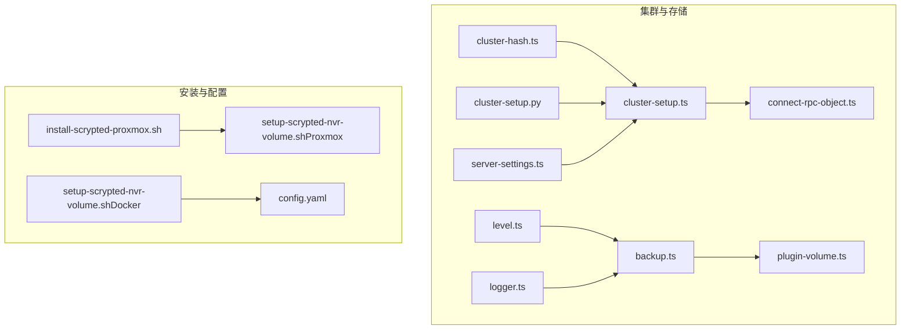
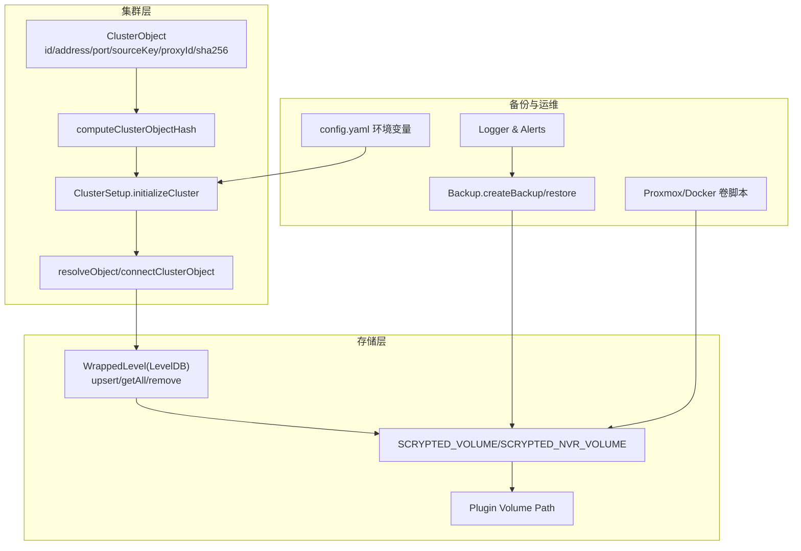
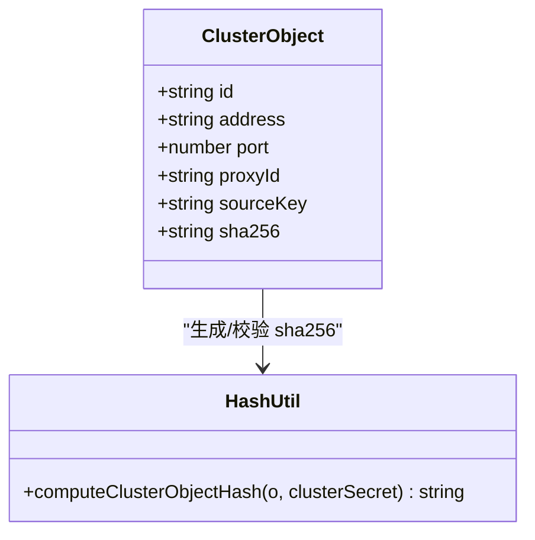
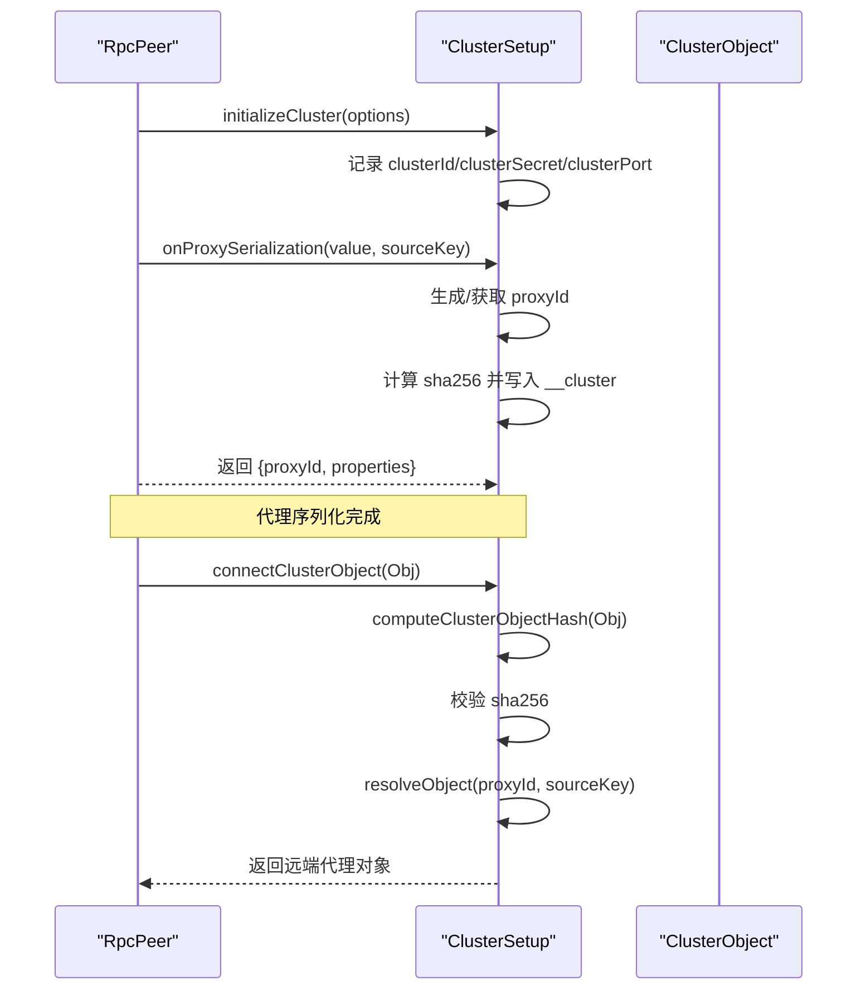
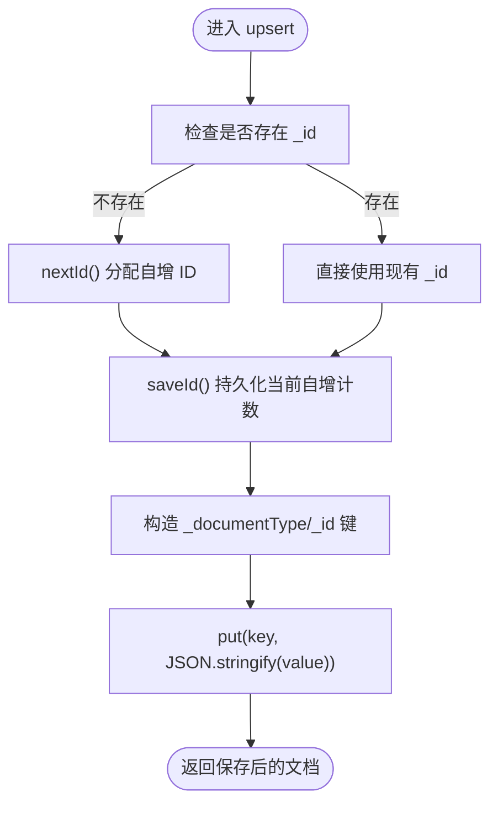
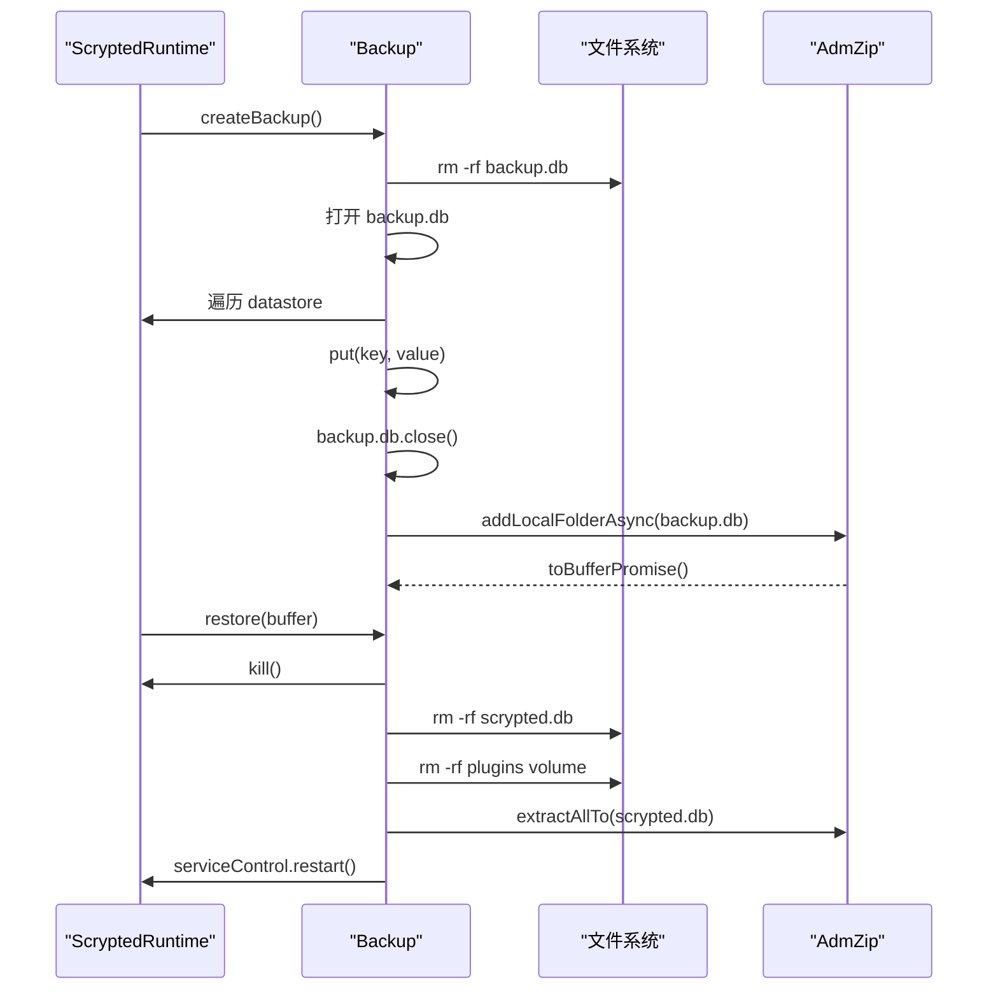
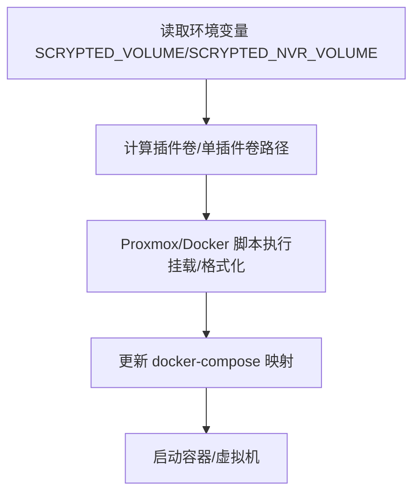
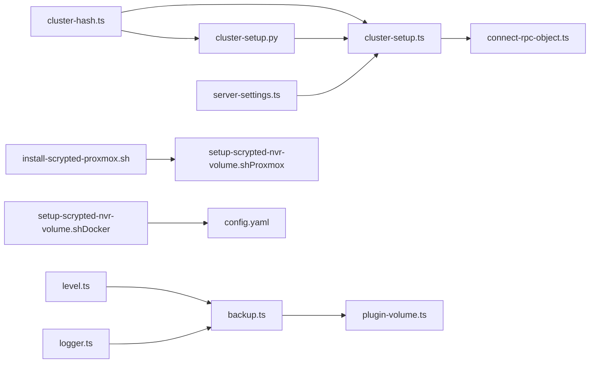

# 分布式存储配置

<cite>
**本文引用的文件**
- [cluster-hash.ts](file://server/src/cluster/cluster-hash.ts)
- [cluster-setup.ts](file://server/src/cluster/cluster-setup.ts)
- [connect-rpc-object.ts](file://server/src/cluster/connect-rpc-object.ts)
- [cluster-setup.py](file://server/python/cluster_setup.py)
- [backup.ts](file://server/src/services/backup.ts)
- [level.ts](file://server/src/level.ts)
- [logger.ts](file://server/src/logger.ts)
- [plugin-volume.ts](file://server/src/plugin/plugin-volume.ts)
- [server-settings.ts](file://server/src/server-settings.ts)
- [install-scrypted-proxmox.sh](file://install/proxmox/install-scrypted-proxmox.sh)
- [setup-scrypted-nvr-volume.sh（Proxmox）](file://install/proxmox/setup-scrypted-nvr-volume.sh)
- [setup-scrypted-nvr-volume.sh（Docker）](file://install/docker/setup-scrypted-nvr-volume.sh)
- [config.yaml](file://install/config.yaml)
</cite>

## 目录
1. [简介](#简介)
2. [项目结构](#项目结构)
3. [核心组件](#核心组件)
4. [架构总览](#架构总览)
5. [详细组件分析](#详细组件分析)
6. [依赖关系分析](#依赖关系分析)
7. [性能考虑](#性能考虑)
8. [故障排查指南](#故障排查指南)
9. [结论](#结论)
10. [附录](#附录)

## 简介
本文件面向在 Scrypted 中部署与运维分布式存储的工程团队，系统化阐述分布式存储的架构设计、数据分片与副本、一致性模型、数据哈希与路由、存储分区配置、备份与恢复、性能优化、监控告警以及安全配置，并提供可操作的部署与运维脚本指引。内容基于仓库中集群通信、本地键值存储、备份服务、卷挂载与环境变量等实现进行提炼与整合。

## 项目结构
围绕分布式存储相关的关键目录与文件如下：
- 集群对象与哈希：server/src/cluster/*
- 集群初始化与代理序列化：server/src/cluster/cluster-setup.ts、server/python/cluster_setup.py
- 数据持久化与键值存储封装：server/src/level.ts
- 备份与恢复：server/src/services/backup.ts
- 日志与告警：server/src/logger.ts
- 存储卷路径与插件卷：server/src/plugin/plugin-volume.ts
- 服务器端口与集群工作线程：server/src/server-settings.ts
- Proxmox/Docker 存储卷配置脚本：install/proxmox/setup-scrypted-nvr-volume.sh、install/docker/setup-scrypted-nvr-volume.sh
- 容器安装配置示例：install/config.yaml

**图示来源**
- [cluster-hash.ts:1-7](file://server/src/cluster/cluster-hash.ts#L1-L7)
- [cluster-setup.ts:38-76](file://server/src/cluster/cluster-setup.ts#L38-L76)
- [connect-rpc-object.ts:1-28](file://server/src/cluster/connect-rpc-object.ts#L1-L28)
- [cluster-setup.py:33-103](file://server/python/cluster_setup.py#L33-L103)
- [level.ts:18-114](file://server/src/level.ts#L18-L114)
- [backup.ts:9-76](file://server/src/services/backup.ts#L9-L76)
- [logger.ts:19-92](file://server/src/logger.ts#L19-L92)
- [plugin-volume.ts:5-32](file://server/src/plugin/plugin-volume.ts#L5-L32)
- [server-settings.ts:1-11](file://server/src/server-settings.ts#L1-L11)
- [install-scrypted-proxmox.sh:109-274](file://install/proxmox/install-scrypted-proxmox.sh#L109-L274)
- [setup-scrypted-nvr-volume.sh（Proxmox）:1-74](file://install/proxmox/setup-scrypted-nvr-volume.sh#L1-L74)
- [setup-scrypted-nvr-volume.sh（Docker）:1-160](file://install/docker/setup-scrypted-nvr-volume.sh#L1-L160)
- [config.yaml:23-33](file://install/config.yaml#L23-L33)

**章节来源**
- [cluster-hash.ts:1-7](file://server/src/cluster/cluster-hash.ts#L1-L7)
- [cluster-setup.ts:38-76](file://server/src/cluster/cluster-setup.ts#L38-L76)
- [connect-rpc-object.ts:1-28](file://server/src/cluster/connect-rpc-object.ts#L1-L28)
- [cluster-setup.py:33-103](file://server/python/cluster_setup.py#L33-L103)
- [level.ts:18-114](file://server/src/level.ts#L18-L114)
- [backup.ts:9-76](file://server/src/services/backup.ts#L9-L76)
- [logger.ts:19-92](file://server/src/logger.ts#L19-L92)
- [plugin-volume.ts:5-32](file://server/src/plugin/plugin-volume.ts#L5-L32)
- [server-settings.ts:1-11](file://server/src/server-settings.ts#L1-L11)
- [install-scrypted-proxmox.sh:109-274](file://install/proxmox/install-scrypted-proxmox.sh#L109-L274)
- [setup-scrypted-nvr-volume.sh（Proxmox）:1-74](file://install/proxmox/setup-scrypted-nvr-volume.sh#L1-L74)
- [setup-scrypted-nvr-volume.sh（Docker）:1-160](file://install/docker/setup-scrypted-nvr-volume.sh#L1-L160)
- [config.yaml:23-33](file://install/config.yaml#L23-L33)

## 核心组件
- 集群对象与哈希校验：用于标识与认证跨进程/跨节点的代理对象，确保对象来源与完整性。
- 集群初始化与代理序列化：负责集群节点发现、连接建立、代理对象的序列化与反序列化。
- 键值存储封装：对 LevelDB 的封装，提供文档型存取、自增 ID、批量删除等能力。
- 备份与恢复：对运行时数据进行快照打包与恢复，支持离线数据库替换与重启。
- 日志与告警：统一日志结构与清理策略，支持告警记录与清理。
- 存储卷路径：定义数据与插件卷的根路径，便于外部卷挂载与隔离。
- 服务器设置：暴露端口与集群工作线程数等运行参数。
- 存储卷配置脚本：提供 Proxmox 与 Docker 环境下的 NVR 存储卷挂载与格式化流程。

**章节来源**
- [cluster-hash.ts:4-7](file://server/src/cluster/cluster-hash.ts#L4-L7)
- [cluster-setup.ts:38-76](file://server/src/cluster/cluster-setup.ts#L38-L76)
- [connect-rpc-object.ts:1-28](file://server/src/cluster/connect-rpc-object.ts#L1-L28)
- [cluster-setup.py:54-95](file://server/python/cluster_setup.py#L54-L95)
- [level.ts:18-114](file://server/src/level.ts#L18-L114)
- [backup.ts:9-76](file://server/src/services/backup.ts#L9-L76)
- [logger.ts:19-92](file://server/src/logger.ts#L19-L92)
- [plugin-volume.ts:5-32](file://server/src/plugin/plugin-volume.ts#L5-L32)
- [server-settings.ts:1-11](file://server/src/server-settings.ts#L1-L11)
- [install-scrypted-proxmox.sh:109-274](file://install/proxmox/install-scrypted-proxmox.sh#L109-L274)
- [setup-scrypted-nvr-volume.sh（Proxmox）:1-74](file://install/proxmox/setup-scrypted-nvr-volume.sh#L1-L74)
- [setup-scrypted-nvr-volume.sh（Docker）:1-160](file://install/docker/setup-scrypted-nvr-volume.sh#L1-L160)
- [config.yaml:23-33](file://install/config.yaml#L23-L33)

## 架构总览
Scrypted 的分布式存储以“集群对象 + 本地键值存储 + 外部卷挂载”为核心：
- 集群对象通过哈希签名进行来源校验与路由，确保跨节点代理调用的安全性与可追踪性。
- 运行时数据以键值形式持久化到本地 LevelDB，配合备份模块实现数据保护。
- NVR 录像等大体量数据通过外部卷挂载至容器或虚拟机，由安装脚本完成格式化与挂载。
- 服务器端口与集群工作线程通过环境变量与配置文件进行统一管理。

**图示来源**
- [cluster-hash.ts:4-7](file://server/src/cluster/cluster-hash.ts#L4-L7)
- [cluster-setup.ts:38-76](file://server/src/cluster/cluster-setup.ts#L38-L76)
- [connect-rpc-object.ts:1-28](file://server/src/cluster/connect-rpc-object.ts#L1-L28)
- [cluster-setup.py:54-103](file://server/python/cluster_setup.py#L54-L103)
- [level.ts:18-114](file://server/src/level.ts#L18-L114)
- [backup.ts:12-75](file://server/src/services/backup.ts#L12-L75)
- [logger.ts:19-92](file://server/src/logger.ts#L19-L92)
- [plugin-volume.ts:5-32](file://server/src/plugin/plugin-volume.ts#L5-L32)
- [config.yaml:23-33](file://install/config.yaml#L23-L33)
- [install-scrypted-proxmox.sh:109-274](file://install/proxmox/install-scrypted-proxmox.sh#L109-L274)
- [setup-scrypted-nvr-volume.sh（Proxmox）:1-74](file://install/proxmox/setup-scrypted-nvr-volume.sh#L1-L74)
- [setup-scrypted-nvr-volume.sh（Docker）:1-160](file://install/docker/setup-scrypted-nvr-volume.sh#L1-L160)

## 详细组件分析

### 组件一：集群对象与哈希校验
- ClusterObject 结构包含集群标识、来源地址、端口、源节点标识、代理 ID 与哈希签名。
- computeClusterObjectHash 使用固定字段拼接与密钥参与计算，保证对象来源与属性未被篡改。
- 在 JavaScript 与 Python 两端实现一致的哈希逻辑，确保跨语言代理序列化与校验一致。

**图示来源**
- [connect-rpc-object.ts:1-28](file://server/src/cluster/connect-rpc-object.ts#L1-L28)
- [cluster-hash.ts:4-7](file://server/src/cluster/cluster-hash.ts#L4-L7)
- [cluster-setup.py:141-153](file://server/python/cluster_setup.py#L141-L153)

**章节来源**
- [connect-rpc-object.ts:1-28](file://server/src/cluster/connect-rpc-object.ts#L1-L28)
- [cluster-hash.ts:4-7](file://server/src/cluster/cluster-hash.ts#L4-L7)
- [cluster-setup.py:141-153](file://server/python/cluster_setup.py#L141-L153)

### 组件二：集群初始化与代理序列化
- 初始化阶段设置集群 ID、密钥、监听端口与代理序列化钩子。
- onProxySerialization 为每个代理对象生成唯一 proxyId，并写入 __cluster 元信息与 sha256。
- connectClusterObject 基于传入 ClusterObject 校验哈希后解析目标代理对象。

**图示来源**
- [cluster-setup.ts:38-76](file://server/src/cluster/cluster-setup.ts#L38-L76)
- [cluster-setup.py:54-103](file://server/python/cluster_setup.py#L54-L103)

**章节来源**
- [cluster-setup.ts:38-76](file://server/src/cluster/cluster-setup.ts#L38-L76)
- [cluster-setup.py:54-103](file://server/python/cluster_setup.py#L54-L103)

### 组件三：键值存储封装（WrappedLevel）
- 封装 LevelDB，提供文档型存取、自增 ID、批量遍历与删除。
- upsert 自动分配 _id 与 _documentType，使用前缀键空间组织文档。
- 提供 getAll/count/removeAll 等聚合操作，便于备份与迁移。

**图示来源**
- [level.ts:76-87](file://server/src/level.ts#L76-L87)

**章节来源**
- [level.ts:18-114](file://server/src/level.ts#L18-L114)

### 组件四：备份与恢复
- createBackup：遍历运行时 datastore，将键值复制到临时 backup.db，再打包为 zip。
- restore：关闭原 datastore，删除旧数据库与插件目录，解压备份并重启服务。
- 适用于离线数据库替换与灾难恢复场景。

**图示来源**
- [backup.ts:12-75](file://server/src/services/backup.ts#L12-L75)

**章节来源**
- [backup.ts:9-76](file://server/src/services/backup.ts#L9-L76)

### 组件五：日志与告警
- Logger 统一日志结构，支持子日志器、排序与清理。
- 清理策略按时间窗口过滤，避免日志无限增长。
- 可结合告警记录进行异常监控与处置。

**章节来源**
- [logger.ts:19-92](file://server/src/logger.ts#L19-L92)

### 组件六：存储卷路径与外部卷挂载
- getScryptedVolume/getPluginsVolume/getPluginVolume：定义数据与插件卷根路径。
- Proxmox/Docker 脚本：完成磁盘分区、格式化、挂载与 docker-compose 卷映射更新。
- config.yaml：Home Assistant Add-on 场景下设置 SCRYPTED_VOLUME、SCRYPTED_NVR_VOLUME 等环境变量。

**图示来源**
- [plugin-volume.ts:5-32](file://server/src/plugin/plugin-volume.ts#L5-L32)
- [setup-scrypted-nvr-volume.sh（Proxmox）:1-74](file://install/proxmox/setup-scrypted-nvr-volume.sh#L1-L74)
- [setup-scrypted-nvr-volume.sh（Docker）:1-160](file://install/docker/setup-scrypted-nvr-volume.sh#L1-L160)
- [config.yaml:23-33](file://install/config.yaml#L23-L33)

**章节来源**
- [plugin-volume.ts:5-32](file://server/src/plugin/plugin-volume.ts#L5-L32)
- [install-scrypted-proxmox.sh:109-274](file://install/proxmox/install-scrypted-proxmox.sh#L109-L274)
- [setup-scrypted-nvr-volume.sh（Proxmox）:1-74](file://install/proxmox/setup-scrypted-nvr-volume.sh#L1-L74)
- [setup-scrypted-nvr-volume.sh（Docker）:1-160](file://install/docker/setup-scrypted-nvr-volume.sh#L1-L160)
- [config.yaml:23-33](file://install/config.yaml#L23-L33)

## 依赖关系分析
- 集群对象与哈希：cluster-setup.ts 与 cluster-setup.py 互为对应实现，cluster-hash.ts 提供通用哈希工具。
- 代理序列化：ClusterSetup 在初始化时注册代理序列化钩子，生成并校验 ClusterObject。
- 存储：WrappedLevel 依赖 LevelDB；Backup 依赖 WrappedLevel 与文件系统；Logger 依赖 datastore。
- 卷与环境：plugin-volume.ts 依赖环境变量；安装脚本与 config.yaml 决定卷挂载与路径。

**图示来源**
- [cluster-hash.ts:4-7](file://server/src/cluster/cluster-hash.ts#L4-L7)
- [cluster-setup.ts:38-76](file://server/src/cluster/cluster-setup.ts#L38-L76)
- [connect-rpc-object.ts:1-28](file://server/src/cluster/connect-rpc-object.ts#L1-L28)
- [cluster-setup.py:54-103](file://server/python/cluster_setup.py#L54-L103)
- [level.ts:18-114](file://server/src/level.ts#L18-L114)
- [backup.ts:12-75](file://server/src/services/backup.ts#L12-L75)
- [logger.ts:19-92](file://server/src/logger.ts#L19-L92)
- [plugin-volume.ts:5-32](file://server/src/plugin/plugin-volume.ts#L5-L32)
- [server-settings.ts:1-11](file://server/src/server-settings.ts#L1-L11)
- [install-scrypted-proxmox.sh:109-274](file://install/proxmox/install-scrypted-proxmox.sh#L109-L274)
- [setup-scrypted-nvr-volume.sh（Proxmox）:1-74](file://install/proxmox/setup-scrypted-nvr-volume.sh#L1-L74)
- [setup-scrypted-nvr-volume.sh（Docker）:1-160](file://install/docker/setup-scrypted-nvr-volume.sh#L1-L160)
- [config.yaml:23-33](file://install/config.yaml#L23-L33)

**章节来源**
- 同上

## 性能考虑
- 缓存策略：利用代理序列化钩子与本地代理映射减少重复连接与序列化开销。
- 预读机制：在需要批量读取文档时，优先使用 WrappedLevel 的迭代器与前缀扫描，降低随机 IO。
- 压缩算法：备份采用压缩归档（zip），建议结合外部存储介质的压缩能力进行整体优化。
- 端口与并发：通过 SCRYPTED_CLUSTER_WORKERS 控制集群工作线程上限，避免资源争用。

**章节来源**
- [server-settings.ts:6-6](file://server/src/server-settings.ts#L6-L6)
- [cluster-setup.ts:38-76](file://server/src/cluster/cluster-setup.ts#L38-L76)
- [level.ts:45-56](file://server/src/level.ts#L45-L56)
- [backup.ts:34-45](file://server/src/services/backup.ts#L34-L45)

## 故障排查指南
- 集群对象校验失败：确认 clusterSecret 一致且 ClusterObject 字段完整，重新生成 sha256。
- 代理对象解析失败：检查 resolveObject 的 proxyId 与 sourceKey 是否匹配，确认连接通道正常。
- 备份恢复失败：确保备份包完整（test 成功），恢复前停止服务并删除旧数据目录，确认重启成功。
- 日志清理：定期清理过期日志，避免内存与磁盘压力过大。
- 存储卷问题：检查挂载点是否位于 /mnt 下（Proxmox），或 docker-compose 映射是否正确（Docker）。

**章节来源**
- [cluster-setup.py:54-60](file://server/python/cluster_setup.py#L54-L60)
- [cluster-setup.ts:71-76](file://server/src/cluster/cluster-setup.ts#L71-L76)
- [backup.ts:48-75](file://server/src/services/backup.ts#L48-L75)
- [logger.ts:48-53](file://server/src/logger.ts#L48-L53)
- [install-scrypted-proxmox.sh:224-249](file://install/proxmox/install-scrypted-proxmox.sh#L224-L249)
- [setup-scrypted-nvr-volume.sh（Docker）:151-156](file://install/docker/setup-scrypted-nvr-volume.sh#L151-L156)

## 结论
Scrypted 的分布式存储以“安全的集群对象路由 + 本地键值存储 + 外部卷挂载”为基础，辅以备份恢复与日志告警，形成可运维、可扩展的数据基础设施。通过统一的环境变量与安装脚本，可在不同平台（Docker、Proxmox）快速落地。建议在生产环境中结合备份策略、容量监控与安全加固，持续优化性能与可靠性。

## 附录
- 环境变量参考
  - SCRYPTED_VOLUME：数据卷根路径
  - SCRYPTED_NVR_VOLUME：NVR 录像卷根路径
  - SCRYPTED_CLUSTER_ADDRESS：集群监听地址
  - SCRYPTED_CLUSTER_WORKERS：集群工作线程数
- 关键脚本
  - Proxmox：install-scrypted-proxmox.sh、setup-scrypted-nvr-volume.sh（Proxmox）
  - Docker：setup-scrypted-nvr-volume.sh（Docker）
- 示例配置：config.yaml 中的环境变量与卷映射

**章节来源**
- [server-settings.ts:1-11](file://server/src/server-settings.ts#L1-L11)
- [config.yaml:23-33](file://install/config.yaml#L23-L33)
- [install-scrypted-proxmox.sh:109-274](file://install/proxmox/install-scrypted-proxmox.sh#L109-L274)
- [setup-scrypted-nvr-volume.sh（Proxmox）:1-74](file://install/proxmox/setup-scrypted-nvr-volume.sh#L1-L74)
- [setup-scrypted-nvr-volume.sh（Docker）:1-160](file://install/docker/setup-scrypted-nvr-volume.sh#L1-L160)