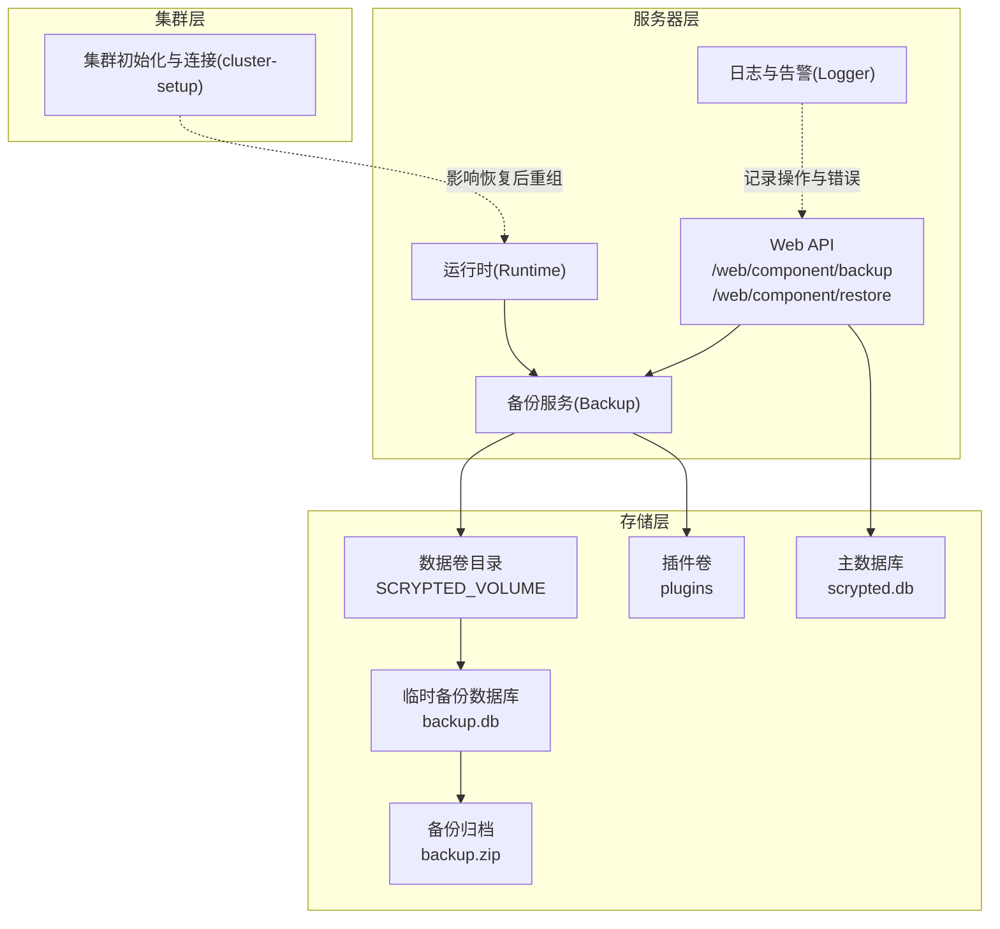
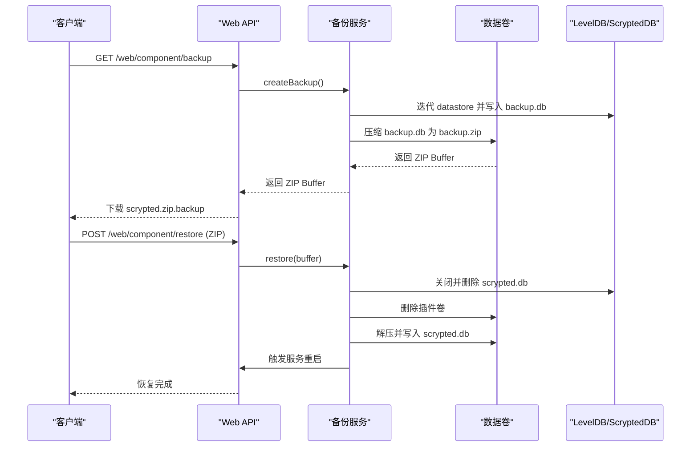
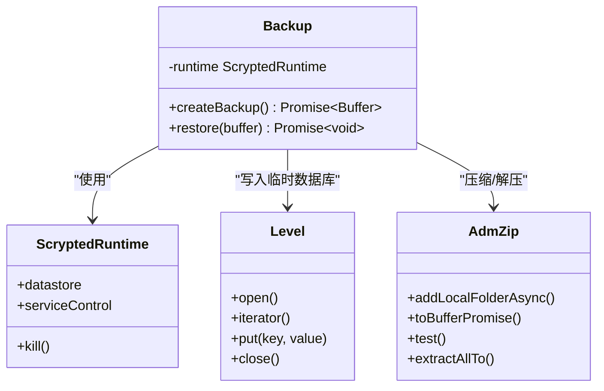
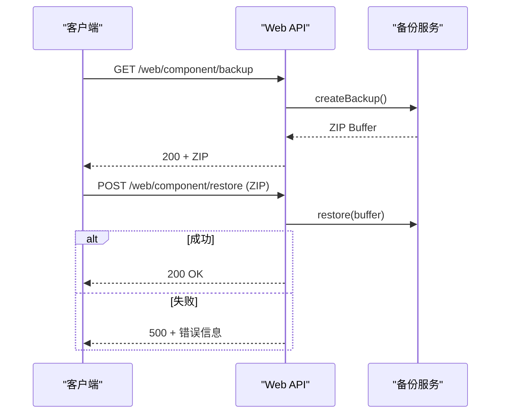
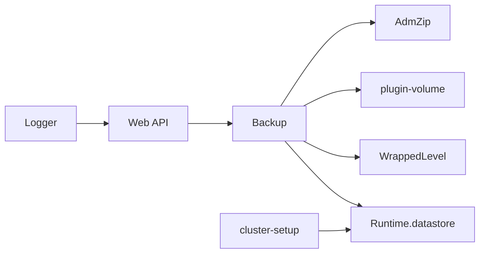

# 备份与恢复机制

<cite>
**本文引用的文件**
- [server/src/services/backup.ts](file://server/src/services/backup.ts)
- [server/src/scrypted-server-main.ts](file://server/src/scrypted-server-main.ts)
- [server/src/runtime.ts](file://server/src/runtime.ts)
- [server/src/plugin/plugin-volume.ts](file://server/src/plugin/plugin-volume.ts)
- [server/src/level.ts](file://server/src/level.ts)
- [server/src/cluster/cluster-setup.ts](file://server/src/cluster/cluster-setup.ts)
- [server/src/logger.ts](file://server/src/logger.ts)
</cite>

## 目录
1. [简介](#简介)
2. [项目结构](#项目结构)
3. [核心组件](#核心组件)
4. [架构总览](#架构总览)
5. [详细组件分析](#详细组件分析)
6. [依赖关系分析](#依赖关系分析)
7. [性能考虑](#性能考虑)
8. [故障排查指南](#故障排查指南)
9. [结论](#结论)
10. [附录](#附录)

## 简介
本文件系统性阐述 Scrypted 的集群备份与恢复机制，覆盖以下主题：
- 备份策略：自动触发、备份频率、全量备份与增量备份差异
- 存储位置与格式：本地卷目录、备份文件命名与内容结构
- 恢复流程：恢复点选择、数据完整性校验、恢复进度监控
- 灾难恢复预案：节点故障恢复、集群重组、数据一致性保障
- 性能优化：压缩、并发、带宽限制
- 监控与告警：状态检查、失败通知、恢复验证
- 安全配置：数据加密、访问控制、审计日志

## 项目结构
围绕备份与恢复的关键模块如下：
- 备份服务：负责从运行时数据存储中导出数据并打包为 ZIP
- Web 接口：提供备份下载与恢复上传的 HTTP 能力
- 运行时集成：在运行时对象中暴露备份服务实例
- 存储路径：通过环境变量或默认路径确定数据卷根目录
- 数据库包装：对 LevelDB 的封装，支持迭代与文档化存取
- 集群模式：集群初始化、连接与对象序列化，影响恢复后的集群重组
- 日志与告警：统一的日志接口，便于监控与审计

图表来源
- [server/src/services/backup.ts:12-46](file://server/src/services/backup.ts#L12-L46)
- [server/src/scrypted-server-main.ts:402-430](file://server/src/scrypted-server-main.ts#L402-L430)
- [server/src/runtime.ts:362](file://server/src/runtime.ts#L362)
- [server/src/plugin/plugin-volume.ts:5-20](file://server/src/plugin/plugin-volume.ts#L5-L20)
- [server/src/level.ts:18-114](file://server/src/level.ts#L18-L114)
- [server/src/cluster/cluster-setup.ts:38-398](file://server/src/cluster/cluster-setup.ts#L38-L398)
- [server/src/logger.ts:19-92](file://server/src/logger.ts#L19-L92)

章节来源
- [server/src/services/backup.ts:12-76](file://server/src/services/backup.ts#L12-L76)
- [server/src/scrypted-server-main.ts:402-430](file://server/src/scrypted-server-main.ts#L402-L430)
- [server/src/runtime.ts:362](file://server/src/runtime.ts#L362)
- [server/src/plugin/plugin-volume.ts:5-20](file://server/src/plugin/plugin-volume.ts#L5-L20)
- [server/src/level.ts:18-114](file://server/src/level.ts#L18-L114)
- [server/src/cluster/cluster-setup.ts:38-398](file://server/src/cluster/cluster-setup.ts#L38-L398)
- [server/src/logger.ts:19-92](file://server/src/logger.ts#L19-L92)

## 核心组件
- 备份服务（Backup）
  - 将运行时数据存储迭代导出到临时 LevelDB 文件
  - 使用 ZIP 压缩临时数据库文件，返回 Buffer
  - 提供恢复能力：校验 ZIP、关闭当前数据库、删除现有主数据库与插件卷、解压并重启服务
- Web API
  - GET /web/component/backup：生成并下载备份
  - POST /web/component/restore：接收二进制备份并执行恢复
- 运行时集成
  - 在运行时对象中注册并暴露 backup 实例，供 Web 层调用
- 存储路径
  - 通过环境变量或默认路径确定数据卷根目录，插件卷位于其下
- 数据库包装（WrappedLevel）
  - 对 LevelDB 的封装，支持按类型前缀迭代与文档化存取
- 集群初始化
  - 初始化集群监听端口、建立节点间 RPC 连接、对象序列化与反序列化
- 日志与告警
  - 统一日志接口，支持清理与子日志器，便于审计与监控

章节来源
- [server/src/services/backup.ts:9-76](file://server/src/services/backup.ts#L9-L76)
- [server/src/scrypted-server-main.ts:402-430](file://server/src/scrypted-server-main.ts#L402-L430)
- [server/src/runtime.ts:362](file://server/src/runtime.ts#L362)
- [server/src/plugin/plugin-volume.ts:5-20](file://server/src/plugin/plugin-volume.ts#L5-L20)
- [server/src/level.ts:18-114](file://server/src/level.ts#L18-L114)
- [server/src/cluster/cluster-setup.ts:38-398](file://server/src/cluster/cluster-setup.ts#L38-L398)
- [server/src/logger.ts:19-92](file://server/src/logger.ts#L19-L92)

## 架构总览
备份与恢复的整体流程如下：

图表来源
- [server/src/scrypted-server-main.ts:402-430](file://server/src/scrypted-server-main.ts#L402-L430)
- [server/src/services/backup.ts:12-76](file://server/src/services/backup.ts#L12-L76)
- [server/src/plugin/plugin-volume.ts:5-20](file://server/src/plugin/plugin-volume.ts#L5-L20)
- [server/src/level.ts:18-114](file://server/src/level.ts#L18-L114)

## 详细组件分析

### 备份服务（Backup）分析
- 数据导出
  - 打开临时 LevelDB 文件，遍历运行时数据存储的所有键值并写入
  - 该过程等价于“全量备份”，因为会导出所有文档
- 归档与传输
  - 将临时数据库文件加入 ZIP，返回 Buffer；前端以附件形式下载
- 恢复流程
  - 校验 ZIP 完整性
  - 杀死当前进程、关闭数据存储
  - 删除现有主数据库与插件卷，确保干净恢复
  - 解压备份至主数据库目录
  - 重启服务以加载恢复后的数据

图表来源
- [server/src/services/backup.ts:9-76](file://server/src/services/backup.ts#L9-L76)
- [server/src/level.ts:18-114](file://server/src/level.ts#L18-L114)

章节来源
- [server/src/services/backup.ts:12-76](file://server/src/services/backup.ts#L12-L76)
- [server/src/level.ts:18-114](file://server/src/level.ts#L18-L114)

### Web API 分析
- 备份下载
  - GET /web/component/backup：调用备份服务生成 ZIP 并作为附件返回
- 恢复上传
  - POST /web/component/restore：累积请求体为 Buffer，调用备份服务执行恢复
  - 异常时返回错误信息，避免静默失败

图表来源
- [server/src/scrypted-server-main.ts:402-430](file://server/src/scrypted-server-main.ts#L402-L430)
- [server/src/services/backup.ts:48-76](file://server/src/services/backup.ts#L48-L76)

章节来源
- [server/src/scrypted-server-main.ts:402-430](file://server/src/scrypted-server-main.ts#L402-L430)

### 存储位置与格式
- 数据卷根目录
  - 由环境变量或默认路径决定，插件卷位于其下
- 备份产物
  - 临时数据库文件：backup.db
  - 归档文件：backup.zip
  - 恢复目标：主数据库文件 scrypted.db
- 插件卷
  - 恢复时会删除插件卷，确保首次启动时重新安装插件

章节来源
- [server/src/plugin/plugin-volume.ts:5-20](file://server/src/plugin/plugin-volume.ts#L5-L20)
- [server/src/services/backup.ts:15-45](file://server/src/services/backup.ts#L15-L45)
- [server/src/services/backup.ts:49-74](file://server/src/services/backup.ts#L49-L74)

### 恢复流程与监控
- 恢复步骤
  - 校验 ZIP 完整性
  - 关闭并删除现有主数据库
  - 删除插件卷
  - 解压备份至主数据库目录
  - 重启服务
- 恢复监控
  - Web 层在异常时返回错误响应
  - 可结合日志系统记录恢复事件与错误

章节来源
- [server/src/services/backup.ts:48-76](file://server/src/services/backup.ts#L48-L76)
- [server/src/scrypted-server-main.ts:402-430](file://server/src/scrypted-server-main.ts#L402-L430)
- [server/src/logger.ts:19-92](file://server/src/logger.ts#L19-L92)

### 灾难恢复预案
- 节点故障恢复
  - 恢复后会删除插件卷，首次启动将重新安装插件，确保环境一致性
- 集群重组
  - 集群初始化负责监听端口、建立节点间连接、对象序列化与反序列化
  - 恢复后重启服务，集群将基于新的主数据库重建连接
- 数据一致性
  - 恢复前删除现有主数据库与插件卷，避免旧数据污染
  - 通过 ZIP 校验与解压流程保证数据完整性

章节来源
- [server/src/services/backup.ts:66-74](file://server/src/services/backup.ts#L66-L74)
- [server/src/cluster/cluster-setup.ts:38-398](file://server/src/cluster/cluster-setup.ts#L38-L398)

### 备份策略与频率
- 自动触发
  - 当前实现未内置定时任务或事件驱动的自动备份触发逻辑
- 频率设置
  - 未提供可配置的备份周期参数
- 全量与增量
  - 备份服务导出全部数据，属于全量备份
  - 未实现基于时间戳或变更集的增量备份

章节来源
- [server/src/services/backup.ts:23-25](file://server/src/services/backup.ts#L23-L25)

### 备份性能优化
- 压缩
  - 使用 ZIP 压缩临时数据库文件，减少传输体积
- 并发
  - 未见并发备份处理逻辑
- 带宽限制
  - 未见带宽限制配置或限速实现
- I/O 优化
  - 临时数据库写入与 ZIP 压缩顺序执行，建议在大体量数据场景评估分块或流式处理

章节来源
- [server/src/services/backup.ts:34-45](file://server/src/services/backup.ts#L34-L45)

### 监控与告警
- 状态检查
  - Web 层在备份错误时返回 500 与错误信息
- 失败通知
  - 可通过日志系统记录错误事件，便于后续告警
- 恢复验证
  - 恢复后重启服务，可通过健康检查确认服务可用性

章节来源
- [server/src/scrypted-server-main.ts:425-429](file://server/src/scrypted-server-main.ts#L425-L429)
- [server/src/logger.ts:19-92](file://server/src/logger.ts#L19-L92)

### 安全配置
- 数据加密
  - 未见对备份文件进行加密的实现
- 访问控制
  - Web API 未显式校验访问令牌或鉴权头
- 审计日志
  - 可通过日志接口记录备份与恢复事件，便于审计

章节来源
- [server/src/scrypted-server-main.ts:402-430](file://server/src/scrypted-server-main.ts#L402-L430)
- [server/src/logger.ts:19-92](file://server/src/logger.ts#L19-L92)

## 依赖关系分析
- 备份服务依赖运行时数据存储与 LevelDB 包装
- Web API 依赖备份服务与运行时对象
- 存储路径由插件卷工具函数提供
- 集群初始化影响恢复后的服务重启与对象重建

图表来源
- [server/src/services/backup.ts:9-76](file://server/src/services/backup.ts#L9-L76)
- [server/src/scrypted-server-main.ts:402-430](file://server/src/scrypted-server-main.ts#L402-L430)
- [server/src/runtime.ts:362](file://server/src/runtime.ts#L362)
- [server/src/plugin/plugin-volume.ts:5-20](file://server/src/plugin/plugin-volume.ts#L5-L20)
- [server/src/level.ts:18-114](file://server/src/level.ts#L18-L114)
- [server/src/cluster/cluster-setup.ts:38-398](file://server/src/cluster/cluster-setup.ts#L38-L398)
- [server/src/logger.ts:19-92](file://server/src/logger.ts#L19-L92)

章节来源
- [server/src/services/backup.ts:9-76](file://server/src/services/backup.ts#L9-L76)
- [server/src/scrypted-server-main.ts:402-430](file://server/src/scrypted-server-main.ts#L402-L430)
- [server/src/runtime.ts:362](file://server/src/runtime.ts#L362)
- [server/src/plugin/plugin-volume.ts:5-20](file://server/src/plugin/plugin-volume.ts#L5-L20)
- [server/src/level.ts:18-114](file://server/src/level.ts#L18-L114)
- [server/src/cluster/cluster-setup.ts:38-398](file://server/src/cluster/cluster-setup.ts#L38-L398)
- [server/src/logger.ts:19-92](file://server/src/logger.ts#L19-L92)

## 性能考虑
- 备份大小
  - 全量导出所有文档，备份体积与数据规模线性相关
- I/O 行为
  - 临时数据库写入与 ZIP 压缩串行执行，建议在高负载场景评估异步与流式处理
- 传输效率
  - ZIP 压缩可降低网络传输时间，但 CPU 开销随数据量增加
- 恢复时延
  - 删除插件卷与主数据库、解压、重启服务，整体恢复时延取决于磁盘与数据量

[本节为通用性能讨论，不直接分析具体文件]

## 故障排查指南
- 备份失败
  - 检查 Web 层错误响应与日志输出
  - 确认数据卷目录可写与磁盘空间充足
- 恢复失败
  - 确认 ZIP 文件完整且可测试通过
  - 检查主数据库与插件卷是否被正确删除
  - 查看服务重启日志，确认无致命错误
- 恢复后服务不可用
  - 检查集群初始化是否成功，确认节点间连接正常
  - 验证插件是否按预期重新安装

章节来源
- [server/src/scrypted-server-main.ts:425-429](file://server/src/scrypted-server-main.ts#L425-L429)
- [server/src/services/backup.ts:52-74](file://server/src/services/backup.ts#L52-L74)
- [server/src/cluster/cluster-setup.ts:38-398](file://server/src/cluster/cluster-setup.ts#L38-L398)
- [server/src/logger.ts:19-92](file://server/src/logger.ts#L19-L92)

## 结论
- Scrypted 当前的备份与恢复机制以“全量备份”为核心，通过临时数据库导出与 ZIP 归档实现，恢复流程明确且可验证
- 缺失的功能包括：自动备份触发、增量备份、备份频率配置、备份加密、访问控制、带宽限制、集群自动重组细节
- 建议在生产环境中补充：定时任务触发、增量备份策略、备份加密与访问控制、恢复验证与告警、带宽与并发优化

[本节为总结性内容，不直接分析具体文件]

## 附录
- 关键实现路径参考
  - 备份服务：[server/src/services/backup.ts](file://server/src/services/backup.ts)
  - Web API：[server/src/scrypted-server-main.ts](file://server/src/scrypted-server-main.ts)
  - 运行时集成：[server/src/runtime.ts](file://server/src/runtime.ts)
  - 存储路径：[server/src/plugin/plugin-volume.ts](file://server/src/plugin/plugin-volume.ts)
  - 数据库包装：[server/src/level.ts](file://server/src/level.ts)
  - 集群初始化：[server/src/cluster/cluster-setup.ts](file://server/src/cluster/cluster-setup.ts)
  - 日志与告警：[server/src/logger.ts](file://server/src/logger.ts)

[本节为索引性内容，不直接分析具体文件]