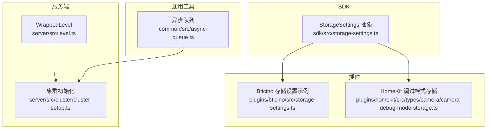
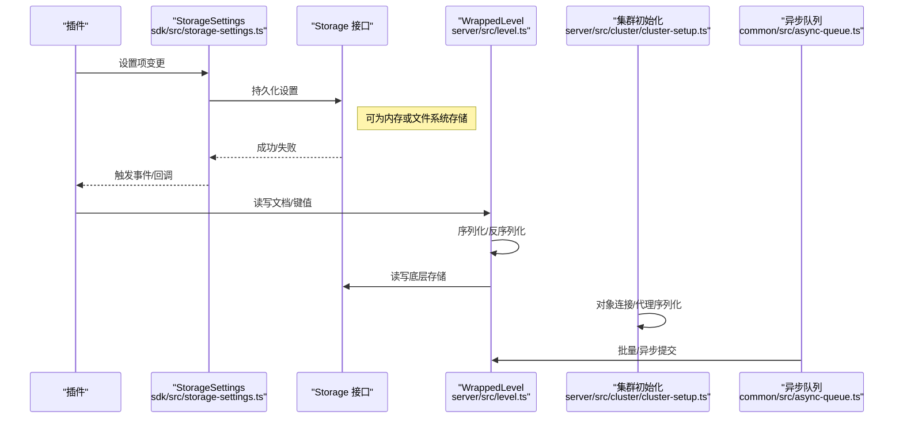
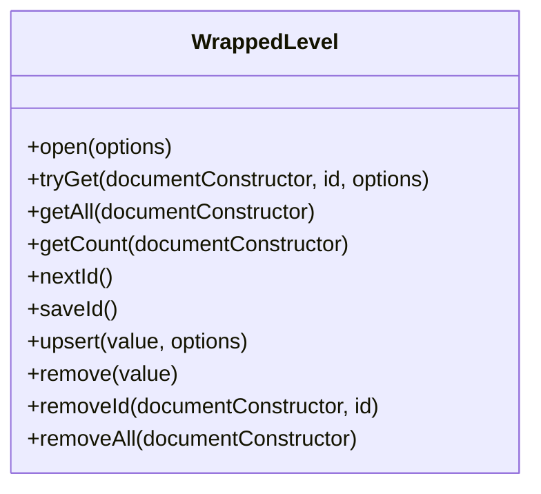
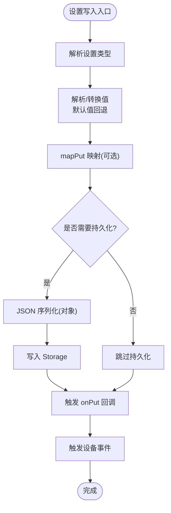
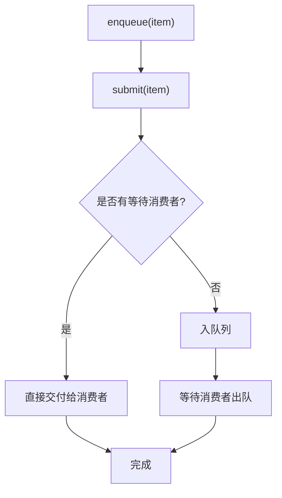
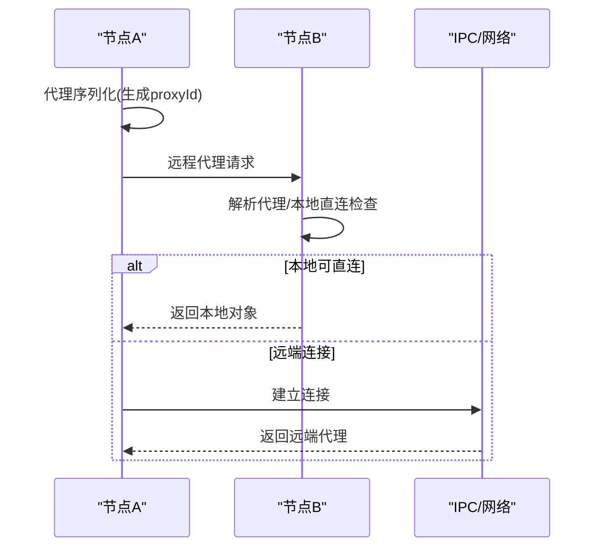
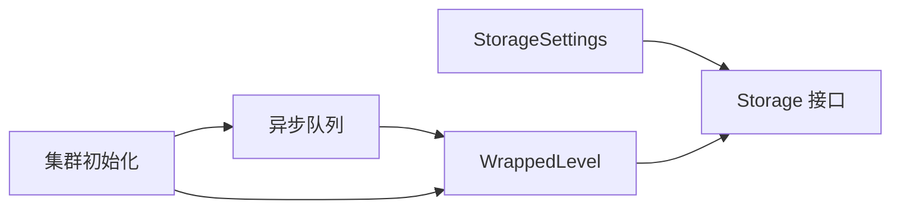

# 存储性能优化

<cite>
**本文引用的文件**
- [server/src/level.ts](file://server/src/level.ts)
- [sdk/src/storage-settings.ts](file://sdk/src/storage-settings.ts)
- [plugins/bticino/src/storage-settings.ts](file://plugins/bticino/src/storage-settings.ts)
- [plugins/homekit/src/types/camera/camera-debug-mode-storage.ts](file://plugins/homekit/src/types/camera/camera-debug-mode-storage.ts)
- [common/src/async-queue.ts](file://common/src/async-queue.ts)
- [server/src/cluster/cluster-setup.ts](file://server/src/cluster/cluster-setup.ts)
</cite>

## 目录
1. [引言](#引言)
2. [项目结构](#项目结构)
3. [核心组件](#核心组件)
4. [架构总览](#架构总览)
5. [详细组件分析](#详细组件分析)
6. [依赖关系分析](#依赖关系分析)
7. [性能考量](#性能考量)
8. [故障排查指南](#故障排查指南)
9. [结论](#结论)
10. [附录](#附录)

## 引言
本技术指南聚焦于 Scrypted 的集群存储性能优化，围绕以下主题展开：存储缓存策略（内存缓存配置、缓存命中率优化、缓存失效机制）、预读机制（数据预取策略、预读窗口大小、智能预读算法）、存储压缩配置（算法选择、压缩比与 CPU 开销平衡）、存储 I/O 优化（批量操作、异步写入、磁盘队列管理）、存储监控指标（吞吐量、延迟、利用率、错误率）以及性能调优建议（硬件配置、参数调优、瓶颈识别）。同时给出扩展策略（水平/垂直扩展、存储池管理）与性能测试方法（基准测试、压力测试、性能回归检测），帮助在多节点集群环境下实现稳定高效的存储表现。

## 项目结构
Scrypted 的存储相关能力主要分布在服务端存储封装层、SDK 存储设置抽象、插件侧存储设置、以及集群通信与线程 IPC 能力中。下图展示了与存储性能优化直接相关的模块关系：

**图表来源**
- [server/src/level.ts:18-117](file://server/src/level.ts#L18-L117)
- [server/src/cluster/cluster-setup.ts:38-399](file://server/src/cluster/cluster-setup.ts#L38-L399)
- [sdk/src/storage-settings.ts:81-196](file://sdk/src/storage-settings.ts#L81-L196)
- [plugins/bticino/src/storage-settings.ts:5-98](file://plugins/bticino/src/storage-settings.ts#L5-L98)
- [plugins/homekit/src/types/camera/camera-debug-mode-storage.ts:1-18](file://plugins/homekit/src/types/camera/camera-debug-mode-storage.ts#L1-L18)
- [common/src/async-queue.ts:6-170](file://common/src/async-queue.ts#L6-L170)

**章节来源**
- [server/src/level.ts:18-117](file://server/src/level.ts#L18-L117)
- [server/src/cluster/cluster-setup.ts:38-399](file://server/src/cluster/cluster-setup.ts#L38-L399)
- [sdk/src/storage-settings.ts:81-196](file://sdk/src/storage-settings.ts#L81-L196)
- [plugins/bticino/src/storage-settings.ts:5-98](file://plugins/bticino/src/storage-settings.ts#L5-L98)
- [plugins/homekit/src/types/camera/camera-debug-mode-storage.ts:1-18](file://plugins/homekit/src/types/camera/camera-debug-mode-storage.ts#L1-L18)
- [common/src/async-queue.ts:6-170](file://common/src/async-queue.ts#L6-L170)

## 核心组件
- WrappedLevel：对底层键值存储进行文档化封装，提供类型化读写、迭代、计数、删除等能力，并维护自增 ID 管理与持久化。
- StorageSettings：SDK 层的存储设置抽象，负责将设备设置项持久化到 Storage，支持类型解析、默认值处理、映射转换与事件通知。
- 插件存储设置示例：展示如何在插件中使用 StorageSettings 进行配置持久化与 UI 同步。
- 异步队列：提供生产者-消费者模型，支持排队、取消、结束等控制，可用于 I/O 批量化与背压管理。
- 集群初始化：负责集群节点间 RPC 对象连接、代理序列化、跨线程/进程 IPC 桥接，为分布式场景下的存储访问提供基础。

**章节来源**
- [server/src/level.ts:18-117](file://server/src/level.ts#L18-L117)
- [sdk/src/storage-settings.ts:81-196](file://sdk/src/storage-settings.ts#L81-L196)
- [plugins/bticino/src/storage-settings.ts:5-98](file://plugins/bticino/src/storage-settings.ts#L5-L98)
- [plugins/homekit/src/types/camera/camera-debug-mode-storage.ts:1-18](file://plugins/homekit/src/types/camera/camera-debug-mode-storage.ts#L1-L18)
- [common/src/async-queue.ts:6-170](file://common/src/async-queue.ts#L6-L170)
- [server/src/cluster/cluster-setup.ts:38-399](file://server/src/cluster/cluster-setup.ts#L38-L399)

## 架构总览
下图展示了存储在集群环境中的关键交互路径：客户端/插件通过 SDK 的 StorageSettings 写入设置；服务端使用 WrappedLevel 封装进行键值存储；集群初始化负责对象连接与 IPC；异步队列用于批量化与背压控制。

**图表来源**
- [sdk/src/storage-settings.ts:154-177](file://sdk/src/storage-settings.ts#L154-L177)
- [server/src/level.ts:34-113](file://server/src/level.ts#L34-L113)
- [server/src/cluster/cluster-setup.ts:259-300](file://server/src/cluster/cluster-setup.ts#L259-L300)
- [common/src/async-queue.ts:48-83](file://common/src/async-queue.ts#L48-L83)

## 详细组件分析

### WrappedLevel：存储封装与文档化键值
- 文档化键空间：以“文档类型/ID”作为键前缀，便于按类型遍历与清理。
- 增删改查：提供 tryGet/getAll/getCount/upsert/remove/removeAll 等方法，简化上层调用。
- 自增 ID：维护内部游标并持久化，保证全局唯一递增 ID。
- 性能要点：迭代器扫描全表时注意前缀匹配与文档类型校验的成本；批量删除/清理需谨慎避免大范围扫描。

**图表来源**
- [server/src/level.ts:18-117](file://server/src/level.ts#L18-L117)

**章节来源**
- [server/src/level.ts:18-117](file://server/src/level.ts#L18-L117)

### StorageSettings：设置持久化与类型解析
- 类型解析：支持布尔、数字、整数、数组、JSON 字符串、设备引用等类型解析与默认值回退。
- 映射与事件：支持 mapPut/mapGet 与 onPut/onGet 回调，以及隐藏字段与只读字段控制。
- 持久化策略：将对象值 JSON 序列化后写入 Storage；空值移除；非对象值转字符串。
- 与插件集成：插件通过 StorageSettings 将 UI 设置与存储解耦，自动同步到设备事件。

**图表来源**
- [sdk/src/storage-settings.ts:5-58](file://sdk/src/storage-settings.ts#L5-L58)
- [sdk/src/storage-settings.ts:162-177](file://sdk/src/storage-settings.ts#L162-L177)
- [sdk/src/storage-settings.ts:179-191](file://sdk/src/storage-settings.ts#L179-L191)

**章节来源**
- [sdk/src/storage-settings.ts:5-58](file://sdk/src/storage-settings.ts#L5-L58)
- [sdk/src/storage-settings.ts:162-177](file://sdk/src/storage-settings.ts#L162-L177)
- [sdk/src/storage-settings.ts:179-191](file://sdk/src/storage-settings.ts#L179-L191)

### 插件存储设置示例：Bticino 与 HomeKit
- Bticino：演示了如何定义多个设置项（如 SIP 参数、缩略图缓存时间、调试开关等），并通过 StorageSettings 统一持久化与 UI 同步。
- HomeKit：演示了从 Storage 中读取调试模式数组并映射为布尔标志位，体现设置解析与映射的应用。

**章节来源**
- [plugins/bticino/src/storage-settings.ts:5-98](file://plugins/bticino/src/storage-settings.ts#L5-L98)
- [plugins/homekit/src/types/camera/camera-debug-mode-storage.ts:1-18](file://plugins/homekit/src/types/camera/camera-debug-mode-storage.ts#L1-L18)

### 异步队列：批量与背压控制
- 生产者-消费者模型：支持 submit/enqueue/dequeue/take/clear/end 等操作，可与 AbortSignal 结合实现取消。
- 批量化：通过队列聚合 I/O 请求，减少频繁写入带来的抖动。
- 背压：当消费者处理慢于生产者时，队列可阻塞或拒绝新请求，避免内存膨胀。

**图表来源**
- [common/src/async-queue.ts:48-83](file://common/src/async-queue.ts#L48-L83)
- [common/src/async-queue.ts:157-167](file://common/src/async-queue.ts#L157-L167)

**章节来源**
- [common/src/async-queue.ts:6-170](file://common/src/async-queue.ts#L6-L170)

### 集群初始化：跨节点与跨线程的存储访问
- 对象连接：根据代理标识与哈希计算决定本地直连或远端连接；支持 worker 线程间 IPC。
- 代理序列化：为每个代理生成稳定的 proxyId，并携带源节点信息，确保跨节点一致性。
- 主线程桥接：通过 MessagePort 在工作线程之间建立通道，实现低开销的 IPC。

**图表来源**
- [server/src/cluster/cluster-setup.ts:259-300](file://server/src/cluster/cluster-setup.ts#L259-L300)
- [server/src/cluster/cluster-setup.ts:302-335](file://server/src/cluster/cluster-setup.ts#L302-L335)
- [server/src/cluster/cluster-setup.ts:174-241](file://server/src/cluster/cluster-setup.ts#L174-L241)

**章节来源**
- [server/src/cluster/cluster-setup.ts:38-399](file://server/src/cluster/cluster-setup.ts#L38-L399)

## 依赖关系分析
- WrappedLevel 依赖底层存储接口（键值存储），提供文档化封装与 ID 管理。
- StorageSettings 依赖 Storage 接口，负责设置项的持久化与类型解析。
- 异步队列可被上层逻辑用于批量写入与背压控制，间接影响存储 I/O 性能。
- 集群初始化为分布式场景提供对象连接与 IPC 能力，保障跨节点一致的存储访问。

**图表来源**
- [sdk/src/storage-settings.ts:162-177](file://sdk/src/storage-settings.ts#L162-L177)
- [server/src/level.ts:76-87](file://server/src/level.ts#L76-L87)
- [common/src/async-queue.ts:48-83](file://common/src/async-queue.ts#L48-L83)
- [server/src/cluster/cluster-setup.ts:259-300](file://server/src/cluster/cluster-setup.ts#L259-L300)

**章节来源**
- [sdk/src/storage-settings.ts:162-177](file://sdk/src/storage-settings.ts#L162-L177)
- [server/src/level.ts:76-87](file://server/src/level.ts#L76-L87)
- [common/src/async-queue.ts:48-83](file://common/src/async-queue.ts#L48-L83)
- [server/src/cluster/cluster-setup.ts:259-300](file://server/src/cluster/cluster-setup.ts#L259-L300)

## 性能考量
- 存储缓存策略
  - 内存缓存配置：在应用层引入轻量内存缓存（如最近 N 条文档或热键集合），结合 TTL 或 LRU 控制生命周期。
  - 缓存命中率优化：对热点键（如频繁读取的配置项）优先命中内存缓存；对冷数据采用懒加载与预热策略。
  - 缓存失效机制：基于写操作触发失效或定期刷新；对文档类型分组失效，避免全表扫描。
- 预读机制
  - 数据预取策略：对顺序访问（如遍历某类型文档）启用预读，批量拉取键值并提前反序列化。
  - 预读窗口大小：根据 I/O 延迟与吞吐，动态调整窗口大小；在高并发场景下采用分段预读。
  - 智能预读算法：基于访问模式预测（滑动窗口统计）与自适应调整，避免过度预读造成内存压力。
- 存储压缩配置
  - 算法选择：对文本类配置采用无损压缩（如 zlib/snappy），对二进制内容评估压缩收益与 CPU 开销。
  - 压缩比与 CPU 平衡：在写密集场景提高压缩级别，在读密集场景降低压缩级别以提升解压速度。
- 存储 I/O 优化
  - 批量操作：将多次写入合并为事务式批量写入，减少磁盘寻道与元数据更新次数。
  - 异步写入：利用异步队列将写入请求排队，配合背压策略避免拥塞。
  - 磁盘队列管理：限制队列长度与超时，结合优先级队列区分紧急写入与普通写入。
- 监控指标
  - 吞吐量：每秒读写操作数（OPS）与字节速率。
  - 延迟：平均/尾延迟（P95/P99）与异常延迟分布。
  - 利用率：磁盘 IOPS 利用率、CPU 使用率、内存占用。
  - 错误率：读写失败率、序列化/反序列化错误率、网络连接失败率。
- 调优建议
  - 硬件配置：SSD 优于 HDD；NVMe 更适合高并发写入；RAID 0 提升吞吐但不提升可靠性。
  - 参数调优：增大文件系统页缓存、启用写缓冲、调整内核脏页比例；对数据库引擎调整 WAL/缓冲池大小。
  - 瓶颈识别：通过火焰图定位 CPU 热点；通过 I/O 分析工具识别磁盘瓶颈；通过网络追踪识别跨节点延迟。
- 扩展策略
  - 水平扩展：通过分片（按文档类型/ID 哈希）分散负载；使用只读副本分担读压力。
  - 垂直扩展：增加 CPU/内存/磁盘带宽；升级到更高性能的存储介质。
  - 存储池管理：统一管理多块磁盘，按性能等级划分池；动态迁移热数据至高性能池。
- 性能测试
  - 基准测试：使用合成数据集评估不同压缩级别与批量大小对吞吐与延迟的影响。
  - 压力测试：模拟高并发读写与网络抖动，验证缓存失效与队列背压策略的有效性。
  - 性能回归检测：建立自动化回归流水线，持续对比关键指标变化趋势。

## 故障排查指南
- 存储读取失败
  - 现象：tryGet 返回空或抛出异常。
  - 排查：确认键格式（文档类型/ID）与文档类型字段一致性；检查底层存储可用性与权限。
- 设置持久化异常
  - 现象：putSetting 不生效或触发异常。
  - 排查：检查类型解析与 mapPut 映射；确认 Storage 实现是否支持 JSON 序列化；查看 onPut 回调是否抛错。
- 集群连接失败
  - 现象：跨节点代理无法解析或连接中断。
  - 排查：核对代理哈希与密钥；检查网络连通性与端口绑定；确认代理序列化属性完整性。
- 队列阻塞
  - 现象：enqueue 长时间挂起或报错。
  - 排查：检查消费者处理速度与队列长度；确认 AbortSignal 是否被正确传递；评估内存占用与 GC 影响。

**章节来源**
- [server/src/level.ts:34-43](file://server/src/level.ts#L34-L43)
- [sdk/src/storage-settings.ts:162-177](file://sdk/src/storage-settings.ts#L162-L177)
- [server/src/cluster/cluster-setup.ts:284-299](file://server/src/cluster/cluster-setup.ts#L284-L299)
- [common/src/async-queue.ts:48-83](file://common/src/async-queue.ts#L48-L83)

## 结论
通过对 WrappedLevel、StorageSettings、异步队列与集群初始化的系统性分析，可以构建一套面向 Scrypted 集群的存储性能优化方案。结合缓存、预读、压缩与 I/O 批量化策略，并辅以完善的监控与测试体系，可在多节点环境下实现高吞吐、低延迟与高可靠性的存储服务。

## 附录
- 关键实现位置参考
  - 存储封装与文档化键值：[server/src/level.ts:18-117](file://server/src/level.ts#L18-L117)
  - 设置持久化与类型解析：[sdk/src/storage-settings.ts:81-196](file://sdk/src/storage-settings.ts#L81-L196)
  - 插件设置示例：[plugins/bticino/src/storage-settings.ts:5-98](file://plugins/bticino/src/storage-settings.ts#L5-L98)、[plugins/homekit/src/types/camera/camera-debug-mode-storage.ts:1-18](file://plugins/homekit/src/types/camera/camera-debug-mode-storage.ts#L1-L18)
  - 异步队列与背压控制：[common/src/async-queue.ts:6-170](file://common/src/async-queue.ts#L6-L170)
  - 集群对象连接与 IPC：[server/src/cluster/cluster-setup.ts:38-399](file://server/src/cluster/cluster-setup.ts#L38-L399)