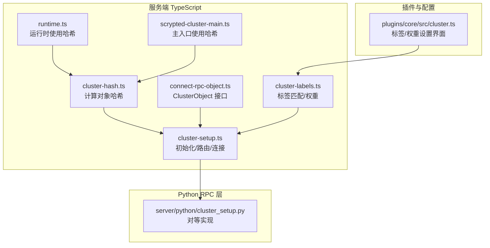
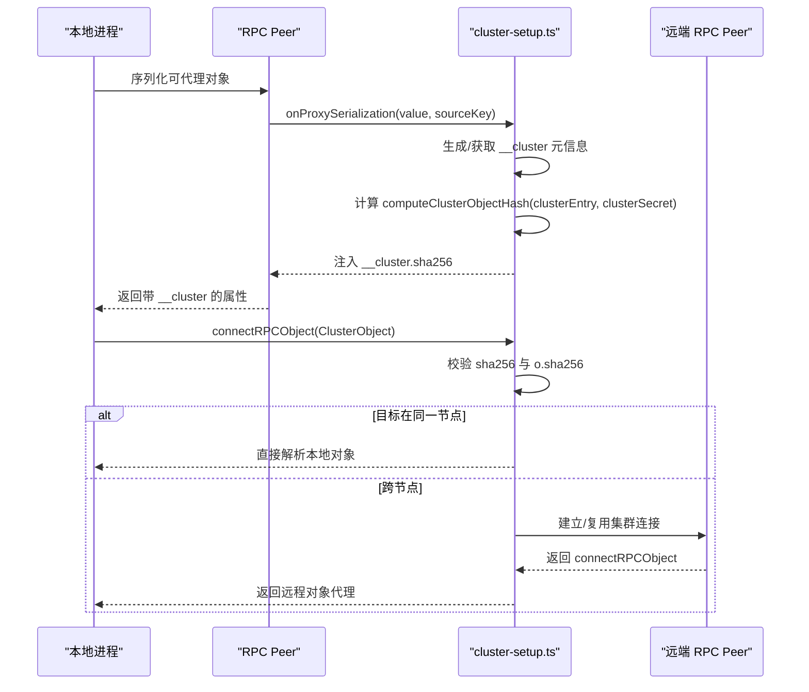
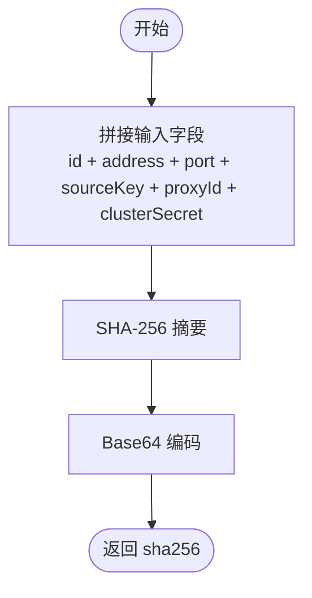
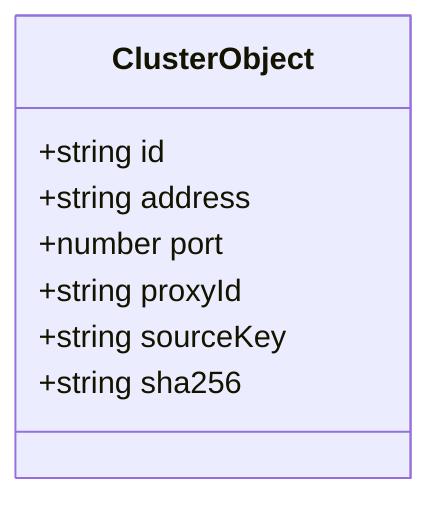
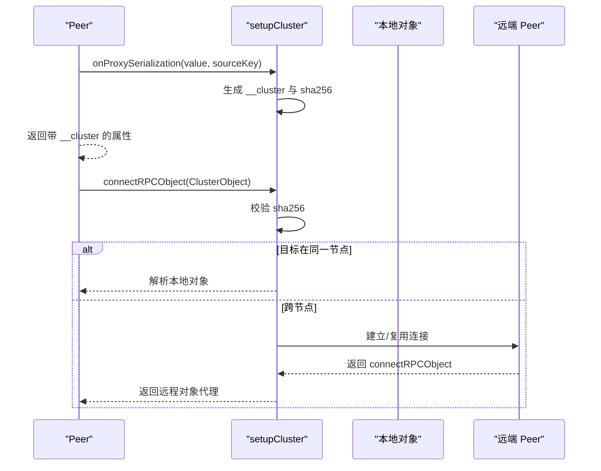
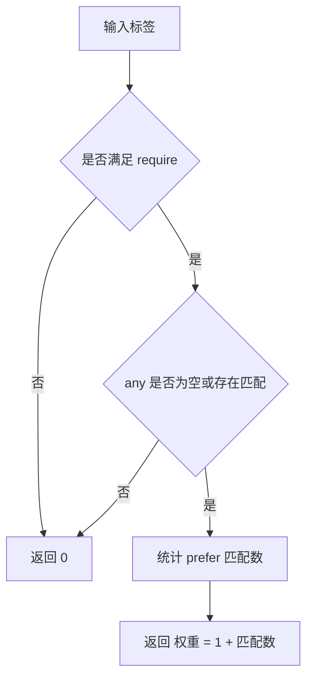
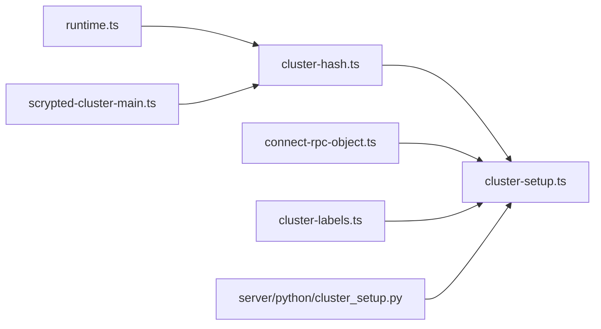

# 数据分片策略

<cite>
**本文引用的文件**
- [server/src/cluster/cluster-hash.ts](file://server/src/cluster/cluster-hash.ts)
- [server/src/cluster/cluster-setup.ts](file://server/src/cluster/cluster-setup.ts)
- [server/src/cluster/connect-rpc-object.ts](file://server/src/cluster/connect-rpc-object.ts)
- [server/src/cluster/cluster-labels.ts](file://server/src/cluster/cluster-labels.ts)
- [server/python/cluster_setup.py](file://server/python/cluster_setup.py)
- [plugins/core/src/cluster.ts](file://plugins/core/src/cluster.ts)
- [server/src/runtime.ts](file://server/src/runtime.ts)
- [server/src/scrypted-cluster-main.ts](file://server/src/scrypted-cluster-main.ts)
</cite>

## 目录
1. [引言](#引言)
2. [项目结构](#项目结构)
3. [核心组件](#核心组件)
4. [架构总览](#架构总览)
5. [详细组件分析](#详细组件分析)
6. [依赖分析](#依赖分析)
7. [性能考量](#性能考量)
8. [故障排查指南](#故障排查指南)
9. [结论](#结论)
10. [附录](#附录)

## 引言
本文件系统性阐述 Scrypted 在集群模式下的“数据分片与路由”机制，重点围绕以下目标展开：
- 深入解释数据哈希算法的实现原理，包括 computeClusterObjectHash 的工作机制、输入参数的组合方式与哈希值生成过程。
- 说明数据分片与对象路由的核心算法：如何通过哈希值定位目标节点，以及在多节点场景中的对象解析与连接流程。
- 描述分片键（sharding key）的选择策略，涵盖设备ID、地址信息、端口、代理ID等参数的作用与影响。
- 解释负载均衡与节点选择策略：标签匹配、权重分配、动态重平衡与热点处理思路。
- 提供分片配置的最佳实践：分片数量规划、节点分布优化、性能调优建议。
- 给出故障处理机制：节点失效、数据迁移、重新分片的处理流程。

## 项目结构
Scrypted 的集群分片能力由服务端 TypeScript 实现与 Python RPC 层共同构成，并通过 SDK 与插件进行集成。关键模块如下：
- 哈希与对象模型：cluster-hash.ts、connect-rpc-object.ts
- 集群初始化与对象路由：cluster-setup.ts
- 标签与权重：cluster-labels.ts
- Python 端对等实现：server/python/cluster_setup.py
- 运行时集成点：runtime.ts、scrypted-cluster-main.ts
- 配置与可视化：plugins/core/src/cluster.ts

**图表来源**
- [server/src/cluster/cluster-hash.ts:1-8](file://server/src/cluster/cluster-hash.ts#L1-L8)
- [server/src/cluster/connect-rpc-object.ts:1-29](file://server/src/cluster/connect-rpc-object.ts#L1-L29)
- [server/src/cluster/cluster-setup.ts:1-498](file://server/src/cluster/cluster-setup.ts#L1-L498)
- [server/src/cluster/cluster-labels.ts:1-58](file://server/src/cluster/cluster-labels.ts#L1-L58)
- [server/python/cluster_setup.py:141-153](file://server/python/cluster_setup.py#L141-L153)
- [server/src/runtime.ts:16,114,120](file://server/src/runtime.ts#L16,L114,L120)
- [server/src/scrypted-cluster-main.ts:10,303,362,364](file://server/src/scrypted-cluster-main.ts#L10,L303,L362,L364)
- [plugins/core/src/cluster.ts:75-96](file://plugins/core/src/cluster.ts#L75-L96)

**章节来源**
- [server/src/cluster/cluster-hash.ts:1-8](file://server/src/cluster/cluster-hash.ts#L1-L8)
- [server/src/cluster/cluster-setup.ts:1-498](file://server/src/cluster/cluster-setup.ts#L1-L498)
- [server/src/cluster/connect-rpc-object.ts:1-29](file://server/src/cluster/connect-rpc-object.ts#L1-L29)
- [server/src/cluster/cluster-labels.ts:1-58](file://server/src/cluster/cluster-labels.ts#L1-L58)
- [server/python/cluster_setup.py:141-153](file://server/python/cluster_setup.py#L141-L153)
- [plugins/core/src/cluster.ts:75-96](file://plugins/core/src/cluster.ts#L75-L96)
- [server/src/runtime.ts:16,114,120](file://server/src/runtime.ts#L16,L114,L120)
- [server/src/scrypted-cluster-main.ts:10,303,362,364](file://server/src/scrypted-cluster-main.ts#L10,L303,L362,L364)

## 核心组件
- 对象哈希函数：computeClusterObjectHash，用于生成稳定的 Base64 编码哈希，作为对象路由与安全校验的关键依据。
- 对象模型：ClusterObject，承载分片所需的关键字段（id、address、port、proxyId、sourceKey、sha256）。
- 集群初始化与路由：setupCluster，负责监听、建立对端连接、序列化代理对象并注入 __cluster 元信息，同时在连接时验证哈希。
- 标签与权重：cluster-labels，提供标签匹配、偏好权重与节点选择策略。
- Python 对等实现：cluster_setup.py，提供与 TS 等价的哈希与路由逻辑，确保跨语言一致性。
- 运行时集成：runtime.ts 与 scrypted-cluster-main.ts 在关键路径上使用哈希进行对象校验与路由。

**章节来源**
- [server/src/cluster/cluster-hash.ts:4-7](file://server/src/cluster/cluster-hash.ts#L4-L7)
- [server/src/cluster/connect-rpc-object.ts:1-29](file://server/src/cluster/connect-rpc-object.ts#L1-L29)
- [server/src/cluster/cluster-setup.ts:38-399](file://server/src/cluster/cluster-setup.ts#L38-L399)
- [server/src/cluster/cluster-labels.ts:4-46](file://server/src/cluster/cluster-labels.ts#L4-L46)
- [server/python/cluster_setup.py:141-153](file://server/python/cluster_setup.py#L141-L153)
- [server/src/runtime.ts:16,114,120](file://server/src/runtime.ts#L16,L114,L120)
- [server/src/scrypted-cluster-main.ts:10,303,362,364](file://server/src/scrypted-cluster-main.ts#L10,L303,L362,L364)

## 架构总览
下图展示了从对象序列化到远程连接的完整链路，强调哈希在对象稳定标识与安全校验中的作用。

**图表来源**
- [server/src/cluster/cluster-setup.ts:302-335](file://server/src/cluster/cluster-setup.ts#L302-L335)
- [server/src/cluster/cluster-setup.ts:71-76](file://server/src/cluster/cluster-setup.ts#L71-L76)
- [server/src/cluster/cluster-setup.ts:259-300](file://server/src/cluster/cluster-setup.ts#L259-L300)
- [server/src/cluster/cluster-hash.ts:4-7](file://server/src/cluster/cluster-hash.ts#L4-L7)

## 详细组件分析

### 组件一：对象哈希算法（computeClusterObjectHash）
- 输入参数组合
  - id：集群标识符，确保对象归属同一集群。
  - address：创建对象的进程地址；若为空则不参与哈希，以兼容不同网络环境。
  - port：创建对象的进程端口。
  - sourceKey：源对端标识，用于区分不同连接来源。
  - proxyId：对象在源对端的代理 ID。
  - clusterSecret：共享密钥，保证跨节点对象访问的安全性与一致性。
- 哈希生成过程
  - 将上述字段按固定顺序拼接为字符串，使用 SHA-256 计算摘要，再以 Base64 编码输出。
  - 该哈希值写入 ClusterObject.sha256，并在连接时用于校验。
- 安全与稳定性
  - 通过 clusterSecret 参与哈希，防止伪造或篡改。
  - 字段顺序与空值处理（如 address 或 sourceKey 为空时以空串替代）确保哈希稳定一致。

**图表来源**
- [server/src/cluster/cluster-hash.ts:4-7](file://server/src/cluster/cluster-hash.ts#L4-L7)
- [server/python/cluster_setup.py:141-153](file://server/python/cluster_setup.py#L141-L153)

**章节来源**
- [server/src/cluster/cluster-hash.ts:4-7](file://server/src/cluster/cluster-hash.ts#L4-L7)
- [server/python/cluster_setup.py:141-153](file://server/python/cluster_setup.py#L141-L153)

### 组件二：对象模型与分片键（ClusterObject）
- 关键字段
  - id：集群标识。
  - address/port：对象创建者所在节点的网络位置。
  - proxyId：对象在源对端的代理 ID，用于跨节点唯一标识。
  - sourceKey：源对端标识，避免对不同来源的同一对象产生歧义。
  - sha256：对象哈希值，用于安全校验与路由。
- 分片键选择策略
  - 核心分片键为 id + proxyId，结合 address/port 决定目标节点。
  - 当 address 与 port 指向当前节点时，直接解析本地对象，避免跨节点开销。
  - 若 proxyId 以特定前缀（例如 n-）表示线程内快速路径，则优先走 IPC 路径。

**图表来源**
- [server/src/cluster/connect-rpc-object.ts:1-29](file://server/src/cluster/connect-rpc-object.ts#L1-L29)

**章节来源**
- [server/src/cluster/connect-rpc-object.ts:1-29](file://server/src/cluster/connect-rpc-object.ts#L1-L29)

### 组件三：集群初始化与对象路由（setupCluster）
- 初始化
  - 启动监听，绑定到 SCRYPTED_CLUSTER_ADDRESS 或回环地址，支持同时监听本机地址与指定地址。
  - 注册 onProxySerialization 回调，序列化对象时生成/注入 __cluster 元信息，并计算 sha256。
- 对象连接
  - 在 connectRPCObject 中，先校验 sha256 与对象中携带的哈希是否一致。
  - 若目标端口等于当前节点端口，则直接解析本地对象。
  - 否则通过 ensureClusterPeer 建立/复用连接，并调用远端 peer 的 connectRPCObject 完成解析。
- IPC 快速路径
  - 当 address 与 SCRYPTED_CLUSTER_ADDRESS 匹配且 proxyId 以特定前缀开头时，优先使用线程间消息通道（thread IPC）进行连接，降低网络开销。

**图表来源**
- [server/src/cluster/cluster-setup.ts:302-335](file://server/src/cluster/cluster-setup.ts#L302-L335)
- [server/src/cluster/cluster-setup.ts:71-76](file://server/src/cluster/cluster-setup.ts#L71-L76)
- [server/src/cluster/cluster-setup.ts:259-300](file://server/src/cluster/cluster-setup.ts#L259-L300)

**章节来源**
- [server/src/cluster/cluster-setup.ts:38-399](file://server/src/cluster/cluster-setup.ts#L38-L399)

### 组件四：标签匹配与节点权重（cluster-labels）
- 标签匹配
  - require 列表：必须全部满足。
  - any 列表：至少满足其一（若为空则视为满足）。
  - prefer 列表：满足越多权重越高。
- 权重与选择
  - 通过 matchesClusterLabels 计算匹配度，非零即被考虑。
  - 结合 getClusterWorkerWeight 获取节点权重，默认为 1。
- 配置入口
  - 通过 SCRYPTED_CLUSTER_LABELS 设置标签，SCRYPTED_CLUSTER_WEIGHT 设置权重。
  - 插件界面允许用户修改标签并触发工作进程重启以应用新配置。

**图表来源**
- [server/src/cluster/cluster-labels.ts:4-46](file://server/src/cluster/cluster-labels.ts#L4-L46)
- [plugins/core/src/cluster.ts:75-96](file://plugins/core/src/cluster.ts#L75-L96)

**章节来源**
- [server/src/cluster/cluster-labels.ts:4-46](file://server/src/cluster/cluster-labels.ts#L4-L46)
- [plugins/core/src/cluster.ts:75-96](file://plugins/core/src/cluster.ts#L75-L96)

### 组件五：Python 端对等实现
- 与 TypeScript 端保持一致的哈希与路由逻辑，确保跨语言一致性。
- 在 Python 端同样提供 computeClusterObjectHash、onProxySerialization、connectRPCObject 等能力。

**章节来源**
- [server/python/cluster_setup.py:54-60](file://server/python/cluster_setup.py#L54-L60)
- [server/python/cluster_setup.py:141-153](file://server/python/cluster_setup.py#L141-L153)
- [server/python/cluster_setup.py:204-238](file://server/python/cluster_setup.py#L204-L238)

### 组件六：运行时集成点
- runtime.ts 在关键路径上使用 computeClusterObjectHash 对集群对象进行哈希校验。
- scrypted-cluster-main.ts 在认证与对象处理阶段也调用哈希函数，确保一致性。

**章节来源**
- [server/src/runtime.ts:16,114,120](file://server/src/runtime.ts#L16,L114,L120)
- [server/src/scrypted-cluster-main.ts:10,303,362,364](file://server/src/scrypted-cluster-main.ts#L10,L303,L362,L364)

## 依赖分析
- 模块耦合
  - cluster-setup 依赖 cluster-hash 与 connect-rpc-object，形成“序列化—哈希—连接”的闭环。
  - cluster-labels 为外部标签与权重提供匹配与权重计算，间接影响节点选择。
  - runtime.ts 与 scrypted-cluster-main.ts 在运行期调用哈希函数，确保对象一致性。
- 外部依赖
  - Python 端 cluster_setup.py 与 TS 端逻辑对等，保证跨语言一致性。
- 循环依赖
  - 未发现循环依赖迹象；各模块职责清晰，接口边界明确。

**图表来源**
- [server/src/cluster/cluster-hash.ts:4-7](file://server/src/cluster/cluster-hash.ts#L4-L7)
- [server/src/cluster/cluster-setup.ts:10,302-335,71-76](file://server/src/cluster/cluster-setup.ts#L10,L302-L335,L71-L76)
- [server/src/cluster/cluster-labels.ts:4-46](file://server/src/cluster/cluster-labels.ts#L4-L46)
- [server/src/runtime.ts:16,120](file://server/src/runtime.ts#L16,L120)
- [server/src/scrypted-cluster-main.ts:10,303,362](file://server/src/scrypted-cluster-main.ts#L10,L303,L362)
- [server/python/cluster_setup.py:54-60](file://server/python/cluster_setup.py#L54-L60)

**章节来源**
- [server/src/cluster/cluster-setup.ts:10,302-335,71-76](file://server/src/cluster/cluster-setup.ts#L10,L302-L335,L71-L76)
- [server/src/cluster/cluster-hash.ts:4-7](file://server/src/cluster/cluster-hash.ts#L4-L7)
- [server/src/cluster/cluster-labels.ts:4-46](file://server/src/cluster/cluster-labels.ts#L4-L46)
- [server/src/runtime.ts:16,120](file://server/src/runtime.ts#L16,L120)
- [server/src/scrypted-cluster-main.ts:10,303,362](file://server/src/scrypted-cluster-main.ts#L10,L303,L362)
- [server/python/cluster_setup.py:54-60](file://server/python/cluster_setup.py#L54-L60)

## 性能考量
- 哈希计算成本
  - SHA-256 计算与 Base64 编码属于轻量级操作，对吞吐影响有限；建议在对象首次序列化时计算并缓存。
- 连接复用
  - ensureClusterPeer 会复用已建立的连接，减少握手与建连开销。
- IPC 快速路径
  - 当满足条件时优先使用线程间消息通道，避免网络往返。
- 标签与权重
  - 合理设置 SCRYPTED_CLUSTER_LABELS 与 SCRYPTED_CLUSTER_WEIGHT，有助于将高负载任务分配至具备硬件加速或更高性能的节点。
- 热点处理
  - 对于热点对象，建议通过业务层引入二级索引或副本策略，避免单点过载。

[本节为通用性能建议，无需具体文件分析]

## 故障排查指南
- 哈希不匹配
  - 现象：连接时报错“secret incorrect”或“cluster object hash mismatch”。
  - 排查：确认所有节点使用相同的 SCRYPTED_CLUSTER_SECRET；检查对象序列化路径是否正确注入 __cluster.sha256。
  - 参考路径：
    - [server/src/cluster/cluster-setup.ts:71-76](file://server/src/cluster/cluster-setup.ts#L71-L76)
    - [server/src/scrypted-cluster-main.ts:362-364](file://server/src/scrypted-cluster-main.ts#L362-L364)
- 连接失败
  - 现象：connectRPCObject 抛出异常或返回原对象。
  - 排查：检查远端地址/端口是否可达；确认 ensureClusterPeer 已建立连接；查看远端 peer 的 connectRPCObject 参数是否可用。
  - 参考路径：
    - [server/src/cluster/cluster-setup.ts:284-300](file://server/src/cluster/cluster-setup.ts#L284-L300)
- IPC 路径异常
  - 现象：跨线程连接未生效或报错。
  - 排查：确认 proxyId 前缀与线程序号格式；检查 mainThreadBrokerRegister 与 connectTidPeer 的注册与连接流程。
  - 参考路径：
    - [server/src/cluster/cluster-setup.ts:174-187](file://server/src/cluster/cluster-setup.ts#L174-L187)
    - [server/src/cluster/cluster-setup.ts:127-172](file://server/src/cluster/cluster-setup.ts#L127-L172)
- 标签不匹配导致节点不可用
  - 现象：期望的任务未在目标节点执行。
  - 排查：核对 SCRYPTED_CLUSTER_LABELS；确认标签匹配逻辑与权重设置。
  - 参考路径：
    - [server/src/cluster/cluster-labels.ts:4-46](file://server/src/cluster/cluster-labels.ts#L4-L46)
    - [plugins/core/src/cluster.ts:75-96](file://plugins/core/src/cluster.ts#L75-L96)

**章节来源**
- [server/src/cluster/cluster-setup.ts:71-76](file://server/src/cluster/cluster-setup.ts#L71-L76)
- [server/src/cluster/cluster-setup.ts:284-300](file://server/src/cluster/cluster-setup.ts#L284-L300)
- [server/src/cluster/cluster-setup.ts:174-187](file://server/src/cluster/cluster-setup.ts#L174-L187)
- [server/src/cluster/cluster-setup.ts:127-172](file://server/src/cluster/cluster-setup.ts#L127-L172)
- [server/src/cluster/cluster-labels.ts:4-46](file://server/src/cluster/cluster-labels.ts#L4-L46)
- [plugins/core/src/cluster.ts:75-96](file://plugins/core/src/cluster.ts#L75-L96)
- [server/src/scrypted-cluster-main.ts:362-364](file://server/src/scrypted-cluster-main.ts#L362-L364)

## 结论
Scrypted 的集群数据分片策略以“稳定哈希 + 安全校验 + 标签权重”为核心，通过 computeClusterObjectHash 生成对象的全局唯一标识，并在对象序列化与连接阶段完成一致性校验与路由决策。配合标签匹配与权重机制，系统实现了灵活的节点选择与负载均衡；IPC 快速路径进一步降低了跨线程通信的成本。通过合理的配置与监控，可有效提升系统的可扩展性与稳定性。

[本节为总结性内容，无需具体文件分析]

## 附录

### 分片配置最佳实践
- 分片数量规划
  - 基于设备规模与并发访问量估算，确保每个节点的负载在合理范围内。
- 节点分布优化
  - 使用 SCRYPTED_CLUSTER_LABELS 为节点打标（如存储、计算、加速后端），结合 prefer 列表引导任务分配。
- 性能调优建议
  - 合理设置 SCRYPTED_CLUSTER_WEIGHT，将高负载任务导向高性能节点。
  - 通过插件界面调整标签并重启对应工作进程，使新配置生效。
- 安全与一致性
  - 统一维护 SCRYPTED_CLUSTER_SECRET，确保所有节点一致。
  - 定期检查对象序列化路径，确保 __cluster.sha256 正确生成与传递。

**章节来源**
- [server/src/cluster/cluster-labels.ts:44-46](file://server/src/cluster/cluster-labels.ts#L44-L46)
- [plugins/core/src/cluster.ts:75-96](file://plugins/core/src/cluster.ts#L75-L96)