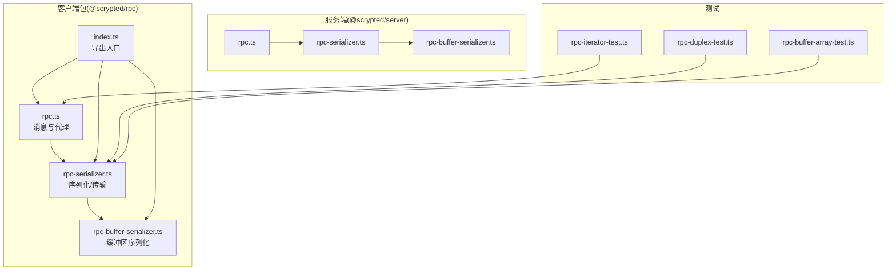
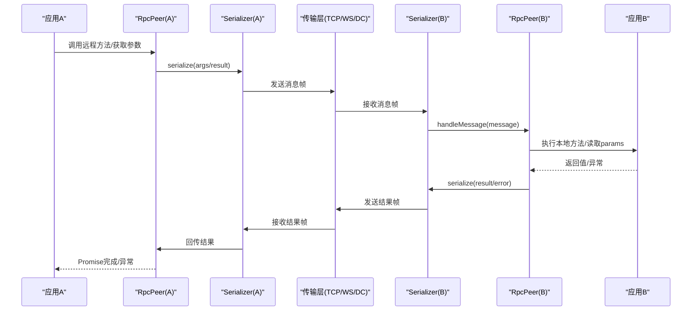
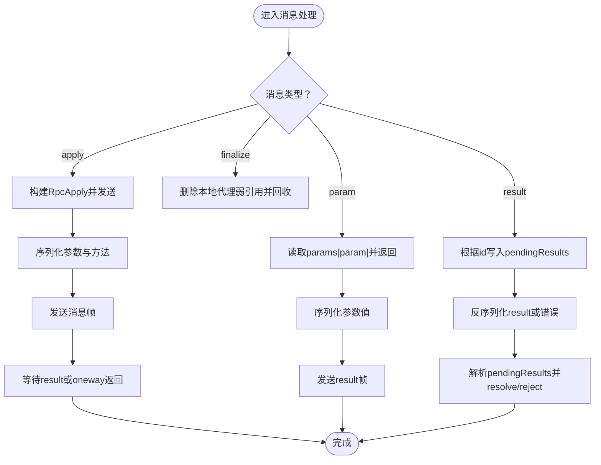
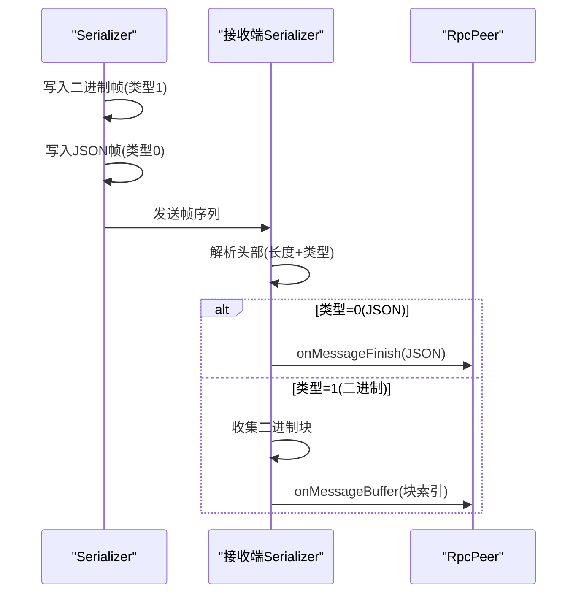
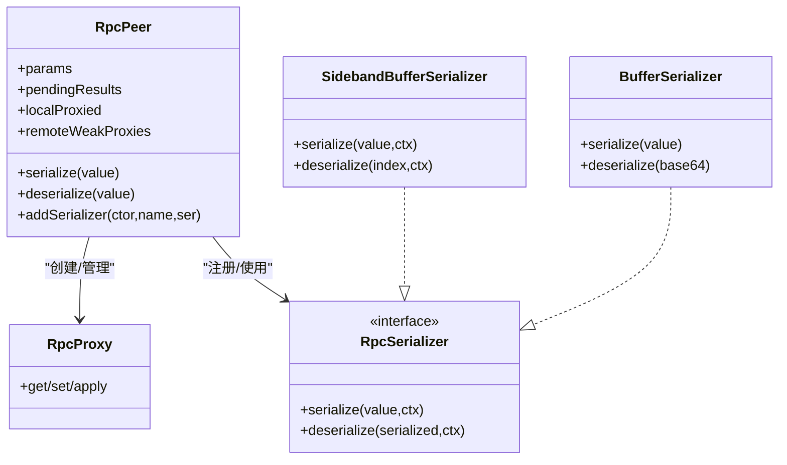
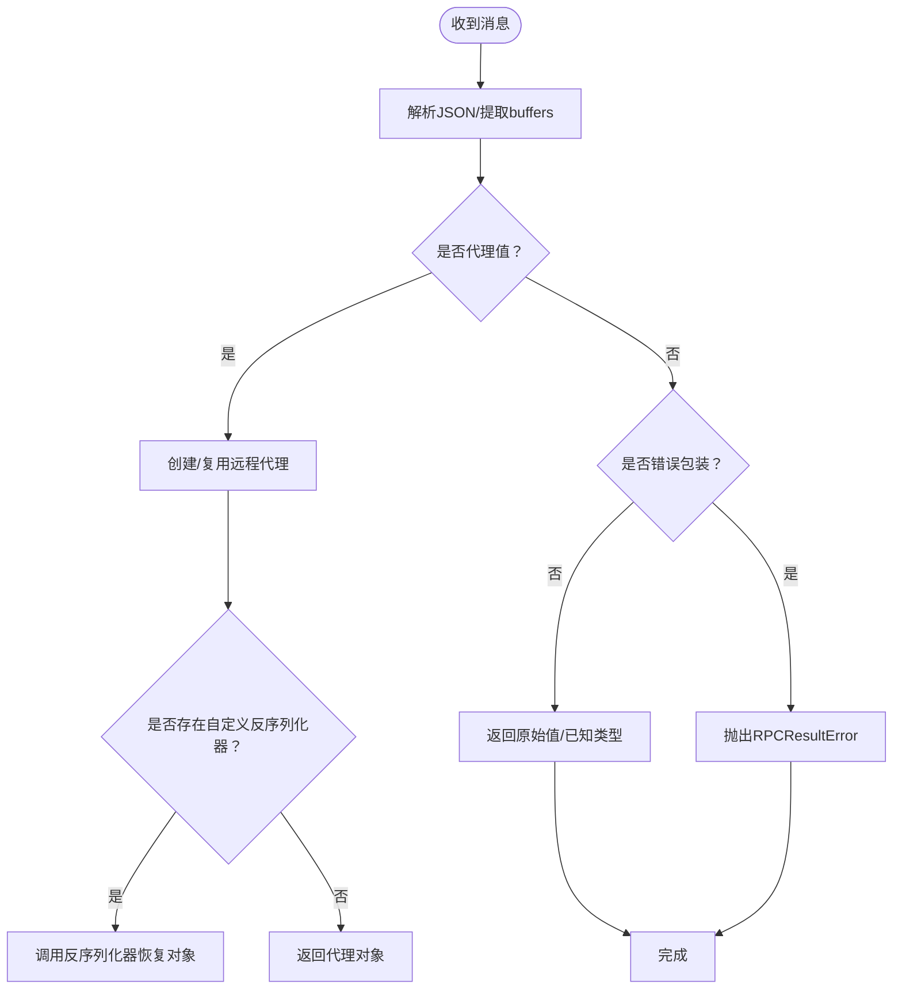
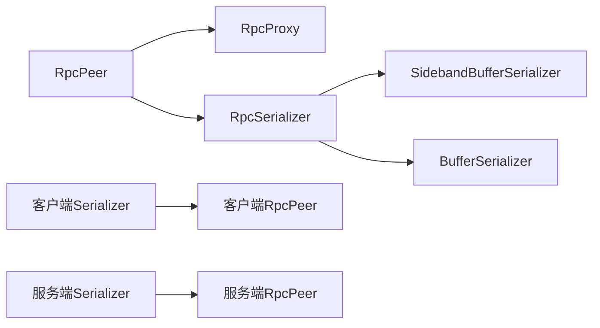

# RPC 通信协议

<cite>
**本文档引用的文件**
- [packages/rpc/src/rpc.ts](file://packages/rpc/src/rpc.ts)
- [packages/rpc/src/rpc-serializer.ts](file://packages/rpc/src/rpc-serializer.ts)
- [packages/rpc/src/rpc-buffer-serializer.ts](file://packages/rpc/src/rpc-buffer-serializer.ts)
- [packages/rpc/src/index.ts](file://packages/rpc/src/index.ts)
- [server/src/rpc.ts](file://server/src/rpc.ts)
- [server/src/rpc-serializer.ts](file://server/src/rpc-serializer.ts)
- [server/src/rpc-buffer-serializer.ts](file://server/src/rpc-buffer-serializer.ts)
- [server/test/rpc-duplex-test.ts](file://server/test/rpc-duplex-test.ts)
- [server/test/rpc-iterator-test.ts](file://server/test/rpc-iterator-test.ts)
- [server/test/rpc-buffer-array-test.ts](file://server/test/rpc-buffer-array-test.ts)
- [packages/rpc/package.json](file://packages/rpc/package.json)
- [server/package.json](file://server/package.json)
</cite>

## 目录
1. [简介](#简介)
2. [项目结构](#项目结构)
3. [核心组件](#核心组件)
4. [架构总览](#架构总览)
5. [详细组件分析](#详细组件分析)
6. [依赖关系分析](#依赖关系分析)
7. [性能考量](#性能考量)
8. [故障排查指南](#故障排查指南)
9. [结论](#结论)
10. [附录](#附录)

## 简介
本文件系统性阐述 Scrypted 的 RPC 通信协议，覆盖消息格式设计（消息头、消息体、类型标识、序列号）、传输层协议（连接建立、数据帧格式、流控制、错误处理）、序列化与反序列化机制（对象序列化、类型信息编码、循环引用处理、性能优化）、协议版本兼容性（向后兼容、版本协商、迁移策略）、消息路由（目标地址解析、负载均衡、故障转移、优先级处理）以及安全特性（身份验证、消息签名、防重放、数据加密）。内容基于仓库中的客户端与服务端 RPC 实现源码进行提炼与可视化。

## 项目结构
Scrypted 的 RPC 协议在 packages/rpc 与 server 两个位置均有实现，二者功能等价但分别面向客户端库与服务端运行时。核心文件包括：
- 消息与代理：rpc.ts
- 序列化器与传输：rpc-serializer.ts
- 缓冲区序列化：rpc-buffer-serializer.ts
- 包导出入口：index.ts
- 测试用例：server/test 下的多条测试

图表来源
- [packages/rpc/src/rpc.ts:29-858](file://packages/rpc/src/rpc.ts#L29-L858)
- [packages/rpc/src/rpc-serializer.ts:1-240](file://packages/rpc/src/rpc-serializer.ts#L1-L240)
- [packages/rpc/src/rpc-buffer-serializer.ts:1-32](file://packages/rpc/src/rpc-buffer-serializer.ts#L1-L32)
- [packages/rpc/src/index.ts:1-4](file://packages/rpc/src/index.ts#L1-L4)
- [server/src/rpc.ts:29-858](file://server/src/rpc.ts#L29-L858)
- [server/src/rpc-serializer.ts:1-240](file://server/src/rpc-serializer.ts#L1-L240)
- [server/src/rpc-buffer-serializer.ts:1-32](file://server/src/rpc-buffer-serializer.ts#L1-L32)
- [server/test/rpc-duplex-test.ts:1-31](file://server/test/rpc-duplex-test.ts#L1-L31)
- [server/test/rpc-iterator-test.ts:1-47](file://server/test/rpc-iterator-test.ts#L1-L47)
- [server/test/rpc-buffer-array-test.ts:1-39](file://server/test/rpc-buffer-array-test.ts#L1-L39)

章节来源
- [packages/rpc/src/index.ts:1-4](file://packages/rpc/src/index.ts#L1-L4)
- [packages/rpc/src/rpc.ts:29-858](file://packages/rpc/src/rpc.ts#L29-L858)
- [packages/rpc/src/rpc-serializer.ts:1-240](file://packages/rpc/src/rpc-serializer.ts#L1-L240)
- [packages/rpc/src/rpc-buffer-serializer.ts:1-32](file://packages/rpc/src/rpc-buffer-serializer.ts#L1-L32)
- [server/src/rpc.ts:29-858](file://server/src/rpc.ts#L29-L858)
- [server/src/rpc-serializer.ts:1-240](file://server/src/rpc-serializer.ts#L1-L240)
- [server/src/rpc-buffer-serializer.ts:1-32](file://server/src/rpc-buffer-serializer.ts#L1-L32)
- [server/test/rpc-duplex-test.ts:1-31](file://server/test/rpc-duplex-test.ts#L1-L31)
- [server/test/rpc-iterator-test.ts:1-47](file://server/test/rpc-iterator-test.ts#L1-L47)
- [server/test/rpc-buffer-array-test.ts:1-39](file://server/test/rpc-buffer-array-test.ts#L1-L39)

## 核心组件
- RpcPeer：RPC 对等端，负责消息编解码、参数传递、结果回传、代理对象生命周期管理、错误封装与传播。
- RpcProxy：远程代理处理器，拦截方法调用，将调用转化为 RpcApply 消息并等待 RpcResult。
- RpcSerializer：序列化接口，支持自定义类型序列化器注册。
- SidebandBufferSerializer：带外缓冲区序列化器，用于高效传输大块二进制数据。
- Duplex Serializer：基于 TCP/WebSocket/DataChannel 的双向传输适配器，负责帧拆装与消息分发。

章节来源
- [packages/rpc/src/rpc.ts:285-858](file://packages/rpc/src/rpc.ts#L285-L858)
- [packages/rpc/src/rpc-serializer.ts:1-240](file://packages/rpc/src/rpc-serializer.ts#L1-L240)
- [packages/rpc/src/rpc-buffer-serializer.ts:1-32](file://packages/rpc/src/rpc-buffer-serializer.ts#L1-L32)
- [server/src/rpc.ts:285-858](file://server/src/rpc.ts#L285-L858)
- [server/src/rpc-serializer.ts:1-240](file://server/src/rpc-serializer.ts#L1-L240)
- [server/src/rpc-buffer-serializer.ts:1-32](file://server/src/rpc-buffer-serializer.ts#L1-L32)

## 架构总览
下图展示客户端与服务端的 RPC 交互路径：应用通过 RpcPeer 发起调用，经由 Serializer 封装为消息帧，再通过传输层发送；对端接收后交由 RpcPeer 解析，执行本地方法或参数查询，并返回结果。

图表来源
- [packages/rpc/src/rpc.ts:697-858](file://packages/rpc/src/rpc.ts#L697-L858)
- [packages/rpc/src/rpc-serializer.ts:1-240](file://packages/rpc/src/rpc-serializer.ts#L1-L240)
- [server/src/rpc.ts:697-858](file://server/src/rpc.ts#L697-L858)
- [server/src/rpc-serializer.ts:1-240](file://server/src/rpc-serializer.ts#L1-L240)

## 详细组件分析

### 消息格式设计
- 消息类型与字段
  - apply：调用远程方法，携带 id、proxyId、method、args、oneway 标记。
  - result：返回调用结果或错误，携带 id、throw 标记与 result。
  - param：请求对端参数值，携带 id、param 名称。
  - finalize：通知对端释放本地代理资源。
- 序列号管理
  - 使用随机字符串作为请求 id，生成逻辑保证短小唯一。
  - pendingResults 映射保存未完成的调用，按 id 关联结果。
- 消息头与帧格式
  - 传输层采用固定 5 字节头部：前 4 字节长度（含类型），第 5 字节类型。
  - 类型 0 表示完整 JSON 消息帧，类型 1 表示二进制数据帧（用于大对象传输）。
- 编解码策略
  - 仅当参数/返回值不可直接 JSON 序列化时，才包装为代理值或错误值。
  - 错误统一包装为特殊构造名的代理值，便于跨边界识别与还原。

图表来源
- [packages/rpc/src/rpc.ts:29-858](file://packages/rpc/src/rpc.ts#L29-L858)
- [server/src/rpc.ts:29-858](file://server/src/rpc.ts#L29-L858)

章节来源
- [packages/rpc/src/rpc.ts:29-858](file://packages/rpc/src/rpc.ts#L29-L858)
- [server/src/rpc.ts:29-858](file://server/src/rpc.ts#L29-L858)

### 传输层协议
- 连接建立
  - 基于可读可写流或 WebSocket/DataChannel，创建双向 Serializer 并绑定到 RpcPeer。
- 数据帧格式
  - 头部：4 字节长度（含类型），1 字节类型。
  - 载荷：类型 0 为 JSON 文本；类型 1 为二进制数据块。
- 流控制与分片
  - 二进制数据通过“带外”通道发送，JSON 帧中仅保留索引，接收端按顺序拼接。
  - DataChannel 模式下对 16KB 分片进行队列化与去抖动发送。
- 错误处理
  - 解析失败或连接断开触发 kill，冻结 pendingResults 并拒绝所有未决请求。
  - 发送失败时尝试回退为错误结果帧以确保对端感知。

图表来源
- [packages/rpc/src/rpc-serializer.ts:87-182](file://packages/rpc/src/rpc-serializer.ts#L87-L182)
- [server/src/rpc-serializer.ts:87-182](file://server/src/rpc-serializer.ts#L87-L182)

章节来源
- [packages/rpc/src/rpc-serializer.ts:1-240](file://packages/rpc/src/rpc-serializer.ts#L1-L240)
- [server/src/rpc-serializer.ts:1-240](file://server/src/rpc-serializer.ts#L1-L240)

### 序列化机制
- 对象序列化
  - 默认安全类型：Number、String、Object、Boolean、Array。
  - 非默认安全类型会包装为远程代理值，包含构造名、属性集合、单向方法列表等元信息。
  - 自定义类型可通过 addSerializer 注册，按构造函数映射名称进行序列化。
- 类型信息编码
  - 通过 __remote_constructor_name 标识类型，避免直接暴露构造函数名导致的混淆。
  - 代理值包含 __remote_proxy_id 与 __remote_proxy_finalizer_id，用于生命周期跟踪与回收。
- 循环引用处理
  - 通过 WeakRef/FinalizationRegistry 跟踪远端代理，避免强引用导致的泄漏。
  - finalize 消息用于通知对端释放资源。
- 性能优化
  - 大对象使用 SidebandBufferSerializer，避免 Base64 编解码开销。
  - 二进制数据通过 buffers 上下文批量传输，减少帧数量。

图表来源
- [packages/rpc/src/rpc.ts:285-858](file://packages/rpc/src/rpc.ts#L285-L858)
- [packages/rpc/src/rpc-buffer-serializer.ts:1-32](file://packages/rpc/src/rpc-buffer-serializer.ts#L1-L32)
- [server/src/rpc.ts:285-858](file://server/src/rpc.ts#L285-L858)
- [server/src/rpc-buffer-serializer.ts:1-32](file://server/src/rpc-buffer-serializer.ts#L1-L32)

章节来源
- [packages/rpc/src/rpc.ts:570-678](file://packages/rpc/src/rpc.ts#L570-L678)
- [server/src/rpc.ts:570-678](file://server/src/rpc.ts#L570-L678)
- [packages/rpc/src/rpc-buffer-serializer.ts:1-32](file://packages/rpc/src/rpc-buffer-serializer.ts#L1-L32)
- [server/src/rpc-buffer-serializer.ts:1-32](file://server/src/rpc-buffer-serializer.ts#L1-L32)

### 反序列化过程
- 数据解析
  - JSON 帧解析为消息对象；二进制帧通过上下文 buffers 索引引用。
- 类型转换
  - 根据 __remote_constructor_name 选择对应反序列化器或直接构造代理。
- 对象重建
  - 代理值包含 __remote_proxy_id，首次遇到时创建弱引用代理；后续复用。
  - 若存在自定义反序列化器，则委托其恢复对象状态。
- 内存管理
  - FinalizationRegistry 在垃圾回收时机触发 finalize，通知对端释放资源。
  - kill 后冻结内部状态，拒绝新请求并清理异步迭代器。

图表来源
- [packages/rpc/src/rpc.ts:494-546](file://packages/rpc/src/rpc.ts#L494-L546)
- [server/src/rpc.ts:494-546](file://server/src/rpc.ts#L494-L546)

章节来源
- [packages/rpc/src/rpc.ts:494-546](file://packages/rpc/src/rpc.ts#L494-L546)
- [server/src/rpc.ts:494-546](file://server/src/rpc.ts#L494-L546)

### 协议版本兼容性
- 向后兼容
  - 通过默认安全类型集合与通用代理值结构维持旧版本对新消息的稳健解析。
  - 错误包装统一为特殊构造名，便于新旧对端识别。
- 版本协商
  - 当前实现未显式提供版本协商字段；建议在握手阶段引入版本字段并在 Serializer 层做兼容分支。
- 迁移策略
  - 新增类型序列化器时，保持 __remote_constructor_name 稳定；对破坏性变更提供双版本并行期。

章节来源
- [packages/rpc/src/rpc.ts:317-325](file://packages/rpc/src/rpc.ts#L317-L325)
- [server/src/rpc.ts:317-325](file://server/src/rpc.ts#L317-L325)

### 消息路由机制
- 目标地址解析
  - 通过 proxyId 定位本地代理对象；params 中存储对端可调用的参数函数。
- 负载均衡
  - 通过多对多 RpcPeer 连接实现横向扩展；消息路由由上层插件/服务选择具体对端。
- 故障转移
  - 连接断开触发 kill，未决请求统一失败；对端可重新建立连接并恢复状态。
- 优先级处理
  - 单连接内未实现优先级队列；可在 Serializer 层增加消息队列与优先级标记。

章节来源
- [packages/rpc/src/rpc.ts:476-486](file://packages/rpc/src/rpc.ts#L476-L486)
- [server/src/rpc.ts:476-486](file://server/src/rpc.ts#L476-L486)

### 协议安全特性
- 身份验证
  - 未在当前实现中发现内置认证流程；建议在传输层（如 TLS/Token）或握手阶段引入。
- 消息签名
  - 未提供消息签名机制；可扩展 Serializer 层在帧尾附加签名。
- 防重放攻击
  - 未见序列号校验或时间戳；可在消息头加入 nonce/timestamp 并在对端校验。
- 数据加密
  - 传输层可结合 TLS/WebSocket-Secure 或 DTLS/DataChannel SRTP 实现端到端加密。

章节来源
- [packages/rpc/src/rpc-serializer.ts:1-240](file://packages/rpc/src/rpc-serializer.ts#L1-L240)
- [server/src/rpc-serializer.ts:1-240](file://server/src/rpc-serializer.ts#L1-L240)

## 依赖关系分析
- 组件耦合
  - RpcPeer 与 RpcProxy 强耦合，共同完成远程调用与代理管理。
  - Serializer 与 RpcPeer 松耦合，通过回调接口注入发送能力。
- 外部依赖
  - Node.js Stream、WebSocket、DataChannel 等运行时接口。
  - TypeScript 类型系统用于约束消息结构与序列化器接口。

图表来源
- [packages/rpc/src/rpc.ts:285-858](file://packages/rpc/src/rpc.ts#L285-L858)
- [packages/rpc/src/rpc-serializer.ts:1-240](file://packages/rpc/src/rpc-serializer.ts#L1-L240)
- [packages/rpc/src/rpc-buffer-serializer.ts:1-32](file://packages/rpc/src/rpc-buffer-serializer.ts#L1-L32)
- [server/src/rpc.ts:285-858](file://server/src/rpc.ts#L285-L858)
- [server/src/rpc-serializer.ts:1-240](file://server/src/rpc-serializer.ts#L1-L240)
- [server/src/rpc-buffer-serializer.ts:1-32](file://server/src/rpc-buffer-serializer.ts#L1-L32)

章节来源
- [packages/rpc/src/rpc.ts:285-858](file://packages/rpc/src/rpc.ts#L285-L858)
- [packages/rpc/src/rpc-serializer.ts:1-240](file://packages/rpc/src/rpc-serializer.ts#L1-L240)
- [packages/rpc/src/rpc-buffer-serializer.ts:1-32](file://packages/rpc/src/rpc-buffer-serializer.ts#L1-L32)
- [server/src/rpc.ts:285-858](file://server/src/rpc.ts#L285-L858)
- [server/src/rpc-serializer.ts:1-240](file://server/src/rpc-serializer.ts#L1-L240)
- [server/src/rpc-buffer-serializer.ts:1-32](file://server/src/rpc-buffer-serializer.ts#L1-L32)

## 性能考量
- 序列化性能
  - 默认安全类型直接透传，避免额外开销。
  - 大对象使用带外二进制传输，显著降低 CPU 开销。
- 内存管理
  - 代理对象使用 WeakRef/FinalizationRegistry，降低泄漏风险。
  - 定期 GC 触发器在空闲或对象变化时主动回收。
- 传输效率
  - DataChannel 分片与去抖动合并，减少网络碎片。
  - 二进制帧与 JSON 帧分离，提升吞吐量。

章节来源
- [packages/rpc/src/rpc.ts:1-27](file://packages/rpc/src/rpc.ts#L1-L27)
- [packages/rpc/src/rpc-buffer-serializer.ts:1-32](file://packages/rpc/src/rpc-buffer-serializer.ts#L1-L32)
- [server/src/rpc-buffer-serializer.ts:1-32](file://server/src/rpc-buffer-serializer.ts#L1-L32)

## 故障排查指南
- 连接断开
  - 现象：未决请求全部失败，异步迭代器被中断。
  - 处理：检查底层传输层状态，重建 Serializer 与 RpcPeer。
- 消息解析失败
  - 现象：对端触发 kill 并提示解析失败。
  - 处理：确认消息帧完整性与编码一致性。
- 代理 ID 无效
  - 现象：反序列化时报错 invalid local proxy id。
  - 处理：确认代理是否已被 finalize 或对端已释放。
- 大对象传输异常
  - 现象：二进制块缺失或顺序错乱。
  - 处理：检查 buffers 上下文与分片大小限制。

章节来源
- [packages/rpc/src/rpc.ts:439-456](file://packages/rpc/src/rpc.ts#L439-L456)
- [server/src/rpc.ts:439-456](file://server/src/rpc.ts#L439-L456)
- [packages/rpc/src/rpc-serializer.ts:161-173](file://packages/rpc/src/rpc-serializer.ts#L161-L173)
- [server/src/rpc-serializer.ts:161-173](file://server/src/rpc-serializer.ts#L161-L173)

## 结论
Scrypted RPC 协议以简洁的消息模型与高效的带外二进制传输为核心，配合弱引用与终结器实现资源闭环管理。当前实现聚焦于可靠性与性能，未包含内置的身份验证、签名与加密机制，建议在传输层或协议扩展层补充安全能力。未来可在消息头引入版本与优先级字段，完善版本协商与路由策略。

## 附录
- 版本信息
  - 客户端包版本：参见 [packages/rpc/package.json:1-20](file://packages/rpc/package.json#L1-L20)
  - 服务端包版本：参见 [server/package.json:1-73](file://server/package.json#L1-L73)
- 测试参考
  - 双工连接测试：参见 [server/test/rpc-duplex-test.ts:1-31](file://server/test/rpc-duplex-test.ts#L1-L31)
  - 异步迭代器测试：参见 [server/test/rpc-iterator-test.ts:1-47](file://server/test/rpc-iterator-test.ts#L1-L47)
  - 缓冲区数组传输测试：参见 [server/test/rpc-buffer-array-test.ts:1-39](file://server/test/rpc-buffer-array-test.ts#L1-L39)