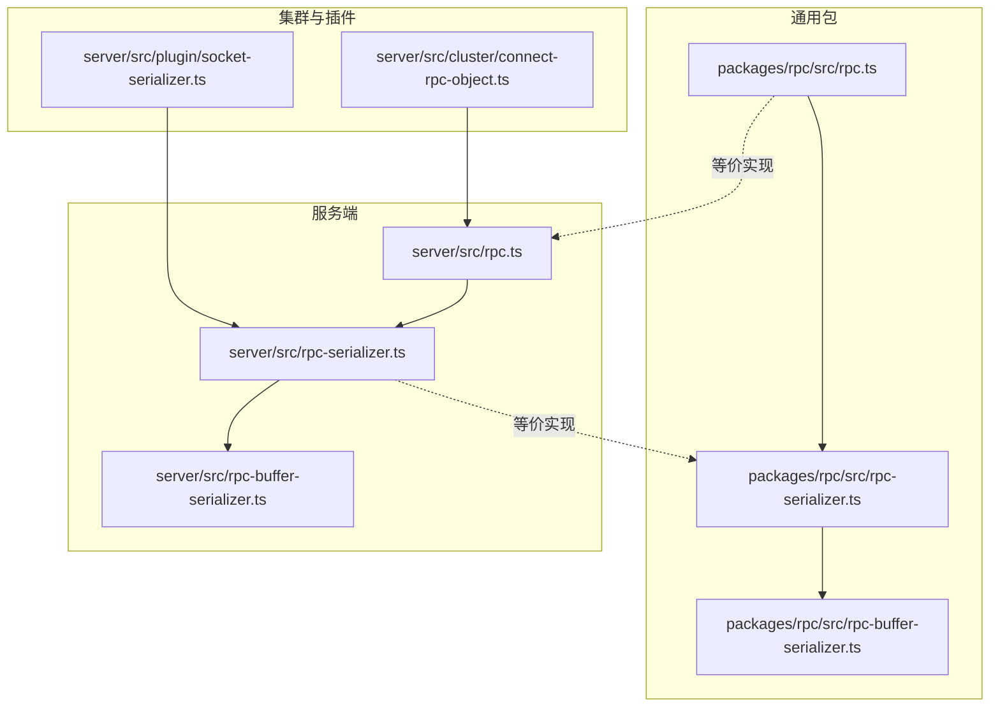
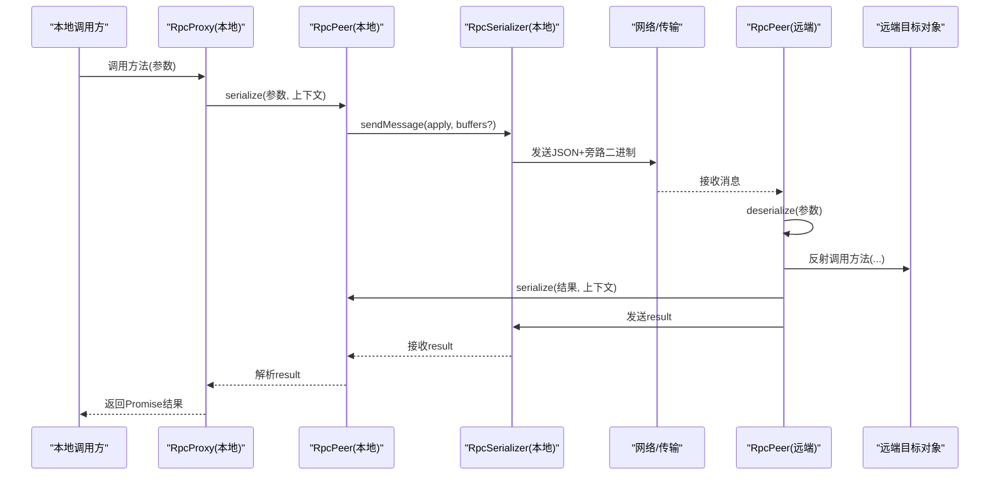
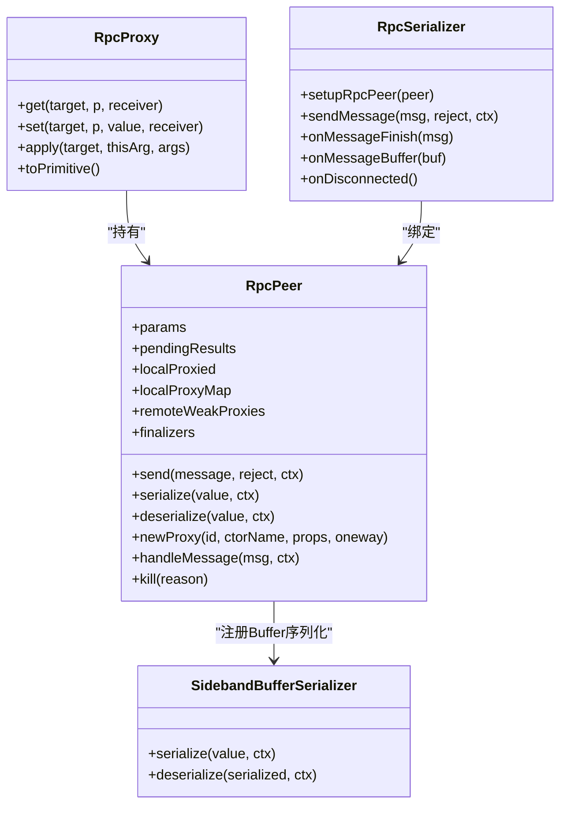
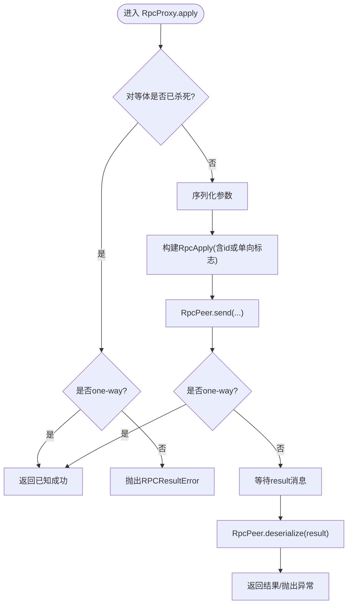
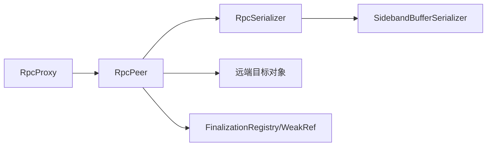

# 对象代理与远程调用

<cite>
**本文引用的文件**
- [packages/rpc/src/rpc.ts](file://packages/rpc/src/rpc.ts)
- [server/src/rpc.ts](file://server/src/rpc.ts)
- [packages/rpc/src/rpc-serializer.ts](file://packages/rpc/src/rpc-serializer.ts)
- [server/src/rpc-serializer.ts](file://server/src/rpc-serializer.ts)
- [packages/rpc/src/rpc-buffer-serializer.ts](file://packages/rpc/src/rpc-buffer-serializer.ts)
- [server/src/rpc-buffer-serializer.ts](file://server/src/rpc-buffer-serializer.ts)
- [server/src/cluster/connect-rpc-object.ts](file://server/src/cluster/connect-rpc-object.ts)
- [server/src/plugin/socket-serializer.ts](file://server/src/plugin/socket-serializer.ts)
</cite>

## 目录
1. [引言](#引言)
2. [项目结构](#项目结构)
3. [核心组件](#核心组件)
4. [架构总览](#架构总览)
5. [详细组件分析](#详细组件分析)
6. [依赖关系分析](#依赖关系分析)
7. [性能考量](#性能考量)
8. [故障排查指南](#故障排查指南)
9. [结论](#结论)
10. [附录](#附录)

## 引言
本文件系统性阐述 Scrypted 的对象代理与远程调用（RPC）机制，覆盖代理对象的生成与接口映射、方法调用拦截与执行、参数与结果序列化/反序列化、上下文维护、生命周期管理、远程对象管理、以及性能优化策略。目标读者既包括需要深入理解实现细节的工程师，也包括希望了解如何正确使用与扩展该机制的使用者。

## 项目结构
Scrypted 将 RPC 核心能力拆分为通用包与服务端实现两套等价实现，分别位于 packages/rpc 与 server/src，二者共享相同的接口与行为契约，便于在不同运行时（浏览器/Node/WebRTC DataChannel 等）中复用。

- 通用 RPC 实现：packages/rpc/src/rpc.ts
- 服务端 RPC 实现：server/src/rpc.ts
- 序列化器与传输层：packages/rpc/src/rpc-serializer.ts、packages/rpc/src/rpc-buffer-serializer.ts
- 服务端对应实现：server/src/rpc-serializer.ts、server/src/rpc-buffer-serializer.ts
- 集群对象连接：server/src/cluster/connect-rpc-object.ts
- 插件侧 Socket 句柄序列化：server/src/plugin/socket-serializer.ts

图表来源
- [packages/rpc/src/rpc.ts:1-858](file://packages/rpc/src/rpc.ts#L1-L858)
- [server/src/rpc.ts:1-858](file://server/src/rpc.ts#L1-L858)
- [packages/rpc/src/rpc-serializer.ts:1-240](file://packages/rpc/src/rpc-serializer.ts#L1-L240)
- [server/src/rpc-serializer.ts:1-240](file://server/src/rpc-serializer.ts#L1-L240)
- [packages/rpc/src/rpc-buffer-serializer.ts:1-32](file://packages/rpc/src/rpc-buffer-serializer.ts#L1-L32)
- [server/src/rpc-buffer-serializer.ts:1-32](file://server/src/rpc-buffer-serializer.ts#L1-L32)
- [server/src/cluster/connect-rpc-object.ts:1-29](file://server/src/cluster/connect-rpc-object.ts#L1-L29)
- [server/src/plugin/socket-serializer.ts:1-16](file://server/src/plugin/socket-serializer.ts#L1-L16)

章节来源
- [packages/rpc/src/rpc.ts:1-858](file://packages/rpc/src/rpc.ts#L1-L858)
- [server/src/rpc.ts:1-858](file://server/src/rpc.ts#L1-L858)
- [packages/rpc/src/rpc-serializer.ts:1-240](file://packages/rpc/src/rpc-serializer.ts#L1-L240)
- [server/src/rpc-serializer.ts:1-240](file://server/src/rpc-serializer.ts#L1-L240)
- [packages/rpc/src/rpc-buffer-serializer.ts:1-32](file://packages/rpc/src/rpc-buffer-serializer.ts#L1-L32)
- [server/src/rpc-buffer-serializer.ts:1-32](file://server/src/rpc-buffer-serializer.ts#L1-L32)
- [server/src/cluster/connect-rpc-object.ts:1-29](file://server/src/cluster/connect-rpc-object.ts#L1-L29)
- [server/src/plugin/socket-serializer.ts:1-16](file://server/src/plugin/socket-serializer.ts#L1-L16)

## 核心组件
- RpcPeer：RPC 对等体，负责消息编解码、代理对象注册与弱引用缓存、待结果队列、错误封装、终结者（FinalizationRegistry）与弱引用联动、参数与结果序列化/反序列化、消息分发与处理。
- RpcProxy：代理处理器，基于 Proxy 拦截 get/set/apply，实现方法调用拦截、one-way 调用、异步迭代器支持、属性代理与构造名传播。
- RpcSerializer/RpcDuplexSerializer：消息发送/接收编解码器，支持 JSON 主消息 + 旁路二进制缓冲区、数据通道分片与去抖、断开检测与对等体销毁。
- SidebandBufferSerializer：二进制缓冲区旁路序列化器，避免大对象复制，提升传输效率。
- ClusterObject/ConnectRPCObject：集群场景下远程对象标识与连接抽象。

章节来源
- [packages/rpc/src/rpc.ts:84-220](file://packages/rpc/src/rpc.ts#L84-L220)
- [packages/rpc/src/rpc.ts:285-712](file://packages/rpc/src/rpc.ts#L285-L712)
- [packages/rpc/src/rpc-serializer.ts:5-85](file://packages/rpc/src/rpc-serializer.ts#L5-L85)
- [packages/rpc/src/rpc-buffer-serializer.ts:14-31](file://packages/rpc/src/rpc-buffer-serializer.ts#L14-L31)
- [server/src/cluster/connect-rpc-object.ts:1-29](file://server/src/cluster/connect-rpc-object.ts#L1-L29)

## 架构总览
RPC 采用“代理对象 + 序列化器 + 对等体”的分层设计：
- 代理层：通过 Proxy 拦截方法调用，收集参数并序列化，发起 apply 消息，等待 result 消息。
- 序列化层：将消息与二进制旁路数据打包/解析，处理断线与错误回退。
- 对等体层：维护本地/远端代理映射、弱引用缓存、待结果队列、错误封装与终结逻辑。

图表来源
- [packages/rpc/src/rpc.ts:152-220](file://packages/rpc/src/rpc.ts#L152-L220)
- [packages/rpc/src/rpc.ts:697-800](file://packages/rpc/src/rpc.ts#L697-L800)
- [packages/rpc/src/rpc-serializer.ts:38-84](file://packages/rpc/src/rpc-serializer.ts#L38-L84)

## 详细组件分析

### 代理创建与接口映射
- 代理生成：RpcPeer.newProxy 基于远端对象标识与构造名创建代理，使用 WeakRef 缓存以避免泄漏；注册 FinalizationRegistry 在 JS 引擎回收时自动发送 finalize 消息。
- 属性与方法映射：RpcProxy.get 优先返回显式代理属性，其次处理 Symbol.asyncIterator 与特殊符号，最后委托给 RpcPeer.handleFunctionInvocations 以支持 apply/call/toString 等。
- 构造名与属性传播：代理对象携带 __proxy_constructor 与 __proxy_props，确保远端能正确还原对象语义。

图表来源
- [packages/rpc/src/rpc.ts:84-220](file://packages/rpc/src/rpc.ts#L84-L220)
- [packages/rpc/src/rpc.ts:285-712](file://packages/rpc/src/rpc.ts#L285-L712)
- [packages/rpc/src/rpc-buffer-serializer.ts:14-31](file://packages/rpc/src/rpc-buffer-serializer.ts#L14-L31)
- [packages/rpc/src/rpc-serializer.ts:5-85](file://packages/rpc/src/rpc-serializer.ts#L5-L85)

章节来源
- [packages/rpc/src/rpc.ts:84-220](file://packages/rpc/src/rpc.ts#L84-L220)
- [packages/rpc/src/rpc.ts:680-695](file://packages/rpc/src/rpc.ts#L680-L695)

### 方法调用机制
- 本地拦截：RpcProxy.apply 拦截方法调用，收集参数并逐个序列化，构建 RpcApply 消息。
- one-way 支持：若方法标记为单向，则不分配 id，直接发送并立即返回已知成功。
- 结果等待：非单向调用通过 RpcPeer.createPendingResult 分配唯一 id，等待对应 result 消息。
- 远端执行：RpcPeer.handleMessageInternal 根据 proxyId 定位本地目标，反序列化参数后反射调用；对异步迭代器 next/throw/return 特殊处理，支持 yield 与 StopAsyncIteration。

图表来源
- [packages/rpc/src/rpc.ts:152-220](file://packages/rpc/src/rpc.ts#L152-L220)
- [packages/rpc/src/rpc.ts:714-800](file://packages/rpc/src/rpc.ts#L714-L800)

章节来源
- [packages/rpc/src/rpc.ts:152-220](file://packages/rpc/src/rpc.ts#L152-L220)
- [packages/rpc/src/rpc.ts:714-800](file://packages/rpc/src/rpc.ts#L714-L800)

### 参数传递策略
- 传输安全类型：默认允许 Number/String/Object/Boolean/Array 直接传输。
- 禁止传输：包含 Symbol.asyncIterator 或标记为禁止序列化的值将触发代理包装。
- 错误对象：统一序列化为特殊构造名的代理值，远端可反序列化为 RPCResultError。
- 自定义序列化：通过 RpcPeer.addSerializer 注册构造名到自定义 RpcSerializer 的映射，支持复杂对象（如 Buffer、Socket 句柄）旁路传输。
- 旁路二进制：SidebandBufferSerializer 将大对象放入 serializationContext.buffers，仅在消息中传递索引，显著降低拷贝成本。
- JSON 复制子节点：当对象标记为复制序列化子节点时，递归序列化其子项，适用于部分字段需要独立序列化的情形。

章节来源
- [packages/rpc/src/rpc.ts:402-416](file://packages/rpc/src/rpc.ts#L402-L416)
- [packages/rpc/src/rpc.ts:570-678](file://packages/rpc/src/rpc.ts#L570-L678)
- [packages/rpc/src/rpc-buffer-serializer.ts:14-31](file://packages/rpc/src/rpc-buffer-serializer.ts#L14-L31)
- [server/src/plugin/socket-serializer.ts:1-16](file://server/src/plugin/socket-serializer.ts#L1-L16)

### 结果返回流程
- 成功路径：远端执行完成后，RpcPeer.serialize 将结果编码并通过 RpcSerializer 发送 result 消息。
- 异常处理：捕获异常后，RpcPeer.createErrorResult 将异常封装为特殊代理值，远端收到后抛出 RPCResultError。
- 断线与回退：发送失败时，RpcPeer.sendResult 会尝试发送错误回退消息，保证调用方感知失败。
- 单向调用：不期望返回值，直接丢弃 id 并立即视为成功。

章节来源
- [packages/rpc/src/rpc.ts:707-712](file://packages/rpc/src/rpc.ts#L707-L712)
- [packages/rpc/src/rpc.ts:488-551](file://packages/rpc/src/rpc.ts#L488-L551)
- [packages/rpc/src/rpc.ts:179-186](file://packages/rpc/src/rpc.ts#L179-L186)

### 对象生命周期管理
- 代理创建：RpcPeer.newProxy 创建代理并注册 WeakRef 与 FinalizationRegistry。
- 缓存策略：remoteWeakProxies 使用 WeakRef 缓存远端代理，避免强引用导致泄漏；localProxied/localProxyMap 维护本地对象到远端代理的映射。
- 垃圾回收：FinalizationRegistry 回调中发送 finalize 消息，通知远端释放对应对象；同时统计 remotesCreated/remotesCollected 用于周期性 GC 触发。
- 资源释放：RpcPeer.kill 冻结内部状态，拒绝新请求，向所有挂起的异步迭代器抛出错误并清理映射表。

章节来源
- [packages/rpc/src/rpc.ts:680-695](file://packages/rpc/src/rpc.ts#L680-L695)
- [packages/rpc/src/rpc.ts:464-474](file://packages/rpc/src/rpc.ts#L464-L474)
- [packages/rpc/src/rpc.ts:439-456](file://packages/rpc/src/rpc.ts#L439-L456)
- [packages/rpc/src/rpc.ts:1-27](file://packages/rpc/src/rpc.ts#L1-L27)

### 远程对象管理
- 对象标识：每个远端代理拥有唯一 proxyId；本地对象首次被代理时生成并登记。
- 引用计数：通过 FinalizationRegistry 与 WeakRef 实现软引用跟踪，结合 finalize 消息进行资源回收。
- 跨进程通信：RpcSerializer/RpcDuplexSerializer 支持流式读写、数据通道分片、旁路二进制，适配多种传输介质。
- 内存同步：序列化上下文 buffers 与 onProxySerialization 回调确保对象状态与属性在远端正确重建。

章节来源
- [packages/rpc/src/rpc.ts:617-678](file://packages/rpc/src/rpc.ts#L617-L678)
- [packages/rpc/src/rpc-serializer.ts:5-85](file://packages/rpc/src/rpc-serializer.ts#L5-L85)
- [server/src/rpc-serializer.ts:5-85](file://server/src/rpc-serializer.ts#L5-L85)

## 依赖关系分析
- 低耦合高内聚：RpcPeer 作为核心调度器，与 RpcProxy、RpcSerializer、SidebandBufferSerializer 松耦合，通过接口契约交互。
- 可替换传输层：RpcSerializer 抽象屏蔽了底层传输差异（Stream/WebRTC DataChannel），便于扩展。
- 扩展点丰富：addSerializer/onProxySerialization/onProxyTypeSerialization 提供灵活的对象定制序列化能力。

图表来源
- [packages/rpc/src/rpc.ts:285-712](file://packages/rpc/src/rpc.ts#L285-L712)
- [packages/rpc/src/rpc-serializer.ts:5-85](file://packages/rpc/src/rpc-serializer.ts#L5-L85)
- [packages/rpc/src/rpc-buffer-serializer.ts:14-31](file://packages/rpc/src/rpc-buffer-serializer.ts#L14-L31)

章节来源
- [packages/rpc/src/rpc.ts:285-712](file://packages/rpc/src/rpc.ts#L285-L712)
- [packages/rpc/src/rpc-serializer.ts:5-85](file://packages/rpc/src/rpc-serializer.ts#L5-L85)
- [packages/rpc/src/rpc-buffer-serializer.ts:14-31](file://packages/rpc/src/rpc-buffer-serializer.ts#L14-L31)

## 性能考量
- 连接复用与旁路传输：通过 SidebandBufferSerializer 将大对象旁路传输，减少 JSON 序列化与拷贝开销。
- 批量与延迟：数据通道分片与去抖（setTimeout）降低小包数量，提升吞吐。
- 延迟加载：代理对象按需创建与弱引用缓存，避免无谓驻留。
- 周期性 GC：startPeriodicGarbageCollection 周期触发全局 GC，平衡内存占用与性能。
- 传输安全：仅对非安全类型进行代理包装，减少不必要的序列化成本。

章节来源
- [packages/rpc/src/rpc-buffer-serializer.ts:14-31](file://packages/rpc/src/rpc-buffer-serializer.ts#L14-L31)
- [packages/rpc/src/rpc-serializer.ts:184-239](file://packages/rpc/src/rpc-serializer.ts#L184-L239)
- [packages/rpc/src/rpc.ts:1-27](file://packages/rpc/src/rpc.ts#L1-L27)

## 故障排查指南
- 调用失败且无响应：检查 RpcPeer 是否已被 kill，确认 pendingResults 是否被冻结；查看 RPCResultError 的堆栈与对等体名称。
- 参数/结果异常：确认自定义序列化器是否正确注册；检查 onProxySerialization 返回的 proxyId 是否与本地登记一致。
- 传输错误：观察 RpcSerializer.onDisconnected 与消息解析失败日志；确认旁路二进制是否完整到达。
- 异步迭代器问题：关注 yieldedAsyncIterators 与 StopAsyncIteration 的处理，确保迭代器在远端正确结束。

章节来源
- [packages/rpc/src/rpc.ts:439-456](file://packages/rpc/src/rpc.ts#L439-L456)
- [packages/rpc/src/rpc.ts:714-800](file://packages/rpc/src/rpc.ts#L714-L800)
- [packages/rpc/src/rpc-serializer.ts:33-50](file://packages/rpc/src/rpc-serializer.ts#L33-L50)
- [packages/rpc/src/rpc.ts:763-784](file://packages/rpc/src/rpc.ts#L763-L784)

## 结论
Scrypted 的对象代理与远程调用机制通过 Proxy 拦截、RpcPeer 调度、RpcSerializer 编解码与 SidebandBufferSerializer 旁路传输，实现了高效、可扩展、可移植的跨边界对象访问。其设计在保证易用性的同时，提供了丰富的扩展点与性能优化手段，适合在多进程/多平台环境中稳定运行。

## 附录
- 集群对象连接：ClusterObject/ConnectRPCObject 提供跨进程对象定位与连接抽象，便于在分布式场景中建立远端代理。
- 插件 Socket 序列化：SidebandSocketSerializer 支持在 IPC 场景下传递原生 Socket 句柄，满足高级通信需求。

章节来源
- [server/src/cluster/connect-rpc-object.ts:1-29](file://server/src/cluster/connect-rpc-object.ts#L1-L29)
- [server/src/plugin/socket-serializer.ts:1-16](file://server/src/plugin/socket-serializer.ts#L1-L16)