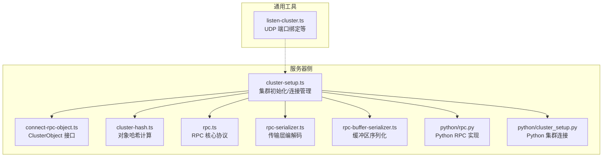
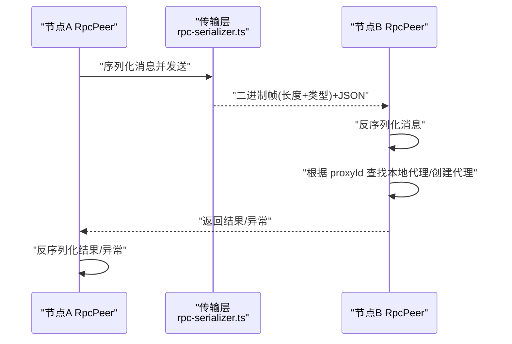
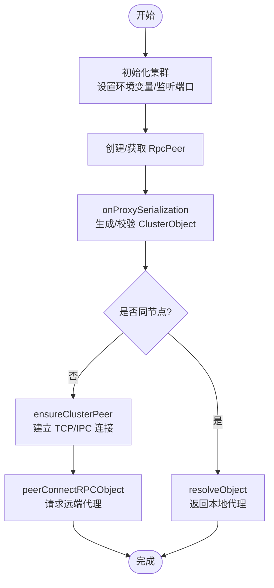
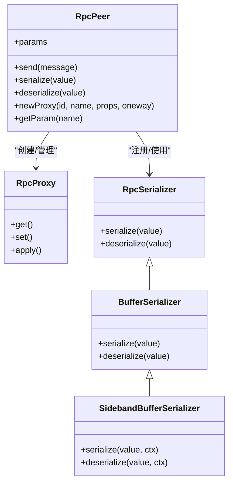
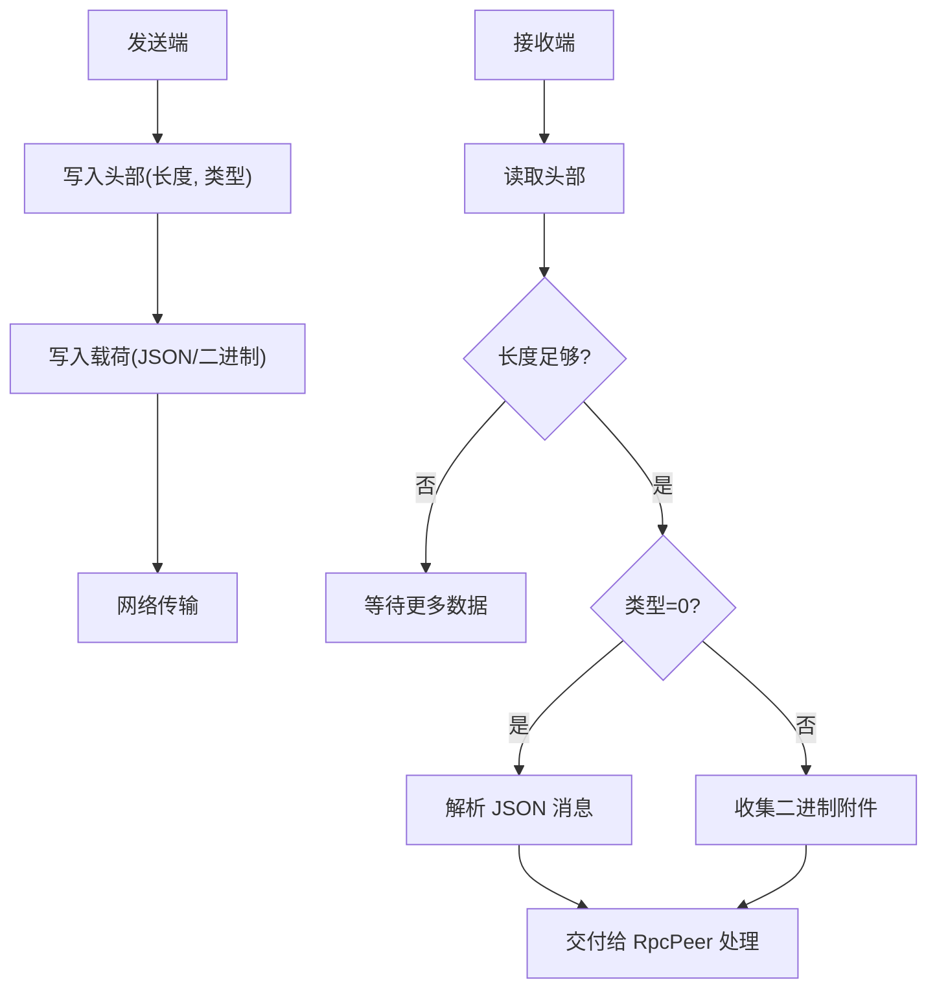
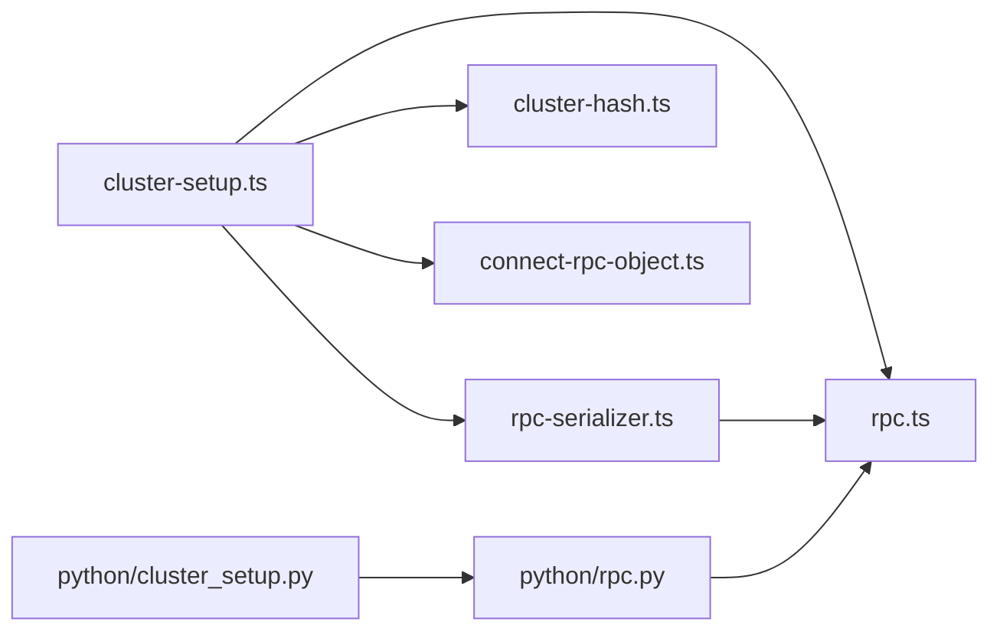

# 服务发现与 RPC 通信

<cite>
**本文引用的文件**
- [server/src/cluster/cluster-setup.ts](file://server/src/cluster/cluster-setup.ts)
- [server/src/cluster/connect-rpc-object.ts](file://server/src/cluster/connect-rpc-object.ts)
- [server/src/cluster/cluster-hash.ts](file://server/src/cluster/cluster-hash.ts)
- [server/src/rpc.ts](file://server/src/rpc.ts)
- [server/src/rpc-serializer.ts](file://server/src/rpc-serializer.ts)
- [server/src/rpc-buffer-serializer.ts](file://server/src/rpc-buffer-serializer.ts)
- [server/python/rpc.py](file://server/python/rpc.py)
- [server/python/cluster_setup.py](file://server/python/cluster_setup.py)
- [common/src/listen-cluster.ts](file://common/src/listen-cluster.ts)
</cite>

## 目录
1. [引言](#引言)
2. [项目结构](#项目结构)
3. [核心组件](#核心组件)
4. [架构总览](#架构总览)
5. [详细组件分析](#详细组件分析)
6. [依赖分析](#依赖分析)
7. [性能考虑](#性能考虑)
8. [故障排查指南](#故障排查指南)
9. [结论](#结论)
10. [附录](#附录)

## 引言
本文件系统性阐述 Scrypted 在集群模式下的“服务发现与 RPC 通信”机制，覆盖以下主题：
- 服务发现：节点间如何识别彼此、建立连接、解析远端对象。
- RPC 通信：消息格式、传输层协议、序列化/反序列化、对象代理与远程调用。
- 连接管理与会话控制：连接建立、会话维护、超时与断线恢复。
- 故障检测与自动恢复：心跳、健康检查、自动重连与负载转移。
- 安全配置：认证、完整性校验、防重放。
- 性能优化：连接池、批量处理、压缩传输、异步调用。
- 监控与调试：日志、性能分析、故障排查。

## 项目结构
围绕集群与 RPC 的关键目录与文件：
- server/src/cluster：集群初始化、节点发现、连接管理、对象解析。
- server/src：核心 RPC 协议、消息编解码、代理与序列化器。
- server/python：Python 端 RPC 实现（用于插件或桥接）。
- common/src：通用网络绑定工具（如 UDP 端口绑定）。

**图表来源**
- [server/src/cluster/cluster-setup.ts:38-399](file://server/src/cluster/cluster-setup.ts#L38-L399)
- [server/src/cluster/connect-rpc-object.ts:1-29](file://server/src/cluster/connect-rpc-object.ts#L1-L29)
- [server/src/cluster/cluster-hash.ts:4-7](file://server/src/cluster/cluster-hash.ts#L4-L7)
- [server/src/rpc.ts:29-800](file://server/src/rpc.ts#L29-L800)
- [server/src/rpc-serializer.ts:5-240](file://server/src/rpc-serializer.ts#L5-L240)
- [server/src/rpc-buffer-serializer.ts:1-31](file://server/src/rpc-buffer-serializer.ts#L1-L31)
- [server/python/rpc.py:157-620](file://server/python/rpc.py#L157-L620)
- [server/python/cluster_setup.py:54-161](file://server/python/cluster_setup.py#L54-L161)
- [common/src/listen-cluster.ts:1-83](file://common/src/listen-cluster.ts#L1-L83)

**章节来源**
- [server/src/cluster/cluster-setup.ts:38-399](file://server/src/cluster/cluster-setup.ts#L38-L399)
- [server/src/rpc.ts:29-800](file://server/src/rpc.ts#L29-L800)
- [server/src/rpc-serializer.ts:5-240](file://server/src/rpc-serializer.ts#L5-L240)
- [server/src/rpc-buffer-serializer.ts:1-31](file://server/src/rpc-buffer-serializer.ts#L1-L31)
- [server/python/rpc.py:157-620](file://server/python/rpc.py#L157-L620)
- [server/python/cluster_setup.py:54-161](file://server/python/cluster_setup.py#L54-L161)
- [common/src/listen-cluster.ts:1-83](file://common/src/listen-cluster.ts#L1-L83)

## 核心组件
- 集群初始化与连接管理：负责监听/连接集群端口、维护对端 RpcPeer、分发对象解析请求。
- 对象代理与 RPC：提供代理创建、方法调用、参数传递、结果返回、错误传播。
- 传输层编解码：基于自定义二进制帧头（长度+类型）承载 JSON 消息与二进制附件。
- 序列化器：支持基础类型、异常、Buffer/Uint8Array、以及自定义类型的序列化。
- Python 侧 RPC：与 Node 侧兼容的 RPC 协议实现，便于插件或桥接场景使用。

**章节来源**
- [server/src/cluster/cluster-setup.ts:38-399](file://server/src/cluster/cluster-setup.ts#L38-L399)
- [server/src/rpc.ts:285-795](file://server/src/rpc.ts#L285-L795)
- [server/src/rpc-serializer.ts:5-182](file://server/src/rpc-serializer.ts#L5-L182)
- [server/src/rpc-buffer-serializer.ts:1-31](file://server/src/rpc-buffer-serializer.ts#L1-L31)
- [server/python/rpc.py:157-620](file://server/python/rpc.py#L157-L620)

## 架构总览
下图展示集群节点间通过 TCP 建立 RPC 通道，并以统一的消息格式进行对象代理与远程调用：

**图表来源**
- [server/src/rpc-serializer.ts:5-182](file://server/src/rpc-serializer.ts#L5-L182)
- [server/src/rpc.ts:697-800](file://server/src/rpc.ts#L697-L800)

## 详细组件分析

### 组件一：集群服务发现与连接管理
- 初始化集群：设置环境变量（地址、端口、密钥），启动随机端口监听，注册 onProxySerialization 回调，注入 connectRPCObject 参数。
- 节点发现：通过 ensureClusterPeer 建立到远端的 TCP 连接；若同一主机内进程，优先走 IPC（worker_threads）路径。
- 对象解析：收到 ClusterObject 后，校验 sha256，解析 sourceKey 与 proxyId，定位本地代理或发起跨节点连接。
- 主线程桥接：在多线程场景中，通过 MessageChannel 建立线程间连接，避免重复握手。

**图表来源**
- [server/src/cluster/cluster-setup.ts:38-399](file://server/src/cluster/cluster-setup.ts#L38-L399)
- [server/src/cluster/connect-rpc-object.ts:1-29](file://server/src/cluster/connect-rpc-object.ts#L1-L29)
- [server/src/cluster/cluster-hash.ts:4-7](file://server/src/cluster/cluster-hash.ts#L4-L7)

**章节来源**
- [server/src/cluster/cluster-setup.ts:38-399](file://server/src/cluster/cluster-setup.ts#L38-L399)
- [server/src/cluster/connect-rpc-object.ts:1-29](file://server/src/cluster/connect-rpc-object.ts#L1-L29)
- [server/src/cluster/cluster-hash.ts:4-7](file://server/src/cluster/cluster-hash.ts#L4-L7)
- [server/python/cluster_setup.py:54-161](file://server/python/cluster_setup.py#L54-L161)

### 组件二：RPC 通信协议与对象代理
- 消息模型：param/apply/result/finalize，分别用于参数读取、方法调用、结果返回、代理终结。
- 代理创建：newProxy 创建可拦截的目标对象，支持函数与普通对象；通过 WeakRef 管理生命周期。
- 方法调用：RpcProxy 拦截属性访问与调用，构造 RpcApply 并发送；支持单向调用（oneway）。
- 序列化/反序列化：默认仅传输安全类型（JSON 可序列化），其他类型通过 __remote_proxy_id 包装为代理；Buffer/Uint8Array 使用 SidebandBufferSerializer 作为附件传输。
- 错误传播：异常被序列化为 RPCResultError，携带 name/stack/message，在对端重新抛出。

**图表来源**
- [server/src/rpc.ts:285-795](file://server/src/rpc.ts#L285-L795)
- [server/src/rpc-buffer-serializer.ts:1-31](file://server/src/rpc-buffer-serializer.ts#L1-L31)

**章节来源**
- [server/src/rpc.ts:29-800](file://server/src/rpc.ts#L29-L800)
- [server/src/rpc-buffer-serializer.ts:1-31](file://server/src/rpc-buffer-serializer.ts#L1-L31)

### 组件三：传输层协议与编解码
- 帧格式：固定 5 字节头部（长度+类型），随后为 JSON 或二进制载荷。
- 分片与拼包：接收端按长度字段拼接完整消息；类型 0 表示 JSON，类型 1 表示二进制附件。
- 数据通道：针对 WebRTC DataChannel 提供分片与去抖动发送逻辑，限制单包大小。
- 缓冲区传输：通过 serializationContext.buffers 传递二进制数据，避免拷贝与内存膨胀。

**图表来源**
- [server/src/rpc-serializer.ts:87-182](file://server/src/rpc-serializer.ts#L87-L182)

**章节来源**
- [server/src/rpc-serializer.ts:5-240](file://server/src/rpc-serializer.ts#L5-L240)

### 组件四：Python 侧 RPC 与集群桥接
- Python RpcPeer 与 Node RpcPeer 兼容，支持代理、序列化、错误传播。
- Python 端 cluster_setup 提供 onProxySerialization、connectClusterObject、监听集群端口等能力，与 Node 端形成对称实现。

**章节来源**
- [server/python/rpc.py:157-620](file://server/python/rpc.py#L157-L620)
- [server/python/cluster_setup.py:54-161](file://server/python/cluster_setup.py#L54-L161)

## 依赖分析
- 组件耦合
  - cluster-setup.ts 依赖 rpc.ts、rpc-serializer.ts、cluster-hash.ts、connect-rpc-object.ts。
  - rpc-serializer.ts 依赖 rpc.ts，并注册 Buffer 序列化器。
  - Python 侧实现与 Node 侧保持消息语义一致。
- 外部依赖
  - Node net/dgram、worker_threads。
  - Python asyncio、weakref、dataclasses。

**图表来源**
- [server/src/cluster/cluster-setup.ts:8-11](file://server/src/cluster/cluster-setup.ts#L8-L11)
- [server/src/rpc-serializer.ts:1-4](file://server/src/rpc-serializer.ts#L1-L4)
- [server/src/rpc.ts:285-300](file://server/src/rpc.ts#L285-L300)
- [server/python/rpc.py:157-178](file://server/python/rpc.py#L157-L178)
- [server/python/cluster_setup.py:54-161](file://server/python/cluster_setup.py#L54-L161)

**章节来源**
- [server/src/cluster/cluster-setup.ts:8-11](file://server/src/cluster/cluster-setup.ts#L8-L11)
- [server/src/rpc-serializer.ts:1-4](file://server/src/rpc-serializer.ts#L1-L4)
- [server/src/rpc.ts:285-300](file://server/src/rpc.ts#L285-L300)
- [server/python/rpc.py:157-178](file://server/python/rpc.py#L157-L178)
- [server/python/cluster_setup.py:54-161](file://server/python/cluster_setup.py#L54-L161)

## 性能考虑
- 连接复用与长连接：通过 ensureClusterPeer 缓存 RpcPeer，避免重复握手。
- 二进制高效传输：SidebandBufferSerializer 将大对象以附件形式发送，减少 JSON 序列化开销。
- 批量与去抖：DataChannel 发送采用队列与 nextTick 刷新，降低小包数量。
- GC 与内存：定期触发全局 GC，减少代理对象泄漏；弱引用管理代理生命周期。
- 参数读取优化：getParam 使用一次性请求，避免多次往返。

**章节来源**
- [server/src/rpc-serializer.ts:184-240](file://server/src/rpc-serializer.ts#L184-L240)
- [server/src/rpc-buffer-serializer.ts:1-31](file://server/src/rpc-buffer-serializer.ts#L1-L31)
- [server/src/rpc.ts:1-27](file://server/src/rpc.ts#L1-L27)

## 故障排查指南
- 连接失败
  - 检查 SCRYPTED_CLUSTER_MODE、SCRYPTED_CLUSTER_SECRET、SCRYPTED_CLUSTER_ADDRESS/SCRYPTED_CLUSTER_SERVER 是否正确设置。
  - 确认 clusterListenZero 绑定成功，且 127.0.0.1 与指定地址同时监听。
- 对象解析失败
  - 校验 ClusterObject 的 sha256 是否匹配；确认 sourceKey 与 proxyId 正确。
  - 检查 connectRPCObject 返回值，确保 resolveObject 能在目标节点找到本地代理。
- 序列化/反序列化异常
  - 确保 Buffer/Uint8Array 已注册 SidebandBufferSerializer；自定义类型需注册对应序列化器。
  - 检查 serializationContext.buffers 是否正确传递。
- Python 插件问题
  - 确认 Python 端 rpc.py 与 Node 端消息格式一致；检查 onProxySerialization 回调是否正确设置。
- 日志与调试
  - 关注 RpcPeer.kill 触发原因（连接关闭、解析失败、序列化失败）。
  - 使用 startPeriodicGarbageCollection 触发 GC，观察 remotesCreated/remotesCollected 变化。

**章节来源**
- [server/src/cluster/cluster-setup.ts:403-462](file://server/src/cluster/cluster-setup.ts#L403-L462)
- [server/src/cluster/cluster-hash.ts:4-7](file://server/src/cluster/cluster-hash.ts#L4-L7)
- [server/src/rpc.ts:439-474](file://server/src/rpc.ts#L439-L474)
- [server/src/rpc-serializer.ts:53-84](file://server/src/rpc-serializer.ts#L53-L84)
- [server/python/rpc.py:157-178](file://server/python/rpc.py#L157-L178)

## 结论
Scrypted 的集群服务发现与 RPC 通信以“代理 + 消息协议 + 自定义传输层”为核心，实现了跨语言、跨进程、跨线程的透明远程调用。通过严格的对象标识与哈希校验、高效的二进制附件传输、完善的生命周期管理与错误传播，系统在保证易用性的同时兼顾了性能与可靠性。建议在生产环境中结合日志与 GC 监控，持续优化连接复用与序列化策略。

## 附录
- 术语
  - ClusterObject：集群中对象的身份标识，包含 id/address/port/proxyId/sourceKey/sha256。
  - RpcPeer：RPC 会话的抽象，负责消息发送、序列化、代理管理。
  - onProxySerialization：代理序列化钩子，用于生成/校验 ClusterObject。
  - SidebandBufferSerializer：二进制附件序列化器，配合 serializationContext.buffers 使用。
- 参考文件
  - [server/src/cluster/cluster-setup.ts:38-399](file://server/src/cluster/cluster-setup.ts#L38-L399)
  - [server/src/cluster/connect-rpc-object.ts:1-29](file://server/src/cluster/connect-rpc-object.ts#L1-L29)
  - [server/src/cluster/cluster-hash.ts:4-7](file://server/src/cluster/cluster-hash.ts#L4-L7)
  - [server/src/rpc.ts:29-800](file://server/src/rpc.ts#L29-L800)
  - [server/src/rpc-serializer.ts:5-240](file://server/src/rpc-serializer.ts#L5-L240)
  - [server/src/rpc-buffer-serializer.ts:1-31](file://server/src/rpc-buffer-serializer.ts#L1-L31)
  - [server/python/rpc.py:157-620](file://server/python/rpc.py#L157-L620)
  - [server/python/cluster_setup.py:54-161](file://server/python/cluster_setup.py#L54-L161)
  - [common/src/listen-cluster.ts:1-83](file://common/src/listen-cluster.ts#L1-L83)