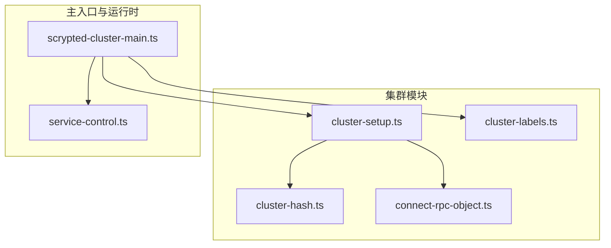
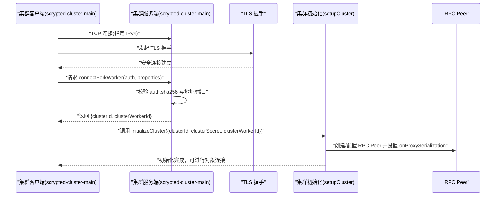
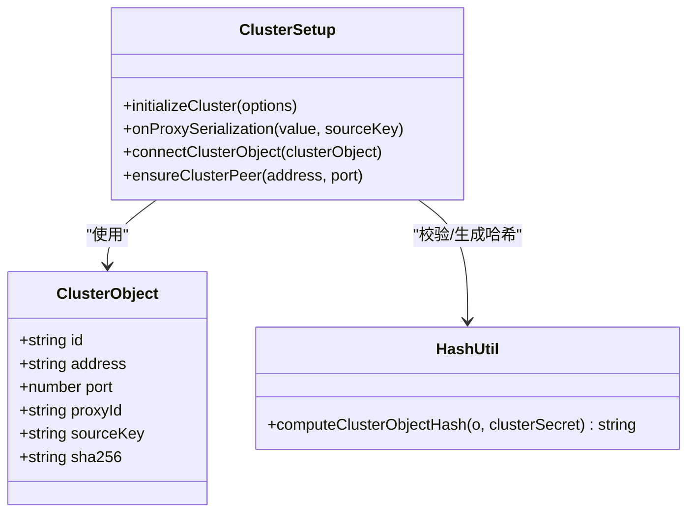
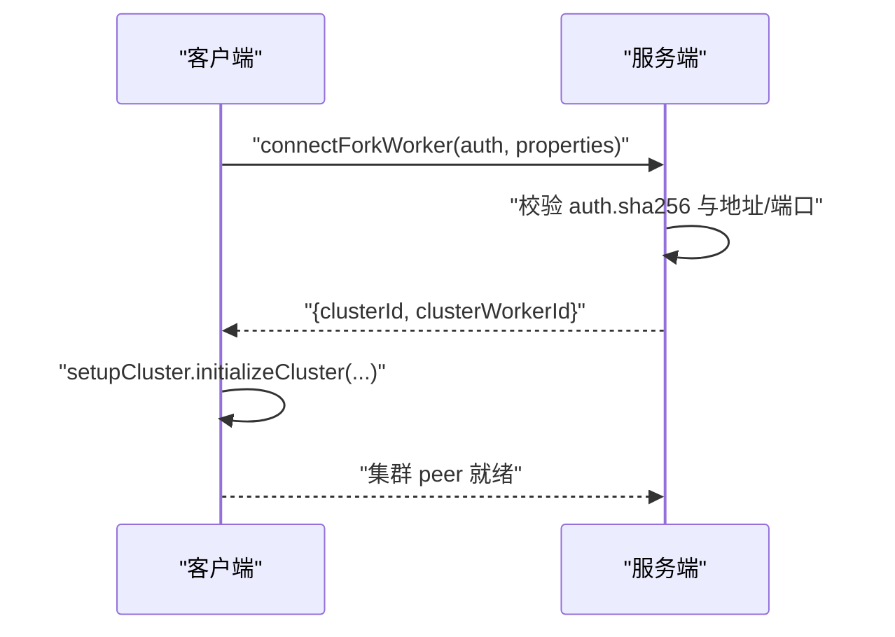
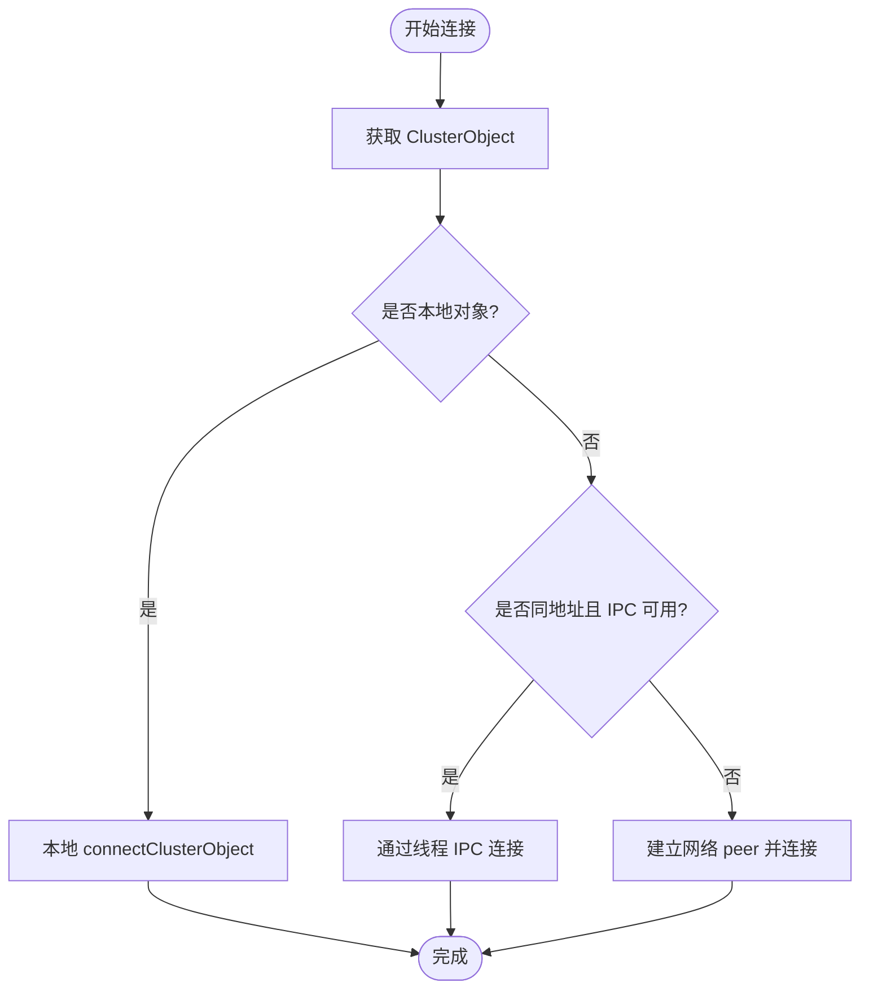
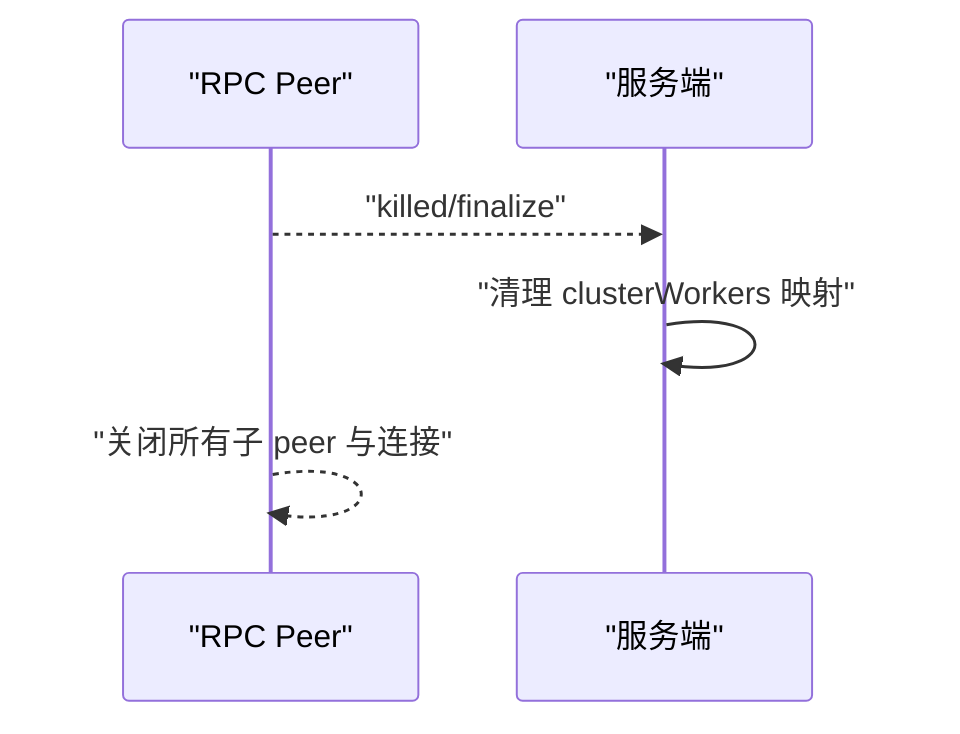
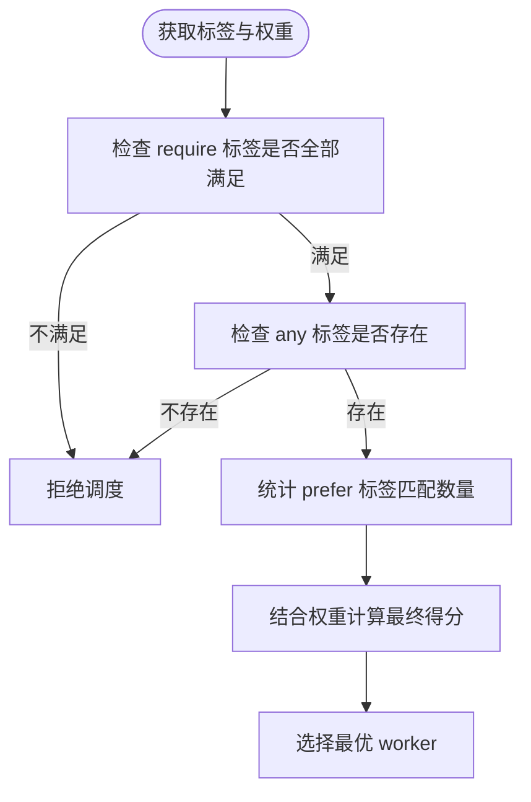
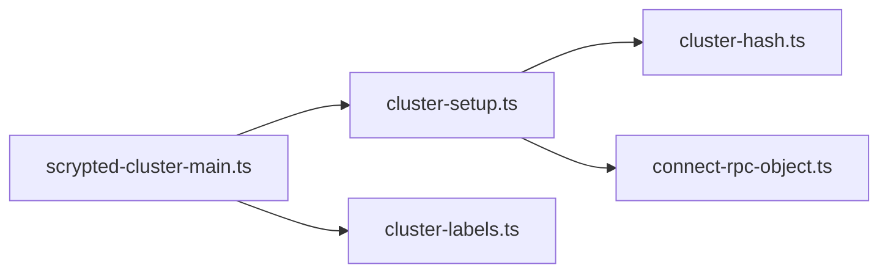

# 服务发现机制

<cite>
**本文引用的文件**
- [cluster-setup.ts](file://server/src/cluster/cluster-setup.ts)
- [cluster-hash.ts](file://server/src/cluster/cluster-hash.ts)
- [cluster-labels.ts](file://server/src/cluster/cluster-labels.ts)
- [connect-rpc-object.ts](file://server/src/cluster/connect-rpc-object.ts)
- [scrypted-cluster-main.ts](file://server/src/scrypted-cluster-main.ts)
- [service-control.ts](file://server/src/services/service-control.ts)
</cite>

## 目录
1. [引言](#引言)
2. [项目结构](#项目结构)
3. [核心组件](#核心组件)
4. [架构总览](#架构总览)
5. [详细组件分析](#详细组件分析)
6. [依赖关系分析](#依赖关系分析)
7. [性能考量](#性能考量)
8. [故障排查指南](#故障排查指南)
9. [结论](#结论)
10. [附录](#附录)

## 引言
本文件系统性阐述 Scrypted 的集群服务发现与通信机制，重点覆盖以下方面：
- 节点启动时的服务注册流程：包括认证、参数协商、集群对象标识生成与校验。
- 服务查询与对象连接：包括代理序列化、跨进程/线程对象解析与连接。
- 注销与断连处理：包括正常关闭、异常断开、资源清理。
- 动态发现与负载：包括标签匹配、权重选择、动态派发。
- 元数据管理：包括服务类型标识、版本信息、能力声明、健康状态。
- 定位策略：包括一致性哈希、轮询、权重分配、就近访问。

## 项目结构
Scrypted 的集群服务发现主要位于 server 模块的 cluster 子目录中，配合主入口与运行时环境变量实现端到端的集群模式启动与对象分发。

**图表来源**
- [cluster-setup.ts:1-498](file://server/src/cluster/cluster-setup.ts#L1-L498)
- [cluster-hash.ts:1-8](file://server/src/cluster/cluster-hash.ts#L1-L8)
- [cluster-labels.ts:1-58](file://server/src/cluster/cluster-labels.ts#L1-L58)
- [connect-rpc-object.ts:1-29](file://server/src/cluster/connect-rpc-object.ts#L1-L29)
- [scrypted-cluster-main.ts:1-410](file://server/src/scrypted-cluster-main.ts#L1-L410)
- [service-control.ts:1-33](file://server/src/services/service-control.ts#L1-L33)

**章节来源**
- [cluster-setup.ts:1-498](file://server/src/cluster/cluster-setup.ts#L1-L498)
- [cluster-hash.ts:1-8](file://server/src/cluster/cluster-hash.ts#L1-L8)
- [cluster-labels.ts:1-58](file://server/src/cluster/cluster-labels.ts#L1-L58)
- [connect-rpc-object.ts:1-29](file://server/src/cluster/connect-rpc-object.ts#L1-L29)
- [scrypted-cluster-main.ts:1-410](file://server/src/scrypted-cluster-main.ts#L1-L410)
- [service-control.ts:1-33](file://server/src/services/service-control.ts#L1-L33)

## 核心组件
- 集群对象模型（ClusterObject）：用于在集群内唯一标识一个本地对象，包含集群 ID、创建地址与端口、代理 ID、来源 peer 键以及签名值。
- 集群初始化与连接（setupCluster）：负责监听/连接集群 RPC 端口、建立 peer、序列化/反序列化代理对象、跨线程/进程对象连接。
- 密钥与哈希（computeClusterObjectHash）：使用固定字段与共享密钥生成稳定且可校验的哈希，防止伪造与篡改。
- 标签与权重（getClusterLabels/getClusterWorkerWeight/matchesClusterLabels）：基于环境变量与主机信息进行标签匹配与权重计算，支持偏好选择与最小匹配。
- 主入口（scrypted-cluster-main）：根据环境变量决定“server”或“client”模式，完成 TLS 连接、认证、fork 工作器、初始化集群 peer。

**章节来源**
- [connect-rpc-object.ts:1-29](file://server/src/cluster/connect-rpc-object.ts#L1-L29)
- [cluster-setup.ts:38-399](file://server/src/cluster/cluster-setup.ts#L38-L399)
- [cluster-hash.ts:4-7](file://server/src/cluster/cluster-hash.ts#L4-L7)
- [cluster-labels.ts:37-57](file://server/src/cluster/cluster-labels.ts#L37-L57)
- [scrypted-cluster-main.ts:213-330](file://server/src/scrypted-cluster-main.ts#L213-L330)

## 架构总览
下图展示了集群客户端与服务端的交互、TLS 连接、认证、工作器 fork 与集群 peer 初始化的整体流程。

**图表来源**
- [scrypted-cluster-main.ts:242-330](file://server/src/scrypted-cluster-main.ts#L242-L330)
- [scrypted-cluster-main.ts:332-409](file://server/src/scrypted-cluster-main.ts#L332-L409)
- [cluster-setup.ts:336-399](file://server/src/cluster/cluster-setup.ts#L336-L399)

## 详细组件分析

### 组件一：集群对象模型与哈希校验
- ClusterObject 字段含义：
  - id：集群标识符，用于区分不同集群。
  - address/port：创建该对象的节点地址与端口。
  - proxyId：对象在源 peer 中的代理 ID，需全局稳定。
  - sourceKey：源 peer 的键，用于区分不同连接。
  - sha256：对关键字段与共享密钥计算的哈希，用于防伪校验。
- 哈希计算：
  - 使用固定字段拼接与共享密钥进行哈希，确保同一对象在不同节点生成一致的标识。
- 序列化策略：
  - 在首次序列化时生成稳定的 proxyId，并附带 __cluster 元信息；若同节点已有更近的 peer，则优先使用当前 peer 的代理，避免跨 peer 的竞态。

**图表来源**
- [connect-rpc-object.ts:1-29](file://server/src/cluster/connect-rpc-object.ts#L1-L29)
- [cluster-setup.ts:302-335](file://server/src/cluster/cluster-setup.ts#L302-L335)
- [cluster-hash.ts:4-7](file://server/src/cluster/cluster-hash.ts#L4-L7)

**章节来源**
- [connect-rpc-object.ts:1-29](file://server/src/cluster/connect-rpc-object.ts#L1-L29)
- [cluster-setup.ts:302-335](file://server/src/cluster/cluster-setup.ts#L302-L335)
- [cluster-hash.ts:4-7](file://server/src/cluster/cluster-hash.ts#L4-L7)

### 组件二：服务注册与认证流程
- 客户端侧：
  - 读取环境变量确定集群模式与目标地址/端口。
  - 建立 TCP 连接后进行 TLS 握手。
  - 计算自身认证对象的哈希，向服务端请求 connectForkWorker。
  - 服务端校验通过后返回 clusterId 与 clusterWorkerId，客户端据此初始化集群 peer。
- 服务端侧：
  - 校验客户端提供的哈希与地址/端口是否匹配。
  - 为每个客户端创建独立的 RunningClusterWorker 记录，维护其标签、权重、地址等元信息。
  - 将客户端 peer 注册到运行时集合，生命周期结束时清理。

**图表来源**
- [scrypted-cluster-main.ts:294-323](file://server/src/scrypted-cluster-main.ts#L294-L323)
- [scrypted-cluster-main.ts:360-404](file://server/src/scrypted-cluster-main.ts#L360-L404)

**章节来源**
- [scrypted-cluster-main.ts:213-330](file://server/src/scrypted-cluster-main.ts#L213-L330)
- [scrypted-cluster-main.ts:332-409](file://server/src/scrypted-cluster-main.ts#L332-L409)

### 组件三：服务查询与对象连接
- 代理序列化：
  - 在序列化阶段生成稳定的 proxyId，并附带 __cluster 元信息。
  - 若对象属于当前节点但来源 peer 不同，优先使用当前 peer 的代理，避免竞态。
- 对象连接：
  - 当目标对象的端口等于当前节点的集群端口时，直接在本地解析。
  - 当目标地址与当前节点地址相同且代理 ID 以特定前缀开头时，尝试通过线程间 IPC 快速路径连接。
  - 否则通过网络 peer 建立连接并进行 RPC 对象解析。
- 连接缓存：
  - 对于已存在的远程弱代理，直接复用以减少重复连接成本。

**图表来源**
- [cluster-setup.ts:259-300](file://server/src/cluster/cluster-setup.ts#L259-L300)
- [cluster-setup.ts:284-300](file://server/src/cluster/cluster-setup.ts#L284-L300)

**章节来源**
- [cluster-setup.ts:259-300](file://server/src/cluster/cluster-setup.ts#L259-L300)

### 组件四：服务注销与断连处理
- 正常关闭：
  - 当集群 peer 生命周期结束时，会主动关闭所有子 peer 与客户端连接，确保资源释放。
- 异常断开：
  - 网络层 close/error 事件触发 peer kill，进而清理相关连接与通道。
- 运行时清理：
  - 服务端在 peer 关闭或 socket close 时从运行时集合移除对应 worker 记录。

**图表来源**
- [cluster-setup.ts:51-55](file://server/src/cluster/cluster-setup.ts#L51-L55)
- [cluster-setup.ts:374-382](file://server/src/cluster/cluster-setup.ts#L374-L382)
- [scrypted-cluster-main.ts:386-391](file://server/src/scrypted-cluster-main.ts#L386-L391)

**章节来源**
- [cluster-setup.ts:51-55](file://server/src/cluster/cluster-setup.ts#L51-L55)
- [cluster-setup.ts:374-382](file://server/src/cluster/cluster-setup.ts#L374-L382)
- [scrypted-cluster-main.ts:386-391](file://server/src/scrypted-cluster-main.ts#L386-L391)

### 组件五：动态发现与负载策略
- 标签匹配与权重：
  - 通过环境变量与主机信息生成标签集合，支持 require/any/prefer 三种匹配策略。
  - 权重可通过环境变量设置，默认为 1。
- 工作器选择：
  - 服务端在收到客户端连接时，记录其标签与权重，后续可用于调度与负载分配。
- 动态派发：
  - 通过标签与权重的组合，实现按需选择合适的 worker，支持就近与容量感知的动态负载调整。

**图表来源**
- [cluster-labels.ts:4-34](file://server/src/cluster/cluster-labels.ts#L4-L34)
- [scrypted-cluster-main.ts:334-344](file://server/src/scrypted-cluster-main.ts#L334-L344)

**章节来源**
- [cluster-labels.ts:37-57](file://server/src/cluster/cluster-labels.ts#L37-L57)
- [scrypted-cluster-main.ts:334-344](file://server/src/scrypted-cluster-main.ts#L334-L344)

### 组件六：服务元数据管理
- 元数据字段：
  - ClusterObject.id：集群标识。
  - ClusterObject.address/port：创建节点的网络位置。
  - ClusterObject.proxyId：对象代理 ID。
  - ClusterObject.sourceKey：来源 peer 键。
  - ClusterObject.sha256：哈希校验值。
- 元信息扩展：
  - 标签与权重作为 worker 层级元信息，用于调度与发现。
  - 运行时可附加其他属性（如名称、地址、模式等）以支持更丰富的服务描述。

**章节来源**
- [connect-rpc-object.ts:1-29](file://server/src/cluster/connect-rpc-object.ts#L1-L29)
- [scrypted-cluster-main.ts:334-344](file://server/src/scrypted-cluster-main.ts#L334-L344)

### 组件七：服务定位策略
- 一致性哈希：
  - 代码中未直接实现一致性哈希算法，但可通过标签与权重策略实现近似的一致性定位（例如将标签映射到环上的点）。
- 轮询与权重：
  - 结合权重与标签匹配，可实现加权轮询的派发策略。
- 就近访问：
  - 通过标签包含主机名与平台信息，可在调度时优先选择本地或同平台 worker，降低网络延迟。

**章节来源**
- [cluster-labels.ts:37-46](file://server/src/cluster/cluster-labels.ts#L37-L46)

## 依赖关系分析
- 组件耦合：
  - setupCluster 依赖 cluster-hash 与 connect-rpc-object 提供的哈希与对象模型。
  - scrypted-cluster-main 依赖 cluster-setup 进行集群初始化，依赖 cluster-labels 进行标签与权重处理。
- 外部依赖：
  - 网络与 TLS：用于客户端与服务端之间的安全连接。
  - worker_threads：用于线程间 IPC 通道的建立与消息传递。
- 循环依赖：
  - 未见循环依赖迹象；各模块职责清晰，接口边界明确。

**图表来源**
- [scrypted-cluster-main.ts:1-410](file://server/src/scrypted-cluster-main.ts#L1-L410)
- [cluster-setup.ts:1-498](file://server/src/cluster/cluster-setup.ts#L1-L498)
- [cluster-hash.ts:1-8](file://server/src/cluster/cluster-hash.ts#L1-L8)
- [connect-rpc-object.ts:1-29](file://server/src/cluster/connect-rpc-object.ts#L1-L29)
- [cluster-labels.ts:1-58](file://server/src/cluster/cluster-labels.ts#L1-L58)

**章节来源**
- [scrypted-cluster-main.ts:1-410](file://server/src/scrypted-cluster-main.ts#L1-L410)
- [cluster-setup.ts:1-498](file://server/src/cluster/cluster-setup.ts#L1-L498)
- [cluster-hash.ts:1-8](file://server/src/cluster/cluster-hash.ts#L1-L8)
- [connect-rpc-object.ts:1-29](file://server/src/cluster/connect-rpc-object.ts#L1-L29)
- [cluster-labels.ts:1-58](file://server/src/cluster/cluster-labels.ts#L1-L58)

## 性能考量
- 连接复用：
  - 通过远程弱代理缓存与 IPC 快速路径，减少重复连接与序列化开销。
- 哈希校验：
  - 基于共享密钥的哈希校验在保证安全性的同时，避免了额外的网络往返。
- 线程间通信：
  - worker_threads MessageChannel 提供低延迟的 IPC 通道，适合高并发场景下的对象转发。
- 网络绑定：
  - 在特定地址上监听并同时绑定本地回环地址，提升连接稳定性与可达性。

[本节为通用性能建议，无需具体文件分析]

## 故障排查指南
- TLS 握手失败：
  - 检查服务端证书与客户端信任策略，确认网络连通性与防火墙规则。
- 认证失败：
  - 核对 SCRYPTED_CLUSTER_SECRET 是否一致，确认 auth.sha256 与地址/端口匹配。
- 连接超时或断开：
  - 查看 keep-alive 设置与网络状况，确认 peer 生命周期与清理逻辑是否触发。
- 标签不匹配导致调度失败：
  - 检查 SCRYPTED_CLUSTER_LABELS 与主机标签生成逻辑，确认 require/any/prefer 规则是否合理。

**章节来源**
- [scrypted-cluster-main.ts:260-272](file://server/src/scrypted-cluster-main.ts#L260-L272)
- [scrypted-cluster-main.ts:363-374](file://server/src/scrypted-cluster-main.ts#L363-L374)
- [cluster-setup.ts:464-497](file://server/src/cluster/cluster-setup.ts#L464-L497)

## 结论
Scrypted 的集群服务发现机制通过强一致的哈希校验、稳定的代理标识与灵活的标签/权重调度，实现了安全、高效、可扩展的多节点协作。其设计在保障安全性的同时，提供了良好的性能与可观测性，适用于分布式媒体与自动化场景。

## 附录
- 环境变量与配置要点：
  - SCRYPTED_CLUSTER_MODE：server/client。
  - SCRYPTED_CLUSTER_SECRET：共享密钥，必须一致。
  - SCRYPTED_CLUSTER_ADDRESS/SCRYPTED_CLUSTER_SERVER：服务端地址与端口。
  - SCRYPTED_CLUSTER_LABELS：标签列表，逗号分隔。
  - SCRYPTED_CLUSTER_WEIGHT：工作器权重。
  - SCRYPTED_DISABLE_CLUSTER_SERVER_TRUST：禁用服务端信任校验（开发用途）。

**章节来源**
- [scrypted-cluster-main.ts:403-462](file://server/src/scrypted-cluster-main.ts#L403-L462)
- [cluster-labels.ts:37-46](file://server/src/cluster/cluster-labels.ts#L37-L46)