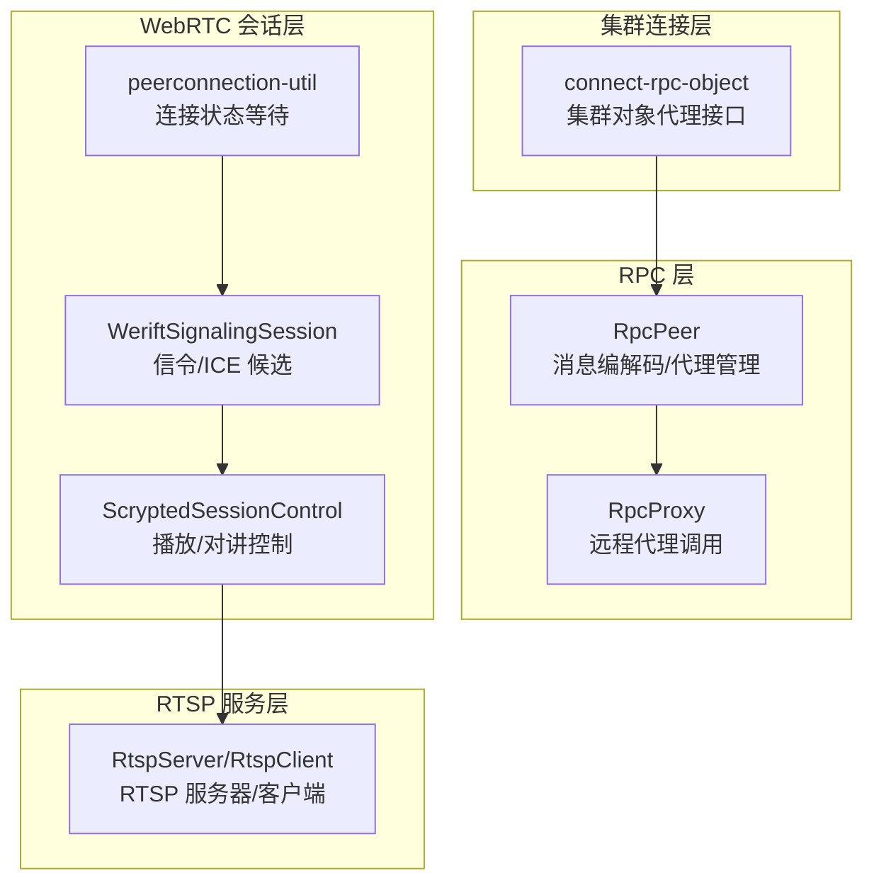
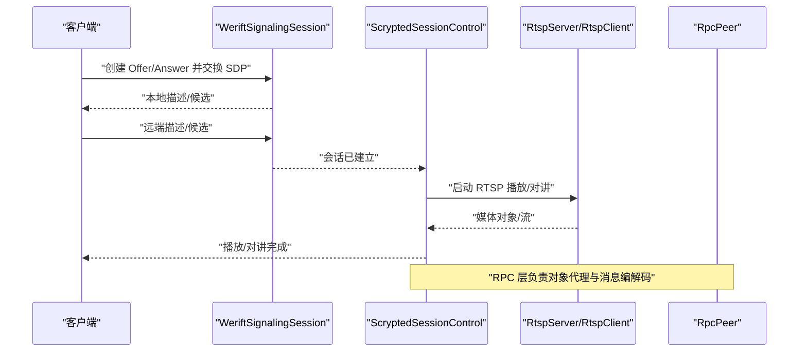
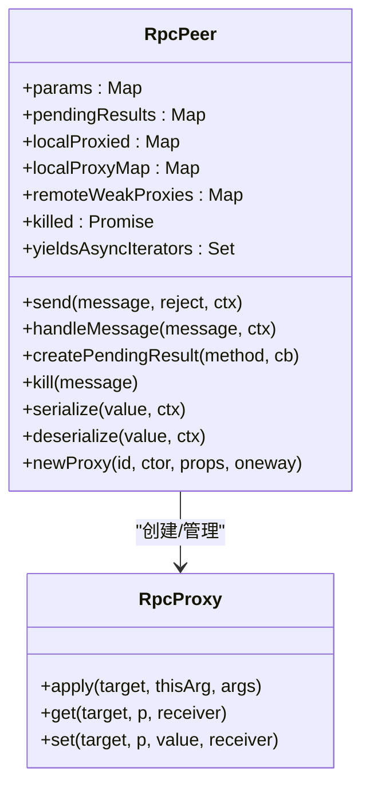
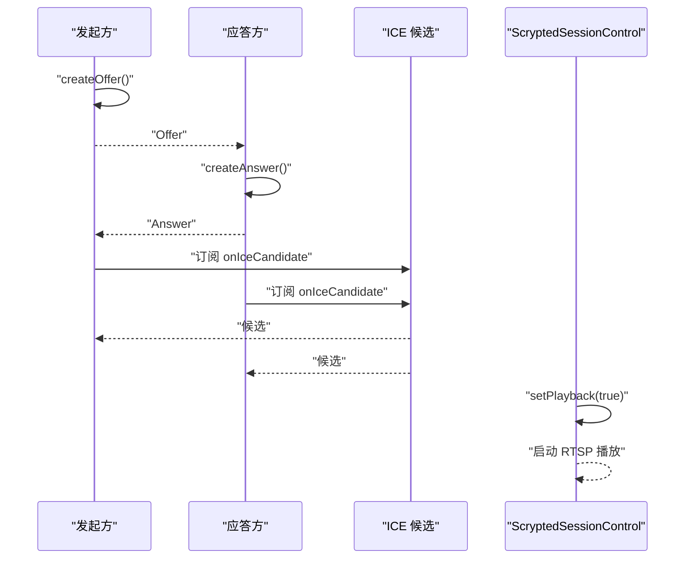
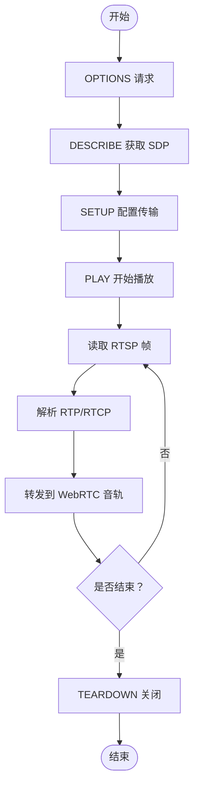
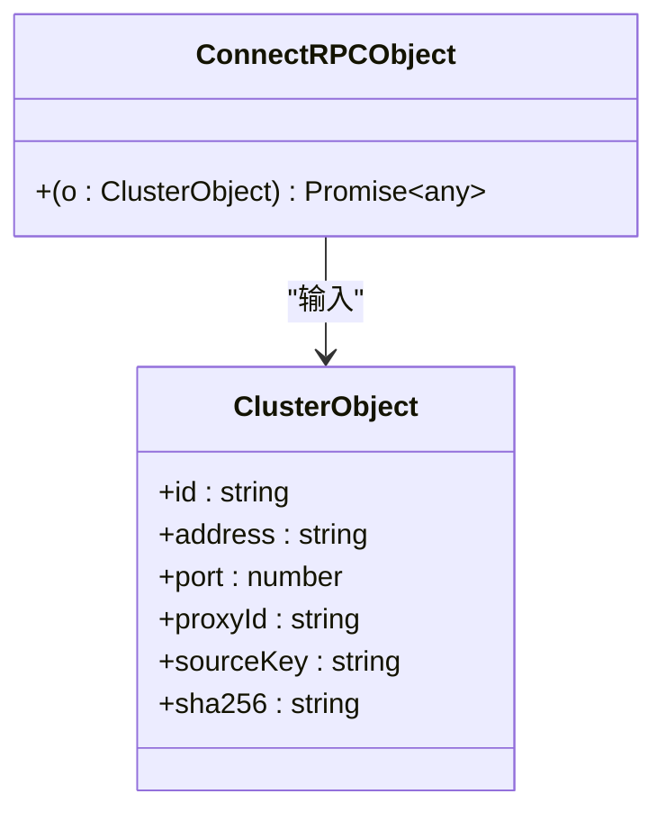
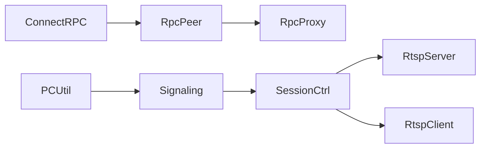

# 连接管理与会话控制

<cite>
**本文引用的文件**
- [server/src/rpc.ts](file://server/src/rpc.ts)
- [packages/rpc/src/rpc.ts](file://packages/rpc/src/rpc.ts)
- [plugins/webrtc/src/session-control.ts](file://plugins/webrtc/src/session-control.ts)
- [plugins/webrtc/src/werift-signaling-session.ts](file://plugins/webrtc/src/werift-signaling-session.ts)
- [plugins/webrtc/src/peerconnection-util.ts](file://plugins/webrtc/src/peerconnection-util.ts)
- [common/src/rtsp-server.ts](file://common/src/rtsp-server.ts)
- [server/src/cluster/connect-rpc-object.ts](file://server/src/cluster/connect-rpc-object.ts)
</cite>

## 目录
1. [简介](#简介)
2. [项目结构](#项目结构)
3. [核心组件](#核心组件)
4. [架构总览](#架构总览)
5. [详细组件分析](#详细组件分析)
6. [依赖关系分析](#依赖关系分析)
7. [性能考量](#性能考量)
8. [故障排查指南](#故障排查指南)
9. [结论](#结论)
10. [附录](#附录)

## 简介
本文件系统性阐述 Scrypted 的连接管理与会话控制机制，覆盖以下主题：
- 连接建立流程：握手协议、认证过程、连接初始化、状态同步
- 会话维护机制：会话标识、状态跟踪、心跳保持、超时检测
- 连接池管理：连接复用、数量限制、空闲清理、资源回收
- 会话控制策略：并发控制、优先级管理、资源分配、负载均衡
- 断线恢复机制：自动重连、状态恢复、数据同步、异常处理
- 会话安全控制：身份验证、权限检查、访问控制、审计日志
- 性能监控指标：连接统计、延迟测量、吞吐量计算、资源使用情况

## 项目结构
围绕连接与会话控制的关键模块分布如下：
- RPC 层：负责跨进程/跨节点的远程对象代理、消息编解码与生命周期管理
- WebRTC 会话层：负责信令协商、ICE 候选收集、媒体播放/对讲控制
- RTSP 服务层：负责 RTSP 推流/拉流、鉴权、SDP 协商与媒体转发
- 集群连接层：负责集群内对象代理的连接与寻址

**图表来源**
- [server/src/rpc.ts:285-839](file://server/src/rpc.ts#L285-L839)
- [plugins/webrtc/src/werift-signaling-session.ts:11-92](file://plugins/webrtc/src/werift-signaling-session.ts#L11-L92)
- [plugins/webrtc/src/session-control.ts:10-120](file://plugins/webrtc/src/session-control.ts#L10-L120)
- [plugins/webrtc/src/peerconnection-util.ts:35-74](file://plugins/webrtc/src/peerconnection-util.ts#L35-L74)
- [common/src/rtsp-server.ts:389-800](file://common/src/rtsp-server.ts#L389-L800)
- [server/src/cluster/connect-rpc-object.ts:1-29](file://server/src/cluster/connect-rpc-object.ts#L1-L29)

**章节来源**
- [server/src/rpc.ts:285-839](file://server/src/rpc.ts#L285-L839)
- [plugins/webrtc/src/session-control.ts:10-120](file://plugins/webrtc/src/session-control.ts#L10-L120)
- [plugins/webrtc/src/werift-signaling-session.ts:11-92](file://plugins/webrtc/src/werift-signaling-session.ts#L11-L92)
- [plugins/webrtc/src/peerconnection-util.ts:35-74](file://plugins/webrtc/src/peerconnection-util.ts#L35-L74)
- [common/src/rtsp-server.ts:389-800](file://common/src/rtsp-server.ts#L389-L800)
- [server/src/cluster/connect-rpc-object.ts:1-29](file://server/src/cluster/connect-rpc-object.ts#L1-L29)

## 核心组件
- RpcPeer：RPC 对等体，负责消息类型定义、参数传递、结果返回、错误序列化、代理对象生命周期管理、终结器发送与回收
- RpcProxy：远程代理拦截器，负责方法调用转发、单向调用处理、异步迭代器支持、属性代理与序列化上下文
- WeriftSignalingSession：WebRTC 信令会话，负责 Offer/Answer 创建、ICE 候选发送、远端描述设置
- ScryptedSessionControl：会话控制实现，负责播放开关、对讲启动/停止、RTSP 播放端口监听与媒体对象创建
- peerconnection-util：PeerConnection 状态等待工具，负责连接/ICE 连接状态变更与关闭流程
- RtspServer/RtspClient：RTSP 服务器/客户端，负责 RTSP 描述、请求/响应、鉴权、数据通道读写与流解析
- connect-rpc-object：集群对象代理接口，用于在集群中定位与连接远端对象

**章节来源**
- [server/src/rpc.ts:285-839](file://server/src/rpc.ts#L285-L839)
- [plugins/webrtc/src/werift-signaling-session.ts:11-92](file://plugins/webrtc/src/werift-signaling-session.ts#L11-L92)
- [plugins/webrtc/src/session-control.ts:10-120](file://plugins/webrtc/src/session-control.ts#L10-L120)
- [plugins/webrtc/src/peerconnection-util.ts:35-74](file://plugins/webrtc/src/peerconnection-util.ts#L35-L74)
- [common/src/rtsp-server.ts:389-800](file://common/src/rtsp-server.ts#L389-L800)
- [server/src/cluster/connect-rpc-object.ts:1-29](file://server/src/cluster/connect-rpc-object.ts#L1-L29)

## 架构总览
下图展示从 WebRTC 信令到媒体播放/对讲的完整链路，以及 RPC 层在集群中的作用。

**图表来源**
- [plugins/webrtc/src/werift-signaling-session.ts:24-64](file://plugins/webrtc/src/werift-signaling-session.ts#L24-L64)
- [plugins/webrtc/src/session-control.ts:25-109](file://plugins/webrtc/src/session-control.ts#L25-L109)
- [common/src/rtsp-server.ts:389-800](file://common/src/rtsp-server.ts#L389-L800)
- [server/src/rpc.ts:697-839](file://server/src/rpc.ts#L697-L839)

## 详细组件分析

### 组件 A：RPC 连接与消息编解码（RpcPeer/RpcProxy）
- 连接建立与握手
  - 通过构造函数注入发送回调，消息类型包括 apply/result/param/finalize
  - 参数获取通过 param 消息与远程 params 映射
- 认证与安全
  - 通过序列化/反序列化上下文进行传输安全判定；非传输安全类型采用代理包装或自定义序列化器
  - 错误统一序列化为远程代理值，携带名称/栈/消息
- 连接初始化与状态同步
  - 生成唯一代理 ID，注册弱引用代理，注册终结器以发送 finalize 消息
  - pendingResults 管理未完成的调用，冻结后拒绝新调用并清理资源
- 会话维护
  - 异步迭代器支持，记录 yieldedAsyncIterators，结束时抛出 StopAsyncIteration
  - 提供 getParam/get 方法，支持远程参数查询
- 断线恢复
  - kill 主动终止所有待处理结果与迭代器，冻结内部状态，防止后续调用
  - finalize 消息用于远端释放本地代理

**图表来源**
- [server/src/rpc.ts:285-839](file://server/src/rpc.ts#L285-L839)
- [packages/rpc/src/rpc.ts:285-839](file://packages/rpc/src/rpc.ts#L285-L839)

**章节来源**
- [server/src/rpc.ts:285-839](file://server/src/rpc.ts#L285-L839)
- [packages/rpc/src/rpc.ts:285-839](file://packages/rpc/src/rpc.ts#L285-L839)

### 组件 B：WebRTC 信令与会话控制（WeriftSignalingSession/ScryptedSessionControl）
- 信令握手
  - Offer/Answer 创建与本地描述设置，ICE 候选订阅并通过回调发送
  - 远端描述设置与候选添加，包含 relay/srflx 候选的延时处理
- 会话控制
  - setPlayback 切换音频播放，等待接收轨道，停止对讲并启动 RTSP 播放
  - 通过本地回环 RTSP 服务器将 RTP 转发至 WebRTC 音轨
  - endSession 触发清理，销毁 RTSP 客户端与对讲
- 连接状态跟踪
  - waitConnected/waitIceConnected 等待连接/ICE 连接状态，失败时抛错并关闭

**图表来源**
- [plugins/webrtc/src/werift-signaling-session.ts:24-64](file://plugins/webrtc/src/werift-signaling-session.ts#L24-L64)
- [plugins/webrtc/src/session-control.ts:25-109](file://plugins/webrtc/src/session-control.ts#L25-L109)
- [plugins/webrtc/src/peerconnection-util.ts:35-66](file://plugins/webrtc/src/peerconnection-util.ts#L35-L66)

**章节来源**
- [plugins/webrtc/src/werift-signaling-session.ts:11-92](file://plugins/webrtc/src/werift-signaling-session.ts#L11-L92)
- [plugins/webrtc/src/session-control.ts:10-120](file://plugins/webrtc/src/session-control.ts#L10-L120)
- [plugins/webrtc/src/peerconnection-util.ts:35-74](file://plugins/webrtc/src/peerconnection-util.ts#L35-L74)

### 组件 C：RTSP 服务器与客户端（RtspServer/RtspClient）
- RTSP 描述与鉴权
  - 支持 Basic/Digest 鉴权，解析 WWW-Authenticate 头并生成 Authorization
  - OPTIONS/DESCRIBE/SETUP/PLAY/TEARDOWN 等标准流程
- 数据通道与流解析
  - TCP 面向帧的读写，RTSP 帧头校验与 RTP/RTCP 分离
  - 流解析器支持 H264/H265 NALU 类型识别与关键帧检测
- 会话控制集成
  - 作为 WebRTC 对讲的上游媒体源，提供 FFmpeg MediaObject

**图表来源**
- [common/src/rtsp-server.ts:389-800](file://common/src/rtsp-server.ts#L389-L800)

**章节来源**
- [common/src/rtsp-server.ts:389-800](file://common/src/rtsp-server.ts#L389-L800)

### 组件 D：集群对象代理与连接（connect-rpc-object）
- ClusterObject 描述远端对象的标识、地址、端口、代理 ID、源键与哈希
- ConnectRPCObject 将 ClusterObject 转换为可调用的远程代理对象，交由 RpcPeer 管理

**图表来源**
- [server/src/cluster/connect-rpc-object.ts:1-29](file://server/src/cluster/connect-rpc-object.ts#L1-L29)

**章节来源**
- [server/src/cluster/connect-rpc-object.ts:1-29](file://server/src/cluster/connect-rpc-object.ts#L1-L29)

## 依赖关系分析
- RpcPeer 依赖 RpcProxy 实现远程方法调用与属性代理
- WebRTC 会话控制依赖 RtspServer/RtspClient 提供媒体通道
- WeriftSignalingSession 依赖 RTCPeerConnection 与 ICE 候选事件
- 集群对象代理通过 ClusterObject 与 ConnectRPCObject 接入 RPC 层

**图表来源**
- [server/src/rpc.ts:285-839](file://server/src/rpc.ts#L285-L839)
- [plugins/webrtc/src/session-control.ts:10-120](file://plugins/webrtc/src/session-control.ts#L10-L120)
- [plugins/webrtc/src/werift-signaling-session.ts:11-92](file://plugins/webrtc/src/werift-signaling-session.ts#L11-L92)
- [plugins/webrtc/src/peerconnection-util.ts:35-74](file://plugins/webrtc/src/peerconnection-util.ts#L35-L74)
- [common/src/rtsp-server.ts:389-800](file://common/src/rtsp-server.ts#L389-L800)
- [server/src/cluster/connect-rpc-object.ts:1-29](file://server/src/cluster/connect-rpc-object.ts#L1-L29)

**章节来源**
- [server/src/rpc.ts:285-839](file://server/src/rpc.ts#L285-L839)
- [plugins/webrtc/src/session-control.ts:10-120](file://plugins/webrtc/src/session-control.ts#L10-L120)
- [plugins/webrtc/src/werift-signaling-session.ts:11-92](file://plugins/webrtc/src/werift-signaling-session.ts#L11-L92)
- [plugins/webrtc/src/peerconnection-util.ts:35-74](file://plugins/webrtc/src/peerconnection-util.ts#L35-L74)
- [common/src/rtsp-server.ts:389-800](file://common/src/rtsp-server.ts#L389-L800)
- [server/src/cluster/connect-rpc-object.ts:1-29](file://server/src/cluster/connect-rpc-object.ts#L1-L29)

## 性能考量
- 连接统计
  - RpcPeer 内部计数器 remotesCreated/remotesCollected 可用于评估代理对象生命周期
  - 建议在监控系统中采集这些计数并结合 pendingResults 数量进行健康度评估
- 延迟测量
  - WebRTC 侧可通过 ICE 连接状态变化与对讲延迟进行端到端测量
  - RTSP 侧可通过请求-响应时间与首包时间评估网络质量
- 吞吐量计算
  - 媒体通道基于 RTP/RTCP，建议按通道维度统计字节/包速率
- 资源使用
  - 代理对象弱引用与终结器确保及时回收；注意避免大对象频繁序列化带来的 GC 压力

[本节为通用指导，无需具体文件来源]

## 故障排查指南
- RPC 调用失败
  - 检查 pendingResults 是否被冻结（peer.kill 被调用）
  - 查看序列化/反序列化上下文是否导致传输不安全类型被拒绝
- WebRTC 无法建立
  - 确认 ICE 候选是否正确发送/接收，relay/srflx 候选延时逻辑是否触发
  - 使用 peerconnection-util 的状态等待函数定位连接失败点
- RTSP 鉴权失败
  - 核对 Basic/Digest 参数与 nonce，确认 URL 中用户名/密码编码
  - 检查 OPTIONS 返回的 Public 头决定 GET_PARAMETER 可用性
- 会话异常中断
  - 检查 finalize 消息是否正常发送，避免悬挂代理
  - 在 endSession 中确保 RTSP 客户端与对讲资源释放

**章节来源**
- [server/src/rpc.ts:439-456](file://server/src/rpc.ts#L439-L456)
- [plugins/webrtc/src/werift-signaling-session.ts:67-91](file://plugins/webrtc/src/werift-signaling-session.ts#L67-L91)
- [plugins/webrtc/src/peerconnection-util.ts:35-74](file://plugins/webrtc/src/peerconnection-util.ts#L35-L74)
- [common/src/rtsp-server.ts:684-736](file://common/src/rtsp-server.ts#L684-L736)
- [plugins/webrtc/src/session-control.ts:116-119](file://plugins/webrtc/src/session-control.ts#L116-L119)

## 结论
Scrypted 的连接与会话控制以 RPC 为核心，结合 WebRTC 与 RTSP 形成完整的媒体链路。通过代理对象管理、信令协商、状态跟踪与资源回收，系统实现了可靠的跨进程/跨节点通信与媒体会话控制。建议在生产环境中配合监控指标与告警策略，持续优化连接稳定性与性能表现。

[本节为总结，无需具体文件来源]

## 附录
- 术语
  - 代理对象：通过 RpcPeer 生成的可远程调用对象
  - 单向方法：oneway 标记的方法，不期望返回结果
  - 终结器：代理对象生命周期结束时发送的 finalize 消息
- 最佳实践
  - 合理设置 pendingResults 超时，避免长时间挂起
  - 在集群场景中使用 ClusterObject 唯一标识远端对象
  - 对媒体通道进行带宽与格式协商，减少不必要的转码

[本节为补充信息，无需具体文件来源]