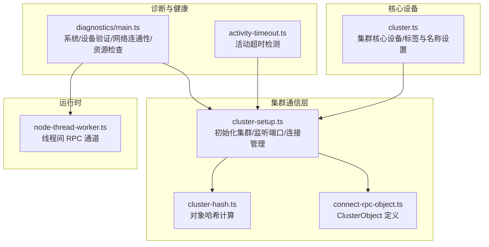
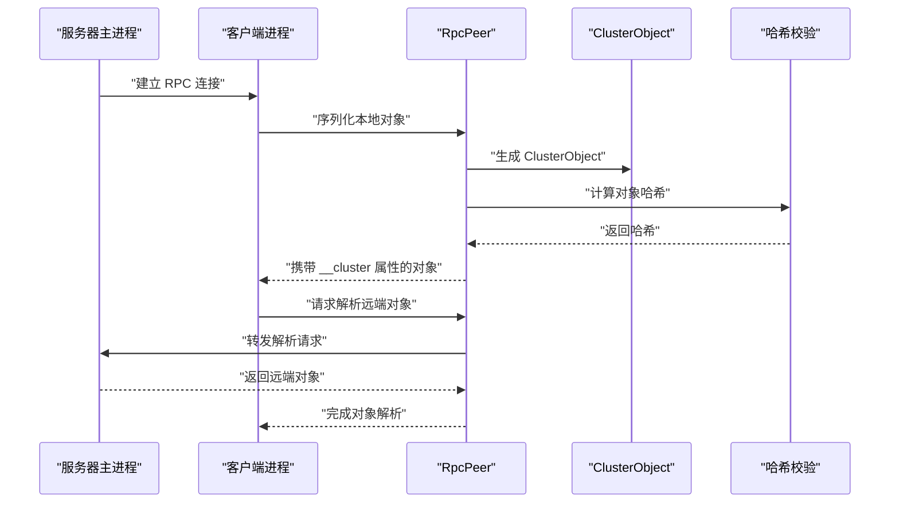
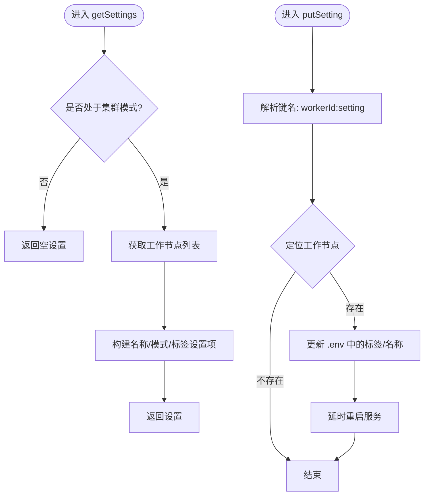
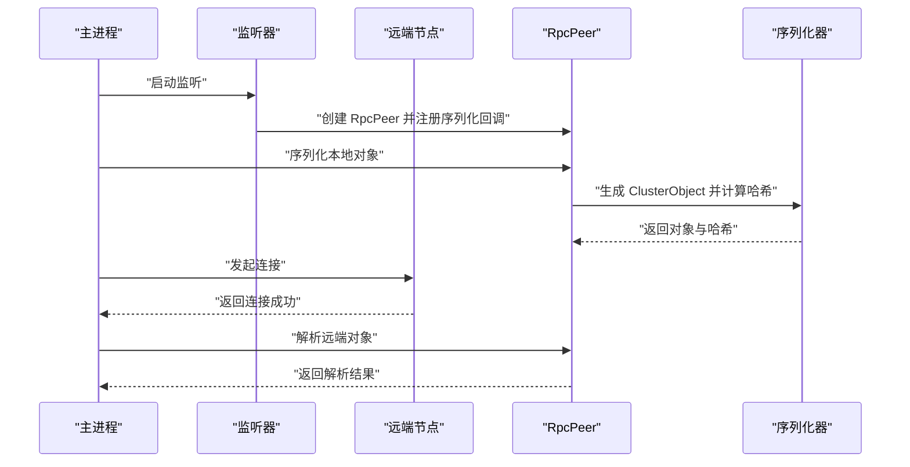
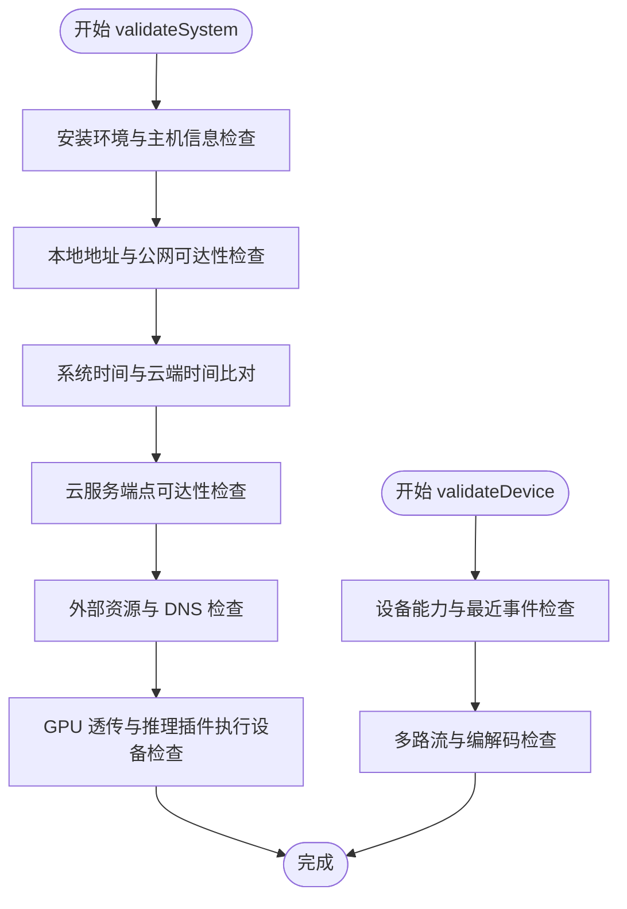
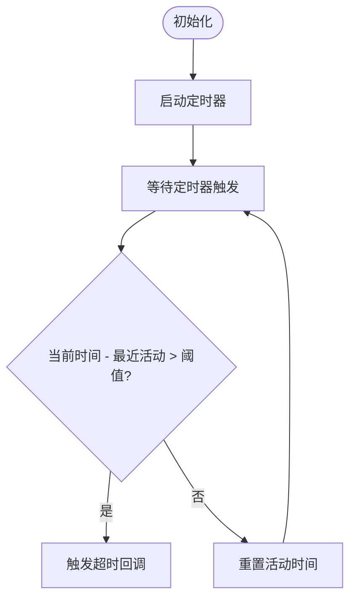
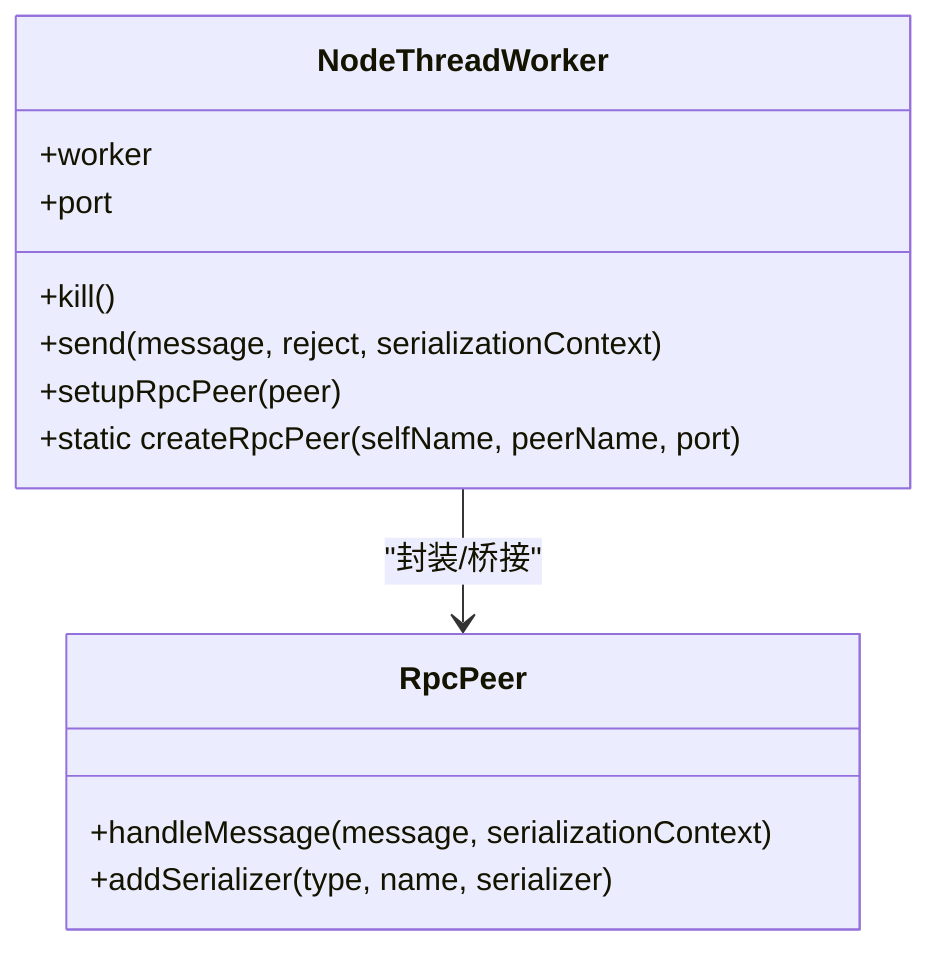
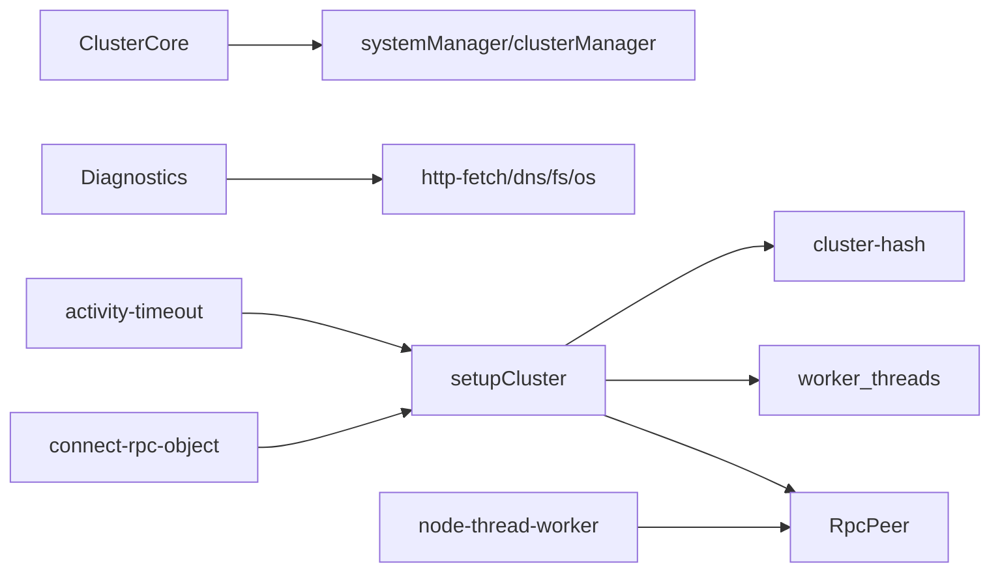

# 节点健康监控

<cite>
**本文引用的文件**
- [plugins/core/src/cluster.ts](file://plugins/core/src/cluster.ts)
- [server/src/cluster/cluster-setup.ts](file://server/src/cluster/cluster-setup.ts)
- [server/src/cluster/connect-rpc-object.ts](file://server/src/cluster/connect-rpc-object.ts)
- [server/src/cluster/cluster-hash.ts](file://server/src/cluster/cluster-hash.ts)
- [plugins/diagnostics/src/main.ts](file://plugins/diagnostics/src/main.ts)
- [common/src/activity-timeout.ts](file://common/src/activity-timeout.ts)
- [server/src/plugin/runtime/node-thread-worker.ts](file://server/src/plugin/runtime/node-thread-worker.ts)
</cite>

## 目录
1. [简介](#简介)
2. [项目结构](#项目结构)
3. [核心组件](#核心组件)
4. [架构总览](#架构总览)
5. [详细组件分析](#详细组件分析)
6. [依赖关系分析](#依赖关系分析)
7. [性能考量](#性能考量)
8. [故障排查指南](#故障排查指南)
9. [结论](#结论)
10. [附录](#附录)

## 简介
本指南面向 Scrypted 集群节点健康监控系统，聚焦以下目标：
- 健康检查机制：节点状态检测、连接质量评估、响应时间测量
- 性能指标监控：CPU 使用率、内存占用、网络带宽、磁盘 I/O
- 状态报告机制：心跳包格式、状态更新频率、异常状态上报
- 异常检测算法：超时检测、错误计数、服务可用性判断
- 监控配置选项：监控间隔设置、阈值配置、告警规则定义
- 监控数据收集：指标采集、数据聚合、历史数据存储
- 监控告警处理：告警触发条件、通知机制、自动恢复策略
- 监控工具使用：CLI 命令、API 接口、可视化界面操作

说明：
- 当前仓库中未发现直接的“节点健康监控”专用模块或内置指标采集器。
- 本指南基于现有集群通信、RPC 对象连接、诊断插件与活动超时等能力，给出可落地的监控方案与最佳实践。

## 项目结构
Scrypted 的集群模式通过 RPC 对象跨进程/跨线程转发，结合环境变量与端口监听实现节点间通信；诊断插件提供系统级连通性与资源验证能力；活动超时工具用于会话空闲检测；Node 线程工作器负责线程间 RPC 通道。

图示来源
- [server/src/cluster/cluster-setup.ts:38-399](file://server/src/cluster/cluster-setup.ts#L38-L399)
- [server/src/cluster/connect-rpc-object.ts:1-29](file://server/src/cluster/connect-rpc-object.ts#L1-L29)
- [server/src/cluster/cluster-hash.ts:1-8](file://server/src/cluster/cluster-hash.ts#L1-L8)
- [plugins/core/src/cluster.ts:1-163](file://plugins/core/src/cluster.ts#L1-L163)
- [plugins/diagnostics/src/main.ts:1-775](file://plugins/diagnostics/src/main.ts#L1-L775)
- [common/src/activity-timeout.ts:1-29](file://common/src/activity-timeout.ts#L1-L29)
- [server/src/plugin/runtime/node-thread-worker.ts:1-151](file://server/src/plugin/runtime/node-thread-worker.ts#L1-L151)

章节来源
- [server/src/cluster/cluster-setup.ts:1-498](file://server/src/cluster/cluster-setup.ts#L1-L498)
- [plugins/core/src/cluster.ts:1-163](file://plugins/core/src/cluster.ts#L1-L163)
- [plugins/diagnostics/src/main.ts:1-775](file://plugins/diagnostics/src/main.ts#L1-L775)
- [common/src/activity-timeout.ts:1-29](file://common/src/activity-timeout.ts#L1-L29)
- [server/src/plugin/runtime/node-thread-worker.ts:1-151](file://server/src/plugin/runtime/node-thread-worker.ts#L1-L151)

## 核心组件
- 集群核心设备（ClusterCore）
  - 提供集群工作节点的标签与名称设置，支持通过 .env 更新并触发工作节点重启。
  - 用于在 UI 中对工作节点进行分组与标记，便于按角色（存储/计算/加速）调度与监控。
- 集群初始化与连接（setupCluster）
  - 解析集群模式与地址，建立本地监听或客户端连接，维护 RpcPeer 映射与对象序列化。
  - 支持线程间 IPC 连接与远程 RPC 对象解析，确保跨节点对象访问的安全性与一致性。
- ClusterObject 与哈希校验
  - 通过对象属性与密钥生成哈希，防止对象伪造与中间人攻击。
- 诊断插件（Diagnostics）
  - 提供系统验证、设备验证、网络连通性、时间同步、资源与 GPU 加速验证等能力，可作为健康检查的参考实现。
- 活动超时（Activity Timeout）
  - 基于定时器检测会话空闲，可用于心跳/活跃度判定。
- 线程间 RPC（Node Thread Worker）
  - 通过 MessagePort 实现线程间高效通信，支持缓冲区转移，保障高吞吐场景下的性能。

章节来源
- [plugins/core/src/cluster.ts:27-101](file://plugins/core/src/cluster.ts#L27-L101)
- [server/src/cluster/cluster-setup.ts:38-399](file://server/src/cluster/cluster-setup.ts#L38-L399)
- [server/src/cluster/connect-rpc-object.ts:1-29](file://server/src/cluster/connect-rpc-object.ts#L1-L29)
- [server/src/cluster/cluster-hash.ts:4-7](file://server/src/cluster/cluster-hash.ts#L4-L7)
- [plugins/diagnostics/src/main.ts:25-101](file://plugins/diagnostics/src/main.ts#L25-L101)
- [common/src/activity-timeout.ts:1-29](file://common/src/activity-timeout.ts#L1-L29)
- [server/src/plugin/runtime/node-thread-worker.ts:47-151](file://server/src/plugin/runtime/node-thread-worker.ts#L47-L151)

## 架构总览
下图展示集群节点健康监控的关键交互路径：对象序列化与哈希校验、连接建立与对象解析、线程间通信、以及诊断与超时检测如何协同工作。

图示来源
- [server/src/cluster/cluster-setup.ts:28-300](file://server/src/cluster/cluster-setup.ts#L28-L300)
- [server/src/cluster/cluster-hash.ts:4-7](file://server/src/cluster/cluster-hash.ts#L4-L7)
- [server/src/cluster/connect-rpc-object.ts:1-29](file://server/src/cluster/connect-rpc-object.ts#L1-L29)

## 详细组件分析

### 组件一：集群核心设备（ClusterCore）
职责与行为
- 列出当前集群工作节点，展示名称、模式与标签。
- 允许修改工作节点标签与名称，写入 .env 并触发对应工作节点重启。
- 通过系统组件获取环境控制与服务控制，实现非侵入式配置变更。

关键流程
- 获取设置：读取集群模式与工作节点列表，拼装设置项。
- 写入设置：解析键名，定位工作节点，更新 .env 中的标签或名称，延时后重启服务。

图示来源
- [plugins/core/src/cluster.ts:27-155](file://plugins/core/src/cluster.ts#L27-L155)

章节来源
- [plugins/core/src/cluster.ts:1-163](file://plugins/core/src/cluster.ts#L1-L163)

### 组件二：集群初始化与连接（setupCluster）
职责与行为
- 初始化集群参数（ID、密钥、工作节点 ID），监听指定地址与端口。
- 维护连接映射，支持客户端/服务端模式，处理源地址匹配与错误清理。
- 序列化代理对象，生成稳定的 proxyId，并计算哈希以保证对象完整性。
- 支持线程间 IPC 连接，建立 MessagePort 通道，实现高性能对象转发。

关键流程
- 初始化集群：根据模式与环境变量确定监听地址与端口，注册回调处理新连接。
- 对象序列化：为每个本地代理对象生成 ClusterObject，并计算哈希。
- 连接对象解析：若目标在同一节点，直接返回本地对象；否则通过 RpcPeer 转发到远端节点。

图示来源
- [server/src/cluster/cluster-setup.ts:38-399](file://server/src/cluster/cluster-setup.ts#L38-L399)
- [server/src/cluster/cluster-hash.ts:4-7](file://server/src/cluster/cluster-hash.ts#L4-L7)
- [server/src/cluster/connect-rpc-object.ts:1-29](file://server/src/cluster/connect-rpc-object.ts#L1-L29)

章节来源
- [server/src/cluster/cluster-setup.ts:1-498](file://server/src/cluster/cluster-setup.ts#L1-L498)
- [server/src/cluster/cluster-hash.ts:1-8](file://server/src/cluster/cluster-hash.ts#L1-L8)
- [server/src/cluster/connect-rpc-object.ts:1-29](file://server/src/cluster/connect-rpc-object.ts#L1-L29)

### 组件三：诊断插件（Diagnostics）
职责与行为
- 系统验证：安装环境、主机 OS、公网/内网地址、系统时间、云服务可达性、CPU/内存、GPU 设备透传、外部资源访问与 DNS。
- 设备验证：摄像头/门铃/通知设备的能力与最近事件检测、快照与多路流验证、音频编解码建议。
- NVR 与推理插件验证：ONNX/OpenVINO/CoreML/NCNN/TensorFlow Lite 的执行设备与 CLIP 能力测试。

图示来源
- [plugins/diagnostics/src/main.ts:386-771](file://plugins/diagnostics/src/main.ts#L386-L771)
- [plugins/diagnostics/src/main.ts:177-384](file://plugins/diagnostics/src/main.ts#L177-L384)

章节来源
- [plugins/diagnostics/src/main.ts:1-775](file://plugins/diagnostics/src/main.ts#L1-L775)

### 组件四：活动超时（Activity Timeout）
职责与行为
- 维护一个定时器，记录最近活动时间；当超过设定阈值未重置时，触发回调。
- 可用于心跳/会话活跃度检测，作为健康状态的简单判定依据之一。

图示来源
- [common/src/activity-timeout.ts:1-29](file://common/src/activity-timeout.ts#L1-L29)

章节来源
- [common/src/activity-timeout.ts:1-29](file://common/src/activity-timeout.ts#L1-L29)

### 组件五：线程间 RPC（Node Thread Worker）
职责与行为
- 通过 MessagePort 在主线程与工作线程之间传递消息，支持缓冲区转移以降低拷贝开销。
- 封装 RpcPeer 的发送与接收逻辑，提供线程安全的 RPC 通道。

图示来源
- [server/src/plugin/runtime/node-thread-worker.ts:47-151](file://server/src/plugin/runtime/node-thread-worker.ts#L47-L151)

章节来源
- [server/src/plugin/runtime/node-thread-worker.ts:1-151](file://server/src/plugin/runtime/node-thread-worker.ts#L1-L151)

## 依赖关系分析
- ClusterCore 依赖系统组件（clusterManager/systemManager）以读取/写入集群工作节点信息。
- setupCluster 依赖 RpcPeer、网络监听、worker_threads，负责对象序列化与连接管理。
- connect-rpc-object.ts 与 cluster-hash.ts 为对象完整性与安全提供基础。
- diagnostics 插件依赖 http-fetch、dns、fs、os 等模块进行系统与网络验证。
- activity-timeout 为会话活跃度提供通用检测能力。
- node-thread-worker 为线程间通信提供高性能通道。

图示来源
- [plugins/core/src/cluster.ts:1-163](file://plugins/core/src/cluster.ts#L1-L163)
- [server/src/cluster/cluster-setup.ts:1-498](file://server/src/cluster/cluster-setup.ts#L1-L498)
- [server/src/cluster/connect-rpc-object.ts:1-29](file://server/src/cluster/connect-rpc-object.ts#L1-L29)
- [server/src/cluster/cluster-hash.ts:1-8](file://server/src/cluster/cluster-hash.ts#L1-L8)
- [plugins/diagnostics/src/main.ts:1-775](file://plugins/diagnostics/src/main.ts#L1-L775)
- [common/src/activity-timeout.ts:1-29](file://common/src/activity-timeout.ts#L1-L29)
- [server/src/plugin/runtime/node-thread-worker.ts:1-151](file://server/src/plugin/runtime/node-thread-worker.ts#L1-L151)

章节来源
- [plugins/core/src/cluster.ts:1-163](file://plugins/core/src/cluster.ts#L1-L163)
- [server/src/cluster/cluster-setup.ts:1-498](file://server/src/cluster/cluster-setup.ts#L1-L498)
- [plugins/diagnostics/src/main.ts:1-775](file://plugins/diagnostics/src/main.ts#L1-L775)
- [common/src/activity-timeout.ts:1-29](file://common/src/activity-timeout.ts#L1-L29)
- [server/src/plugin/runtime/node-thread-worker.ts:1-151](file://server/src/plugin/runtime/node-thread-worker.ts#L1-L151)

## 性能考量
- 对象序列化与哈希
  - 通过稳定的 proxyId 与哈希校验减少重复传输与中间人风险，但需注意哈希计算的 CPU 开销。
- 线程间通信
  - 使用 MessagePort 与缓冲区转移可显著降低拷贝成本，适合高吞吐场景。
- 连接管理
  - 复用 RpcPeer 与连接池，避免频繁建立/销毁连接带来的延迟与资源消耗。
- 诊断验证
  - 系统验证涉及网络请求与外部资源访问，建议异步执行并设置合理超时，避免阻塞主流程。

[本节为通用指导，不直接分析具体文件]

## 故障排查指南
- 集群连接失败
  - 检查环境变量（模式、地址、端口、密钥）是否正确设置。
  - 确认监听地址与回环地址绑定是否一致，避免源地址不匹配警告。
- 对象解析失败
  - 核对 ClusterObject 的哈希是否与本地计算一致，排除密钥不匹配问题。
- 工作节点标签/名称更新无效
  - 确认 .env 更新成功且服务已重启；检查标签集合中的保留项不可更改。
- 诊断验证失败
  - 关注系统时间偏差、公网/内网地址缺失、云服务端点不可达、外部资源 DNS 阻断等问题。
- 会话无响应
  - 使用活动超时检测定位长时间未重置的会话，结合日志定位问题根因。

章节来源
- [server/src/cluster/cluster-setup.ts:403-462](file://server/src/cluster/cluster-setup.ts#L403-L462)
- [server/src/cluster/cluster-hash.ts:4-7](file://server/src/cluster/cluster-hash.ts#L4-L7)
- [plugins/core/src/cluster.ts:103-155](file://plugins/core/src/cluster.ts#L103-L155)
- [plugins/diagnostics/src/main.ts:435-453](file://plugins/diagnostics/src/main.ts#L435-L453)
- [common/src/activity-timeout.ts:1-29](file://common/src/activity-timeout.ts#L1-L29)

## 结论
- 当前仓库未提供内置的节点健康监控与指标采集模块，但通过集群 RPC 对象、线程间通信、活动超时与诊断插件，可以构建一套完整的健康监控体系。
- 建议以 ClusterCore 的标签与名称管理为基础，结合 setupCluster 的连接与对象解析能力，配合 diagnostics 的系统/设备验证与 activity-timeout 的活跃度检测，形成可扩展的监控方案。
- 对于性能指标（CPU/内存/网络/磁盘 I/O），可在现有能力之上引入外部采集器或自定义插件，统一上报与告警。

[本节为总结性内容，不直接分析具体文件]

## 附录

### 健康检查机制设计要点
- 节点状态检测
  - 基于 RpcPeer 连接存活与对象解析成功率判定节点可用性。
  - 使用活动超时检测会话活跃度，辅助判断节点是否卡死或阻塞。
- 连接质量评估
  - 记录连接建立耗时、对象解析往返时间、RPC 调用延迟分布。
  - 监控连接断开次数与重连频率，识别网络抖动或节点不稳定。
- 响应时间测量
  - 在关键 RPC 路径埋点，统计 P50/P95 延迟，结合错误率形成 SLA 指标。

[本节为概念性内容，不直接分析具体文件]

### 性能指标监控建议
- CPU 使用率：通过系统采样与进程级采样对比，识别热点线程与阻塞点。
- 内存占用：关注堆外内存与共享缓冲区，结合 GC 行为分析内存泄漏风险。
- 网络带宽：统计入/出站字节数与连接并发数，识别带宽瓶颈。
- 磁盘 I/O：监控读写延迟与队列长度，结合缓存命中率优化。

[本节为通用指导，不直接分析具体文件]

### 状态报告机制
- 心跳包格式
  - 包含节点标识、时间戳、运行时摘要（版本、插件数量、线程数）、健康状态（正常/警告/异常）。
- 状态更新频率
  - 建议 10-30 秒一次，避免过于频繁导致额外开销。
- 异常状态上报
  - 超时/断连/解析失败/资源不足等异常需立即上报并记录上下文日志。

[本节为通用指导，不直接分析具体文件]

### 异常检测算法
- 超时检测：基于活动超时与 RPC 调用超时阈值，区分瞬时抖动与持续故障。
- 错误计数：窗口期内错误请求数超过阈值触发告警。
- 服务可用性判断：综合连接成功率、解析成功率、平均响应时间与错误率。

[本节为通用指导，不直接分析具体文件]

### 监控配置选项
- 监控间隔：心跳/指标采样间隔、诊断验证周期。
- 阈值配置：超时阈值、错误率阈值、资源使用阈值。
- 告警规则：基于异常检测算法的规则表达式与收敛策略。

[本节为通用指导，不直接分析具体文件]

### 监控数据收集与存储
- 指标采集：在关键 RPC 路径与系统调用处埋点，采用批量上报与压缩传输。
- 数据聚合：按节点/时间窗口聚合，生成趋势与统计指标。
- 历史数据存储：建议采用时序数据库或分层存储，平衡查询性能与成本。

[本节为通用指导，不直接分析具体文件]

### 监控告警处理
- 告警触发条件：阈值越界、连续异常、可用性下降。
- 通知机制：邮件/IM/Webhook，区分严重/一般/恢复通知。
- 自动恢复策略：重试、降级、隔离、重启工作节点。

[本节为通用指导，不直接分析具体文件]

### 监控工具使用指南
- CLI 命令
  - 通过系统组件接口列出/更新工作节点标签与名称，结合 .env 管理实现配置下发。
- API 接口
  - 使用集群 RPC 对象进行节点状态查询与对象解析测试。
- 可视化界面
  - 在集群核心设备页面查看与编辑工作节点标签，观察诊断插件的验证结果与建议。

章节来源
- [plugins/core/src/cluster.ts:27-101](file://plugins/core/src/cluster.ts#L27-L101)
- [plugins/diagnostics/src/main.ts:26-53](file://plugins/diagnostics/src/main.ts#L26-L53)