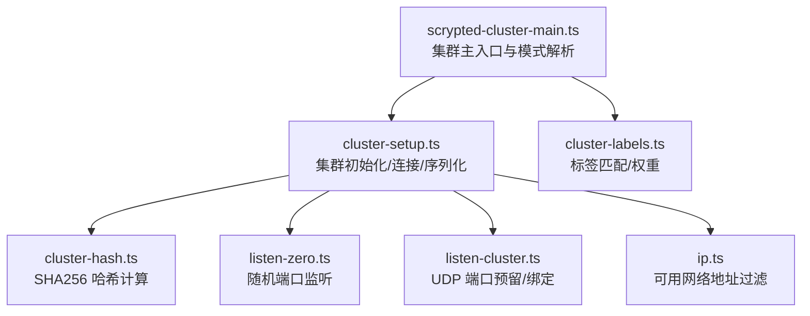
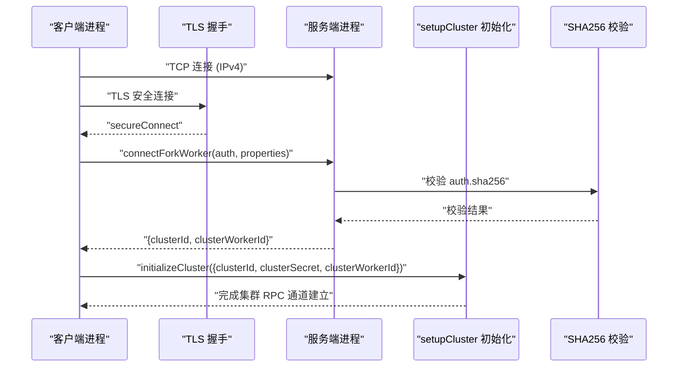
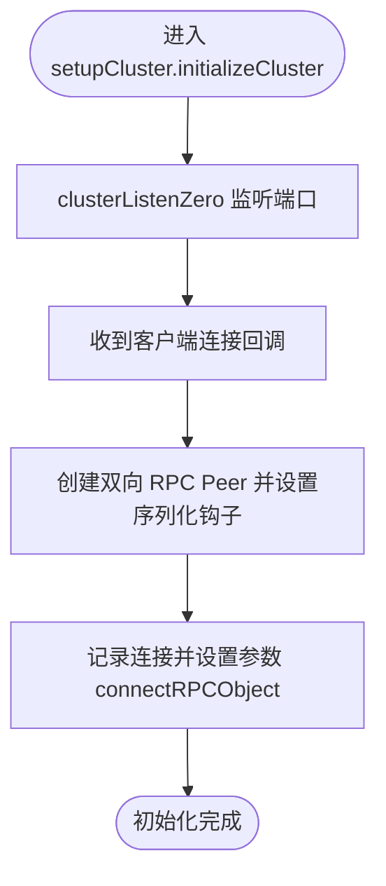
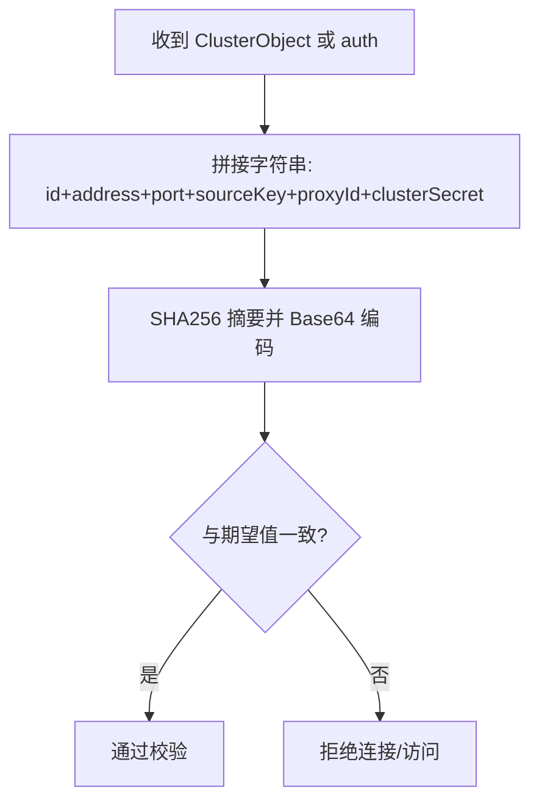
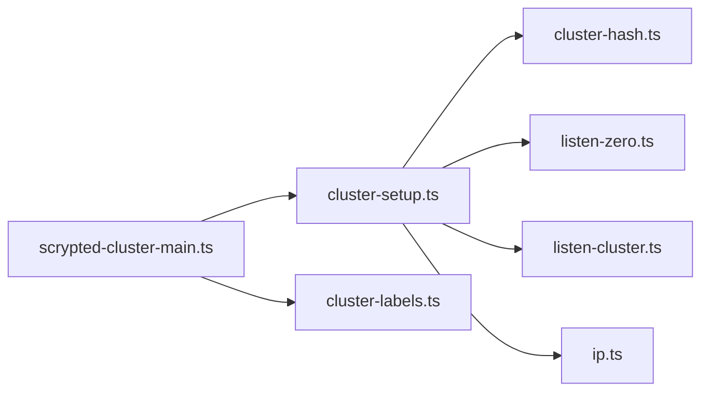

# 节点注册与发现

<cite>
**本文引用的文件**
- [server/src/cluster/cluster-setup.ts](file://server/src/cluster/cluster-setup.ts)
- [server/src/cluster/cluster-hash.ts](file://server/src/cluster/cluster-hash.ts)
- [server/src/cluster/cluster-labels.ts](file://server/src/cluster/cluster-labels.ts)
- [common/src/listen-cluster.ts](file://common/src/listen-cluster.ts)
- [server/src/listen-zero.ts](file://server/src/listen-zero.ts)
- [server/src/ip.ts](file://server/src/ip.ts)
- [server/src/scrypted-cluster-main.ts](file://server/src/scrypted-cluster-main.ts)
</cite>

## 目录
1. [简介](#简介)
2. [项目结构](#项目结构)
3. [核心组件](#核心组件)
4. [架构总览](#架构总览)
5. [详细组件分析](#详细组件分析)
6. [依赖关系分析](#依赖关系分析)
7. [性能考量](#性能考量)
8. [故障排查指南](#故障排查指南)
9. [结论](#结论)
10. [附录：配置示例与最佳实践](#附录配置示例与最佳实践)

## 简介
本文件面向 Scrypted 集群节点的注册与发现机制，系统化阐述以下主题：
- 节点注册流程：节点信息收集、集群标识生成、密钥验证机制
- 自动发现机制：网络扫描策略、地址解析、端口绑定过程
- 节点标识系统：clusterId 生成算法、clusterSecret 验证、proxyId 稳定性保证
- 节点哈希计算：computeClusterObjectHash 的实现、SHA256 校验与安全要点
- 注册配置示例：环境变量设置、地址格式要求、端口选择策略
- 常见问题排查：地址冲突、端口占用、认证失败的定位与修复

## 项目结构
围绕集群注册与发现的关键代码分布在以下模块：
- 集群主入口与模式解析：server/src/scrypted-cluster-main.ts
- 集群初始化与连接管理：server/src/cluster/cluster-setup.ts
- 集群对象哈希计算：server/src/cluster/cluster-hash.ts
- 标签匹配与权重：server/src/cluster/cluster-labels.ts
- 端口绑定与零配置监听：server/src/listen-zero.ts、common/src/listen-cluster.ts
- 可用网络地址过滤：server/src/ip.ts

图表来源
- [server/src/scrypted-cluster-main.ts:213-330](file://server/src/scrypted-cluster-main.ts#L213-L330)
- [server/src/cluster/cluster-setup.ts:38-399](file://server/src/cluster/cluster-setup.ts#L38-L399)
- [server/src/cluster/cluster-hash.ts:4-7](file://server/src/cluster/cluster-hash.ts#L4-L7)
- [server/src/cluster/cluster-labels.ts:37-57](file://server/src/cluster/cluster-labels.ts#L37-L57)
- [server/src/listen-zero.ts:11-15](file://server/src/listen-zero.ts#L11-L15)
- [common/src/listen-cluster.ts:22-30](file://common/src/listen-cluster.ts#L22-L30)
- [server/src/ip.ts:67-106](file://server/src/ip.ts#L67-L106)

章节来源
- [server/src/scrypted-cluster-main.ts:213-330](file://server/src/scrypted-cluster-main.ts#L213-L330)
- [server/src/cluster/cluster-setup.ts:38-399](file://server/src/cluster/cluster-setup.ts#L38-L399)
- [server/src/cluster/cluster-hash.ts:4-7](file://server/src/cluster/cluster-hash.ts#L4-L7)
- [server/src/cluster/cluster-labels.ts:37-57](file://server/src/cluster/cluster-labels.ts#L37-L57)
- [server/src/listen-zero.ts:11-15](file://server/src/listen-zero.ts#L11-L15)
- [common/src/listen-cluster.ts:22-30](file://common/src/listen-cluster.ts#L22-L30)
- [server/src/ip.ts:67-106](file://server/src/ip.ts#L67-L106)

## 核心组件
- 集群模式与参数解析：负责读取并校验环境变量，决定“server/client”模式、默认端口、地址来源与合法性检查。
- 集群初始化与连接：在 server 模式下监听指定地址/端口；在 client 模式下发起 TLS 连接并完成认证。
- 对象序列化与代理 ID：为本地对象生成稳定的 proxyId，并附带 cluster 元数据与 SHA256 校验。
- 密钥验证：通过 computeClusterObjectHash 校验客户端提交的 cluster 对象完整性与真实性。
- 网络地址与端口：提供可用网络地址过滤、随机端口监听、UDP 端口预留等能力。

章节来源
- [server/src/scrypted-cluster-main.ts:403-462](file://server/src/scrypted-cluster-main.ts#L403-L462)
- [server/src/cluster/cluster-setup.ts:336-399](file://server/src/cluster/cluster-setup.ts#L336-L399)
- [server/src/cluster/cluster-hash.ts:4-7](file://server/src/cluster/cluster-hash.ts#L4-L7)
- [server/src/cluster/cluster-labels.ts:37-57](file://server/src/cluster/cluster-labels.ts#L37-L57)
- [server/src/listen-zero.ts:11-15](file://server/src/listen-zero.ts#L11-L15)
- [common/src/listen-cluster.ts:22-30](file://common/src/listen-cluster.ts#L22-L30)

## 架构总览
下图展示了从客户端发起连接到服务端完成认证与初始化的完整流程，以及对象序列化与跨节点访问的路径。

图表来源
- [server/src/scrypted-cluster-main.ts:242-329](file://server/src/scrypted-cluster-main.ts#L242-L329)
- [server/src/scrypted-cluster-main.ts:360-404](file://server/src/scrypted-cluster-main.ts#L360-L404)
- [server/src/cluster/cluster-setup.ts:336-399](file://server/src/cluster/cluster-setup.ts#L336-L399)
- [server/src/cluster/cluster-hash.ts:4-7](file://server/src/cluster/cluster-hash.ts#L4-L7)

## 详细组件分析

### 组件一：集群模式与参数解析（getScryptedClusterMode）
- 功能概述
  - 解析 SCRYPTED_CLUSTER_MODE、SCRYPTED_CLUSTER_SERVER、SCRYPTED_CLUSTER_ADDRESS、SCRYPTED_CLUSTER_SECRET 等环境变量。
  - 校验模式合法性与必填项，对 server/client 场景分别进行地址/端口约束。
  - 在 server 模式下解析接口名或 IP，确保 SCRYPTED_CLUSTER_ADDRESS 为有效 IPv4 地址。
- 关键行为
  - client 模式：必须提供 server:port，允许主机名；不强制要求 SCRYPTED_CLUSTER_ADDRESS。
  - server 模式：不允许同时使用 SCRYPTED_CLUSTER_ADDRESS 与 SCRYPTED_CLUSTER_SERVER 的冲突值；若传入接口名则解析为具体 IPv4 地址。
  - 默认端口：未显式提供时使用固定端口。
- 错误处理
  - 缺少必要变量时报错；非法模式值报错；server 场景地址冲突报错。

章节来源
- [server/src/scrypted-cluster-main.ts:403-462](file://server/src/scrypted-cluster-main.ts#L403-L462)

### 组件二：集群初始化与连接（setupCluster）
- 功能概述
  - 在 server 端监听集群端口，支持同时绑定到指定地址与 127.0.0.1，解决容器/主机网络互通问题。
  - 在 client 端发起 TLS 连接，获取本地地址并写回 SCRYPTED_CLUSTER_ADDRESS。
  - 统一处理对象序列化、代理 ID 稳定性、跨节点对象访问与 IPC 对象桥接。
- 关键流程
  - 对象序列化：生成稳定 proxyId，注入 __cluster 元数据，计算并缓存 sha256。
  - 远端对象访问：优先尝试 IPC（同机多线程），否则通过 TCP/TLS 连接。
  - 认证与校验：connectClusterObject 使用 computeClusterObjectHash 校验远端对象元数据。
- 端口绑定策略
  - 若 SCRYPTED_CLUSTER_ADDRESS 为空或为回环地址，则仅监听 127.0.0.1。
  - 否则尝试在同一端口同时绑定到 SCRYPTED_CLUSTER_ADDRESS 与 127.0.0.1，失败重试若干次。

图表来源
- [server/src/cluster/cluster-setup.ts:349-383](file://server/src/cluster/cluster-setup.ts#L349-L383)
- [server/src/cluster/cluster-setup.ts:464-497](file://server/src/cluster/cluster-setup.ts#L464-L497)

章节来源
- [server/src/cluster/cluster-setup.ts:336-399](file://server/src/cluster/cluster-setup.ts#L336-L399)
- [server/src/cluster/cluster-setup.ts:464-497](file://server/src/cluster/cluster-setup.ts#L464-L497)

### 组件三：对象序列化与代理 ID（onProxySerialization）
- 功能概述
  - 为本地对象生成全局稳定的 proxyId，确保同一对象在不同节点间一致。
  - 将 cluster 元数据（id/address/port/proxyId/sourceKey/sha256）注入对象属性。
  - 在 server 端与 client 端分别使用各自的 sourceKey，避免跨节点竞态。
- 稳定性保证
  - 优先复用已存在的本地 proxy 映射；若不存在则生成新的 proxyId。
  - 多线程场景下嵌入 pid/tid，便于快速 IPC 路径识别与直连。

章节来源
- [server/src/cluster/cluster-setup.ts:302-335](file://server/src/cluster/cluster-setup.ts#L302-L335)

### 组件四：密钥验证与哈希计算（computeClusterObjectHash）
- 功能概述
  - 使用 SHA256 对 cluster 对象关键字段与 clusterSecret 进行拼接后摘要，作为防篡改校验。
  - 服务端在认证阶段对比客户端提交的 sha256 与本地计算值，不一致则拒绝。
- 安全要点
  - clusterSecret 必须保密且在所有节点一致。
  - 字段覆盖范围包含 id/address/port/sourceKey/proxyId，确保对象元数据不可伪造。

图表来源
- [server/src/cluster/cluster-hash.ts:4-7](file://server/src/cluster/cluster-hash.ts#L4-L7)
- [server/src/cluster/cluster-setup.ts:71-76](file://server/src/cluster/cluster-setup.ts#L71-L76)
- [server/src/scrypted-cluster-main.ts:360-404](file://server/src/scrypted-cluster-main.ts#L360-L404)

章节来源
- [server/src/cluster/cluster-hash.ts:4-7](file://server/src/cluster/cluster-hash.ts#L4-L7)
- [server/src/cluster/cluster-setup.ts:71-76](file://server/src/cluster/cluster-setup.ts#L71-L76)
- [server/src/scrypted-cluster-main.ts:360-404](file://server/src/scrypted-cluster-main.ts#L360-L404)

### 组件五：标签匹配与权重（cluster-labels）
- 功能概述
  - 支持 require/any/prefer 三种标签策略，用于选择合适的集群工作节点。
  - 提供权重 getClusterWorkerWeight，影响调度倾向。
  - getClusterLabels 自动聚合 arch/platform/hostname 与用户自定义标签。
- 使用场景
  - 在 fork worker 时根据标签匹配度与权重进行优选，提升资源利用与就近原则。

章节来源
- [server/src/cluster/cluster-labels.ts:4-57](file://server/src/cluster/cluster-labels.ts#L4-L57)

### 组件六：端口绑定与网络可用性（listen-zero 与 listen-cluster）
- 功能概述
  - listenZero：启动服务器监听端口为 0，由内核分配随机端口，返回实际端口。
  - clusterListenZero：在 server 模式下尝试在同一端口同时绑定到指定地址与 127.0.0.1，失败重试若干次。
  - UDP 端口预留：提供顺序端口绑定（RTP/RTCP）与单端口绑定工具，便于媒体流端口规划。
- 可用网络地址过滤
  - 过滤回环、链路本地、文档/测试保留、临时 IPv6 等不可用地址，输出可用于集群通信的可用地址列表。

章节来源
- [server/src/listen-zero.ts:11-15](file://server/src/listen-zero.ts#L11-L15)
- [server/src/cluster/cluster-setup.ts:464-497](file://server/src/cluster/cluster-setup.ts#L464-L497)
- [common/src/listen-cluster.ts:22-30](file://common/src/listen-cluster.ts#L22-L30)
- [server/src/ip.ts:67-106](file://server/src/ip.ts#L67-L106)

## 依赖关系分析
- 模块耦合
  - scrypted-cluster-main.ts 依赖 cluster-setup.ts 进行初始化，依赖 cluster-hash.ts 进行哈希校验。
  - cluster-setup.ts 依赖 listen-zero.ts 实现随机端口监听，依赖 cluster-hash.ts 与 cluster-labels.ts。
  - listen-cluster.ts 与 listen-zero.ts 分别服务于 UDP 与 TCP 的端口管理。
  - ip.ts 为网络地址可用性提供基础过滤能力。
- 外部依赖
  - Node.js net/tls/crypto/events 等标准库。
  - worker_threads 用于多线程 IPC 桥接。

图表来源
- [server/src/scrypted-cluster-main.ts:11-26](file://server/src/scrypted-cluster-main.ts#L11-L26)
- [server/src/cluster/cluster-setup.ts:1-11](file://server/src/cluster/cluster-setup.ts#L1-L11)
- [server/src/cluster/cluster-hash.ts:1-7](file://server/src/cluster/cluster-hash.ts#L1-L7)
- [server/src/cluster/cluster-labels.ts:1-3](file://server/src/cluster/cluster-labels.ts#L1-L3)
- [server/src/listen-zero.ts:1-4](file://server/src/listen-zero.ts#L1-L4)
- [common/src/listen-cluster.ts:1-3](file://common/src/listen-cluster.ts#L1-L3)

章节来源
- [server/src/scrypted-cluster-main.ts:11-26](file://server/src/scrypted-cluster-main.ts#L11-L26)
- [server/src/cluster/cluster-setup.ts:1-11](file://server/src/cluster/cluster-setup.ts#L1-L11)

## 性能考量
- 端口绑定重试：clusterListenZero 在绑定失败时会多次重试，避免瞬时端口占用导致启动失败。
- 随机端口监听：listenZero 降低端口冲突概率，简化部署复杂度。
- IPC 优先：同机多线程场景优先走 IPC，减少网络开销。
- 标签与权重：通过标签匹配与权重提升调度效率，避免不必要的跨节点通信。

## 故障排查指南
- 地址冲突
  - 现象：clusterListenZero 报告无法绑定到指定地址。
  - 排查：确认 SCRYPTED_CLUSTER_ADDRESS 是否被其他进程占用；检查是否同时设置了 SCRYPTED_CLUSTER_SERVER 且与 SCRYPTED_CLUSTER_ADDRESS 冲突。
  - 处理：更换 SCRYPTED_CLUSTER_ADDRESS 或释放冲突端口。
- 端口占用
  - 现象：listenZero 返回端口后仍无法绑定。
  - 排查：确认目标端口是否被其他服务占用；检查防火墙与 SELinux/AppArmor。
  - 处理：释放端口或调整 SCRYPTED_CLUSTER_PORT。
- 认证失败
  - 现象：connectForkWorker 返回错误，提示 cluster object hash mismatch 或 secret incorrect。
  - 排查：确认所有节点的 SCRYPTED_CLUSTER_SECRET 一致；检查客户端提交的 auth 字段是否被篡改。
  - 处理：统一 clusterSecret，重新启动客户端。
- 模式配置错误
  - 现象：getScryptedClusterMode 抛出异常。
  - 排查：检查 SCRYPTED_CLUSTER_MODE 是否为 server/client；server 模式下 SCRYPTED_CLUSTER_ADDRESS 是否为有效 IPv4 地址或接口名。
  - 处理：修正环境变量，确保合法组合。

章节来源
- [server/src/cluster/cluster-setup.ts:464-497](file://server/src/cluster/cluster-setup.ts#L464-L497)
- [server/src/scrypted-cluster-main.ts:403-462](file://server/src/scrypted-cluster-main.ts#L403-L462)
- [server/src/cluster/cluster-setup.ts:71-76](file://server/src/cluster/cluster-setup.ts#L71-L76)

## 结论
Scrypted 的集群节点注册与发现机制通过严格的模式解析、强一致的密钥校验与稳定的代理 ID 生成，实现了高可靠、可扩展的多节点协作。结合可用网络地址过滤与灵活的端口绑定策略，能够在复杂网络环境中稳定运行。建议在生产环境中统一管理 clusterSecret，合理设置标签与权重，并遵循端口与地址的最佳实践以避免冲突与认证失败。

## 附录：配置示例与最佳实践
- 环境变量设置
  - SCRYPTED_CLUSTER_MODE：server 或 client
  - SCRYPTED_CLUSTER_SERVER：server:port（client 必填）
  - SCRYPTED_CLUSTER_ADDRESS：server 模式下的监听地址（可为接口名或 IPv4）
  - SCRYPTED_CLUSTER_SECRET：全节点共享的密钥
  - SCRYPTED_CLUSTER_LABELS：逗号分隔的标签集合
  - SCRYPTED_CLUSTER_WEIGHT：调度权重（数值）
  - SCRYPTED_CLUSTER_PORT：自定义端口（未设置时使用默认端口）
- 地址格式要求
  - server 模式：SCRYPTED_CLUSTER_ADDRESS 必须为有效的 IPv4 地址或可解析的接口名；client 模式允许主机名。
  - 可用地址过滤：系统会自动过滤回环、链路本地、保留与临时地址，仅使用可用地址参与集群通信。
- 端口选择策略
  - 使用 clusterListenZero 在 server 模式下尝试在同一端口同时绑定到指定地址与 127.0.0.1，失败重试若干次。
  - 媒体流等需要连续端口的场景，可参考 listen-cluster.ts 的顺序端口绑定方法。
- 最佳实践
  - 所有节点保持相同的 SCRYPTED_CLUSTER_SECRET。
  - 在容器/虚拟化环境中，优先使用主机网络或正确映射端口，确保 server 地址可达。
  - 为不同硬件/平台设置标签（如 arch/platform/hostname），并通过权重优化调度。

章节来源
- [server/src/scrypted-cluster-main.ts:403-462](file://server/src/scrypted-cluster-main.ts#L403-L462)
- [server/src/cluster/cluster-setup.ts:464-497](file://server/src/cluster/cluster-setup.ts#L464-L497)
- [common/src/listen-cluster.ts:40-55](file://common/src/listen-cluster.ts#L40-L55)
- [server/src/ip.ts:67-106](file://server/src/ip.ts#L67-L106)