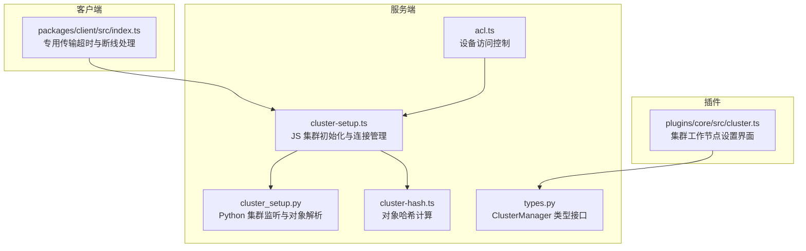
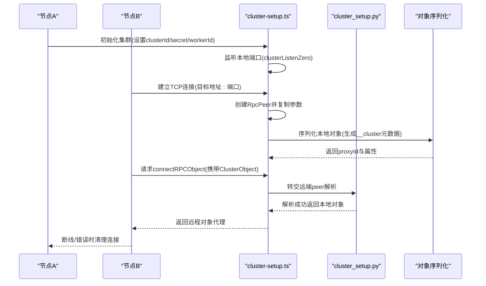
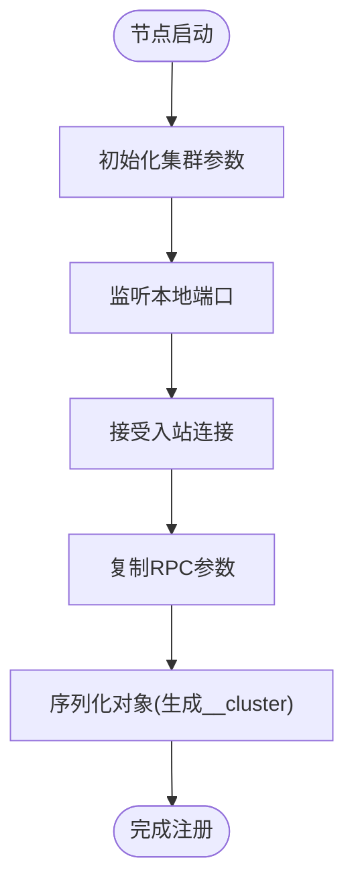
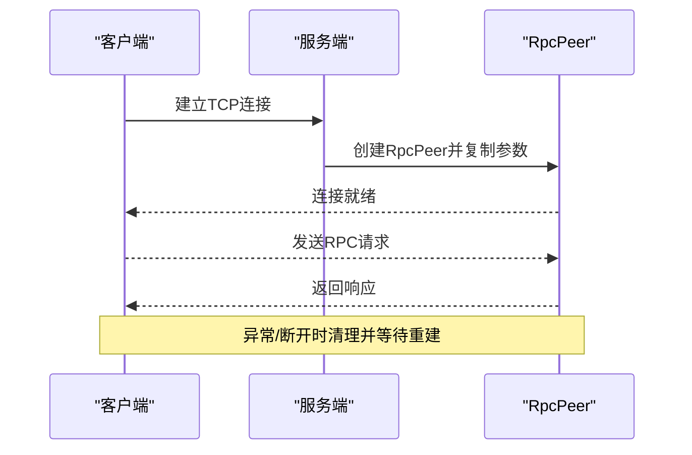
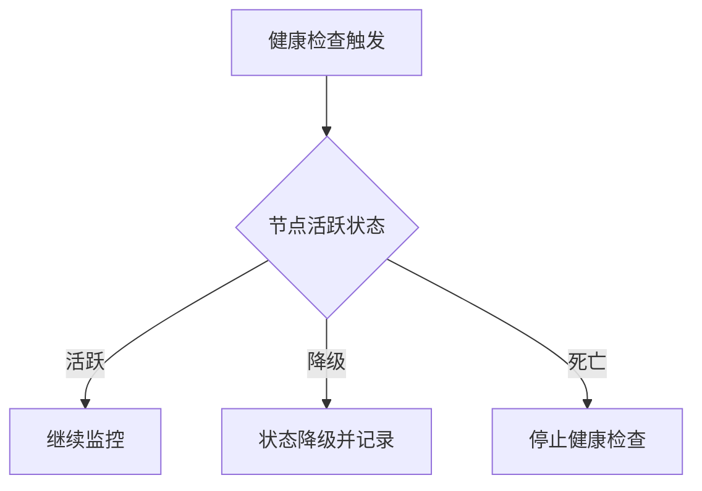
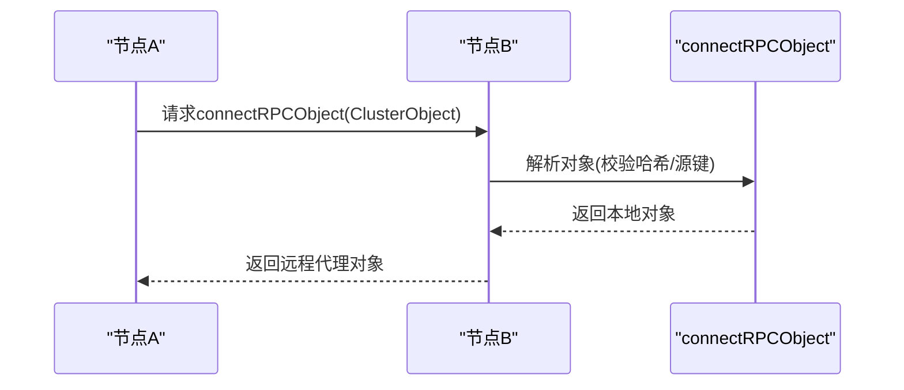
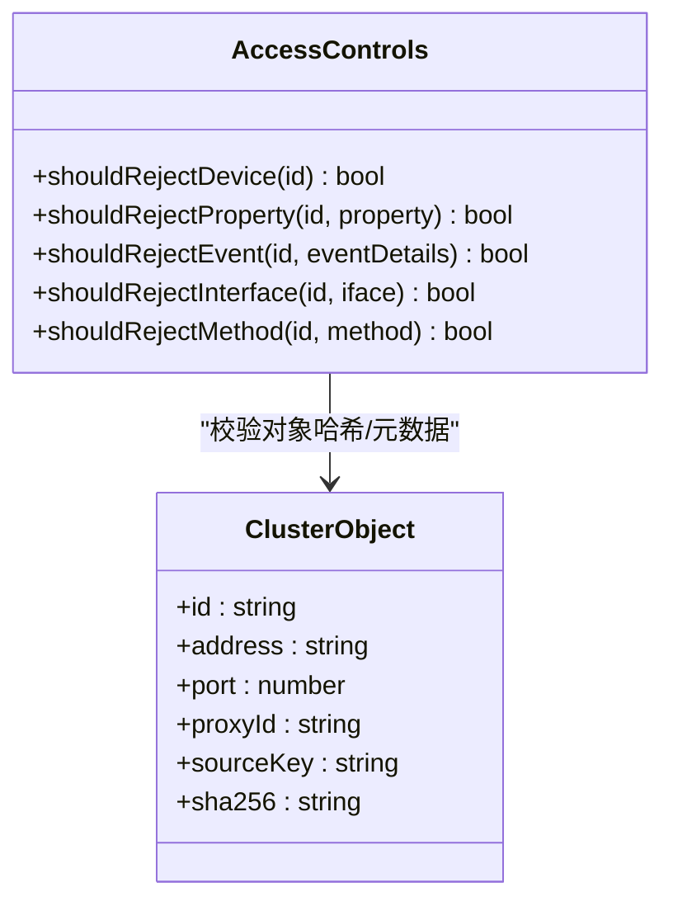
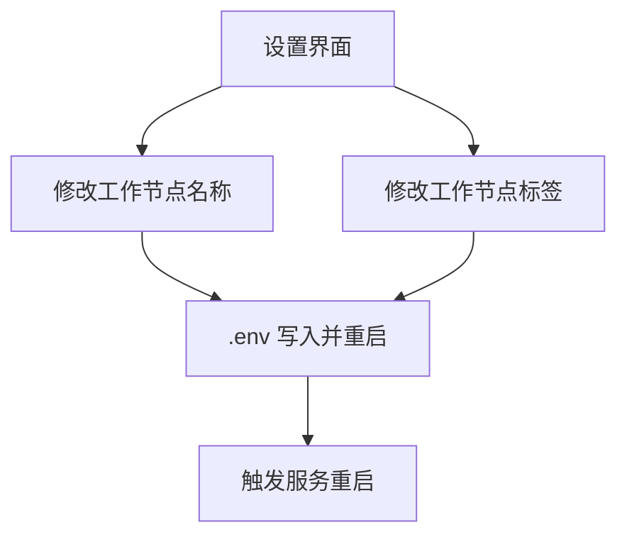
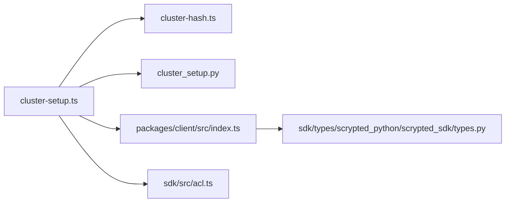

# 节点管理

<cite>
**本文引用的文件**
- [cluster-setup.ts](file://server/src/cluster/cluster-setup.ts)
- [connect-rpc-object.ts](file://server/src/cluster/connect-rpc-object.ts)
- [cluster-hash.ts](file://server/src/cluster/cluster-hash.ts)
- [cluster_setup.py](file://server/python/cluster_setup.py)
- [index.ts](file://packages/client/src/index.ts)
- [cluster.ts](file://plugins/core/src/cluster.ts)
- [acl.ts](file://sdk/src/acl.ts)
- [types.py](file://sdk/types/scrypted_python/scrypted_sdk/types.py)
</cite>

## 目录
1. [简介](#简介)
2. [项目结构](#项目结构)
3. [核心组件](#核心组件)
4. [架构总览](#架构总览)
5. [详细组件分析](#详细组件分析)
6. [依赖关系分析](#依赖关系分析)
7. [性能考量](#性能考量)
8. [故障排查指南](#故障排查指南)
9. [结论](#结论)
10. [附录](#附录)

## 简介
本指南面向 Scrypted 集群场景下的节点管理，系统性阐述以下主题：节点注册与发现、节点信息收集与网络扫描、自动发现机制；节点连接管理（建立、保持、断线重连、连接池维护）；节点状态监控（健康检查、性能指标、状态报告、异常检测）；节点间通信配置（RPC 对象转发、消息路由、负载分发、故障转移）；节点权限与访问控制（身份验证、授权机制、安全策略）；节点管理命令与 API（节点添加、移除、重启操作）；以及节点配置同步机制（配置分发、版本管理、冲突解决）。内容基于仓库中的集群实现与相关模块进行归纳总结。

## 项目结构
Scrypted 的集群能力由服务端与客户端共同实现，核心位于 server 模块的 cluster 子系统，配合 Python 辅助模块完成底层 RPC 连接与对象转发；SDK 提供访问控制与类型接口；插件 core 提供集群工作节点的可视化设置入口；客户端包提供专用传输超时与断线处理逻辑。

**图表来源**
- [cluster-setup.ts:38-399](file://server/src/cluster/cluster-setup.ts#L38-L399)
- [cluster_setup.py:33-202](file://server/python/cluster_setup.py#L33-L202)
- [cluster-hash.ts:4-7](file://server/src/cluster/cluster-hash.ts#L4-L7)
- [index.ts:834-901](file://packages/client/src/index.ts#L834-L901)
- [cluster.ts:27-101](file://plugins/core/src/cluster.ts#L27-L101)
- [acl.ts:25-121](file://sdk/src/acl.ts#L25-L121)
- [types.py:2069-2081](file://sdk/types/scrypted_python/scrypted_sdk/types.py#L2069-L2081)

**章节来源**
- [cluster-setup.ts:38-399](file://server/src/cluster/cluster-setup.ts#L38-L399)
- [cluster_setup.py:33-202](file://server/python/cluster_setup.py#L33-L202)
- [cluster-hash.ts:4-7](file://server/src/cluster/cluster-hash.ts#L4-L7)
- [index.ts:834-901](file://packages/client/src/index.ts#L834-L901)
- [cluster.ts:27-101](file://plugins/core/src/cluster.ts#L27-L101)
- [acl.ts:25-121](file://sdk/src/acl.ts#L25-L121)
- [types.py:2069-2081](file://sdk/types/scrypted_python/scrypted_sdk/types.py#L2069-L2081)

## 核心组件
- 集群初始化与连接管理：负责在节点启动时初始化集群参数、监听本地 RPC 端口、建立与其他节点的连接、维护连接池与代理对象映射。
- 对象序列化与哈希校验：对跨节点暴露的对象进行统一标识与完整性校验，防止伪造或篡改。
- 客户端专用传输与断线处理：为集群对象连接提供专用传输通道与超时控制，确保稳定与可恢复性。
- 访问控制：基于用户与设备维度的细粒度授权，保障节点间通信的安全边界。
- 工作节点设置：通过 UI 设置工作节点名称、标签与重启触发，实现配置同步与变更生效。

**章节来源**
- [cluster-setup.ts:38-399](file://server/src/cluster/cluster-setup.ts#L38-L399)
- [connect-rpc-object.ts:1-29](file://server/src/cluster/connect-rpc-object.ts#L1-L29)
- [cluster-hash.ts:4-7](file://server/src/cluster/cluster-hash.ts#L4-L7)
- [index.ts:834-901](file://packages/client/src/index.ts#L834-L901)
- [acl.ts:25-121](file://sdk/src/acl.ts#L25-L121)
- [cluster.ts:27-101](file://plugins/core/src/cluster.ts#L27-L101)

## 架构总览
下图展示集群节点从初始化到对象转发的整体流程：节点启动后根据环境变量决定模式与地址，监听指定端口；其他节点通过该端口发起连接；对象序列化时生成包含集群标识与哈希的元数据；远端节点通过 RPC 参数请求解析目标对象；连接失败时触发断线处理与清理。

**图表来源**
- [cluster-setup.ts:336-399](file://server/src/cluster/cluster-setup.ts#L336-L399)
- [cluster_setup.py:97-202](file://server/python/cluster_setup.py#L97-L202)
- [connect-rpc-object.ts:1-29](file://server/src/cluster/connect-rpc-object.ts#L1-L29)

**章节来源**
- [cluster-setup.ts:336-399](file://server/src/cluster/cluster-setup.ts#L336-L399)
- [cluster_setup.py:97-202](file://server/python/cluster_setup.py#L97-L202)
- [connect-rpc-object.ts:1-29](file://server/src/cluster/connect-rpc-object.ts#L1-L29)

## 详细组件分析

### 组件一：节点注册与发现
- 注册流程
  - 节点启动后调用初始化函数，设置集群标识、密钥与工作节点 ID。
  - 通过监听零端口绑定实际端口，同时在特定地址上同时监听回环地址，保证可达性。
  - 将自身 RPC Peer 的参数复制给入站连接，确保后续对象解析一致。
- 发现机制
  - 通过网络扫描与广播协议（如 mDNS/零配置网络）发现同网段节点，结合端口与地址建立连接。
  - 对于本地地址匹配的节点，使用回环地址进行连接以降低网络开销。
- 自动发现要点
  - 当对象序列化时，若集群元数据缺失则注入；若属于当前节点则清空以避免跨节点引用。
  - 哈希校验用于防止伪造对象元数据。

**图表来源**
- [cluster-setup.ts:336-383](file://server/src/cluster/cluster-setup.ts#L336-L383)
- [cluster_setup.py:134-140](file://server/python/cluster_setup.py#L134-L140)

**章节来源**
- [cluster-setup.ts:336-383](file://server/src/cluster/cluster-setup.ts#L336-L383)
- [cluster_setup.py:134-140](file://server/python/cluster_setup.py#L134-L140)

### 组件二：节点连接管理
- 连接建立
  - 出站连接通过 TCP 连接到目标地址与端口；入站连接由监听器创建并注入参数。
  - 连接建立后，源地址与本地地址一致性会进行校验，必要时发出警告。
- 保持连接
  - 通过 RPC Peer 的生命周期管理与关闭事件清理，确保资源回收。
- 断线重连
  - 连接断开时清理映射并销毁 Peer；后续再次请求时重新建立连接。
- 连接池维护
  - 使用 Map 维护不同节点的 Peer Promise，避免重复连接；支持主/子线程间 IPC 通道复用。

**图表来源**
- [cluster-setup.ts:78-115](file://server/src/cluster/cluster-setup.ts#L78-L115)
- [cluster-setup.ts:349-382](file://server/src/cluster/cluster-setup.ts#L349-L382)

**章节来源**
- [cluster-setup.ts:78-115](file://server/src/cluster/cluster-setup.ts#L78-L115)
- [cluster-setup.ts:349-382](file://server/src/cluster/cluster-setup.ts#L349-L382)

### 组件三：节点状态监控
- 健康检查
  - 对于特定设备（如 Z-Wave），存在节点在线状态降级与健康检查策略，避免频繁探测。
- 性能指标
  - 通过连接池大小、对象解析耗时与 RPC 循环状态评估节点健康。
- 状态报告
  - 工作节点设置界面提供工作节点列表、模式与标签等信息，便于集中查看。
- 异常检测
  - 连接失败、对象解析失败与哈希校验失败均会触发错误日志与清理动作。

**图表来源**
- [cluster.ts:27-101](file://plugins/core/src/cluster.ts#L27-L101)

**章节来源**
- [cluster.ts:27-101](file://plugins/core/src/cluster.ts#L27-L101)

### 组件四：节点间通信配置
- RPC 对象转发
  - 通过参数传递 connectRPCObject，远端节点解析并返回本地对象代理。
  - 支持主/子线程 IPC 快速路径，避免跨进程开销。
- 消息路由
  - 基于对象的集群标识与端口选择路由至对应节点；同一节点内直接解析。
- 负载分发与故障转移
  - 通过标签与工作节点列表实现任务分配；连接失败时自动切换至可用节点。
- 安全策略
  - 对象元数据包含哈希签名，防止伪造；仅在密钥正确时允许解析。

**图表来源**
- [cluster-setup.ts:259-300](file://server/src/cluster/cluster-setup.ts#L259-L300)
- [cluster_setup.py:204-239](file://server/python/cluster_setup.py#L204-L239)
- [connect-rpc-object.ts:1-29](file://server/src/cluster/connect-rpc-object.ts#L1-L29)

**章节来源**
- [cluster-setup.ts:259-300](file://server/src/cluster/cluster-setup.ts#L259-L300)
- [cluster_setup.py:204-239](file://server/python/cluster_setup.py#L204-L239)
- [connect-rpc-object.ts:1-29](file://server/src/cluster/connect-rpc-object.ts#L1-L29)

### 组件五：节点权限与访问控制
- 设备访问控制
  - 基于用户与设备维度的白名单/黑名单策略，支持按接口、属性与事件过滤。
- 授权机制
  - 通过合并设备访问控制条目，统一判定是否拒绝方法调用或属性读写。
- 安全策略
  - 在对象序列化阶段注入集群元数据并计算哈希，确保跨节点对象可信。

**图表来源**
- [acl.ts:25-121](file://sdk/src/acl.ts#L25-L121)
- [connect-rpc-object.ts:1-29](file://server/src/cluster/connect-rpc-object.ts#L1-L29)

**章节来源**
- [acl.ts:25-121](file://sdk/src/acl.ts#L25-L121)
- [connect-rpc-object.ts:1-29](file://server/src/cluster/connect-rpc-object.ts#L1-L29)

### 组件六：节点管理命令与 API
- 集群模式与工作节点
  - 通过 ClusterManager 类型接口获取集群模式、工作节点列表与地址信息。
- 工作节点设置
  - 支持修改工作节点名称与标签，保存至 .env 并触发重启，实现配置同步。
- 添加/移除/重启
  - 通过服务控制组件执行重启；移除可通过停止服务或调整标签实现任务迁移。

**图表来源**
- [cluster.ts:103-154](file://plugins/core/src/cluster.ts#L103-L154)
- [types.py:2069-2081](file://sdk/types/scrypted_python/scrypted_sdk/types.py#L2069-L2081)

**章节来源**
- [cluster.ts:103-154](file://plugins/core/src/cluster.ts#L103-L154)
- [types.py:2069-2081](file://sdk/types/scrypted_python/scrypted_sdk/types.py#L2069-L2081)

### 组件七：节点配置同步机制
- 配置分发
  - 工作节点标签与名称通过 .env 文件分发，重启后生效。
- 版本管理
  - 通过标签集合与预设选项维护兼容性；不支持的标签会被忽略。
- 冲突解决
  - 同名键覆盖策略：新值写入 .env 行，重启后应用最新配置。

**章节来源**
- [cluster.ts:121-154](file://plugins/core/src/cluster.ts#L121-L154)

## 依赖关系分析
- 模块耦合
  - cluster-setup.ts 与 cluster_hash.ts 强耦合，前者负责连接与对象转发，后者负责哈希计算。
  - cluster_setup.py 作为 Python 辅助模块，承担监听与对象解析职责，与 JS 层通过 RPC 参数交互。
  - 客户端包 index.ts 提供专用传输超时与断线处理，增强连接稳定性。
  - SDK 的 acl.ts 与 types.py 分别提供访问控制与类型接口，贯穿集群通信与管理。
- 外部依赖
  - 网络层依赖：TCP 套接字、零端口绑定、回环地址与多网卡地址解析。
  - RPC 层依赖：RpcPeer、参数传递与序列化。

**图表来源**
- [cluster-setup.ts:1-12](file://server/src/cluster/cluster-setup.ts#L1-L12)
- [cluster-hash.ts:1-8](file://server/src/cluster/cluster-hash.ts#L1-L8)
- [cluster_setup.py:1-13](file://server/python/cluster_setup.py#L1-L13)
- [index.ts:834-901](file://packages/client/src/index.ts#L834-L901)
- [acl.ts:1-3](file://sdk/src/acl.ts#L1-L3)
- [types.py:2069-2081](file://sdk/types/scrypted_python/scrypted_sdk/types.py#L2069-L2081)

**章节来源**
- [cluster-setup.ts:1-12](file://server/src/cluster/cluster-setup.ts#L1-L12)
- [cluster-hash.ts:1-8](file://server/src/cluster/cluster-hash.ts#L1-L8)
- [cluster_setup.py:1-13](file://server/python/cluster_setup.py#L1-L13)
- [index.ts:834-901](file://packages/client/src/index.ts#L834-L901)
- [acl.ts:1-3](file://sdk/src/acl.ts#L1-L3)
- [types.py:2069-2081](file://sdk/types/scrypted_python/scrypted_sdk/types.py#L2069-L2081)

## 性能考量
- 连接复用与快速路径
  - 主/子线程 IPC 快速路径减少跨进程开销，提升对象转发效率。
- 超时与保活
  - 客户端提供发送/接收超时回调，断线时主动 kill Peer 并清理连接。
- 地址一致性校验
  - 连接建立后校验源地址与本地地址一致性，避免跨网段误连导致的延迟。

**章节来源**
- [cluster-setup.ts:78-115](file://server/src/cluster/cluster-setup.ts#L78-L115)
- [index.ts:834-901](file://packages/client/src/index.ts#L834-L901)

## 故障排查指南
- 连接失败
  - 检查目标地址与端口可达性；确认监听端口绑定成功且未被占用。
  - 查看连接建立后的源地址校验日志，必要时调整网络配置。
- 对象解析失败
  - 核对对象哈希与密钥是否匹配；确认源键与代理 ID 正确。
  - 检查远端节点是否已导出目标对象并处于运行状态。
- 断线与清理
  - 观察断开事件与 Peer 清理逻辑，确认无悬挂连接；必要时手动重启相关服务。
- 权限问题
  - 检查用户访问控制配置，确认设备/接口/属性/事件的授权范围。

**章节来源**
- [cluster-setup.ts:284-299](file://server/src/cluster/cluster-setup.ts#L284-L299)
- [cluster_setup.py:204-239](file://server/python/cluster_setup.py#L204-L239)
- [acl.ts:25-121](file://sdk/src/acl.ts#L25-L121)

## 结论
Scrypted 的集群节点管理通过严谨的连接建立与对象转发机制、完善的哈希校验与访问控制、以及可视化的配置同步，实现了高可用、可扩展且安全的分布式节点体系。结合本文提供的流程图与操作建议，可在生产环境中稳定地部署与运维集群节点。

## 附录
- 关键术语
  - 集群对象：带有集群标识与哈希的远程对象元数据。
  - 连接池：按地址与端口维护的 RpcPeer 映射。
  - 工作节点：参与集群任务分配的节点实例。
- 参考实现位置
  - 集群初始化与连接：[cluster-setup.ts:336-399](file://server/src/cluster/cluster-setup.ts#L336-L399)
  - 对象序列化与哈希：[connect-rpc-object.ts:1-29](file://server/src/cluster/connect-rpc-object.ts#L1-L29)、[cluster-hash.ts:4-7](file://server/src/cluster/cluster-hash.ts#L4-L7)
  - Python 监听与解析：[cluster_setup.py:97-202](file://server/python/cluster_setup.py#L97-L202)
  - 客户端断线处理：[index.ts:834-901](file://packages/client/src/index.ts#L834-L901)
  - 访问控制：[acl.ts:25-121](file://sdk/src/acl.ts#L25-L121)
  - 工作节点设置：[cluster.ts:27-101](file://plugins/core/src/cluster.ts#L27-L101)
  - 类型接口：[types.py:2069-2081](file://sdk/types/scrypted_python/scrypted_sdk/types.py#L2069-L2081)