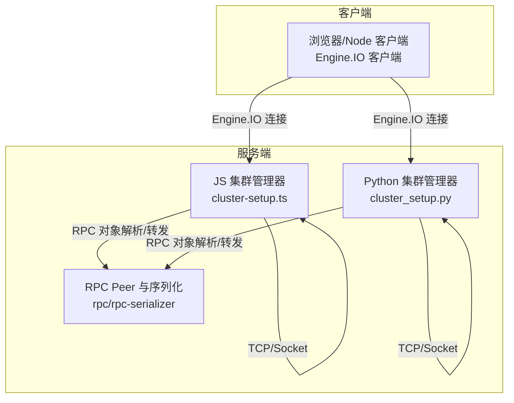
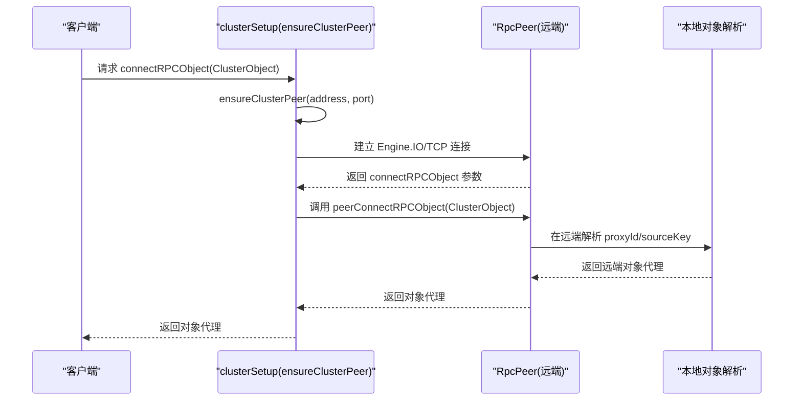
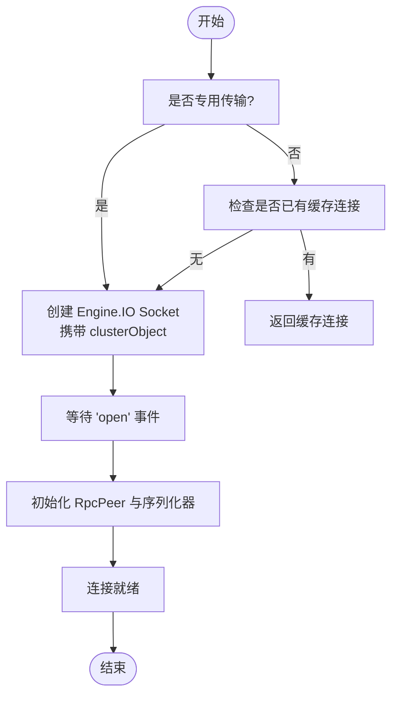
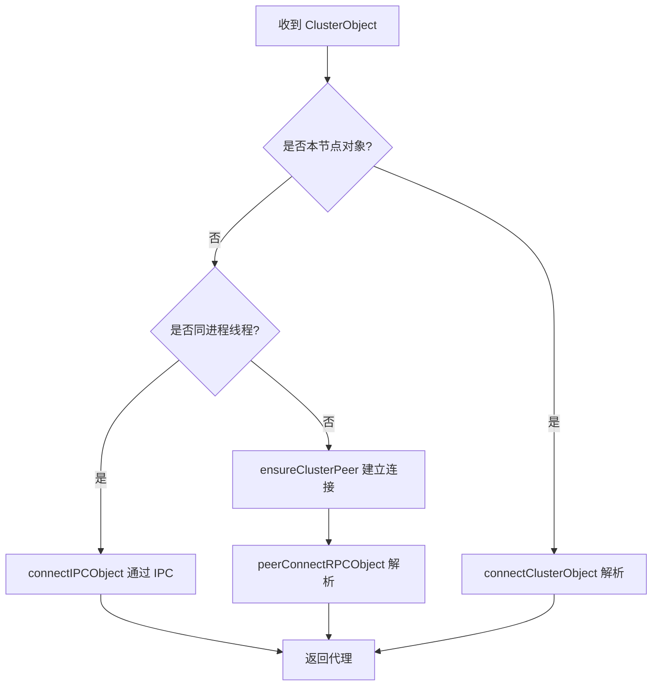
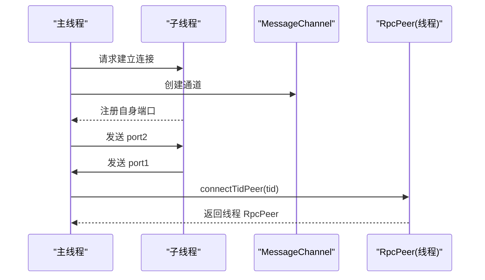
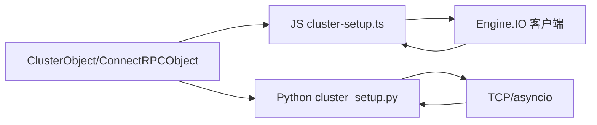

# 节点连接管理

<cite>
**本文引用的文件**
- [server/src/cluster/cluster-setup.ts](file://server/src/cluster/cluster-setup.ts)
- [server/src/cluster/connect-rpc-object.ts](file://server/src/cluster/connect-rpc-object.ts)
- [packages/client/src/index.ts](file://packages/client/src/index.ts)
- [server/python/cluster_setup.py](file://server/python/cluster_setup.py)
- [common/src/promise-utils.ts](file://common/src/promise-utils.ts)
</cite>

## 目录
1. [简介](#简介)
2. [项目结构](#项目结构)
3. [核心组件](#核心组件)
4. [架构总览](#架构总览)
5. [详细组件分析](#详细组件分析)
6. [依赖分析](#依赖分析)
7. [性能考虑](#性能考虑)
8. [故障排查指南](#故障排查指南)
9. [结论](#结论)
10. [附录](#附录)

## 简介
本技术指南聚焦 Scrypted 集群节点的连接管理，围绕以下主题展开：连接建立流程（ensureClusterPeer）、TCP 连接与 Socket 初始化、连接保持与断线检测、断线重连策略（含退避）、RPC 对象连接（peerConnectRPCObject 与对象解析）、线程间通信（Worker Threads、MessageChannel、IPC 对象连接）、连接配置项（超时、缓冲区、并发限制）、以及常见连接故障的诊断方法。文档在保证技术深度的同时，尽量以循序渐进的方式呈现，便于不同背景的读者理解。

## 项目结构
Scrypted 的集群连接涉及多语言与多运行时：
- JavaScript/TypeScript 后端：负责集群监听、对等连接、RPC 序列化与代理解析。
- Python 后端：提供与 JS 等价的集群连接能力，用于插件或扩展场景。
- 客户端（浏览器/Node）：通过 Engine.IO 建立连接，封装集群对象解析与 RPC 对象获取。
- 通用工具：超时控制等通用能力。

**图表来源**
- [server/src/cluster/cluster-setup.ts:38-399](file://server/src/cluster/cluster-setup.ts#L38-L399)
- [server/python/cluster_setup.py:33-239](file://server/python/cluster_setup.py#L33-L239)
- [packages/client/src/index.ts:785-977](file://packages/client/src/index.ts#L785-L977)

**章节来源**
- [server/src/cluster/cluster-setup.ts:1-498](file://server/src/cluster/cluster-setup.ts#L1-L498)
- [server/python/cluster_setup.py:1-284](file://server/python/cluster_setup.py#L1-L284)
- [packages/client/src/index.ts:1-1089](file://packages/client/src/index.ts#L1-L1089)

## 核心组件
- ClusterObject 与 ConnectRPCObject 类型定义：描述跨节点对象的标识、来源与解析协议。
- ensureClusterPeer：确保并返回目标节点的 RpcPeer 连接，支持复用与去重。
- peerConnectRPCObject：从远端 peer 获取其本地对象的代理。
- connectRPCObject：统一入口，根据对象来源决定直连、IPC 或 TCP 连接。
- Worker Threads 与 MessageChannel：主线程与工作线程之间的 IPC 对象桥接。
- 超时与收尾：连接建立阶段与专用传输的超时控制与资源回收。

**章节来源**
- [server/src/cluster/connect-rpc-object.ts:1-29](file://server/src/cluster/connect-rpc-object.ts#L1-L29)
- [server/src/cluster/cluster-setup.ts:28-300](file://server/src/cluster/cluster-setup.ts#L28-L300)
- [packages/client/src/index.ts:785-977](file://packages/client/src/index.ts#L785-L977)

## 架构总览
下图展示客户端到服务端的连接路径、对象解析与代理建立的关键步骤。

**图表来源**
- [packages/client/src/index.ts:785-977](file://packages/client/src/index.ts#L785-L977)
- [server/src/cluster/cluster-setup.ts:28-300](file://server/src/cluster/cluster-setup.ts#L28-L300)

## 详细组件分析

### 连接建立与 TCP/Socket 初始化
- 客户端侧：
  - 通过 Engine.IO 建立到目标地址的连接，并携带 clusterObject 查询参数。
  - 支持专用传输（dedicatedTransport）模式，此时连接不被缓存，失败时主动销毁以避免资源泄漏。
  - 建立成功后，使用双向序列化器与远端 RpcPeer 交互。
- 服务端侧（JS）：
  - 通过 net.connect 建立 TCP 连接，创建双向 RpcPeer。
  - 将主 peer 的 params 复制到集群 peer，确保 getRemote 等能力可用。
  - 监听 socket close 事件，清理缓存映射。
- 服务端侧（Python）：
  - 通过 asyncio.open_connection 建立 TCP 连接，创建 RPC 流式传输与读循环。
  - 同样复制 params 并注册 onProxySerialization。

**图表来源**
- [packages/client/src/index.ts:785-919](file://packages/client/src/index.ts#L785-L919)
- [server/src/cluster/cluster-setup.ts:78-115](file://server/src/cluster/cluster-setup.ts#L78-L115)
- [server/python/cluster_setup.py:155-202](file://server/python/cluster_setup.py#L155-L202)

**章节来源**
- [packages/client/src/index.ts:785-919](file://packages/client/src/index.ts#L785-L919)
- [server/src/cluster/cluster-setup.ts:78-115](file://server/src/cluster/cluster-setup.ts#L78-L115)
- [server/python/cluster_setup.py:155-202](file://server/python/cluster_setup.py#L155-L202)

### 连接保持机制：连接池、心跳与断线检测
- 连接池管理：
  - JS 侧：以 address:port 为键维护 clusterPeers Map；主线程与工作线程分别维护 tidPeers 与 tidChannels。
  - Python 侧：以 address:port 为键维护 clusterPeers 映射。
- 断线检测：
  - JS 侧：监听 socket/close，删除缓存并杀死 peer。
  - Python 侧：读循环异常或关闭时清理 clusterPeers。
- 心跳：
  - 当前实现未显式内置心跳定时器；如需心跳可基于底层传输（Engine.IO/TCP）的空闲超时与应用层活动超时配合实现。

**章节来源**
- [server/src/cluster/cluster-setup.ts:49-55](file://server/src/cluster/cluster-setup.ts#L49-L55)
- [server/src/cluster/cluster-setup.ts:88-110](file://server/src/cluster/cluster-setup.ts#L88-L110)
- [server/python/cluster_setup.py:129-133](file://server/python/cluster_setup.py#L129-L133)

### 断线重连策略：间隔、次数与退避
- 当前实现未内置指数退避或固定间隔重试逻辑。
- 建议策略（概念性说明）：
  - 固定间隔重试：适用于稳定网络环境。
  - 指数退避：避免雪崩效应，结合抖动减少同步重试。
  - 最大重试次数：防止无限占用资源。
  - 可配置项：重试间隔、最大间隔、最大次数、抖动系数。
- 在现有代码中，可通过在调用方包装 ensureClusterPeer 的调用，增加外层重试与退避逻辑。

**章节来源**
- [server/src/cluster/cluster-setup.ts:78-115](file://server/src/cluster/cluster-setup.ts#L78-L115)
- [server/python/cluster_setup.py:155-202](file://server/python/cluster_setup.py#L155-L202)

### RPC 对象连接：peerConnectRPCObject、对象解析与代理建立
- peerConnectRPCObject：
  - 从远端 peer 获取 connectRPCObject 参数，再调用以解析对象。
  - 缓存于 peer.tags 中，避免重复获取。
- connectRPCObject：
  - 判断对象是否属于本节点（port 匹配），若是则直接解析。
  - 若为同进程不同线程（proxyId 前缀 n-），优先走 IPC。
  - 否则通过 ensureClusterPeer 建立 TCP/Engine.IO 连接，再调用 peerConnectRPCObject。
- 对象解析：
  - ClusterObject 包含 id/address/port/proxyId/sourceKey/sha256。
  - 通过 computeClusterObjectHash 校验一致性。

**图表来源**
- [server/src/cluster/cluster-setup.ts:28-300](file://server/src/cluster/cluster-setup.ts#L28-L300)
- [server/src/cluster/cluster-setup.ts:189-200](file://server/src/cluster/cluster-setup.ts#L189-L200)
- [server/src/cluster/connect-rpc-object.ts:1-29](file://server/src/cluster/connect-rpc-object.ts#L1-L29)

**章节来源**
- [server/src/cluster/cluster-setup.ts:28-300](file://server/src/cluster/cluster-setup.ts#L28-L300)
- [server/src/cluster/connect-rpc-object.ts:1-29](file://server/src/cluster/connect-rpc-object.ts#L1-L29)

### 线程间通信：Worker Threads、MessageChannel、IPC 对象连接
- 主线程注册子线程端口，接收来自子线程的连接请求。
- 双向线程通过 MessageChannel 建立端口对，双方互相发送对方的 port2。
- connectTidPeer 创建 NodeThreadWorker 的 RpcPeer，设置 params 与 onProxySerialization。
- connectIPCObject：
  - 主线程发起时，先进行 brokeredConnections 同步，再通过已建立的 port 发起连接。
  - 返回 peerConnectRPCObject 的结果，作为 IPC 对象代理。

**图表来源**
- [server/src/cluster/cluster-setup.ts:174-241](file://server/src/cluster/cluster-setup.ts#L174-L241)
- [server/src/cluster/cluster-setup.ts:189-200](file://server/src/cluster/cluster-setup.ts#L189-L200)

**章节来源**
- [server/src/cluster/cluster-setup.ts:174-241](file://server/src/cluster/cluster-setup.ts#L174-L241)
- [server/src/cluster/cluster-setup.ts:189-200](file://server/src/cluster/cluster-setup.ts#L189-L200)

### 连接配置选项：超时、缓冲区、并发限制
- 超时设置（客户端侧）：
  - 专用传输模式下，可配置发送/接收超时，超时后主动销毁 peer。
  - 通用连接阶段，使用 Promise.any 与 timeoutPromise 控制并行尝试的超时。
- 缓冲区大小：
  - 通过序列化器的 write/send 接口传递到底层传输，具体缓冲行为由底层实现决定。
- 并发连接数限制：
  - 当前未见显式的全局并发上限控制；可通过业务侧在调用方限制并发数量。

**章节来源**
- [packages/client/src/index.ts:818-901](file://packages/client/src/index.ts#L818-L901)
- [common/src/promise-utils.ts:29-31](file://common/src/promise-utils.ts#L29-L31)

### 连接故障诊断
- 连接超时：
  - 专用传输的发送/接收超时会触发 peer.kill，需检查网络延迟与对端处理能力。
- 认证失败：
  - 登录态或查询令牌错误会导致握手失败；需确认登录结果与额外头部。
- 网络中断：
  - socket/close 触发清理；检查防火墙、NAT、容器网络与端口绑定。
- 对象解析失败：
  - sha256 校验失败或远端无此代理，需确认 ClusterObject 字段与远端状态。

**章节来源**
- [packages/client/src/index.ts:834-901](file://packages/client/src/index.ts#L834-L901)
- [server/src/cluster/cluster-setup.ts:71-76](file://server/src/cluster/cluster-setup.ts#L71-L76)
- [server/python/cluster_setup.py:54-60](file://server/python/cluster_setup.py#L54-L60)

## 依赖分析
- 类型与接口：
  - ClusterObject、ConnectRPCObject 定义了跨节点对象的契约。
- 组件耦合：
  - cluster-setup.ts 与 cluster_setup.py 提供等价的集群连接能力，彼此独立但遵循相同协议。
  - 客户端通过 Engine.IO 与服务端建立连接，随后通过 peerConnectRPCObject 完成对象解析。
- 外部依赖：
  - Node net、worker_threads、Engine.IO 客户端。
  - Python asyncio、rpc_reader。

**图表来源**
- [server/src/cluster/connect-rpc-object.ts:1-29](file://server/src/cluster/connect-rpc-object.ts#L1-L29)
- [server/src/cluster/cluster-setup.ts:10-11](file://server/src/cluster/cluster-setup.ts#L10-L11)
- [server/python/cluster_setup.py:13-13](file://server/python/cluster_setup.py#L13-L13)

**章节来源**
- [server/src/cluster/connect-rpc-object.ts:1-29](file://server/src/cluster/connect-rpc-object.ts#L1-L29)
- [server/src/cluster/cluster-setup.ts:10-11](file://server/src/cluster/cluster-setup.ts#L10-L11)
- [server/python/cluster_setup.py:13-13](file://server/python/cluster_setup.py#L13-L13)

## 性能考虑
- 连接复用：通过 ensureClusterPeer 与 clusterPeers 缓存连接，降低重复握手成本。
- IPC 优先：同进程线程对象优先走 IPC，减少网络开销。
- 序列化效率：使用二进制与 JSON 分离的序列化器，减少序列化开销。
- 资源回收：FinalizationRegistry 与 peer.killedSafe 确保专用传输对象释放。

**章节来源**
- [server/src/cluster/cluster-setup.ts:49-55](file://server/src/cluster/cluster-setup.ts#L49-L55)
- [packages/client/src/index.ts:788-789](file://packages/client/src/index.ts#L788-L789)
- [packages/client/src/index.ts:955-957](file://packages/client/src/index.ts#L955-L957)

## 故障排查指南
- 症状：连接无法建立
  - 检查地址与端口、防火墙、容器网络映射。
  - 查看日志中的 failure ipc connect 与 failure rpc 错误。
- 症状：对象解析失败
  - 核对 ClusterObject 的 id、address、port、proxyId、sha256 是否一致。
  - 确认远端 peer 的 connectRPCObject 参数是否可达。
- 症状：专用传输频繁超时
  - 调整 send/receive 超时阈值，检查对端处理耗时。
- 症状：内存泄漏
  - 确认专用传输对象是否通过 FinalizationRegistry 注册并在销毁时释放。

**章节来源**
- [packages/client/src/index.ts:905-910](file://packages/client/src/index.ts#L905-L910)
- [server/src/cluster/cluster-setup.ts:284-300](file://server/src/cluster/cluster-setup.ts#L284-L300)
- [server/python/cluster_setup.py:229-238](file://server/python/cluster_setup.py#L229-L238)

## 结论
Scrypted 的集群连接管理通过“类型契约 + 连接池 + IPC 优先 + 对象解析”实现了跨节点对象访问。当前实现强调连接复用与资源回收，未内置显式的重连退避策略，建议在上层业务中补充重试与退避逻辑。通过合理配置超时与并发限制，可在复杂网络环境中获得更稳定的连接体验。

## 附录
- 关键实现路径参考：
  - [ensureClusterPeer 与连接池:78-115](file://server/src/cluster/cluster-setup.ts#L78-L115)
  - [peerConnectRPCObject 与对象解析:28-36](file://server/src/cluster/cluster-setup.ts#L28-L36)
  - [connectRPCObject 主入口:259-300](file://server/src/cluster/cluster-setup.ts#L259-L300)
  - [Worker Threads 与 IPC:127-172](file://server/src/cluster/cluster-setup.ts#L127-L172)
  - [客户端 clusterSetup:785-977](file://packages/client/src/index.ts#L785-L977)
  - [Python 集群管理器:33-239](file://server/python/cluster_setup.py#L33-L239)
  - [超时工具:29-31](file://common/src/promise-utils.ts#L29-L31)