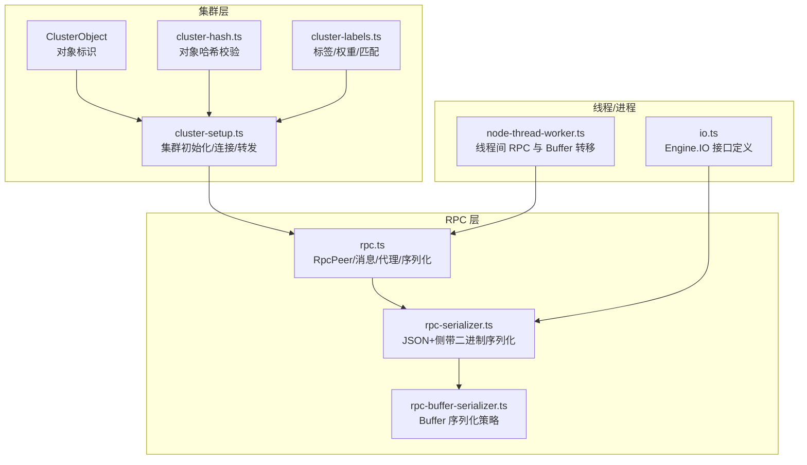
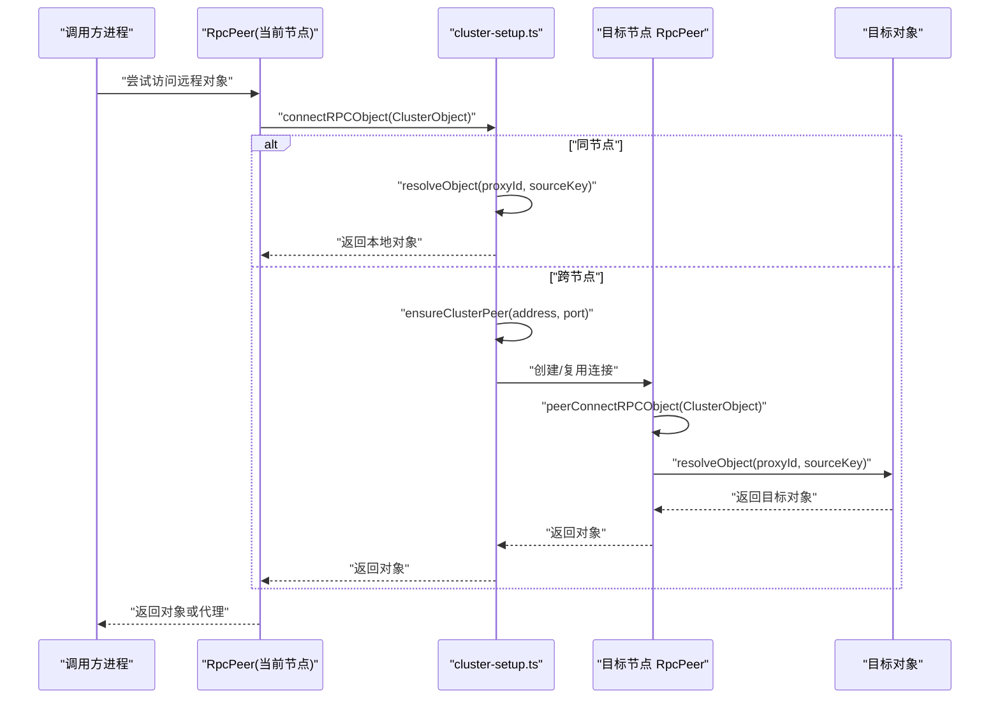
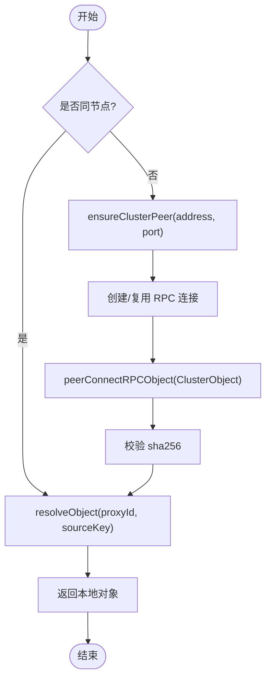
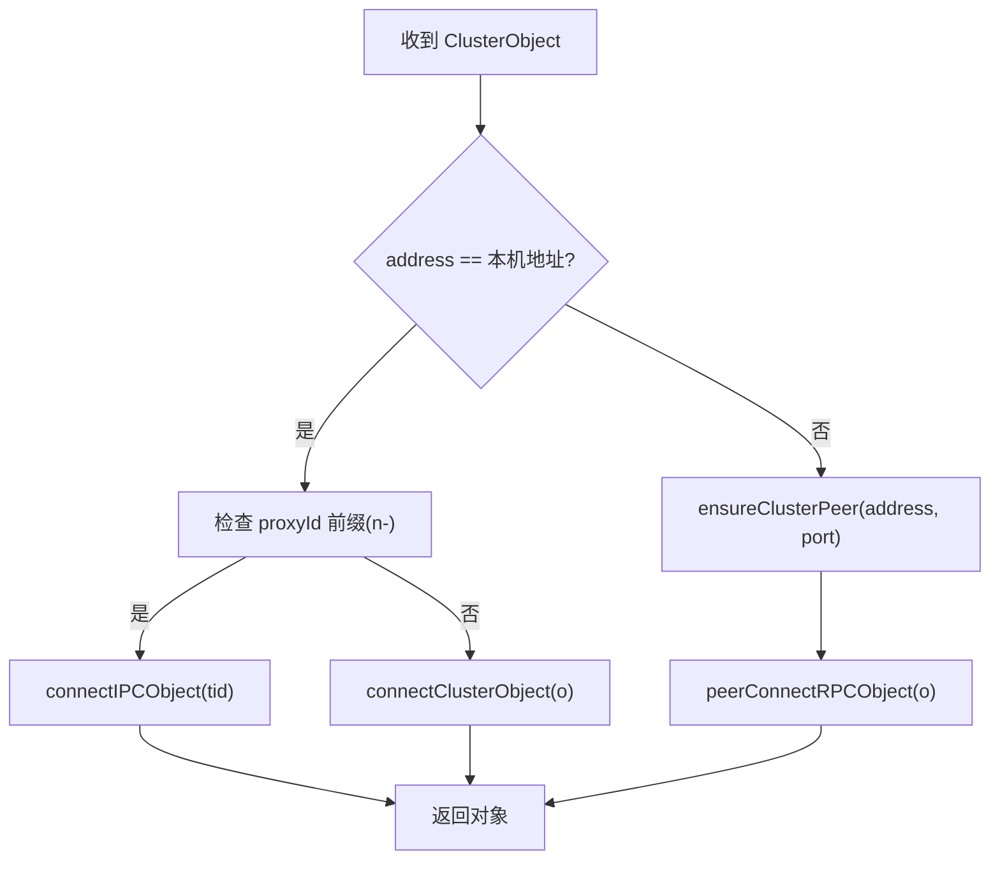
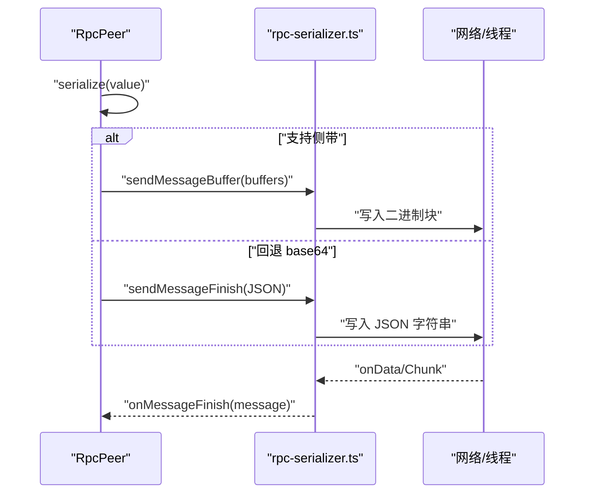
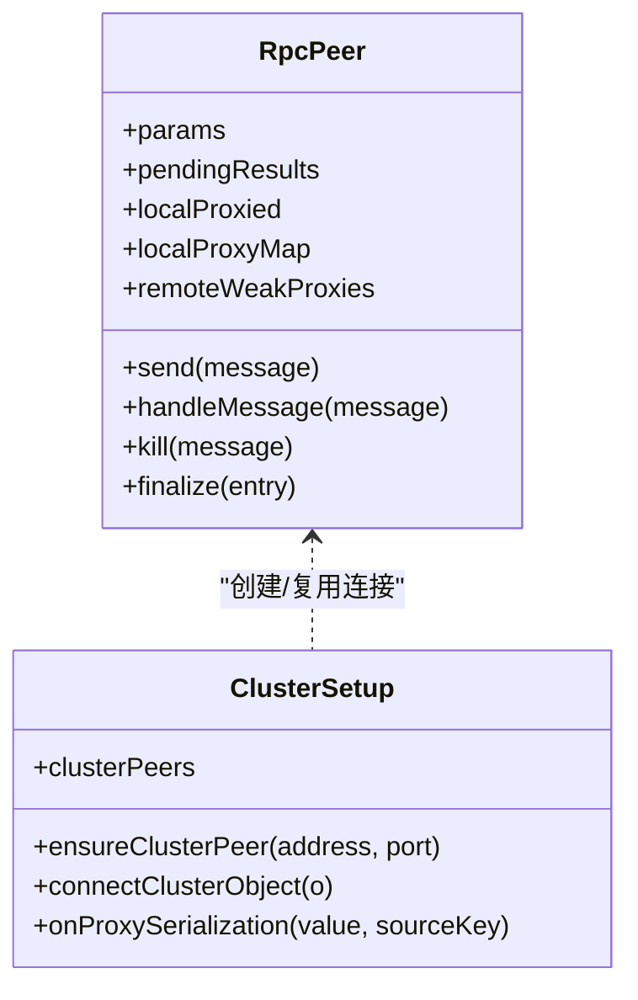
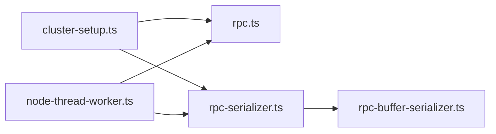

# 节点通信路由

<cite>
**本文引用的文件**
- [connect-rpc-object.ts](file://server/src/cluster/connect-rpc-object.ts)
- [rpc.ts](file://server/src/rpc.ts)
- [rpc-serializer.ts](file://server/src/rpc-serializer.ts)
- [rpc-buffer-serializer.ts](file://server/src/rpc-buffer-serializer.ts)
- [cluster-setup.ts](file://server/src/cluster/cluster-setup.ts)
- [cluster-hash.ts](file://server/src/cluster/cluster-hash.ts)
- [cluster-labels.ts](file://server/src/cluster/cluster-labels.ts)
- [node-thread-worker.ts](file://server/src/plugin/runtime/node-thread-worker.ts)
- [io.ts](file://server/src/io.ts)
</cite>

## 目录
1. [简介](#简介)
2. [项目结构](#项目结构)
3. [核心组件](#核心组件)
4. [架构总览](#架构总览)
5. [详细组件分析](#详细组件分析)
6. [依赖关系分析](#依赖关系分析)
7. [性能考量](#性能考量)
8. [故障排查指南](#故障排查指南)
9. [结论](#结论)
10. [附录](#附录)

## 简介
本文件面向 Scrypted 集群节点通信与路由系统，聚焦 RPC 对象转发机制、消息路由策略（含负载均衡与路径选择）、消息序列化与传输优化、连接对象管理（连接池、对象缓存、内存回收）、跨节点通信协议（消息格式、协议版本与兼容性）、路由配置选项（策略、优先级、故障转移）以及通信性能优化与故障排查。内容以源码为依据，辅以图示帮助不同背景读者理解。

## 项目结构
Scrypted 的集群通信由以下模块协同完成：
- 集群对象模型与连接入口：cluster/connect-rpc-object.ts 定义了 ClusterObject 与 ConnectRPCObject 类型；cluster/cluster-setup.ts 提供集群初始化、节点发现、连接建立与对象转发。
- RPC 核心：server/src/rpc.ts 实现了 RpcPeer、消息类型（apply/result/param/finalize）、代理序列化/反序列化、错误封装与生命周期管理。
- 序列化与传输：rpc-serializer.ts 提供基于流的双向序列化器（JSON + 侧带二进制），rpc-buffer-serializer.ts 提供 Buffer 的高效传输（共享缓冲区转移或回退 base64）。
- 线程间通信：plugin/runtime/node-thread-worker.ts 基于 worker_threads 的 MessagePort 实现线程内 RPC 通道与 Buffer 传输。
- 标签与权重：cluster/cluster-labels.ts 提供标签匹配、偏好权重与 fork 决策支持，为后续扩展负载均衡与路径选择提供基础。

**图表来源**
- [connect-rpc-object.ts:1-29](file://server/src/cluster/connect-rpc-object.ts#L1-L29)
- [cluster-setup.ts:1-498](file://server/src/cluster/cluster-setup.ts#L1-L498)
- [cluster-hash.ts:1-8](file://server/src/cluster/cluster-hash.ts#L1-L8)
- [cluster-labels.ts:1-58](file://server/src/cluster/cluster-labels.ts#L1-L58)
- [rpc.ts:1-858](file://server/src/rpc.ts#L1-L858)
- [rpc-serializer.ts:1-240](file://server/src/rpc-serializer.ts#L1-L240)
- [rpc-buffer-serializer.ts:1-32](file://server/src/rpc-buffer-serializer.ts#L1-L32)
- [node-thread-worker.ts:1-151](file://server/src/plugin/runtime/node-thread-worker.ts#L1-L151)
- [io.ts:1-26](file://server/src/io.ts#L1-L26)

**章节来源**
- [connect-rpc-object.ts:1-29](file://server/src/cluster/connect-rpc-object.ts#L1-L29)
- [cluster-setup.ts:1-498](file://server/src/cluster/cluster-setup.ts#L1-L498)
- [rpc.ts:1-858](file://server/src/rpc.ts#L1-L858)
- [rpc-serializer.ts:1-240](file://server/src/rpc-serializer.ts#L1-L240)
- [rpc-buffer-serializer.ts:1-32](file://server/src/rpc-buffer-serializer.ts#L1-L32)
- [node-thread-worker.ts:1-151](file://server/src/plugin/runtime/node-thread-worker.ts#L1-L151)
- [io.ts:1-26](file://server/src/io.ts#L1-L26)

## 核心组件
- ClusterObject 与 ConnectRPCObject
  - ClusterObject 描述跨节点可访问对象的身份信息（id、address、port、proxyId、sourceKey、sha256）。
  - ConnectRPCObject 是一个函数类型，用于在目标节点上解析并返回对应对象实例。
- RpcPeer 与消息模型
  - RpcPeer 维护本地/远端代理映射、待处理结果、参数与序列化器注册表，负责消息发送、接收与处理。
  - 消息类型：apply（调用）、result（返回）、param（参数查询）、finalize（代理终结）。
- 序列化与传输
  - JSON 主体 + 侧带二进制（buffers）的混合传输，支持 Buffer/TypedArray 的零拷贝转移（线程间）。
  - 回退策略：当不支持侧带传输时使用 base64 编解码。
- 线程间 RPC
  - 使用 worker_threads 的 MessagePort，支持 Transferable ArrayBuffer 的零拷贝传递。
- 标签与权重
  - 基于环境变量的标签集合与权重，用于后续的负载均衡与路径选择决策。

**章节来源**
- [connect-rpc-object.ts:1-29](file://server/src/cluster/connect-rpc-object.ts#L1-L29)
- [rpc.ts:29-85](file://server/src/rpc.ts#L29-L85)
- [rpc-serializer.ts:5-85](file://server/src/rpc-serializer.ts#L5-L85)
- [rpc-buffer-serializer.ts:3-32](file://server/src/rpc-buffer-serializer.ts#L3-L32)
- [node-thread-worker.ts:8-40](file://server/src/plugin/runtime/node-thread-worker.ts#L8-L40)
- [cluster-labels.ts:37-58](file://server/src/cluster/cluster-labels.ts#L37-L58)

## 架构总览
下图展示从发起方到目标节点的对象转发流程，包括本地对象解析、跨节点连接、对象定位与返回。

**图表来源**
- [cluster-setup.ts:57-300](file://server/src/cluster/cluster-setup.ts#L57-L300)
- [rpc.ts:697-800](file://server/src/rpc.ts#L697-L800)

**章节来源**
- [cluster-setup.ts:57-300](file://server/src/cluster/cluster-setup.ts#L57-L300)
- [rpc.ts:697-800](file://server/src/rpc.ts#L697-L800)

## 详细组件分析

### 组件 A：RPC 对象转发与跨节点传输
- connectRPCObject 函数实现
  - 在目标节点上通过 peer.getParam('connectRPCObject') 获取连接函数，再以 ClusterObject 作为参数调用，解析出本地对象。
  - 连接前进行对象哈希校验，确保对象归属与密钥一致。
- 对象定位
  - 通过 proxyId + sourceKey 在目标节点的 localProxyMap 中查找本地对象。
  - 若为线程内 IPC，使用 n-pid-tid 前缀的 proxyId 快速定位。
- 跨节点传输
  - 通过 net 套接字建立 RPC 连接，使用 createDuplexRpcPeer 包装读写流。
  - 发送/接收采用 JSON 主体 + 侧带二进制，必要时回退 base64。

**图表来源**
- [cluster-setup.ts:28-115](file://server/src/cluster/cluster-setup.ts#L28-L115)
- [cluster-hash.ts:4-7](file://server/src/cluster/cluster-hash.ts#L4-L7)

**章节来源**
- [cluster-setup.ts:28-115](file://server/src/cluster/cluster-setup.ts#L28-L115)
- [cluster-hash.ts:4-7](file://server/src/cluster/cluster-hash.ts#L4-L7)

### 组件 B：消息路由策略与路径选择
- 路由策略
  - 同节点直连：优先使用本地 resolveObject。
  - 线程内 IPC：当地址匹配且 proxyId 以 n- 开头时，走 worker_threads MessagePort。
  - 跨节点 TCP：ensureClusterPeer 建立 net 连接。
- 负载均衡与路径选择
  - 当前实现未内置多路径负载均衡逻辑；可通过标签/权重（cluster-labels.ts）为未来扩展提供基础。
- 冗余备份
  - 无显式多路冗余；可通过多节点部署与客户端重试策略实现高可用。

**图表来源**
- [cluster-setup.ts:259-300](file://server/src/cluster/cluster-setup.ts#L259-L300)
- [cluster-setup.ts:189-200](file://server/src/cluster/cluster-setup.ts#L189-L200)

**章节来源**
- [cluster-setup.ts:259-300](file://server/src/cluster/cluster-setup.ts#L259-L300)
- [cluster-setup.ts:189-200](file://server/src/cluster/cluster-setup.ts#L189-L200)

### 组件 C：消息序列化与传输优化
- 数据编码
  - JSON 主体承载 RpcMessage 结构；非传输安全类型通过序列化器转换为可携带形式。
- 压缩与传输优化
  - 二进制大对象通过侧带缓冲区直接传输，避免 JSON 化带来的体积膨胀与 CPU 开销。
  - 线程间 Buffer 支持 Transferable，进一步降低复制成本。
- 兼容性处理
  - 不支持侧带传输时回退 base64；序列化上下文 buffers 记录侧带片段，接收端按序拼接。

**图表来源**
- [rpc-serializer.ts:38-84](file://server/src/rpc-serializer.ts#L38-L84)
- [rpc-serializer.ts:107-182](file://server/src/rpc-serializer.ts#L107-L182)
- [rpc-buffer-serializer.ts:14-31](file://server/src/rpc-buffer-serializer.ts#L14-L31)
- [node-thread-worker.ts:119-143](file://server/src/plugin/runtime/node-thread-worker.ts#L119-L143)

**章节来源**
- [rpc-serializer.ts:38-84](file://server/src/rpc-serializer.ts#L38-L84)
- [rpc-serializer.ts:107-182](file://server/src/rpc-serializer.ts#L107-L182)
- [rpc-buffer-serializer.ts:14-31](file://server/src/rpc-buffer-serializer.ts#L14-L31)
- [node-thread-worker.ts:119-143](file://server/src/plugin/runtime/node-thread-worker.ts#L119-L143)

### 组件 D：连接对象管理（连接池、对象缓存、内存清理）
- 连接池维护
  - clusterPeers 映射 address:port -> Promise<RpcPeer>，避免重复连接；断开自动清理。
- 对象缓存
  - localProxied/localProxyMap 维护本地代理 ID 到对象的映射；remoteWeakProxies 使用 WeakRef 缓存远端代理，便于回收。
- 内存清理
  - FinalizationRegistry 注册本地代理条目，触发 finalize 发送 finalize 消息，释放远端资源。
  - RpcPeer.kill 冻结内部状态，拒绝后续调用并清理挂起结果与异步迭代器。

**图表来源**
- [rpc.ts:285-474](file://server/src/rpc.ts#L285-L474)
- [cluster-setup.ts:49-115](file://server/src/cluster/cluster-setup.ts#L49-L115)
- [cluster-setup.ts:302-335](file://server/src/cluster/cluster-setup.ts#L302-L335)

**章节来源**
- [rpc.ts:285-474](file://server/src/rpc.ts#L285-L474)
- [cluster-setup.ts:49-115](file://server/src/cluster/cluster-setup.ts#L49-L115)
- [cluster-setup.ts:302-335](file://server/src/cluster/cluster-setup.ts#L302-L335)

### 组件 E：跨节点通信协议（消息格式、协议版本、兼容性）
- 消息格式
  - RpcMessage.type: 'apply' | 'result' | 'param' | 'finalize'
  - apply: 包含 id/proxyId/method/args/oneway
  - result: 包含 id/throw/result
  - param: 包含 id/param
  - finalize: 包含 __local_proxy_id/__local_proxy_finalizer_id
- 协议版本与兼容性
  - 通过 RpcPeer.serialize/deserialize 的构造器名称映射实现类型兼容；错误统一包装为 RPCResultError。
  - 侧带二进制与 JSON 分离，保证向后兼容。

**章节来源**
- [rpc.ts:29-85](file://server/src/rpc.ts#L29-L85)
- [rpc.ts:494-568](file://server/src/rpc.ts#L494-L568)

### 组件 F：路由配置选项（策略、优先级、故障转移）
- 策略设置
  - SCRYPTED_CLUSTER_MODE: server/client
  - SCRYPTED_CLUSTER_ADDRESS: 服务器监听地址或客户端本机地址
  - SCRYPTED_CLUSTER_SERVER: client 模式下的服务器 host:port
  - SCRYPTED_CLUSTER_SECRET: 对象哈希校验密钥
- 优先级与标签
  - SCRYPTED_CLUSTER_LABELS: 标签集合，结合 cluster-labels.ts 的 require/any/prefer 实现匹配与权重。
- 故障转移
  - 未内置多路径故障转移；建议通过多节点部署与客户端重试策略实现。

**章节来源**
- [cluster-setup.ts:403-462](file://server/src/cluster/cluster-setup.ts#L403-L462)
- [cluster-labels.ts:3-58](file://server/src/cluster/cluster-labels.ts#L3-L58)

## 依赖关系分析
- 组件耦合
  - cluster-setup 依赖 rpc.ts 的 RpcPeer 与 rpc-serializer.ts 的 createDuplexRpcPeer。
  - rpc-serializer.ts 依赖 rpc-buffer-serializer.ts 的 SidebandBufferSerializer。
  - node-thread-worker.ts 依赖 rpc.ts 的 RpcPeer 并注册 Buffer/TypedArray 的传输序列化器。
- 外部依赖
  - worker_threads、net、Buffer、SharedArrayBuffer（受浏览器限制）。

**图表来源**
- [cluster-setup.ts:1-11](file://server/src/cluster/cluster-setup.ts#L1-L11)
- [rpc.ts:1-10](file://server/src/rpc.ts#L1-L10)
- [rpc-serializer.ts:1-4](file://server/src/rpc-serializer.ts#L1-L4)
- [rpc-buffer-serializer.ts:1-3](file://server/src/rpc-buffer-serializer.ts#L1-L3)
- [node-thread-worker.ts:1-7](file://server/src/plugin/runtime/node-thread-worker.ts#L1-L7)

**章节来源**
- [cluster-setup.ts:1-11](file://server/src/cluster/cluster-setup.ts#L1-L11)
- [rpc.ts:1-10](file://server/src/rpc.ts#L1-L10)
- [rpc-serializer.ts:1-4](file://server/src/rpc-serializer.ts#L1-L4)
- [rpc-buffer-serializer.ts:1-3](file://server/src/rpc-buffer-serializer.ts#L1-L3)
- [node-thread-worker.ts:1-7](file://server/src/plugin/runtime/node-thread-worker.ts#L1-L7)

## 性能考量
- 批量传输与异步处理
  - 侧带二进制分块传输，减少单次 JSON 负载；线程间使用 Transferable 避免复制。
- 缓存策略
  - 远端代理弱引用缓存，配合 FinalizationRegistry 清理；本地代理 ID 到对象映射避免重复序列化。
- 序列化优化
  - 默认传输安全类型直接透传；非传输安全类型通过构造器名称映射序列化。
- GC 与内存回收
  - 可选周期性全局 GC 触发，结合 remotesCreated/remotesCollected 统计。

**章节来源**
- [rpc.ts:1-27](file://server/src/rpc.ts#L1-L27)
- [rpc.ts:285-474](file://server/src/rpc.ts#L285-L474)
- [rpc-serializer.ts:184-239](file://server/src/rpc-serializer.ts#L184-L239)
- [node-thread-worker.ts:8-40](file://server/src/plugin/runtime/node-thread-worker.ts#L8-L40)

## 故障排查指南
- 路由失败
  - 检查 SCRYPTED_CLUSTER_MODE/ADDRESS/SERVER/SECRET 是否正确配置。
  - 确认 ensureClusterPeer 能成功连接目标节点。
- 消息丢失
  - 核对 JSON 解析与侧带二进制拼接逻辑；确认 onMessageFinish 与 onMessageBuffer 的配对。
- 连接中断
  - 监听 close/error 事件并清理 clusterPeers；调用 peer.kill 清理挂起结果。
- 对象不可达
  - 校验 ClusterObject.sha256 与 computeClusterObjectHash 一致性；确认 resolveObject 的 proxyId/sourceKey 正确。
- 线程间传输异常
  - 确保 __rpc_transferable 或 SharedArrayBuffer 条件满足；检查 TransferListItem 传递列表。

**章节来源**
- [cluster-setup.ts:78-115](file://server/src/cluster/cluster-setup.ts#L78-L115)
- [rpc-serializer.ts:33-51](file://server/src/rpc-serializer.ts#L33-L51)
- [rpc.ts:439-456](file://server/src/rpc.ts#L439-L456)
- [cluster-hash.ts:4-7](file://server/src/cluster/cluster-hash.ts#L4-L7)
- [node-thread-worker.ts:119-143](file://server/src/plugin/runtime/node-thread-worker.ts#L119-L143)

## 结论
Scrypted 的集群通信以 RpcPeer 为核心，结合 cluster-setup 的对象转发与 cluster-hash 的完整性校验，实现了稳定可靠的跨节点对象访问。通过 JSON + 侧带二进制的混合传输与线程间零拷贝传输，兼顾了通用性与性能。当前未内置多路径负载均衡与故障转移，但标签/权重体系为后续扩展提供了基础。建议在生产环境中严格配置集群参数、监控连接与对象缓存状态，并在需要时引入客户端重试与多节点部署策略。

## 附录
- 关键接口与类型参考
  - ClusterObject：id/address/port/proxyId/sourceKey/sha256
  - ConnectRPCObject：(ClusterObject) => Promise<any>
  - RpcMessage：apply/result/param/finalize
  - RpcPeer：参数、代理映射、序列化器、生命周期管理

**章节来源**
- [connect-rpc-object.ts:1-29](file://server/src/cluster/connect-rpc-object.ts#L1-L29)
- [rpc.ts:29-85](file://server/src/rpc.ts#L29-L85)
- [rpc.ts:285-474](file://server/src/rpc.ts#L285-L474)