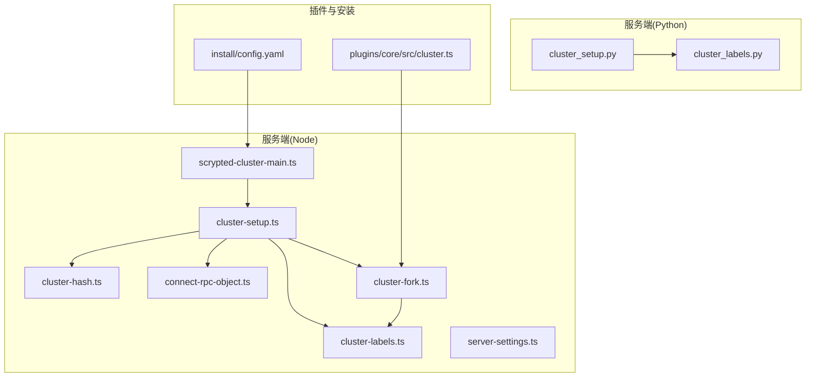
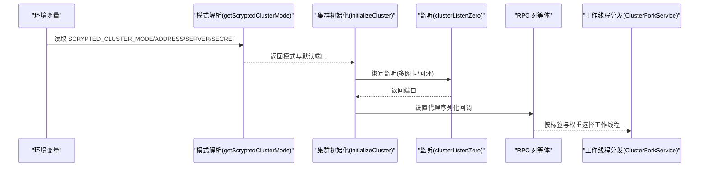
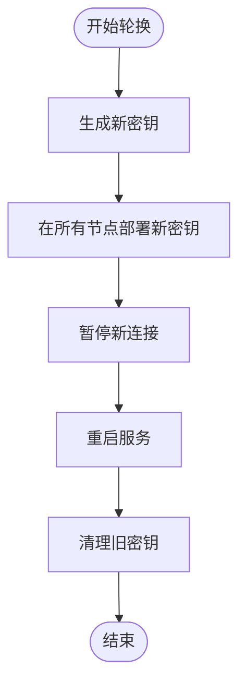
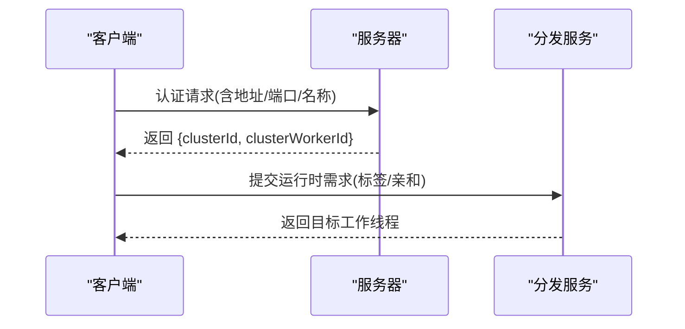
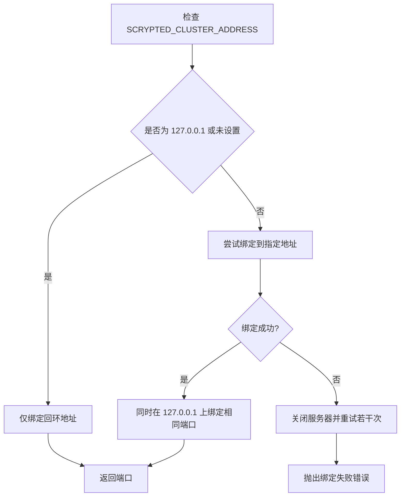
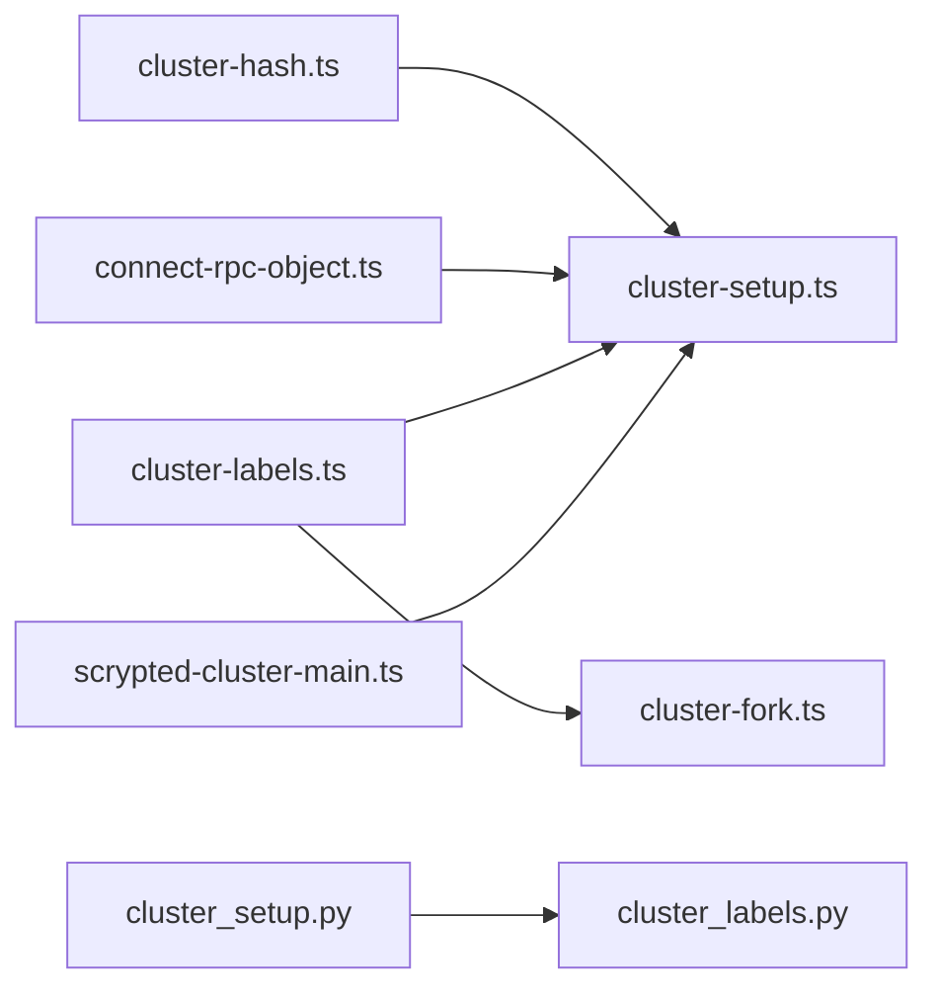

# 集群初始化配置

<cite>
**本文引用的文件**
- [server/src/cluster/cluster-setup.ts](file://server/src/cluster/cluster-setup.ts)
- [server/src/cluster/cluster-hash.ts](file://server/src/cluster/cluster-hash.ts)
- [server/src/cluster/connect-rpc-object.ts](file://server/src/cluster/connect-rpc-object.ts)
- [server/src/cluster/cluster-labels.ts](file://server/src/cluster/cluster-labels.ts)
- [server/python/cluster_setup.py](file://server/python/cluster_setup.py)
- [server/python/cluster_labels.py](file://server/python/cluster_labels.py)
- [server/src/services/cluster-fork.ts](file://server/src/services/cluster-fork.ts)
- [server/src/scrypted-cluster-main.ts](file://server/src/scrypted-cluster-main.ts)
- [server/src/server-settings.ts](file://server/src/server-settings.ts)
- [plugins/core/src/cluster.ts](file://plugins/core/src/cluster.ts)
- [install/config.yaml](file://install/config.yaml)
</cite>

## 目录
1. [简介](#简介)
2. [项目结构](#项目结构)
3. [核心组件](#核心组件)
4. [架构总览](#架构总览)
5. [详细组件分析](#详细组件分析)
6. [依赖分析](#依赖分析)
7. [性能考量](#性能考量)
8. [故障排查指南](#故障排查指南)
9. [结论](#结论)
10. [附录](#附录)

## 简介
本指南面向在 Scrypted 中启用并初始化“集群模式”的用户与运维人员，提供从环境准备到初始化完成的全流程配置说明。内容涵盖：
- 启动前准备：环境变量、网络与权限要求
- 密钥生成与管理：密钥格式、安全要点、轮换策略
- 集群标识与工作线程标识：唯一性、冲突避免、动态分配
- 监听端口配置：端口范围、冲突检测、回退机制
- 集群地址配置：静态地址、DHCP 解析、容器网络
- 初始化脚本与配置模板：常见部署场景
- 错误处理与故障恢复：初始化过程中的异常与恢复

## 项目结构
Scrypted 的集群初始化涉及 Node 侧与 Python 侧的协同，关键实现位于 server 目录中，并通过插件与安装脚本提供配置与运行时支持。

图示来源
- [server/src/cluster/cluster-setup.ts:38-399](file://server/src/cluster/cluster-setup.ts#L38-L399)
- [server/src/cluster/cluster-hash.ts:1-7](file://server/src/cluster/cluster-hash.ts#L1-L7)
- [server/src/cluster/connect-rpc-object.ts:1-29](file://server/src/cluster/connect-rpc-object.ts#L1-L29)
- [server/src/cluster/cluster-labels.ts:1-57](file://server/src/cluster/cluster-labels.ts#L1-L57)
- [server/src/services/cluster-fork.ts:37-102](file://server/src/services/cluster-fork.ts#L37-L102)
- [server/src/scrypted-cluster-main.ts:294-316](file://server/src/scrypted-cluster-main.ts#L294-L316)
- [server/python/cluster_setup.py:33-140](file://server/python/cluster_setup.py#L33-L140)
- [server/python/cluster_labels.py:36-54](file://server/python/cluster_labels.py#L36-L54)
- [plugins/core/src/cluster.ts:1-162](file://plugins/core/src/cluster.ts#L1-L162)
- [install/config.yaml:1-49](file://install/config.yaml#L1-L49)

章节来源
- [server/src/cluster/cluster-setup.ts:38-399](file://server/src/cluster/cluster-setup.ts#L38-L399)
- [server/src/cluster/cluster-hash.ts:1-7](file://server/src/cluster/cluster-hash.ts#L1-L7)
- [server/src/cluster/connect-rpc-object.ts:1-29](file://server/src/cluster/connect-rpc-object.ts#L1-L29)
- [server/src/cluster/cluster-labels.ts:1-57](file://server/src/cluster/cluster-labels.ts#L1-L57)
- [server/src/services/cluster-fork.ts:37-102](file://server/src/services/cluster-fork.ts#L37-L102)
- [server/src/scrypted-cluster-main.ts:294-316](file://server/src/scrypted-cluster-main.ts#L294-L316)
- [server/python/cluster_setup.py:33-140](file://server/python/cluster_setup.py#L33-L140)
- [server/python/cluster_labels.py:36-54](file://server/python/cluster_labels.py#L36-L54)
- [plugins/core/src/cluster.ts:1-162](file://plugins/core/src/cluster.ts#L1-L162)
- [install/config.yaml:1-49](file://install/config.yaml#L1-L49)

## 核心组件
- 集群初始化与监听：负责根据环境变量决定模式、绑定监听端口、建立 RPC 连接与对象序列化。
- 对象哈希校验：使用共享密钥对集群对象进行签名，确保连接合法性。
- 工作线程与标签匹配：基于标签与权重选择合适的集群工作节点，支持亲和与负载均衡。
- 客户端/服务器模式解析：解析环境变量以确定是客户端还是服务器模式，并进行参数校验。
- 插件与配置：提供集群设置界面与配置项持久化。

章节来源
- [server/src/cluster/cluster-setup.ts:38-399](file://server/src/cluster/cluster-setup.ts#L38-L399)
- [server/src/cluster/cluster-hash.ts:1-7](file://server/src/cluster/cluster-hash.ts#L1-L7)
- [server/src/cluster/cluster-labels.ts:1-57](file://server/src/cluster/cluster-labels.ts#L1-L57)
- [server/src/services/cluster-fork.ts:37-102](file://server/src/services/cluster-fork.ts#L37-L102)
- [server/src/scrypted-cluster-main.ts:294-316](file://server/src/scrypted-cluster-main.ts#L294-L316)
- [plugins/core/src/cluster.ts:1-162](file://plugins/core/src/cluster.ts#L1-L162)

## 架构总览
下图展示集群初始化的关键交互：客户端/服务器模式解析、监听端口绑定、对象序列化与哈希校验、工作线程标签匹配与分发。

图示来源
- [server/src/cluster/cluster-setup.ts:403-462](file://server/src/cluster/cluster-setup.ts#L403-L462)
- [server/src/cluster/cluster-setup.ts:464-497](file://server/src/cluster/cluster-setup.ts#L464-L497)
- [server/src/cluster/cluster-setup.ts:336-383](file://server/src/cluster/cluster-setup.ts#L336-L383)
- [server/src/services/cluster-fork.ts:40-102](file://server/src/services/cluster-fork.ts#L40-L102)

## 详细组件分析

### 环境变量与权限要求
- 必要环境变量
  - SCRYPTED_CLUSTER_MODE: server 或 client
  - SCRYPTED_CLUSTER_SECRET: 共享密钥，用于对象签名与校验
  - SCRYPTED_CLUSTER_ADDRESS: 服务器监听地址或接口名（支持 DHCP）
  - SCRYPTED_CLUSTER_SERVER: 服务器地址:端口（仅客户端有效）
- 权限要求
  - 监听端口需可绑定（通常需要非特权端口或具备相应权限）
  - 容器部署时需正确映射设备与网络（参考安装配置）

章节来源
- [server/src/cluster/cluster-setup.ts:403-462](file://server/src/cluster/cluster-setup.ts#L403-L462)
- [install/config.yaml:1-49](file://install/config.yaml#L1-L49)

### 集群密钥生成与管理
- 密钥格式与用途
  - 密钥为共享字符串，用于对集群对象进行 SHA-256 哈希签名
  - 哈希值随对象序列化写入，连接方收到后进行一致性校验
- 安全要点
  - 密钥必须保密，泄露会导致跨节点对象访问被伪造
  - 建议使用强随机源生成，长度足够且不可预测
- 密钥轮换策略
  - 建议先在所有节点更新密钥，再重启服务，最后清理旧密钥
  - 轮换期间建议暂停新增连接，确保一致性

图示来源
- [server/src/cluster/cluster-hash.ts:4-7](file://server/src/cluster/cluster-hash.ts#L4-L7)
- [server/src/cluster/cluster-setup.ts:71-76](file://server/src/cluster/cluster-setup.ts#L71-L76)

章节来源
- [server/src/cluster/cluster-hash.ts:1-7](file://server/src/cluster/cluster-hash.ts#L1-L7)
- [server/src/cluster/cluster-setup.ts:71-76](file://server/src/cluster/cluster-setup.ts#L71-L76)

### 集群 ID 与工作线程 ID 的分配机制
- 集群 ID
  - 由初始化选项传入，贯穿整个集群生命周期
  - 用于区分不同集群实例，避免跨集群对象混淆
- 工作线程 ID
  - 由服务器返回，客户端在认证后获得
  - 作为工作节点标识，参与后续分发与亲和
- 唯一性与冲突避免
  - 集群 ID 在全局应唯一；工作线程 ID 在服务器内唯一
  - 若出现重复，服务器会拒绝连接或导致对象解析失败
- 动态分配策略
  - 客户端认证成功后由服务器分配工作线程 ID
  - 分发服务按标签匹配与权重进行选择

图示来源
- [server/src/scrypted-cluster-main.ts:294-316](file://server/src/scrypted-cluster-main.ts#L294-L316)
- [server/src/services/cluster-fork.ts:40-102](file://server/src/services/cluster-fork.ts#L40-L102)

章节来源
- [server/src/scrypted-cluster-main.ts:294-316](file://server/src/scrypted-cluster-main.ts#L294-L316)
- [server/src/services/cluster-fork.ts:40-102](file://server/src/services/cluster-fork.ts#L40-L102)

### 监听端口的配置与选择
- 默认端口
  - 未显式指定时，默认端口为固定值（由模式解析函数返回）
- 端口绑定策略
  - 当 SCRYPTED_CLUSTER_ADDRESS 为 127.0.0.1 或未设置时，仅绑定回环
  - 当为具体地址时，同时绑定该地址与 127.0.0.1 到同一端口
  - 若端口被占用，最多重试若干次后抛出异常
- 冲突检测与回退
  - 绑定时若本地回环绑定失败则视为冲突
  - 多次尝试失败后抛出“无法绑定到集群地址”的错误

图示来源
- [server/src/cluster/cluster-setup.ts:464-497](file://server/src/cluster/cluster-setup.ts#L464-L497)

章节来源
- [server/src/cluster/cluster-setup.ts:403-462](file://server/src/cluster/cluster-setup.ts#L403-L462)
- [server/src/cluster/cluster-setup.ts:464-497](file://server/src/cluster/cluster-setup.ts#L464-L497)

### 集群地址配置指南
- 静态地址设置
  - 使用 IP 地址直接指定 SCRYPTED_CLUSTER_ADDRESS
- 接口名解析
  - 支持使用网络接口名，系统会解析为 IPv4 地址
- DHCP 与容器网络
  - 在容器环境中，接口名解析可适配动态 IP
  - 安装配置示例展示了主机网络与设备映射，有助于容器内网络可达性

章节来源
- [server/src/cluster/cluster-setup.ts:442-459](file://server/src/cluster/cluster-setup.ts#L442-L459)
- [install/config.yaml:1-49](file://install/config.yaml#L1-L49)

### 初始化脚本与配置模板
- 插件设置入口
  - 提供集群设置界面，支持修改工作线程标签与名称
  - 修改后可触发目标工作线程重启以应用变更
- 常见部署场景
  - 单机开发：设置 SCRYPTED_CLUSTER_MODE=server，不设置 SCRYPTED_CLUSTER_ADDRESS
  - 多机集群：设置 SCRYPTED_CLUSTER_MODE=server，SCRYPTED_CLUSTER_ADDRESS 为稳定 IP；其他节点设置 SCRYPTED_CLUSTER_MODE=client 并指向服务器
  - 容器部署：使用主机网络与设备映射，确保端口与设备可用

章节来源
- [plugins/core/src/cluster.ts:1-162](file://plugins/core/src/cluster.ts#L1-L162)
- [install/config.yaml:1-49](file://install/config.yaml#L1-L49)

### 初始化过程中的错误处理与故障恢复
- 参数缺失
  - 设置了模式但未设置密钥时抛错
  - 客户端模式缺少服务器地址时抛错
- 地址冲突
  - 绑定失败时抛出“无法绑定到集群地址”错误
- 连接异常
  - 对象哈希校验失败抛出“密钥不正确”
  - 远程对象不存在时回退为本地对象
- 故障恢复
  - 重试绑定若干次
  - 重新启动工作线程以应用配置变更

章节来源
- [server/src/cluster/cluster-setup.ts:403-462](file://server/src/cluster/cluster-setup.ts#L403-L462)
- [server/src/cluster/cluster-setup.ts:464-497](file://server/src/cluster/cluster-setup.ts#L464-L497)
- [server/src/cluster/cluster-setup.ts:71-76](file://server/src/cluster/cluster-setup.ts#L71-L76)
- [plugins/core/src/cluster.ts:145-153](file://plugins/core/src/cluster.ts#L145-L153)

## 依赖分析
- Node 侧
  - cluster-setup 依赖 cluster-hash 与 connect-rpc-object
  - cluster-setup 与 cluster-fork 通过标签匹配协作
  - scrypted-cluster-main 负责认证与初始化
- Python 侧
  - cluster_setup 与 cluster_labels 提供等价功能，与 Node 实现保持一致

图示来源
- [server/src/cluster/cluster-setup.ts:1-12](file://server/src/cluster/cluster-setup.ts#L1-L12)
- [server/src/cluster/cluster-hash.ts:1-7](file://server/src/cluster/cluster-hash.ts#L1-L7)
- [server/src/cluster/connect-rpc-object.ts:1-29](file://server/src/cluster/connect-rpc-object.ts#L1-L29)
- [server/src/cluster/cluster-labels.ts:1-57](file://server/src/cluster/cluster-labels.ts#L1-L57)
- [server/src/services/cluster-fork.ts:1-8](file://server/src/services/cluster-fork.ts#L1-L8)
- [server/src/scrypted-cluster-main.ts:1-10](file://server/src/scrypted-cluster-main.ts#L1-L10)
- [server/python/cluster_setup.py:1-13](file://server/python/cluster_setup.py#L1-L13)
- [server/python/cluster_labels.py:1-10](file://server/python/cluster_labels.py#L1-L10)

## 性能考量
- 端口绑定策略在多网卡场景下减少连接延迟
- 工作线程按标签匹配与权重排序，提升资源利用率
- 对象序列化时嵌入进程/线程信息，便于快速路径通信

## 故障排查指南
- “未设置 SCRYPTED_CLUSTER_SECRET”
  - 确认已设置 SCRYPTED_CLUSTER_MODE=server 或 client，并提供密钥
- “无法绑定到集群地址”
  - 检查端口占用与防火墙；确认 SCRYPTED_CLUSTER_ADDRESS 是否为有效 IP 或接口名
- “密钥不正确”
  - 核对所有节点使用的共享密钥一致
- “远程对象不存在”
  - 检查目标工作线程是否在线，对象是否在该节点上存在

章节来源
- [server/src/cluster/cluster-setup.ts:403-462](file://server/src/cluster/cluster-setup.ts#L403-L462)
- [server/src/cluster/cluster-setup.ts:464-497](file://server/src/cluster/cluster-setup.ts#L464-L497)
- [server/src/cluster/cluster-setup.ts:71-76](file://server/src/cluster/cluster-setup.ts#L71-L76)

## 结论
通过规范的环境变量配置、严格的密钥管理、合理的地址与端口规划以及完善的错误处理机制，Scrypted 的集群初始化可在多种部署场景中稳定运行。建议在生产环境中采用强密钥、静态地址与明确的标签策略，并定期演练密钥轮换与故障恢复流程。

## 附录
- 常用环境变量速查
  - SCRYPTED_CLUSTER_MODE: server/client
  - SCRYPTED_CLUSTER_SECRET: 共享密钥
  - SCRYPTED_CLUSTER_ADDRESS: 监听地址或接口名
  - SCRYPTED_CLUSTER_SERVER: 服务器地址:端口（客户端）
  - SCRYPTED_CLUSTER_LABELS: 标签列表
  - SCRYPTED_CLUSTER_WEIGHT: 权重
- 参考实现位置
  - 模式解析与端口绑定：[server/src/cluster/cluster-setup.ts:403-462](file://server/src/cluster/cluster-setup.ts#L403-L462)
  - 监听绑定与回退：[server/src/cluster/cluster-setup.ts:464-497](file://server/src/cluster/cluster-setup.ts#L464-L497)
  - 对象哈希与校验：[server/src/cluster/cluster-hash.ts:1-7](file://server/src/cluster/cluster-hash.ts#L1-L7)
  - 标签匹配与分发：[server/src/cluster/cluster-labels.ts:1-57](file://server/src/cluster/cluster-labels.ts#L1-L57)、[server/src/services/cluster-fork.ts:37-102](file://server/src/services/cluster-fork.ts#L37-L102)
  - 客户端认证与初始化：[server/src/scrypted-cluster-main.ts:294-316](file://server/src/scrypted-cluster-main.ts#L294-L316)
  - 插件设置与重启：[plugins/core/src/cluster.ts:1-162](file://plugins/core/src/cluster.ts#L1-L162)
  - 容器网络示例：[install/config.yaml:1-49](file://install/config.yaml#L1-L49)