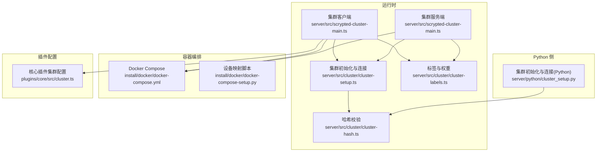
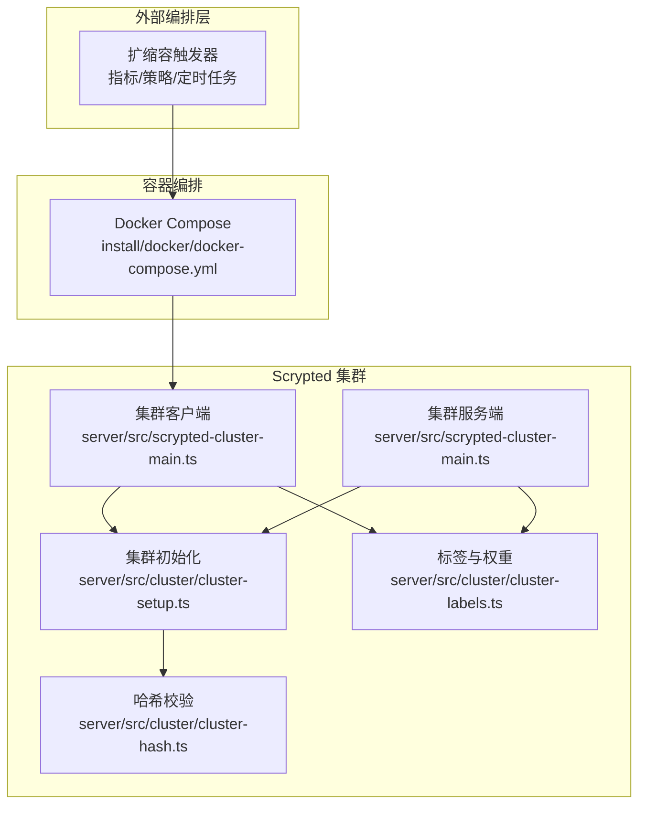
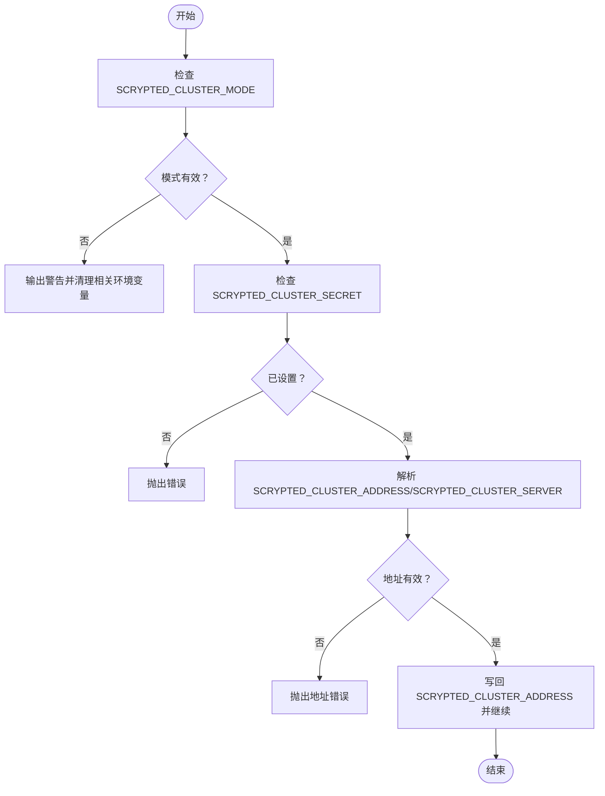
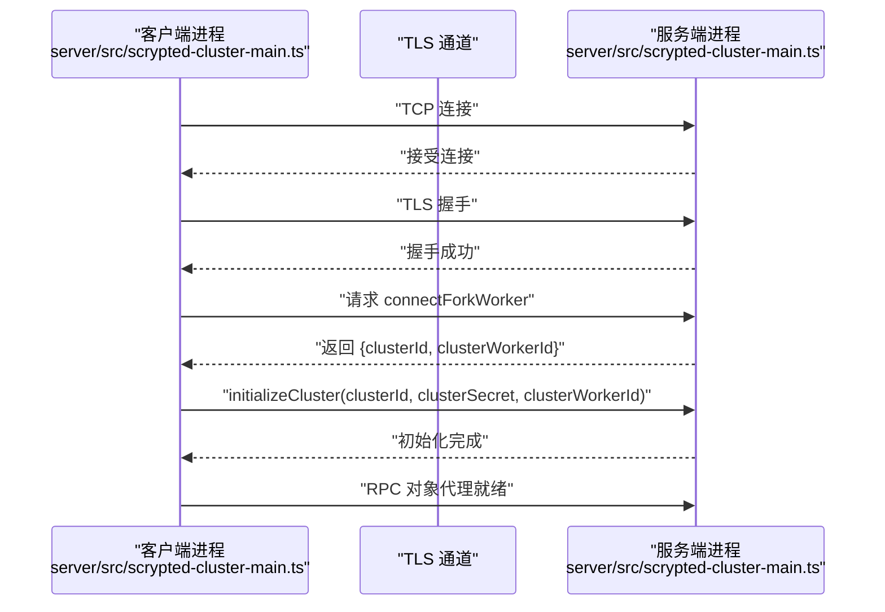
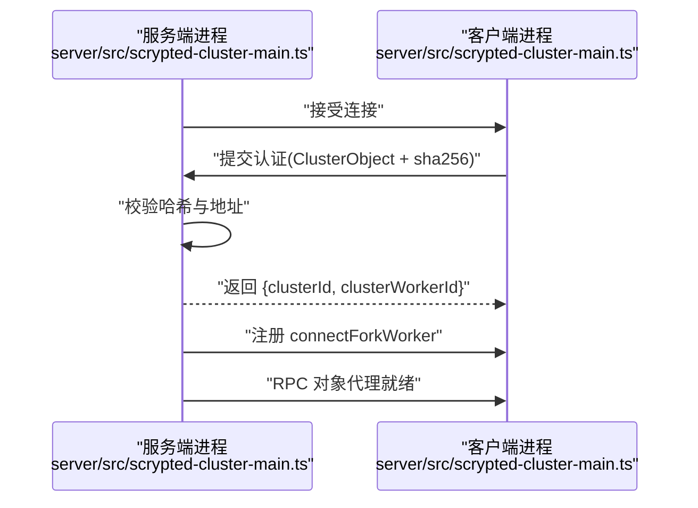
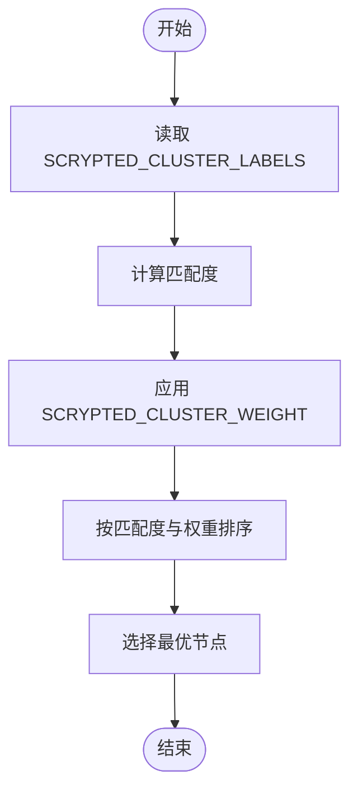
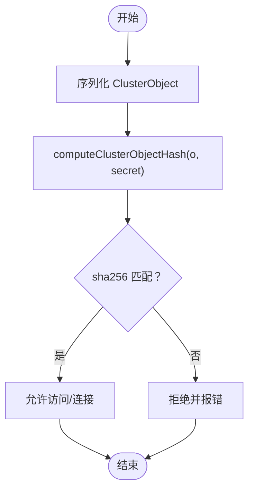
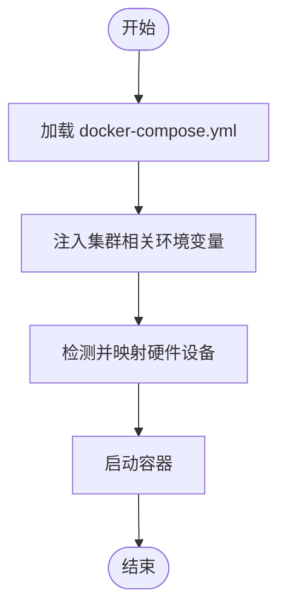
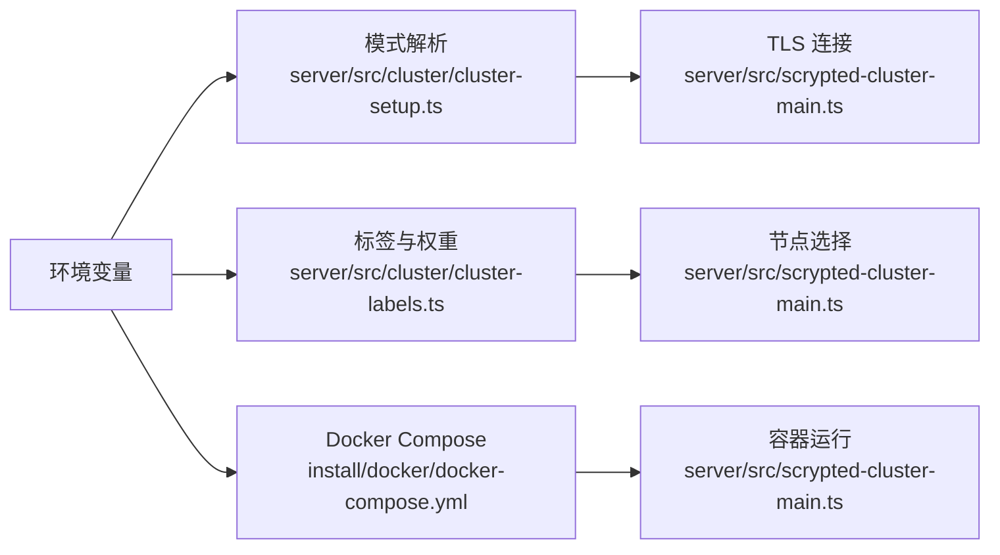

# 扩缩容自动化

<cite>
**本文引用的文件**
- [server/src/cluster/cluster-setup.ts](file://server/src/cluster/cluster-setup.ts)
- [server/python/cluster_setup.py](file://server/python/cluster_setup.py)
- [server/src/cluster/cluster-hash.ts](file://server/src/cluster/cluster-hash.ts)
- [server/src/cluster/cluster-labels.ts](file://server/src/cluster/cluster-labels.ts)
- [server/src/scrypted-cluster-main.ts](file://server/src/scrypted-cluster-main.ts)
- [install/docker/docker-compose.yml](file://install/docker/docker-compose.yml)
- [install/docker/docker-compose-setup.py](file://install/docker/docker-compose-setup.py)
- [plugins/core/src/cluster.ts](file://plugins/core/src/cluster.ts)
</cite>

## 目录
1. [引言](#引言)
2. [项目结构](#项目结构)
3. [核心组件](#核心组件)
4. [架构总览](#架构总览)
5. [详细组件分析](#详细组件分析)
6. [依赖分析](#依赖分析)
7. [性能考虑](#性能考虑)
8. [故障排查指南](#故障排查指南)
9. [结论](#结论)
10. [附录](#附录)

## 引言
本文件面向在容器或分布式环境中部署 Scrypted 的用户与运维工程师，系统化阐述“集群扩缩容自动化”的设计原理、实现机制与最佳实践。文档聚焦以下目标：
- 设计原理：触发条件、决策逻辑、执行流程
- 实现机制：状态监控、阈值判断、命令执行、结果反馈
- 安全机制：权限控制、操作审计、异常处理、通知机制
- 自动化配置：参数设置、规则定义、日志配置、告警设置
- 最佳实践与常见问题诊断

需要特别说明的是：当前仓库中未发现直接的“扩缩容自动化脚本”。本文基于 Scrypted 已有的集群通信、标签选择、权重分配与容器编排能力，给出可落地的自动化扩缩容方案设计与实施建议。

## 项目结构
围绕扩缩容自动化，Scrypted 提供了如下关键能力：
- 集群通信与对象代理：通过 TLS 连接建立 RPC 对象跨节点访问
- 标签匹配与权重：按节点标签与权重进行工作负载调度
- 容器编排与环境注入：通过 docker-compose 注入集群相关环境变量
- 插件侧配置入口：提供集群标签与名称等配置项的读写接口

**图表来源**
- [server/src/scrypted-cluster-main.ts:213-330](file://server/src/scrypted-cluster-main.ts#L213-L330)
- [server/src/cluster/cluster-setup.ts:38-399](file://server/src/cluster/cluster-setup.ts#L38-L399)
- [server/src/cluster/cluster-labels.ts:4-58](file://server/src/cluster/cluster-labels.ts#L4-L58)
- [server/src/cluster/cluster-hash.ts:4-7](file://server/src/cluster/cluster-hash.ts#L4-L7)
- [server/python/cluster_setup.py:97-239](file://server/python/cluster_setup.py#L97-L239)
- [install/docker/docker-compose.yml:20-169](file://install/docker/docker-compose.yml#L20-L169)
- [install/docker/docker-compose-setup.py:1-46](file://install/docker/docker-compose-setup.py#L1-L46)
- [plugins/core/src/cluster.ts:74-147](file://plugins/core/src/cluster.ts#L74-L147)

**章节来源**
- [server/src/scrypted-cluster-main.ts:213-330](file://server/src/scrypted-cluster-main.ts#L213-L330)
- [server/src/cluster/cluster-setup.ts:38-399](file://server/src/cluster/cluster-setup.ts#L38-L399)
- [server/src/cluster/cluster-labels.ts:4-58](file://server/src/cluster/cluster-labels.ts#L4-L58)
- [server/src/cluster/cluster-hash.ts:4-7](file://server/src/cluster/cluster-hash.ts#L4-L7)
- [server/python/cluster_setup.py:97-239](file://server/python/cluster_setup.py#L97-L239)
- [install/docker/docker-compose.yml:20-169](file://install/docker/docker-compose.yml#L20-L169)
- [install/docker/docker-compose-setup.py:1-46](file://install/docker/docker-compose-setup.py#L1-L46)
- [plugins/core/src/cluster.ts:74-147](file://plugins/core/src/cluster.ts#L74-L147)

## 核心组件
- 集群模式解析与地址绑定：负责解析 SCRYPTED_CLUSTER_MODE、SCRYPTED_CLUSTER_ADDRESS、SCRYPTED_CLUSTER_SERVER 等环境变量，并在服务端模式下绑定监听地址与端口。
- 集群初始化与连接：客户端发起 TLS 连接，服务端完成认证与握手，随后双方建立 RPC 对象代理通道。
- 标签与权重：根据 SCRYPTED_CLUSTER_LABELS 与 SCRYPTED_CLUSTER_WEIGHT 决定节点调度优先级与匹配度。
- 哈希校验：使用 SCRYPTED_CLUSTER_SECRET 对集群对象进行签名，防止中间人篡改。
- 容器编排：通过 docker-compose 注入环境变量与设备映射，确保硬件加速与外部设备可用。

**章节来源**
- [server/src/cluster/cluster-setup.ts:403-462](file://server/src/cluster/cluster-setup.ts#L403-L462)
- [server/src/scrypted-cluster-main.ts:213-330](file://server/src/scrypted-cluster-main.ts#L213-L330)
- [server/src/cluster/cluster-labels.ts:37-46](file://server/src/cluster/cluster-labels.ts#L37-L46)
- [server/src/cluster/cluster-hash.ts:4-7](file://server/src/cluster/cluster-hash.ts#L4-L7)
- [install/docker/docker-compose.yml:25-90](file://install/docker/docker-compose.yml#L25-L90)

## 架构总览
下图展示了扩缩容自动化在 Scrypted 中的运行时交互：由外部编排系统（如 Kubernetes、Docker Swarm 或自研脚本）根据指标触发扩缩容动作；Scrypted 集群通过标签与权重进行节点选择与负载均衡；TLS 保证通信安全；RPC 对象代理实现跨节点调用。

**图表来源**
- [server/src/scrypted-cluster-main.ts:213-330](file://server/src/scrypted-cluster-main.ts#L213-L330)
- [server/src/cluster/cluster-setup.ts:38-399](file://server/src/cluster/cluster-setup.ts#L38-L399)
- [server/src/cluster/cluster-hash.ts:4-7](file://server/src/cluster/cluster-hash.ts#L4-L7)
- [server/src/cluster/cluster-labels.ts:4-58](file://server/src/cluster/cluster-labels.ts#L4-L58)
- [install/docker/docker-compose.yml:20-169](file://install/docker/docker-compose.yml#L20-L169)

## 详细组件分析

### 组件一：集群模式与地址绑定
- 触发条件：当设置 SCRYPTED_CLUSTER_MODE 且未正确配置 SCRYPTED_CLUSTER_SECRET 时，会抛出错误；若仅设置了 SCRYPTED_CLUSTER_ADDRESS 而未设置模式，将被忽略并警告。
- 决策逻辑：服务端模式下需校验 SCRYPTED_CLUSTER_ADDRESS 是否为有效 IPv4 地址或网络接口名；客户端模式下需校验 SCRYPTED_CLUSTER_SERVER 的 host:port 格式。
- 执行流程：解析后将 SCRYPTED_CLUSTER_ADDRESS 写回进程环境，用于后续监听与连接。

**图表来源**
- [server/src/cluster/cluster-setup.ts:403-462](file://server/src/cluster/cluster-setup.ts#L403-L462)

**章节来源**
- [server/src/cluster/cluster-setup.ts:403-462](file://server/src/cluster/cluster-setup.ts#L403-L462)

### 组件二：集群初始化与连接（客户端）
- 触发条件：进程启动后进入循环，尝试连接 SCRYPTED_CLUSTER_SERVER 指定的主机与端口。
- 决策逻辑：连接成功后建立 TLS 安全通道；获取远端参数 connectForkWorker，提交本地认证信息（含哈希），获得 clusterId 与 clusterWorkerId 后初始化集群。
- 执行流程：建立 RPC 对象代理，注册 fork 参数，等待对端断开或异常。

**图表来源**
- [server/src/scrypted-cluster-main.ts:242-318](file://server/src/scrypted-cluster-main.ts#L242-L318)

**章节来源**
- [server/src/scrypted-cluster-main.ts:242-318](file://server/src/scrypted-cluster-main.ts#L242-L318)

### 组件三：集群初始化与连接（服务端）
- 触发条件：有客户端发起连接。
- 决策逻辑：计算哈希校验与地址匹配，通过后创建 RunningClusterWorker 记录并注册 connectForkWorker 参数。
- 执行流程：建立 RPC 对象代理，注册 fork 参数，维护连接生命周期。

**图表来源**
- [server/src/scrypted-cluster-main.ts:360-404](file://server/src/scrypted-cluster-main.ts#L360-L404)

**章节来源**
- [server/src/scrypted-cluster-main.ts:360-404](file://server/src/scrypted-cluster-main.ts#L360-L404)

### 组件四：标签匹配与权重
- 触发条件：节点启动时读取 SCRYPTED_CLUSTER_LABELS 与 SCRYPTED_CLUSTER_WEIGHT。
- 决策逻辑：对每个候选节点计算匹配度（require 全部满足、any 至少一个满足、prefer 偏好标签加分），结合权重进行排序。
- 执行流程：在 fork 时根据匹配度与权重选择最优节点。

**图表来源**
- [server/src/cluster/cluster-labels.ts:4-58](file://server/src/cluster/cluster-labels.ts#L4-L58)

**章节来源**
- [server/src/cluster/cluster-labels.ts:4-58](file://server/src/cluster/cluster-labels.ts#L4-L58)

### 组件五：哈希校验
- 触发条件：任何集群对象序列化/反序列化时。
- 决策逻辑：使用 SCRYPTED_CLUSTER_SECRET 对对象字段进行哈希，确保对象完整性与来源可信。
- 执行流程：生成/验证 sha256，不一致则拒绝连接或对象访问。

**图表来源**
- [server/src/cluster/cluster-hash.ts:4-7](file://server/src/cluster/cluster-hash.ts#L4-L7)

**章节来源**
- [server/src/cluster/cluster-hash.ts:4-7](file://server/src/cluster/cluster-hash.ts#L4-L7)

### 组件六：容器编排与环境注入
- 触发条件：部署/更新 Scrypted 服务。
- 决策逻辑：通过 docker-compose.yml 注入环境变量（如 SCRYPTED_CLUSTER_MODE、SCRYPTED_CLUSTER_SECRET、SCRYPTED_CLUSTER_ADDRESS/SCRYPTED_CLUSTER_SERVER），并按需映射硬件设备。
- 执行流程：启动容器，集群客户端根据环境变量自动连接服务端。

**图表来源**
- [install/docker/docker-compose.yml:25-90](file://install/docker/docker-compose.yml#L25-L90)
- [install/docker/docker-compose-setup.py:32-42](file://install/docker/docker-compose-setup.py#L32-L42)

**章节来源**
- [install/docker/docker-compose.yml:25-90](file://install/docker/docker-compose.yml#L25-L90)
- [install/docker/docker-compose-setup.py:32-42](file://install/docker/docker-compose-setup.py#L32-L42)

### 组件七：插件侧配置入口
- 触发条件：在核心插件中读取/写入 SCRYPTED_CLUSTER_LABELS 与 SCRYPTED_CLUSTER_WORKER_NAME。
- 决策逻辑：将用户输入转换为环境变量，供运行时读取。
- 执行流程：更新 .env 文件并重启相关服务以生效。

**章节来源**
- [plugins/core/src/cluster.ts:74-147](file://plugins/core/src/cluster.ts#L74-L147)

## 依赖分析
- 运行时依赖：TLS 安全通道、RPC 序列化、事件循环与套接字管理
- 外部依赖：Docker Compose、硬件设备路径、网络接口
- 环境变量：SCRYPTED_CLUSTER_MODE、SCRYPTED_CLUSTER_SECRET、SCRYPTED_CLUSTER_ADDRESS/SCRYPTED_CLUSTER_SERVER、SCRYPTED_CLUSTER_LABELS、SCRYPTED_CLUSTER_WEIGHT、SCRYPTED_CLUSTER_WORKER_NAME

**图表来源**
- [server/src/cluster/cluster-setup.ts:403-462](file://server/src/cluster/cluster-setup.ts#L403-L462)
- [server/src/cluster/cluster-labels.ts:37-46](file://server/src/cluster/cluster-labels.ts#L37-L46)
- [server/src/scrypted-cluster-main.ts:213-330](file://server/src/scrypted-cluster-main.ts#L213-L330)
- [install/docker/docker-compose.yml:25-90](file://install/docker/docker-compose.yml#L25-L90)

**章节来源**
- [server/src/cluster/cluster-setup.ts:403-462](file://server/src/cluster/cluster-setup.ts#L403-L462)
- [server/src/cluster/cluster-labels.ts:37-46](file://server/src/cluster/cluster-labels.ts#L37-L46)
- [server/src/scrypted-cluster-main.ts:213-330](file://server/src/scrypted-cluster-main.ts#L213-L330)
- [install/docker/docker-compose.yml:25-90](file://install/docker/docker-compose.yml#L25-L90)

## 性能考虑
- 连接复用与保活：客户端与服务端均启用 TCP KeepAlive，降低频繁重连带来的抖动。
- 对象代理缓存：RPC 对象代理弱引用缓存避免重复连接。
- 标签匹配优化：预计算标签集合与权重，减少 fork 时的计算开销。
- 日志与调试：容器默认禁用日志驱动以减少磁盘磨损，必要时再开启文件日志。

**章节来源**
- [server/src/scrypted-cluster-main.ts:247-248](file://server/src/scrypted-cluster-main.ts#L247-L248)
- [server/src/cluster/cluster-setup.ts:49-55](file://server/src/cluster/cluster-setup.ts#L49-L55)
- [install/docker/docker-compose.yml:123-131](file://install/docker/docker-compose.yml#L123-L131)

## 故障排查指南
- 连接失败
  - 症状：客户端无法连接服务端或 TLS 握手失败
  - 排查：确认 SCRYPTED_CLUSTER_SERVER 与端口、网络可达性、证书信任策略
  - 参考
    - [server/src/scrypted-cluster-main.ts:242-272](file://server/src/scrypted-cluster-main.ts#L242-L272)
- 认证失败
  - 症状：提示“cluster object hash mismatch”或“cluster object address mismatch”
  - 排查：核对 SCRYPTED_CLUSTER_SECRET 一致性、客户端本地地址与远端记录是否匹配
  - 参考
    - [server/src/scrypted-cluster-main.ts:360-398](file://server/src/scrypted-cluster-main.ts#L360-L398)
    - [server/src/cluster/cluster-hash.ts:4-7](file://server/src/cluster/cluster-hash.ts#L4-L7)
- 模式配置错误
  - 症状：仅设置 SCRYPTED_CLUSTER_ADDRESS 而未设置 SCRYPTED_CLUSTER_MODE，被忽略并警告
  - 排查：正确设置 SCRYPTED_CLUSTER_MODE 与 SCRYPTED_CLUSTER_SECRET
  - 参考
    - [server/src/cluster/cluster-setup.ts:406-418](file://server/src/cluster/cluster-setup.ts#L406-L418)
- 标签不匹配
  - 症状：节点未被选中或权重不生效
  - 排查：核对 SCRYPTED_CLUSTER_LABELS 与 SCRYPTED_CLUSTER_WEIGHT，确认 require/any/prefer 规则
  - 参考
    - [server/src/cluster/cluster-labels.ts:4-58](file://server/src/cluster/cluster-labels.ts#L4-L58)
- 容器设备不可用
  - 症状：硬件加速或 USB 设备无法使用
  - 排查：确认 docker-compose.yml 中 devices 映射，使用脚本自动检测并添加
  - 参考
    - [install/docker/docker-compose.yml:96-117](file://install/docker/docker-compose.yml#L96-L117)
    - [install/docker/docker-compose-setup.py:32-42](file://install/docker/docker-compose-setup.py#L32-L42)

**章节来源**
- [server/src/scrypted-cluster-main.ts:242-272](file://server/src/scrypted-cluster-main.ts#L242-L272)
- [server/src/scrypted-cluster-main.ts:360-398](file://server/src/scrypted-cluster-main.ts#L360-L398)
- [server/src/cluster/cluster-hash.ts:4-7](file://server/src/cluster/cluster-hash.ts#L4-L7)
- [server/src/cluster/cluster-setup.ts:406-418](file://server/src/cluster/cluster-setup.ts#L406-L418)
- [server/src/cluster/cluster-labels.ts:4-58](file://server/src/cluster/cluster-labels.ts#L4-L58)
- [install/docker/docker-compose.yml:96-117](file://install/docker/docker-compose.yml#L96-L117)
- [install/docker/docker-compose-setup.py:32-42](file://install/docker/docker-compose-setup.py#L32-L42)

## 结论
Scrypted 的集群通信与调度能力为扩缩容自动化提供了坚实基础：通过 TLS 安全通道、标签与权重选择、哈希校验与容器编排，可以构建稳定可靠的自动化扩缩容体系。结合外部监控与编排系统，即可实现从指标到执行的闭环。

## 附录

### 自动化扩缩容设计与实施建议
- 触发条件
  - CPU/内存/磁盘/网络 I/O 指标阈值
  - 摄像头/转码任务队列长度
  - 时间窗口内的平均并发数
- 决策逻辑
  - 上限：当指标持续高于阈值一段时间，触发扩容（增加节点数量或提升节点权重）
  - 下限：当指标持续低于阈值一段时间，触发缩容（减少节点数量或降低权重）
  - 动态权重：根据节点标签（如 GPU/USB/存储类型）动态调整权重，优先调度到具备硬件加速能力的节点
- 执行流程
  - 扩容：增加容器实例或节点资源，确保新节点加入集群（标签与权重生效）
  - 缩容：优雅驱逐节点上的任务，等待迁移完成后停止该节点
- 结果反馈
  - 记录扩缩容事件、时间戳、前后状态与指标快照
  - 发送通知至监控系统或运维平台

### 安全机制
- 权限控制：仅持有 SCRYPTED_CLUSTER_SECRET 的节点可接入集群
- 操作审计：记录连接、认证、fork 请求与断开事件
- 异常处理：连接失败、TLS 握手失败、哈希校验失败均应快速失败并记录日志
- 通知机制：扩缩容事件与异常应通过 webhook 或消息队列通知

### 自动化配置示例（参数设置）
- 集群模式与密钥
  - SCRYPTED_CLUSTER_MODE=server|client
  - SCRYPTED_CLUSTER_SECRET=your-secret
  - SCRYPTED_CLUSTER_ADDRESS=192.168.x.x（服务端）
  - SCRYPTED_CLUSTER_SERVER=host:port（客户端）
- 节点标签与权重
  - SCRYPTED_CLUSTER_LABELS=gpu,nvidia,usb
  - SCRYPTED_CLUSTER_WEIGHT=1.5
  - SCRYPTED_CLUSTER_WORKER_NAME=node-01
- 容器编排
  - 在 docker-compose.yml 中注入上述环境变量
  - 按需映射硬件设备（如 /dev/dri、/dev/bus/usb）

**章节来源**
- [server/src/cluster/cluster-setup.ts:403-462](file://server/src/cluster/cluster-setup.ts#L403-L462)
- [server/src/cluster/cluster-labels.ts:37-46](file://server/src/cluster/cluster-labels.ts#L37-L46)
- [install/docker/docker-compose.yml:25-90](file://install/docker/docker-compose.yml#L25-L90)
- [plugins/core/src/cluster.ts:74-147](file://plugins/core/src/cluster.ts#L74-L147)