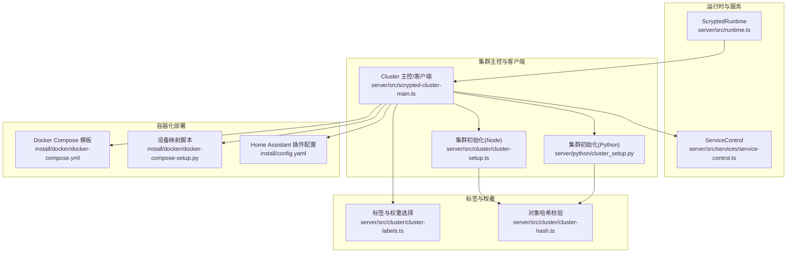
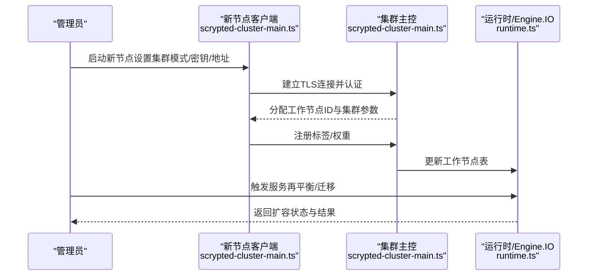
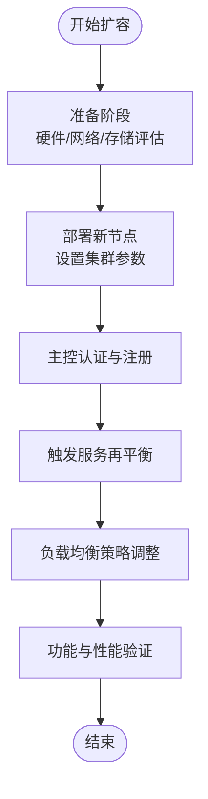
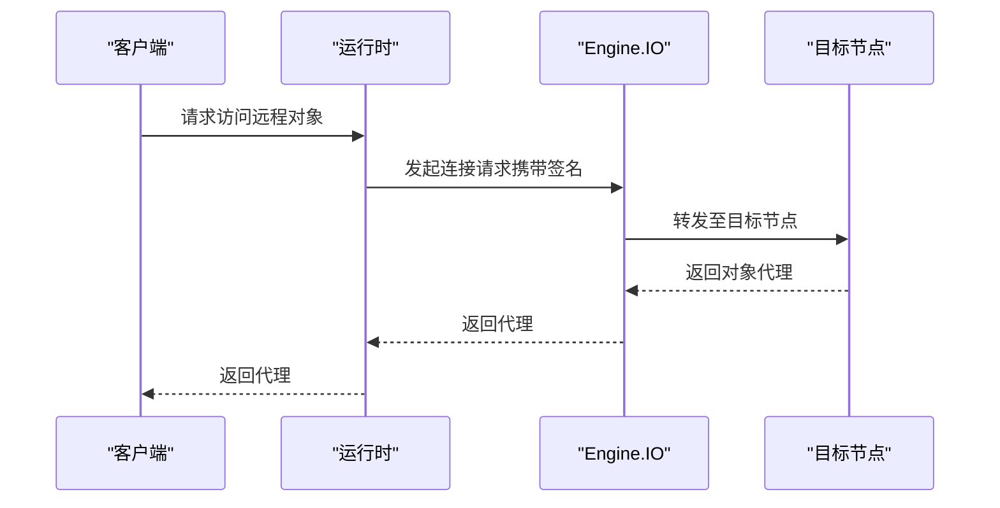
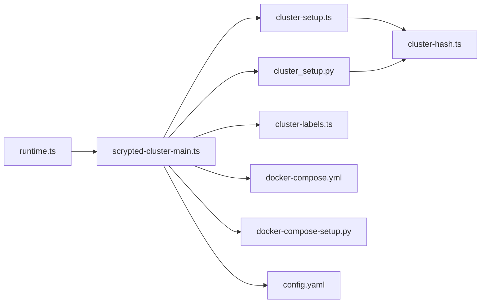

# 集群扩容流程

<cite>
**本文引用的文件**
- [server/src/cluster/cluster-setup.ts](file://server/src/cluster/cluster-setup.ts)
- [server/src/cluster/cluster-labels.ts](file://server/src/cluster/cluster-labels.ts)
- [server/src/cluster/cluster-hash.ts](file://server/src/cluster/cluster-hash.ts)
- [server/python/cluster_setup.py](file://server/python/cluster_setup.py)
- [server/src/scrypted-cluster-main.ts](file://server/src/scrypted-cluster-main.ts)
- [server/src/runtime.ts](file://server/src/runtime.ts)
- [install/docker/docker-compose.yml](file://install/docker/docker-compose.yml)
- [install/docker/docker-compose-setup.py](file://install/docker/docker-compose-setup.py)
- [install/config.yaml](file://install/config.yaml)
- [server/src/services/service-control.ts](file://server/src/services/service-control.ts)
</cite>

## 目录
1. [简介](#简介)
2. [项目结构](#项目结构)
3. [核心组件](#核心组件)
4. [架构总览](#架构总览)
5. [详细组件分析](#详细组件分析)
6. [依赖分析](#依赖分析)
7. [性能考虑](#性能考虑)
8. [故障排查指南](#故障排查指南)
9. [结论](#结论)
10. [附录](#附录)

## 简介
本指南面向在生产环境中对 Scrypted 进行集群扩容的工程团队，提供从准备到验证的完整操作手册。内容覆盖扩容前的硬件与网络评估、存储容量与带宽测试；扩容步骤（新节点部署、集群配置更新、服务重新分配、负载均衡调整）；扩容过程中的数据同步与一致性保障、冲突处理与回滚策略；以及扩容后的功能与性能验证、监控指标检查与故障演练。所有技术细节均基于仓库中实际实现进行梳理与总结。

## 项目结构
Scrypted 的集群能力由服务端运行时、集群主控与客户端、RPC 对象序列化与哈希校验、标签与权重选择器、以及容器化部署配置共同组成。下图展示与扩容相关的关键模块及其交互关系。

**图表来源**
- [server/src/runtime.ts:64-176](file://server/src/runtime.ts#L64-L176)
- [server/src/scrypted-cluster-main.ts:213-330](file://server/src/scrypted-cluster-main.ts#L213-L330)
- [server/src/cluster/cluster-setup.ts:38-399](file://server/src/cluster/cluster-setup.ts#L38-L399)
- [server/python/cluster_setup.py:33-284](file://server/python/cluster_setup.py#L33-L284)
- [server/src/cluster/cluster-labels.ts:4-57](file://server/src/cluster/cluster-labels.ts#L4-L57)
- [server/src/cluster/cluster-hash.ts:4-7](file://server/src/cluster/cluster-hash.ts#L4-L7)
- [install/docker/docker-compose.yml:20-169](file://install/docker/docker-compose.yml#L20-L169)
- [install/docker/docker-compose-setup.py:1-46](file://install/docker/docker-compose-setup.py#L1-L46)
- [install/config.yaml:1-49](file://install/config.yaml#L1-L49)

**章节来源**
- [server/src/runtime.ts:64-176](file://server/src/runtime.ts#L64-L176)
- [server/src/scrypted-cluster-main.ts:213-330](file://server/src/scrypted-cluster-main.ts#L213-L330)
- [server/src/cluster/cluster-setup.ts:38-399](file://server/src/cluster/cluster-setup.ts#L38-L399)
- [server/python/cluster_setup.py:33-284](file://server/python/cluster_setup.py#L33-L284)
- [server/src/cluster/cluster-labels.ts:4-57](file://server/src/cluster/cluster-labels.ts#L4-L57)
- [server/src/cluster/cluster-hash.ts:4-7](file://server/src/cluster/cluster-hash.ts#L4-L7)
- [install/docker/docker-compose.yml:20-169](file://install/docker/docker-compose.yml#L20-L169)
- [install/docker/docker-compose-setup.py:1-46](file://install/docker/docker-compose-setup.py#L1-L46)
- [install/config.yaml:1-49](file://install/config.yaml#L1-L49)

## 核心组件
- 运行时与服务
  - 运行时负责集群对象的连接、代理与安全校验，并通过 Engine.IO 提供 RPC 对象转发通道。
  - 服务控制支持通过 Webhook 触发更新或本地重启，便于扩容后快速生效。
- 集群主控与客户端
  - 主控/客户端通过 TLS 建立长连接，完成认证、初始化集群参数、注册工作节点与分叉执行器。
  - 初始化过程中会计算对象哈希以确保跨节点访问的安全性。
- 标签与权重
  - 工作节点可携带标签与权重，用于按需调度与优先级选择，提升扩容后的资源利用率。
- 容器化部署
  - Docker Compose 提供标准化的服务编排与卷挂载；设备映射脚本自动注入宿主机设备；HA 插件配置定义了硬件直连与权限。

**章节来源**
- [server/src/runtime.ts:64-176](file://server/src/runtime.ts#L64-L176)
- [server/src/scrypted-cluster-main.ts:213-330](file://server/src/scrypted-cluster-main.ts#L213-L330)
- [server/src/cluster/cluster-labels.ts:4-57](file://server/src/cluster/cluster-labels.ts#L4-L57)
- [server/src/cluster/cluster-hash.ts:4-7](file://server/src/cluster/cluster-hash.ts#L4-L7)
- [install/docker/docker-compose.yml:20-169](file://install/docker/docker-compose.yml#L20-L169)
- [install/docker/docker-compose-setup.py:1-46](file://install/docker/docker-compose-setup.py#L1-L46)
- [install/config.yaml:1-49](file://install/config.yaml#L1-L49)

## 架构总览
扩容涉及“新增节点加入集群”和“现有服务迁移/再平衡”的双重目标。下图展示了扩容前后关键交互路径。

**图表来源**
- [server/src/scrypted-cluster-main.ts:213-330](file://server/src/scrypted-cluster-main.ts#L213-L330)
- [server/src/runtime.ts:64-176](file://server/src/runtime.ts#L64-L176)

**章节来源**
- [server/src/scrypted-cluster-main.ts:213-330](file://server/src/scrypted-cluster-main.ts#L213-L330)
- [server/src/runtime.ts:64-176](file://server/src/runtime.ts#L64-L176)

## 详细组件分析

### 扩容前准备
- 硬件资源评估
  - CPU/内存/显存：根据插件与转码需求评估，必要时启用 GPU 加速（参考容器设备映射）。
  - 存储：确认 NVR 录像卷与共享存储可用性与容量，避免扩容后写入瓶颈。
  - 网络：确保新节点与主控在同一二层或三层可达，且防火墙放行集群端口。
- 网络规划
  - 明确集群地址与端口，避免 DHCP 变更导致的地址漂移。
  - 如使用 HA 插件，确认宿主机网络与 USB/GPU 设备直连。
- 存储容量检查
  - 使用容器卷挂载或网络存储（如 SMB/NFS），确保扩容后数据可读写。
- 带宽测试
  - 在生产网络上进行吞吐与延迟测试，评估视频流与并发请求承载能力。

**章节来源**
- [install/docker/docker-compose.yml:20-169](file://install/docker/docker-compose.yml#L20-L169)
- [install/config.yaml:1-49](file://install/config.yaml#L1-L49)

### 扩容步骤
- 新节点部署
  - 设置集群模式、密钥与地址（主控模式需绑定有效 IPv4 地址；客户端模式需提供服务器地址与端口）。
  - 启动容器或服务，等待与主控建立 TLS 连接并完成认证。
- 集群配置更新
  - 在主控侧确认新节点已注册，检查标签与权重是否符合预期。
- 服务重新分配
  - 通过运行时触发服务再平衡，将部分负载迁移到新节点。
- 负载均衡调整
  - 结合标签与权重策略，优化任务分发，避免热点节点过载。

**图表来源**
- [server/src/scrypted-cluster-main.ts:213-330](file://server/src/scrypted-cluster-main.ts#L213-L330)
- [server/src/cluster/cluster-labels.ts:4-57](file://server/src/cluster/cluster-labels.ts#L4-L57)

**章节来源**
- [server/src/scrypted-cluster-main.ts:213-330](file://server/src/scrypted-cluster-main.ts#L213-L330)
- [server/src/cluster/cluster-labels.ts:4-57](file://server/src/cluster/cluster-labels.ts#L4-L57)

### 数据同步机制
- 增量同步策略
  - 运行时通过 Engine.IO 建立 RPC 对象转发通道，仅在需要时建立跨节点连接，减少全量复制开销。
- 一致性保证
  - 对象访问前进行哈希校验，防止中间人篡改与误路由。
- 冲突解决
  - 当节点断线重连时，主控维护工作节点表，避免重复或冲突的代理实例。
- 回滚机制
  - 通过服务控制触发更新或重启，结合备份策略实现快速回退。

**图表来源**
- [server/src/runtime.ts:118-153](file://server/src/runtime.ts#L118-L153)
- [server/src/cluster/cluster-hash.ts:4-7](file://server/src/cluster/cluster-hash.ts#L4-L7)

**章节来源**
- [server/src/runtime.ts:118-153](file://server/src/runtime.ts#L118-L153)
- [server/src/cluster/cluster-hash.ts:4-7](file://server/src/cluster/cluster-hash.ts#L4-L7)

### 扩容后的验证
- 功能测试
  - 确认各插件与设备在新节点正常工作，视频流与控制命令响应正常。
- 性能基准测试
  - 在高并发场景下测量延迟、丢帧率与 CPU/内存占用。
- 监控指标检查
  - 关注集群连接数、对象代理命中率、错误日志与告警。
- 故障演练
  - 模拟节点掉线、网络分区与磁盘故障，验证自动恢复与数据一致性。

**章节来源**
- [server/src/services/service-control.ts:4-32](file://server/src/services/service-control.ts#L4-L32)
- [server/src/runtime.ts:64-176](file://server/src/runtime.ts#L64-L176)

## 依赖分析
- 组件耦合
  - 运行时与集群主控紧密耦合，通过 TLS 与 Engine.IO 协议交互。
  - 标签与权重选择器独立于核心逻辑，便于按需调度。
- 外部依赖
  - Docker Compose 与设备映射脚本提供容器化与硬件直连能力。
  - HA 插件配置定义了宿主机权限与设备直连路径。

**图表来源**
- [server/src/runtime.ts:64-176](file://server/src/runtime.ts#L64-L176)
- [server/src/scrypted-cluster-main.ts:213-330](file://server/src/scrypted-cluster-main.ts#L213-L330)
- [server/src/cluster/cluster-setup.ts:38-399](file://server/src/cluster/cluster-setup.ts#L38-L399)
- [server/python/cluster_setup.py:33-284](file://server/python/cluster_setup.py#L33-L284)
- [server/src/cluster/cluster-labels.ts:4-57](file://server/src/cluster/cluster-labels.ts#L4-L57)
- [server/src/cluster/cluster-hash.ts:4-7](file://server/src/cluster/cluster-hash.ts#L4-L7)
- [install/docker/docker-compose.yml:20-169](file://install/docker/docker-compose.yml#L20-L169)
- [install/docker/docker-compose-setup.py:1-46](file://install/docker/docker-compose-setup.py#L1-L46)
- [install/config.yaml:1-49](file://install/config.yaml#L1-L49)

**章节来源**
- [server/src/runtime.ts:64-176](file://server/src/runtime.ts#L64-L176)
- [server/src/scrypted-cluster-main.ts:213-330](file://server/src/scrypted-cluster-main.ts#L213-L330)
- [server/src/cluster/cluster-setup.ts:38-399](file://server/src/cluster/cluster-setup.ts#L38-L399)
- [server/python/cluster_setup.py:33-284](file://server/python/cluster_setup.py#L33-L284)
- [server/src/cluster/cluster-labels.ts:4-57](file://server/src/cluster/cluster-labels.ts#L4-L57)
- [server/src/cluster/cluster-hash.ts:4-7](file://server/src/cluster/cluster-hash.ts#L4-L7)
- [install/docker/docker-compose.yml:20-169](file://install/docker/docker-compose.yml#L20-L169)
- [install/docker/docker-compose-setup.py:1-46](file://install/docker/docker-compose-setup.py#L1-L46)
- [install/config.yaml:1-49](file://install/config.yaml#L1-L49)

## 性能考虑
- 端口绑定与回环复用
  - 主控在指定地址与 127.0.0.1 上同时监听同一端口，降低回环通信开销。
- 对象代理与弱引用
  - 通过弱引用缓存远程代理，避免重复连接与内存泄漏。
- 设备直连与加速
  - 通过 Docker 设备映射与硬件直连，减少虚拟化与系统调用开销。
- 日志与调试
  - 生产环境建议关闭容器日志驱动，使用内存级设备日志，避免闪存磨损。

**章节来源**
- [server/src/cluster/cluster-setup.ts:464-497](file://server/src/cluster/cluster-setup.ts#L464-L497)
- [server/src/cluster/cluster-setup.ts:302-335](file://server/src/cluster/cluster-setup.ts#L302-L335)
- [install/docker/docker-compose.yml:96-131](file://install/docker/docker-compose.yml#L96-L131)

## 故障排查指南
- 认证失败
  - 检查集群密钥与对象哈希是否匹配；确认客户端与主控地址一致。
- 连接异常
  - 核对防火墙与端口；确认 TLS 证书与主机名；排查 Engine.IO 转发链路。
- 节点不在线
  - 查看工作节点表与心跳；必要时手动移除失效节点并重建连接。
- 更新与重启
  - 通过服务控制触发更新或重启，确保变更生效。

**章节来源**
- [server/src/scrypted-cluster-main.ts:360-404](file://server/src/scrypted-cluster-main.ts#L360-L404)
- [server/src/runtime.ts:118-153](file://server/src/runtime.ts#L118-L153)
- [server/src/services/service-control.ts:4-32](file://server/src/services/service-control.ts#L4-L32)

## 结论
Scrypted 的集群扩容以“安全认证 + 对象代理 + 标签权重 + 容器化部署”为核心，既保证了跨节点访问的一致性与安全性，又提供了灵活的调度与扩展能力。按照本指南完成准备、部署、验证与故障演练，可显著降低扩容风险并提升系统整体稳定性。

## 附录
- 常用环境变量与配置要点
  - 集群模式、地址、端口、密钥与标签权重
  - Docker 设备映射与卷挂载
  - HA 插件权限与设备直连路径

**章节来源**
- [server/src/scrypted-cluster-main.ts:403-462](file://server/src/scrypted-cluster-main.ts#L403-L462)
- [install/docker/docker-compose.yml:25-90](file://install/docker/docker-compose.yml#L25-L90)
- [install/config.yaml:23-49](file://install/config.yaml#L23-L49)