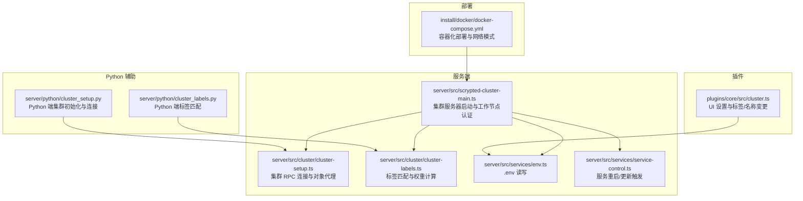
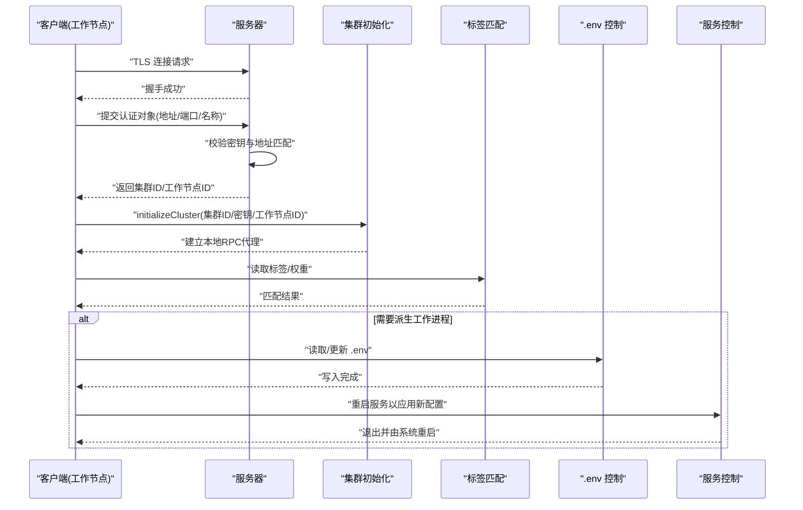
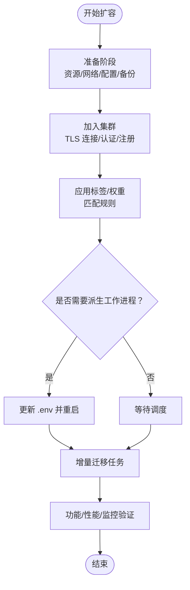
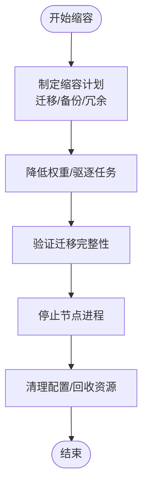
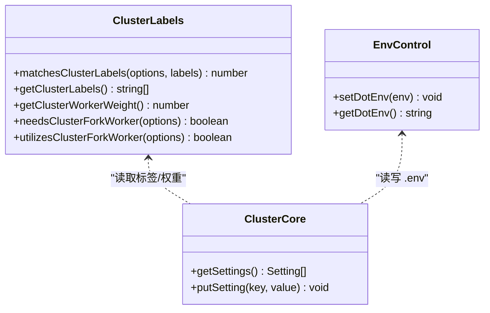
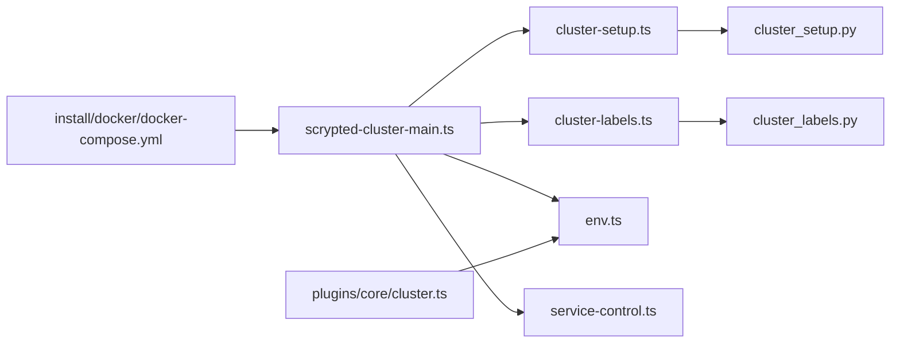

# 集群扩缩容操作

<cite>
**本文引用的文件**
- [plugins/core/src/cluster.ts](file://plugins/core/src/cluster.ts)
- [server/src/cluster/cluster-setup.ts](file://server/src/cluster/cluster-setup.ts)
- [server/src/cluster/cluster-labels.ts](file://server/src/cluster/cluster-labels.ts)
- [server/src/scrypted-cluster-main.ts](file://server/src/scrypted-cluster-main.ts)
- [server/python/cluster_setup.py](file://server/python/cluster_setup.py)
- [server/python/cluster_labels.py](file://server/python/cluster_labels.py)
- [server/src/services/service-control.ts](file://server/src/services/service-control.ts)
- [server/src/services/env.ts](file://server/src/services/env.ts)
- [install/docker/docker-compose.yml](file://install/docker/docker-compose.yml)
</cite>

## 目录
1. [简介](#简介)
2. [项目结构](#项目结构)
3. [核心组件](#核心组件)
4. [架构总览](#架构总览)
5. [详细组件分析](#详细组件分析)
6. [依赖关系分析](#依赖关系分析)
7. [性能考量](#性能考量)
8. [故障排查指南](#故障排查指南)
9. [结论](#结论)
10. [附录](#附录)

## 简介
本指南面向在 Scrypted 中进行集群扩缩容操作的运维与开发人员，系统阐述如何安全地扩展或收缩集群规模，包括扩容前准备、扩容流程（节点加入、数据/任务迁移、服务重新分配、负载均衡调整）、扩容后验证，以及缩容流程（服务迁移、数据清理、节点下线、资源回收）与风险控制。同时提供基于仓库现有能力的自动化思路与最佳实践建议。

## 项目结构
Scrypted 的集群能力由服务端主程序、客户端连接器、标签匹配与权重调度、环境变量与配置管理等模块协同实现，并通过 Docker Compose 提供容器化部署示例。以下图展示与扩缩容直接相关的核心模块与交互路径。

**图表来源**
- [server/src/scrypted-cluster-main.ts:1-410](file://server/src/scrypted-cluster-main.ts#L1-L410)
- [server/src/cluster/cluster-setup.ts:1-498](file://server/src/cluster/cluster-setup.ts#L1-L498)
- [server/src/cluster/cluster-labels.ts:1-58](file://server/src/cluster/cluster-labels.ts#L1-L58)
- [server/src/services/env.ts:1-18](file://server/src/services/env.ts#L1-L18)
- [server/src/services/service-control.ts:1-33](file://server/src/services/service-control.ts#L1-L33)
- [server/python/cluster_setup.py:1-284](file://server/python/cluster_setup.py#L1-L284)
- [server/python/cluster_labels.py:1-55](file://server/python/cluster_labels.py#L1-L55)
- [plugins/core/src/cluster.ts:1-163](file://plugins/core/src/cluster.ts#L1-L163)
- [install/docker/docker-compose.yml:1-169](file://install/docker/docker-compose.yml#L1-L169)

**章节来源**
- [server/src/scrypted-cluster-main.ts:1-410](file://server/src/scrypted-cluster-main.ts#L1-L410)
- [server/src/cluster/cluster-setup.ts:1-498](file://server/src/cluster/cluster-setup.ts#L1-L498)
- [server/src/cluster/cluster-labels.ts:1-58](file://server/src/cluster/cluster-labels.ts#L1-L58)
- [server/src/services/env.ts:1-18](file://server/src/services/env.ts#L1-L18)
- [server/src/services/service-control.ts:1-33](file://server/src/services/service-control.ts#L1-L33)
- [server/python/cluster_setup.py:1-284](file://server/python/cluster_setup.py#L1-L284)
- [server/python/cluster_labels.py:1-55](file://server/python/cluster_labels.py#L1-L55)
- [plugins/core/src/cluster.ts:1-163](file://plugins/core/src/cluster.ts#L1-L163)
- [install/docker/docker-compose.yml:1-169](file://install/docker/docker-compose.yml#L1-L169)

## 核心组件
- 集群服务器与客户端
  - 服务器负责接收来自客户端的工作节点连接，完成身份校验与工作节点注册；客户端负责以 TLS 连接服务器，提交自身标签与权重，获得集群 ID 与工作节点 ID 后进入集群 RPC 通道。
- 标签与权重调度
  - 通过环境变量与标签集合决定是否需要在当前节点上派生新的工作进程，以及在多节点场景下的优先级与权重。
- 对象代理与 RPC
  - 集群内对象通过代理与哈希签名进行跨节点访问，确保对象可见性与一致性。
- 配置与重启
  - 通过 .env 文件持久化标签与名称等设置，修改后可触发对应工作节点的重启，以应用新配置。
- 容器化部署
  - Docker Compose 提供主机网络模式与卷挂载示例，便于存储与设备直连场景。

**章节来源**
- [server/src/scrypted-cluster-main.ts:213-330](file://server/src/scrypted-cluster-main.ts#L213-L330)
- [server/src/cluster/cluster-setup.ts:38-399](file://server/src/cluster/cluster-setup.ts#L38-L399)
- [server/src/cluster/cluster-labels.ts:4-57](file://server/src/cluster/cluster-labels.ts#L4-L57)
- [server/src/services/env.ts:5-17](file://server/src/services/env.ts#L5-L17)
- [plugins/core/src/cluster.ts:27-101](file://plugins/core/src/cluster.ts#L27-L101)

## 架构总览
下图展示了从客户端发起连接到工作节点被调度执行任务的整体流程，以及标签与权重如何影响派生策略。

**图表来源**
- [server/src/scrypted-cluster-main.ts:294-330](file://server/src/scrypted-cluster-main.ts#L294-L330)
- [server/src/cluster/cluster-setup.ts:336-399](file://server/src/cluster/cluster-setup.ts#L336-L399)
- [server/src/cluster/cluster-labels.ts:44-57](file://server/src/cluster/cluster-labels.ts#L44-L57)
- [server/src/services/env.ts:9-17](file://server/src/services/env.ts#L9-L17)
- [server/src/services/service-control.ts:4-10](file://server/src/services/service-control.ts#L4-L10)

## 详细组件分析

### 扩容流程（新增节点）
- 准备阶段
  - 资源评估：确保新节点具备足够的 CPU/内存/磁盘与网络带宽，满足媒体转码、推理加速等需求。
  - 网络规划：确认新节点与服务器之间的可达性与延迟；如使用主机网络模式，需确保端口不冲突。
  - 配置准备：在新节点设置必要的环境变量（如集群模式、密钥、地址、标签、权重），并准备 .env 文件用于持久化。
  - 数据备份：对数据库与插件卷进行备份，以防扩容过程中出现异常。
- 加入集群
  - 启动客户端：客户端根据环境变量连接服务器，完成 TLS 握手与认证。
  - 注册工作节点：服务器校验后为新节点分配工作节点 ID 并建立 RPC 通道。
  - 应用标签：客户端读取标签与权重，若匹配到需要派生工作进程的条件，则更新 .env 并触发重启。
- 服务重新分配与负载均衡
  - 标签匹配：根据 require/any/prefer 规则与权重，系统将计算出各节点的调度权重，优先将符合标签的服务迁移到新节点。
  - 增量同步：新节点加入后，系统逐步将部分任务迁移到该节点，避免一次性迁移导致的抖动。
- 验证
  - 功能测试：确认媒体流、设备控制、自动化等功能正常。
  - 性能验证：观察 CPU/内存/网络使用率，确认负载分担效果。
  - 监控检查：检查日志与指标，确保无异常连接或对象解析失败。
  - 故障演练：模拟网络分区或节点重启，验证恢复能力。

**图表来源**
- [server/src/scrypted-cluster-main.ts:213-330](file://server/src/scrypted-cluster-main.ts#L213-L330)
- [server/src/cluster/cluster-labels.ts:4-57](file://server/src/cluster/cluster-labels.ts#L4-L57)
- [server/src/services/env.ts:9-17](file://server/src/services/env.ts#L9-L17)
- [server/src/services/service-control.ts:4-10](file://server/src/services/service-control.ts#L4-L10)

**章节来源**
- [server/src/scrypted-cluster-main.ts:213-330](file://server/src/scrypted-cluster-main.ts#L213-L330)
- [server/src/cluster/cluster-labels.ts:4-57](file://server/src/cluster/cluster-labels.ts#L4-L57)
- [server/src/services/env.ts:9-17](file://server/src/services/env.ts#L9-L17)
- [server/src/services/service-control.ts:4-10](file://server/src/services/service-control.ts#L4-L10)

### 缩容流程（移除节点）
- 风险控制
  - 服务中断最小化：提前将目标节点上的工作负载迁移至其他节点，保留足够冗余。
  - 数据丢失防护：确保共享存储（如网络卷）在迁移期间可用，避免本地卷数据丢失。
  - 业务连续性保障：对关键服务（如 NVR 录制）进行双写或副本策略，缩短切换窗口。
- 服务迁移
  - 标签与权重：通过调整标签或权重，降低目标节点的调度权重，促使系统主动迁移任务。
  - 增量迁移：分批停止目标节点上的工作进程，观察系统自动接管情况。
- 节点下线与资源回收
  - 下线节点：确认无任务在运行后，停止该节点的客户端进程。
  - 清理与回收：删除 .env 中的节点特定配置，回收网络与存储资源。

**图表来源**
- [server/src/cluster/cluster-labels.ts:44-57](file://server/src/cluster/cluster-labels.ts#L44-L57)
- [server/src/services/env.ts:9-17](file://server/src/services/env.ts#L9-L17)

**章节来源**
- [server/src/cluster/cluster-labels.ts:44-57](file://server/src/cluster/cluster-labels.ts#L44-L57)
- [server/src/services/env.ts:9-17](file://server/src/services/env.ts#L9-L17)

### 配置与标签管理
- 标签与权重
  - 环境变量 SCRYPTED_CLUSTER_LABELS 定义节点标签集合；SCRYPTED_CLUSTER_WEIGHT 定义权重。
  - 标签匹配规则：require（必须包含）、any（任选其一）、prefer（优先包含）。
- 名称与标签变更
  - 通过核心插件 UI 可设置工作节点名称与标签；变更后会更新 .env 并触发对应工作节点重启。

**图表来源**
- [server/src/cluster/cluster-labels.ts:4-57](file://server/src/cluster/cluster-labels.ts#L4-L57)
- [server/src/services/env.ts:9-17](file://server/src/services/env.ts#L9-L17)
- [plugins/core/src/cluster.ts:27-101](file://plugins/core/src/cluster.ts#L27-L101)

**章节来源**
- [server/src/cluster/cluster-labels.ts:4-57](file://server/src/cluster/cluster-labels.ts#L4-L57)
- [server/src/services/env.ts:9-17](file://server/src/services/env.ts#L9-L17)
- [plugins/core/src/cluster.ts:27-101](file://plugins/core/src/cluster.ts#L27-L101)

### 自动化脚本与工具（基于现有能力）
- 批量操作
  - 使用 .env 持久化配置，结合服务控制接口触发批量重启，以应用统一的标签/权重变更。
- 状态监控
  - 通过 RPC 对象代理与日志输出，监控连接状态、对象解析与心跳。
- 进度跟踪
  - 在迁移过程中记录任务数量变化与节点负载，结合外部监控系统进行可视化。
- 错误处理
  - 当对象解析失败或连接断开时，系统会回退到本地代理或重试连接，必要时终止并记录错误。

**章节来源**
- [server/src/services/service-control.ts:4-33](file://server/src/services/service-control.ts#L4-L33)
- [server/src/cluster/cluster-setup.ts:284-300](file://server/src/cluster/cluster-setup.ts#L284-L300)

## 依赖关系分析
- 组件耦合
  - 服务器与客户端通过 TLS 与 RPC Peer 协议耦合，对象代理通过哈希签名解耦。
  - 标签匹配与权重计算独立于具体服务，便于通用调度。
- 外部依赖
  - Docker 主机网络模式与卷挂载影响存储与设备直连能力。
  - Python 端辅助模块提供与 Node 端一致的集群初始化与监听逻辑。

**图表来源**
- [server/src/scrypted-cluster-main.ts:1-410](file://server/src/scrypted-cluster-main.ts#L1-L410)
- [server/src/cluster/cluster-setup.ts:1-498](file://server/src/cluster/cluster-setup.ts#L1-L498)
- [server/src/cluster/cluster-labels.ts:1-58](file://server/src/cluster/cluster-labels.ts#L1-L58)
- [server/src/services/env.ts:1-18](file://server/src/services/env.ts#L1-L18)
- [server/src/services/service-control.ts:1-33](file://server/src/services/service-control.ts#L1-L33)
- [server/python/cluster_setup.py:1-284](file://server/python/cluster_setup.py#L1-L284)
- [server/python/cluster_labels.py:1-55](file://server/python/cluster_labels.py#L1-L55)
- [plugins/core/src/cluster.ts:1-163](file://plugins/core/src/cluster.ts#L1-L163)
- [install/docker/docker-compose.yml:1-169](file://install/docker/docker-compose.yml#L1-L169)

**章节来源**
- [server/src/scrypted-cluster-main.ts:1-410](file://server/src/scrypted-cluster-main.ts#L1-L410)
- [server/src/cluster/cluster-setup.ts:1-498](file://server/src/cluster/cluster-setup.ts#L1-L498)
- [server/src/cluster/cluster-labels.ts:1-58](file://server/src/cluster/cluster-labels.ts#L1-L58)
- [server/src/services/env.ts:1-18](file://server/src/services/env.ts#L1-L18)
- [server/src/services/service-control.ts:1-33](file://server/src/services/service-control.ts#L1-L33)
- [server/python/cluster_setup.py:1-284](file://server/python/cluster_setup.py#L1-L284)
- [server/python/cluster_labels.py:1-55](file://server/python/cluster_labels.py#L1-L55)
- [plugins/core/src/cluster.ts:1-163](file://plugins/core/src/cluster.ts#L1-L163)
- [install/docker/docker-compose.yml:1-169](file://install/docker/docker-compose.yml#L1-L169)

## 性能考量
- 网络与端口
  - 使用主机网络模式可减少 NAT 与转发开销，但需注意端口冲突与防火墙策略。
- 存储与 I/O
  - 共享存储（NFS/CIFS）可提升迁移效率，但需关注延迟与可用性。
- 调度权重
  - 合理设置权重与标签，避免热点节点过载；对高负载服务启用专用标签池。
- 日志与诊断
  - 关闭容器默认日志驱动以减少闪存磨损，使用内存级设备日志进行问题定位。

[本节为通用指导，无需引用具体文件]

## 故障排查指南
- 认证失败
  - 检查集群密钥与地址匹配；确认服务器未开启信任豁免模式导致的地址校验失败。
- 连接断开
  - 查看 TLS 握手与 KeepAlive 配置；确认网络连通性与防火墙放行。
- 对象解析失败
  - 检查对象代理序列化与哈希签名；确认源节点与目标节点的 RPC 参数一致。
- 配置未生效
  - 确认 .env 写入成功且服务已按预期重启；检查工作节点日志中是否存在重启循环。

**章节来源**
- [server/src/scrypted-cluster-main.ts:360-404](file://server/src/scrypted-cluster-main.ts#L360-L404)
- [server/src/cluster/cluster-setup.ts:284-300](file://server/src/cluster/cluster-setup.ts#L284-L300)
- [server/src/services/env.ts:9-17](file://server/src/services/env.ts#L9-L17)
- [server/src/services/service-control.ts:4-10](file://server/src/services/service-control.ts#L4-L10)

## 结论
Scrypted 的集群扩缩容以标签与权重为核心调度依据，配合 TLS 安全连接与对象代理机制，实现了可控的任务迁移与负载均衡。通过合理的准备、严格的迁移策略与完善的验证流程，可在保证业务连续性的前提下完成扩缩容操作。建议在生产环境中结合监控与自动化工具，持续优化调度策略与资源利用率。

[本节为总结，无需引用具体文件]

## 附录
- 最佳实践
  - 扩容：先加节点再迁移任务，预留 20% 资源冗余；对关键服务使用专用标签池。
  - 缩容：先降低权重再停止，确保迁移完成后再回收资源；对共享存储进行健康检查。
- 不同规模策略
  - 小型：单服务器 + 多工作节点，标签区分存储与计算。
  - 中型：多服务器 + 负载均衡，按区域/可用区划分标签。
  - 大型：多数据中心 + 异步复制，结合多活策略与故障转移。

[本节为通用指导，无需引用具体文件]