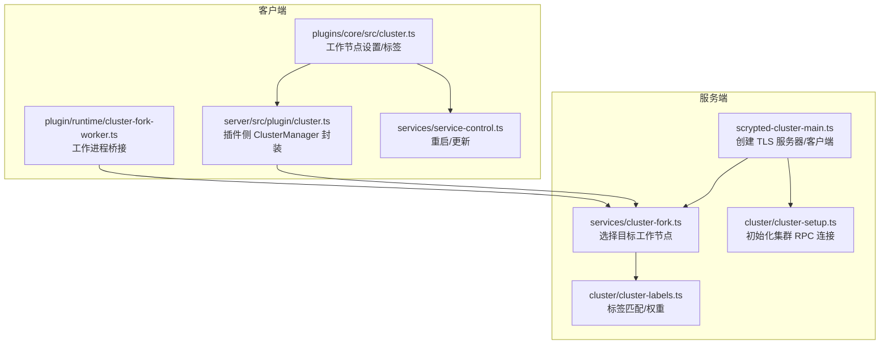
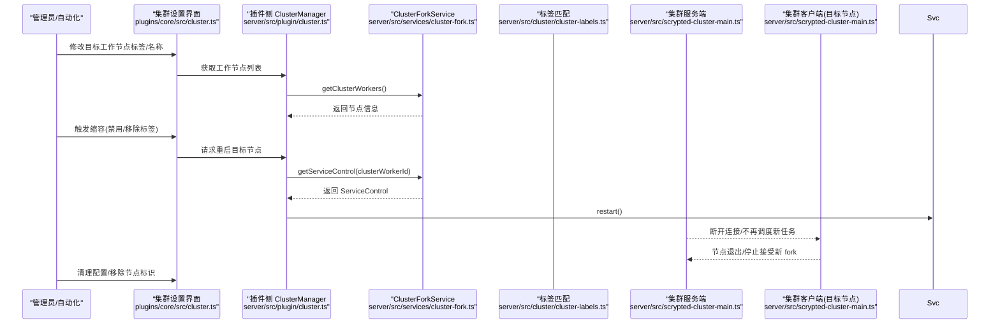
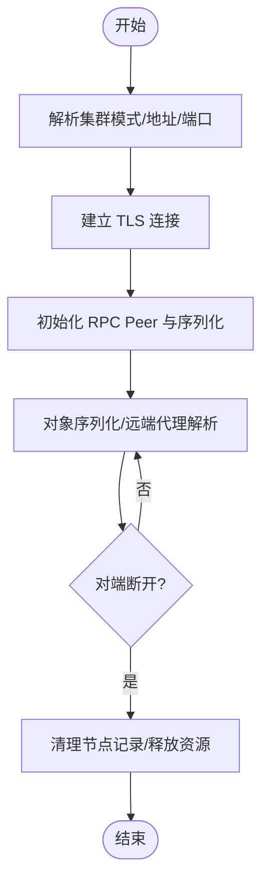
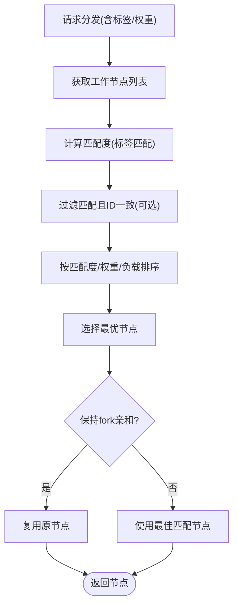
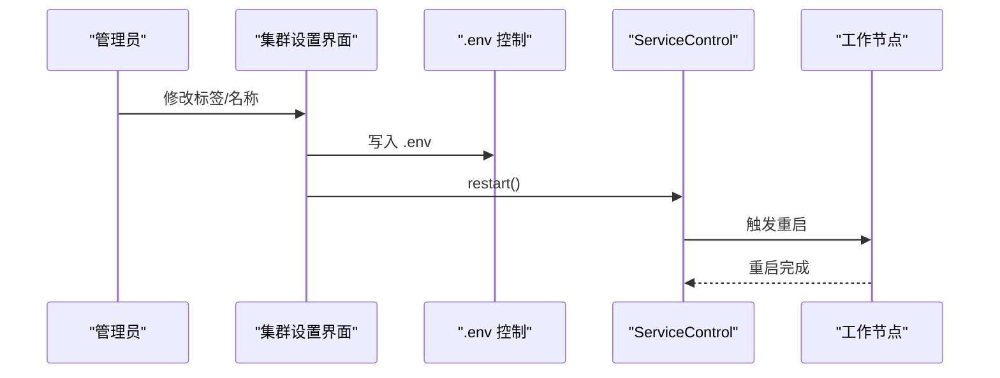
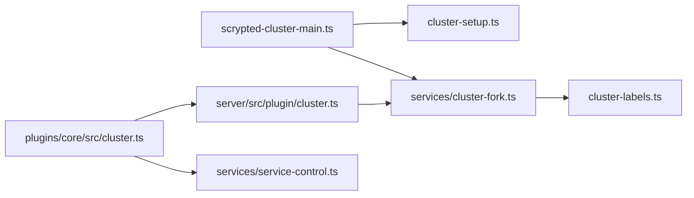

# 集群缩容流程

<cite>
**本文引用的文件**
- [server/src/cluster/cluster-setup.ts](file://server/src/cluster/cluster-setup.ts)
- [server/src/cluster/cluster-labels.ts](file://server/src/cluster/cluster-labels.ts)
- [server/src/scrypted-cluster-main.ts](file://server/src/scrypted-cluster-main.ts)
- [server/src/services/cluster-fork.ts](file://server/src/services/cluster-fork.ts)
- [plugins/core/src/cluster.ts](file://plugins/core/src/cluster.ts)
- [server/src/plugin/cluster.ts](file://server/src/plugin/cluster.ts)
- [server/src/plugin/runtime/cluster-fork-worker.ts](file://server/src/plugin/runtime/cluster-fork-worker.ts)
- [server/src/services/service-control.ts](file://server/src/services/service-control.ts)
</cite>

## 目录
1. [简介](#简介)
2. [项目结构](#项目结构)
3. [核心组件](#核心组件)
4. [架构总览](#架构总览)
5. [详细组件分析](#详细组件分析)
6. [依赖关系分析](#依赖关系分析)
7. [性能考量](#性能考量)
8. [故障排查指南](#故障排查指南)
9. [结论](#结论)
10. [附录](#附录)

## 简介
本指南面向在 Scrypted 集群环境中执行“节点缩容”的运维人员，提供从风险评估、迁移与下线、资源回收、配置清理到缩容后验证与回退的完整操作路径。文档基于仓库中集群通信、标签匹配、工作进程分发与服务控制等实现进行梳理，并结合实际可操作步骤，帮助在保证业务连续性的前提下安全地移除集群节点。

## 项目结构
Scrypted 的集群能力由服务端与客户端两部分协作构成：服务端负责认证、分配与生命周期管理；客户端负责注册、标签上报与工作负载分发。核心模块包括：
- 集群初始化与 RPC 对象连接：cluster-setup.ts
- 标签匹配与权重：cluster-labels.ts
- 集群主入口（服务端/客户端）：scrypted-cluster-main.ts
- 工作进程分发与负载均衡：services/cluster-fork.ts
- 插件侧集群管理器封装：plugin/cluster.ts
- 集群工作节点设置与重启：plugins/core/src/cluster.ts
- 集群工作进程桥接：plugin/runtime/cluster-fork-worker.ts
- 服务控制（重启/更新）：services/service-control.ts

图表来源
- [server/src/scrypted-cluster-main.ts:332-409](file://server/src/scrypted-cluster-main.ts#L332-L409)
- [server/src/cluster/cluster-setup.ts:38-399](file://server/src/cluster/cluster-setup.ts#L38-L399)
- [server/src/services/cluster-fork.ts:40-102](file://server/src/services/cluster-fork.ts#L40-L102)
- [server/src/cluster/cluster-labels.ts:4-57](file://server/src/cluster/cluster-labels.ts#L4-L57)
- [plugins/core/src/cluster.ts:27-155](file://plugins/core/src/cluster.ts#L27-L155)
- [server/src/plugin/cluster.ts:8-35](file://server/src/plugin/cluster.ts#L8-L35)
- [server/src/plugin/runtime/cluster-fork-worker.ts:10-92](file://server/src/plugin/runtime/cluster-fork-worker.ts#L10-L92)
- [server/src/services/service-control.ts:4-33](file://server/src/services/service-control.ts#L4-L33)

章节来源
- [server/src/scrypted-cluster-main.ts:332-409](file://server/src/scrypted-cluster-main.ts#L332-L409)
- [server/src/cluster/cluster-setup.ts:38-399](file://server/src/cluster/cluster-setup.ts#L38-L399)
- [server/src/services/cluster-fork.ts:40-102](file://server/src/services/cluster-fork.ts#L40-L102)
- [server/src/cluster/cluster-labels.ts:4-57](file://server/src/cluster/cluster-labels.ts#L4-L57)
- [plugins/core/src/cluster.ts:27-155](file://plugins/core/src/cluster.ts#L27-L155)
- [server/src/plugin/cluster.ts:8-35](file://server/src/plugin/cluster.ts#L8-L35)
- [server/src/plugin/runtime/cluster-fork-worker.ts:10-92](file://server/src/plugin/runtime/cluster-fork-worker.ts#L10-L92)
- [server/src/services/service-control.ts:4-33](file://server/src/services/service-control.ts#L4-L33)

## 核心组件
- 集群初始化与 RPC 连接
  - 通过环境变量确定集群模式、地址与端口，建立 TLS 客户端/服务端连接，完成对象序列化与远端代理解析。
- 标签匹配与权重
  - 基于节点标签集合与偏好标签，计算匹配度并按权重与负载进行选择。
- 工作进程分发
  - 在满足标签要求的工作节点间选择最优目标，维持 fork 亲和性与负载均衡。
- 插件侧集群管理
  - 提供获取工作节点列表、当前模式与地址的能力，便于上层插件或 UI 执行缩容操作。
- 工作节点设置与重启
  - 通过 .env 控制项动态调整标签与名称，触发工作节点重启以应用变更。
- 服务控制
  - 提供重启与更新接口，支持通过外部 webhook 或本地标记触发重启。

章节来源
- [server/src/cluster/cluster-setup.ts:38-399](file://server/src/cluster/cluster-setup.ts#L38-L399)
- [server/src/cluster/cluster-labels.ts:4-57](file://server/src/cluster/cluster-labels.ts#L4-L57)
- [server/src/services/cluster-fork.ts:40-102](file://server/src/services/cluster-fork.ts#L40-L102)
- [server/src/plugin/cluster.ts:8-35](file://server/src/plugin/cluster.ts#L8-L35)
- [plugins/core/src/cluster.ts:27-155](file://plugins/core/src/cluster.ts#L27-L155)
- [server/src/services/service-control.ts:4-33](file://server/src/services/service-control.ts#L4-L33)

## 架构总览
下图展示了服务端与客户端在集群模式下的交互流程，以及工作节点选择与对象连接的关键步骤。

图表来源
- [plugins/core/src/cluster.ts:27-155](file://plugins/core/src/cluster.ts#L27-L155)
- [server/src/plugin/cluster.ts:26-29](file://server/src/plugin/cluster.ts#L26-L29)
- [server/src/services/cluster-fork.ts:104-117](file://server/src/services/cluster-fork.ts#L104-L117)
- [server/src/services/service-control.ts:5-10](file://server/src/services/service-control.ts#L5-L10)
- [server/src/scrypted-cluster-main.ts:332-409](file://server/src/scrypted-cluster-main.ts#L332-L409)

## 详细组件分析

### 组件一：集群初始化与对象连接（服务端/客户端）
- 作用
  - 解析集群模式与网络参数，建立 TLS 双向连接，完成 RPC 对象序列化与远端代理解析。
- 关键点
  - 服务端监听指定地址/端口，客户端发起连接并校验远端地址/端口一致性。
  - 对象序列化时生成稳定 proxyId，并在同节点内避免跨 peer 引用导致竞态。
- 缩容关联
  - 当目标节点断开连接后，服务端会清理该节点记录，客户端不再被调度新任务。

图表来源
- [server/src/cluster/cluster-setup.ts:38-399](file://server/src/cluster/cluster-setup.ts#L38-L399)
- [server/src/scrypted-cluster-main.ts:213-330](file://server/src/scrypted-cluster-main.ts#L213-L330)

章节来源
- [server/src/cluster/cluster-setup.ts:38-399](file://server/src/cluster/cluster-setup.ts#L38-L399)
- [server/src/scrypted-cluster-main.ts:213-330](file://server/src/scrypted-cluster-main.ts#L213-L330)

### 组件二：标签匹配与工作节点选择
- 作用
  - 基于节点标签集合与偏好标签，计算匹配度并按权重与负载进行选择。
- 关键点
  - 支持 require/any/prefer 三类策略，优先匹配最高分且等价的节点，再按 fork 数量与权重排序。
- 缩容关联
  - 通过移除目标节点标签，使其不再匹配新任务，从而实现平滑下线。

图表来源
- [server/src/services/cluster-fork.ts:40-102](file://server/src/services/cluster-fork.ts#L40-L102)
- [server/src/cluster/cluster-labels.ts:4-57](file://server/src/cluster/cluster-labels.ts#L4-L57)

章节来源
- [server/src/services/cluster-fork.ts:40-102](file://server/src/services/cluster-fork.ts#L40-L102)
- [server/src/cluster/cluster-labels.ts:4-57](file://server/src/cluster/cluster-labels.ts#L4-L57)

### 组件三：工作节点设置与重启（用于缩容）
- 作用
  - 通过 .env 控制项动态调整标签与名称，触发工作节点重启以应用变更。
- 关键点
  - 设置项包括 SCRYPTED_CLUSTER_LABELS、SCRYPTED_CLUSTER_WORKER_NAME 等。
  - 重启通过 ServiceControl 实现，支持外部 webhook 或本地标记。
- 缩容关联
  - 通过减少/移除标签，使目标节点不再被调度新任务；随后触发重启以确保配置生效。

图表来源
- [plugins/core/src/cluster.ts:103-155](file://plugins/core/src/cluster.ts#L103-L155)
- [server/src/services/service-control.ts:5-10](file://server/src/services/service-control.ts#L5-L10)

章节来源
- [plugins/core/src/cluster.ts:103-155](file://plugins/core/src/cluster.ts#L103-L155)
- [server/src/services/service-control.ts:5-10](file://server/src/services/service-control.ts#L5-L10)

### 组件四：插件侧集群管理器封装
- 作用
  - 暴露获取工作节点列表、当前模式与地址的方法，便于插件或 UI 执行缩容操作。
- 缩容关联
  - UI 通过该接口展示节点状态，决定何时移除标签并触发重启。

章节来源
- [server/src/plugin/cluster.ts:26-29](file://server/src/plugin/cluster.ts#L26-L29)

### 组件五：工作进程桥接（客户端侧）
- 作用
  - 在客户端侧桥接 fork 结果，建立与目标节点的直接 RPC Peer，以便后续对象连接。
- 缩容关联
  - 当目标节点断开时，桥接层会感知并释放资源，避免继续向其分发任务。

章节来源
- [server/src/plugin/runtime/cluster-fork-worker.ts:57-92](file://server/src/plugin/runtime/cluster-fork-worker.ts#L57-L92)

## 依赖关系分析
- 服务端/客户端
  - scrypted-cluster-main.ts 作为统一入口，分别创建服务端 TLS 服务器与客户端 TLS 客户端，负责握手与参数传递。
- 分发与匹配
  - services/cluster-fork.ts 依赖 cluster-labels.ts 的标签匹配逻辑，结合运行时工作节点集合进行选择。
- 插件集成
  - plugins/core/src/cluster.ts 与 server/src/plugin/cluster.ts 协作，向上层提供集群管理能力。
- 重启控制
  - plugins/core/src/cluster.ts 通过 service-control.ts 的 restart/update 接口实现节点重启与更新。

图表来源
- [server/src/scrypted-cluster-main.ts:332-409](file://server/src/scrypted-cluster-main.ts#L332-L409)
- [server/src/cluster/cluster-setup.ts:38-399](file://server/src/cluster/cluster-setup.ts#L38-L399)
- [server/src/services/cluster-fork.ts:40-102](file://server/src/services/cluster-fork.ts#L40-L102)
- [server/src/cluster/cluster-labels.ts:4-57](file://server/src/cluster/cluster-labels.ts#L4-L57)
- [plugins/core/src/cluster.ts:27-155](file://plugins/core/src/cluster.ts#L27-L155)
- [server/src/plugin/cluster.ts:8-35](file://server/src/plugin/cluster.ts#L8-L35)
- [server/src/services/service-control.ts:4-33](file://server/src/services/service-control.ts#L4-L33)

章节来源
- [server/src/scrypted-cluster-main.ts:332-409](file://server/src/scrypted-cluster-main.ts#L332-L409)
- [server/src/cluster/cluster-setup.ts:38-399](file://server/src/cluster/cluster-setup.ts#L38-L399)
- [server/src/services/cluster-fork.ts:40-102](file://server/src/services/cluster-fork.ts#L40-L102)
- [server/src/cluster/cluster-labels.ts:4-57](file://server/src/cluster/cluster-labels.ts#L4-L57)
- [plugins/core/src/cluster.ts:27-155](file://plugins/core/src/cluster.ts#L27-L155)
- [server/src/plugin/cluster.ts:8-35](file://server/src/plugin/cluster.ts#L8-L35)
- [server/src/services/service-control.ts:4-33](file://server/src/services/service-control.ts#L4-L33)

## 性能考量
- 标签匹配与负载均衡
  - 通过 prefer 标签与权重，优先选择更合适的节点；当多个节点等价时，按 fork 数量与权重排序，避免热点。
- 连接与对象序列化
  - 同节点内避免跨 peer 引用，降低竞态与 GC 风险；稳定 proxyId 有助于缓存命中。
- 重启与更新
  - 重启采用进程级退出与外部控制结合的方式，尽量缩短停机窗口。

章节来源
- [server/src/services/cluster-fork.ts:70-77](file://server/src/services/cluster-fork.ts#L70-L77)
- [server/src/cluster/cluster-setup.ts:308-335](file://server/src/cluster/cluster-setup.ts#L308-L335)
- [server/src/services/service-control.ts:5-10](file://server/src/services/service-control.ts#L5-L10)

## 故障排查指南
- 无法连接集群服务端
  - 检查 SCRYPTED_CLUSTER_MODE、SCRYPTED_CLUSTER_SERVER、SCRYPTED_CLUSTER_SECRET 是否正确设置。
  - 确认 TLS 握手是否成功，关注连接与安全连接阶段的日志。
- 节点不参与调度
  - 检查节点标签是否满足 require/any/prefer 条件，必要时调整 SCRYPTED_CLUSTER_LABELS。
  - 使用插件侧 ClusterManager 获取工作节点列表，确认节点处于活动状态。
- 重启后配置未生效
  - 确认 .env 中的标签与名称已写入，触发 restart 后观察节点日志。
- 缩容后仍有任务在运行
  - 确认目标节点已断开连接，服务端已清理其记录；如仍存在 fork，检查 fork 亲和性与负载情况。

章节来源
- [server/src/scrypted-cluster-main.ts:403-462](file://server/src/scrypted-cluster-main.ts#L403-L462)
- [server/src/services/cluster-fork.ts:104-117](file://server/src/services/cluster-fork.ts#L104-L117)
- [plugins/core/src/cluster.ts:103-155](file://plugins/core/src/cluster.ts#L103-L155)

## 结论
通过结合标签匹配、工作节点选择与服务控制，Scrypted 的集群缩容可在不中断整体业务的前提下逐步移除节点。关键在于先“降权/移除标签”使节点不再承接新任务，再“重启”应用配置并等待其断开连接，最后清理相关配置与标识。配合监控与告警，可有效保障业务连续性与数据安全。

## 附录

### 风险评估与最佳实践
- 风险评估
  - 服务影响：缩容可能影响依赖特定标签或亲和性的任务；应提前识别并迁移。
  - 数据迁移：若节点承载存储或缓存，需在缩容前完成数据迁移或副本提升。
  - 业务连续性：保留至少一个等价节点以维持关键服务；对有状态任务进行隔离或迁移。
- 最佳实践
  - 先调整标签，再触发重启；避免直接强制断电。
  - 使用 prefer 标签引导流量至其他节点，逐步降低目标节点负载。
  - 记录缩容时间窗与受影响设备/任务，便于回溯与审计。

### 缩容步骤清单
- 准备阶段
  - 识别目标节点及其承载的任务/设备。
  - 备份关键配置与日志。
- 迁移与降载
  - 移除目标节点标签或设置为不可调度，使其不再承接新任务。
  - 等待现有任务完成或迁移至其他节点。
- 下线与回收
  - 触发目标节点重启以应用配置变更。
  - 确认节点断开连接，服务端清理其记录。
  - 回收节点资源（磁盘、网络、许可证等）。
- 清理与验证
  - 清理 .env 与相关配置文件中的节点标识。
  - 执行服务可用性测试、性能验证与监控确认。
  - 检查告警，确保无异常。

### 缩容后的验证清单
- 服务可用性：确认关键设备与服务正常运行。
- 性能验证：对比缩容前后吞吐与延迟指标。
- 监控确认：检查 CPU、内存、磁盘与网络使用率。
- 告警检查：确认无新增错误或警告。

### 缩容失败的处理方案
- 快速回滚
  - 恢复目标节点标签，重新纳入调度。
  - 若配置未生效，检查 .env 写入与重启流程。
- 逐步扩容
  - 临时增加等价节点以恢复服务能力，再重新规划缩容策略。
- 根因定位
  - 查看服务端/客户端日志，定位连接、TLS、标签匹配与分发问题。