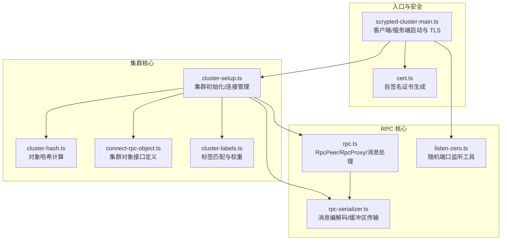
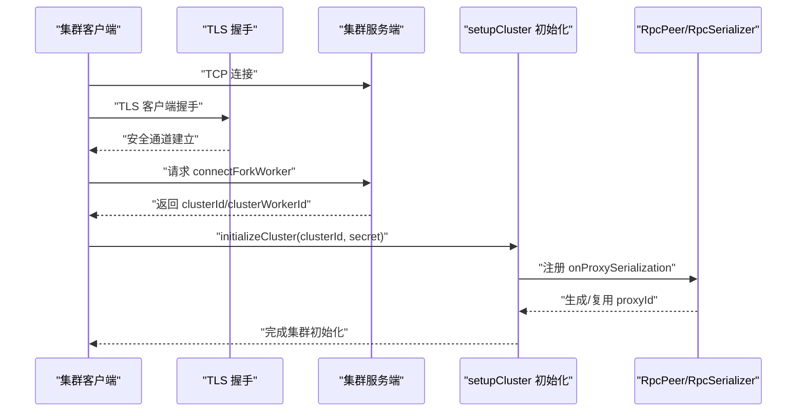
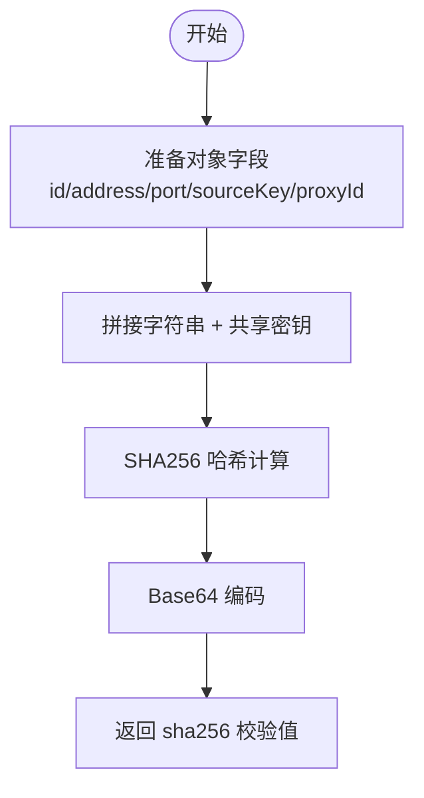
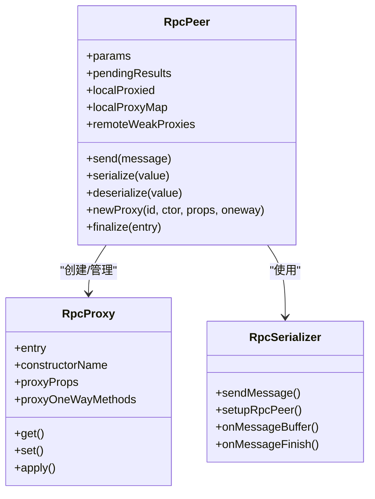
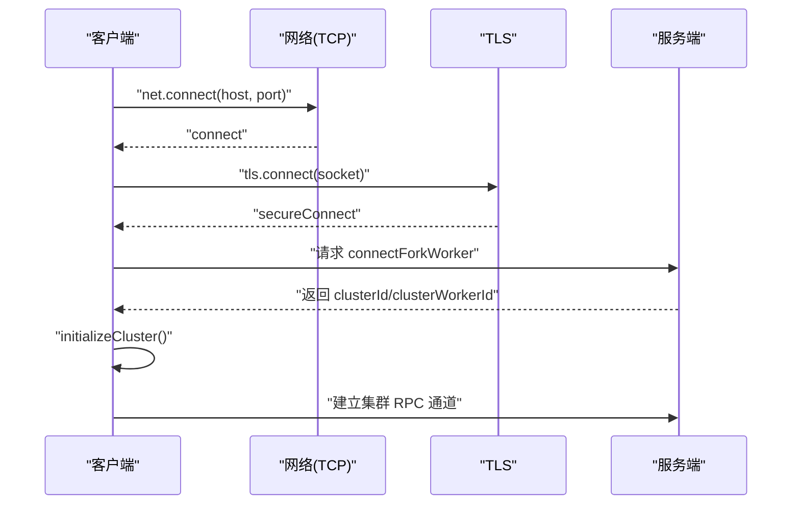
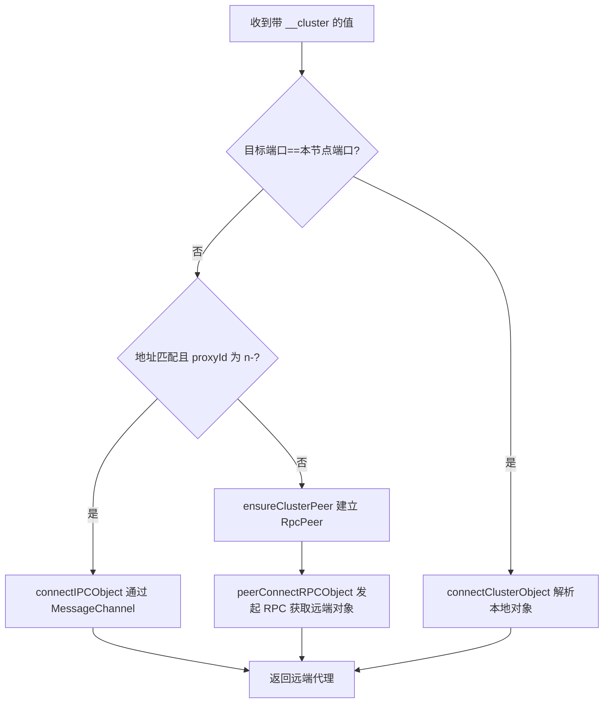
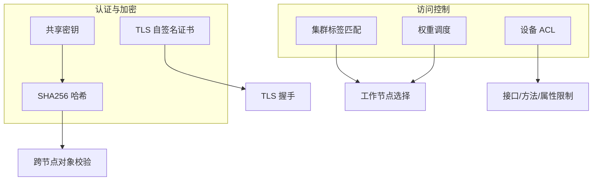
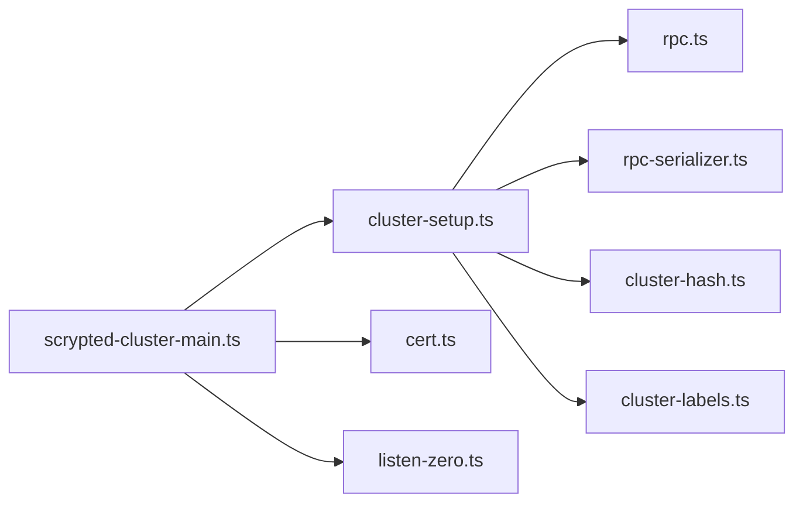

# 集群架构设计

<cite>
**本文档引用的文件**
- [cluster-hash.ts](file://server/src/cluster/cluster-hash.ts)
- [cluster-setup.ts](file://server/src/cluster/cluster-setup.ts)
- [connect-rpc-object.ts](file://server/src/cluster/connect-rpc-object.ts)
- [rpc.ts](file://server/src/rpc.ts)
- [rpc-serializer.ts](file://server/src/rpc-serializer.ts)
- [scrypted-cluster-main.ts](file://server/src/scrypted-cluster-main.ts)
- [listen-zero.ts](file://server/src/listen-zero.ts)
- [cert.ts](file://server/src/cert.ts)
- [cluster-labels.ts](file://server/src/cluster/cluster-labels.ts)
</cite>

## 目录
1. [简介](#简介)
2. [项目结构](#项目结构)
3. [核心组件](#核心组件)
4. [架构总览](#架构总览)
5. [详细组件分析](#详细组件分析)
6. [依赖关系分析](#依赖关系分析)
7. [性能考虑](#性能考虑)
8. [故障排除指南](#故障排除指南)
9. [结论](#结论)

## 简介
本文件系统性阐述 Scrypted 的集群架构设计，重点覆盖以下方面：
- 分布式架构理念与节点角色分工
- 节点发现与连接建立流程（含地址解析、端口绑定、TLS 加密）
- 集群对象哈希计算与跨节点引用机制
- RPC 对象序列化/反序列化与代理 ID 策略、属性标记与生命周期管理
- 安全机制（密钥校验、TLS 通信、访问控制策略）
- 架构图与数据流图，直观展示节点间交互与消息传递路径

## 项目结构
Scrypted 集群相关代码主要集中在 server 模块中，围绕 RPC 传输层、集群配置与安全、节点发现与连接、对象哈希与序列化等模块组织。

**图表来源**
- [cluster-setup.ts:1-498](file://server/src/cluster/cluster-setup.ts#L1-L498)
- [cluster-hash.ts:1-8](file://server/src/cluster/cluster-hash.ts#L1-L8)
- [connect-rpc-object.ts:1-29](file://server/src/cluster/connect-rpc-object.ts#L1-L29)
- [rpc.ts:285-858](file://server/src/rpc.ts#L285-L858)
- [rpc-serializer.ts:1-240](file://server/src/rpc-serializer.ts#L1-L240)
- [listen-zero.ts:1-52](file://server/src/listen-zero.ts#L1-L52)
- [scrypted-cluster-main.ts:1-410](file://server/src/scrypted-cluster-main.ts#L1-L410)
- [cert.ts:1-102](file://server/src/cert.ts#L1-L102)
- [cluster-labels.ts:1-58](file://server/src/cluster/cluster-labels.ts#L1-L58)

**章节来源**
- [cluster-setup.ts:1-498](file://server/src/cluster/cluster-setup.ts#L1-L498)
- [rpc.ts:285-858](file://server/src/rpc.ts#L285-L858)
- [rpc-serializer.ts:1-240](file://server/src/rpc-serializer.ts#L1-L240)
- [scrypted-cluster-main.ts:1-410](file://server/src/scrypted-cluster-main.ts#L1-L410)
- [listen-zero.ts:1-52](file://server/src/listen-zero.ts#L1-L52)
- [cert.ts:1-102](file://server/src/cert.ts#L1-L102)
- [cluster-labels.ts:1-58](file://server/src/cluster/cluster-labels.ts#L1-L58)

## 核心组件
- 集群对象接口：定义跨节点对象引用所需的标识字段（id、address、port、proxyId、sourceKey、sha256）。
- 集群初始化与连接：负责节点发现、TLS 连接、参数传递、RPC 对象解析与缓存。
- 对象哈希计算：基于对象元信息与共享密钥生成 SHA256 校验值，确保跨节点引用可信。
- RPC 序列化与传输：统一的消息格式、缓冲区分片传输、错误结果封装与生命周期管理。
- 安全与证书：自签名证书生成与 TLS 服务端/客户端握手，结合哈希校验实现强认证。
- 标签与权重：用于工作负载选择与调度。

**章节来源**
- [connect-rpc-object.ts:1-29](file://server/src/cluster/connect-rpc-object.ts#L1-L29)
- [cluster-setup.ts:38-399](file://server/src/cluster/cluster-setup.ts#L38-L399)
- [cluster-hash.ts:4-7](file://server/src/cluster/cluster-hash.ts#L4-L7)
- [rpc.ts:285-858](file://server/src/rpc.ts#L285-L858)
- [rpc-serializer.ts:1-240](file://server/src/rpc-serializer.ts#L1-L240)
- [scrypted-cluster-main.ts:332-410](file://server/src/scrypted-cluster-main.ts#L332-L410)
- [cert.ts:17-101](file://server/src/cert.ts#L17-L101)
- [cluster-labels.ts:4-57](file://server/src/cluster/cluster-labels.ts#L4-L57)

## 架构总览
Scrypted 集群采用“主从”或“对等”模式，通过 TLS 保护的 TCP 通道进行通信。客户端以 TLS 方式连接服务端，完成身份认证后，双方各自维护 RpcPeer 并通过 onProxySerialization 生成稳定的代理 ID，使用 SHA256 哈希与共享密钥进行对象校验，最终实现跨节点透明调用。

**图表来源**
- [scrypted-cluster-main.ts:213-330](file://server/src/scrypted-cluster-main.ts#L213-L330)
- [scrypted-cluster-main.ts:332-410](file://server/src/scrypted-cluster-main.ts#L332-L410)
- [cluster-setup.ts:336-399](file://server/src/cluster/cluster-setup.ts#L336-L399)
- [rpc-serializer.ts:5-23](file://server/src/rpc-serializer.ts#L5-L23)

**章节来源**
- [scrypted-cluster-main.ts:213-330](file://server/src/scrypted-cluster-main.ts#L213-L330)
- [scrypted-cluster-main.ts:332-410](file://server/src/scrypted-cluster-main.ts#L332-L410)
- [cluster-setup.ts:336-399](file://server/src/cluster/cluster-setup.ts#L336-L399)
- [rpc-serializer.ts:5-23](file://server/src/rpc-serializer.ts#L5-L23)

## 详细组件分析

### 集群对象与哈希计算
- 集群对象接口包含：集群 id、创建者地址、端口、源 peer 键、代理 ID、SHA256 校验值。
- 哈希计算使用 SHA256，输入为对象字段拼接与共享密钥，输出作为跨节点引用的唯一校验。
- 在序列化阶段，若本地已有该对象的集群条目且属于当前节点，则优先复用；否则生成新的代理 ID 并计算哈希，写入 __cluster 属性以便后续引用。

**图表来源**
- [cluster-hash.ts:4-7](file://server/src/cluster/cluster-hash.ts#L4-L7)
- [cluster-setup.ts:302-335](file://server/src/cluster/cluster-setup.ts#L302-L335)

**章节来源**
- [connect-rpc-object.ts:1-29](file://server/src/cluster/connect-rpc-object.ts#L1-L29)
- [cluster-hash.ts:4-7](file://server/src/cluster/cluster-hash.ts#L4-L7)
- [cluster-setup.ts:302-335](file://server/src/cluster/cluster-setup.ts#L302-L335)

### RPC 对象序列化与反序列化
- 序列化策略：
  - 传输安全类型直接透传；非传输安全类型进入代理包装，生成远程代理 ID 与构造器名。
  - 本地已代理对象复用其代理 ID；首次代理则生成稳定代理 ID（含进程/线程标识）。
  - 反序列化时根据 __remote_proxy_id 查找本地代理，若不存在则新建代理并注册弱引用与终结器。
- 生命周期管理：
  - 使用 WeakRef 与 FinalizationRegistry 管理远端代理的回收，发送 finalize 消息通知对端释放资源。
  - pendingResults 冻结后拒绝新调用，避免竞态条件。
- 错误处理：
  - 结果错误封装为特定构造器名的远程错误对象，便于跨节点传播堆栈与消息。

**图表来源**
- [rpc.ts:285-858](file://server/src/rpc.ts#L285-L858)
- [rpc-serializer.ts:1-240](file://server/src/rpc-serializer.ts#L1-L240)

**章节来源**
- [rpc.ts:570-678](file://server/src/rpc.ts#L570-L678)
- [rpc.ts:697-800](file://server/src/rpc.ts#L697-L800)
- [rpc.ts:464-474](file://server/src/rpc.ts#L464-L474)
- [rpc.ts:680-695](file://server/src/rpc.ts#L680-L695)
- [rpc-serializer.ts:5-85](file://server/src/rpc-serializer.ts#L5-L85)

### 节点发现与连接建立
- 服务端：
  - 通过 TLS 服务器监听，接受来自客户端的连接；握手成功后为每个客户端创建 RpcPeer。
  - 认证流程：校验客户端提供的对象哈希与共享密钥一致性，以及地址/端口匹配（可选严格校验）。
- 客户端：
  - 以 IPv4 连接服务端，随后进行 TLS 握手；成功后请求 connectForkWorker 获取 clusterId/clusterWorkerId。
  - 初始化集群：调用 initializeCluster，注册 onProxySerialization，建立跨节点对象解析能力。
- 地址解析与端口绑定：
  - 使用随机端口监听（listenZero），在多网卡场景下同时绑定到指定地址与 127.0.0.1。
  - 支持环境变量 SCRYPTED_CLUSTER_ADDRESS/SCRYPTED_CLUSTER_SERVER 控制监听与连接行为。

**图表来源**
- [scrypted-cluster-main.ts:242-272](file://server/src/scrypted-cluster-main.ts#L242-L272)
- [scrypted-cluster-main.ts:347-406](file://server/src/scrypted-cluster-main.ts#L347-L406)
- [listen-zero.ts:11-15](file://server/src/listen-zero.ts#L11-L15)
- [cluster-setup.ts:464-497](file://server/src/cluster/cluster-setup.ts#L464-L497)

**章节来源**
- [scrypted-cluster-main.ts:213-330](file://server/src/scrypted-cluster-main.ts#L213-L330)
- [scrypted-cluster-main.ts:332-410](file://server/src/scrypted-cluster-main.ts#L332-L410)
- [listen-zero.ts:11-15](file://server/src/listen-zero.ts#L11-L15)
- [cluster-setup.ts:464-497](file://server/src/cluster/cluster-setup.ts#L464-L497)

### 集群对象跨节点引用与解析
- 当本地尝试访问一个带有 __cluster 属性的对象时，根据目标 address/port/proxyId 判断是否本节点对象：
  - 若是本节点：直接解析为本地对象。
  - 若非本节点：建立或复用 RpcPeer，调用 connectRPCObject，通过 peer.getParam('connectRPCObject') 获取连接函数，再发起 RPC 调用以获取远端对象代理。
- IPC 跨线程优化：
  - 当地址匹配且 proxyId 以 n- 开头（嵌入 pid/tid），可直接通过 worker_threads.MessageChannel 建立快速通道，避免网络往返。

**图表来源**
- [cluster-setup.ts:259-300](file://server/src/cluster/cluster-setup.ts#L259-L300)
- [cluster-setup.ts:284-299](file://server/src/cluster/cluster-setup.ts#L284-L299)
- [cluster-setup.ts:189-200](file://server/src/cluster/cluster-setup.ts#L189-L200)

**章节来源**
- [cluster-setup.ts:259-300](file://server/src/cluster/cluster-setup.ts#L259-L300)
- [cluster-setup.ts:284-299](file://server/src/cluster/cluster-setup.ts#L284-L299)
- [cluster-setup.ts:189-200](file://server/src/cluster/cluster-setup.ts#L189-L200)

### 安全机制
- 密钥验证：
  - 客户端/服务端均使用共享密钥参与对象哈希计算，任何篡改都会导致哈希不一致，从而拒绝连接。
- 通信加密：
  - 使用自签名证书（cert.ts）建立 TLS 通道，服务端证书由运行时生成并持久化，客户端通过 rejectUnauthorized=false 实现免 CA 校验的握手。
- 访问控制策略：
  - 通过标签匹配与权重选择合适的集群工作节点；支持 require/any/prefer 三类标签策略，权重影响调度倾向。
  - 设备级 ACL 可限制接口/方法/属性访问，配合集群标签实现细粒度权限控制。

**图表来源**
- [cluster-hash.ts:4-7](file://server/src/cluster/cluster-hash.ts#L4-L7)
- [cert.ts:17-101](file://server/src/cert.ts#L17-L101)
- [cluster-labels.ts:4-57](file://server/src/cluster/cluster-labels.ts#L4-L57)
- [scrypted-cluster-main.ts:360-404](file://server/src/scrypted-cluster-main.ts#L360-L404)

**章节来源**
- [cluster-hash.ts:4-7](file://server/src/cluster/cluster-hash.ts#L4-L7)
- [cert.ts:17-101](file://server/src/cert.ts#L17-L101)
- [cluster-labels.ts:4-57](file://server/src/cluster/cluster-labels.ts#L4-L57)
- [scrypted-cluster-main.ts:360-404](file://server/src/scrypted-cluster-main.ts#L360-L404)

## 依赖关系分析
- 组件耦合：
  - cluster-setup 依赖 rpc.ts/rpc-serializer.ts 提供的 RpcPeer 与序列化器；依赖 cluster-hash.ts 进行对象哈希校验。
  - scrypted-cluster-main.ts 作为入口，协调 TLS、证书与集群初始化流程。
  - cluster-labels.ts 为调度提供标签与权重。
- 外部依赖：
  - node-forge 用于证书生成；worker_threads 用于跨线程 IPC；net/tls 用于网络与 TLS。

**图表来源**
- [scrypted-cluster-main.ts:1-410](file://server/src/scrypted-cluster-main.ts#L1-L410)
- [cluster-setup.ts:1-11](file://server/src/cluster/cluster-setup.ts#L1-L11)
- [rpc.ts:285-858](file://server/src/rpc.ts#L285-L858)
- [rpc-serializer.ts:1-240](file://server/src/rpc-serializer.ts#L1-L240)
- [cluster-hash.ts:1-8](file://server/src/cluster/cluster-hash.ts#L1-L8)
- [cluster-labels.ts:1-58](file://server/src/cluster/cluster-labels.ts#L1-L58)
- [cert.ts:1-102](file://server/src/cert.ts#L1-L102)
- [listen-zero.ts:1-52](file://server/src/listen-zero.ts#L1-L52)

**章节来源**
- [scrypted-cluster-main.ts:1-410](file://server/src/scrypted-cluster-main.ts#L1-L410)
- [cluster-setup.ts:1-11](file://server/src/cluster/cluster-setup.ts#L1-L11)
- [rpc.ts:285-858](file://server/src/rpc.ts#L285-L858)
- [rpc-serializer.ts:1-240](file://server/src/rpc-serializer.ts#L1-L240)
- [cluster-hash.ts:1-8](file://server/src/cluster/cluster-hash.ts#L1-L8)
- [cluster-labels.ts:1-58](file://server/src/cluster/cluster-labels.ts#L1-L58)
- [cert.ts:1-102](file://server/src/cert.ts#L1-L102)
- [listen-zero.ts:1-52](file://server/src/listen-zero.ts#L1-L52)

## 性能考虑
- 代理 ID 稳定性：通过在代理 ID 中嵌入进程/线程标识，确保同一节点内跨线程调用的快速路径，减少网络往返。
- 弱引用与终结器：利用 WeakRef/FinalizationRegistry 管理远端代理生命周期，避免内存泄漏。
- 缓冲区分片传输：rpc-serializer 将大对象拆分为多个缓冲区分批发送，降低单次内存峰值。
- 连接池与复用：clusterPeers 与 tidPeers 缓存已建立的 RpcPeer，避免重复握手与初始化开销。
- 随机端口监听：listenZero 通过系统分配空闲端口，减少端口冲突与绑定失败重试成本。

[本节为通用性能建议，无需具体文件分析]

## 故障排除指南
- TLS 握手失败：
  - 检查服务端证书生成与加载；确认客户端 rejectUnauthorized 设置与网络连通性。
- 对象哈希不匹配：
  - 确认共享密钥一致；检查对象字段拼接顺序与 __cluster 属性完整性。
- 连接被拒绝：
  - 核对 SCRYPTED_CLUSTER_MODE/SCRYPTED_CLUSTER_ADDRESS/SCRYPTED_CLUSTER_SERVER 配置；确认服务端未启用严格地址校验但客户端地址/端口仍需匹配。
- 代理无法回收：
  - 检查 FinalizationRegistry 是否触发；确认 pendingResults 未冻结导致 finalize 未发送。
- IPC 通道异常：
  - 确认 worker_threads.MessageChannel 正常建立；检查 brokeredConnections 去重逻辑与端口传递。

**章节来源**
- [scrypted-cluster-main.ts:260-272](file://server/src/scrypted-cluster-main.ts#L260-L272)
- [scrypted-cluster-main.ts:360-404](file://server/src/scrypted-cluster-main.ts#L360-L404)
- [cluster-setup.ts:71-76](file://server/src/cluster/cluster-setup.ts#L71-L76)
- [rpc.ts:464-474](file://server/src/rpc.ts#L464-L474)
- [rpc-serializer.ts:184-239](file://server/src/rpc-serializer.ts#L184-L239)

## 结论
Scrypted 集群通过“TLS 保护 + SHA256 哈希 + RpcPeer 代理模型”的组合，实现了高可用、可扩展且安全的分布式架构。其核心优势在于：
- 明确的节点角色与职责划分（客户端/服务端/工作节点）
- 稳健的节点发现与连接建立流程
- 跨节点对象引用的强一致性校验
- 高效的 RPC 序列化与生命周期管理
- 可配置的安全与访问控制策略

这些特性共同支撑了 Scrypted 在多节点场景下的稳定运行与灵活扩展。