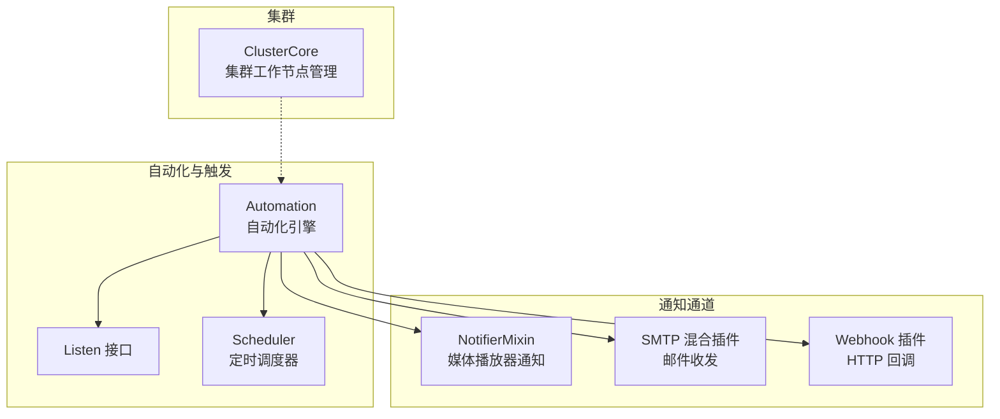
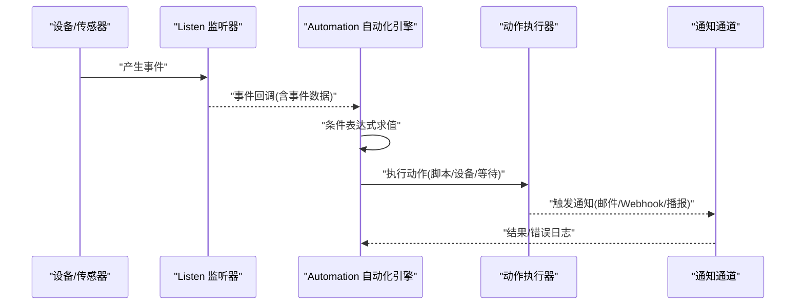
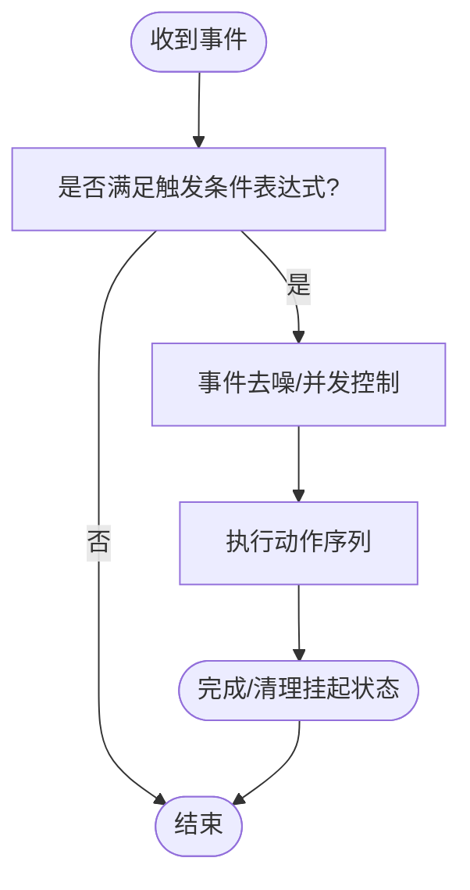
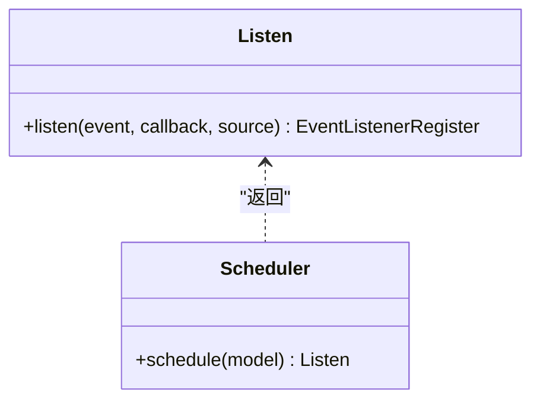
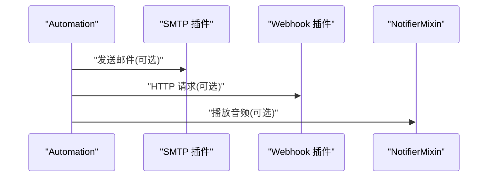
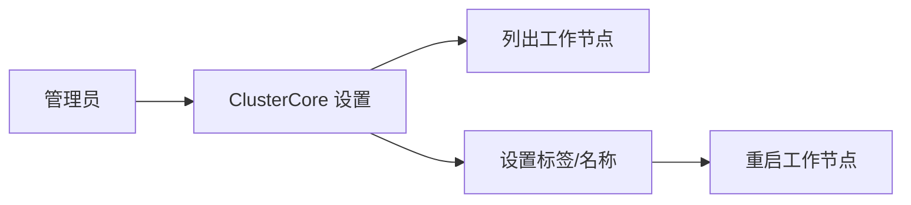
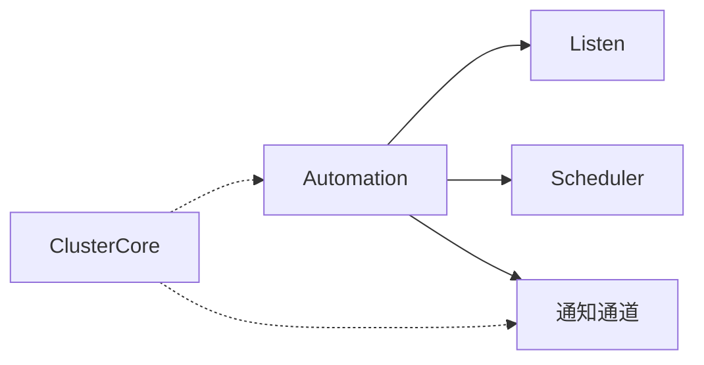

# 告警规则配置

<cite>
**本文引用的文件**
- [plugins/core/src/automation.ts](file://plugins/core/src/automation.ts)
- [plugins/core/src/builtins/listen.ts](file://plugins/core/src/builtins/listen.ts)
- [plugins/core/src/builtins/scheduler.ts](file://plugins/core/src/builtins/scheduler.ts)
- [plugins/core/src/builtins/javascript.ts](file://plugins/core/src/builtins/javascript.ts)
- [plugins/core/src/cluster.ts](file://plugins/core/src/cluster.ts)
- [plugins/notifier-mixin/src/main.ts](file://plugins/notifier-mixin/src/main.ts)
- [plugins/smtp/src/main.ts](file://plugins/smtp/src/main.ts)
- [plugins/webhook/src/main.ts](file://plugins/webhook/src/main.ts)
</cite>

## 目录
1. [简介](#简介)
2. [项目结构](#项目结构)
3. [核心组件](#核心组件)
4. [架构总览](#架构总览)
5. [详细组件分析](#详细组件分析)
6. [依赖分析](#依赖分析)
7. [性能考虑](#性能考虑)
8. [故障排查指南](#故障排查指南)
9. [结论](#结论)
10. [附录](#附录)

## 简介
本指南面向在 Scrypted 中进行“集群告警规则配置”的用户与开发者，系统性阐述如何基于现有自动化与通知能力，构建并维护告警规则。当前仓库中并未直接提供“告警引擎”或“告警规则编辑器”，但通过自动化（Automation）与内置触发器（设备事件、调度器）、以及多种通知通道（邮件、Webhook、即时播放器通知），可以实现从阈值、趋势、异常到复合条件的告警场景，并结合集群模式实现跨节点的统一告警分发与处理。

## 项目结构
围绕告警规则配置与执行，涉及以下关键模块：
- 自动化引擎：负责触发条件解析、动作执行、并发控制与事件去噪
- 触发器：设备事件监听与定时调度
- 通知通道：邮件、Webhook、媒体播放器通知
- 集群：工作节点标签与分发，便于按角色（存储/计算/加速）隔离与扩展

图表来源
- [plugins/core/src/automation.ts:30-597](file://plugins/core/src/automation.ts#L30-L597)
- [plugins/core/src/builtins/listen.ts:3-5](file://plugins/core/src/builtins/listen.ts#L3-L5)
- [plugins/core/src/builtins/scheduler.ts:16-101](file://plugins/core/src/builtins/scheduler.ts#L16-L101)
- [plugins/notifier-mixin/src/main.ts:19-47](file://plugins/notifier-mixin/src/main.ts#L19-L47)
- [plugins/smtp/src/main.ts:74-197](file://plugins/smtp/src/main.ts#L74-L197)
- [plugins/webhook/src/main.ts:95-253](file://plugins/webhook/src/main.ts#L95-L253)
- [plugins/core/src/cluster.ts:6-163](file://plugins/core/src/cluster.ts#L6-L163)

章节来源
- [plugins/core/src/automation.ts:1-597](file://plugins/core/src/automation.ts#L1-L597)
- [plugins/core/src/builtins/listen.ts:1-6](file://plugins/core/src/builtins/listen.ts#L1-L6)
- [plugins/core/src/builtins/scheduler.ts:1-101](file://plugins/core/src/builtins/scheduler.ts#L1-L101)
- [plugins/core/src/builtins/javascript.ts:1-25](file://plugins/core/src/builtins/javascript.ts#L1-L25)
- [plugins/core/src/cluster.ts:1-163](file://plugins/core/src/cluster.ts#L1-L163)
- [plugins/notifier-mixin/src/main.ts:1-64](file://plugins/notifier-mixin/src/main.ts#L1-L64)
- [plugins/smtp/src/main.ts:1-197](file://plugins/smtp/src/main.ts#L1-L197)
- [plugins/webhook/src/main.ts:1-253](file://plugins/webhook/src/main.ts#L1-L253)

## 核心组件
- 自动化引擎（Automation）
  - 支持多触发器与多动作，具备事件去噪、运行至完成、静态事件重置等策略
  - 触发器支持设备事件与定时调度；动作支持脚本、Shell 脚本、等待、更新插件、设备动作
  - 提供触发条件的 JavaScript 表达式校验与执行
- 触发器接口（Listen）
  - 统一的事件监听抽象，支持按接口过滤与去噪
- 定时调度器（Scheduler）
  - 周期性事件生成，支持周内天数选择与小时/分钟设定
- 通知通道
  - NotifierMixin：将文本转音频并通过媒体播放器播报
  - SMTP：接收邮件并根据内容控制设备（可作为“告警响应”入口）
  - Webhook：对外暴露 HTTP 接口以接收外部系统回调
- 集群（ClusterCore）
  - 工作节点标签与名称管理，便于按角色部署与隔离

章节来源
- [plugins/core/src/automation.ts:30-597](file://plugins/core/src/automation.ts#L30-L597)
- [plugins/core/src/builtins/listen.ts:3-5](file://plugins/core/src/builtins/listen.ts#L3-L5)
- [plugins/core/src/builtins/scheduler.ts:16-101](file://plugins/core/src/builtins/scheduler.ts#L16-L101)
- [plugins/notifier-mixin/src/main.ts:19-47](file://plugins/notifier-mixin/src/main.ts#L19-L47)
- [plugins/smtp/src/main.ts:74-197](file://plugins/smtp/src/main.ts#L74-L197)
- [plugins/webhook/src/main.ts:95-253](file://plugins/webhook/src/main.ts#L95-L253)
- [plugins/core/src/cluster.ts:6-163](file://plugins/core/src/cluster.ts#L6-L163)

## 架构总览
下图展示从“触发条件”到“动作执行”的整体流程，以及通知通道与集群的关系。

图表来源
- [plugins/core/src/automation.ts:544-591](file://plugins/core/src/automation.ts#L544-L591)
- [plugins/core/src/builtins/listen.ts:3-5](file://plugins/core/src/builtins/listen.ts#L3-L5)
- [plugins/core/src/builtins/javascript.ts:17-24](file://plugins/core/src/builtins/javascript.ts#L17-L24)
- [plugins/smtp/src/main.ts:147-160](file://plugins/smtp/src/main.ts#L147-L160)
- [plugins/webhook/src/main.ts:175-208](file://plugins/webhook/src/main.ts#L175-L208)
- [plugins/notifier-mixin/src/main.ts:24-46](file://plugins/notifier-mixin/src/main.ts#L24-L46)

## 详细组件分析

### 自动化引擎（Automation）与触发条件
- 触发器类型
  - 设备事件：监听指定设备的特定事件接口
  - 定时调度：按周内天数与时间点触发
- 触发条件
  - 可选的 JavaScript 表达式，使用事件上下文变量进行判断
- 动作类型
  - 脚本（JavaScript）、Shell 脚本、等待、更新插件、设备动作
- 并发与去噪
  - 事件去噪：抑制连续重复事件
  - 运行至完成：正在执行的动作被再次触发时，可要求先完成再执行
  - 静态事件：对所有事件重置计时器

图表来源
- [plugins/core/src/automation.ts:482-542](file://plugins/core/src/automation.ts#L482-L542)
- [plugins/core/src/automation.ts:544-591](file://plugins/core/src/automation.ts#L544-L591)

章节来源
- [plugins/core/src/automation.ts:30-597](file://plugins/core/src/automation.ts#L30-L597)
- [plugins/core/src/builtins/javascript.ts:5-24](file://plugins/core/src/builtins/javascript.ts#L5-L24)

### 触发器接口与调度器
- Listen 接口
  - 统一事件监听抽象，支持按事件接口过滤与去噪
- Scheduler
  - 生成周期性事件，支持周内天数选择与小时/分钟设定
  - 内部维护定时器并在到达时间点回调

图表来源
- [plugins/core/src/builtins/listen.ts:3-5](file://plugins/core/src/builtins/listen.ts#L3-L5)
- [plugins/core/src/builtins/scheduler.ts:16-101](file://plugins/core/src/builtins/scheduler.ts#L16-L101)

章节来源
- [plugins/core/src/builtins/listen.ts:1-6](file://plugins/core/src/builtins/listen.ts#L1-L6)
- [plugins/core/src/builtins/scheduler.ts:1-101](file://plugins/core/src/builtins/scheduler.ts#L1-L101)

### 通知通道
- NotifierMixin（媒体播放器通知）
  - 将文本转换为音频并通过媒体播放器播放
  - 适用于语音播报类告警
- SMTP（邮件）
  - 接收邮件并根据内容控制设备（可作为“告警响应”入口）
  - 可用于告警确认、关闭指令等
- Webhook（HTTP 回调）
  - 对外暴露 HTTP 接口，接收外部系统回调
  - 可用于对接企业级告警平台（如 Prometheus Alertmanager、Zabbix、钉钉/飞书机器人等）

图表来源
- [plugins/smtp/src/main.ts:147-160](file://plugins/smtp/src/main.ts#L147-L160)
- [plugins/webhook/src/main.ts:175-208](file://plugins/webhook/src/main.ts#L175-L208)
- [plugins/notifier-mixin/src/main.ts:24-46](file://plugins/notifier-mixin/src/main.ts#L24-L46)

章节来源
- [plugins/smtp/src/main.ts:1-197](file://plugins/smtp/src/main.ts#L1-L197)
- [plugins/webhook/src/main.ts:1-253](file://plugins/webhook/src/main.ts#L1-L253)
- [plugins/notifier-mixin/src/main.ts:1-64](file://plugins/notifier-mixin/src/main.ts#L1-L64)

### 集群与工作节点
- ClusterCore
  - 列出工作节点并允许设置名称与标签
  - 标签可用于区分存储、计算、加速等角色
  - 修改标签后可重启对应工作节点

图表来源
- [plugins/core/src/cluster.ts:27-155](file://plugins/core/src/cluster.ts#L27-L155)

章节来源
- [plugins/core/src/cluster.ts:1-163](file://plugins/core/src/cluster.ts#L1-L163)

## 依赖分析
- 自动化引擎依赖触发器接口与调度器，以统一事件源
- 通知通道独立于自动化引擎，通过动作链路接入
- 集群模块为自动化与通知提供运行环境与节点隔离

图表来源
- [plugins/core/src/automation.ts:544-591](file://plugins/core/src/automation.ts#L544-L591)
- [plugins/core/src/builtins/listen.ts:3-5](file://plugins/core/src/builtins/listen.ts#L3-L5)
- [plugins/core/src/builtins/scheduler.ts:16-101](file://plugins/core/src/builtins/scheduler.ts#L16-L101)
- [plugins/core/src/cluster.ts:27-155](file://plugins/core/src/cluster.ts#L27-L155)

章节来源
- [plugins/core/src/automation.ts:1-597](file://plugins/core/src/automation.ts#L1-L597)
- [plugins/core/src/builtins/listen.ts:1-6](file://plugins/core/src/builtins/listen.ts#L1-L6)
- [plugins/core/src/builtins/scheduler.ts:1-101](file://plugins/core/src/builtins/scheduler.ts#L1-L101)
- [plugins/core/src/cluster.ts:1-163](file://plugins/core/src/cluster.ts#L1-L163)

## 性能考虑
- 事件去噪与并发控制
  - 启用事件去噪可降低重复事件带来的执行压力
  - “运行至完成”可避免动作链被频繁打断
- 计算密集型动作
  - 脚本与媒体转换可能消耗资源，建议在非关键路径执行或限流
- 定时调度
  - 合理设置调度频率，避免过多定时器同时触发
- 集群节点
  - 使用标签将高负载任务分配到专用节点，避免单点过载

## 故障排查指南
- 触发条件不生效
  - 检查触发条件表达式语法与上下文变量是否正确
  - 确认事件接口与设备 ID 是否匹配
- 动作未执行
  - 查看自动化日志，确认是否存在并发阻塞或已中止
  - 检查设备动作目标接口是否存在
- 通知失败
  - SMTP：检查端口、TLS 设置与收件人邮箱
  - Webhook：确认 Token 与路径正确，网络可达
  - NotifierMixin：确认媒体播放器可用且音频转换成功
- 集群节点问题
  - 标签修改后需重启工作节点
  - 检查节点名称与标签是否符合预期

章节来源
- [plugins/core/src/automation.ts:482-542](file://plugins/core/src/automation.ts#L482-L542)
- [plugins/smtp/src/main.ts:104-145](file://plugins/smtp/src/main.ts#L104-L145)
- [plugins/webhook/src/main.ts:109-173](file://plugins/webhook/src/main.ts#L109-L173)
- [plugins/notifier-mixin/src/main.ts:24-46](file://plugins/notifier-mixin/src/main.ts#L24-L46)
- [plugins/core/src/cluster.ts:135-154](file://plugins/core/src/cluster.ts#L135-L154)

## 结论
通过 Scrypted 的自动化引擎与通知通道，可以在不引入额外告警引擎的情况下，灵活地构建覆盖阈值、趋势、异常与复合条件的告警体系。结合集群标签与节点隔离，可实现高可用、可扩展的告警处理方案。建议在实际部署中，优先采用事件去噪与并发控制策略，配合邮件、Webhook 与语音播报等多通道通知，确保告警的及时性与可追溯性。

## 附录

### 告警规则类型与配置要点
- 阈值告警
  - 使用设备事件触发器，配合触发条件表达式判断数值越界
  - 可叠加“运行至完成”避免抖动
- 趋势告警
  - 在脚本动作中聚合最近 N 次采样，计算斜率或变化率
  - 结合等待动作实现稳态判断
- 异常检测
  - 使用脚本动作对历史均值/方差进行统计，识别离群点
  - 可结合“事件去噪”避免瞬时异常反复触发
- 复合条件告警
  - 使用多个触发器与“与/或”逻辑组合（在表达式中体现）
  - 可通过等待动作实现时间窗内的多条件聚合

### 告警级别与处理优先级
- 建议在触发条件表达式中显式区分严重/警告/信息级别，并在动作中选择不同的通知通道与音量/标题前缀
- 严重级别优先播报与邮件，警告级别可仅记录或 Webhook 通知，信息级别用于审计

### 触发条件语法与变量
- 表达式变量
  - eventSource：事件来源设备对象
  - eventDetails：事件元数据（接口、时间等）
  - eventData：事件载荷（数值、布尔、对象等）
- 语法建议
  - 使用严格比较与边界判断
  - 对数组/对象访问进行空值保护
  - 复杂逻辑拆分为多步动作或脚本

章节来源
- [plugins/core/src/automation.ts:574-583](file://plugins/core/src/automation.ts#L574-L583)
- [plugins/core/src/builtins/javascript.ts:17-24](file://plugins/core/src/builtins/javascript.ts#L17-L24)

### 告警抑制机制
- 去重与静默
  - 事件去噪：抑制连续重复事件
  - 静默周期：在动作中加入等待，避免短期内重复告警
- 依赖关系与升级策略
  - 通过等待与条件表达式实现“依赖确认”
  - 升级策略：首次告警低优先级通知，持续告警提升级别

章节来源
- [plugins/core/src/automation.ts:36-50](file://plugins/core/src/automation.ts#L36-L50)
- [plugins/core/src/automation.ts:482-542](file://plugins/core/src/automation.ts#L482-L542)

### 通知渠道配置
- 邮件（SMTP）
  - 配置收件箱与关键字，实现“确认/关闭”指令
- Webhook
  - 生成带 Token 的本地/内网地址，对接企业告警平台
- 即时播报（NotifierMixin）
  - 将告警文本转音频并通过媒体播放器播报

章节来源
- [plugins/smtp/src/main.ts:74-197](file://plugins/smtp/src/main.ts#L74-L197)
- [plugins/webhook/src/main.ts:95-253](file://plugins/webhook/src/main.ts#L95-L253)
- [plugins/notifier-mixin/src/main.ts:19-47](file://plugins/notifier-mixin/src/main.ts#L19-L47)

### 规则模板与示例（思路）
- 温度超阈值（严重）
  - 触发器：温度传感器数值事件
  - 条件：数值大于阈值
  - 动作：邮件+Webhook+播报
- 门磁长时间保持开启（警告）
  - 触发器：门磁事件+定时调度
  - 条件：事件持续超过时间窗
  - 动作：仅 Webhook 记录
- 设备离线（严重）
  - 触发器：设备状态事件（离线）
  - 条件：无心跳/状态异常
  - 动作：邮件+播报+静默周期

### 规则优化建议
- 合理性检查
  - 阈值与单位一致性、时间窗合理性
- 性能影响评估
  - 减少脚本与媒体转换频率，合并动作
- 误报减少
  - 引入稳态判断与去噪策略
  - 使用“运行至完成”与静默周期