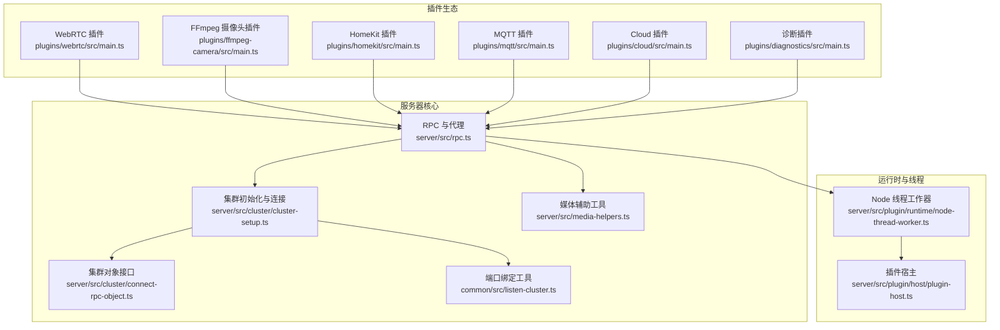
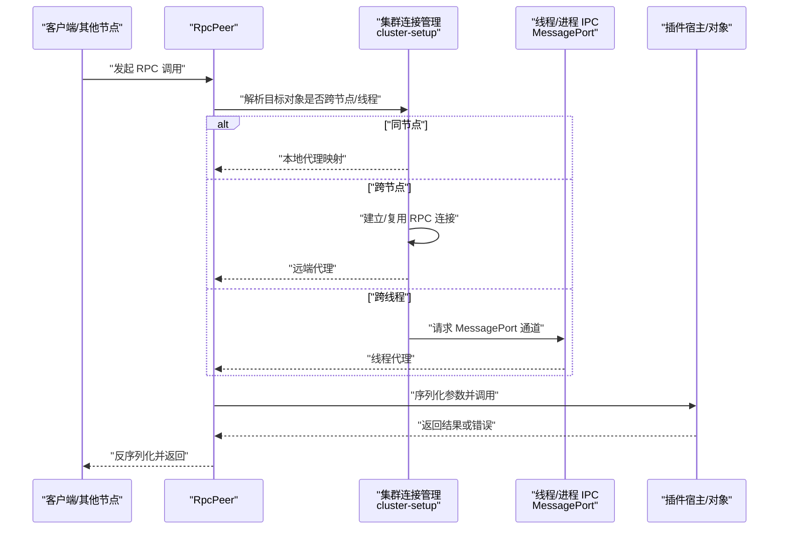
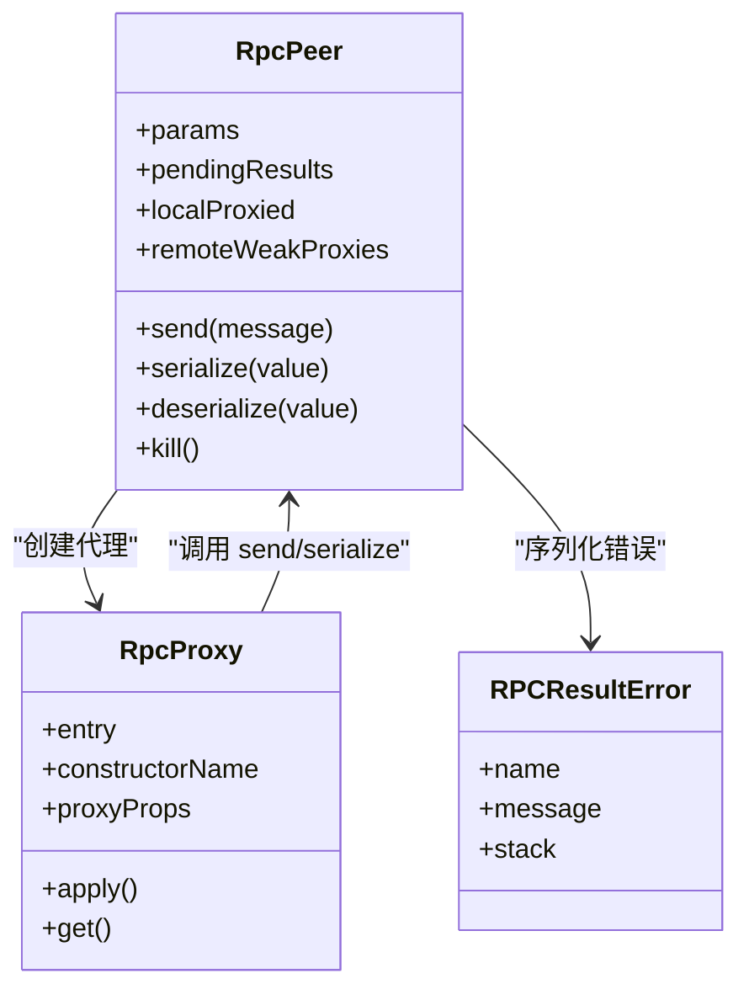
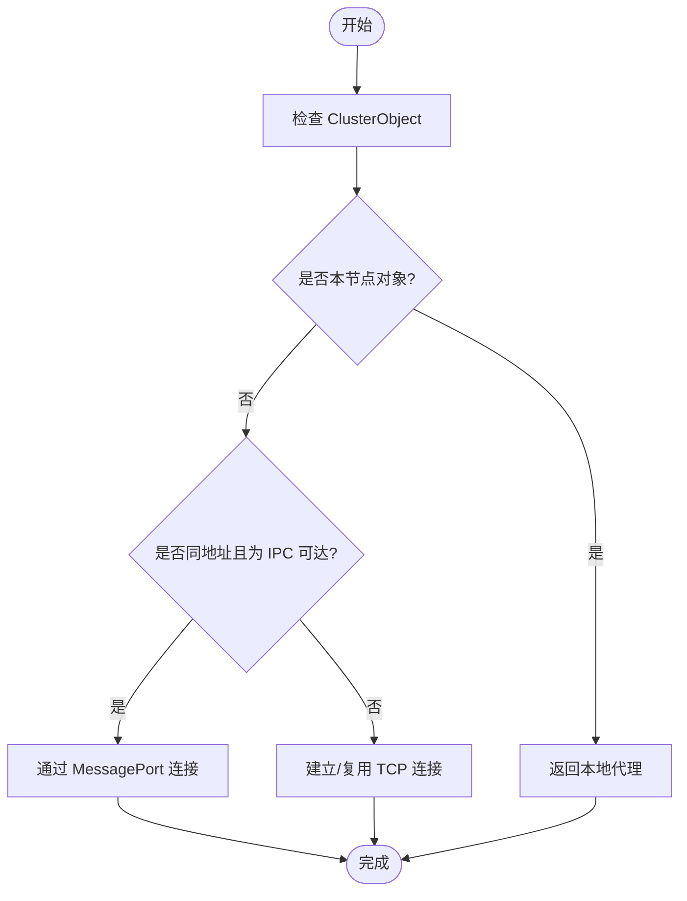
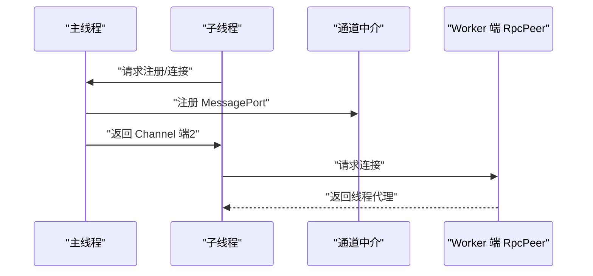
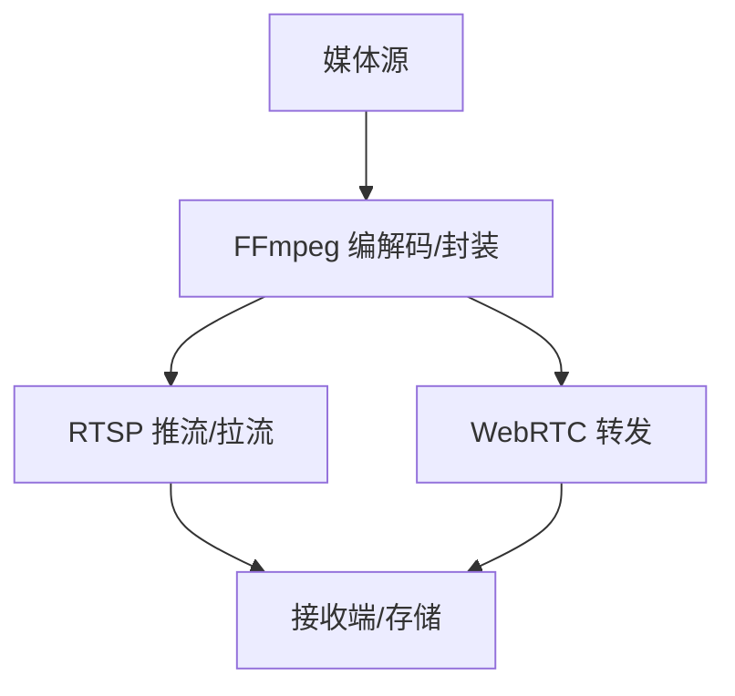
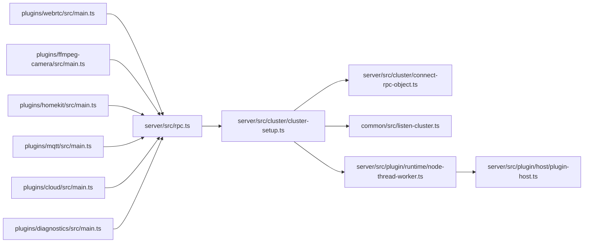

# 性能监控分析

<cite>
**本文引用的文件**
- [server/src/cluster/cluster-setup.ts](file://server/src/cluster/cluster-setup.ts)
- [server/src/cluster/connect-rpc-object.ts](file://server/src/cluster/connect-rpc-object.ts)
- [common/src/listen-cluster.ts](file://common/src/listen-cluster.ts)
- [server/src/rpc.ts](file://server/src/rpc.ts)
- [packages/rpc/src/rpc.ts](file://packages/rpc/src/rpc.ts)
- [server/src/plugin/runtime/node-thread-worker.ts](file://server/src/plugin/runtime/node-thread-worker.ts)
- [server/src/plugin/host/plugin-host.ts](file://server/src/plugin/host/plugin-host.ts)
- [server/src/media-helpers.ts](file://server/src/media-helpers.ts)
- [plugins/webrtc/src/main.ts](file://plugins/webrtc/src/main.ts)
- [plugins/ffmpeg-camera/src/main.ts](file://plugins/ffmpeg-camera/src/main.ts)
- [plugins/homekit/src/main.ts](file://plugins/homekit/src/main.ts)
- [plugins/mqtt/src/main.ts](file://plugins/mqtt/src/main.ts)
- [plugins/cloud/src/main.ts](file://plugins/cloud/src/main.ts)
- [plugins/diagnostics/src/main.ts](file://plugins/diagnostics/src/main.ts)
- [install/docker/docker-compose.yml](file://install/docker/docker-compose.yml)
- [install/docker/router/scrypted.service](file://install/docker/router/scrypted.service)
- [install/proxmox/docker-compose.sh](file://install/proxmox/docker-compose.sh)
- [README.md](file://README.md)
</cite>

## 目录
1. [引言](#引言)
2. [项目结构](#项目结构)
3. [核心组件](#核心组件)
4. [架构总览](#架构总览)
5. [详细组件分析](#详细组件分析)
6. [依赖关系分析](#依赖关系分析)
7. [性能考虑](#性能考虑)
8. [故障排查指南](#故障排查指南)
9. [结论](#结论)
10. [附录](#附录)

## 引言
本指南面向 Scrypted 集群的性能管理，围绕系统性能指标（CPU、内存、磁盘、网络）、应用性能指标（响应时间、吞吐量、并发数）、业务性能指标（设备处理能力、媒体流质量、自动化执行效率）进行体系化梳理，并结合仓库中已实现的集群通信、RPC 序列化、线程/进程间 IPC、媒体处理与转发等模块，给出可落地的性能基准测试、数据分析、优化策略与监控告警建议。由于仓库未包含内置的 APM 或系统级监控集成代码，本指南同时提供与第三方工具对接的思路与最佳实践。

## 项目结构
Scrypted 的性能相关能力主要分布在以下区域：
- 集群与 RPC：server/src/cluster 与 server/src/rpc，负责跨节点/线程对象代理、序列化与连接管理。
- 插件生态：plugins/*，涵盖媒体、控制、云服务、诊断等插件，是业务性能的关键载体。
- 媒体处理：server/src/media-helpers 与 plugins/ffmpeg-camera、plugins/webrtc 等，涉及编解码、转发、RTSP/WebRTC 等高吞吐场景。
- 容器与部署：install/docker 与 install/proxmox，提供容器化与集群部署参考，便于资源隔离与弹性伸缩。

**图表来源**
- [server/src/rpc.ts:285-400](file://server/src/rpc.ts#L285-L400)
- [server/src/cluster/cluster-setup.ts:38-120](file://server/src/cluster/cluster-setup.ts#L38-L120)
- [server/src/cluster/connect-rpc-object.ts:1-29](file://server/src/cluster/connect-rpc-object.ts#L1-L29)
- [common/src/listen-cluster.ts:1-83](file://common/src/listen-cluster.ts#L1-L83)
- [server/src/media-helpers.ts](file://server/src/media-helpers.ts)

**章节来源**
- [server/src/cluster/cluster-setup.ts:1-498](file://server/src/cluster/cluster-setup.ts#L1-L498)
- [server/src/rpc.ts:1-858](file://server/src/rpc.ts#L1-L858)
- [common/src/listen-cluster.ts:1-83](file://common/src/listen-cluster.ts#L1-L83)

## 核心组件
- 集群与 RPC：通过 RpcPeer 实现对象代理、参数传递、错误序列化与终结回收；cluster-setup 提供集群节点发现、连接复用、IPC 对接与安全校验。
- 线程/进程间通信：NodeThreadWorker 与 MessagePort 通道，支持主/子线程与跨线程对象代理，降低跨进程调用开销。
- 媒体处理：媒体辅助函数与插件（FFmpeg/Webrtc）在高并发视频流场景下的缓冲、转发与编解码路径，直接影响吞吐与延迟。
- 插件生态：各插件承载设备接入、协议适配、自动化与云端同步，是业务性能的直接体现。

**章节来源**
- [server/src/rpc.ts:285-400](file://server/src/rpc.ts#L285-L400)
- [server/src/cluster/cluster-setup.ts:38-120](file://server/src/cluster/cluster-setup.ts#L38-L120)
- [server/src/plugin/runtime/node-thread-worker.ts](file://server/src/plugin/runtime/node-thread-worker.ts)

## 架构总览
下图展示集群节点间与线程间的通信路径，以及媒体与插件的交互位置。

**图表来源**
- [server/src/cluster/cluster-setup.ts:259-300](file://server/src/cluster/cluster-setup.ts#L259-L300)
- [server/src/rpc.ts:570-678](file://server/src/rpc.ts#L570-L678)
- [server/src/plugin/runtime/node-thread-worker.ts](file://server/src/plugin/runtime/node-thread-worker.ts)

## 详细组件分析

### 组件一：RPC 与对象代理（性能关键）
- 对象代理与序列化：RpcPeer 在 serialize/deserialize 中对远程对象进行代理包装与属性注入，避免重复传输；对错误类型进行统一序列化，便于跨边界传播。
- 并发与异步迭代：RpcPeer 维护 pendingResults、弱引用代理与 FinalizationRegistry，确保异步迭代器与对象生命周期正确回收。
- 周期性 GC：startPeriodicGarbageCollection 周期触发全局 GC，缓解长时运行下的内存增长。

**图表来源**
- [server/src/rpc.ts:285-400](file://server/src/rpc.ts#L285-L400)
- [server/src/rpc.ts:570-678](file://server/src/rpc.ts#L570-L678)
- [server/src/rpc.ts:229-240](file://server/src/rpc.ts#L229-L240)

**章节来源**
- [server/src/rpc.ts:1-858](file://server/src/rpc.ts#L1-L858)

### 组件二：集群连接与对象寻址（跨节点/线程）
- 对象标识与哈希：ClusterObject 包含 id/address/port/proxyId/sourceKey/sha256，用于跨节点/线程定位与安全校验。
- 连接复用与快速路径：ensureClusterPeer 复用连接；IPC 快速路径通过 NodeThreadWorker 与 MessagePort 直连，避免网络往返。
- 初始化与监听：clusterListenZero 支持绑定到指定地址与回环地址，保证多网卡环境下的可达性。

**图表来源**
- [server/src/cluster/connect-rpc-object.ts:1-29](file://server/src/cluster/connect-rpc-object.ts#L1-L29)
- [server/src/cluster/cluster-setup.ts:259-300](file://server/src/cluster/cluster-setup.ts#L259-L300)
- [server/src/cluster/cluster-setup.ts:464-497](file://server/src/cluster/cluster-setup.ts#L464-L497)

**章节来源**
- [server/src/cluster/cluster-setup.ts:1-498](file://server/src/cluster/cluster-setup.ts#L1-L498)
- [server/src/cluster/connect-rpc-object.ts:1-29](file://server/src/cluster/connect-rpc-object.ts#L1-L29)

### 组件三：线程/进程 IPC（低延迟调用）
- 主线程注册与通道建立：mainThreadBrokerRegister 接收子线程注册与连接请求，通过 MessageChannel 建立双向通道。
- 跨线程连接：connectTidPeer 通过 Deferred 等待端口，创建 NodeThreadWorker 的 RpcPeer，实现线程内对象代理。

**图表来源**
- [server/src/cluster/cluster-setup.ts:243-257](file://server/src/cluster/cluster-setup.ts#L243-L257)
- [server/src/cluster/cluster-setup.ts:174-187](file://server/src/cluster/cluster-setup.ts#L174-L187)
- [server/src/cluster/cluster-setup.ts:127-172](file://server/src/cluster/cluster-setup.ts#L127-L172)

**章节来源**
- [server/src/cluster/cluster-setup.ts:127-257](file://server/src/cluster/cluster-setup.ts#L127-L257)

### 组件四：媒体处理与转发（高吞吐场景）
- 媒体辅助：media-helpers 提供媒体数据处理通用能力，影响转码、封装与分发的性能。
- FFmpeg 插件：摄像头插件通过 FFmpeg 进行推流/拉流与格式转换，是 CPU 密集型任务，需关注编码器选择、分辨率与帧率。
- WebRTC 插件：基于 webrtc-camera 与 werift 的实时音视频转发，对网络抖动与丢包敏感，需结合 QoS 与缓冲策略。

**图表来源**
- [server/src/media-helpers.ts](file://server/src/media-helpers.ts)
- [plugins/ffmpeg-camera/src/main.ts](file://plugins/ffmpeg-camera/src/main.ts)
- [plugins/webrtc/src/main.ts](file://plugins/webrtc/src/main.ts)

**章节来源**
- [server/src/media-helpers.ts](file://server/src/media-helpers.ts)
- [plugins/ffmpeg-camera/src/main.ts](file://plugins/ffmpeg-camera/src/main.ts)
- [plugins/webrtc/src/main.ts](file://plugins/webrtc/src/main.ts)

### 组件五：插件与业务性能（自动化/设备/控制）
- 自动化与脚本：核心模块包含自动化引擎与脚本执行，是业务逻辑性能的关键入口。
- 设备接入与协议：HomeKit、MQTT、Cloud 等插件承载设备控制与状态同步，影响响应时间与并发处理能力。
- 诊断插件：提供运行时诊断能力，可用于定位性能瓶颈。

**章节来源**
- [plugins/homekit/src/main.ts](file://plugins/homekit/src/main.ts)
- [plugins/mqtt/src/main.ts](file://plugins/mqtt/src/main.ts)
- [plugins/cloud/src/main.ts](file://plugins/cloud/src/main.ts)
- [plugins/diagnostics/src/main.ts](file://plugins/diagnostics/src/main.ts)

## 依赖关系分析
- 组件耦合：RPC 层独立于集群层，集群层通过 connectRPCObject 将跨节点/线程调用桥接到 RPC；线程/进程 IPC 作为集群层的加速路径。
- 外部依赖：Docker Compose 与 Proxmox 脚本提供容器化部署与集群编排参考，便于资源隔离与弹性伸缩。

**图表来源**
- [server/src/rpc.ts:285-400](file://server/src/rpc.ts#L285-L400)
- [server/src/cluster/cluster-setup.ts:38-120](file://server/src/cluster/cluster-setup.ts#L38-L120)
- [common/src/listen-cluster.ts:1-83](file://common/src/listen-cluster.ts#L1-L83)
- [server/src/plugin/runtime/node-thread-worker.ts](file://server/src/plugin/runtime/node-thread-worker.ts)

**章节来源**
- [server/src/cluster/cluster-setup.ts:1-498](file://server/src/cluster/cluster-setup.ts#L1-L498)
- [server/src/rpc.ts:1-858](file://server/src/rpc.ts#L1-L858)
- [install/docker/docker-compose.yml](file://install/docker/docker-compose.yml)
- [install/proxmox/docker-compose.sh](file://install/proxmox/docker-compose.sh)

## 性能考虑
- 系统性能指标
  - CPU：FFmpeg 编解码、WebRTC 转发、插件脚本执行均可能成为热点；可通过容器资源限制与亲和性调度隔离。
  - 内存：RpcPeer 的代理与 FinalizationRegistry 回收配合周期性 GC，有助于长期运行稳定性。
  - 磁盘：媒体缓存与日志写入，建议分离日志卷与缓存卷，合理设置保留策略。
  - 网络：RTSP/WebRTC 流媒体对带宽与抖动敏感，建议启用 QoS 与限速策略。
- 应用性能指标
  - 响应时间：RPC 调用链路越短越好；IPC 快速路径优先于跨节点 TCP。
  - 吞吐量：批量处理与并发队列；避免阻塞式操作，使用异步迭代与流式处理。
  - 并发数：线程池与工作器数量需与 CPU 核心匹配，避免过度上下文切换。
- 业务性能指标
  - 设备处理能力：按设备类型与协议设定并发上限，避免过载导致丢帧或超时。
  - 媒体会话质量：根据带宽动态调整分辨率与码率；对关键会话启用冗余与降级策略。
  - 自动化执行效率：批量化与去重，减少重复计算与 I/O。

[本节为通用性能讨论，不直接分析具体文件]

## 故障排查指南
- RPC 错误传播：RPCResultError 统一错误序列化，便于跨边界定位问题。
- 对象生命周期：确认代理是否被回收（remotesCreated/remotesCollected），避免内存泄漏。
- 集群连接：检查 clusterListenZero 绑定与 ensureClusterPeer 复用情况，确认地址/端口可达。
- 线程 IPC：验证 MessagePort 通道建立与 Deferred 解决时机，避免死锁或超时。

**章节来源**
- [server/src/rpc.ts:229-240](file://server/src/rpc.ts#L229-L240)
- [server/src/rpc.ts:464-474](file://server/src/rpc.ts#L464-L474)
- [server/src/cluster/cluster-setup.ts:464-497](file://server/src/cluster/cluster-setup.ts#L464-L497)

## 结论
Scrypted 的性能管理应从“系统—应用—业务”三层协同入手：系统层通过容器与网络策略保障资源与带宽；应用层利用 RPC 与 IPC 降低调用开销并稳定回收；业务层通过插件与媒体处理优化设备与流媒体体验。结合基准测试与持续监控，可形成闭环的性能治理流程。

[本节为总结性内容，不直接分析具体文件]

## 附录

### A. 性能监控指标清单
- 系统层：CPU 使用率、内存占用、磁盘 IO、网络吞吐与延迟、上下文切换次数。
- 应用层：RPC 调用耗时分布、队列长度、等待时间、错误率、GC 次数与时长。
- 业务层：设备接入/断开速率、媒体会话并发、帧率/码率、丢包率、首帧时间。

[本节为概念性内容，不直接分析具体文件]

### B. 基准测试方法
- 压力测试：逐步提升并发连接与媒体会话数，观察系统饱和点与退化行为。
- 负载测试：模拟真实业务流量，记录 P50/P95/P99 延迟与错误率。
- 稳定性测试：长时间运行（如 7×24），监测内存泄漏与性能漂移。
- 容量规划：基于峰值与冗余需求，确定节点规模与资源配额。

[本节为概念性内容，不直接分析具体文件]

### C. 数据分析技术
- 趋势分析：按天/小时聚合指标，识别周期性波动与异常尖峰。
- 对比分析：不同版本/配置的指标对比，量化优化收益。
- 根因分析：从延迟分布、错误堆栈与资源曲线联动定位瓶颈。
- 瓶颈识别：结合火焰图与调用链，聚焦热点函数与阻塞点。
- 回归检测：建立基线阈值，自动报警回归风险。

[本节为概念性内容，不直接分析具体文件]

### D. 优化策略
- 资源配置：容器资源限制与亲和性、NUMA 绑定、I/O 调度优化。
- 代码优化：减少不必要的序列化、合并小请求、使用流式处理。
- 架构优化：就近路由、多级缓存、异步化与无锁设计。
- 缓存策略：热点数据与中间结果缓存，淘汰策略与一致性保证。
- 负载均衡：会话亲和与健康检查，动态扩缩容。

[本节为概念性内容，不直接分析具体文件]

### E. 监控工具集成
- APM 工具：接入第三方 APM（如 Prometheus+Grafana、APM Agent），采集 RPC 调用链与指标。
- 系统监控：Prometheus Exporter、Node Exporter、cAdvisor，采集主机与容器指标。
- 应用监控：自定义指标上报（如媒体会话数、设备在线率），结合日志与追踪。
- 自定义指标：在关键路径埋点（如序列化耗时、IPC 建链耗时、编解码耗时）。

[本节为概念性内容，不直接分析具体文件]

### F. 告警机制
- 阈值设置：基于历史基线与 SLA 设定阈值，区分严重/警告级别。
- 异常检测：统计异常与突变检测算法，减少误报。
- 自动告警：邮件/IM/电话通知，分级处理。
- 人工干预：提供一键降级与回滚预案，缩短恢复时间。

[本节为概念性内容，不直接分析具体文件]

### G. 最佳实践
- 监控策略：覆盖全栈指标，明确采样频率与保留周期。
- 性能基线：建立版本化基线，定期评估与更新。
- 持续监控：自动化巡检与可视化看板，推动问题前置。
- 文化与流程：将性能纳入开发流程与发布评审。

[本节为概念性内容，不直接分析具体文件]