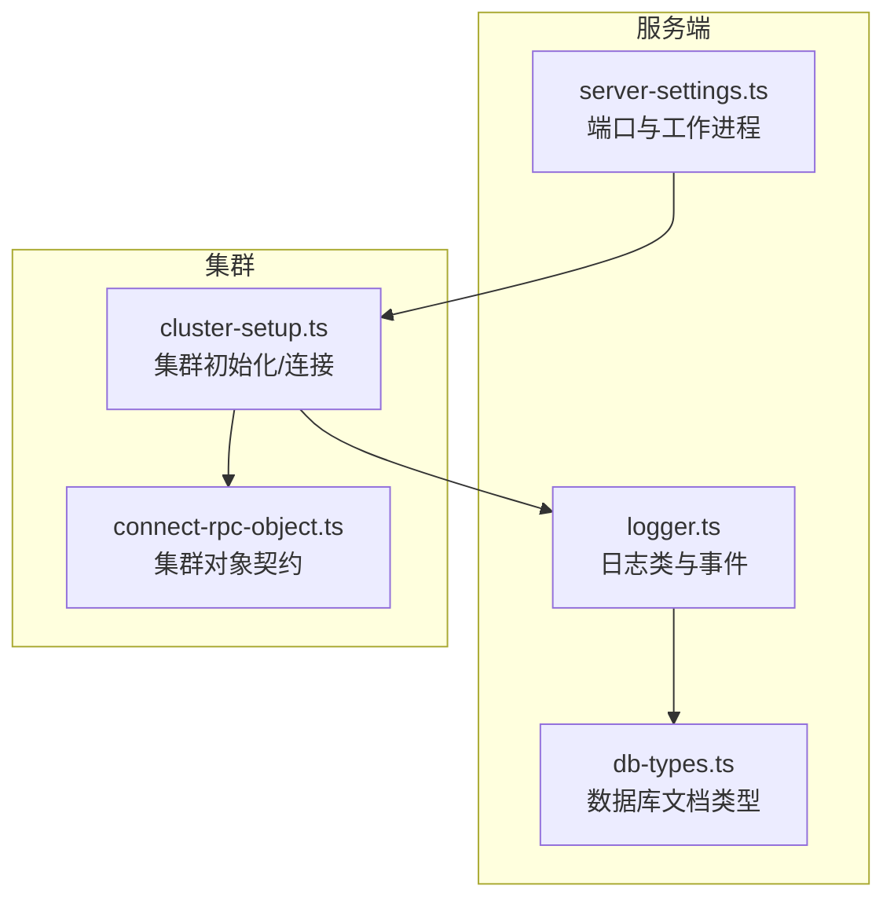
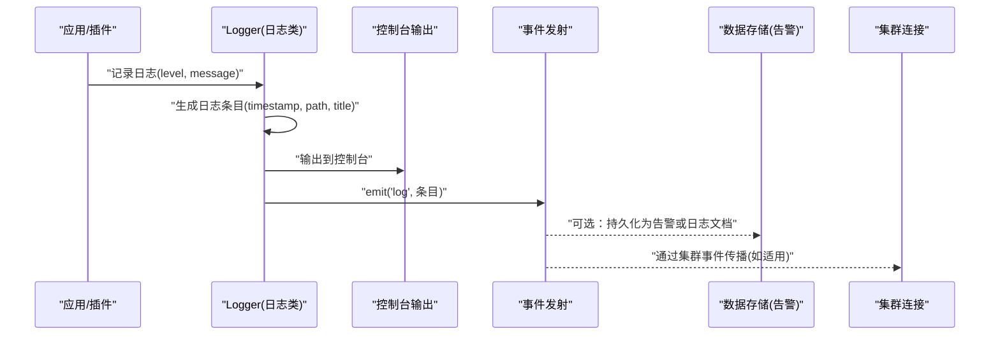
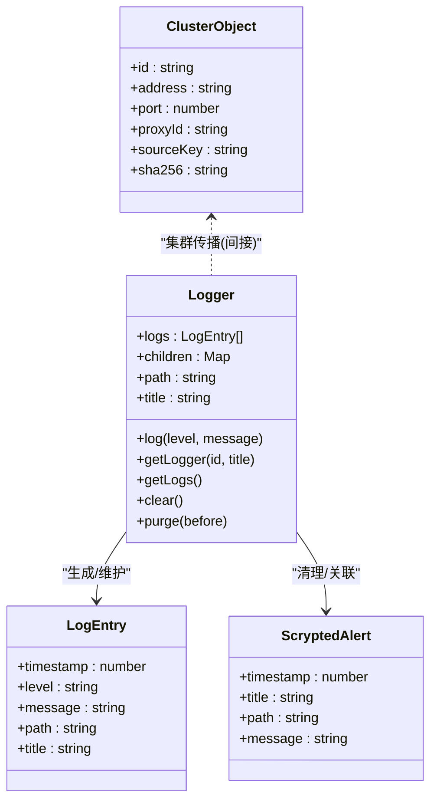

# 日志管理

<cite>
**本文引用的文件**
- [logger.ts](file://server/src/logger.ts)
- [db-types.ts](file://server/src/db-types.ts)
- [cluster-setup.ts](file://server/src/cluster/cluster-setup.ts)
- [connect-rpc-object.ts](file://server/src/cluster/connect-rpc-object.ts)
- [server-settings.ts](file://server/src/server-settings.ts)
</cite>

## 目录
1. [简介](#简介)
2. [项目结构](#项目结构)
3. [核心组件](#核心组件)
4. [架构总览](#架构总览)
5. [详细组件分析](#详细组件分析)
6. [依赖关系分析](#依赖关系分析)
7. [性能考量](#性能考量)
8. [故障排查指南](#故障排查指南)
9. [结论](#结论)
10. [附录](#附录)

## 简介
本指南面向 Scrypted 集群的日志管理，聚焦于日志级别体系、日志格式、采集与存储、查询与分析、监控与告警、配置管理以及安全与合规等方面。通过对仓库中现有日志与集群相关模块的深入分析，给出可操作的实践建议与最佳实践，帮助在多节点、多线程、多插件环境下实现统一、可观测、可审计的日志体系。

## 项目结构
围绕日志与集群的关键文件分布如下：
- 日志模型与内存缓存：server/src/logger.ts
- 数据库文档类型（含告警）：server/src/db-types.ts
- 集群初始化与连接：server/src/cluster/cluster-setup.ts
- 集群对象契约：server/src/cluster/connect-rpc-object.ts
- 服务器端口与工作进程设置：server/src/server-settings.ts

图表来源
- [logger.ts:1-93](file://server/src/logger.ts#L1-L93)
- [db-types.ts:1-44](file://server/src/db-types.ts#L1-L44)
- [cluster-setup.ts:1-498](file://server/src/cluster/cluster-setup.ts#L1-L498)
- [connect-rpc-object.ts:1-29](file://server/src/cluster/connect-rpc-object.ts#L1-L29)
- [server-settings.ts:1-11](file://server/src/server-settings.ts#L1-L11)

章节来源
- [logger.ts:1-93](file://server/src/logger.ts#L1-L93)
- [db-types.ts:1-44](file://server/src/db-types.ts#L1-L44)
- [cluster-setup.ts:1-498](file://server/src/cluster/cluster-setup.ts#L1-L498)
- [connect-rpc-object.ts:1-29](file://server/src/cluster/connect-rpc-object.ts#L1-L29)
- [server-settings.ts:1-11](file://server/src/server-settings.ts#L1-L11)

## 核心组件
- 日志类与事件
  - 提供按路径/标题分层的日志记录器，支持内存中的日志条目缓存、子日志器继承、事件广播与清理。
  - 日志条目包含时间戳、级别、消息、路径与标题，便于后续持久化与检索。
- 告警与日志关联
  - 告警实体包含时间戳、标题、路径与消息，用于将异常事件与日志进行关联。
- 集群对象与连接
  - 定义跨节点/线程共享对象的标识与校验，确保对象在集群内的稳定代理与安全连接。
- 服务器端口与工作进程
  - 提供默认端口与工作进程数的环境变量配置入口，影响日志采集与集群监听行为。

章节来源
- [logger.ts:11-92](file://server/src/logger.ts#L11-L92)
- [db-types.ts:26-31](file://server/src/db-types.ts#L26-L31)
- [connect-rpc-object.ts:1-29](file://server/src/cluster/connect-rpc-object.ts#L1-L29)
- [server-settings.ts:3-6](file://server/src/server-settings.ts#L3-L6)

## 架构总览
下图展示了日志从产生到被集群感知与持久化的整体流程，以及与告警的关联关系。

图表来源
- [logger.ts:33-46](file://server/src/logger.ts#L33-L46)
- [logger.ts:64-75](file://server/src/logger.ts#L64-L75)
- [db-types.ts:26-31](file://server/src/db-types.ts#L26-L31)
- [cluster-setup.ts:284-300](file://server/src/cluster/cluster-setup.ts#L284-L300)

## 详细组件分析

### 日志级别体系与使用场景
- 级别定义
  - 调试：用于开发与诊断阶段的细粒度信息，便于定位问题。
  - 信息：常规运行状态、关键流程节点的确认信息。
  - 警告：潜在问题或异常情况，需要关注但尚未影响功能。
  - 错误：功能执行失败或异常，需立即处理。
  - 致命：系统性故障或不可恢复错误，需紧急干预。
- 使用建议
  - 在日志类中以字符串形式传递级别，便于统一处理与过滤。
  - 结合路径与标题区分来源模块，便于分域检索与告警。
  - 将严重级别映射到告警实体，形成“日志-告警”闭环。

章节来源
- [logger.ts:33-46](file://server/src/logger.ts#L33-L46)

### 日志格式标准
- 字段规范
  - 时间戳：毫秒级时间戳，用于排序与统计。
  - 级别：字符串，表示严重程度。
  - 消息：文本内容，描述事件详情。
  - 路径：模块/组件标识，支持层级化组织。
  - 标题：人类可读的上下文名称。
- 结构化与 JSON
  - 可扩展为结构化日志，便于机器解析与索引；建议在控制台输出外增加结构化字段集合。
  - JSON 格式便于与外部日志平台对接，建议保留原始字段并补充标准化键名。

章节来源
- [logger.ts:11-17](file://server/src/logger.ts#L11-L17)

### 日志采集机制
- 应用日志收集
  - 通过日志类的事件接口订阅日志条目，实现集中采集。
- 系统日志捕获
  - 控制台输出作为系统日志源，结合容器/主机日志驱动进行统一收集。
- 实时流式处理
  - 利用事件发射机制，将日志条目推送至下游处理器或转发器。
- 批量导入
  - 对历史日志或离线数据，可通过内存缓存导出后批量写入存储。

章节来源
- [logger.ts:44-46](file://server/src/logger.ts#L44-L46)
- [logger.ts:87-91](file://server/src/logger.ts#L87-L91)

### 日志存储策略
- 本地存储
  - 内存缓存适合短期观测与快速回溯；注意容量与过期策略。
- 集中存储
  - 将日志条目持久化为文档，支持查询、聚合与归档。
- 分布式存储
  - 在集群模式下，通过对象代理与事件传播，实现跨节点日志汇聚。
- 日志轮转与压缩归档
  - 建议按大小/时间轮转，并对旧日志进行压缩归档，降低存储成本。

章节来源
- [logger.ts:19-92](file://server/src/logger.ts#L19-L92)
- [db-types.ts:4-44](file://server/src/db-types.ts#L4-L44)
- [cluster-setup.ts:336-399](file://server/src/cluster/cluster-setup.ts#L336-L399)

### 日志查询与分析
- 关键字搜索与正则表达式
  - 基于消息与路径字段进行检索，结合正则实现复杂匹配。
- 聚合统计与趋势分析
  - 按级别、路径、标题进行聚合，观察错误率与异常趋势。
- 关联分析
  - 将日志与告警进行关联，定位根因与影响范围。

章节来源
- [logger.ts:11-17](file://server/src/logger.ts#L11-L17)
- [db-types.ts:26-31](file://server/src/db-types.ts#L26-L31)

### 日志监控与告警
- 异常检测
  - 通过级别阈值与模式识别，自动标记异常日志。
- 错误率监控
  - 统计错误/致命级别的占比，设定阈值触发告警。
- 性能日志分析
  - 结合时间戳与路径，分析关键路径耗时与瓶颈。
- 根因分析
  - 利用标题与路径串联事件链，配合告警进行回溯。

章节来源
- [logger.ts:64-75](file://server/src/logger.ts#L64-L75)
- [db-types.ts:26-31](file://server/src/db-types.ts#L26-L31)

### 日志配置管理
- 配置文件
  - 通过环境变量与默认值控制端口与工作进程数量，间接影响日志采集与集群行为。
- 运行时调整
  - 日志类支持动态获取子日志器与事件订阅，便于运行时接入。
- 环境变量
  - 端口与工作进程数由环境变量决定，建议在部署时统一配置。
- 动态配置
  - 建议在上层服务中暴露日志级别与输出目标的动态开关。

章节来源
- [server-settings.ts:3-6](file://server/src/server-settings.ts#L3-L6)
- [logger.ts:77-85](file://server/src/logger.ts#L77-L85)

### 日志安全与合规
- 敏感信息过滤
  - 在输出前对路径、消息中的敏感字段进行脱敏处理。
- 访问控制
  - 限制日志查看权限，仅授权人员可访问。
- 审计日志
  - 将关键操作与变更记录为审计日志，确保可追溯。
- 隐私保护
  - 遵循最小化原则，避免记录不必要的个人数据。

## 依赖关系分析
- 日志类依赖运行时环境与事件系统，用于生成条目与广播事件。
- 告警实体作为数据存储的一部分，与日志条目存在语义关联。
- 集群模块负责对象代理与连接，为日志在多节点间的传播提供基础能力。

图表来源
- [logger.ts:11-92](file://server/src/logger.ts#L11-L92)
- [db-types.ts:26-31](file://server/src/db-types.ts#L26-L31)
- [connect-rpc-object.ts:1-29](file://server/src/cluster/connect-rpc-object.ts#L1-L29)

章节来源
- [logger.ts:11-92](file://server/src/logger.ts#L11-L92)
- [db-types.ts:26-31](file://server/src/db-types.ts#L26-L31)
- [connect-rpc-object.ts:1-29](file://server/src/cluster/connect-rpc-object.ts#L1-L29)

## 性能考量
- 内存占用
  - 日志条目在内存中缓存，应设置合理的容量上限与过期策略，避免内存膨胀。
- 事件开销
  - 频繁的日志事件会带来额外的处理开销，建议在高并发场景下降低调试级别或采用采样。
- 集群传播
  - 集群对象代理与事件传播可能引入网络与序列化开销，需评估节点数量与消息频率。

## 故障排查指南
- 日志不显示
  - 检查日志类是否正确调用事件发射，确认控制台输出是否被重定向。
- 告警未清除
  - 确认路径前缀匹配与哈希计算一致，检查数据存储删除逻辑。
- 集群连接异常
  - 核对集群地址、端口与密钥配置，检查连接建立与对象代理过程中的错误日志。

章节来源
- [logger.ts:44-46](file://server/src/logger.ts#L44-L46)
- [logger.ts:64-75](file://server/src/logger.ts#L64-L75)
- [cluster-setup.ts:403-462](file://server/src/cluster/cluster-setup.ts#L403-L462)

## 结论
通过将日志类、告警实体与集群模块有机结合，Scrypted 可在多节点环境中实现统一的日志采集、存储与分析。建议在此基础上完善结构化输出、轮转归档、动态配置与安全合规策略，以满足生产环境的可观测性与可运维性需求。

## 附录
- 环境变量参考
  - 端口与工作进程数：用于控制服务监听与集群行为，间接影响日志采集与传播。
- 最佳实践清单
  - 明确日志级别与使用场景，统一消息格式与字段命名。
  - 启用结构化日志与 JSON 输出，便于与外部平台集成。
  - 建立日志轮转与归档策略，控制存储成本与查询性能。
  - 将严重级别映射为告警，形成闭环监控与根因分析。
  - 加强敏感信息过滤与访问控制，确保合规与隐私安全。