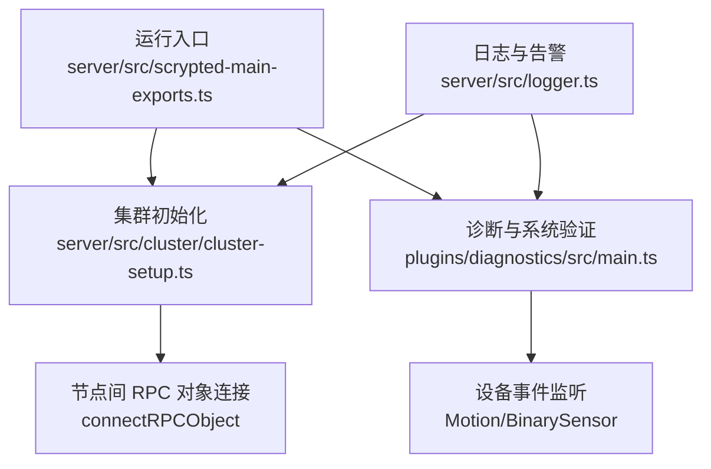
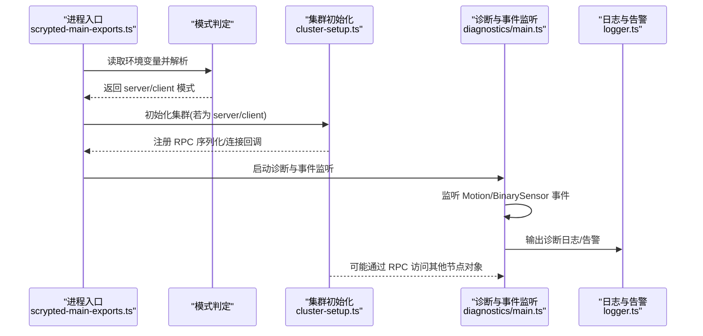
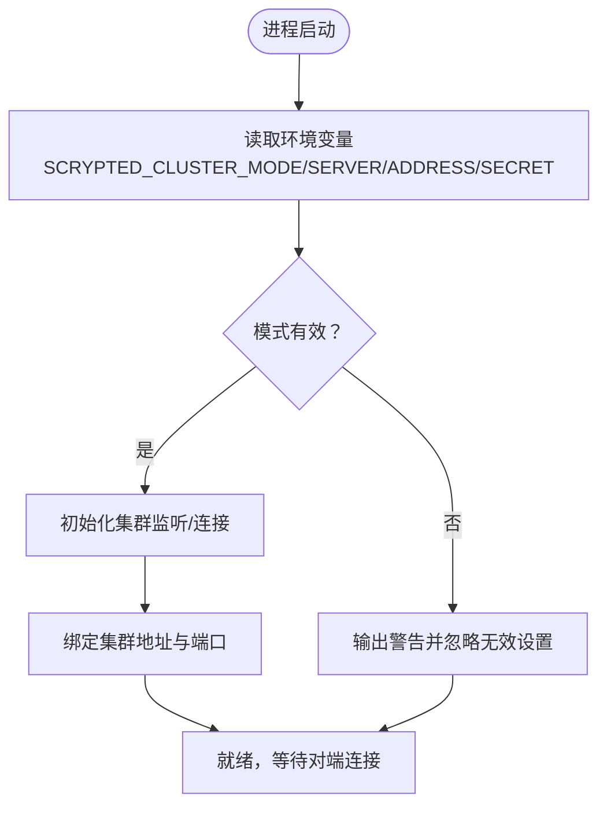
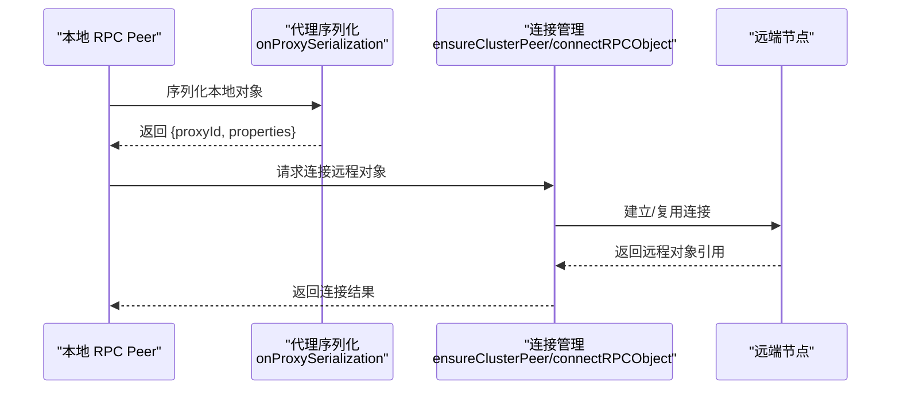
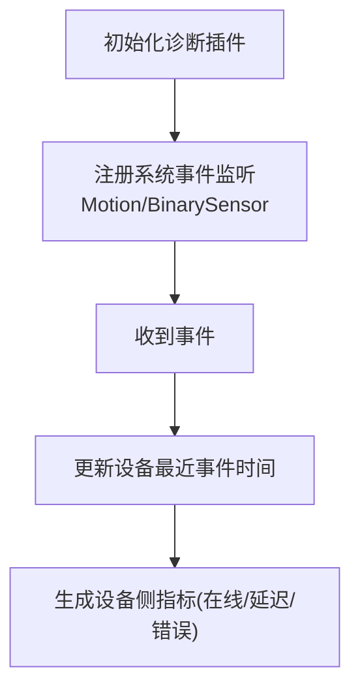
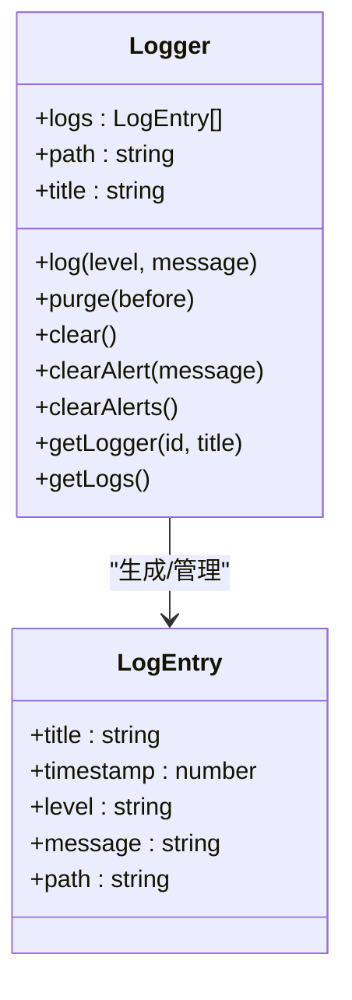
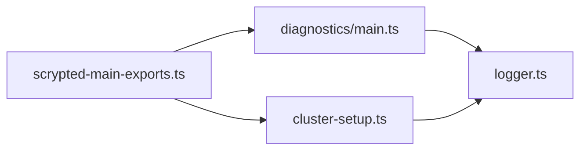

# 集群指标采集

<cite>
**本文引用的文件**   
- [plugins/diagnostics/src/main.ts](file://plugins/diagnostics/src/main.ts)
- [server/src/cluster/cluster-setup.ts](file://server/src/cluster/cluster-setup.ts)
- [server/src/scrypted-main-exports.ts](file://server/src/scrypted-main-exports.ts)
- [server/src/logger.ts](file://server/src/logger.ts)
</cite>

## 目录
1. [简介](#简介)
2. [项目结构](#项目结构)
3. [核心组件](#核心组件)
4. [架构总览](#架构总览)
5. [详细组件分析](#详细组件分析)
6. [依赖分析](#依赖分析)
7. [性能考量](#性能考量)
8. [故障排查指南](#故障排查指南)
9. [结论](#结论)
10. [附录](#附录)

## 简介
本文件面向 Scrypted 的集群监控与指标采集，目标是建立一套完整的指标体系，覆盖节点健康、系统资源（CPU/内存/磁盘/网络）、设备运行状态（在线、连接数、数据传输、错误率、延迟）、服务可用性（API 响应时间、请求成功率、重启次数、插件状态）等维度，并给出指标采集机制（定时采样、事件触发、批量上报、增量统计）、数据结构与格式（时间戳、标签、数值类型、单位换算）、存储与查询接口（时序数据库集成、索引策略、查询优化、历史数据保留），以及配置示例与最佳实践（采样频率、阈值、聚合策略）。  
当前仓库中与监控/诊断/集群相关的核心实现集中在诊断插件、集群初始化与日志模块。本文在不臆测未出现的实现前提下，基于现有代码进行系统化梳理与扩展设计。

## 项目结构
围绕“指标采集”的关键目录与文件如下：
- 诊断与系统验证：plugins/diagnostics/src/main.ts 提供系统与设备能力验证，可作为指标采集的来源与触发点。
- 集群初始化与通信：server/src/cluster/cluster-setup.ts 负责集群模式的启动、节点发现、对象跨节点访问与连接管理。
- 运行入口与模式选择：server/src/scrypted-main-exports.ts 根据环境变量决定以单机或集群模式启动。
- 日志与告警：server/src/logger.ts 提供统一日志结构与告警清理能力，可用于事件驱动型指标采集。

**图表来源**
- [server/src/scrypted-main-exports.ts:17-84](file://server/src/scrypted-main-exports.ts#L17-L84)
- [server/src/cluster/cluster-setup.ts:38-399](file://server/src/cluster/cluster-setup.ts#L38-L399)
- [plugins/diagnostics/src/main.ts:55-76](file://plugins/diagnostics/src/main.ts#L55-L76)
- [server/src/logger.ts:19-92](file://server/src/logger.ts#L19-L92)

**章节来源**
- [server/src/scrypted-main-exports.ts:17-84](file://server/src/scrypted-main-exports.ts#L17-L84)
- [server/src/cluster/cluster-setup.ts:38-399](file://server/src/cluster/cluster-setup.ts#L38-L399)
- [plugins/diagnostics/src/main.ts:55-76](file://plugins/diagnostics/src/main.ts#L55-L76)
- [server/src/logger.ts:19-92](file://server/src/logger.ts#L19-L92)

## 核心组件
- 运行入口与模式判定：根据环境变量选择单机或集群模式启动，为指标采集提供运行时上下文。
- 集群初始化与对象连接：负责节点间 RPC 对象的序列化、校验与跨节点连接，是服务可用性与节点健康指标的数据来源。
- 诊断与事件监听：通过系统事件监听运动与按键事件，作为设备侧指标（如最近活动时间）的触发器。
- 日志与告警：统一的日志结构与告警清理逻辑，支持事件驱动型指标的落盘与查询。

**章节来源**
- [server/src/scrypted-main-exports.ts:75-83](file://server/src/scrypted-main-exports.ts#L75-L83)
- [server/src/cluster/cluster-setup.ts:28-300](file://server/src/cluster/cluster-setup.ts#L28-L300)
- [plugins/diagnostics/src/main.ts:55-76](file://plugins/diagnostics/src/main.ts#L55-L76)
- [server/src/logger.ts:19-92](file://server/src/logger.ts#L19-L92)

## 架构总览
下图展示从运行入口到集群初始化、诊断事件监听与日志输出的整体流程，体现指标采集的触发路径与数据通路。

**图表来源**
- [server/src/scrypted-main-exports.ts:75-83](file://server/src/scrypted-main-exports.ts#L75-L83)
- [server/src/cluster/cluster-setup.ts:38-399](file://server/src/cluster/cluster-setup.ts#L38-L399)
- [plugins/diagnostics/src/main.ts:55-76](file://plugins/diagnostics/src/main.ts#L55-L76)
- [server/src/logger.ts:33-46](file://server/src/logger.ts#L33-L46)

## 详细组件分析

### 组件一：运行入口与集群模式
- 功能要点
  - 解析环境变量，决定是否以集群模式启动。
  - 在集群模式下，负责节点地址、端口、密钥的校验与绑定。
  - 为后续指标采集提供运行时上下文（例如节点角色、连接状态）。
- 关键行为
  - 模式判定与参数校验，确保集群地址、端口、密钥一致性。
  - 为集群 RPC 对象提供序列化与连接回调，支撑服务可用性指标。
- 指标关联
  - 节点健康：通过连接建立、对象可达性、RPC 成功/失败计数。
  - 服务可用性：RPC 对象连接耗时、连接失败次数、重连次数。

**图表来源**
- [server/src/scrypted-main-exports.ts:75-83](file://server/src/scrypted-main-exports.ts#L75-L83)
- [server/src/cluster/cluster-setup.ts:403-462](file://server/src/cluster/cluster-setup.ts#L403-L462)
- [server/src/cluster/cluster-setup.ts:464-497](file://server/src/cluster/cluster-setup.ts#L464-L497)

**章节来源**
- [server/src/scrypted-main-exports.ts:75-83](file://server/src/scrypted-main-exports.ts#L75-L83)
- [server/src/cluster/cluster-setup.ts:403-462](file://server/src/cluster/cluster-setup.ts#L403-L462)
- [server/src/cluster/cluster-setup.ts:464-497](file://server/src/cluster/cluster-setup.ts#L464-L497)

### 组件二：集群初始化与对象连接
- 功能要点
  - 生成稳定的代理 ID，用于跨节点对象定位。
  - 通过哈希校验确保对象归属与安全性。
  - 支持线程间 IPC 与远端节点连接，提供 connectRPCObject 回调。
- 关键行为
  - onProxySerialization：为本地对象生成包含集群信息的属性，确保跨节点一致性。
  - connectRPCObject：根据目标地址与端口建立连接，解析远程对象。
  - ensureClusterPeer：缓存并复用已建立的节点连接。
- 指标关联
  - 节点健康：连接建立耗时、连接失败次数、连接存活时长。
  - 服务可用性：RPC 对象可达性、对象解析耗时、对象不存在错误计数。

**图表来源**
- [server/src/cluster/cluster-setup.ts:302-335](file://server/src/cluster/cluster-setup.ts#L302-L335)
- [server/src/cluster/cluster-setup.ts:259-300](file://server/src/cluster/cluster-setup.ts#L259-L300)
- [server/src/cluster/cluster-setup.ts:78-115](file://server/src/cluster/cluster-setup.ts#L78-L115)

**章节来源**
- [server/src/cluster/cluster-setup.ts:28-300](file://server/src/cluster/cluster-setup.ts#L28-L300)
- [server/src/cluster/cluster-setup.ts:302-335](file://server/src/cluster/cluster-setup.ts#L302-L335)
- [server/src/cluster/cluster-setup.ts:78-115](file://server/src/cluster/cluster-setup.ts#L78-L115)

### 组件三：诊断与事件监听（设备侧指标）
- 功能要点
  - 监听 MotionSensor 与 BinarySensor 事件，记录最近事件时间，作为设备活跃度与延迟的参考。
  - 提供系统与设备验证流程，可作为指标采集的触发器与校验点。
- 关键行为
  - 事件监听：在构造函数中注册系统事件监听，更新设备最近事件时间。
  - 设备验证：检查截图、流配置、编解码等，间接反映设备可用性与性能。
- 指标关联
  - 设备在线状态：通过事件是否在窗口内出现判断。
  - 延迟：事件从产生到被采集的时间差。
  - 错误率：设备验证失败次数/总次数。

**图表来源**
- [plugins/diagnostics/src/main.ts:55-76](file://plugins/diagnostics/src/main.ts#L55-L76)
- [plugins/diagnostics/src/main.ts:227-384](file://plugins/diagnostics/src/main.ts#L227-L384)

**章节来源**
- [plugins/diagnostics/src/main.ts:55-76](file://plugins/diagnostics/src/main.ts#L55-L76)
- [plugins/diagnostics/src/main.ts:227-384](file://plugins/diagnostics/src/main.ts#L227-L384)

### 组件四：日志与告警（事件驱动指标）
- 功能要点
  - 统一日志结构（标题、时间戳、级别、消息、路径），便于事件驱动指标的落盘与检索。
  - 提供告警清理能力，避免指标重复统计。
- 关键行为
  - 日志写入：在 log 方法中生成结构化日志条目。
  - 子日志器：按路径层级组织日志，便于聚合与查询。
- 指标关联
  - 事件驱动：将诊断与集群异常转化为日志事件，作为错误率、告警次数等指标的来源。

**图表来源**
- [server/src/logger.ts:19-92](file://server/src/logger.ts#L19-L92)

**章节来源**
- [server/src/logger.ts:19-92](file://server/src/logger.ts#L19-L92)

## 依赖分析
- 运行入口依赖集群初始化模块以确定运行模式；集群初始化模块依赖 RPC 序列化与连接回调；诊断模块依赖系统事件与日志模块；日志模块为指标采集提供统一的数据载体。

**图表来源**
- [server/src/scrypted-main-exports.ts:75-83](file://server/src/scrypted-main-exports.ts#L75-L83)
- [server/src/cluster/cluster-setup.ts:38-399](file://server/src/cluster/cluster-setup.ts#L38-L399)
- [plugins/diagnostics/src/main.ts:55-76](file://plugins/diagnostics/src/main.ts#L55-L76)
- [server/src/logger.ts:19-92](file://server/src/logger.ts#L19-L92)

**章节来源**
- [server/src/scrypted-main-exports.ts:75-83](file://server/src/scrypted-main-exports.ts#L75-L83)
- [server/src/cluster/cluster-setup.ts:38-399](file://server/src/cluster/cluster-setup.ts#L38-L399)
- [plugins/diagnostics/src/main.ts:55-76](file://plugins/diagnostics/src/main.ts#L55-L76)
- [server/src/logger.ts:19-92](file://server/src/logger.ts#L19-L92)

## 性能考量
- 采样频率与阈值
  - 节点健康与服务可用性：建议每 10–30 秒采样一次，避免频繁连接检查造成额外负载。
  - 设备侧指标：事件驱动优先，仅在事件到达时更新，减少轮询开销。
- 聚合策略
  - 将高频事件（如连接失败）按分钟/小时聚合，降低存储压力。
- 网络与 I/O
  - 集群 RPC 连接采用连接复用与缓存，避免重复握手。
  - 日志写入采用结构化格式，便于后续解析与压缩。

## 故障排查指南
- 集群模式配置
  - 若仅设置了集群地址而未设置模式，系统会发出警告并忽略该设置。
  - 模式必须为 server 或 client，且 client 必须提供有效的 server:port。
- 连接失败
  - 检查远端地址与端口是否可达，确认 connectRPCObject 是否返回对象。
  - 查看日志中是否存在“failure rpc”等错误信息。
- 设备事件缺失
  - 确认系统事件监听是否生效，检查 Motion/BinarySensor 事件是否在预期时间内到达。
- 日志与告警
  - 使用日志模块的清理方法清除过期告警，避免重复统计。

**章节来源**
- [server/src/cluster/cluster-setup.ts:403-462](file://server/src/cluster/cluster-setup.ts#L403-L462)
- [server/src/cluster/cluster-setup.ts:284-299](file://server/src/cluster/cluster-setup.ts#L284-L299)
- [plugins/diagnostics/src/main.ts:55-76](file://plugins/diagnostics/src/main.ts#L55-L76)
- [server/src/logger.ts:48-75](file://server/src/logger.ts#L48-L75)

## 结论
本文件基于现有代码梳理了 Scrypted 集群监控与指标采集的关键路径：运行入口与集群初始化提供节点健康与服务可用性基础，诊断模块与事件监听提供设备侧指标来源，日志模块为事件驱动指标提供统一载体。结合采样频率、阈值与聚合策略，可在保证可观测性的前提下控制资源消耗。后续可在此基础上扩展系统资源指标（CPU/内存/磁盘/网络）与设备数据传输量、错误率、延迟等指标，并完善存储与查询接口设计。

## 附录
- 指标采集机制建议
  - 定时采样：节点健康、系统资源使用率。
  - 事件触发：设备在线状态、连接数变化、错误事件。
  - 批量上报：将短周期高频事件聚合后批量上报，降低网络与存储压力。
  - 增量统计：对累计计数类指标（错误总数、重启次数）采用增量方式，避免全量扫描。
- 数据结构与格式
  - 时间戳：统一使用毫秒级时间戳。
  - 标签：节点标识、设备 ID、事件类型、级别等。
  - 数值类型：整数（计数）、浮点（百分比/速率）、字符串（状态）。
  - 单位换算：CPU 百分比、内存字节、带宽比特/字节、时间毫秒/秒。
- 存储与查询接口
  - 时序数据库：建议采用具备高写入吞吐与高效范围查询的 TSDB。
  - 索引策略：按时间、节点、设备、指标类型建立多维索引。
  - 查询优化：支持降采样、滑动窗口聚合、近实时与历史数据分离。
  - 历史数据保留：按指标重要性与合规要求设置保留周期。