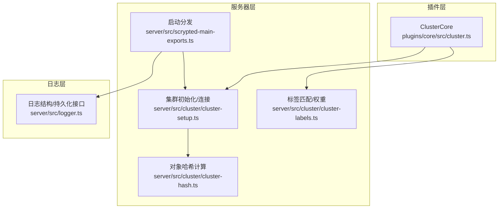
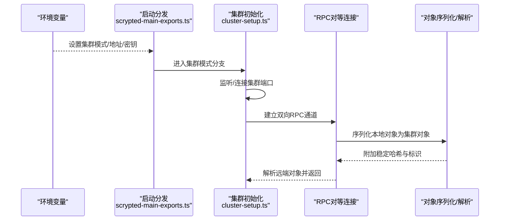
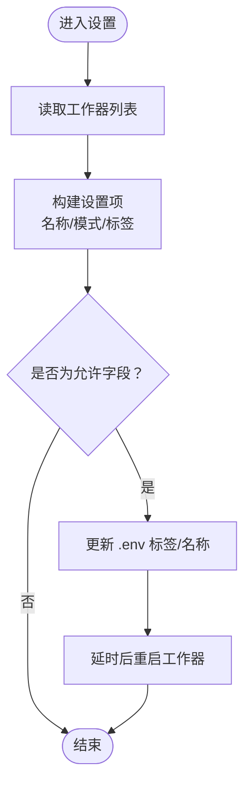
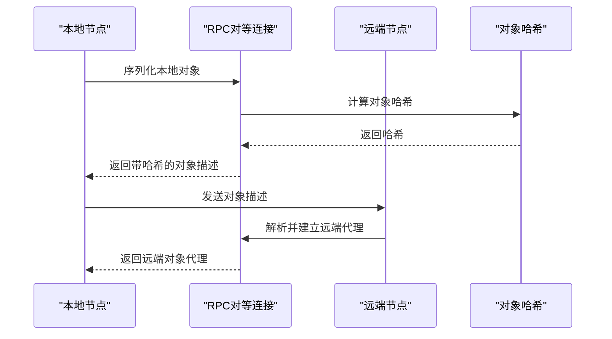
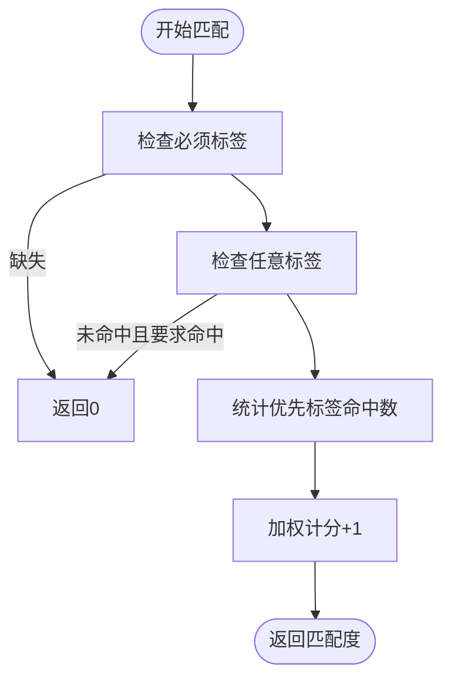
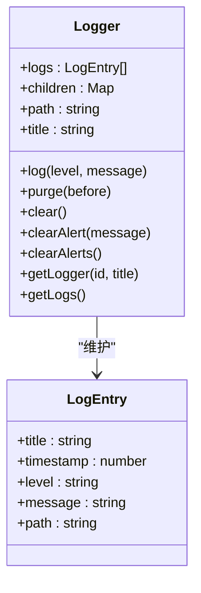
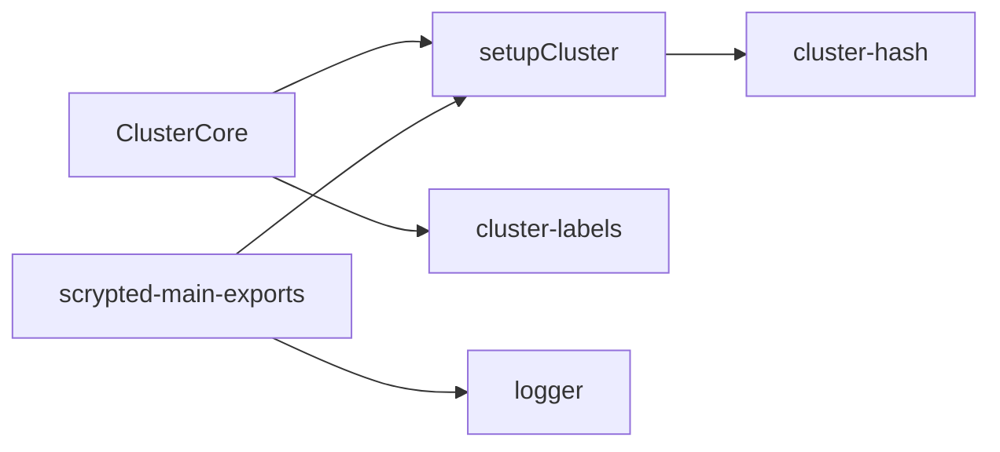

# 集群监控与告警

<cite>
**本文引用的文件**
- [plugins/core/src/cluster.ts](file://plugins/core/src/cluster.ts)
- [server/src/cluster/cluster-setup.ts](file://server/src/cluster/cluster-setup.ts)
- [server/src/cluster/cluster-labels.ts](file://server/src/cluster/cluster-labels.ts)
- [server/src/cluster/cluster-hash.ts](file://server/src/cluster/cluster-hash.ts)
- [server/src/logger.ts](file://server/src/logger.ts)
- [server/src/scrypted-main-exports.ts](file://server/src/scrypted-main-exports.ts)
</cite>

## 目录
1. [简介](#简介)
2. [项目结构](#项目结构)
3. [核心组件](#核心组件)
4. [架构总览](#架构总览)
5. [详细组件分析](#详细组件分析)
6. [依赖关系分析](#依赖关系分析)
7. [性能考量](#性能考量)
8. [故障排查指南](#故障排查指南)
9. [结论](#结论)
10. [附录](#附录)

## 简介
本指南面向 Scrypted 的集群模式（多节点/多工作进程）监控与告警，围绕以下目标展开：构建统一的监控指标体系（节点状态、资源使用、网络性能、服务可用性）、明确监控数据采集与存储策略、设计可操作的告警规则与通知流程、提供仪表板配置思路与日志管理策略，并给出性能分析与故障预警方法。文档以仓库中与集群、标签匹配、对象序列化与日志记录相关的源码为依据，结合概念性图表帮助读者快速落地。

## 项目结构
与集群监控密切相关的代码主要分布在以下位置：
- 插件层：集群工作器配置与标签设置入口
- 服务器层：集群初始化、连接建立、对象跨节点转发、标签匹配与权重
- 日志层：统一日志结构与持久化接口

**图示来源**
- [plugins/core/src/cluster.ts:1-163](file://plugins/core/src/cluster.ts#L1-L163)
- [server/src/cluster/cluster-setup.ts:1-498](file://server/src/cluster/cluster-setup.ts#L1-L498)
- [server/src/cluster/cluster-labels.ts:1-58](file://server/src/cluster/cluster-labels.ts#L1-L58)
- [server/src/cluster/cluster-hash.ts:1-8](file://server/src/cluster/cluster-hash.ts#L1-L8)
- [server/src/logger.ts:1-93](file://server/src/logger.ts#L1-L93)
- [server/src/scrypted-main-exports.ts:1-87](file://server/src/scrypted-main-exports.ts#L1-L87)

**章节来源**
- [plugins/core/src/cluster.ts:1-163](file://plugins/core/src/cluster.ts#L1-L163)
- [server/src/cluster/cluster-setup.ts:1-498](file://server/src/cluster/cluster-setup.ts#L1-L498)
- [server/src/cluster/cluster-labels.ts:1-58](file://server/src/cluster/cluster-labels.ts#L1-L58)
- [server/src/cluster/cluster-hash.ts:1-8](file://server/src/cluster/cluster-hash.ts#L1-L8)
- [server/src/logger.ts:1-93](file://server/src/logger.ts#L1-L93)
- [server/src/scrypted-main-exports.ts:1-87](file://server/src/scrypted-main-exports.ts#L1-L87)

## 核心组件
- 集群核心（ClusterCore）
  - 提供工作器名称与标签的读写设置，支持通过环境变量文件更新标签并触发工作器重启。
  - 关键路径参考：[plugins/core/src/cluster.ts:27-101](file://plugins/core/src/cluster.ts#L27-L101)，[plugins/core/src/cluster.ts:103-155](file://plugins/core/src/cluster.ts#L103-L155)

- 集群初始化与连接（setupCluster）
  - 负责监听/连接集群端口、建立 RPC 对等连接、代理对象序列化与跨节点对象解析、线程间 IPC 桥接。
  - 关键路径参考：[server/src/cluster/cluster-setup.ts:38-399](file://server/src/cluster/cluster-setup.ts#L38-L399)

- 标签匹配与权重（cluster-labels）
  - 实现标签“必须满足/任意满足/优先级”匹配逻辑，以及工作器权重与是否需要 fork 工作器的判断。
  - 关键路径参考：[server/src/cluster/cluster-labels.ts:4-35](file://server/src/cluster/cluster-labels.ts#L4-L35)，[server/src/cluster/cluster-labels.ts:37-57](file://server/src/cluster/cluster-labels.ts#L37-L57)

- 对象哈希（cluster-hash）
  - 基于集群对象信息与密钥生成稳定哈希，用于连接校验。
  - 关键路径参考：[server/src/cluster/cluster-hash.ts:4-7](file://server/src/cluster/cluster-hash.ts#L4-L7)

- 日志系统（logger）
  - 统一日志条目结构，提供内存日志队列、子日志器、清理与告警清除接口。
  - 关键路径参考：[server/src/logger.ts:11-92](file://server/src/logger.ts#L11-L92)

- 启动分发（scrypted-main-exports）
  - 根据环境变量决定进入集群客户端或服务端启动流程；加载 .env 并进行基础运行时准备。
  - 关键路径参考：[server/src/scrypted-main-exports.ts:71-83](file://server/src/scrypted-main-exports.ts#L71-L83)

**章节来源**
- [plugins/core/src/cluster.ts:1-163](file://plugins/core/src/cluster.ts#L1-L163)
- [server/src/cluster/cluster-setup.ts:1-498](file://server/src/cluster/cluster-setup.ts#L1-L498)
- [server/src/cluster/cluster-labels.ts:1-58](file://server/src/cluster/cluster-labels.ts#L1-L58)
- [server/src/cluster/cluster-hash.ts:1-8](file://server/src/cluster/cluster-hash.ts#L1-L8)
- [server/src/logger.ts:1-93](file://server/src/logger.ts#L1-L93)
- [server/src/scrypted-main-exports.ts:1-87](file://server/src/scrypted-main-exports.ts#L1-L87)

## 架构总览
下图展示了集群模式下的启动、连接与对象跨节点访问的关键流程。

**图示来源**
- [server/src/scrypted-main-exports.ts:71-83](file://server/src/scrypted-main-exports.ts#L71-L83)
- [server/src/cluster/cluster-setup.ts:38-399](file://server/src/cluster/cluster-setup.ts#L38-L399)
- [server/src/cluster/cluster-hash.ts:4-7](file://server/src/cluster/cluster-hash.ts#L4-L7)

## 详细组件分析

### 组件一：集群核心（ClusterCore）
- 角色与职责
  - 作为集群工作器的可配置入口，允许用户修改工作器名称与标签，标签变更会写入环境变量文件并触发对应工作器重启。
- 关键流程
  - 获取设置：读取当前工作器列表与标签集合，构造设置项。
  - 写入设置：解析键名定位工作器，更新 .env 中的标签与名称，延时后重启对应服务。
- 可观测性要点
  - 名称与标签变化属于高影响配置，应纳入审计与告警范围。
  - 重启动作需配合健康检查与服务可用性监控。

**图示来源**
- [plugins/core/src/cluster.ts:27-101](file://plugins/core/src/cluster.ts#L27-L101)
- [plugins/core/src/cluster.ts:103-155](file://plugins/core/src/cluster.ts#L103-L155)

**章节来源**
- [plugins/core/src/cluster.ts:1-163](file://plugins/core/src/cluster.ts#L1-L163)

### 组件二：集群初始化与连接（setupCluster）
- 角色与职责
  - 负责集群监听/连接、RPC 对等连接建立、对象序列化与反序列化、线程间 IPC 桥接。
- 关键流程
  - 初始化集群：根据环境变量确定模式与端口，启动监听或连接到远端。
  - 对象序列化：为本地对象生成稳定 proxyId，并附加集群标识与哈希。
  - 对象解析：在跨节点访问时，解析远端对象并建立代理。
  - 线程桥接：主/子线程之间通过 MessagePort 建立消息通道，实现 IPC 对接。
- 可观测性要点
  - 连接建立与断开事件、RPC 失败、IPC 错误均应记录并告警。
  - 对象解析失败应有重试与降级策略。

**图示来源**
- [server/src/cluster/cluster-setup.ts:259-300](file://server/src/cluster/cluster-setup.ts#L259-L300)
- [server/src/cluster/cluster-hash.ts:4-7](file://server/src/cluster/cluster-hash.ts#L4-L7)

**章节来源**
- [server/src/cluster/cluster-setup.ts:1-498](file://server/src/cluster/cluster-setup.ts#L1-L498)
- [server/src/cluster/cluster-hash.ts:1-8](file://server/src/cluster/cluster-hash.ts#L1-L8)

### 组件三：标签匹配与权重（cluster-labels）
- 角色与职责
  - 实现“必须满足/任意满足/优先满足”的标签匹配算法，并提供权重与 fork 判断。
- 关键流程
  - 匹配：遍历 require/any/prefer 列表，计算匹配度。
  - 权重：从环境变量读取权重，默认为 1。
  - fork 判断：当标签不匹配或显式指定工作器 ID 时，需要 fork 新的工作器。
- 可观测性要点
  - 标签匹配结果可用于路由决策的可观测性指标，便于定位调度问题。

**图示来源**
- [server/src/cluster/cluster-labels.ts:4-35](file://server/src/cluster/cluster-labels.ts#L4-L35)

**章节来源**
- [server/src/cluster/cluster-labels.ts:1-58](file://server/src/cluster/cluster-labels.ts#L1-L58)

### 组件四：日志系统（logger）
- 角色与职责
  - 提供统一的日志条目结构、内存日志队列、子日志器树、清理与告警清除接口。
- 关键流程
  - 记录日志：生成时间戳与路径，推入内存队列并广播事件。
  - 清理：按时间戳清理过期日志，递归清理子日志器。
  - 告警：基于路径与消息生成唯一 ID，支持清除特定告警。
- 可观测性要点
  - 日志级别与路径应与告警规则联动，支持按模块/路径过滤与聚合。

**图示来源**
- [server/src/logger.ts:11-92](file://server/src/logger.ts#L11-L92)

**章节来源**
- [server/src/logger.ts:1-93](file://server/src/logger.ts#L1-L93)

## 依赖关系分析
- ClusterCore 依赖系统管理器获取集群工作器列表与环境控制能力，用于读取/写入 .env。
- setupCluster 依赖 cluster-hash 生成对象哈希，确保跨节点对象访问的安全性。
- cluster-labels 与环境变量交互，决定是否需要 fork 工作器及权重。
- scrypted-main-exports 在启动阶段根据环境变量选择集群模式，进而进入不同的启动流程。

**图示来源**
- [plugins/core/src/cluster.ts:1-163](file://plugins/core/src/cluster.ts#L1-L163)
- [server/src/cluster/cluster-setup.ts:1-498](file://server/src/cluster/cluster-setup.ts#L1-L498)
- [server/src/cluster/cluster-hash.ts:1-8](file://server/src/cluster/cluster-hash.ts#L1-L8)
- [server/src/cluster/cluster-labels.ts:1-58](file://server/src/cluster/cluster-labels.ts#L1-L58)
- [server/src/logger.ts:1-93](file://server/src/logger.ts#L1-L93)
- [server/src/scrypted-main-exports.ts:1-87](file://server/src/scrypted-main-exports.ts#L1-L87)

**章节来源**
- [plugins/core/src/cluster.ts:1-163](file://plugins/core/src/cluster.ts#L1-L163)
- [server/src/cluster/cluster-setup.ts:1-498](file://server/src/cluster/cluster-setup.ts#L1-L498)
- [server/src/cluster/cluster-labels.ts:1-58](file://server/src/cluster/cluster-labels.ts#L1-L58)
- [server/src/cluster/cluster-hash.ts:1-8](file://server/src/cluster/cluster-hash.ts#L1-L8)
- [server/src/logger.ts:1-93](file://server/src/logger.ts#L1-L93)
- [server/src/scrypted-main-exports.ts:1-87](file://server/src/scrypted-main-exports.ts#L1-L87)

## 性能考量
- 连接与序列化
  - 对象序列化与哈希计算为轻量操作，但频繁跨节点访问可能带来网络与 CPU 开销。建议对热点对象进行缓存与去重。
- 线程桥接
  - 主/子线程通过 MessagePort 通信，避免不必要的跨节点调用，提升本地访问性能。
- 标签匹配
  - 标签匹配为 O(n) 操作，建议合理设置标签数量与层级，避免过度复杂导致调度延迟。
- 日志与告警
  - 日志写入为内存队列，注意定期清理与导出，避免内存膨胀；告警清除接口可用于自动化恢复后的清理。

[本节为通用性能建议，无需具体文件引用]

## 故障排查指南
- 启动与模式
  - 若设置了集群模式但缺少密钥或地址非法，启动将报错。请检查环境变量配置。
  - 参考路径：[server/src/cluster/cluster-setup.ts:403-462](file://server/src/cluster/cluster-setup.ts#L403-L462)，[server/src/scrypted-main-exports.ts:71-83](file://server/src/scrypted-main-exports.ts#L71-L83)
- 连接与对象解析
  - 对象解析失败通常由远端不可达或哈希校验失败引起。检查网络连通性与密钥一致性。
  - 参考路径：[server/src/cluster/cluster-setup.ts:259-300](file://server/src/cluster/cluster-setup.ts#L259-L300)，[server/src/cluster/cluster-hash.ts:4-7](file://server/src/cluster/cluster-hash.ts#L4-L7)
- 日志与告警
  - 使用日志接口记录关键事件，必要时通过告警清除接口清理已恢复的告警。
  - 参考路径：[server/src/logger.ts:33-75](file://server/src/logger.ts#L33-L75)

**章节来源**
- [server/src/cluster/cluster-setup.ts:403-462](file://server/src/cluster/cluster-setup.ts#L403-L462)
- [server/src/cluster/cluster-setup.ts:259-300](file://server/src/cluster/cluster-setup.ts#L259-L300)
- [server/src/cluster/cluster-hash.ts:4-7](file://server/src/cluster/cluster-hash.ts#L4-L7)
- [server/src/logger.ts:33-75](file://server/src/logger.ts#L33-L75)
- [server/src/scrypted-main-exports.ts:71-83](file://server/src/scrypted-main-exports.ts#L71-L83)

## 结论
通过对 ClusterCore、setupCluster、cluster-labels、cluster-hash 与 logger 的深入分析，可以构建覆盖节点状态、资源使用、网络性能与服务可用性的监控体系。结合标签匹配与对象序列化机制，能够实现稳定的跨节点服务发现与访问。建议将关键配置变更、连接状态、对象解析成功率与日志级别纳入告警与仪表板，形成闭环的监控与告警实践。

[本节为总结性内容，无需具体文件引用]

## 附录
- 监控指标建议
  - 节点状态：工作器存活、标签匹配度、fork 次数与成功率
  - 资源使用：CPU、内存、磁盘、网络带宽
  - 网络性能：连接建立耗时、RPC 调用延迟、丢包率
  - 服务可用性：对象解析成功率、线程桥接可用性、日志级别分布
- 告警规则建议
  - 阈值：连接失败率、RPC 调用超时、日志错误级别占比
  - 级别：致命、严重、警告、信息
  - 通知：邮件、IM、电话；支持静默窗口与抑制规则
- 仪表板建议
  - 关键指标：节点在线率、平均响应时间、错误率、日志量
  - 趋势分析：近 1 小时/1 天/1 周趋势
  - 异常检测：基于历史基线的离群点检测
- 日志管理
  - 级别：调试、信息、警告、错误
  - 轮转：按大小/时间轮转，保留天数
  - 聚合：集中式日志收集与索引
  - 搜索：基于路径、级别、关键词的检索
- 性能分析
  - 响应时间：RPC 调用链路耗时拆解
  - 吞吐量：每秒事务数与并发连接数
  - 资源利用率：CPU/内存/IO 利用率与峰值
  - 瓶颈识别：热点函数与阻塞点定位
- 故障监控与预警
  - 异常检测：连接抖动、解析失败激增
  - 根因分析：日志时间轴与调用链关联
  - 自动恢复：工作器重启、标签修正回滚
  - 人工干预：告警升级与值班流程
- 工具集成
  - 外部监控：Prometheus/Grafana、ELK、Zabbix
  - 自定义指标：通过日志与 RPC 统计导出
  - 第三方告警：Webhook/集成平台
- 最佳实践
  - 策略：明确指标定义与责任矩阵
  - 告警：减少噪音，分级处置
  - 容量：基于历史趋势与峰值规划

[本节为通用指导，无需具体文件引用]